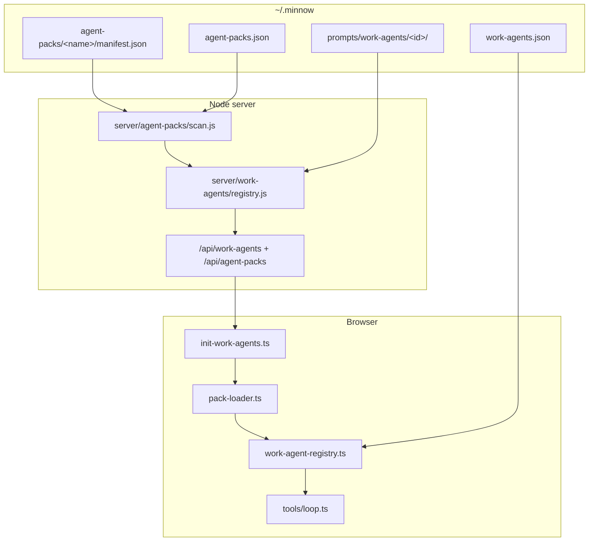

# Feature #16 — Plugin API for agents (agent packs)

**Roadmap:** [`documentation/plans/feature-audit-roadmap.md`](../feature-audit-roadmap.md) §16  
**Architecture context:** [`documentation/context.md`](../../context.md) — Work Agents (Step 08), Skills framework (Step 13), `~/.minnow` layout  
**Status:** Built (MIN-52)  
**Primary deliverables:** `agent-pack.schema.json`, `src/agents/pack-loader.ts`, `~/.minnow/agent-packs/<name>/`, settings + API merge into existing work-agent flow

---

## Summary

Minnow already ships **work agents** as repo prompts plus per-user overrides. Feature #16 adds a **drop-in agent pack** format: a self-contained folder under `~/.minnow/agent-packs/<pack-name>/` with a JSON manifest (system prompt references, tool subset, model binding, context strategy) that the app **discovers, validates, merges into the work-agent registry**, and surfaces in **Settings**.

Packs are the open-source distribution path for third-party agents without editing the Minnow repo or hand-copying files into `prompts/work-agents/`.

---

## YAML todos

```yaml
todos:
  - id: f16-schema
    content: "Add agent-pack.schema.json + pack types (AgentPackManifest, PackAgentEntry)"
    status: pending
  - id: f16-paths
    content: "Add server/agent-packs/paths.js (MINNOW_HOME/agent-packs, id validation)"
    status: pending
  - id: f16-scan
    content: "Implement server/agent-packs/scan.js + validate manifest against schema"
    status: pending
  - id: f16-api
    content: "Expose GET /api/agent-packs, GET /api/agent-packs/:packId, PATCH enable"
    status: pending
  - id: f16-pack-loader
    content: "Implement src/agents/pack-loader.ts (merge packs → WorkAgentDefinition[])"
    status: pending
  - id: f16-registry-merge
    content: "Extend work-agent-registry + server registry.js to include pack agents"
    status: pending
  - id: f16-prompt-resolve
    content: "Resolve pack prompt files in readWorkAgentPrompt / compose path"
    status: pending
  - id: f16-loop-hooks
    content: "Wire pack allowedTools + contextStrategy in loop.ts / token-estimate"
    status: pending
  - id: f16-settings-ui
    content: "Settings section — list packs, enable/disable, open folder, import copy"
    status: pending
  - id: f16-template
    content: "Ship _template pack under documentation or ~/.minnow scaffold on first scan"
    status: pending
  - id: f16-tests
    content: "Add test/fixtures/agent-packs + pack-loader + server scan tests"
    status: pending
  - id: f16-docs
    content: "Update context.md (~/.minnow layout, Work Agents, APIs) + pack author README"
    status: pending
```

---

## Current state

| Area | What exists today | Location |
|------|-------------------|----------|
| Shipped work agents | `agent.full.md` / `agent.lite.md` per id, `registry.json` ordering | `src/chat/prompts/work-agents/` |
| Client registry | Vite glob at boot + merge `work-agents.json` overrides | `src/agents/work-agent-registry.ts`, `init-work-agents.ts` |
| Server registry | FS scan built-ins + user prompt overrides | `server/work-agents/registry.js` |
| User scalar overrides | `providerId`, `modelId`, `disabled`, `promptOverride` | `~/.minnow/work-agents.json` |
| User prompt overrides | Full/lite markdown files | `~/.minnow/prompts/work-agents/<id>/` |
| HTTP API | List/get/patch agents; get/put prompt | `/api/work-agents/*` — `server/work-agents/routes.js` |
| Per-turn binding | Override → agent def → chat model | `resolve-work-agent-binding.ts`, `src/tools/loop.ts` |
| Tool subset | `allowedTools` on agent front matter | `work-agent-meta-parse.ts`, filtered in `loop.ts` |
| Sub-agents (related) | Separate JSON config, not pack-based | `sub-agents.json`, `src/agents/sub-agent-config.ts` |
| Comparable pattern | Skills: folder + `SKILL.md` + scan + user wins on id | `server/skills/scan.js`, `src/skills/loader.ts` |

**Not present:** `~/.minnow/agent-packs/`, manifest schema, pack loader, pack settings UI, install/import flow, or any `agent-pack` / `pack-loader` module.

---

## Gap

From the audit (item #16):

1. **No package install path** — authors cannot ship a folder users drop in; they must fork prompts into `~/.minnow/prompts/work-agents/` manually.
2. **No plugin manifest** — binding, tools, and prompt paths are split across markdown front matter and `work-agents.json` with no pack-level metadata (version, author, dependencies, enable flag).
3. **No loader merge** — built-in registry and user overrides do not scan a third root.
4. **No settings UI** — users cannot see installed packs, enable/disable them, or diagnose validation errors.

**Out of scope for v1 (explicit):** npm registry, signed packs, remote install, sub-agent pack types, headless CLI pack flags (#18), full context-budget enforcement (#3 — manifest field may be stored and ignored until #3 ships).

---

## Goals

1. **Drop-in distribution:** Copy or unzip `my-pack/` → `~/.minnow/agent-packs/my-pack/` → agents appear in composer/settings after `npm start`.
2. **Single manifest:** `manifest.json` declares pack id, version, agents[], default model binding, tool allowlist, prompt file paths, and context strategy hints.
3. **Safe merge:** Pack agents register as work agents with stable ids; collisions with built-ins are rejected or namespaced; user `work-agents.json` still overrides scalars.
4. **Same send path:** No parallel agent runtime — packs feed `WorkAgentDefinition` + prompt resolution used by `resolveActiveWorkAgent()` and `sendMessageWithTools`.
5. **Authoring ergonomics:** JSON Schema + `_template` pack + validation errors surfaced in Settings and server logs.
6. **Testability:** Deterministic fixtures under `test/fixtures/agent-packs/`; no dependency on real `~/.minnow` in CI (`MINNOW_HOME`).

---

## Non-goals (v1)

- Replacing built-in work agents in the repo (packs only **add** or **replace by explicit pack flag** — default add-only).
- Tool handler plugins (see roadmap #17).
- Profile bundles (#13) — packs may later be referenced from a profile file, not in v1.
- Project-scoped `.minnow/agent-packs/` (#22) — design hooks only; implement user-global path first.

---

## Acceptance criteria

### Discovery and validation

- [ ] On server start (or first `/api/agent-packs` request), every subdirectory of `~/.minnow/agent-packs/` with a valid `manifest.json` is listed.
- [ ] Invalid manifests (schema, duplicate agent id, unknown tool name, bad path traversal) are skipped with a **logged warning** and optional Settings error row; they do not crash the server.
- [ ] Pack folder names and manifest `id` match `^[a-z][a-z0-9-]{0,63}$` (same as work agent ids).
- [ ] `_template` and `_example` directories are ignored (skills convention).

### Registry merge

- [ ] Enabled pack agents appear in `GET /api/work-agents` alongside built-ins, with `source: "pack"` (or equivalent) in API responses.
- [ ] Disabled pack (`enabled: false` in `~/.minnow/agent-packs.json` or manifest) removes its agents from the active registry without deleting files.
- [ ] User `work-agents.json` override for `providerId` / `modelId` / `disabled` applies to pack-sourced agents the same as built-ins.
- [ ] User prompt override at `~/.minnow/prompts/work-agents/<id>/` still wins over pack prompt files when present.

### Runtime

- [ ] Selecting a pack agent (auto or pinned) uses pack `allowedTools` when set (intersected with mode policy as today).
- [ ] Pack `providerId` / `modelId` in manifest flow through `resolveWorkAgentBinding()` with existing priority rules.
- [ ] `contextStrategy` field is persisted on merged definitions; v1 may no-op except documenting intent (full enforcement deferred to #3).

### Settings UI

- [ ] New settings nav entry **Agent packs** (or subsection under **Work agents**) lists packs: label, version, agent count, enabled toggle, validation status.
- [ ] Actions: **Reveal in folder** (platform-specific path hint), **Import pack…** (copy tree into `agent-packs/<id>/` via `POST /api/agent-packs/import` or file picker + upload).
- [ ] Link to author docs / `_template` manifest.

### Tests and docs

- [ ] `npm test` includes pack-loader unit tests and server scan tests with `MINNOW_HOME` temp dir.
- [ ] `npx tsc --noEmit` clean for new TS modules.
- [ ] `documentation/context.md` updated: `~/.minnow/agent-packs/`, APIs, merge order.

---

## Architecture

### Directory layout

```text
~/.minnow/
  agent-packs/
    my-security-pack/
      manifest.json          # required — validated by agent-pack.schema.json
      README.md              # optional author docs
      prompts/
        auditor.full.md
        auditor.lite.md
      assets/                # optional — icons, rubrics (v1: unused by runtime)
  agent-packs.json           # optional user state: { "my-security-pack": { "enabled": true } }
  work-agents.json           # unchanged — per-agent overrides (all sources)
  prompts/work-agents/       # unchanged — user prompt file overrides
```

**Pack agent id convention (recommended):** `{packId}.{agentKey}` e.g. `security.auditor` to avoid clashing with built-in `builder`, `planner`, etc. Manifest may declare short `key` and loader sets `id = `${packId}.${key}``.

### Manifest schema (`agent-pack.schema.json`)

**Location:** `src/agents/schema/agent-pack.schema.json` (and/or `documentation/schemas/agent-pack.schema.json` for authors).

**Top-level fields (proposed):**

| Field | Type | Required | Notes |
|-------|------|----------|-------|
| `id` | string | yes | Matches directory name under `agent-packs/` |
| `label` | string | yes | Display name in Settings |
| `version` | string | yes | Semver string |
| `description` | string | no | Pack summary |
| `minMinnowVersion` | string | no | Soft gate with warning |
| `enabled` | boolean | no | Default true; user file can override |
| `agents` | array | yes | One or more agent entries |
| `defaults` | object | no | Pack-wide `providerId`, `modelId`, `allowedTools` |

**Per-agent entry (`agents[]`):**

| Field | Type | Notes |
|-------|------|-------|
| `key` | string | Short id; combined into work agent `id` |
| `label` | string | UI label |
| `description` | string | One line |
| `prompts` | object | `{ "full": "prompts/auditor.full.md", "lite": "..." }` paths **relative to pack root** |
| `providerId` | string \| null | Overrides pack defaults |
| `modelId` | string \| null | Overrides pack defaults |
| `allowedTools` | string[] \| null | Tool names from `definitions.ts` catalog |
| `defaultForModes` | string[] | Same semantics as work-agent front matter |
| `disabled` | boolean | Hide from auto-select |
| `contextStrategy` | object | `{ "maxInputTokens": number \| null, "policy": "inherit" \| "summarize" \| "slide" \| "truncate" }` |

**Example `manifest.json`:**

```json
{
  "id": "security",
  "label": "Security review pack",
  "version": "1.0.0",
  "description": "Read-only security auditor work agent.",
  "agents": [
    {
      "key": "auditor",
      "label": "Security auditor",
      "description": "Reviews diffs and config for common vulnerabilities.",
      "prompts": {
        "full": "prompts/auditor.full.md",
        "lite": "prompts/auditor.lite.md"
      },
      "allowedTools": ["read_file", "grep", "list_directory"],
      "defaultForModes": ["research"],
      "contextStrategy": { "policy": "inherit", "maxInputTokens": null }
    }
  ],
  "defaults": {
    "providerId": null,
    "modelId": null
  }
}
```

Prompt files should use `kind: work-agent` front matter for consistency, or the loader synthesizes metadata from manifest only (v1: **manifest is source of truth** for scalars; prompt files supply body only).

### Loader (`src/agents/pack-loader.ts`)

Responsibilities:

1. **Parse** manifest JSON (client receives pre-validated list from API, or parses in tests from fixtures).
2. **Normalize** each agent entry → `WorkAgentDefinition` + internal `PackAgentSource` metadata (`packId`, `promptPaths`, `contextStrategy`).
3. **Merge** into registry:
   - Input: built-in map, pack agents[], user overrides.
   - Output: ordered agent list for UI and `getWorkAgent(id)`.
4. **Precedence** (scalar + prompt):

```text
built-in definition
  ← pack agent (if id not built-in, or pack declares "replaces": "<builtinId>" — v2)
  ← user work-agents.json scalars
  ← user ~/.minnow/prompts/work-agents/<id>/ files (prompt text)
```

5. **Export** `listPackAgents()`, `getPackManifest(packId)`, `resolvePackPromptPath(packId, agentId, profile)` for server parity.

Server-side mirror: `server/agent-packs/scan.js` + `registry.js` feeding `loadWorkAgentRegistry()` so client and server agree without shipping pack files in the Vite bundle.

### Integration diagram



### Context strategy (forward-compatible)

Roadmap item #16 mentions **context strategy**; item #3 adds enforcement.

| `policy` | v1 behavior | Future (#3) |
|----------|-------------|-------------|
| `inherit` | Use chat/mode defaults | Same |
| `summarize` | Store on definition; no-op | Summarize oldest history |
| `slide` | Store on definition; no-op | Drop oldest turns |
| `truncate` | Store on definition; no-op | Hard truncate tool results |

Extend `WorkAgentDefinition` (or parallel `PackAgentExtensions`) with optional `contextStrategy` so `pack-loader` does not overload unrelated fields.

---

## Key files

### New

| Path | Role |
|------|------|
| `src/agents/schema/agent-pack.schema.json` | JSON Schema for manifests |
| `src/agents/pack-types.ts` | `AgentPackManifest`, `PackAgentEntry`, `PackAgentSource` |
| `src/agents/pack-loader.ts` | Client merge + normalization |
| `server/agent-packs/paths.js` | `getAgentPacksRoot()`, `getAgentPacksStatePath()` |
| `server/agent-packs/scan.js` | Directory scan + validation |
| `server/agent-packs/registry.js` | Snapshot for APIs |
| `server/agent-packs/routes.js` | `/api/agent-packs` middleware |
| `server/agent-packs/validate.js` | Ajv or shared validator against schema |
| `src/agents/pack-api.ts` | Client fetch helpers |
| `src/ui/settings-agent-packs.ts` | Settings section renderer |
| `test/fixtures/agent-packs/minimal-pack/` | Deterministic manifest + prompts |
| `test/agents/pack-loader.test.mts` | Merge + precedence tests |
| `test/server/agent-packs-scan.test.mjs` | Server scan + validation |
| `documentation/agent-packs/README.md` | Author guide (optional) |

### Modified

| Path | Change |
|------|--------|
| `src/agents/work-agent-types.ts` | Optional `source`, `packId`, `contextStrategy` |
| `src/agents/work-agent-registry.ts` | Accept pack agents in `initBuiltinWorkAgentRegistry` / new `registerPackAgents()` |
| `src/agents/init-work-agents.ts` | Fetch `/api/agent-packs` or merged `/api/work-agents` |
| `server/work-agents/registry.js` | Merge pack agents into `loadWorkAgentRegistry` |
| `server/work-agents/registry.js` `readWorkAgentPrompt` | Resolve pack-relative prompt paths |
| `server.js` | Register `handleAgentPacksRequest` |
| `server/config/validators.js` | Validate `agent-packs.json` state file |
| `src/ui/settings-sections.ts` | Nav + section for agent packs |
| `index.html` | Settings markup hook |
| `src/tools/loop.ts` | Read `contextStrategy` when #3 exists; pack `allowedTools` already path-compatible |
| `documentation/context.md` | Layout + API table |

### Reference (do not duplicate logic)

| Path | Pattern to follow |
|------|-------------------|
| `server/skills/scan.js` | Directory scan, id regex, skip `_` dirs |
| `src/skills/loader.ts` | Pure merge functions (testable) |
| `src/agents/work-agent-meta-parse.ts` | Front matter parsing for pack prompts that include YAML |
| `server/work-agents/paths.js` | Safe path joins under `MINNOW_HOME` |

---

## Implementation phases

### Phase 0 — Design lock (0.5 day)

- Finalize manifest schema and id namespacing (`packId.agentKey` vs flat ids).
- Decide v1 prompt format: manifest-only metadata vs required `kind: work-agent` in prompt files.
- Write author README and `_template` pack.

**Exit:** Schema reviewed; no code.

### Phase 1 — Server scan + API (1–2 days)

- Create `~/.minnow/agent-packs/` on first `npm start` (log line like skills).
- Implement `scan.js` + validation; persist enable flags in `agent-packs.json`.
- `GET /api/agent-packs` → `{ packs: [{ id, label, version, enabled, valid, errors[], agents[] }] }`.
- `PATCH /api/agent-packs/:id` → toggle `enabled`.
- Extend `loadWorkAgentRegistry` to append pack agents (disabled packs excluded).

**Exit:** `curl http://localhost:5173/api/agent-packs` returns fixture pack in tests.

### Phase 2 — Client pack-loader + registry (1–2 days)

- `pack-loader.ts` unit tests with fixtures (no network).
- `initWorkAgentSystem()` loads pack agents into registry after built-ins.
- Extend `GET /api/work-agents` response with `source: "builtin" | "pack" | "override"` per agent (optional but useful for UI).

**Exit:** Pack agent selectable in dev work-agent UI (`?dev=1`) and appears in settings work-agent list.

### Phase 3 — Prompt resolution (1 day)

- Server `readWorkAgentPrompt`: if agent is pack-sourced, read from pack `prompts/` paths; else existing built-in/user logic.
- Client `fetchWorkAgentPrompt` unchanged path (`/api/work-agents/:id/prompt`) — server resolves source.
- Token estimate (`token-estimate.ts`) includes pack agents.

**Exit:** Editing pack prompt in UI writes to user override path OR read-only with “Customize” copying to `~/.minnow/prompts/work-agents/<id>/` (product choice: **recommend copy-on-edit**).

### Phase 4 — Settings UI + import (1–2 days)

- Settings section: list packs, validation errors, enable toggle.
- Import: multi-file zip or folder copy endpoint; validate before write.
- Link to template pack in repo or scaffold `_template` under `agent-packs/` on first run.

**Exit:** User can drop folder, refresh, see agents, enable pack.

### Phase 5 — Hardening + docs (1 day)

- Tool name validation against `server/config/tool-ids.js` or shared catalog.
- `contextStrategy` typed and documented; enforcement stub.
- Update `context.md`, feature audit status → **Built** for #16 core path.
- Full `npm test` + `tsc`.

**Exit:** Acceptance criteria checked; CI green.

**Estimated total:** 5–8 days focused implementation (excluding #22 and #3).

---

## Dependencies

| Dependency | Relationship | Recommendation |
|------------|--------------|----------------|
| **#22 Project-scoped everything** | Would add `.minnow/agent-packs/` per workspace | Implement **user-global** packs first; add resolver hook `resolveAgentPacksRoot(workspace)` later without breaking paths |
| **#3 Context budgets** | `contextStrategy.policy` needs enforcement | Ship manifest + types in #16; wire enforcement when #3 lands |
| **#2 Model routing UI** | Nice for editing pack `providerId`/`modelId` | Not blocking; work-agents settings already edit per agent |
| **#13 Prompt profiles** | Profiles could bundle pack ids | Optional `profile.agentPackIds[]` in a follow-up |
| **#17 Tool plugins** | Separate concern | Do not combine tool handler loading with agent packs in v1 |
| **Skills loader** | Pattern reference | Reuse scan/validate/merge idioms, not shared code initially |
| **`npm start`** | Required for API + disk scan | Document Vite-only limitation (built-ins only) |

---

## Tests

### Unit (`test/agents/pack-loader.test.mts`)

- Merge single pack with two agents → correct ids and labels.
- Built-in id collision → pack agent skipped or error flag (per design).
- User override in `work-agents.json` wins over pack `modelId`.
- Disabled pack → zero agents from pack.
- `allowedTools: null` → inherits mode tools (mock tool list).

### Server (`test/server/agent-packs-scan.test.mjs`)

- `MINNOW_HOME` temp dir with `minimal-pack` fixture.
- Valid manifest → listed; missing `manifest.json` → skipped.
- Invalid tool name → `valid: false` + error message.
- Path traversal in `prompts.full` (`../../../etc/passwd`) → rejected.

### Integration (`test/work-agents/pack-registry.test.mjs`)

- `loadWorkAgentRegistry(PROJECT_ROOT)` with injected `MINNOW_HOME` returns pack agent.
- `GET /api/work-agents` includes pack agent id (supertest or handler invoke).

### Manual QA

1. Copy `_template` pack to `~/.minnow/agent-packs/demo/`.
2. `npm start` → Settings → Agent packs → enable → Work agents shows `demo.*` agent.
3. Pin agent on chat → send → verify tool list matches manifest allowlist.
4. Override model in `work-agents.json` → confirm binding changes on next send.

**package.json:** Add glob `test/agents/pack-loader.test.mts` and `test/server/agent-packs*.test.mjs` to existing `npm test` chain.

---

## Risks and mitigations

| Risk | Impact | Mitigation |
|------|--------|------------|
| **Id collisions** with built-in agents (`builder`, etc.) | Wrong prompt or binding | Require namespaced ids `{packId}.{key}`; validate at scan time |
| **Invalid / malicious tool names** in manifest | Runtime errors or confusion | Validate against canonical tool id set at scan; fail pack softly |
| **Path traversal** in prompt paths | Arbitrary file read | Resolve paths with `path.resolve(packRoot, rel)` + assert under pack root (same as `workAgentPromptOverridePath`) |
| **Client/server drift** | UI shows agents server rejects | Single server registry; client consumes API snapshot only |
| **Vite-only dev** (`npm run dev`) | Packs invisible | Document; optional client-only scan for read-only preview (defer) |
| **Duplicate merge logic** | Bugs in parity | Extract shared normalization into `pack-loader.ts`; server imports compiled logic or duplicates thin wrapper with shared JSON fixtures tests |
| **Large prompts in packs** | Context blow-up | Surface `contextStrategy` + link to #3; author docs warn about token size |
| **Pack updates overwrite user edits** | Data loss | Never auto-overwrite `prompts/work-agents/`; import writes only to `agent-packs/<id>/` |
| **Orchestrate / sub-agent confusion** | Users expect packs to define sub-agents | v1 docs: work agents only; sub-agent packs = future schema version |

---

## Open questions (resolve in Phase 0)

1. **Flat agent id vs namespaced:** Allow pack to register `id: "builder"` override, or forbid and require `pack.builder`?
2. **Prompt edit UX:** Read-only pack prompts with “Duplicate to my prompts” vs direct edit in pack folder?
3. **Import transport:** Zip upload vs OS folder picker only (Windows path lengths)?
4. **Registry ordering:** Append packs after built-ins, or interleave via manifest `order` field?
5. **Sub-agent export:** Defer to manifest v2 or include optional `subAgents[]` in v1 schema?

---

## Sequencing note (roadmap)

[`feature-audit-roadmap.md`](../feature-audit-roadmap.md) suggests doing **#22 project-scoped configs** before profiles/packs. This plan intentionally ships **user-global** packs first to unblock OSS sharing; refactor to a resolver when #22 lands rather than blocking #16 entirely.

---

## Verification checklist (for PR)

```bash
npx tsc --noEmit
npm test
# Manual: npm start → Settings → Agent packs → enable template → send with pack agent
```

Update roadmap item #16 from **Partial** → **Built** when Phase 5 acceptance criteria pass.
