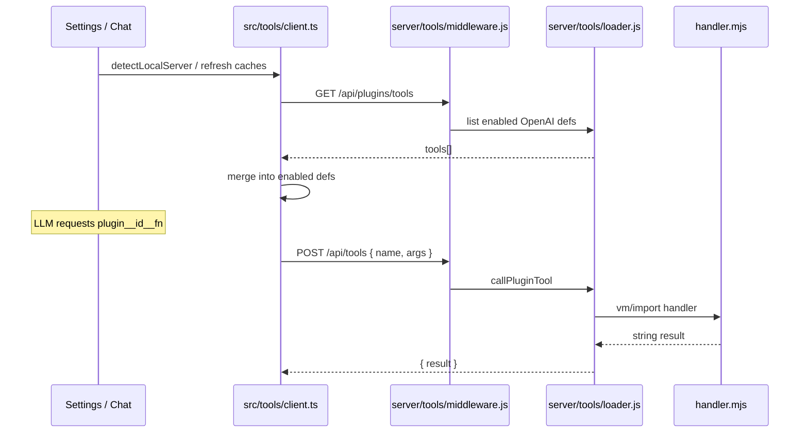

# Feature #17 — Plugin API for tools

**Roadmap:** [`feature-audit-roadmap.md`](../feature-audit-roadmap.md) item **#17** (Partial → Built).  
**Related:** #16 agent packs (tool allowlists), #22 project-scoped configs (future override path), MCP (Step 18).  
**Context:** [`documentation/context.md`](../../context.md) — Tools loop, MCP, Skills framework.

---

## YAML todos

```yaml
todos:
  - id: f17-schema
    content: "Define tool-plugin.schema.json + example fixture under test/fixtures/plugin-tools/"
    status: pending
  - id: f17-server-scan
    content: "Implement server/tools/scan.js — scan ~/.minnow/tools/<id>/, validate tool.json + handler.mjs"
    status: pending
  - id: f17-server-loader
    content: "Implement server/tools/loader.js — dynamic import handlers, merge into executeServerTool dispatch"
    status: pending
  - id: f17-server-api
    content: "Add server/tools/middleware.js — GET /api/plugins/tools, POST reload, ping; wire in server.js"
    status: pending
  - id: f17-server-index
    content: "Seed ~/.minnow/tools.json index (enabled flags) on first run; validate in server/config/validators.js"
    status: pending
  - id: f17-client-cache
    content: "Client — refreshPluginToolCache(), merge defs into getEnabledToolDefinitions*; route executeTool → POST /api/tools"
    status: pending
  - id: f17-permissions
    content: "Extend tools.json permissions for plugin__* ids; default ask; approval gate + filesystem rules where applicable"
    status: pending
  - id: f17-mode-policy
    content: "Fix/extend mode + work-agent tool filtering so dynamic tools (MCP + plugins) respect allowlists consistently"
    status: pending
  - id: f17-settings-ui
    content: "Settings → Tools (or Plugins subsection) — list user plugins, enable toggle, link to docs, scaffold button"
    status: pending
  - id: f17-template
    content: "POST /api/plugins/scaffold — copy _template to ~/.minnow/tools/<id>/ (mirror POST /api/skills)"
    status: pending
  - id: f17-tests
    content: "test/tools/plugin-loader.test.mjs + test/plugins/api.test.mjs; npm run test:plugins script"
    status: pending
  - id: f17-docs
    content: "Update documentation/context.md Tools section; author documentation/plugins/tool-authoring.md"
    status: pending
```

---

## Current state

| Area | What exists today |
|------|-------------------|
| **Built-in catalog** | 56 tools in [`src/tools/definitions.ts`](../../../src/tools/definitions.ts); `serverRequired` routes to `POST /api/tools` via [`src/tools/client.ts`](../../../src/tools/client.ts). |
| **Server dispatch** | [`server.js`](../../../server.js) `SERVER_TOOL_HANDLERS` map + `executeServerTool()`; MCP names (`mcp__*`) delegated to [`server/mcp/registry.js`](../../../server/mcp/registry.js) `callMcpTool()`. |
| **MCP (remote-style plugins)** | Stdio MCP servers under `~/.minnow/mcp/`; tools exposed as `mcp__<serverId>__<toolName>`; [`GET /api/mcp/tools`](../../../server/mcp/middleware.js), client cache in `refreshMcpToolCache()`. |
| **Permissions** | `~/.minnow/tools.json` — `enabled`, `permissions` (`full` \| `ask` \| `off`); unknown ids (incl. `mcp__*`) default to `ask` in [`src/tools/config.ts`](../../../src/tools/config.ts). |
| **Skills precedent** | Drop-in dirs: built-in `src/skills/<id>/SKILL.md`, user `~/.minnow/skills/<id>/SKILL.md`; scan/merge in [`server/skills/scan.js`](../../../server/skills/scan.js); pure merge helpers in [`src/skills/loader.ts`](../../../src/skills/loader.ts); APIs in [`server/skills/middleware.js`](../../../server/skills/middleware.js). |
| **User tool modules** | Only [`server/tools/memory-tools.js`](../../../server/tools/memory-tools.js) as a pattern for isolated server tool logic — not a plugin loader. |

**Not present:** `~/.minnow/tools/<name>/` convention, `server/tools/loader.js`, plugin catalog API, settings rows for user tools, or sandboxed user handler execution.

---

## Gap

1. **Authoring friction:** Extending Minnow requires editing the monorepo (`definitions.ts` + `server.js` handlers) or standing up a full MCP stdio server.
2. **No drop-in local tools:** No filesystem contract for single-file (or small) JS handlers colocated with JSON schema metadata.
3. **No discovery API:** Client cannot list/enable user tools separately from MCP; token estimate and settings UI only know built-ins + cached MCP.
4. **Send-path inconsistency:** `getEnabledToolDefinitions()` merges MCP defs, but `getEnabledToolDefinitionsForMode()` (used by [`src/tools/loop.ts`](../../../src/tools/loop.ts)) filters **built-ins only** — MCP (and future plugins) may be omitted from the main chat `tools` array. Plugins must not repeat this gap.
5. **Security model undefined:** User-supplied `handler.mjs` is arbitrary Node code; needs explicit sandbox boundaries, reload policy, and path/workspace guards.

---

## Goals

1. **Drop-in tool packs** under `~/.minnow/tools/<pluginId>/` with `tool.json` (metadata + JSON Schema parameters) and `handler.mjs` (async handler).
2. **Server-owned execution** — all plugin tools are `serverRequired: true`; no browser executor for third-party code.
3. **Stable namespacing** — exposed to the model as `plugin__<pluginId>__<functionName>` (parallel to `mcp__<serverId>__<toolName>`) to avoid collisions with built-ins and to key permissions in `tools.json`.
4. **Skills-parity ergonomics** — scan on boot, merge catalog API, enable/disable in `tools.json`, settings UI row, scaffold template, reload without restarting Vite.
5. **Safe defaults** — new plugins default permission `ask`; optional `capabilities` in manifest declare filesystem/network needs for future gating.

**Non-goals (v1):**

- npm registry / remote install marketplace.
- Browser-side plugin tools.
- Project-scoped `.minnow/tools/` (defer to #22).
- Hot-reload of handler code in production without explicit reload API (v1: `POST /api/plugins/reload`).

---

## Acceptance criteria

- [ ] Placing a valid pack at `~/.minnow/tools/hello-world/` makes `plugin__hello_world__greet` appear in `GET /api/plugins/tools` when enabled.
- [ ] Disabled packs in `tools.json` do not appear in API defs or `getEnabledToolDefinitions()`.
- [ ] Model can call the tool when permission is `full` or after approval when `ask`; `off` hides it from defs.
- [ ] `POST /api/tools` with `name: plugin__hello_world__greet` runs `handler.mjs` and returns a string `result` (errors as string messages, not HTTP 500).
- [ ] Invalid packs (bad JSON, missing handler, id mismatch, reserved id) are skipped with `console.warn` — server still starts.
- [ ] Built-in tool ids cannot be shadowed; plugin ids must match `^[a-z0-9][a-z0-9-]*$` (same as skills).
- [ ] `POST /api/plugins/scaffold` creates template from repo `_template` (requires `npm start`).
- [ ] Settings UI lists plugin tools with **Custom** badge, enable/permission controls persisted to `tools.json`.
- [ ] Main send path (`sendMessageWithTools`) includes enabled plugin defs for the active mode (and work-agent allowlist when set).
- [ ] `npm run test:plugins` passes; `npx tsc --noEmit` clean for touched TS.
- [ ] `documentation/context.md` updated; authoring guide exists.

---

## Architecture

### Directory layout

```text
~/.minnow/
  tools.json                 # index: { plugins: { "<pluginId>": { enabled: boolean } } }
  tools/
    <pluginId>/              # one plugin pack per folder (skills-style)
      tool.json              # manifest + OpenAI parameters
      handler.mjs            # export default async function (args, ctx) => string
    _template/               # shipped seed copied on scaffold (repo mirrors under server/tools/_template/)
      tool.json
      handler.mjs
      README.md
```

### `tool.json` (manifest) — draft shape

```json
{
  "id": "hello-world",
  "functionName": "greet",
  "label": "Hello World",
  "description": "Returns a greeting string.",
  "category": "utility",
  "parameters": {
    "type": "object",
    "properties": {
      "name": { "type": "string", "description": "Name to greet" }
    },
    "required": ["name"]
  },
  "capabilities": {
    "filesystem": false,
    "network": false
  }
}
```

**Rules:**

- `id` must equal parent folder name (same discipline as skills `name` === folder).
- Exposed API name: `plugin__${id.replace(/-/g, '_')}__${functionName}` (hyphens in id → underscores in namespace segment only).
- `category` must be one of existing `ToolCategory` values for settings grouping.

### `handler.mjs` contract

```javascript
/**
 * @param {Record<string, unknown>} args — tool arguments from the model
 * @param {import('./plugin-context.js').PluginContext} ctx — workspace, minnow home, logger
 * @returns {Promise<string>} — tool result text (errors as "Error: …" strings)
 */
export default async function handler(args, ctx) {
  return `Hello, ${args.name}`;
}
```

**Execution:** [`server/tools/loader.js`](../../../server/tools/loader.js) loads handlers via `import()` with `pathToFileURL` + cache-bust query on reload. **v1 sandbox:** run handler in `node:vm` `Script` with frozen `ctx` and no direct `require` unless manifest sets `capabilities.nodeBuiltin: true` (default false). Full `import()` only for trusted dev mode env `MINNOW_PLUGIN_UNSAFE=1` (documented, off by default).

### Server modules

| Module | Responsibility |
|--------|----------------|
| [`server/tools/scan.js`](../../../server/tools/scan.js) | `scanPluginDir()`, `listMergedPlugins()`, validation (id regex, schema size cap, reserved prefixes `mcp__`, `plugin__`, built-in ids). |
| [`server/tools/loader.js`](../../../server/tools/loader.js) | `loadPluginHandlers()`, `getPluginToolDefinitions()`, `callPluginTool(name, args)`, `reloadPlugins()`. |
| [`server/tools/middleware.js`](../../../server/tools/middleware.js) | `GET /api/plugins/ping`, `GET /api/plugins/tools`, `GET /api/plugins` (list metadata), `POST /api/plugins/reload`, `POST /api/plugins/scaffold`. |
| [`server/tools/plugin-context.js`](../../../server/tools/plugin-context.js) | `getWorkspaceRoot()`, `getMinnowHome()`, read-only env snapshot. |
| [`server/config/validators.js`](../../../server/config/validators.js) | Normalize `tools.json` `plugins` block. |
| [`server/config/home.js`](../../../server/config/home.js) | Seed empty `tools/` + default `tools.json` plugins section on first run. |

**Dispatch integration** in `server.js` `executeServerTool()`:

```text
if isPluginToolName(name) → callPluginTool(name, args)
else if isMcpToolName(name) → callMcpTool(...)
else SERVER_TOOL_HANDLERS[name]
```

### Client modules

| Module | Responsibility |
|--------|----------------|
| [`src/tools/client.ts`](../../../src/tools/client.ts) | `cachedPluginToolDefinitions`, `refreshPluginToolCache()`, branch in `executeTool` for `plugin__` (mirror `mcp__`). |
| [`src/tools/config.ts`](../../../src/tools/config.ts) | Default permission `ask` for `plugin__*` ids. |
| [`src/tools/plugin-settings-types.ts`](../../../src/tools/plugin-settings-types.ts) | `PluginListItem`, `PluginToolMeta` (optional). |
| [`src/ui/settings-plugins.ts`](../../../src/ui/settings-plugins.ts) | Render plugin rows under Tools settings. |
| [`src/tools/loop.ts`](../../../src/tools/loop.ts) | Use unified `getEnabledToolDefinitionsForSend(modeId)` that merges built-in + MCP + plugin after mode filter. |

### Data flow



### Comparison: MCP vs native plugin

| | MCP | Native plugin (#17) |
|---|-----|---------------------|
| Process | Separate stdio server | In-process handler |
| Naming | `mcp__server__tool` | `plugin__id__function` |
| Schema source | MCP `listTools` | `tool.json` |
| Authoring | MCP SDK + transport | Single `handler.mjs` |
| Best for | Existing MCP ecosystem | Quick local extensions |

---

## Key files to touch

**New**

- `server/tools/scan.js`, `loader.js`, `middleware.js`, `plugin-context.js`, `validate.js`
- `server/tools/_template/tool.json`, `handler.mjs`, `README.md`
- `documentation/schemas/tool-plugin.schema.json`
- `documentation/plugins/tool-authoring.md`
- `test/tools/plugin-scan.test.mjs`, `test/tools/plugin-loader.test.mjs`, `test/plugins/api.test.mjs`
- `test/fixtures/plugin-tools/echo/`

**Modify**

- [`server.js`](../../../server.js) — register plugin middleware; plugin branch in `executeServerTool`
- [`server/config/home.js`](../../../server/config/home.js), [`validators.js`](../../../server/config/validators.js), [`middleware.js`](../../../server/config/middleware.js) — `tools.json` plugins index
- [`src/tools/client.ts`](../../../src/tools/client.ts), [`config.ts`](../../../src/tools/config.ts), [`loop.ts`](../../../src/tools/loop.ts)
- [`src/ui/settings-sections.ts`](../../../src/ui/settings-sections.ts) — plugin list hooks
- [`package.json`](../../../package.json) — `test:plugins` script
- [`documentation/context.md`](../../context.md) — new subsection

---

## Implementation phases

### Phase 1 — Contract and server core (no UI)

1. Add JSON Schema + fixture plugin `echo` under `test/fixtures/plugin-tools/`.
2. Implement `scan.js` + `validate.js` (id rules, reserved names, max manifest bytes).
3. Implement `loader.js` + integrate `executeServerTool` dispatch.
4. Seed `~/.minnow/tools/` + extend `tools.json` with `plugins: {}`.
5. Expose `GET /api/plugins/tools` and `POST /api/plugins/reload`.

**Exit:** `curl` can invoke fixture plugin via `POST /api/tools`.

### Phase 2 — Client merge and permissions

1. `refreshPluginToolCache()` on `detectLocalServer()` (parallel MCP refresh).
2. Merge plugin defs in `getEnabledToolDefinitions()`.
3. Introduce `getEnabledToolDefinitionsForSend()` used by `loop.ts` — applies mode filter to **synthetic** `ToolDefinition` entries for MCP + plugins (fixes pre-existing MCP omission).
4. `executeTool` branch: permission gate → `executeServerTool` for `plugin__*`.
5. Persist enable/permission in `tools.json` via existing `PUT /api/config/tools`.

**Exit:** Enabled plugin callable from a chat turn with `npm start`.

### Phase 3 — Settings and scaffold

1. `POST /api/plugins/scaffold` copying `_template`.
2. Settings UI: list plugins, toggles, link to authoring doc.
3. Optional: `GET /api/plugins` for labels/categories in UI without loading handlers.

**Exit:** User can scaffold, enable, and run a custom plugin without editing the repo.

### Phase 4 — Hardening and docs

1. VM sandbox default; document `MINNOW_PLUGIN_UNSAFE`.
2. Reload on scaffold/save (watch optional, out of scope if reload API suffices).
3. Context.md + authoring guide; roadmap item marked Built.

---

## Dependencies

| Dependency | Relationship |
|------------|--------------|
| **#22 Project-scoped everything** | Optional later: `.minnow/tools/` overrides global. v1 is global-only under `~/.minnow/tools/`. |
| **#16 Agent packs** | Agent manifests may reference `plugin__*` ids in `allowedTools`; pack loader should not duplicate plugin scan. |
| **#6 Approval patterns** | Plugin tools use same permission gate; pattern auto-approve applies to `plugin__*` names. |
| **#8 Tool result caching** | When implemented, register bust rules for plugin tools that mutate workspace paths. |
| **MCP (shipped)** | Reuse bridge patterns (`toOpenAIDefinitions`), middleware style, and client cache refresh — do not fork unnecessarily. |
| **Skills (shipped)** | Reuse scan/merge/id rules and scaffold POST pattern verbatim where possible. |

**Recommended order:** Ship #17 after skills/MCP patterns are understood; before #16 if packs need to whitelist plugins; independent of #22 for v1.

---

## Tests

| Suite | Covers |
|-------|--------|
| `test/tools/plugin-scan.test.mjs` | Valid/invalid manifests, reserved ids, skip behavior |
| `test/tools/plugin-loader.test.mjs` | Handler execution, error strings, reload clears cache |
| `test/plugins/api.test.mjs` | `GET /api/plugins/tools`, scaffold, 404 cases |
| `test/fixtures/plugin-tools/echo/` | Deterministic `plugin__echo__ping` → `pong` |

**Harness notes:**

- Set `MINNOW_HOME` to a temp dir (same pattern as `test/mcp/registry.test.mjs`).
- Use fixed plugin id `echo` and static expected JSON/strings (no dynamic timestamps in assertions).
- Add `"test:plugins": "node --test test/tools/plugin-scan.test.mjs test/tools/plugin-loader.test.mjs test/plugins/api.test.mjs"` to `package.json`.

**Manual QA**

1. `npm start` → scaffold `demo` plugin → enable in Settings → ask model to call it.
2. Set permission `off` → confirm tool absent from next completion request.
3. Malformed `tool.json` → server logs warning; built-ins still work.

---

## Risks and mitigations

| Risk | Impact | Mitigation |
|------|--------|------------|
| **Arbitrary code execution** | User handlers run as Node process user | Default VM sandbox; limited `ctx`; no network/fs unless manifest + future gate; document trust model. |
| **Name collisions** | Broken tool routing or security bypass | Reserved prefixes; reject builtins; namespace `plugin__`. |
| **Mode / allowlist drift** | Plugins invisible or over-exposed | Single `getEnabledToolDefinitionsForSend()`; document work-agent `allowedTools` must use namespaced names. |
| **Stale handler cache** | Edits not picked up | `POST /api/plugins/reload`; scaffold triggers reload. |
| **Manifest injection** | Huge schemas bloat context | Cap `tool.json` size (e.g. 32 KB) and parameter property count. |
| **Windows path / ESM** | `import()` fails on user paths | Use `pathToFileURL`; template uses `.mjs`; test on win32 CI if available. |
| **Pre-existing MCP send gap** | MCP tools not in mode-filtered send | Fix in same PR as plugin merge to avoid two dynamic-tool behaviors. |

---

## Open questions (resolve in Phase 1 kickoff)

1. **One vs many tools per folder:** v1 assumes **one function per folder** (`tool.json` + single handler). Multi-tool packs deferred (would need `tools[]` array in manifest).
2. **Category for plugins in settings:** New group **Plugins** under Tools vs mixed into existing categories via `tool.json.category`.
3. **Token estimate:** Include plugin schema JSON in `resolveOutboundPromptEstimate()` when enabled (recommended: yes).

---

## Verification commands

```bash
npx tsc --noEmit
npm run test:plugins
npm test
```

After UI: manual checklist in **Manual QA** above.
