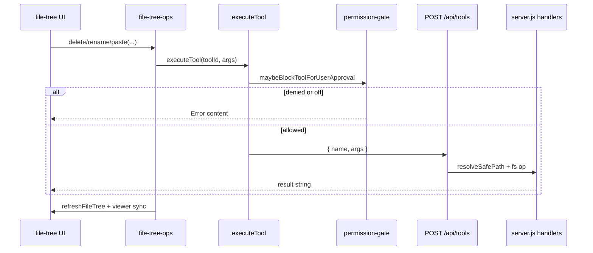

# Feature 18 — File tree CRUD (E1)

**Backlog:** `feature-18-file-tree-crud` · **Epic:** E — File panel · **Size:** L  
**Source:** [`documentation/plans/product_backlog_agents_48a41af9.plan.md`](../product_backlog_agents_48a41af9.plan.md) · **User backlog:** [`documentation/plans/to-fix.md`](../to-fix.md) — “ability to delete, move, rename, copy, paste files in the files section”

**Depends on:** Workspace root + `npm start` (existing Step 11 file panel). **Blocks:** E3 (`feature-20-drag-drop-move-confirm`).

| Field | Value |
|-------|-------|
| **Feature ID** | `feature-18-file-tree-crud` |
| **Epic** | E — File panel · **E1** |
| **Wave** | 5 (file panel epics) |
| **Size** | L |
| **Status** | Build plan (not implemented) |
| **User backlog** | [`to-fix.md`](../to-fix.md) — “ability to delete, move, rename, copy, paste files in the files section” |

---

## Backlog alignment (E1)

| Backlog field | Plan mapping |
|---------------|--------------|
| **Goal** — context menu + shortcuts on `file-tree.ts` | Phases B–C; reuse `POST /api/tools` (no duplicate REST) |
| **Goal** — `delete_file` / `move_file` / `copy_file` | Use existing ids: **`delete_path`**, `move_file`, `copy_file` (+ `save_file`, `make_directory` for create) |
| **Acceptance** — workspace guard | Server `resolveSafePath` + client `workspace-path-guard` (AC7) |
| **Acceptance** — errors in toast | v1: top-bar **`setStatus('ok'|'err', …)`** ([`status.ts`](../../../src/ui/status.ts)); see open question §4 |
| **Acceptance** — tree refreshes | `invalidateFileTreeCache` + `refreshFileTree` (AC3–AC6) |
| **Acceptance** — viewer closes if deleted file open | `syncViewerAfterPathChange` (AC3) |

---

## Summary

Add **first-class filesystem operations** to the project file tree: context menu and keyboard shortcuts for **delete, rename, move (cut/paste), copy/paste, new file, new folder**. Reuse the existing **`POST /api/tools`** pipeline and tool IDs (`delete_path`, `move_file`, `copy_file`, `make_directory`, `save_file`) — **no new REST routes in v1**. Operations go through `executeTool()` so **server `resolveSafePath`**, **tool permissions**, and **approval modal** stay aligned with agent tool calls.

---

## Problem statement

| Layer | Today | Gap |
|-------|--------|-----|
| **UI** | [`src/ui/file-tree.ts`](../../../src/ui/file-tree.ts) — read-only browse, expand/collapse, open file in viewer, drag-to-composer | No context menu, no cut/copy/paste, no delete/rename/create |
| **Server** | [`server.js`](../../../server.js) — full file tool handlers behind `POST /api/tools` | Already implemented; not wired to tree UI |
| **Tools catalog** | [`src/tools/definitions.ts`](../../../src/tools/definitions.ts) — `delete_path` (not `delete_file`), `move_file`, `copy_file`, etc. | Backlog wording says `delete_file`; **use existing `delete_path` id** |
| **Guards** | Server `resolveSafePath` + client [`workspace-path-guard.ts`](../../../src/tools/workspace-path-guard.ts) for approval UX | Tree must not bypass; surface server `Error:` strings to the user |
| **Feedback** | [`src/ui/status.ts`](../../../src/ui/status.ts) top-bar status (`setStatus`) | Backlog “toast” → **use `setStatus('ok'|'err', …)`** in v1 (no new toast component) |

Agents can already mutate files via tools; users cannot do the same from the Files sidebar without asking the model.

---

## Goals

1. **Context menu** on file and folder rows (right-click + keyboard menu key where supported).
2. **Keyboard shortcuts** when focus is on a tree row (see table below).
3. **Workspace-safe paths** — all ops use relative paths under workspace root; server rejects escapes unless full filesystem access is enabled.
4. **Errors visible** — failed ops call `setStatus('err', message)`; successes call `setStatus('ok', …)`.
5. **Tree + viewer coherence** — after mutations: `invalidateFileTreeCache()` + `refreshFileTree()`; if deleted/moved path is open in viewer, **close viewer** (or reopen at new path after rename/move).
6. **State hygiene** — update `expandedDirs`, `selectedPath` in [`src/state/file-panel.ts`](../../../src/state/file-panel.ts) when paths disappear or move.

---

## Non-goals (v1)

- **Internal tree drag-and-drop move** (E3 / `feature-20`) — only cut/paste and explicit rename dialog here.
- **File tree search/filter** (E2).
- **Directory copy** — `copy_file` rejects non-file sources ([`toolCopyFile`](../../../server.js)); v1: copy/paste **files only**; cut/paste **files and directories** via `move_file`.
- **Binary / non-UTF-8** create flows — `save_file` is text-oriented (same as viewer).
- **Undo** — no undo stack; destructive actions use `window.confirm` for directories and non-empty deletes where cheap to detect.
- **Dedicated `/api/files/*` REST** — unnecessary duplicate of tool layer unless batch APIs are needed later.
- **Bypassing tool permission / approval** for UI — file panel uses the same `executeTool` + `maybeBlockToolForUserApproval` path as chat (user can set tools to Full in Settings).

---

## Acceptance criteria

| # | Criterion | Verify |
|---|-----------|--------|
| AC1 | Right-click file row → menu: Open, Cut, Copy, Paste, Rename, Delete | Manual |
| AC2 | Right-click folder row → menu: New File…, New Folder…, Cut, Paste, Rename, Delete (no Copy for folder in v1, or disabled with hint) | Manual |
| AC3 | Delete file removes row after refresh; if that file is open in viewer, viewer closes and `selectedPath` clears | Manual |
| AC4 | Rename `a.ts` → `b.ts` via `move_file` updates tree; viewer reopens `b.ts` if `a.ts` was open | Manual |
| AC5 | Cut + Paste on another folder moves item (`move_file`); tree reflects new location | Manual |
| AC6 | Copy + Paste file duplicates via `copy_file` | Manual |
| AC7 | Path outside workspace (with workspace-only FS access) fails with clear error in status bar | Manual + server throw |
| AC8 | Tool permission `off` → status error; `ask` → approval modal then proceed/cancel | Manual |
| AC9 | Offline / no `npm start` → CRUD disabled; existing empty state unchanged | `file-tree-boot.test.mjs` still passes |
| AC10 | `npm test` passes including new unit tests for path helpers / clipboard logic | CI |

---

## Architecture

### Data flow



### Tool mapping (UI action → tool id)

| UI action | Tool | Args |
|-----------|------|------|
| New file | `save_file` | `{ path: "<dir>/name", content: "" }` |
| New folder | `make_directory` | `{ path: "<dir>/new-folder" }` |
| Delete | `delete_path` | `{ path }` |
| Rename | `move_file` | `{ source, destination }` |
| Cut → Paste | `move_file` | `{ source, destination }` |
| Copy → Paste | `copy_file` | `{ source, destination }` (files only) |

**Rename** = `move_file` with `destination` = same parent directory + new basename (compute parent via string helper, not `path` npm in browser unless already used elsewhere in client).

### Server endpoints (v1)

| Endpoint | Role |
|----------|------|
| `GET /api/tools/ping` | Already used; tree CRUD requires server up |
| `POST /api/tools` | **Single execution channel** — body `{ name, args }`, response `{ result }` or `{ error }` |

No new routes. Document this in [`documentation/context.md`](../../context.md) after implementation (file panel bullet: tree CRUD via tools API).

**Handler reference** ([`server.js`](../../../server.js)):

- `resolveSafePath(userPath)` — workspace boundary (throws on escape)
- `toolDeletePath`, `toolMoveFile`, `toolCopyFile`, `toolMakeDirectory`, `toolSaveFile`
- Tool results are plain strings; failures often start with `Error:`

### Client modules (proposed)

| File | Responsibility |
|------|----------------|
| [`src/ui/file-tree.ts`](../../../src/ui/file-tree.ts) | Wire `contextmenu`, `data-path` / `data-entry-kind` on rows, focus tracking, delegate to ops |
| **`src/ui/file-tree-ops.ts`** (new) | `runFileTreeTool`, parse result errors, clipboard state, post-op refresh + panel state patch |
| **`src/ui/file-tree-context-menu.ts`** (new) | Build/show dismissible menu DOM, menu actions |
| **`src/ui/file-tree-path.ts`** (new, optional) | `dirname`, `joinPath`, `basename`, `isAncestorPath` for expanded-dir pruning |
| [`src/ui/file-viewer.ts`](../../../src/ui/file-viewer.ts) | Export/use `getOpenViewerPath()`, `closeFileViewer()`, `openFileInViewer()` after rename |
| [`src/styles/file-panel.css`](../../../src/styles/file-panel.css) | `.file-tree-context-menu`, item disabled state, focus ring on targeted row |

Keep **drag-to-composer** behavior on file rows unchanged (5px threshold); context menu must `stopPropagation` on right-click so drag logic is unaffected.

---

## Exact file change list

### Required — implement

| Path | Action |
|------|--------|
| [`src/ui/file-tree.ts`](../../../src/ui/file-tree.ts) | `contextmenu`, row `data-path` / `data-entry-kind`, focus tracking, delegate to ops; export `refreshFileTree` usage unchanged |
| **`src/ui/file-tree-ops.ts`** | **New** — `runFileTreeTool`, clipboard, delete/rename/paste/create, panel + viewer sync |
| **`src/ui/file-tree-context-menu.ts`** | **New** — menu DOM, actions, dismiss |
| **`src/ui/file-tree-path.ts`** | **New** (optional) — `dirname`, `joinPath`, `basename`, `isAncestorPath` |
| [`src/ui/file-viewer.ts`](../../../src/ui/file-viewer.ts) | Use `getOpenViewerPath`, `closeFileViewer`, `openFileInViewer` from ops |
| [`src/state/file-panel.ts`](../../../src/state/file-panel.ts) | `expandedDirs` / `selectedPath` patches after mutations |
| [`src/styles/file-panel.css`](../../../src/styles/file-panel.css) | `.file-tree-context-menu`, disabled items, row focus ring |
| [`documentation/context.md`](../../context.md) | File panel: tree CRUD via tools API (on ship) |

### Tests — add

| Path | Action |
|------|--------|
| **`test/file/file-tree-ops.test.mts`** | **New** — `parseToolResult`, path helpers, clipboard (no DOM) |
| **`test/file/file-tree-context-menu.test.mjs`** | **New** (optional) — happy-dom menu disabled states |
| [`package.json`](../../../package.json) | Wire new test files into `npm test` if not picked up by glob |
| **`scripts/file-tree-crud-smoke.mjs`** | **New** (optional) — POST tools on temp workspace files |

### Verification + docs — on ship

| Path | Action |
|------|--------|
| [`documentation/plans/verification/feature-18.md`](../verification/feature-18.md) | Automated commands + manual AC checklist (pre-authored; sign off on ship) |

### Explicitly unchanged (unless regression)

| Path | Why |
|------|-----|
| [`server.js`](../../../server.js) | Handlers exist; no new routes in v1 |
| [`src/tools/definitions.ts`](../../../src/tools/definitions.ts) | Tool ids already defined |
| [`index.html`](../../../index.html) | `#fileTreeHost` id unchanged |
| [`src/ui/init-file-panel.ts`](../../../src/ui/init-file-panel.ts) | Boot path unchanged; CRUD gated by `getLocalServerAvailable()` |

---

## Schema / API changes

| Area | v1 change |
|------|-----------|
| **REST** | None — all writes via existing `POST /api/tools` `{ name, args }` |
| **Config / migration** | None — tool permission modes already in Settings (`tools.json`) |
| **Client types** | Optional local `FileTreeClipboard` interface in `file-tree-ops.ts` only |

---

## UI specification

### Context menu

- **Trigger:** `contextmenu` on `.file-tree-row--file` / `.file-tree-row--dir`; prevent browser default menu.
- **Position:** `position: fixed` at `clientX/clientY`, flip if near viewport edge.
- **Dismiss:** click outside, Escape, scroll on `#fileTreeHost`.
- **Items:**
  - **File:** Open · Cut · Copy · Paste (disabled if clipboard empty) · Rename… · Delete
  - **Folder:** New File… · New Folder… · Cut · Paste · Rename… · Delete
  - **Root/host:** optional “New File…” / “New Folder…” on empty area (target dir = `treeRoot` or `.`)
- **Disabled states:** Paste when no clipboard; Copy on folder (v1); all items when `!getLocalServerAvailable()`.

### Prompts / confirms

| Action | UX |
|--------|-----|
| New file / folder | `window.prompt` for name (validate non-empty, no `/\` in name) |
| Rename | `window.prompt` pre-filled with current basename |
| Delete file | confirm if viewer dirty on that file; else optional light confirm |
| Delete folder | `window.confirm` — warn recursive delete (matches `delete_path` server behavior) |

### Keyboard shortcuts (row focused)

| Key | Action |
|-----|--------|
| Enter | Open file (existing) / toggle dir (existing) |
| F2 | Rename |
| Delete | Delete (with confirm rules) |
| Ctrl+C / Cmd+C | Copy |
| Ctrl+X / Cmd+X | Cut |
| Ctrl+V / Cmd+V | Paste into focused folder (or parent of focused file) |

Use `navigator.platform` / `metaKey` for Cmd on macOS. Ignore shortcuts when focus is in CodeMirror viewer (viewer already binds keys).

### Clipboard model (in-memory)

```ts
interface FileTreeClipboard {
  mode: 'copy' | 'cut';
  paths: string[]; // workspace-relative, forward slashes
}
```

- Single-item v1 (last cut/copy wins).
- **Paste target:** directory path (folder row or parent of file row).
- After successful **cut** paste, clear clipboard.
- **Collision:** if destination exists, show error from server (`EEXIST` message) — do not overwrite silently.

### Post-operation refresh

1. `invalidateFileTreeCache()`
2. Prune `expandedDirs` entries that are deleted or prefixed by deleted dir (`isAncestorPath`)
3. `patchFilePanelState({ selectedPath, expandedDirs })`
4. `await refreshFileTree()`
5. **Viewer sync** (`syncViewerAfterPathChange` in `file-tree-ops.ts`):
   - Deleted open path → `closeFileViewer()` without save prompt if file already gone (or confirm once before delete)
   - Renamed/moved open path → `openFileInViewer(newPath)` if viewer was open on old path
   - Moved away parent only → no viewer change

---

## Security and permissions

| Concern | Mechanism |
|---------|-----------|
| Workspace jail | Server `resolveSafePath` ([`server.js`](../../../server.js) ~L59–85) |
| Client pre-check | `isPathUnderWorkspace` in [`workspace-path-guard.ts`](../../../src/tools/workspace-path-guard.ts) — same rules as approval modal |
| Tool permissions | [`permission-gate.ts`](../../../src/tools/permission-gate.ts) — `off` / `ask` / `full` per tool id in Settings |
| Path args for gate | [`path-args.ts`](../../../src/tools/path-args.ts) — already lists `move_file`, `copy_file`, `delete_path`, etc. |

**Note:** [`documentation/context.md`](../../context.md) states tree browse does not require tools to be enabled in the LLM catalog; **writes from the tree still call `executeTool`**, which enforces permission mode and approval. Product choice: keep this (safer) unless explicit “file panel bypass” is requested later.

**Protected paths (optional v1.1):** reject ops on `.git`, `node_modules` at UI layer with clear message — server does not block today; document as follow-up if desired.

---

## Implementation phases

### Phase A — Operations core (`file-tree-ops.ts`)

- [ ] **A1** `parseToolResult(content: string): { ok: boolean; message: string }` — treat `content.startsWith('Error:')` as failure
- [ ] **A2** `runFileTreeTool(name, args)` — wrap `executeTool`, map errors to `setStatus`
- [ ] **A3** Clipboard getters/setters/clear
- [ ] **A4** `deletePath(path)`, `renamePath(from, to)`, `pasteInto(targetDir)`, `createFile(parent, name)`, `createFolder(parent, name)`
- [ ] **A5** `applyPathChangeToFilePanelState(oldPath, newPath | null)` — expandedDirs + selectedPath
- [ ] **A6** `syncViewerAfterPathChange(oldPath, newPath | null, operation)`

### Phase B — Context menu UI

- [ ] **B1** `file-tree-context-menu.ts` — render menu, item callbacks
- [ ] **B2** CSS in `file-panel.css` — z-index above sidebar, theme tokens
- [ ] **B3** Attach `contextmenu` in `appendDirRow` / `appendFileRow` (pass `fullPath`, kind)
- [ ] **B4** “New file/folder” on background context menu for `#fileTreeHost`

### Phase C — Keyboard + focus

- [ ] **C1** Track `focusedTreePath` on row `focus` / click
- [ ] **C2** `keydown` handler on tree host (capture) for shortcuts table
- [ ] **C3** Ensure shortcuts do not fire while modal or viewer editor focused

### Phase D — Integration and polish

- [ ] **D1** Disable CRUD when offline (same guard as `renderOfflineEmpty`)
- [ ] **D2** Loading/disabled overlay during async op (optional row spinner or global `setStatus('spin', …)`)
- [ ] **D3** Update [`documentation/context.md`](../../context.md) file panel section
- [ ] **D4** Cross-link E3 plan: internal DnD will call same `file-tree-ops` helpers

### Phase E — Docs and verification artifact

- [ ] **E1** Complete manual + automated sign-off in [`documentation/plans/verification/feature-18.md`](../verification/feature-18.md)
- [ ] **E2** Export `movePath` / `pasteInto` (or equivalent) from `file-tree-ops.ts` for E3 (`feature-20`)

---

## Build

| Step | Command |
|------|---------|
| Dev | `npm start` (Vite + tools API) |
| Typecheck / bundle | `npm run build` |
| Manual smoke | Open Files sidebar → create, rename, cut/paste, delete on sample files under workspace |

No new npm dependencies expected.

---

## Testing strategy

### Automated (`npm test`)

| Test file | Scope |
|-----------|--------|
| **`test/file/file-tree-ops.test.mts`** (new) | `parseToolResult`; path helpers (`joinPath`, dirname, prune expanded dirs); clipboard state machine (no DOM) |
| **`test/file/file-tree-context-menu.test.mjs`** (new, optional) | happy-dom: menu opens, Paste disabled when clipboard empty |
| [`test/file/file-tree-boot.test.mjs`](../../../test/file/file-tree-boot.test.mjs) | Regression — offline/loading strings unchanged |
| [`test/tools/permission-gate.test.mts`](../../../test/tools/permission-gate.test.mts) | No change required; manual cross-check `delete_path` + ask |
| **Integration** | Extend [`scripts/step-11-smoke.mjs`](../../../scripts/step-11-smoke.mjs) or add `scripts/file-tree-crud-smoke.mjs`: POST `delete_path` / `move_file` / `copy_file` on temp files under workspace (Node, not happy-dom) |

### Manual matrix

- [ ] New file + new folder under nested dir
- [ ] Rename file with viewer open (dirty and clean)
- [ ] Delete open file → viewer closes
- [ ] Cut folder into sibling folder → children remain listed after expand
- [ ] Copy file → paste → two files; cut file → paste → only one remains at destination
- [ ] Tool set to **Ask** → approval modal → Allow once / Always / Cancel
- [ ] Workspace-only FS: attempt `..` escape via rename — rejected
- [ ] Windows path separators in prompts normalized to forward slashes in args

---

## Risks and mitigations

| Risk | Mitigation |
|------|------------|
| Approval modal fatigue for every small op | User can set file tools to **Full** in Settings; document in plan/README |
| `copy_file` cannot copy directories | Disable Copy on folders; document; E1 acceptance still met for files |
| Race: tree cache stale after op | Always `invalidateFileTreeCache` before refresh |
| Delete folder with many files — slow | `setStatus('spin', …)` during op |
| Right-click vs drag on Windows | `contextmenu` + existing mousedown drag threshold are orthogonal |

---

## Dependencies and ordering

- **Wave 5** with other file panel epics ([`product_backlog_agents_48a41af9.plan.md`](../product_backlog_agents_48a41af9.plan.md)).
- **E3 depends on E1** — drag-drop move should call shared `move_file` helper in `file-tree-ops.ts`.
- **E4 (padding)** independent — can land before or after E1.

---

## Definition of done

- [ ] AC1–AC10 satisfied
- [ ] Phases A–D todos complete
- [ ] `documentation/context.md` updated (file panel CRUD + tools API note)
- [ ] `npm test` green
- [ ] No unrelated file-panel features in same PR

---

## Todos (execution checklist)

- [ ] Read `file-tree.ts`, `definitions.ts`, `workspace-path-guard.ts`, `server.js` file handlers (this plan)
- [ ] Implement `file-tree-ops.ts` + path helpers
- [ ] Implement context menu + CSS
- [ ] Wire keyboard shortcuts + focus model
- [ ] Viewer + `filePanel` state sync
- [ ] Add unit tests (`file-tree-ops.test.mts`)
- [ ] Manual verification matrix — [`feature-18.md`](../verification/feature-18.md)
- [ ] Optional: `file-tree-crud-smoke.mjs`
- [ ] Update `documentation/context.md`
- [ ] Sign off verification doc (PASS/FAIL)

---

## Verifier handoff

Use [`documentation/plans/verification/feature-18.md`](../verification/feature-18.md):

- **Plan review:** backlog E1 + deliverable template checklist (pre-implementation).
- **Automated:** `npm run build`, `npm test` (including `test/file/file-tree-ops.test.mts`; optional context-menu test).
- **Manual:** AC1–AC10 and manual matrix in verification doc (requires `npm start` + workspace with sample files).
- **Sign-off:** PASS only when all acceptance rows and manual checks pass; E3 (`feature-20`) should not start until Feature 18 verification PASS on the same branch.

---

## Open questions (resolve before/during implementation)

1. **Empty file on create:** `save_file` with `""` vs single newline — match editor default for new scratch files.
2. **Delete `.git` / `node_modules`:** block in UI or allow with strong confirm?
3. **Multi-select** cut/copy/delete: defer to v2 or support Shift+click in v1?
4. **Status vs toast:** confirm product accepts top-bar `setStatus` instead of floating toast for this epic (backlog says “toast”; v1 implements status bar per § Backlog alignment).

---

*Plan authored from codebase research (`file-tree.ts`, `definitions.ts`, `workspace-path-guard.ts`, `server.js`, `file-viewer.ts`, `permission-gate.ts`, product backlog E1). Implementation not started.*
