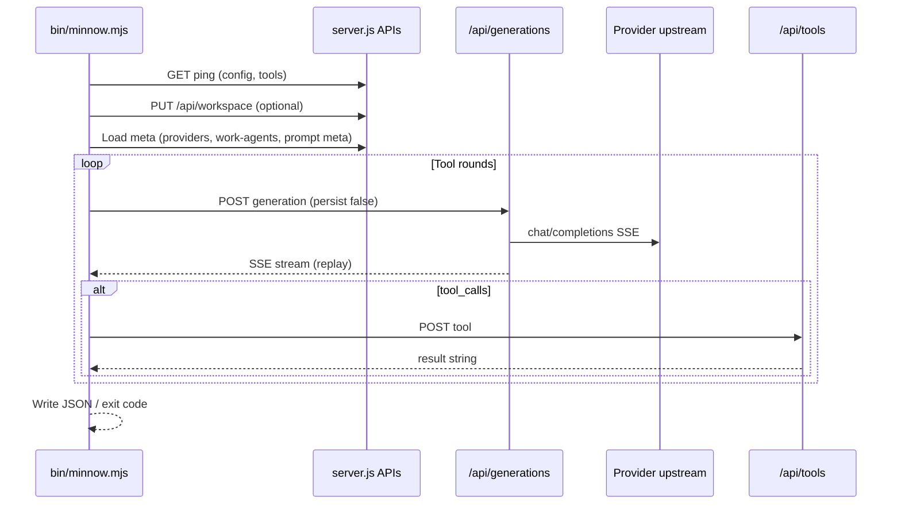

# Feature #18 — Headless mode (CLI + CI)

**Roadmap:** [feature-audit-roadmap.md §18](../feature-audit-roadmap.md)  
**Architecture context:** [context.md](../../context.md) (generations API, dev server, tool loop)  
**Status:** Missing (plan only)  
**Suggested sequencing:** After [#22 project-scoped configs](../feature-audit-roadmap.md) if `--profile` / workspace overrides need `.minnow/`; pairs with [#19 determinism](../feature-audit-roadmap.md) for CI replay.

---

## Summary

Add a **Node CLI** (`bin/minnow.mjs`) that runs Minnow agent turns **without the SPA**: same tool server, generations proxy, work agents, modes, and approval policy — outputting a **machine-readable transcript** and **process exit codes** suitable for GitHub Actions and local scripts.

```bash
minnow run --workspace ./my-repo --agent builder --mode build \
  --prompt "Add a unit test for parseSsePayloads" \
  --json-out ./run.json --no-approval
```

---

## YAML todos

```yaml
todos:
  - id: headless-0-server-flags
    content: Add BROWSER=none / MINNOW_HEADLESS=1 to skip openBrowser; document PORT and health URLs
    status: pending
  - id: headless-1-cli-skeleton
    content: Create bin/minnow.mjs with run subcommand, --help, exit codes, baseUrl resolution
    status: pending
  - id: headless-2-server-preflight
    content: Implement waitForServer (ping config + tools + generations); spawn-or-connect mode
    status: pending
  - id: headless-3-workspace-profile
    content: Wire --workspace (PUT /api/workspace) and --profile (prompt meta + work-agent prompt profile)
    status: pending
  - id: headless-4-runner-core
    content: Extract headless tool loop module from loop.ts (no DOM); reuse buildApiMessages + generations
    status: pending
  - id: headless-5-approval-policy
    content: Implement --no-approval with MINNOW_I_UNDERSTAND_UNSAFE_AUTOMATION opt-in; CLI ask_question handler
    status: pending
  - id: headless-6-json-output
    content: Define HeadlessRunResult schema; --json-out / stdout; stable ordering for CI diff
    status: pending
  - id: headless-7-package-bin
    content: Add package.json bin entry; npm script minnow:run for local dev
    status: pending
  - id: headless-8-tests
    content: test/headless/*.test.mjs with mock upstream + ephemeral server; document CI workflow snippet
    status: pending
  - id: headless-9-docs
    content: Update context.md, README.md, AGENTS.md with CLI usage and CI example
    status: pending
```

---

## Current state

| Area | What exists today |
|------|-------------------|
| **User entry** | All flows go through the Vite SPA (`index.html` → `main.ts` → composer → `sendMessageWithTools`). |
| **Dev server** | `server.js` mounts middleware before SPA: config, workspace, memory, LSP, MCP, providers, **generations**, work-agents, tools, skills, terminal. |
| **Generations API** | `POST /api/generations` → `{ generationId }`; `GET .../stream` (SSE replay + live); `POST .../cancel`; `GET .../status`. Implemented in [`server/generations/`](../../../server/generations/) (`store.js`, `upstream.js`, `routes.js`). Wired in [`server.js`](../../../server.js) via `createGenerationsMiddleware()`. |
| **Client generations** | [`src/api/generations.ts`](../../../src/api/generations.ts) — `createGeneration` (main: `persist: true`, 5 min eviction), headless callers: `persist: false` (30 s). |
| **Chat shim** | [`src/providers/fetch-chat.ts`](../../../src/providers/fetch-chat.ts) — `postChatCompletions()` builds synthetic `Response` from generation stream (sub-agents, titles, reef widget LLM). |
| **Main tool loop** | [`src/tools/loop.ts`](../../../src/tools/loop.ts) — `streamCompletionTurn` → generations; multi-round tools; DOM bubbles, approval modal, session save. |
| **Sub-agent loop** | [`src/agents/sub-agent-runner.ts`](../../../src/agents/sub-agent-runner.ts) — already **headless SSE** (no DOM); same `postChatCompletions` + `executeTool` pattern. |
| **Tools API** | `POST /api/tools` `{ name, args }` → `{ result }` in [`server.js`](../../../server.js); path guard via `resolveSafePath()` + `TOOLS_ALLOW_ALL_PATHS`. |
| **Workspace API** | `GET/PUT /api/workspace` — [`server/workspace/middleware.js`](../../../server/workspace/middleware.js), root in [`server/workspace/root.js`](../../../server/workspace/root.js). |
| **Work agents** | Registry `builder`, `planner`, etc.; `GET /api/work-agents/:id/prompt?profile=full|lite`; overrides in `~/.minnow/work-agents.json`. |
| **Prompt profiles** | `activePromptProfile: full \| lite \| custom` in [`src/config/prompt-meta.ts`](../../../src/config/prompt-meta.ts) — **not** yet portable “profiles” bundle ([#13](../feature-audit-roadmap.md)). |
| **Approval** | [`src/tools/permission-gate.ts`](../../../src/tools/permission-gate.ts) — **skips modal when `document` is undefined** (line 29–31); still respects `perm === 'off'`. |
| **Tests** | [`test/api/generations.test.mjs`](../../../test/api/generations.test.mjs) — lifecycle, replay, cancel; [`test/workspace/workspace-api.test.js`](../../../test/workspace/workspace-api.test.js). |
| **CLI** | **None** — no `bin/` entry in `package.json`. |

**Important distinction:** “Headless” in comments today means **no browser DOM** (sub-agents, reef widget LLM), not **no Minnow server / no SPA**. Feature #18 is the latter: a **first-class CLI front-end**.

---

## Gap

1. No `minnow` executable or `npm run` script for non-interactive runs.
2. Tool loop is **tightly coupled** to `document`, chat area, approval modal, sidebar streaming state, and `scheduleSaveSessions`.
3. `executeTool` / `fetch('/api/...')` assume **browser same-origin** — CLI must use absolute `baseUrl` (e.g. `http://127.0.0.1:5173`).
4. Interactive tools (`ask_question`, `propose_mode_switch`) block without UI — CLI needs deterministic substitutes or explicit failure.
5. Browser-only tools (`get_datetime`, `calculate`, some CDP paths) are unavailable via `POST /api/tools` — headless runs must fail clearly or skip.
6. `server.js` always calls `openBrowser()` — CI must set `BROWSER=none` or new flag.
7. No structured **run result** (exit code, transcript JSON, tool trace) for pipelines.

---

## Goals

1. **Parity:** One `minnow run` uses the same generations upstream, provider registry, tool handlers, work-agent prompts, and mode tool policy as the SPA (for a given `~/.minnow` config).
2. **CI-ready:** Non-zero exit codes on failure; optional `--json-out`; no stdin prompts unless `--interactive`.
3. **Safety:** `--no-approval` is **opt-in** and requires an explicit env acknowledgment; default remains “ask” semantics implemented as **deny** or **fail** in CLI (not silent allow).
4. **Operability:** `--workspace` sets server workspace before tools run; `--profile` selects prompt stack (`full` / `lite` / named custom config id when [#13](feature-audit-roadmap.md) lands).
5. **Thin CLI:** Prefer extracting a shared **headless runner** over duplicating `loop.ts` logic.

### Non-goals (v1)

- Bundled LM Studio / model download.
- Replacing `npm start` with a separate long-lived daemon binary.
- Full Orchestrate board UI in terminal (orchestrate mode may be **restricted** or plan-path required).
- Record/replay ([#19](../feature-audit-roadmap.md)) — design hooks only.

---

## Acceptance criteria

### CLI UX

- [ ] `node bin/minnow.mjs run --help` documents all flags and env vars.
- [ ] `minnow run --prompt "..."` completes with assistant text on stdout (human mode) or JSON ( `--json` / `--json-out`).
- [ ] `minnow run --agent builder` resolves work agent model binding and allowed tools like the SPA.
- [ ] `minnow run --mode build|plan|...` applies mode tool policy ([`filterToolsByMode`](../../../src/chat/modes/tool-policy.ts)).
- [ ] `minnow run --workspace <abs-path>` calls `PUT /api/workspace` before tools; relative paths resolved from cwd.
- [ ] `minnow run --profile full|lite` sets prompt profile for compose path (and work-agent prompt fetch where applicable).
- [ ] Exit code `0` on successful terminal assistant message; non-zero on provider error, tool denial, max turns exceeded, or missing server.

### Server / generations

- [ ] CLI uses `POST /api/generations` + stream subscribe (same as [`streamCompletionTurn`](../../../src/tools/loop.ts) / [`postChatCompletions`](../../../src/providers/fetch-chat.ts)).
- [ ] `GET /api/tools/ping` and `GET /api/config/ping` pass before run starts (configurable timeout, default 30s).
- [ ] `POST /api/generations/:id/cancel` honored on SIGINT.

### Safety

- [ ] Without `--no-approval`, tools with permission `ask` do **not** auto-execute — run fails with explicit tool name in stderr/JSON.
- [ ] With `--no-approval`, process exits unless `MINNOW_I_UNDERSTAND_UNSAFE_AUTOMATION=1` (exact name TBD in implementation).
- [ ] Document that `TOOLS_ALLOW_ALL_PATHS=1` + `--no-approval` is dangerous.

### CI

- [ ] Documented GitHub Actions job: `npm ci`, `BROWSER=none npm start &`, wait for ping, `node bin/minnow.mjs run ...`, `kill` server.
- [ ] Tests run in `npm test` without live LM Studio (mock upstream pattern from [`test/api/generations.test.mjs`](../../../test/api/generations.test.mjs)).

---

## Architecture

### High-level flow



### Components

| Component | Responsibility |
|-----------|----------------|
| **`bin/minnow.mjs`** | argv parsing, preflight, spawn/wait for server, invoke runner, map errors → exit codes. |
| **`src/headless/runner.ts`** (new) | Ephemeral in-memory `Chat`; `resolveOutboundSystemMessages`; tool rounds via extracted logic; no DOM. |
| **`src/headless/server-client.ts`** (new) | `fetch(baseUrl + path)` helpers; injectable `baseUrl` (replaces relative `/api/*` in CLI context). |
| **`src/headless/config.ts`** (new) | CLI flags → `{ workspace, profile, agentId, modeId, providerId?, modelId?, noApproval }`. |
| **`src/headless/approval.ts`** (new) | CLI approval policy: deny / allow-all when flagged + env. |
| **`src/headless/result.ts`** (new) | `HeadlessRunResult` type + JSON serializer. |
| **Refactor `src/tools/loop.ts`** | Export or move pure functions: `buildApiMessages`, turn loop body without `document` / `getElementById`. |
| **`server.js` tweak** | Skip `openBrowser` when `process.env.BROWSER === 'none'` or `MINNOW_HEADLESS=1`. |

### CLI surface (v1)

```text
minnow run [options]

Required:
  --prompt <text>          User task (or read from stdin with --stdin)

Target (server must be running unless --start-server):
  --base-url <url>         Default http://127.0.0.1:5173
  --start-server           Spawn `node server.js` child (BROWSER=none); wait for ping
  --server-timeout <sec>   Preflight wait (default 30)

Agent / model:
  --agent <workAgentId>    e.g. builder, planner (default: mode default)
  --mode <modeId>          build | plan | orchestrate | research | reef (default: build)
  --provider <id>          Override provider (optional)
  --model <id>             Override model (optional)

Environment:
  --workspace <path>       PUT /api/workspace before run
  --profile <name>         full | lite | custom:<configId>
  --minnow-home <path>     Sets MINNOW_HOME for server child (tests)

Safety:
  --no-approval            Auto-allow tools that would modal (requires env opt-in)
  --fail-on-ask            Default: treat ask permission as error (explicit flag optional)

Output:
  --json                   Print HeadlessRunResult JSON to stdout
  --json-out <file>        Write JSON artifact
  --quiet                  Only final assistant text (stderr for logs)

Limits:
  --max-tool-turns <n>     Override config maxToolTurns for this run
```

**Package.json:**

```json
"bin": { "minnow": "./bin/minnow.mjs" }
```

Use **Node 20+** built-in `parseArgs` (no new dependency) unless argv needs subcommands beyond `run`.

### Generations API usage (CLI)

Mirror [`streamCompletionTurn`](../../../src/tools/loop.ts):

1. `POST /api/generations` with `{ providerId, body, persist: false }`.
2. `GET /api/generations/:id/stream` — parse SSE via shared [`parseSsePayloads`](../../../src/api/chat.ts) / generation client.
3. On stop: `POST /api/generations/:id/cancel`.

Provider id from: CLI flag → work agent binding → active provider in config (same resolution order as SPA).

### `--workspace`

1. Resolve to absolute path; verify directory exists.
2. `PUT /api/workspace` with `{ path }` ([`server/workspace/middleware.js`](../../../server/workspace/middleware.js)).
3. Set in-memory compose cwd via server state (tools use `getWorkspaceRoot()` server-side).

CLI should **not** rely on browser [`src/state/workspace.ts`](../../../src/state/workspace.ts).

### `--profile`

| Value | Behavior (v1) |
|-------|----------------|
| `full` | `activePromptProfile: 'full'` for compose + work-agent `?profile=full` |
| `lite` | `activePromptProfile: 'lite'` |
| `custom:<id>` | `activePromptProfile: 'custom'`, `activePromptConfigId: <id>` |

Implementation: either temporary in-memory override in headless runner (read prompts from disk via existing loaders) or `PUT /api/config/meta` if a safe API exists — **prefer runner-local override** to avoid mutating user settings on disk.

When [#13 portable profiles](../feature-audit-roadmap.md) ships, extend `--profile <bundle.json>` without breaking v1 flags.

### `--no-approval`

| Layer | Behavior |
|-------|----------|
| **Gate** | New `HeadlessApprovalPolicy` used instead of `enqueueToolApproval` when CLI sets `noApproval`. |
| **Env** | Require `MINNOW_I_UNDERSTAND_UNSAFE_AUTOMATION=1` (name fixed in code + docs). |
| **Permissions** | `off` still blocks; `ask` → allow when flag set; `full` unchanged. |
| **Paths** | Outside-workspace paths: CLI logs warning; server still enforces `resolveSafePath`. |
| **ask_question** | Default: return error content to model (“non-interactive”); optional `--auto-reject-questions`. |

Existing [`maybeBlockToolForUserApproval`](../../../src/tools/permission-gate.ts) early-return when `document === undefined` is **insufficient** — it currently allows execution without prompting, which is unsafe for CI defaults. Headless runner must call an explicit policy module.

### HeadlessRunResult (JSON schema sketch)

```json
{
  "version": 1,
  "ok": true,
  "exitCode": 0,
  "startedAt": "2026-05-22T12:00:00.000Z",
  "finishedAt": "2026-05-22T12:00:05.000Z",
  "workspace": "/abs/path",
  "modeId": "build",
  "workAgentId": "builder",
  "providerId": "lmstudio-local",
  "modelId": "model-id",
  "promptProfile": "full",
  "userPrompt": "...",
  "assistantFinal": "...",
  "turns": [
    {
      "generationId": "uuid",
      "finishReason": "tool_calls",
      "toolCalls": [
        { "name": "read_file", "args": {}, "resultPreview": "..." }
      ]
    }
  ],
  "stats": { "toolRounds": 2, "durationMs": 5000 },
  "error": null
}
```

---

## Key files

| Path | Role |
|------|------|
| [`bin/minnow.mjs`](../../../bin/minnow.mjs) | CLI entry (new) |
| [`src/headless/runner.ts`](../../../src/headless/runner.ts) | Core run loop (new) |
| [`src/headless/server-client.ts`](../../../src/headless/server-client.ts) | Absolute fetch API (new) |
| [`src/tools/loop.ts`](../../../src/tools/loop.ts) | Refactor: export headless-safe turn loop |
| [`src/api/generations.ts`](../../../src/api/generations.ts) | Accept optional `baseUrl` or use server-client |
| [`src/providers/fetch-chat.ts`](../../../src/providers/fetch-chat.ts) | Inject baseUrl for CLI |
| [`src/tools/client.ts`](../../../src/tools/client.ts) | Route server tools through injectable base URL |
| [`src/tools/permission-gate.ts`](../../../src/tools/permission-gate.ts) | Split policy from DOM detection |
| [`server/generations/routes.js`](../../../server/generations/routes.js) | Unchanged API contract |
| [`server/generations/store.js`](../../../server/generations/store.js) | Ephemeral `persist: false` for CLI |
| [`server.js`](../../../server.js) | `openBrowser` guard; optional `MINNOW_HEADLESS` log line |
| [`package.json`](../../../package.json) | `bin`, script `minnow:run` |
| [`test/headless/run-cli.test.mjs`](../../../test/headless/run-cli.test.mjs) | Integration tests (new) |

---

## Implementation phases

### Phase 0 — Server ergonomics (0.5 day)

- Respect `BROWSER=none` (already documented in AGENTS.md) in `server.js` before `openBrowser`.
- Log generations/tools URLs on start (already present).
- Optional: `GET /api/health` aggregating ping endpoints (nice-to-have; not blocking).

### Phase 1 — CLI skeleton + preflight (1 day)

- `bin/minnow.mjs` with `run`, `--help`, `--base-url`, `--start-server`.
- `waitForServer`: poll `/api/config/ping`, `/api/tools/ping`.
- Child process spawn: `node server.js` with `BROWSER=none`, `MINNOW_HOME` for tests.
- Exit codes: `2` usage, `3` server unavailable, `4` workspace invalid.

### Phase 2 — Headless runner (2–3 days)

- Create ephemeral `Chat` (single user message, empty history → push user).
- Wire `resolveOutboundSystemMessages` + `buildApiMessages` + `streamCompletionTurn` equivalent using server-client + generations.
- Tool execution: server tools via `POST /api/tools`; browser tools return clear error in transcript.
- Max tool turns from config meta ([`getChatMetaSync`](../../../src/config/chat-meta.ts) or API).
- SIGINT → cancel generation + exit `130`.

### Phase 3 — Flags: agent, mode, workspace, profile (1–2 days)

- `--workspace` → PUT API.
- `--agent` / `--mode` → set `chat.workAgentId`, `chat.modeId`, resolve provider/model from registry ([`resolveActiveWorkAgent`](../../../src/agents/resolve-work-agent.ts)).
- `--profile` → compose overrides (no Settings UI).
- Restrict orchestrate: require `--plan` path or fail fast if board tools invoked without setup.

### Phase 4 — Approval + interactive tools (1 day)

- `--no-approval` + env gate.
- Default deny on `ask` permission.
- `ask_question` → structured error result; document `--auto-reject-questions`.

### Phase 5 — JSON output + CI docs (1 day)

- `HeadlessRunResult` + `--json` / `--json-out`.
- Add `test/headless/` to `package.json` test script.
- Snippet: `.github/workflows/minnow-headless.yml` example in plan verification doc.

### Phase 6 — Hardening (ongoing)

- Timeouts per run and per tool round.
- `--dry-run` (compose prompt only, no LLM) for debugging.
- Hook for [#19 determinism](../feature-audit-roadmap.md): `MINNOW_RECORD` / `MINNOW_REPLAY` intercept in server-client.

---

## Dependencies

| Dependency | Impact |
|------------|--------|
| **Backend-owned generations** | **Required** — shipped ([`server/generations/`](../../../server/generations/), [`test/api/generations.test.mjs`](../../../test/api/generations.test.mjs)). |
| **`npm start` stack** | CLI expects full middleware (tools, providers, workspace). `npm run dev` is **insufficient**. |
| **LM Studio / provider** | Run needs at least one configured provider with reachable `baseUrl` (same as SPA). |
| **[#13 Prompt profiles](../feature-audit-roadmap.md)** | Optional enhancement for bundle import; v1 uses `full` / `lite` / `custom:id`. |
| **[#22 Project-scoped configs](../feature-audit-roadmap.md)** | Future: `--workspace` reads `.minnow/` overrides before `~/.minnow/`. |
| **[#19 Determinism](../feature-audit-roadmap.md)** | Strongly recommended for stable CI before flaky LLM assertions. |
| **[#6 Approval patterns](../feature-audit-roadmap.md)** | Future: reuse pattern rules in headless policy. |

---

## Tests

### Unit

| Test file | Covers |
|-----------|--------|
| `test/headless/argv.test.mjs` | parseArgs, required flags, mutual exclusivity |
| `test/headless/result-schema.test.mjs` | JSON shape, stable key order |
| `test/headless/approval-policy.test.mjs` | ask/off/full + env gate |

### Integration (mock upstream)

Pattern: [`test/api/generations.test.mjs`](../../../test/api/generations.test.mjs) + [`test/workspace/workspace-api.test.js`](../../../test/workspace/workspace-api.test.js).

| Test | Assert |
|------|--------|
| `run completes with mock SSE` | Final assistant text contains fixture delta |
| `tool round-trip` | Mock tool handler or `read_file` on temp dir under workspace |
| `workspace PUT` | Tool path resolves under new root |
| `--no-approval without env` | Exit non-zero |
| `cancel on timeout` | Generation status `cancelled` |

### CLI smoke (manual / optional CI)

```bash
BROWSER=none npm start &
BASE=http://127.0.0.1:5173
node bin/minnow.mjs run --base-url "$BASE" --workspace . --prompt "Reply with exactly OK" --json
```

### CI job shape

```yaml
jobs:
  headless-smoke:
    runs-on: ubuntu-latest
    steps:
      - uses: actions/checkout@v4
      - uses: actions/setup-node@v4
        with: { node-version: '20' }
      - run: npm ci
      - run: npm test  # includes test/headless/*.test.mjs
      # Optional live job (continue-on-error) if LM Studio service present
```

Add to root `npm test` glob: `test/headless/*.test.mjs`.

---

## Risks and mitigations

| Risk | Mitigation |
|------|------------|
| **`loop.ts` DOM coupling** | Extract `runHeadlessTurnLoop(chat, deps)`; keep SPA path as thin wrapper. |
| **`permission-gate` allows all when no `document`** | Replace implicit behavior with explicit `HeadlessApprovalPolicy`; add regression test. |
| **Browser-only tools in CI** | Document unsupported tools; filter from enabled list in headless mode or fail with readable error. |
| **`ask_question` blocks** | Non-interactive error payload; flag to customize later. |
| **Orchestrate / board tools** | v1: disallow orchestrate mode or require pre-seeded plan file + document limitations. |
| **Server restart loses `persist: true` generations** | CLI uses `persist: false` only — unaffected. |
| **Flaky LLM output in CI** | Do not assert exact prose; assert tool calls, files changed, or use [#19 replay](../feature-audit-roadmap.md). |
| **Port collision** | `--base-url` + `strictPort` behavior documented; retry next port if using `--start-server`. |
| **Windows path / workspace** | Reuse [`normalizeWorkspacePathKey`](../../../server/workspace/root.js) in tests. |
| **Security: `--no-approval`** | Env opt-in + big doc warning; never default in CI templates. |

---

## Verification checklist (before closing feature)

1. `npx tsc --noEmit`
2. `npm test` (including new headless tests)
3. Manual: `BROWSER=none npm start`, `minnow run` with real LM Studio provider
4. Update [`documentation/context.md`](../../context.md) — new “Headless CLI” subsection under dev server
5. Update [`README.md`](../../../README.md) and [`AGENTS.md`](../../../AGENTS.md) with CLI examples
6. Link this plan from [feature-audit-roadmap.md §18](../feature-audit-roadmap.md) when status moves to Partial

---

## CI suitability notes

- **Deterministic gates:** assert exit code, JSON `ok`, tool names invoked, filesystem artifacts — not model prose.
- **Hermetic tests:** `MINNOW_HOME` temp dir + mock provider (existing test harness).
- **Long-running jobs:** separate workflow for live LM Studio; default PR workflow uses mocks only.
- **Artifacts:** upload `--json-out` as CI artifact for debugging failed runs.

---

## Open questions (resolve in Phase 1 kickoff)

1. Should `--start-server` be default when ping fails, or always require explicit flag?
2. Single-shot `run` only vs also `minnow chat` REPL in v1?
3. Export [`buildApiMessages`](../../../src/tools/loop.ts) as-is or duplicate minimal builder in `src/headless/`?
4. Orchestrate mode: hard-disable in v1 or support with `--plan` + board JSON seed?
