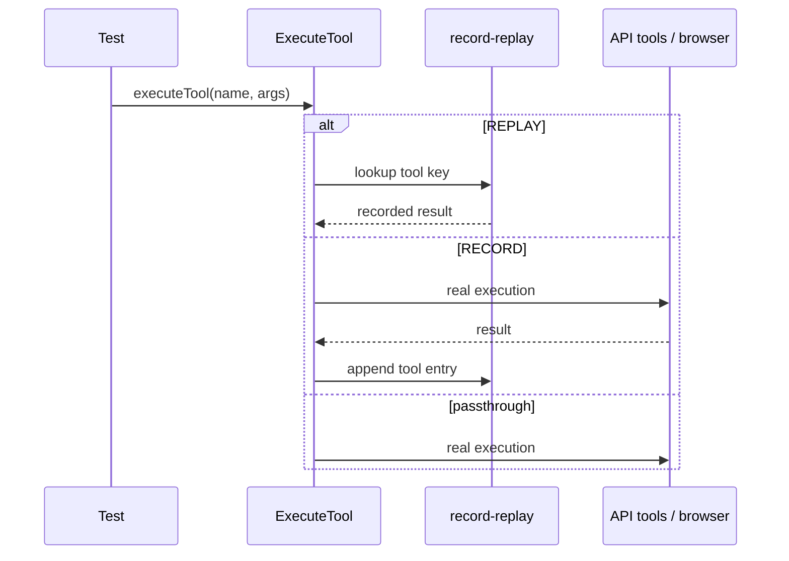

# Feature 19 — Determinism mode for testing

**Audit ref:** [feature-audit-roadmap.md](../feature-audit-roadmap.md) item **#19**  
**Architecture ref:** [context.md](../../context.md) — tool loop, generations API, test layout  
**Suggested sequence:** Quality/scale wave (after project-scoped configs #22; pairs with headless #18 and eval harness #21)

---

## Current state

| Area | What exists today |
|------|-------------------|
| **Unit / module tests** | ~500 tests via `npm test`: `node --test` (JS) + `tsx --import ./test/test-loader.mjs` (TS/DOM). [`test/test-loader.mjs`](../../../test/test-loader.mjs) stubs `.css` and xterm for Node. |
| **Isolation** | [`MINNOW_HOME`](../../context.md) temp dirs via [`test/config/test-helpers.js`](../../../test/config/test-helpers.js) `setTestHome()`; fixed UUIDs in many suites. |
| **Generations** | Backend buffers upstream SSE in [`server/generations/`](../../../server/generations/); client [`streamCompletionTurn`](../../../src/tools/loop.ts) uses `createGeneration` + `subscribeToGeneration`. [`test/api/generations.test.mjs`](../../../test/api/generations.test.mjs) uses **deterministic mock upstream** (`SSE_FIXTURE`) but does not snapshot client tool loops. |
| **Tool execution** | [`executeTool`](../../../src/tools/client.ts) → `executeToolInner` → browser executor, `POST /api/tools`, sub-agent/board handlers, approval gate, `ask_question` UI queue. No cache or record layer ([audit #8](feature-audit-roadmap.md) is separate). |
| **Sub-agents** | [`defaultSubAgentRunner`](../../../src/agents/sub-agent-runner.ts) calls `input.executeTool` and `postChatCompletions` (generations, `persist: false`). Tests inject mock `executeTool` ([`test/sub-agents/sub-agent-runner.test.mts`](../../../test/sub-agents/sub-agent-runner.test.mts)). |
| **Orchestrator “Step 19 hooks”** | [`recordToolCallForRun`](../../../src/agents/orchestrator.ts) / `getRunToolCallFingerprint` — **supervisor repetition heuristics**, not test record/replay. Do not conflate; may reuse fingerprint ideas for snapshot keys. |
| **Integration recording** | **Missing** — no `MINNOW_RECORD`, no committed snapshots, no replay path in production interceptors. |

**Intercept targets (from audit scope):**

1. **`executeTool`** — [`src/tools/client.ts`](../../../src/tools/client.ts) public export (wrap `executeToolInner`, not only server POST).
2. **`streamCompletionTurn`** — private in [`src/tools/loop.ts`](../../../src/tools/loop.ts) (~L396–511); also headless SSE via [`postChatCompletions`](../../../src/providers/fetch-chat.ts) used by sub-agent runner, titles, Reef widget LLM.

---

## Gap

- Live LLM and live tools (filesystem, git, network, browser CDP, MCP) make **end-to-end agent tests non-repeatable** in CI.
- Existing tests **mock at the call site** (inject `executeTool`, custom runners, mock HTTP servers) rather than a **shared cassette** format.
- No workflow to **refresh golden snapshots** when behavior intentionally changes.
- **`seed`** is not forwarded on completion bodies today ([`ChatCompletionBody`](../../../src/api/chat.ts) has `temperature` / `max_tokens` only); local providers that support `seed` cannot be pinned from tests.

**Out of scope for v1 (explicit):**

- User-facing **trace/fork/replay** product feature ([audit #1](feature-audit-roadmap.md)) — different storage model and UI; only share naming discipline.
- **Tool result caching** for performance ([audit #8](feature-audit-roadmap.md)).
- Replacing all unit tests with cassettes — determinism mode is for **integration-style** suites opt-in per test file.

---

## Goals

1. **`MINNOW_RECORD=1`** — On each intercepted call, run the real implementation once, append to a named snapshot bundle on disk.
2. **`MINNOW_REPLAY=1`** — Skip upstream/model and skip non-deterministic externals; return recorded tool results and replay LLM SSE chunks in order.
3. **Stable keys** — Same logical call → same cassette entry across runs (normalized args, message fingerprint, turn index).
4. **Seed pinning** — When `MINNOW_SEED` (or bundle metadata `seed`) is set, merge into outbound completion JSON for providers that accept it.
5. **CI-friendly** — Replay mode runs offline; no API keys; no LM Studio required for opted-in tests.
6. **Contributor workflow** — Documented commands to record, review diff, and commit under `test/snapshots/`.

---

## Acceptance criteria

- [ ] `src/testing/record-replay.ts` exports mode enum, `getRecordingMode()`, `withSnapshotBundle(name, fn)`, tool + stream record/replay APIs.
- [ ] `MINNOW_RECORD` and `MINNOW_REPLAY` are **mutually exclusive**; both unset → passthrough (zero overhead in production and default tests).
- [ ] `executeTool` records `{ content, attachments? }` and errors as structured entries; replay returns byte-identical `ToolExecutionResult` for the same key.
- [ ] `streamCompletionTurn` records an ordered list of **parsed** `ChatCompletionChunk` objects (not raw bytes only) plus terminal `finish_reason` / finalized tool calls; replay drives the same `handleChunk` path.
- [ ] Headless `postChatCompletions` / sub-agent runner path can use the **same** stream cassette format (shared helper).
- [ ] Snapshot root defaults to `test/snapshots/<bundle-id>/` (override via `MINNOW_SNAPSHOT_DIR`).
- [ ] At least one integration test in `test/testing/` passes in replay mode without network.
- [ ] `npm run test:replay` (or documented subset) runs replay-marked tests only.
- [ ] `documentation/context.md` updated with env table and maintainer workflow.
- [ ] Snapshot files are **redacted** for secrets (`api_key`, `braveApiKey`, bearer tokens) before write.

---

## Architecture

### Mode detection

```text
process.env.MINNOW_RECORD === '1'  → record (run real, then write)
process.env.MINNOW_REPLAY === '1'  → replay (read only)
else                                 → passthrough
```

Optional:

| Variable | Purpose |
|----------|---------|
| `MINNOW_SNAPSHOT_BUNDLE` | Active bundle id (e.g. `sub-agent-explore-basic`); required in record/replay |
| `MINNOW_SNAPSHOT_DIR` | Root directory (default: repo `test/snapshots`) |
| `MINNOW_SEED` | Integer seed merged into completion body when recording/replaying |
| `MINNOW_RECORD_ALLOW_MISSING` | In record mode, if no cassette yet, run real (default true) |

### Module layout

```text
src/testing/
  record-replay.ts      # Public API: mode, bundle I/O, intercept helpers
  fingerprint.ts        # stableHash(toolName, normalizedArgs), hashMessages(body)
  normalize-args.ts     # Sort keys, strip undefined, workspace path placeholders
  redact.ts             # Strip secrets before persist
```

### Snapshot bundle on disk

```text
test/snapshots/
  <bundle-id>/
    manifest.json       # schemaVersion, createdAt, minnowVersion?, seed?, description
    tools/
      <key>.json          # { "v":1, "name", "args", "result"|"error" }
    streams/
      <key>.json          # { "v":1, "chunks":[...], "meta":{ finish_reason, tool_calls? } }
```

**Tool key:** `tools/<sha256(name + canonicalJson(normalizedArgs))>.json`  
**Stream key:** `streams/turn-<nn>-<sha256(fingerprint(messages, model, tools))>.json` where `nn` is monotonic per bundle session (handles identical prompts in successive tool-loop turns).

Use **fixed** bundle ids and turn indices in tests — never `Date.now()` or random ids in keys.

### Intercept flow



```mermaid
sequenceDiagram
  participant Loop as streamCompletionTurn
  participant RR as record-replay
  participant Gen as /api/generations

  alt REPLAY
    Loop->>RR: load stream key
    RR-->>Loop: chunks[] sequential
    Loop->>Loop: handleChunk each
  else RECORD
    Loop->>Gen: createGeneration + subscribe
    Gen-->>Loop: live chunks
    Loop->>RR: append chunks on end
  else passthrough
    Loop->>Gen: live
  end
```

### Wiring points

| Function | File | Change |
|----------|------|--------|
| `executeTool` | [`src/tools/client.ts`](../../../src/tools/client.ts) | Outermost wrapper after `runWithFileTreeAutoRefresh`: `return maybeReplayTool(name, args, () => executeToolInner(...))` |
| `streamCompletionTurn` | [`src/tools/loop.ts`](../../../src/tools/loop.ts) | Before `createGeneration`, branch to `replayStreamTurn` / wrap subscribe callback to record chunks |
| `postChatCompletions` | [`src/providers/fetch-chat.ts`](../../../src/providers/fetch-chat.ts) | Optional: record raw SSE lines at synthetic Response boundary (covers sub-agent without duplicating parser) |
| `streamSubAgentTurn` | [`src/agents/sub-agent-runner.ts`](../../../src/agents/sub-agent-runner.ts) | Prefer delegating to shared `recordableStreamTurn(providerId, body, signal)` |

**Non-deterministic bypass list (replay must not call real impl):**

- `ask_question` — require test stub or pre-recorded user answers in bundle metadata.
- `maybeBlockToolForUserApproval` — tests set tools to `full` + workspace fixtures, or inject `ExecuteToolContext` test flag `skipApproval: true` (small additive field).
- Streaming terminal tools (`execute_command`, etc.) — normalize dynamic output (strip timestamps / PIDs) on record, or exclude from v1 bundles.

### Server-side option (phase 2)

Recording at [`server/generations/store.js`](../../../server/generations/store.js) append time avoids duplicating SSE parsing for headless callers. **v1 client-only** is sufficient if `postChatCompletions` intercept is shared; add server middleware only if double-recording becomes a maintenance burden.

### Seed pinning

1. Extend [`ChatCompletionBody`](../../../src/api/chat.ts) with optional `seed?: number`.
2. In [`streamCompletionTurn`](../../../src/tools/loop.ts) body build (~L778), set `seed: readPinnedSeed()` when `MINNOW_SEED` present.
3. [`server/generations/routes.js`](../../../server/generations/routes.js) already forwards `state.requestBody` JSON to upstream — no strip list if field present.
4. Store `seed` in `manifest.json` when recording; replay injects same value.

---

## Key files

| Path | Role |
|------|------|
| **New** `src/testing/record-replay.ts` | Core mode + bundle I/O + intercept helpers |
| **New** `src/testing/fingerprint.ts` | Stable keys for tools and streams |
| **New** `src/testing/normalize-args.ts` | Canonical args for hashing |
| **New** `src/testing/redact.ts` | Secret stripping |
| [`src/tools/client.ts`](../../../src/tools/client.ts) | `executeTool` intercept |
| [`src/tools/loop.ts`](../../../src/tools/loop.ts) | `streamCompletionTurn` intercept |
| [`src/providers/fetch-chat.ts`](../../../src/providers/fetch-chat.ts) | Headless stream intercept |
| [`src/agents/sub-agent-runner.ts`](../../../src/agents/sub-agent-runner.ts) | Sub-agent loop uses shared stream helper |
| [`src/api/chat.ts`](../../../src/api/chat.ts) | `ChatCompletionBody.seed` |
| [`src/api/generations.ts`](../../../src/api/generations.ts) | Unchanged API; replay bypasses `createGeneration` |
| **New** `test/testing/record-replay.test.mts` | Unit tests for fingerprint + round-trip |
| **New** `test/testing/tool-loop-replay.test.mts` | Reference integration |
| **New** `test/snapshots/README.md` | Bundle naming conventions |
| [`package.json`](../../../package.json) | `test:replay`, `snapshots:record` scripts |
| [`documentation/context.md`](../../context.md) | Ship note + env table |

---

## Implementation phases

### Phase 0 — Design & schema (0.5 d)

- Finalize `manifest.json` and entry `v` field; document in `test/snapshots/README.md`.
- Agree on path normalization: replace absolute workspace root with `$WORKSPACE` in recorded args.
- List v1 unsupported tools (interactive / streaming) in README.

### Phase 1 — Core module (1 d)

- Implement `record-replay.ts` with bundle load/save, mutex for parallel tests (per-bundle file lock or sequential test tag).
- Unit tests: fingerprint stability, redaction, record→replay equality on synthetic objects.
- **Todos:** `schema-v1`, `record-replay-core`

### Phase 2 — Tool intercept (1 d)

- Wrap `executeTool`; record after success/failure; replay short-circuit.
- Handle `ToolExecutionResult.attachments` (store relative URLs or omit binary in v1).
- **Todos:** `intercept-execute-tool`

### Phase 3 — LLM stream intercept (1.5 d)

- Extract chunk accumulator from `streamCompletionTurn` into shared `consumeGenerationStream` / `replayChunks`.
- Wire `postChatCompletions` for sub-agent parity.
- Turn index counter per bundle (module state reset in `withSnapshotBundle`).
- **Todos:** `intercept-llm-streams`

### Phase 4 — Seed + ergonomics (0.5 d)

- `MINNOW_SEED`, body merge, manifest persistence.
- **Todos:** `seed-pinning`

### Phase 5 — Test harness & golden (1 d)

- `test/testing/*`, example bundle committed.
- `npm run snapshots:record -- test/testing/tool-loop-replay.test.mts`
- `npm run test:replay`
- **Todos:** `test-harness`, `golden-integration`

### Phase 6 — Docs (0.25 d)

- Update `context.md`; mark audit #19 Partial → Built when shipped.
- **Todos:** `docs-context`

**Estimated total:** ~5–6 days focused implementation + review.

---

## Dependencies

| Dependency | Relationship |
|------------|--------------|
| [**#18 Headless CLI**](feature-audit-roadmap.md) | **Soft.** Replay mode enables CI for headless once it exists; not blocking v1 (tests can call `runChatTurn` / runner APIs directly with happy-dom). |
| [**#1 Trace/replay product**](feature-audit-roadmap.md) | **None for v1.** Different UX and storage (`runs/` vs `test/snapshots/`). Revisit shared cassette format if both ship. |
| [**#21 Eval harness**](feature-audit-roadmap.md) | **Consumer.** Eval runner should use same bundles for model comparisons. |
| **Backend generations** | **Hard.** Stream format must match `ChatCompletionChunk` parsing ([`parseSsePayloads`](../../../src/api/chat.ts)). |
| **`MINNOW_HOME` fixtures** | **Complementary.** Continue using temp homes for config APIs; cassettes for LLM/tools. |
| **Feature #18 file-tree CRUD** | Name collision only — audit #18 in roadmap is headless; product backlog `feature-18` was file-tree (shipped). |

---

## Tests

### New automated coverage

| Suite | Intent |
|-------|--------|
| `test/testing/record-replay.test.mts` | Fingerprint, redact, bundle round-trip, mode mutual exclusion |
| `test/testing/tool-loop-replay.test.mts` | End-to-end: mock or record one tool loop turn; assert history + tool messages in replay |
| Extend `test/api/generations.test.mjs` | Optional: assert `seed` forwarded in `requestBody` when env set |

### Conventions

- Import `withSnapshotBundle('bundle-id', async () => { ... })` in `before` / per test.
- Use **fixed** chat/run UUIDs (same as existing sub-agent tests).
- Commit snapshots under `test/snapshots/<bundle-id>/`; PR review must include cassette diff.
- Mark replay-only tests with `describe(..., { skip: process.env.MINNOW_REPLAY !== '1' })` **inverted**: default `npm test` runs unit tests without replay; `test:replay` sets env.

### Manual verification

1. `MINNOW_RECORD=1 MINNOW_SNAPSHOT_BUNDLE=manual-smoke npm start` — run one chat turn with real model; inspect bundle.
2. `MINNOW_REPLAY=1 MINNOW_SNAPSHOT_BUNDLE=manual-smoke npm test` — same transcript without model.
3. Delete one tool entry → replay fails with clear “missing cassette” error.

---

## Risks and mitigations

| Risk | Impact | Mitigation |
|------|--------|------------|
| **Snapshot churn** | Noisy PRs | Strict normalization; small reference bundles; `snapshots:record` only on intentional refresh |
| **Secrets in cassettes** | Leak API keys | `redact.ts` + CI grep for `sk-` / `Bearer` |
| **Approval / ask_question blocking record** | Hung record runs | Test flag `skipApproval`; stub `ask_question` in bundles |
| **Binary attachments** | Large / unstable snapshots | Omit or hash PNG in v1; document limitation |
| **MCP / browser tools** | Environment-dependent output | Exclude from v1 golden sets; tag bundles `requires-live` |
| **Parallel test workers** | Corrupt bundle writes | One bundle per test file; file lock or `node --test --test-concurrency=1` for record job |
| **Drift vs generations API** | Replay parses wrong | Record parsed chunks, not only raw SSE; version field in manifest |
| **Confusion with orchestrator `recordToolCallForRun`** | Wrong hook wired | Rename in docs; do not reuse for cassettes |
| **Browser-only `executeTool` paths** | Node tests cannot record UI tools | Run record harness under happy-dom with DOM stubs ([`test/chat/generation-resume.test.mts`](../../../test/chat/generation-resume.test.mts) pattern) |

---

## Open questions (resolve in Phase 0)

1. **Record in CI?** — Default **no** (local maintainer only); CI runs replay-only.
2. **Server vs client recording for streams** — Start client-only; spike server hook if sub-agent duplication hurts.
3. **Sub-agent drawer live transcripts** — Record runner messages array as optional `transcript.json` sidecar vs stream cassettes only?
4. **Vite `import.meta.env`** — Prefer `process.env` in code paths shared with Node tests; avoid bundler-only env for mode detection.

---

## Related reading

- [feature-audit-roadmap.md](../feature-audit-roadmap.md) — item #19 scope line
- [context.md](../../context.md) — `executeTool`, `streamCompletionTurn`, generations, `MINNOW_HOME`
- [`test/api/generations.test.mjs`](../../../test/api/generations.test.mjs) — mock upstream SSE pattern to reuse
- [`test/sub-agents/sub-agent-runner.test.mts`](../../../test/sub-agents/sub-agent-runner.test.mts) — injectable `executeTool` pattern
