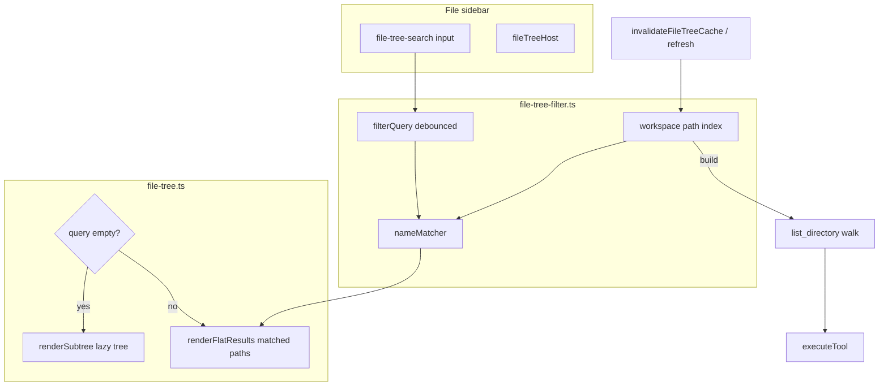

# Feature 19 — Search / filter in file tree

**Implementation build plan** for implementer and verifier sub-agents. **Plan only** — no code in this document.

| Field | Value |
|-------|--------|
| **ID** | `feature-19-file-search` |
| **Backlog** | [`documentation/plans/product_backlog_agents_48a41af9.plan.md`](../product_backlog_agents_48a41af9.plan.md) — Epic E — File panel, **E2** |
| **Wave** | **4** (with F1–F6 per backlog assignment waves) |
| **Depends on** | **Step 11** file panel (tree, `list_directory`, `executeTool`, sidebar layout) |
| **Independent of** | Feature 18 (CRUD), Feature 20 (internal DnD), Feature 21 (padding) — can ship in any order |
| **Out of scope (v1)** | Search inside file contents, ripgrep, regex across repo, replacing agent `find_files` / `search_in_file` tools |

## Problem statement

Users browsing a deep project tree must **expand folders manually** to find files by name. The lazy tree only renders **expanded** directories, so a basename filter on visible rows cannot surface files inside collapsed folders. v1 adds a **filter input above the tree**, builds a **workspace path index** when the query is non-empty, and shows a **flat result list**; clearing the filter restores the existing lazy tree.

## Goal

Add a **filter input above the project file tree** so users can quickly locate files by **name** without expanding folders manually.

| Version | Scope |
|---------|--------|
| **v1** | Name filter only — case-insensitive match on file **basename** (and optionally folder names); flat results list while filtering |
| **Phase 2** | “Search in files” — content search via ripgrep or extended server tool (see [Phase 2 notes](#phase-2-notes)) |

Backlog wording mentions “fuzzy match”; **v1 ships without a new npm dependency** — use a documented, testable **subsequence** matcher (characters of the query appear in order in the basename) plus **substring** as a simpler fallback mode if product prefers predictability over “fuzzy” feel.

## Current state (research summary)

### Markup — [`index.html`](../../../index.html)

```html
<aside class="file-sidebar" id="fileSidebar">
  <div class="file-sidebar-header">… title, collapse, refresh …</div>
  <div class="file-tree-host" id="fileTreeHost" role="tree"></div>
</aside>
```

There is **no** search field between header and tree. Collapsed sidebar CSS already hides `.file-tree-host` (`.file-sidebar.collapsed .file-tree-host { display: none }` in [`src/styles/file-panel.css`](../../../src/styles/file-panel.css)) — search input should hide the same way.

### Tree renderer — [`src/ui/file-tree.ts`](../../../src/ui/file-tree.ts)

| Behavior | Today |
|----------|--------|
| Data | Lazy `list_directory` via `executeTool`; in-memory `listingCache: Map<dirPath, ParsedListing>` |
| Render | `renderFileTree()` → `renderSubtree()` only for **expanded** dirs under `treeRoot` (default `.`) |
| Rows | `appendDirRow` / `appendFileRow` — basename in `.file-tree-label`; full path via `joinPath(parent, name)` |
| Refresh | `refreshFileTree()` invalidates cache, refetches root + all `expandedDirs` |
| Offline | `renderOfflineEmpty()` when `!getLocalServerAvailable()` |
| Filter | **None** — collapsed folders hide all descendants |

**Implication:** Hiding non-matching rows in the existing tree **does not** find files inside collapsed directories. v1 must **index the workspace** (walk) or call a server enumerator when the filter query is non-empty.

### State — [`src/state/file-panel.ts`](../../../src/state/file-panel.ts)

Persisted `filePanel`: `expandedDirs`, `selectedPath`, `treeRoot`, layout flags. **Do not** persist filter query in v1 (session-only module state); restoring expanded dirs after clear is enough.

### Init — [`src/ui/init-file-panel.ts`](../../../src/ui/init-file-panel.ts)

Wires refresh button, boot `initFileTreeIfNeeded()`, `onFilePanelServerAvailabilityChanged()`. Search init should run here (or from a dedicated `initFileTreeSearch()` called from the same path).

### Existing filter UX precedent — [`src/ui/skill-picker.ts`](../../../src/ui/skill-picker.ts)

`filterQuery` + `toLowerCase().includes(q)` on id/label/description. Reuse the **debounced input** pattern, not the picker DOM.

### Server tools (phase 2 / optional v1)

| Tool | Role |
|------|------|
| `list_directory` | Already used for tree; suitable for **client-driven recursive index** (same permission model as tree read — no Settings toggle required today) |
| `find_files` | Server walk with glob (`FIND_FILES_MAX = 500` in [`server.js`](../../../server.js)); poor fit for arbitrary substring unless pattern is `**/*` + client filter and truncation is acceptable |
| `search_in_file` | Per-file line regex — **not** repo-wide content search |

Tree reads bypass tool enablement in Settings (Step 11). Index walk should use the same `executeTool('list_directory', …)` path, not raw `fetch`.

## Architecture (v1)



### v1 render modes

1. **Browse mode** (`filterQuery` empty): current lazy tree unchanged.
2. **Filter mode** (`filterQuery` non-empty): replace tree body with a **flat list** of matching paths (files primary; optional folder rows if basename matches). Click row → `openFileInViewer` (files) or expand-in-browse (folders — product choice below).

### Workspace index (v1)

| Approach | Pros | Cons |
|----------|------|------|
| **A — Client BFS walk** (`list_directory` per dir) | No new server code; same security as tree; respects workspace root | Many tool calls on first search; need skip list |
| **B — `find_files` `**/*` + client filter** | One-ish server call | Hard cap 500 paths; truncation UX |
| **C — New `index_workspace` API** | Fast, single round-trip | Out of scope for v1 unless walk is too slow in dogfood |

**Recommendation: Approach A** with:

- Skip directory basenames: `.git`, `node_modules`, `dist`, `.minnow` (align with common agent ignore list; document in code).
- Index cache keyed by `treeRoot` + invalidation on `invalidateFileTreeCache()` / `refreshFileTree()`.
- Build index **lazily** on first non-empty query (show “Indexing…” in host), not on every panel open.
- Debounce query input **200 ms** before match/render.

### Name matching (v1)

Pure functions in **`src/ui/file-tree-filter.ts`** (unit-testable):

```ts
// Illustrative — implementer fills exact signatures
export function normalizeFilterQuery(raw: string): string;
export function basenameOf(relativePath: string): string;
export function matchesNameFilter(query: string, name: string): boolean;
```

**Default `matchesNameFilter`:** case-insensitive **subsequence** on basename (query chars appear in order). If subsequence feels too loose, ship **substring** (`includes`) instead and document in verifier checklist.

**Sort results:** basename match score (shorter path / earlier index tie-break), then `localeCompare` on full path.

### UI module layout

| File | Responsibility |
|------|----------------|
| [`src/ui/file-tree-filter.ts`](../../../src/ui/file-tree-filter.ts) | **New** — matcher, index builder, skip dirs, `getIndexedPaths()`, `filterPaths(paths, query)` |
| [`src/ui/file-tree-search.ts`](../../../src/ui/file-tree-search.ts) | **New** — bind `#fileTreeSearch`, debounce, clear button, `getFilterQuery()` / `setFilterQuery('')`, call `renderFileTree()` |
| [`src/ui/file-tree.ts`](../../../src/ui/file-tree.ts) | Branch in `renderFileTree()`; `renderFlatResults()`; export `invalidateFileTreeIndex()` called from `invalidateFileTreeCache()` |
| [`index.html`](../../../index.html) | Markup: search row between header and host |
| [`src/styles/file-panel.css`](../../../src/styles/file-panel.css) | `.file-tree-search`, focus ring, collapsed hide, empty/truncation states |
| [`src/ui/init-file-panel.ts`](../../../src/ui/init-file-panel.ts) | `initFileTreeSearch()` on boot |

**Keyboard:** `/` focuses search when file sidebar visible and not typing elsewhere (optional — mark as stretch in todos). **Escape** clears filter and restores browse mode.

**Accessibility:** `aria-label="Filter files by name"`, `role="searchbox"`, results list `role="listbox"` or keep `role="tree"` with flat items — prefer **listbox** in filter mode for clarity.

## Schema / API (v1)

| Area | v1 change |
|------|-----------|
| **REST** | None — reuse `POST /api/tools` with `list_directory` only |
| **Tool IDs** | None — no new server tools |
| **Persistence** | None — filter query is session-only module state (not `filePanel` in `config.json`) |
| **Migrations** | None |

## Files touched (expected)

| Path | Action |
|------|--------|
| [`index.html`](../../../index.html) | Search row between `.file-sidebar-header` and `#fileTreeHost` |
| [`src/styles/file-panel.css`](../../../src/styles/file-panel.css) | `.file-tree-search-wrap`, collapsed hide alongside `.file-tree-host` |
| [`src/ui/file-tree-filter.ts`](../../../src/ui/file-tree-filter.ts) | **New** — matcher, index, skip dirs |
| [`src/ui/file-tree-search.ts`](../../../src/ui/file-tree-search.ts) | **New** — input bind, debounce, clear |
| [`src/ui/file-tree.ts`](../../../src/ui/file-tree.ts) | Browse vs filter render; `invalidateFileTreeIndex()` |
| [`src/ui/init-file-panel.ts`](../../../src/ui/init-file-panel.ts) | `initFileTreeSearch()` |
| [`test/file/file-tree-filter.test.mjs`](../../../test/file/file-tree-filter.test.mjs) | **New** |
| [`test/file/file-tree-search.test.mjs`](../../../test/file/file-tree-search.test.mjs) | **New** |
| [`test/file/file-tree-filter-render.test.mjs`](../../../test/file/file-tree-filter-render.test.mjs) | **New** |
| [`documentation/context.md`](../../context.md) | On ship — name filter + phase 2 pointer |
| [`documentation/plans/verification/feature-19.md`](../verification/feature-19.md) | Sign-off checklist (this feature) |

**Explicitly unchanged:** `server.js` tool handlers (unless team later chooses `find_files` approach B); agent tool definitions for `find_files` / `search_in_file`.

## Phase 2 notes

**Title:** Search in files (content), not just names.

| Topic | Notes |
|-------|--------|
| **User goal** | Find files containing a string / regex across the workspace |
| **Backlog hint** | “optional search in files (ripgrep tool)” |
| **Existing tools** | `search_in_file` is single-file; agents use it in loops — not a panel feature |
| **Options** | (1) New server tool `grep_workspace` / `ripgrep` wrapping `rg --json` with workspace guard; (2) bounded `execute_command` template (fragile on Windows); (3) extend `find_files` with content predicate (heavy) |
| **UI** | Toggle or second input: “Name” vs “Content”; content mode shows path + line previews; click opens viewer at line |
| **Performance** | Debounce, cancel in-flight search, max results, respect `.gitignore` via `rg --ignore` |
| **Permissions** | Likely **Ask** / **Full** in Settings (read + execute), unlike name index |
| **Dependencies** | v1 filter input and flat-result UX can be reused |

Do **not** implement phase 2 in the v1 PR.

## Build plan

### Phase A — Pure filter logic

- [ ] **A1** Create `src/ui/file-tree-filter.ts` with `matchesNameFilter`, `basenameOf`, `sortFilteredPaths`.
- [ ] **A2** Add `shouldSkipDirName(name: string): boolean` for `.git`, `node_modules`, etc.
- [ ] **A3** Unit tests in `test/file/file-tree-filter.test.mjs` (no DOM): subsequence/substring cases, case folding, empty query → all pass.

### Phase B — Workspace index

- [ ] **B1** Implement async `buildWorkspaceIndex(root: string): Promise<string[]>` using BFS + `executeTool('list_directory')`.
- [ ] **B2** Module-level index cache + `invalidateFileTreeIndex()` wired from `invalidateFileTreeCache()`.
- [ ] **B3** Loading state: while index builds, show `.file-tree-loading` “Indexing project…”.
- [ ] **B4** Error surface: failed listing → short message in host (reuse `.file-tree-error`).

### Phase C — Search UI

- [ ] **C1** Add to `index.html` inside `#fileSidebar` after `.file-sidebar-header`:

  ```html
  <div class="file-tree-search-wrap">
    <input type="search" id="fileTreeSearch" class="file-tree-search"
      placeholder="Filter files…" autocomplete="off"
      aria-label="Filter files by name" />
    <button type="button" class="icon-btn file-tree-search-clear hidden"
      id="btnFileTreeSearchClear" aria-label="Clear filter"></button>
  </div>
  ```

- [ ] **C2** Styles in `file-panel.css` — mono placeholder, clear button, hide wrap when `.file-sidebar.collapsed`.
- [ ] **C3** `src/ui/file-tree-search.ts` — input + debounce + clear; disabled when offline.
- [ ] **C4** Call `initFileTreeSearch()` from `initFilePanel()`.

### Phase D — Tree integration

- [ ] **D1** `renderFileTree()` — if `getFilterQuery().trim()`, call `renderFlatResults()` instead of `renderSubtree()`.
- [ ] **D2** Flat rows: show **relative path** (muted parent + bold basename) or full path truncated; reuse `.file-tree-row--file` click → `openFileInViewer`.
- [ ] **D3** Empty filter results: “No matching files” (`.file-tree-empty`).
- [ ] **D4** Clearing filter restores lazy tree from existing `expandedDirs` without extra network if cache warm.
- [ ] **D5** Ensure drag-to-composer still works on flat file rows (reuse `appendFileRow` or shared row factory).

### Phase E — Docs and verification artifact

- [ ] **E1** Add [`documentation/plans/verification/feature-19.md`](../verification/feature-19.md) manual checklist.
- [ ] **E2** Update [`documentation/context.md`](../../context.md) File panel section when shipped (name filter, index behavior, phase 2 pointer).

## Test plan

### Automated (`npm test`)

| Test file | Covers |
|-----------|--------|
| `test/file/file-tree-filter.test.mjs` | `matchesNameFilter`, `sortFilteredPaths`, `shouldSkipDirName` — static inputs, no network |
| `test/file/file-tree-search.test.mjs` | happy-dom: input renders, debounced `renderFileTree` invoked, clear resets query, offline disables input |
| `test/file/file-tree-filter-render.test.mjs` | happy-dom: mock index + query → flat rows in `#fileTreeHost`, empty state copy |

**Mocking:** Stub `executeTool` / index builder in render test to return fixed path list (avoid real server in unit tests).

**Optional integration** (gated, `MINNOW_HOME` temp workspace): walk small fixture dir, assert file count — only if BFS proves flaky; not required for v1 sign-off.

### Manual verification (with `npm start`)

| # | Step | Expected |
|---|------|----------|
| M1 | Open Files sidebar, type partial basename | Flat list updates; files in collapsed folders appear |
| M2 | Clear filter | Lazy tree returns; prior expanded folders still expanded |
| M3 | Click result file | Viewer opens correct path |
| M4 | Query with no matches | “No matching files” |
| M5 | Refresh tree button | Index invalidated; re-filter rebuilds index |
| M6 | `npm run dev` only (no server) | Search disabled; offline tree message unchanged |
| M7 | Collapse file sidebar rail | Search input hidden with tree |
| M8 | Large repo (optional) | Indexing message shown; UI remains responsive |

## Acceptance criteria (from backlog)

| Criterion | How to verify |
|-----------|----------------|
| Filter input above tree | M1 — visible between header and `#fileTreeHost` |
| Name filter (v1) | M1, M4 — basename matching only; no content hits |
| Fuzzy / forgiving match | Automated filter tests + M1 partial character match |
| Tree usable after clear | M2 |
| Phase 2 not in v1 | No content search UI or ripgrep dependency |

## Open questions (resolve before or during implementation)

1. **Matcher:** subsequence (“fuzzy-lite”) vs strict `includes` — which matches backlog intent?
2. **Folders in results:** include matching directory paths or **files only**?
3. **Folder row click in filter mode:** open nothing, expand in browse mode after clear, or `expandDir` + clear filter?
4. **Skip list:** fixed built-in ignores only, or read `.gitignore` in phase 2?
5. **Index on every refresh:** always invalidate index on `refreshFileTree()` (recommended) — confirm UX.
6. **Keyboard `/` focus:** v1 or fast-follow?

## Risks

| Risk | Mitigation |
|------|------------|
| Many `list_directory` calls on large repos | Skip dirs; lazy index; show indexing state; consider cap + “too many files” message |
| Filter + CRUD (feature 18) interaction | Flat mode uses same row actions when CRUD lands; invalidate index after mutations |
| Subsequence matches too many paths | Prefer substring or minimum query length (e.g. 2 chars) |
| `FIND_FILES_MAX` if team chooses approach B | Document truncation; stick to approach A for v1 |

## Related features

| Feature | Relationship |
|---------|----------------|
| feature-18-file-tree-crud | Same rows/host; index invalidation on delete/move/rename |
| feature-20-drag-drop-move-confirm | Independent |
| feature-21-file-tree-padding | Cosmetic; search row padding can align in either order |

## Verifier handoff

Create [`documentation/plans/verification/feature-19.md`](../verification/feature-19.md):

- **Automated:** `node --test test/file/file-tree-filter.test.mjs test/file/file-tree-search.test.mjs test/file/file-tree-filter-render.test.mjs`
- **Manual:** M1–M8 above
- **Sign-off:** v1 name filter only; phase 2 documented as not shipped
