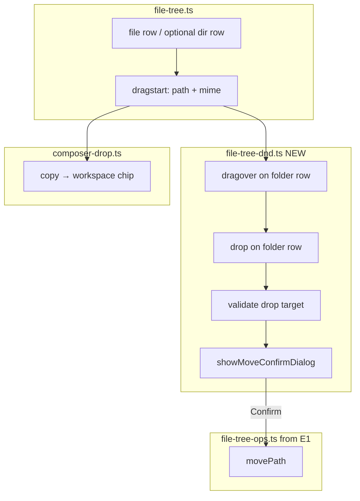

# Feature 20 — Drag-and-drop move with confirmation

**Implementation build plan** for implementer and verifier sub-agents. **Plan only** — no code in this document.

| Field | Value |
|-------|--------|
| **Backlog** | [`documentation/plans/product_backlog_agents_48a41af9.plan.md`](../product_backlog_agents_48a41af9.plan.md) — Epic E3 `feature-20-drag-drop-move-confirm` |
| **Depends on** | **Feature 18 (E1)** (`feature-18-file-tree-crud`) — `movePath`, `setStatus` feedback, `data-path` on rows, post-move viewer/tree sync |
| **Out of scope** | New REST move API; copy-on-drop; multi-select drag; undo; Feature 19 filter; Feature 21 padding |

## Problem statement

| Layer | Today | Gap |
|-------|--------|-----|
| **Tree DnD** | File rows drag to **composer** only (`copy` effect, workspace reference chips) | No drop-on-folder move inside the tree |
| **Move UX** | Agents and (after E1) context-menu cut/paste use `move_file` | Users cannot drag a file/folder onto a folder and confirm in-panel |
| **Backlog (E3)** | “Drop on folder → modal `Move a.ts → src/?` → call move API” | Needs confirm dialog + reuse E1 `movePath`, not a new HTTP route |

Composer drag-and-drop must remain unchanged.

## Goal

Enable **internal** drag-and-drop in the project file tree: drag a file (and optionally a folder) onto a **folder row**, show a **confirmation dialog**, then **move** via the existing `move_file` tool path (same as context-menu Cut/Paste and Rename in Feature 18).

**Keep unchanged:** drag from file tree → **composer** (workspace reference chips, `copy` drop effect, 5px movement threshold).

## Current state (research summary)

### Two drag channels today

| Channel | Source | Target | Payload | Effect |
|---------|--------|--------|---------|--------|
| **Composer** | File rows only (`appendFileRow`) | `#msgInput`, `.input-bar`, `.input-bar-composer` | `WORKSPACE_FILE_MIME` + `text/plain` (relative path) | `copy` → `addWorkspaceReference()` |
| **Internal tree** | — | — | — | **Not implemented** |

### File tree — [`src/ui/file-tree.ts`](../../../src/ui/file-tree.ts)

| Behavior | Today |
|----------|--------|
| Draggable | **File rows only** (`row.draggable = true`) |
| Drag gate | 5px pointer movement (`FILE_TREE_DRAG_THRESHOLD_PX` in [`workspace-ref.ts`](../../../src/attachments/workspace-ref.ts)) so click still opens viewer |
| `dragstart` | Sets `effectAllowed = 'copy'`; MIME `application/x-minnow-workspace-file` |
| Folder rows | Expand/collapse only; **not** draggable or drop targets |
| Row metadata | No `data-path` yet (Feature 18 adds `data-path`, `data-entry-kind`) |

### Composer drop — [`src/ui/composer-drop.ts`](../../../src/ui/composer-drop.ts)

- Listens on composer elements; `hasWorkspaceDrag()` accepts `WORKSPACE_FILE_MIME` or short `text/plain`.
- `dropEffect = 'copy'`; does not call `move_file`.
- Uses `dragDepth` counter for highlight class `composer-drop-active`.

### Move API (no new endpoint)

| Concern | Location |
|---------|----------|
| Tool | `move_file` — `source` + `destination` relative paths |
| Server | [`server.js`](../../../server.js) `toolMoveFile` — `fs.rename`, creates parent dir |
| UI entry (E1) | [`src/ui/file-tree-ops.ts`](../../../src/ui/file-tree-ops.ts) `movePath(source, destination)` → `executeTool` + approval + `setStatus` + `refreshTreeAfterMutation()` |
| Permissions | Default **`off`** in [`defaults.ts`](../../../src/config/defaults.ts); user enables **Ask** / **Full** in Settings |

**This feature does not add a dedicated “move API” route.** “Move API” in backlog terms = **reuse** `move_file` through the Feature 18 ops layer.

### Confirmation UI elsewhere

- Destructive actions often use `window.confirm` (sidebar delete, memory delete, unsaved viewer).
- Tool **Ask** uses inline strip [`tool-approval-modal.ts`](../../../src/ui/tool-approval-modal.ts) (not centered).
- Backlog asks for a **modal** with copy like: `Move a.ts → src/?` — implement a **small native `<dialog>`** or styled overlay in the file panel (not the tool-approval strip; that still runs **after** confirm when permission is `ask`).

## Schema / API changes

| Area | v1 change |
|------|-----------|
| **REST** | None — no new `/api/files/*` routes |
| **Tools** | Reuse existing `move_file` via `POST /api/tools` and E1 `movePath()` |
| **Config / migration** | None |
| **HTML** | Optional `<dialog id="fileTreeMoveDialog">` in `index.html` or created once in TS |

Backlog “call move API” = **`executeTool('move_file', { source, destination })`** through [`file-tree-ops.ts`](../../../src/ui/file-tree-ops.ts), not a separate move endpoint.

## Exact file change list

| File | Action |
|------|--------|
| [`src/lib/path-utils.ts`](../../../src/lib/path-utils.ts) | **New** (or exports from `file-tree-ops.ts`) — `joinPath`, `basename`, `dirname`, `isDescendantPath`, `computeMoveDestination` |
| [`src/ui/file-tree-move-dialog.ts`](../../../src/ui/file-tree-move-dialog.ts) | **New** — `showMoveConfirmDialog()` |
| [`src/ui/file-tree-dnd.ts`](../../../src/ui/file-tree-dnd.ts) | **New** — delegation, drop highlight, confirm → `movePath` |
| [`src/ui/file-tree.ts`](../../../src/ui/file-tree.ts) | Folder `draggable`; bind DnD; `data-path` / `data-entry-kind` (if not already from E1) |
| [`src/ui/init-file-panel.ts`](../../../src/ui/init-file-panel.ts) | `initFileTreeDnD()` |
| [`src/styles/file-panel.css`](../../../src/styles/file-panel.css) | `.file-tree-row--drop-target`, `.file-tree-move-dialog` |
| [`index.html`](../../../index.html) | Optional move confirm `<dialog>` |
| [`test/file/path-utils.test.mjs`](../../../test/file/path-utils.test.mjs) | **New** |
| [`test/file/file-tree-move-dialog.test.mjs`](../../../test/file/file-tree-move-dialog.test.mjs) | **New** |
| [`test/file/file-tree-dnd.test.mjs`](../../../test/file/file-tree-dnd.test.mjs) | **New** |
| [`test/file/file-tree-dnd.integration.test.mjs`](../../../test/file/file-tree-dnd.integration.test.mjs) | **New** (optional) |
| [`documentation/context.md`](../../context.md) | Update File panel section on ship |
| [`documentation/plans/verification/feature-20.md`](../verification/feature-20.md) | Sign-off checklist (this doc) |

**Unchanged (regression guard):** [`src/ui/composer-drop.ts`](../../../src/ui/composer-drop.ts), [`src/attachments/workspace-ref.ts`](../../../src/attachments/workspace-ref.ts) MIME + 5px threshold behavior.

## Architecture



### Module layout (new / changed)

| File | Responsibility |
|------|----------------|
| [`src/ui/file-tree-dnd.ts`](../../../src/ui/file-tree-dnd.ts) | **New** — drop targets on folder rows, drag-over highlight, drop validation, orchestrate confirm + `movePath` |
| [`src/ui/file-tree-move-dialog.ts`](../../../src/ui/file-tree-move-dialog.ts) | **New** — `showMoveConfirmDialog({ source, destinationDir })` → `Promise<boolean>` |
| [`src/ui/file-tree.ts`](../../../src/ui/file-tree.ts) | Export/bind DnD on render; optional **folder** `draggable`; delegate drop handlers to dnd module |
| [`src/styles/file-panel.css`](../../../src/styles/file-panel.css) | `.file-tree-row--drop-target`, `.file-tree-move-dialog` |
| [`src/ui/init-file-panel.ts`](../../../src/ui/init-file-panel.ts) | `initFileTreeDnD()` once (or idempotent bind on `#fileTreeHost`) |
| [`src/ui/composer-drop.ts`](../../../src/ui/composer-drop.ts) | **No behavior change**; verify composer still wins when pointer releases over composer |

## UX specification

### Drag sources (v1)

| Source | Draggable | Notes |
|--------|-----------|-------|
| File row | Yes (existing) | Basename shown in confirm |
| Folder row | **Yes (add)** | Same 5px threshold; needed for moving directories |
| Composer / outside tree | N/A | — |

Use the same MIME types as today so composer drop keeps working without a second drag mode.

### Drop targets (v1)

| Target | Accept drop | Highlight |
|--------|-------------|-----------|
| Folder row (`data-entry-kind="dir"`) | Yes | `.file-tree-row--drop-target` on valid hover |
| File row | **No** (v1) | Optional future: treat as “drop into parent folder” — defer |
| Tree root pseudo-row | **No** | Drop on `.` only via visible folder rows |
| Composer | Yes (existing) | `composer-drop-active` |

### Confirm dialog

| Field | Content |
|-------|---------|
| Title | `Move file?` / `Move folder?` (by source kind) |
| Body | `Move **{basename(source)}** into **{destinationDir}/**?` |
| Paths (secondary) | Monospace line: `{source}` → `{destinationDir}/{basename}` |
| Actions | **Move** (primary), **Cancel** (default safe) |
| Keyboard | Enter = Move, Escape = Cancel; trap focus inside dialog |

**Order of confirmations:**

1. **This dialog** (user-initiated DnD intent).
2. If `move_file` permission is **ask**, existing **tool approval strip** (Feature 18 / `executeTool` path).
3. If **off**, `setStatus('err', …)` from ops layer.

Do **not** use `window.confirm` unless implementer cannot ship `<dialog>` in time — prefer accessible dialog matching file-panel tokens.

### Invalid drops (no dialog; optional subtle status message)

| Case | Behavior |
|------|----------|
| Source path === target folder | Ignore drop |
| Target folder is source or **descendant** of source (directory cycle) | Reject; `setStatus('err', …)` — “Cannot move a folder into itself or its subfolder.” |
| Destination file already exists | Allow confirm; server/`move_file` error → `setStatus('err', …)` (same as E1 paste) |
| Server offline | Disable drop highlights; existing offline empty state |
| `move_file` tool disabled | Drop may show highlight; on confirm → `setStatus('err', …)` from ops (no silent fail) |

### Post-move sync (delegate to E1)

After successful `movePath`:

- `invalidateFileTreeCache()` + `refreshFileTree()`
- Viewer path update if open file moved
- Prune `expandedDirs` / `selectedPath` under moved prefix
- Success status: `setStatus('ok', 'Moved {basename} → {destinationDir}/')` (E1 pattern; no floating toast component)

### Visual: drag-over vs composer

| Hover region | `dropEffect` | CSS |
|--------------|--------------|-----|
| Valid folder row in `#fileTreeHost` | `move` | `file-tree-row--drop-target` |
| Composer | `copy` (unchanged) | `composer-drop-active` |

On `dragover` for a valid tree folder: `event.stopPropagation()` is **not** required for composer (separate DOM subtrees); both can highlight if the pointer straddles panels — acceptable. On `drop`, only the element under the cursor receives the event.

## DnD technical design

### Binding strategy

Feature 18 adds `data-path` and `data-entry-kind` on rows. Feature 20 should:

1. **`initFileTreeDnD(host: HTMLElement)`** — called from `init-file-panel.ts` after tree exists.
2. Use **event delegation** on `#fileTreeHost`:
   - `dragover` / `dragleave` / `drop` — resolve target via `closest('.file-tree-row--dir')` (class from E1 or add `--dir` alias).
3. **Do not** re-bind per `renderFileTree()` if delegation is used (cache survives re-render).

Alternatively, attach listeners inside `appendDirRow` when E1 touches row creation — delegation is fewer moving parts when the tree re-renders.

### Path resolution on drop

```ts
// Pseudocode — implement in file-tree-dnd.ts
const source = dataTransfer.getData(WORKSPACE_FILE_MIME) || safePlainPath(dataTransfer);
const destDir = targetRow.dataset.path; // folder path, e.g. "src"
const destination = joinPath(destDir, basename(source));
await movePath(source, destination);
```

Reuse `joinPath` / `basename` from tree ops or shared `src/lib/path-utils.ts` if E1 extracts them.

### Cycle detection

For directory sources, reject when `destDir === source` or `destDir.startsWith(source + '/')` (normalize slashes first). Files only need `destDir === dirname(source)` no-op check.

### Coexistence with 5px drag threshold

- Keep existing `mousedown` / `mousemove` / `dragstart` guard on file rows.
- Apply **the same pattern** to folder rows when making them draggable.

### Composer regression guard

Manual + automated checklist:

- Drag file to composer → chip appears, **no** move dialog.
- Drag file to folder → dialog → move; composer does not get a chip.
- Short click on file still opens viewer (no accidental drag).

## Security and permissions

Identical to Feature 18:

1. Only `executeTool('move_file', …)` via `movePath`.
2. Workspace guard on server (`resolveSafePath`).
3. Tool approval when policy is **ask**.
4. Optional extra confirm in E1 for `.git` / `node_modules` — DnD should call the same `movePath` wrapper so rules stay centralized.

## Prerequisites (read before coding)

| Resource | Why |
|----------|-----|
| [`documentation/context.md`](../../context.md) | File panel, composer DnD, tools |
| [`documentation/plans/Build out/feature-18-file-tree-crud.md`](feature-18-file-tree-crud.md) | `movePath`, `setStatus`, row `data-*`, post-mutation sync |
| [`src/ui/file-tree.ts`](../../../src/ui/file-tree.ts) | Drag threshold, row builders |
| [`src/ui/composer-drop.ts`](../../../src/ui/composer-drop.ts) | Composer channel |
| [`src/attachments/workspace-ref.ts`](../../../src/attachments/workspace-ref.ts) | MIME + threshold constant |
| [`test/file/file-tree-boot.test.mjs`](../../../test/file/file-tree-boot.test.mjs) | happy-dom patterns |

**Hard gate:** Feature 18 Phase A (`file-tree-ops.ts` + `movePath`) must be merged or developed on the same branch before Feature 20 lands.

## Implementation todos

### Phase A — Path helpers and validation (unit-testable)

- [ ] **A1** Add `src/lib/path-utils.ts` (or export from `file-tree-ops.ts`) — `joinPath`, `basename`, `dirname`, `isDescendantPath(parent, child)` with normalized `/` separators.
- [ ] **A2** Add `computeMoveDestination(source, destDir): string | null` — returns `null` when invalid (no-op, cycle).
- [ ] **A3** `test/file/path-utils.test.mjs` — static cases for join, cycle, no-op.

### Phase B — Confirm dialog

- [ ] **B1** Create `src/ui/file-tree-move-dialog.ts` with `showMoveConfirmDialog(opts): Promise<boolean>`.
- [ ] **B2** Add `<dialog id="fileTreeMoveDialog">` to [`index.html`](../../../index.html) **or** create element in TS (prefer single dialog instance, rebind text per open).
- [ ] **B3** Styles in `file-panel.css` — centered card, backdrop, focus trap, `prefers-reduced-motion`.
- [ ] **B4** `test/file/file-tree-move-dialog.test.mjs` — open dialog, Cancel → false, Move → true (happy-dom).

### Phase C — Internal drop wiring

- [ ] **C1** Create `src/ui/file-tree-dnd.ts` — `initFileTreeDnD()`, delegation on `#fileTreeHost`.
- [ ] **C2** `dragover`: if `hasWorkspaceDrag` and valid folder target → `preventDefault`, `dropEffect = 'move'`, toggle highlight class.
- [ ] **C3** `dragleave` / `drop`: clear highlight; on `drop` run validation → dialog → `movePath`.
- [ ] **C4** Wire `initFileTreeDnD()` from `init-file-panel.ts`.
- [ ] **C5** Make folder rows draggable (mirror file row threshold + `dragstart` payload).
- [ ] **C6** `renderFileTree` / E1 row classes: ensure `file-tree-row--dir` is detectable by `closest()`.

### Phase D — Integration and edge cases

- [ ] **D1** On confirm + success, rely on E1 `refreshTreeAfterMutation()` and viewer path sync.
- [ ] **D2** Expand destination folder after move if collapsed (optional polish — `expandDir(destDir)`).
- [ ] **D3** Select moved path in `patchFilePanelState({ selectedPath: destination })` (optional).
- [ ] **D4** Suppress click-after-drag on folder rows (same `suppressClick` pattern as files).

### Phase E — Tests and docs

- [ ] **E1** `test/file/file-tree-dnd.test.mjs` — `computeMoveDestination` rejection matrix; mock `movePath` / dialog (no real `DataTransfer` if brittle).
- [ ] **E2** `test/file/file-tree-dnd.integration.test.mjs` (optional, `npm start`) — move file into subfolder on disk temp workspace.
- [ ] **E3** Add [`documentation/plans/verification/feature-20.md`](../verification/feature-20.md) manual checklist.
- [ ] **E4** Update [`documentation/context.md`](../../context.md) File panel section when shipped (internal DnD + confirm dialog).

### Phase F — Manual verification

- [ ] **F1** Enable `move_file` as **Ask** — DnD confirm, then tool approval strip, then move.
- [ ] **F2** Drag `a.ts` onto `src/` folder — dialog shows `a.ts` → `src/`; tree updates.
- [ ] **F3** Drag folder into its child — blocked with message, no dialog.
- [ ] **F4** Drag same file onto current parent — no-op (no dialog).
- [ ] **F5** Drag file to composer — reference chip only.
- [ ] **F6** `move_file` **off** — confirm → `setStatus('err', …)` pointing to Settings.
- [ ] **F7** Move open file — viewer path updates (E1 behavior).

## Test plan

### Automated (`npm test`)

| Test file | Covers |
|-----------|--------|
| `test/file/path-utils.test.mjs` | `joinPath`, cycle detection, no-op paths |
| `test/file/file-tree-move-dialog.test.mjs` | Confirm dialog Cancel/Move (happy-dom) |
| `test/file/file-tree-dnd.test.mjs` | `computeMoveDestination` matrix; mocked `movePath` / dialog |
| `test/file/file-tree-dnd.integration.test.mjs` | Optional — real move on temp workspace (`npm start`) |

```bash
npm run build
node --test test/file/path-utils.test.mjs test/file/file-tree-move-dialog.test.mjs test/file/file-tree-dnd.test.mjs
```

Wire new tests into `package.json` `npm test` if not picked up by existing glob.

### Manual verification (with `npm start`)

| # | Step | Expected |
|---|------|----------|
| M1 | Enable `move_file` **Ask** | DnD confirm dialog, then tool approval strip, then move |
| M2 | Drag `a.ts` onto `src/` folder | Dialog: `a.ts` → `src/`; file appears under `src/` after confirm |
| M3 | Drag folder into its child | Blocked with error status; no dialog |
| M4 | Drag file onto current parent folder | No-op; no dialog |
| M5 | Drag file to composer | Reference chip only; no move dialog |
| M6 | `move_file` **off** | After confirm, error status points to Settings |
| M7 | Move file open in viewer | Viewer path updates (E1) |
| M8 | Short click file row | Opens viewer; no accidental drag (5px threshold) |

Phase F todos **F1–F7** map to **M1–M7**; **F5** = **M5**.

## Acceptance criteria (from backlog E3)

| # | Criterion | How to verify |
|---|-----------|----------------|
| AC1 | **Current → Goal:** internal tree DnD (not composer-only for moves) | M2 — drop file on folder → confirm → file under folder |
| AC2 | Modal confirm before move | M2 — dialog shows basename + destination folder (`Move a.ts → src/?` style) |
| AC3 | Call move API (backlog) = `move_file` tool | Code review + M1/M2 — `movePath` / `executeTool`, no ad-hoc fetch |
| AC4 | Composer DnD unchanged | M5 + regression on `workspace-ref` / composer-drop tests |
| AC5 | Depends on Feature 18 (E1) | `movePath` shared with cut/paste; tree/viewer sync matches E1 |
| AC6 | Folder sources draggable (v1) | Drag directory onto sibling folder — moves after confirm |
| AC7 | Invalid drops rejected | M3, M4 — cycle, no-op, no dialog |
| AC8 | `npm run build` && `npm test` pass | Automated table above |

## v1 product decisions (resolved)

| Topic | v1 choice |
|-------|-----------|
| Drop targets | **Folder rows only** — not file rows (drop-on-file → parent = fast-follow) |
| Drag sources | **Files and folders** |
| Confirm UI | **`<dialog>`** (accessible); `window.confirm` only if schedule blocks dialog |
| Auto-expand destination | **Optional polish** (Phase D2) — not required for sign-off |
| Double confirm (DnD + tool Ask) | **Accept both** — DnD intent + permission gate; no “always allow” in dialog |

## Open questions (non-blocking)

1. **Duplicate `move_file` approval UX** — product may later shorten Ask+DnD; out of scope unless requested.
2. **Filtered tree (E2)** — ensure folder rows remain valid drop targets when Feature 19 ships first.

## Risks

| Risk | Mitigation |
|------|------------|
| E1 not landed | Block PR; implement on branch with `file-tree-ops.ts` |
| HTML5 DnD flaky in happy-dom | Test validation + dialog in unit tests; manual F1–F7 for real DnD |
| Folder drag breaks expand click | Same 5px threshold + `suppressClick` as files |
| `move_file` default `off` | `setStatus('err', …)` + Settings hint (E1 pattern) |
| Race: drop while tree re-rendering | Await `movePath` before second drop; disable host during async move |

## Related features

| Feature | Relationship |
|---------|----------------|
| feature-18-file-tree-crud | **Blocks** — supplies `movePath`, `setStatus`, row metadata |
| feature-19-file-search | Independent; filtered tree must still expose folder drop targets |
| feature-21-file-tree-padding | Cosmetic; drop hit area may need min-height tweak |

## Verifier handoff

Use [`documentation/plans/verification/feature-20.md`](../verification/feature-20.md):

- **Plan verification:** backlog E3 + per-agent template (pre-implementation)
- **Ship sign-off:** automated commands + manual **M1–M8**; Feature 18 (E1) landed on same branch
