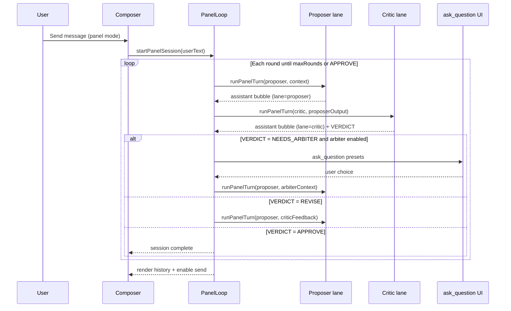

# Feature 20 — Multi-model conversation

**Roadmap:** [feature-audit-roadmap.md §20](../feature-audit-roadmap.md#20-multi-model-conversation--missing)  
**Architecture reference:** [context.md](../../context.md) — Sub-agent orchestration (Step 09), composer modes, per-agent model routing  
**Related (not the same feature):** Work agent `expert-panel` simulates three personas in **one** model; Orchestrate spawns **task** sub-agents serially; this feature runs **real** multi-model dialogue in **`chat.history`**.

---

## Current state

| Area | What exists today |
|------|-------------------|
| **Sub-agent runner** | [`src/agents/sub-agent-runner.ts`](../../../src/agents/sub-agent-runner.ts) — headless SSE completion + optional nested tool loop; `onMessagesChange` for live drawer transcripts |
| **Orchestrator** | [`src/agents/orchestrator.ts`](../../../src/agents/orchestrator.ts) — spawn queue, concurrency, per-type `providerId`/`modelId`, aggregate JSON back to parent **without** merging child transcript into `chat.history` |
| **Per-type model binding** | [`sub-agents.json`](../../../src/agents/defaults/sub-agents.json) + `resolveSubAgentModelBinding()` — empty `modelId` falls back to parent chat model |
| **Work agents** | Builder, Reviewer, **expert-panel** (single-model scripted debate), each with own prompt + optional `providerId`/`modelId` in `work-agents.json` |
| **Composer modes** | Five modes: Build, Plan, Orchestrate, Research, Reef — [`src/chat/modes/registry.ts`](../../../src/chat/modes/registry.ts) |
| **Chat bubbles** | [`src/ui/messages.ts`](../../../src/ui/messages.ts) — `user` / `assistant` / tool-call rows; one assistant stream per main turn |
| **Human input cards** | [`ask_question`](../../../src/tools/definitions.ts) + [`src/ui/question-cards-modal.ts`](../../../src/ui/question-cards-modal.ts) — blocking user choice UI |
| **Sub-agent UI** | Cards + drawer for **isolated** runs — not lane-tagged messages in the main thread |

**Important distinction:** Sub-agent runs are **sidecar** transcripts (`chat.subAgentRuns`, drawer). Multi-model conversation must write **lane-tagged assistant messages into `chat.history`** so the user sees a continuous, scrollable debate in the main chat pane.

---

## Gap

1. **No turn-taking loop** between two models with separate system prompts in the parent transcript.
2. **No critic ↔ proposer protocol** — no round structure, convergence rules, or “split verdict” handling.
3. **No distinct bubbles** — assistant messages do not carry `agentLane`, role label, or per-lane model metadata for styling.
4. **No optional human arbiter** — no pause point for the user to pick a side, inject constraints, or end the debate.
5. **No mode or session type** — nothing in `ModeId`, composer, or send path dedicated to multi-model dialogue (Orchestrate’s serial `spawn_sub_agent` is task delegation, not in-thread debate).

---

## Goals

1. **Ship a sixth mode (`panel`)** — user-facing label **Multi-model** (or **Panel**) — where a user message kicks off (or continues) a structured proposer/critic dialogue.
2. **Real multi-model** — Proposer and Critic each use their own `providerId` + `modelId` + system prompt (from config, not role-play in one completion).
3. **Visible dialogue** — Each turn is an `assistant` message in `chat.history` with lane metadata and distinct UI (color, avatar chip, model name).
4. **Critic ↔ proposer loop** — Configurable max rounds; Critic reviews Proposer output; Proposer may revise; stop when consensus, max rounds, or user Stop.
5. **Optional human arbiter** — When enabled, insert an `ask_question` step between rounds or when the Critic returns `NEEDS_ARBITER` / equivalent structured signal.
6. **Reuse sub-agent infrastructure** — Stream/completion path, model binding, abort, and tests patterns from `sub-agent-runner.ts`; do **not** fork a second SSE parser.
7. **v1 scope discipline** — Text-only panel turns (no nested tools per lane) unless spike proves low risk; Proposer may still use main Build tools only when explicitly enabled in a later phase.

### Non-goals (v1)

- Replacing Orchestrate board or sub-agent task spawning.
- Simulated multi-persona in one model (that remains `expert-panel` work agent).
- Parallel simultaneous streaming of two models in one viewport row (turns are **serial**).
- Automatic eval/leaderboard (#21) — panel output may feed eval harness later.

---

## Acceptance criteria

### Core loop

- [ ] User selects **Multi-model** mode, configures Proposer + Critic models (or accepts defaults), sends a user message.
- [ ] System runs **Proposer turn** → appends lane-tagged assistant bubble → **Critic turn** → appends second bubble; repeats until `maxRounds` or stop condition.
- [ ] **Stop** aborts the in-flight lane stream and marks the panel session `stopped` without corrupting prior history.
- [ ] Each assistant bubble shows **role name** (Proposer / Critic), **model id** (or provider label), and is visually distinct (CSS lane classes).
- [ ] Reloading the page restores `chat.history` including lane metadata and any in-progress `panelSession` state (or clearly shows “panel interrupted” if generation was mid-flight).

### Critic ↔ proposer protocol

- [ ] Shipped prompts require Critic to end with a machine-parseable footer, e.g. `VERDICT: APPROVE | REVISE | NEEDS_ARBITER` (exact strings documented in prompt).
- [ ] Loop stops on `APPROVE` or when `maxRounds` reached; on `REVISE`, Proposer gets Critic text as the next user-context block (structured envelope, not raw history dump of entire chat).
- [ ] On `NEEDS_ARBITER` with arbiter enabled, flow pauses for `ask_question`; user choice is injected as a `user` message with `panelInjected: true` and the loop resumes.

### Configuration

- [ ] Defaults in repo; overrides in `~/.minnow/panel.json` (or `multi-model.json`) with `GET/PUT /api/config/panel` when `npm start`.
- [ ] Per-role: `providerId`, `modelId`, `systemPromptPath` or `workAgentId`, `temperature`/`maxTokens` (optional; aligns with roadmap #9 when landed).

### Safety & policy

- [ ] Panel mode tool policy: v1 **deny all tools** for lane runners; parent mode registry entry documents this.
- [ ] Lane runners cannot call `spawn_sub_agent` (same denial pattern as existing sub-agent types).
- [ ] Global user rules (`rules.json`) behavior documented: **omit** from lane system stack (match sub-agent v1) or **include** — pick one in spike and test.

### Tests

- [ ] `test/panel/panel-loop.test.mts` — mock runner, deterministic round sequence, verdict parsing, max rounds.
- [ ] `test/panel/panel-config.test.mts` — merge defaults + user overrides.
- [ ] `test/panel/panel-messages.test.mts` — history shape + session hydrate.
- [ ] `test/ui/panel-bubbles.test.mts` — lane CSS classes and labels from fixture messages.

---

## Architecture

### High-level flow



### Mode: `panel` (Multi-model)

| Decision | Recommendation |
|----------|----------------|
| **ModeId** | `panel` — stable slug; display **Multi-model** in mode selector |
| **Registration** | Extend `ModeId`, `MODE_IDS`, `MODE_DEFINITIONS` in [`src/chat/modes/types.ts`](../../../src/chat/modes/types.ts) + [`registry.ts`](../../../src/chat/modes/registry.ts) |
| **Prompts** | `src/chat/prompts/modes/panel.full.md` / `panel.lite.md` — explains loop, arbiter, when to use vs Build/Orchestrate |
| **Tool policy** | `default: deny` for all tools on **lane** completions; optional future: allow read-only tools on Proposer only |
| **Send path** | When `chat.modeId === 'panel'` and `chat.panelSession?.status === 'running'`, route send to **extend session** or queue user steer (align with #5 interrupt/steer later) |

### Critic ↔ proposer loop

**Controller:** new module `src/agents/panel/panel-loop.ts` (name TBD in implementation).

Responsibilities:

- Mint `panelSessionId`, track `round`, `maxRounds`, `status: idle | running | awaiting_arbiter | completed | stopped | failed`.
- Build **turn context** per lane: original user ask + last opposing lane output + optional arbiter injection (bounded token envelope).
- Call **turn runner** (below); append result to `chat.history` via shared helper `appendPanelAssistantMessage(chat, lane, content, meta)`.
- Parse Critic verdict from footer regex; never trust free-form “I approve” without marker.
- Emit events for UI (`panel-events.ts`, mirror `sub-agent-events` pattern).

**Default round cap:** 3 full proposer+critic pairs (configurable 1–8).

### Turn runner (reuse sub-agent runner)

**Module:** `src/agents/panel/panel-turn-runner.ts`

- Extract or share `streamSubAgentTurn()` from [`sub-agent-runner.ts`](../../../src/agents/sub-agent-runner.ts) into `src/agents/shared/stream-completion.ts` if needed to avoid duplication.
- **v1:** single completion per turn — **no** tool loop (`tools: []`).
- Input: `lane`, `systemPrompt`, `userContent`, `providerId`, `modelId`, `signal`, `onDelta` for streaming into the correct bubble shell.
- Output: `content`, `usage`, `stats` for bubble chips.

Optional **v2:** Proposer lane uses truncated tool allowlist via `resolveSubAgentTools()` pattern — only after v1 ships.

### Distinct bubbles

**Message shape** — extend assistant messages (new interface or optional fields on `AssistantMessage`):

```ts
// Illustrative — finalize in mm-01-types-config
interface PanelAssistantMeta {
  panelSessionId: string;
  lane: 'proposer' | 'critic' | 'moderator';
  round: number;
  providerId: string;
  modelId: string;
  roleLabel: string; // e.g. "Proposer", "Critic"
}
```

**UI** — [`src/ui/messages.ts`](../../../src/ui/messages.ts):

- Add `data-panel-lane` on `.msg.assistant` when meta present.
- Header row: role label + model chip (reuse stats strip patterns where sensible).
- CSS: `src/styles/panel-messages.css` — lane-specific border/background using design tokens (no hardcoded neon).

**Streaming:** Create assistant shell at lane start (`createAssistantMessageShell` pattern) so empty proposer/critic bubbles do not flash wrong lane styles.

### Optional human arbiter

| Trigger | Behavior |
|---------|----------|
| Critic `VERDICT: NEEDS_ARBITER` | Pause loop; call `ask_question` with presets: Adopt Proposer, Adopt Critic, Provide guidance (Other), End debate |
| User-enabled “arbiter every round” | After each Critic turn, optional question: Continue, Stop, Inject note |
| User Stop | Same as main chat stop — abort `AbortController` shared on `panelSession` |

Arbiter answers append as `user` messages with `panelInjected: true` and feed the next Proposer context block.

**Do not** use a third LLM “arbiter model” in v1 unless explicitly configured later (#20 stretch).

### Relationship to sub-agent orchestrator

| | Sub-agent (today) | Panel (feature 20) |
|--|-------------------|---------------------|
| Transcript | `run.messages`, drawer | `chat.history` |
| Parent tool | `spawn_sub_agent` | User send in panel mode |
| Concurrency | Global queue | Single chat session serial lanes |
| Output to parent | Aggregate JSON | Inline bubbles + optional final moderator summary |
| Model binding | `sub-agents.json` types | `panel.json` roles |

Reuse: SSE streaming, abort, provider fetch, config merge patterns, test mocks (`setSubAgentRunnerFactory` → parallel `setPanelTurnRunnerFactory`).

### Alternative considered: Reef-style widget

A Kanban-style **widget** could render the debate, but the roadmap asks for **distinct chat bubbles** — primary UX stays in `#chatMessages`. A Reef widget remains optional **v2** embed for read-only transcript export, not the source of truth.

---

## Key files

### New (planned)

| File | Purpose |
|------|---------|
| `src/agents/panel/panel-loop.ts` | Round controller, verdict parsing, arbiter gates |
| `src/agents/panel/panel-turn-runner.ts` | Single-lane completion |
| `src/agents/panel/panel-config.ts` | Load/merge `panel.json` defaults |
| `src/agents/panel/panel-events.ts` | UI subscription bus |
| `src/agents/defaults/panel.json` | Default proposer/critic bindings |
| `src/agents/prompts/panel/proposer.full.md` | Critic ↔ proposer role prompt |
| `src/agents/prompts/panel/critic.full.md` | Critic role + VERDICT footer contract |
| `src/chat/prompts/modes/panel.full.md` | Mode-level instructions |
| `src/ui/panel-composer-controls.ts` | Model pickers, round cap, arbiter toggle |
| `src/styles/panel-messages.css` | Lane bubble styling |
| `server/config/panel.js` | Home seed + validators |
| `test/panel/*.test.mts` | Loop, config, messages |

### Modify (planned)

| File | Change |
|------|--------|
| `src/chat/modes/types.ts` | Add `panel` to `ModeId` |
| `src/chat/modes/registry.ts` | Register mode + tool policy |
| `src/types.ts` | `PanelSessionState`, extend `AssistantMessage` / `Chat` |
| `src/tools/loop.ts` | Branch send/stop for panel sessions |
| `src/ui/messages.ts` | Render lane headers + streaming |
| `src/ui/mode-selector.ts` | Sixth segment |
| `src/state/sessions.ts` | `ensureChatShape` for `panelSession` |
| `documentation/context.md` | Ship section (mm-12) |

### Reuse (read-only)

| File | Reuse |
|------|-------|
| `src/agents/sub-agent-runner.ts` | SSE turn streaming, clone messages, throttle |
| `src/agents/orchestrator.ts` | Model binding pattern, abort settlement |
| `src/agents/sub-agent-config.ts` | Merge/load JSON pattern |
| `src/tools/sub-agent-executor.ts` | **Not** used for panel v1 (no spawn-from-panel) |
| `src/ui/question-cards-modal.ts` | Arbiter UI |

---

## Phases

### Phase 0 — Spike (mm-00)

- Confirm `panel` as `ModeId`; document migration for persisted chats with unknown mode (existing `normalizeModeId` fallback).
- Decide rules.json inclusion for lane prompts.
- Prototype verdict regex + one mock round in a unit test.

### Phase 1 — Data model & config (mm-01)

- `PanelRoleConfig`, `PanelSessionState`, message metadata types.
- `panel.json` defaults + `loadPanelConfig()` + API routes.

### Phase 2 — Turn runner (mm-02)

- Shared stream helper; `panel-turn-runner` with mock factory for tests.
- Streaming callbacks pluggable for UI.

### Phase 3 — Loop controller (mm-03, mm-05)

- `panel-loop.ts` orchestrates rounds; hooks into send/stop.
- No composer UI beyond mode switch yet (use defaults).

### Phase 4 — Mode & prompts (mm-04)

- Register mode; ship prompts; `composeSystemPrompt` includes mode fragment only on **moderator** path if needed.

### Phase 5 — UI (mm-06, mm-07)

- Distinct bubbles + composer controls (models, rounds, arbiter toggle).

### Phase 6 — Arbiter (mm-08)

- `ask_question` integration; `awaiting_arbiter` session state.

### Phase 7 — Persistence & settings (mm-09, mm-10)

- Session hydrate; settings panel for role bindings (can align with roadmap #2 model routing UI later).

### Phase 8 — Tests & docs (mm-11, mm-12)

- Test suite + `documentation/plans/verification/feature-20-multi-model.md`.

---

## Dependencies

| Dependency | Kind | Notes |
|------------|------|-------|
| **Sub-agent runner** | Hard | Stream path, abort, test mocks |
| **#2 Per-agent model routing UI** | Soft | Panel can ship with inline composer pickers first; consolidated `#/settings/model-routing` later |
| **#9 Sampler presets per agent** | Soft | Optional temperature per lane once agent schema extended |
| **#5 Interrupt and steer** | Soft | Panel “inject guidance mid-round” can reuse `pendingSteerMessage` when that lands |
| **#7 Structured sub-agent summaries** | None for v1 | Panel does not return aggregate JSON to a parent tool |
| **#19 Determinism / replay** | Soft | Record-replay should capture panel turns for integration tests |
| **Backend generations** | Optional | Panel can use direct `postChatCompletions` like sub-agents today; migrating lanes to `/api/generations` is optional consistency work |

**Suggested sequencing (roadmap):** After quick wins (#2, #9) and alongside differentiators (#1 trace/replay). Not blocked by #22 project-scoped configs, but workspace-local `panel.json` under `.minnow/` is a natural follow-up.

---

## Tests

### Unit

| Test file | Covers |
|-----------|--------|
| `test/panel/panel-config.test.mts` | Defaults merge, invalid role ids, API round-trip |
| `test/panel/panel-loop.test.mts` | Round sequence, APPROVE/REVISE/NEEDS_ARBITER, maxRounds, abort |
| `test/panel/panel-turn-runner.test.mts` | Mock stream, empty model fallback |
| `test/panel/panel-verdict-parse.test.mts` | Footer regex edge cases |
| `test/panel/panel-session-hydrate.test.mts` | `ensureChatShape` preserves `panelSession` |
| `test/ui/panel-bubbles.test.mts` | DOM: `data-panel-lane`, labels |

### Integration / manual

1. `npm start` → Multi-model mode → two different models (e.g. local + second provider).
2. Send design question → observe alternating bubbles with correct labels.
3. Enable arbiter → force `NEEDS_ARBITER` via critic prompt test fixture → confirm `ask_question` strip.
4. Stop mid-critic-stream → partial bubble marked stopped; session not deadlocked.
5. Reload → history + lane styles restored.

### Verification doc

Create [`documentation/plans/verification/feature-20-multi-model.md`](../verification/feature-20-multi-model.md) when implementing (do not confuse with legacy E3 `feature-20-drag-drop` verification filename in context.md).

---

## Risks

| Risk | Impact | Mitigation |
|------|--------|------------|
| **Token cost explosion** | Multi-model loops burn 2×–6× tokens per user message | Default low `maxRounds`; show estimated round cost in composer; hard cap on turn context envelope |
| **Context drift** | Lanes see stale or huge history | Structured turn envelope only (last user ask + last peer message + arbiter note), not full `chat.history` |
| **Verdict parse failures** | Critic omits `VERDICT:` → infinite REVISE | Regex miss → treat as `REVISE` with round counter; after max rounds emit moderator summary “inconclusive” |
| **ModeId proliferation** | Six modes already crowded | Clear mode description; optional merge into Research as sub-mode rejected — distinct send path needed |
| **Streaming UX race** | Two lanes never parallel, but fast switching may confuse scroll | Pin scroll on lane start; lane-specific stream status handle |
| **Persistence schema bump** | Old clients lose `panelSession` | Optional field; `SESSION_SCHEMA_VERSION` bump only if required |
| **Expert-panel confusion** | Users expect simulated panel | Rename work agent in UI docs; mode tooltip explains **real** dual-model |
| **Tool temptation** | Enabling tools on lanes doubles approval surface | v1 text-only; document v2 policy before shipping tools on Proposer |
| **Local model load** | Two large models on one machine | Settings hint: use smaller critic model; optional “same model, different prompts” fallback |

---

## Open questions (resolve in mm-00 spike)

1. **ModeId label:** `panel` vs `debate` vs `multi` — recommend `panel` / “Multi-model”.
2. **Third lane “Moderator”** — single-model summary bubble at end (same as main chat model) vs omit in v1.
3. **Workspace vs global config** — v1 global `~/.minnow/panel.json` only; `.minnow/panel.json` with #22.
4. **Include `rules.json` in lane system stack?** — Recommend **no**, matching sub-agent v1.
5. **Allow panel inside Orchestrate chat?** — Recommend **no**; mode switch only.

---

## Reference links

- Sub-agent runner: [`src/agents/sub-agent-runner.ts`](../../../src/agents/sub-agent-runner.ts)
- Orchestrator spawn/execute: [`src/agents/orchestrator.ts`](../../../src/agents/orchestrator.ts)
- Sub-agent architecture in context: [context.md § Sub-agent orchestration](../../context.md)
- Expert-panel (single-model, not this feature): [`src/chat/prompts/work-agents/expert-panel/agent.full.md`](../../../src/chat/prompts/work-agents/expert-panel/agent.full.md)
- Feature audit item #20: [feature-audit-roadmap.md](../feature-audit-roadmap.md)
