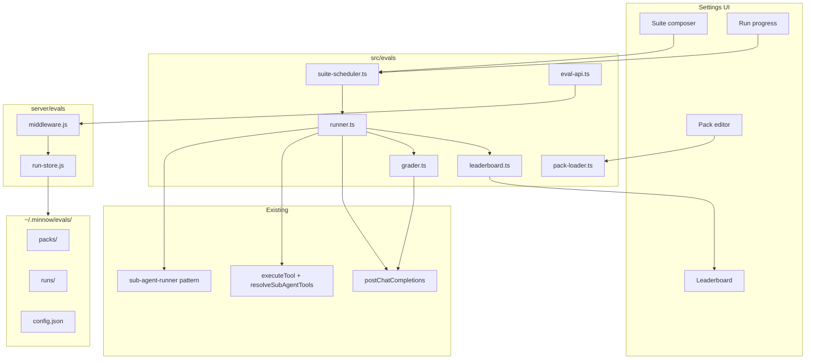

# Feature 21 — Local eval harness

**Audit ref:** [feature-audit-roadmap.md §21](../feature-audit-roadmap.md) · **Architecture:** [context.md](../../context.md) · **Reuse target:** [`src/agents/sub-agent-runner.ts`](../../../src/agents/sub-agent-runner.ts)

> **Naming note:** Audit item **#21** (eval harness) is unrelated to shipped product backlog **feature-21** (file-tree padding). This plan uses slug `feature-21-local-eval-harness` to avoid confusion.

---

## Current state

| Area | Today |
|------|--------|
| Eval runner | **Missing** — no `src/evals/` module |
| Task packs | **Missing** — no user-defined prompt + tool whitelist + rubric bundles |
| Model comparison | **Missing** — no matrix runner or leaderboard |
| Persistence | **Missing** — `~/.minnow/` has no `evals/` scaffold ([`server/config/home.js`](../../../server/config/home.js) `SCAFFOLD_DIRS`) |
| UI | **Missing** — no `#/settings/evals` nav entry ([`src/ui/settings-page.ts`](../../../src/ui/settings-page.ts) `SECTIONS`) |
| Related (usable) | **Sub-agent isolation** — [`defaultSubAgentRunner`](../../../src/agents/sub-agent-runner.ts): headless SSE loop, tool subset, `setSubAgentRunnerFactory` for tests · **Tool policy** — [`resolveSubAgentTools`](../../../src/agents/sub-agent-tools.ts) allow/deny · **Headless chat** — [`postChatCompletions`](../../../src/providers/fetch-chat.ts) `persist: false` via generations · **LLM judge precedent** — [`runLlmEscalationJudgement`](../../../src/agents/supervisor/escalation.ts) single-shot JSON reply · **Pack pattern** — skills scan/merge ([`server/skills/scan.js`](../../../server/skills/scan.js), [`src/skills/loader.ts`](../../../src/skills/loader.ts)) |

Sub-agents today are **parent-chat scoped** ([`orchestrator.ts`](../../../src/agents/orchestrator.ts)): spawn cards, drawer transcripts, board linkage. Eval runs must **not** pollute `chat.history` or sub-agent UI — they are offline benchmark jobs with their own run ids and disk artifacts.

---

## Gap

Users running multiple local models (LM Studio, OpenAI-compatible endpoints) have no first-class way to:

1. Define repeatable **tasks** (fixed user prompt, optional system prompt, tool whitelist, success criteria).
2. Run the **same tasks** across **N provider/model pairs** under controlled settings (temperature, max tool turns, workspace).
3. **Grade** outputs with a consistent rubric (LLM-as-judge or future deterministic checks).
4. **Compare** results in a **leaderboard** and revisit historical suites without re-running.

Roadmap one-liner: *User declares N tasks (prompt + tool whitelist + grading rubric prompt) → run across N models → leaderboard. Stored under `~/.minnow/evals/`.*

---

## Goals

1. **Task packs** — Versioned, shareable bundles of eval tasks (built-in starters + user packs under `~/.minnow/evals/packs/`).
2. **Isolated execution** — Each task run uses the same mechanical isolation as sub-agents (dedicated message list, tool loop, no parent history) without orchestrator spawn overhead or chat UI side effects.
3. **Model matrix** — One **suite** = one pack × explicit list of `{ providerId, modelId, label? }` × shared runtime options (workspace path, mode/tool baseline, concurrency).
4. **Grading** — Post-run rubric prompt produces structured scores (0–100 or pass/fail + rationale); judge model configurable and separate from candidate models.
5. **Leaderboard** — Aggregate per-model metrics (mean score, pass rate, median latency, total tokens, failure count) for a completed suite.
6. **Settings-first UX** — Compose, run, monitor, and inspect results from `#/settings/evals` (requires `npm start` for persistence APIs).
7. **Testability** — Injectable runner/grader factories; deterministic unit tests without live LLM.

### Non-goals (v1)

- CI headless CLI entry (`minnow eval run`) — defer to audit **#18 Headless mode**; design APIs so CLI can call the same suite runner later.
- Record/replay snapshots — defer to audit **#19 Determinism mode**; optional `MINNOW_EVAL_FIXTURE=1` hook in v2.
- Project-scoped eval packs (`.minnow/evals/`) — defer to audit **#22 Project-scoped everything**.
- Multi-turn conversational eval threads — v1 tasks are single user message (+ optional system) with tool loop cap.
- Automatic prompt/profile export bundles — unrelated to audit **#13**.

---

## Acceptance criteria

### Task packs

- [ ] User can create/edit/delete a pack via settings; pack saved as `~/.minnow/evals/packs/<id>/pack.json` (+ optional `tasks/*.json` or inline array).
- [ ] Pack schema validated on save (id, label, tasks[], each task: `id`, `prompt`, optional `systemPrompt`, `allowedTools[]`, `deniedTools[]`, `maxToolTurns`, `rubricPrompt`).
- [ ] At least one **built-in starter pack** ships under `src/evals/packs/` (e.g. `coding-smoke`: read_file + grep sanity tasks with no workspace writes).
- [ ] Built-in packs appear in UI; user pack with same id overrides built-in (skills-style merge).

### Suite execution

- [ ] User selects pack + ≥1 model targets + workspace (default: current workspace from `config.json`) and starts a suite.
- [ ] Runner executes **every task × every model** (cartesian product) unless user enables "subset" mode (pick tasks) in v1.1; v1 runs full pack.
- [ ] Each cell run: isolated messages, respects `allowedTools`/`deniedTools`, uses `postChatCompletions` / generations `persist: false`.
- [ ] Concurrency capped (default 2, max 8) — separate from sub-agent `globalMaxConcurrent`; stored in `evals/config.json`.
- [ ] User can **abort** an in-flight suite; partial results retained with status `cancelled`.
- [ ] Progress events update settings UI (completed/total, current task id, current model label).

### Grading

- [ ] After each cell completes, grader runs with task's `rubricPrompt` + candidate summary (and optional transcript excerpt cap).
- [ ] Grader returns JSON: `{ score: number, pass: boolean, rationale: string, tags?: string[] }` parsed with safe fallback on malformed output.
- [ ] Judge defaults: dedicated `graderProviderId` / `graderModelId` in `evals/config.json`; fallback to active chat provider if unset.

### Leaderboard & persistence

- [ ] Completed suite writes `~/.minnow/evals/runs/<suiteRunId>/manifest.json` + per-cell `cells/<taskId>__<modelKey>.json`.
- [ ] Leaderboard row per model: `label`, `meanScore`, `passRate`, `medianDurationMs`, `totalPromptTokens`, `totalCompletionTokens`, `failedCells`, `completedCells`.
- [ ] Settings **Results** tab lists past suite runs (newest first); clicking opens detail table (tasks as rows, models as columns or transposed toggle).
- [ ] Export suite results as JSON (download) for external analysis.

### Quality bar

- [ ] `npx tsc --noEmit` clean.
- [ ] `npm test` includes new `test/evals/**` suites (mocked runner/grader, no network).
- [ ] Manual QA doc in `documentation/plans/verification/feature-21-eval-harness.md`.
- [ ] [`documentation/context.md`](../../context.md) updated with `evals/` layout and module index when shipped.

---

## Architecture

### High-level flow



### `src/evals/` runner

| Module | Responsibility |
|--------|----------------|
| `types.ts` | `EvalTask`, `EvalPack`, `EvalModelTarget`, `EvalSuiteRun`, `EvalCellResult`, `EvalGraderResult`, `LeaderboardRow` |
| `pack-loader.ts` | Merge built-in `src/evals/packs/` + user `~/.minnow/evals/packs/`; validate; list for UI |
| `pack-schema.ts` | JSON schema / runtime validators (mirror [`server/config/validators.js`](../../../server/config/validators.js) style) |
| `config.ts` | Load `evals/config.json` (concurrency, grader binding, default workspace policy) |
| `runner.ts` | **`EvalRunner`** interface mirroring [`SubAgentRunner`](../../../src/agents/types.ts): `run({ task, systemPrompt, tools, providerId, modelId, maxToolTurns, workspaceRoot, signal, executeTool })` — implementation **extracts or delegates** to shared loop extracted from `sub-agent-runner.ts` (preferred: `src/agents/headless-tool-loop.ts` shared by sub-agent + eval to avoid drift) |
| `runner-factory.ts` | `setEvalRunnerFactory` / `getEvalRunner` (same test pattern as `setSubAgentRunnerFactory`) |
| `tool-context.ts` | Build `executeTool` wrapper with eval workspace + allowlist; reuse `resolveSubAgentTools` with synthetic `SubAgentTypeConfig` from task |
| `grader.ts` | Single completion, rubric system + user payload, parse JSON score |
| `suite-scheduler.ts` | Matrix expansion, queue, concurrency pool, abort controller, emit `eval-events` |
| `leaderboard.ts` | Pure aggregation from cell results |
| `eval-api.ts` | Browser client for `/api/evals/*` |
| `eval-events.ts` | `subscribeEvalSuiteProgress` for settings UI |

**Runner vs sub-agent orchestrator:** Do **not** call `spawn_sub_agent` or [`orchestrator.ts`](../../../src/agents/orchestrator.ts). Call `getEvalRunner().run()` directly from scheduler. Rationale: no parent chat, no drawer/cards, no board tasks, simpler cancellation semantics.

**Refactor recommendation (Phase 1):** Extract `streamHeadlessToolLoop()` from [`sub-agent-runner.ts`](../../../src/agents/sub-agent-runner.ts) into `src/agents/headless-tool-loop.ts`; make `defaultSubAgentRunner` and `defaultEvalRunner` thin wrappers. Keeps temperature/max_tokens policy configurable per caller.

### `~/.minnow/evals/` layout

```text
~/.minnow/evals/
  config.json                 # version, maxConcurrency, graderProviderId, graderModelId, graderTimeoutMs
  packs/
    <pack-id>/
      pack.json               # { id, label, version, tasks: EvalTask[] }
  runs/
    <suiteRunId>/
      manifest.json           # suite metadata, model targets, pack id, status, startedAt, endedAt
      leaderboard.json        # precomputed rows for fast UI
      cells/
        <taskId>__<modelKey>.json   # transcript summary, toolTurns, grader result, usage, errors
```

- **`modelKey`:** stable slug `providerId__modelId` with sanitization (`/` → `_`).
- **`manifest.json` status:** `queued` | `running` | `completed` | `cancelled` | `failed`.
- Optional debug: `transcript.json` per cell when `evals/config.json` `saveFullTranscripts: true` (cap message count).

Scaffold `evals`, `evals/packs`, `evals/runs` in [`server/config/home.js`](../../../server/config/home.js) `SCAFFOLD_DIRS`; seed default `config.json` on first run.

### Task packs

**Pack file shape (v1):**

```json
{
  "id": "coding-smoke",
  "label": "Coding smoke tests",
  "version": 1,
  "tasks": [
    {
      "id": "list-src",
      "prompt": "List TypeScript files under src/agents (names only, no commentary).",
      "allowedTools": ["list_directory", "find_files"],
      "deniedTools": ["execute_command", "save_file"],
      "maxToolTurns": 6,
      "rubricPrompt": "Score 100 if the answer lists at least three .ts files under src/agents; 0 otherwise. Reply JSON: {\"score\":number,\"pass\":boolean,\"rationale\":string}"
    }
  ]
}
```

**Built-in packs:** `src/evals/packs/<id>/pack.json`, synced or read directly (like skills built-in root). **User packs:** override by id.

**Tool baseline:** Start from Build mode enabled tools ([`getEnabledToolDefinitionsForMode('build')`](../../../src/tools/config.ts)) then apply per-task allow/deny via `resolveSubAgentTools`.

### Model comparison leaderboard

**Suite definition (UI + API):**

```typescript
interface EvalSuiteRequest {
  packId: string;
  targets: { providerId: string; modelId: string; label?: string }[];
  workspacePath?: string;       // absolute; must pass workspace guard
  modeId?: string;              // default 'build' for tool baseline
  maxConcurrency?: number;
}
```

**Leaderboard computation (`leaderboard.ts`):**

| Metric | Definition |
|--------|------------|
| `meanScore` | Arithmetic mean of `grader.score` over completed cells |
| `passRate` | `pass === true` count / completed cells |
| `medianDurationMs` | Median of `endedAt - startedAt` per cell |
| `totalPromptTokens` / `totalCompletionTokens` | Sum usage fields when provider returns usage |
| `failedCells` | Runner or grader errors, or `pass === false` (configurable toggle) |

**UI (`src/ui/settings-evals.ts`):**

- **Packs** sub-panel: list, duplicate, import JSON, delete user packs.
- **Run** sub-panel: pack select, multi-select models (from provider picker pattern in [`settings-entity-editor.ts`](../../../src/ui/settings-entity-editor.ts)), workspace display, Start/Abort.
- **Results** sub-panel: leaderboard table + drill-down matrix; link to raw cell JSON.

Register section in [`settings-page.ts`](../../../src/ui/settings-page.ts) `SECTIONS`, [`index.html`](../../../index.html) `#settingsSection-evals`, nav button, [`settings-sections.ts`](../../../src/ui/settings-sections.ts) `renderEvalsSection`.

### Settings results panel

- Live progress bar: `completedCells / totalCells`.
- On complete: render leaderboard (sortable by mean score default).
- Cell drill-down: read-only transcript snippet (last assistant message + tool turn count), grader rationale, duration, token usage.
- Empty state when no runs: prompt to run starter pack.

### Server API (`server/evals/`)

| Route | Method | Purpose |
|-------|--------|---------|
| `/api/evals/ping` | GET | Health |
| `/api/evals/config` | GET/PUT | `evals/config.json` |
| `/api/evals/packs` | GET | List merged packs (metadata only) |
| `/api/evals/packs/:id` | GET/PUT/DELETE | User pack CRUD |
| `/api/evals/runs` | GET | List suite manifests (summary) |
| `/api/evals/runs/:suiteRunId` | GET | Manifest + leaderboard + cell index |
| `/api/evals/runs/:suiteRunId/cells/:cellId` | GET | Full cell artifact |
| `/api/evals/runs` | POST | Start suite (body = `EvalSuiteRequest`) — returns `{ suiteRunId }` |
| `/api/evals/runs/:suiteRunId/cancel` | POST | Abort |

**Execution location:** v1 runs suite in **browser** (scheduler in `src/evals`) so existing `executeTool` + approval paths work; server persists artifacts. **v1.1 option:** move runner to server for CI (#18) — POST starts background job, SSE progress on `/api/evals/runs/:id/stream`.

**Vite-only fallback:** When `npm start` absent, allow ephemeral runs in memory with `localStorage` warning; no leaderboard persistence (mirror skills offline pattern).

---

## Key files

### New (client)

| Path | Notes |
|------|-------|
| `src/evals/types.ts` | Core types |
| `src/evals/pack-loader.ts` | Built-in + user merge |
| `src/evals/pack-schema.ts` | Validation |
| `src/evals/config.ts` | Eval config client |
| `src/evals/runner.ts` | Eval runner + factory |
| `src/evals/grader.ts` | Rubric LLM judge |
| `src/evals/suite-scheduler.ts` | Matrix orchestration |
| `src/evals/leaderboard.ts` | Aggregation |
| `src/evals/eval-events.ts` | Progress bus |
| `src/evals/eval-api.ts` | REST client |
| `src/evals/packs/**/pack.json` | Shipped starters |
| `src/ui/settings-evals.ts` | Settings UI |
| `src/styles/settings-evals.css` | Panel styles |

### New (server)

| Path | Notes |
|------|-------|
| `server/evals/middleware.js` | Routes |
| `server/evals/run-store.js` | Read/write manifests + cells |
| `server/evals/pack-store.js` | User pack CRUD |
| `server/evals/validate.js` | Shared validation with client |

### Modified (existing)

| Path | Change |
|------|--------|
| `server/config/home.js` | Scaffold `evals/` dirs + default `evals/config.json` |
| `server.js` or Vite middleware registrar | Mount evals middleware |
| `src/agents/sub-agent-runner.ts` | Optional extract `headless-tool-loop.ts` |
| `src/ui/settings-page.ts` | Add `evals` section |
| `src/ui/settings-sections.ts` | `renderEvalsSection` |
| `index.html` | Section shell + nav |
| `documentation/context.md` | Persistence table + module row |
| `documentation/plans/feature-audit-roadmap.md` | Link to this plan |

---

## Implementation phases

### Phase 0 — Design lock (0.5d)

- Finalize JSON schemas and example packs.
- Decide v1 execution host (browser scheduler ✅).
- Confirm grader JSON contract and failure handling.

### Phase 1 — Data layer (1–2d)

- Scaffold `~/.minnow/evals/`.
- `pack-loader`, validators, built-in starter pack.
- Server CRUD routes for packs + config.
- Unit tests: schema, merge, override.

### Phase 2 — Runner (2–3d)

- Extract or duplicate headless tool loop from `sub-agent-runner.ts`.
- `EvalRunner` + factory + `tool-context.ts` (workspace + allowlist).
- Single-cell integration test with mock runner returning fixed summary.

### Phase 3 — Grader + scheduler (2d)

- `grader.ts` with mock factory.
- `suite-scheduler.ts`: matrix, concurrency, abort, events.
- Persist manifests/cells via `eval-api` + server store.

### Phase 4 — Settings UI (2–3d)

- `settings-evals.ts` three sub-panels.
- Wire provider/model multi-select.
- Progress + leaderboard + drill-down.

### Phase 5 — Hardening (1–2d)

- Error surfaces, offline hints, export JSON.
- Manual verification doc.
- Update `context.md` + audit roadmap link.

**Estimated total:** 8–12 dev days.

---

## Dependencies

| Dependency | Relationship |
|------------|----------------|
| **`npm start`** | Required for pack/run persistence APIs (same as skills, sub-agents config) |
| **Sub-agent runner** | **Hard** — reuse isolation semantics; prefer shared `headless-tool-loop` extract |
| **`postChatCompletions` / generations** | **Hard** — candidate + judge completions |
| **`executeTool` + permission gate** | **Hard** — eval runs real tools against workspace; document risk (see Risks) |
| **Providers / models picker** | **Soft** — UI reuses settings entity editor patterns |
| **Audit #18 Headless** | **Soft** — future CLI should call same scheduler API |
| **Audit #19 Determinism** | **Soft** — replay snapshots for stable CI grades |
| **Audit #11 Capability probe** | **Nice** — warn when model lacks tool calling |
| **Audit #9 Sampler presets** | **Nice** — per-target temperature in suite request |
| **Audit #22 Project-scoped** | **Future** — `.minnow/evals/packs/` overrides |

**Suggested sequencing (from audit):** After **#19 determinism** and **#18 headless** if CI grading is a primary goal; can ship interactive settings-only v1 earlier for manual local comparison.

---

## Tests

| Suite | Focus |
|-------|--------|
| `test/evals/pack-schema.test.mts` | Valid/invalid packs, id rules, tool name validation against `BUILT_IN_TOOLS` |
| `test/evals/pack-loader.test.mts` | Built-in + user override merge |
| `test/evals/leaderboard.test.mts` | Mean, pass rate, median duration with static fixtures |
| `test/evals/grader-parse.test.mts` | JSON parse, malformed fallback, mock grader factory |
| `test/evals/suite-scheduler.test.mts` | Matrix size, concurrency cap, abort mid-run, progress event order |
| `test/evals/runner.test.mts` | Mock eval runner; ensure no `chat.history` mutation (spy session state) |
| `test/evals/eval-api.test.mjs` | Middleware CRUD with `MINNOW_HOME` temp dir |

**Conventions:**

- Fixed ids: `pack-11111111`, `task-aaaa`, `suite-run-bbbb`, provider `lm-studio-local`, model `test-model`.
- Static expected leaderboard JSON strings in assertions (no programmatic expected building).
- Use `setEvalRunnerFactory` / `setSubAgentRunnerFactory` reset in `afterEach`.

**CI commands:**

```bash
npx tsc --noEmit
npm test
```

Add `npm run test:evals` script filtering `test/evals/**` in `package.json` (optional convenience).

---

## Risks

| Risk | Mitigation |
|------|------------|
| **Tool runs mutate workspace** | Default starter packs use read-only tools; UI warning before run; optional `dryRun` task flag (v1.1) that mocks `executeTool` |
| **Approval modal blocking batch eval** | Eval context sets `evalRunId` + `skipApproval: true` behind explicit settings toggle "Allow tools without approval during eval" (default **off**) |
| **Cost / time explosion** | `maxConcurrency` cap; display estimated cells (`tasks × models`); confirm dialog > 20 cells |
| **Non-tool models fail every cell** | Pre-flight check via capability matrix (#11); show warning on model picker |
| **Grader inconsistency** | Low temperature (0.1); frozen rubric prompts; store raw grader response in cell artifact |
| **SSE/browser streaming bugs** | Eval uses same `postChatCompletions` path as sub-agents (server generations); document `llmster` browser issue does not apply to headless path |
| **Drift vs sub-agent runner** | Shared `headless-tool-loop.ts` module |
| **Sensitive data in transcripts** | `saveFullTranscripts` default false; redact tool outputs in exported JSON option |

---

## Open questions (resolve in Phase 0)

1. Should v1 require **explicit opt-in** to disable tool approvals for eval batches?
2. Include **deterministic checks** (regex on summary) alongside LLM rubric in v1, or rubric-only?
3. Store cells as JSON lines vs one file per cell (proposal: one file per cell for easy partial re-grade)?
4. Re-run **grader only** on existing transcripts without re-invoking candidate model?

---

## References

- [feature-audit-roadmap.md §21](../feature-audit-roadmap.md)
- [context.md — Sub-agent orchestration](../../context.md) (Step 09)
- [`src/agents/sub-agent-runner.ts`](../../../src/agents/sub-agent-runner.ts) — isolation + `setSubAgentRunnerFactory`
- [`src/agents/orchestrator.ts`](../../../src/agents/orchestrator.ts) — what eval must **avoid** coupling to
- [`src/agents/supervisor/escalation.ts`](../../../src/agents/supervisor/escalation.ts) — single-shot JSON LLM pattern for grader
- [`server/skills/scan.js`](../../../server/skills/scan.js) — pack directory scan precedent
