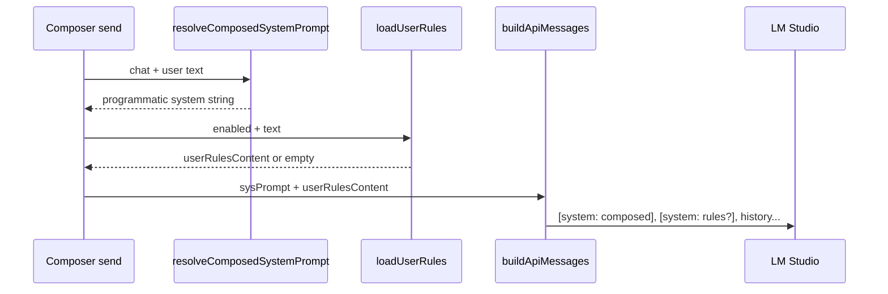

# Feature 24 — User rules (settings + prompt injection)

**Backlog:** F3 · [`feature-24-user-rules-settings`](../product_backlog_agents_48a41af9.plan.md) (Wave 4 — Settings)  
**Size:** M  
**Depends on:** Step 04 programmatic prompts (shipped), Step 20 settings page shell (shipped)  
**Blocks:** F4 [`feature-25-prompt-token-estimate`](feature-25-prompt-token-estimate.md) — estimator should count rules segment when enabled

---

## Summary

Minnow composes a large programmatic system prompt from fixed `PART_ORDER` parts (`base → mode → expert → work-agent → tool-usage → info → skill → memory`) in a **single** `role: system` message. Users have no place to add persistent instructions comparable to Cursor **User Rules**.

This feature adds:

1. **Settings → Rules** — enable toggle + textarea (v1: one blob; optional later: multi-rule list).
2. **Persistence** — dedicated `~/.minnow/rules.json` with `GET/PUT /api/config/rules` (not `config.json`).
3. **Send path** — after `resolveComposedSystemPrompt()`, append user rules as a **second** `role: system` message immediately before chat history (not concatenated into `PART_ORDER`).

---

## Current state (research)

### Prompt composer — `src/chat/prompts/prompt-composer.ts`

| Piece | Behavior |
|-------|----------|
| `PART_ORDER` | `base`, `mode`, `expert`, `work-agent`, `tool-usage`, `info`, `skill`, `memory` |
| `composeSystemPrompt(ctx)` | Joins enabled parts with `\n\n---\n\n`; no user-rules slot |
| `PromptPartId` | Does not include `user-rules` (`types.ts`) |
| Lite gating | `info` disabled in lite; `memory`/`skill` gated on runtime content |

**Backlog wording** (“composer part `user-rules` appended after composed system prompt”) is interpreted as **injection order**, not a new togglable composer part. User rules are global and should not appear in custom profile part editors or ship as `.md` templates.

### Compose context — `src/chat/prompts/compose-context.ts`

| Function | Role |
|----------|------|
| `buildComposeContext(chat, options?)` | Loads meta, custom config, memory block, tool summaries |
| `resolveComposedSystemPrompt(chat, options?)` | Expert routing + work agent + `composeSystemPrompt(ctx)` → **one string** |

No hook today for user rules. F25 token estimate will need rules text alongside composed prompt (see [Relationship to Feature 25](#relationship-to-feature-25)).

### API messages — `src/tools/loop.ts`

```225:235:src/tools/loop.ts
export function buildApiMessages(
  chat: Chat,
  sysPrompt: string,
  options?: BuildApiMessagesOptions,
): ApiMessage[] {
  const messages: ApiMessage[] = [];
  const systemContent =
    options?.composedSystemPrompt?.trim() || sysPrompt.trim();
  if (systemContent) {
    messages.push({ role: 'system', content: systemContent });
  }
```

- Only **one** system message today.
- `BuildApiMessagesOptions` has `composedSystemPrompt` but no user-rules field.

### Send paths (both must be updated)

| Path | Module | Composes system prompt |
|------|--------|------------------------|
| Tool loop | `src/tools/loop.ts` | `resolveComposedSystemPrompt` → `buildApiMessages` |
| Plain chat | `src/api/chat.ts` | Same compose; builds messages inline (no tools) |

Legacy `#systemPrompt` textarea remains fallback when composed string is empty (`composedSystemPrompt.trim() || legacySysPrompt`).

### Config persistence patterns

| Resource | File | API | Client |
|----------|------|-----|--------|
| Meta / prompt profile | `config.json` | `GET/PUT /api/config/meta` | `src/config/prompt-meta.ts` |
| Legacy preset textarea | `system-prompt.json` | `GET/PUT /api/config/system-prompt` | `api-client.ts` |
| Tools / skills | `tools.json`, `skills.json` | dedicated resources | `tools/config.ts`, `skills/config.ts` |

Server whitelist: `server/config/paths.js` → `ALLOWED_CONFIG_FILES` (fixed set). New file requires adding `rules.json` + `resourceToRelativeKey('rules')`.

Store: `readResource` / `writeResource` in `server/config/store.js`; route regex in `server/config/middleware.js` (`/^\/api\/config\/(sessions|tools|…)$/`).

Scaffold: `ensureMinnowLayout()` in `server/config/home.js` writes default JSON files on first `npm start`.

### Settings UI

- Nav sections: `src/ui/settings-page.ts` — no `rules` id today.
- Prompting: `index.html` `#settingsSection-prompting` + `settings-sections.ts` (`renderPromptPartsPanel`, `PART_ORDER` previews).
- **Gap:** no Rules section, no persistence module for user rules.

### Sub-agents (scope note)

`src/agents/sub-agent-prompt.ts` builds a **separate** one-part system string per sub-agent type. Parent chat uses full composer.

**v1 recommendation:** Inject user rules on **parent** `buildApiMessages` / `chat.ts` only. Sub-agent runs **do not** receive global user rules unless product asks later (keeps sub-agent prompts smaller and avoids duplicating rules on every spawn).

---

## Goals

1. User can edit persistent instructions in **Settings → Rules** with enable/disable.
2. Rules persist under `~/.minnow/rules.json` when `npm start` is running; reasonable localStorage fallback when offline (mirror `prompt-meta`).
3. On send, LM Studio receives programmatic system prompt **then** user rules (when enabled and non-empty), then history.
4. Rules are **not** mixed into `PART_ORDER` or custom part toggles.
5. Automated tests cover API round-trip and `buildApiMessages` message ordering.

## Non-goals (v1)

- Multi-rule list UI with reorder/delete (optional Phase 2 — schema supports it).
- Per-workspace or per-chat rules (global only).
- `{{user_rules}}` interpolation token in shipped prompt templates.
- Sub-agent / title-generation injection of user rules.
- Editing rules from composer (settings only).
- Migration from Cursor export files.

---

## Design decisions

### 1. `rules.json` vs `config.json`

**Decision: dedicated `rules.json` + `/api/config/rules`.**

| Criterion | `rules.json` | `config.json` nested field |
|-----------|--------------|----------------------------|
| Payload size | Long markdown-friendly | Bloats meta merges |
| API shape | Matches `system-prompt.json`, `tools.json` | Overloads `meta` PUT |
| Validation | Own validator + max length | Risky partial merges |
| Settings UX | Clear save boundary | Easy to accidentally wipe |

`config.json` stays for schema version, providers, prompt profile, feature flags. Do **not** store rules body in `config.json` for v1.

### 2. Second system message vs single concatenation

**Decision: second `role: system` message** (backlog recommendation).



**Rationale:**

- Separates Minnow-owned prompt stack from user-owned instructions (debugging, logging, F25 breakdown).
- Avoids extending `PART_ORDER`, `LITE_TRUNCATE_CAPS`, and custom profile editors.
- OpenAI-compatible APIs accept multiple system messages (LM Studio follows OpenAI chat schema).

**Formatting for message 2:** Plain trimmed text. Optional wrapper (v1):

```text
## User rules

<text>
```

Only if non-empty after trim. No `---` join to message 1.

**Alternative rejected:** Append after `memory` in `PART_ORDER` — would imply rules are a composable “part” with profile/lite/custom toggles; wrong product model.

### 3. Composer / context changes

**Do not** add `user-rules` to `PART_ORDER` or `PromptPartId` for v1.

Add parallel loading:

- `src/config/user-rules.ts` — `loadUserRules()`, `saveUserRules()`, types, cache, localStorage key `minnow.userRules`.
- Optional: `resolveOutboundSystemMessages(chat, options?)` in `compose-context.ts` returning `{ composed, userRules }` for loop, chat.ts, and F25.

`ComposeContext` may gain optional `userRulesBlock?: string | null` **only** if F25 estimates from one context build; injection still happens in `buildApiMessages`.

### 4. `rules.json` schema (v1)

```json
{
  "version": 1,
  "enabled": true,
  "text": "Always use TypeScript strict mode.\nPrefer small diffs."
}
```

| Field | Type | Notes |
|-------|------|-------|
| `version` | `1` | Forward-compatible |
| `enabled` | boolean | When false, skip second system message even if `text` set |
| `text` | string | Full body; max **16 KiB** UTF-8 (413 if exceeded) |

**Phase 2 (optional):** `rules: { id, text, enabled }[]` with list UI; v1 textarea maps to single `text`.

Default on scaffold: `{ "version": 1, "enabled": false, "text": "" }`.

### 5. Settings UI

**New nav item:** `Rules` between **Prompting** and **Providers** (product-visible, not buried in Prompting).

`index.html`:

- `#settingsSection-rules` with hint (“Applied on every chat send after the composed system prompt”).
- Toggle `#settingsRulesEnabled`.
- Textarea `#settingsRulesText` (monospace, ~12 rows).
- `#settingsRulesOffline` hidden hint when server unavailable.
- Save `#settingsRulesSave` (explicit save, like custom prompt config — debounced autosave optional Phase 2).

`settings-page.ts`: add `'rules'` to `SettingsSectionId` and `SECTIONS`.

`settings-sections.ts`: `renderRulesSection()`, `bindRulesSection()` — load on section refresh, `putRules` on save, `setStatus`.

**Offline:** Show textarea from localStorage; disable save or show “Start npm start to persist” (match MCP/memory patterns).

---

## Implementation plan

### Phase 1 — Server + client persistence

1. **`server/config/paths.js`** — add `rules.json` to `ALLOWED_CONFIG_FILES`; `case 'rules': return 'rules.json'`.
2. **`server/config/home.js`** — `DEFAULT_RULES`; scaffold in `ensureMinnowLayout` defaults array.
3. **`server/config/validators.js`** — `validateUserRulesSettings(body)` (version, enabled, text length).
4. **`server/config/store.js`** — read/write `resource === 'rules'`.
5. **`server/config/middleware.js`** — extend resource regex: `…|rules`.
6. **`src/config/defaults.ts`** — `defaultUserRulesSettings`.
7. **`src/config/api-client.ts`** — `getRules()`, `putRules()`.
8. **`src/config/user-rules.ts`** — cache, server-first load, localStorage fallback, `detectConfigServer` integration.

**Tests:** `test/config/rules-crud.test.js` — PUT/GET round-trip, 413 over limit, invalid body 400.

### Phase 2 — Send path injection

1. **`src/tools/loop.ts`**
   - Extend `BuildApiMessagesOptions` with `userRulesContent?: string`.
   - After first system push, if `userRulesContent?.trim()`, push second `{ role: 'system', content: trimmed }`.
   - In `sendMessageWithTools`: `const rules = await loadUserRules()` (or `resolveOutbound…`); pass into `buildApiMessages`.
2. **`src/api/chat.ts`** — same load + second system message in plain send builder.
3. **Debug logging** — extend collapsed console group to note two system segments and lengths (helps F25 dev).

**Tests:** `test/tools/build-api-messages-rules.test.mts`

| Case | Expected `messages` prefix |
|------|----------------------------|
| composed only | 1× system |
| composed + rules | 2× system (rules second) |
| rules disabled / empty | 1× system |
| legacy sysPrompt only + rules | 2× system if both non-empty |

### Phase 3 — Settings UI

1. `index.html` section + nav button `data-settings-nav="rules"`.
2. `src/styles/settings-page.css` — `.settings-rules-*` (textarea width, hint).
3. `settings-page.ts` / `settings-sections.ts` wiring.
4. `test/ui/settings-page-html.test.mjs` — assert `settingsRulesText`, `settingsRulesEnabled`, `settingsSection-rules`.

### Phase 4 — Documentation

- `documentation/context.md` — `~/.minnow/rules.json`, API table row, send path diagram update (two system messages), settings nav.
- Cross-link F25 plan: import `loadUserRules` in `prompt-token-estimate.ts`.

---

## Build & verify

```bash
npm run build          # Typecheck + Vite bundle
npm test               # node --test (all new tests above)
npm start              # Config API + injection manual QA
```

**Manual QA checklist:**

1. Open Settings → Rules; enable; enter distinct marker text (e.g. `RULES_MARKER_24`); Save.
2. Confirm `~/.minnow/rules.json` on disk (or `MINNOW_HOME` test dir).
3. Send a chat message; inspect network payload or debug log: two system messages, second contains marker.
4. Disable rules toggle; send again — single system message only.
5. Stop server; confirm localStorage holds text; restart server and save — file updated.

---

## Risks & mitigations

| Risk | Mitigation |
|------|------------|
| Model ignores second system message | Document in settings hint; if reported, fallback flag to concatenate (Phase 2) |
| Token bloat | 16 KiB cap; disabled by default |
| F25 underestimate | F24 ships before F25; export `getUserRulesPayloadForSend()` from `src/config/user-rules.ts` (F25 imports same helper) |
| Plain vs tool path drift | Shared `resolveOutboundSystemMessages` helper |
| Whitelist miss | Add `rules.json` in paths + test CRUD |

---

## Open questions (resolve before implementation if needed)

1. **Wrapper heading** — Use `## User rules` prefix or raw textarea only? (Default: raw only for v1.)
2. **Autosave** — Explicit Save button only vs debounced PUT? (Default: explicit Save, matches custom config Save.)
3. **Sub-agents** — Include global rules in sub-agent system prompt? (Default: **no** for v1.)

---

## File touch list (expected)

| Area | Files |
|------|-------|
| Server | `paths.js`, `home.js`, `validators.js`, `store.js`, `middleware.js` |
| Client config | `user-rules.ts`, `api-client.ts`, `defaults.ts` |
| Send | `loop.ts`, `chat.ts`, optionally `compose-context.ts` |
| UI | `index.html`, `settings-page.ts`, `settings-sections.ts`, `settings-page.css` |
| Tests | `test/config/rules-crud.test.js`, `test/tools/build-api-messages-rules.test.mts`, `test/ui/settings-page-html.test.mjs` |
| Docs | `documentation/context.md` |

---

## Relationship to Feature 25

`feature-25-prompt-token-estimate` should sum:

- `resolveComposedSystemPrompt()` length
- `loadUserRules()` when `enabled && text.trim()`
- history template + tool JSON

F24 should export `getUserRulesPayloadForSend()` from `src/config/user-rules.ts` so F25 does not duplicate enable/trim logic (F25 plan may alias as `resolveUserRulesForSend()`).

---

## Acceptance criteria

### Functional

1. **Settings → Rules** — enable toggle + textarea; explicit Save persists while `npm start` is running.
2. **Persistence** — `~/.minnow/rules.json` via `GET/PUT /api/config/rules` (not nested in `config.json`).
3. **Send path** — parent chat (tool loop + plain `chat.ts`) sends composed programmatic system prompt first, then optional second `role: system` with user rules when `enabled` and `text.trim()`, then history.
4. **Not in composer** — user rules do not appear in `PART_ORDER`, custom profile part editors, or shipped `.md` prompt templates.
5. **Sub-agents** — global user rules are **not** injected into sub-agent system prompts (v1).
6. **Offline** — textarea readable from localStorage; clear copy when server unavailable (mirror `prompt-meta`).

### Technical

7. `npm run build` exits 0.
8. `npm test` includes `test/config/rules-crud.test.js`, `test/tools/build-api-messages-rules.test.mts`, and extended `test/ui/settings-page-html.test.mjs` — all pass.
9. `rules.json` on `ALLOWED_CONFIG_FILES` whitelist; scaffold on first `npm start`.
10. [`documentation/context.md`](../../context.md) updated after ship (rules file, API row, two-system-message send path, settings nav).

### Verifier sign-off

Verifier reports **PASS** only if criteria 1–10 hold and manual **R1–R5** in [`documentation/plans/verification/feature-24.md`](../verification/feature-24.md) are checked.

---

## Verifier handoff

Create / maintain [`documentation/plans/verification/feature-24.md`](../verification/feature-24.md):

- **Automated:** `npm run build`, `npm test` (rules CRUD, `buildApiMessages` ordering, settings HTML ids)
- **Manual:** R1–R5 (save rules, two system messages, disable toggle, offline/localStorage, 16 KiB cap)
- **Sign-off:** v1 = global rules only; no `PART_ORDER` slot; no sub-agent injection
