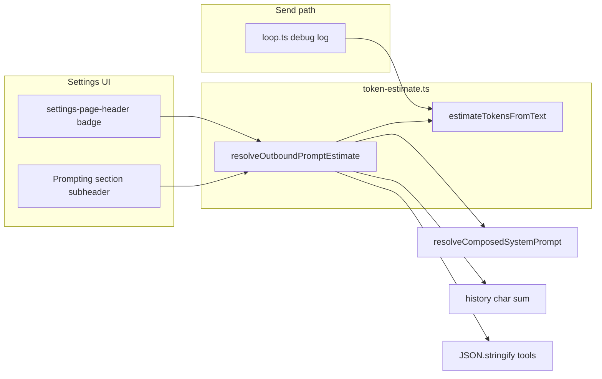

# Feature 25 — Estimated prompt size in settings

**Backlog:** F4 · `feature-25-prompt-token-estimate` ([`product_backlog_agents_48a41af9.plan.md`](../product_backlog_agents_48a41af9.plan.md) § F4)  
**Epic:** F — Settings, prompts, tools · **Wave:** 4  
**Size:** M  
**Depends on:** Step 04 programmatic prompts, Step 20 settings shell; **F3** [`feature-24-user-rules-settings.md`](feature-24-user-rules-settings.md) for accurate **user rules** line item (can ship stub `0` until F3 lands)  
**Blocks:** Nothing

---

## Backlog alignment (F4)

| Backlog field | Plan coverage |
|---------------|---------------|
| **Current** — `loop.ts` `length/4` console only | § Current behavior; refactor to shared helper |
| **Goal** — settings header or Prompting header, full outbound ~tokens | Header badge + Prompting breakdown (both); buckets: compose, rules, history, tools |
| **Implementation** — `resolveComposedSystemPrompt()` + history + tool JSON | `resolveOutboundPromptEstimate()`; history = **sum full `chat.history`** (see § History — understates vs “last msg or average” but matches real send size) |
| **Depends on F3** | Rules bucket `0` until F3; wire after F3 per § After F24 |
| **Label as estimate** | `chars/4`, tooltip, “(estimate)” copy |

---

## Goal

Show users an **approximate token count** for the **next main-chat send** given current settings toggles: prompt profile (full/lite/custom + enabled parts), active chat mode/expert/work-agent resolution, memory injection, user rules (when F24 shipped), serialized chat history, and enabled tool JSON schemas.

Label clearly as an **estimate** (not provider-reported `usage.prompt_tokens`). Use the same **`chars / 4`** heuristic already logged in [`src/tools/loop.ts`](../../../src/tools/loop.ts).

---

## Current behavior (research)

### `loop.ts` — console-only estimate

On each send, after `resolveComposedSystemPrompt()`:

```593:608:src/tools/loop.ts
  if (typeof console !== 'undefined') {
    const debugMeta = {
      mode: chat.modeId,
      // ...
      length: sysPrompt.length,
      tokensEstimate: Math.round(sysPrompt.length / 4),
    };
    console.groupCollapsed(
      `[Minnow] composed system prompt — mode=… (~${debugMeta.tokensEstimate} toks)`,
    );
```

- Only counts **composed system string** (or legacy `#systemPrompt` fallback).
- Does **not** include: second system message (user rules, F24), chat history, `body.tools` JSON, multimodal attachment overhead.
- Not surfaced in UI.

### `resolveComposedSystemPrompt()` — compose-context.ts

[`resolveComposedSystemPrompt(chat, options)`](../../../src/chat/prompts/compose-context.ts):

1. `resolveExpertContextForSend(chat, routeText)` — rules router when experts enabled.
2. `resolveActiveWorkAgent(chat)` for work-agent labels/ids.
3. `buildComposeContext(chat, { overrides })` — loads `prompt-meta`, custom config, memory block (`retrieveMemoryBlock` when `shouldInjectMemory`), enabled tool summaries for `{{enabled_tools}}`.
4. `composeSystemPrompt(ctx)` from [`prompt-composer.ts`](../../../src/chat/prompts/prompt-composer.ts) (`PART_ORDER`, profile gating).

Settings **Prompting** section already previews static template bodies via `loadPromptById` but does **not** run full compose or token math ([`renderPromptPartsPanel`](../../../src/ui/settings-sections.ts)).

### Settings page shell

| Piece | Location |
|-------|----------|
| Global header | [`index.html`](../../../index.html) `.settings-page-header` — back button + `<h1>Settings</h1>` only |
| Prompting section | `#settingsSection-prompting` — profile tabs, custom config bar, `#settingsPromptParts` |
| Active chat context | [`getActiveChat()`](../../../src/state/sessions.ts) — mode, expert, work agent, history used on send |
| Legacy fallback | Drawer `#systemPrompt` textarea ([`settings.ts`](../../../src/ui/settings.ts)) — used when compose returns empty |

No token estimate UI exists today.

---

## Decision: `chars / 4` (v1)

| Option | Verdict |
|--------|---------|
| **`Math.round(text.length / 4)`** | **Chosen** — matches `loop.ts`, zero deps, fast in UI |
| `gpt-tokenizer` / model tokenizer | Deferred — backlog open question #4 |

Export one function so send debug and settings share math:

```typescript
/** Rough token proxy for English-ish text; not model-accurate. */
export function estimateTokensFromText(text: string): number {
  if (!text) return 0;
  return Math.round(text.length / 4);
}
```

Display copy: **"~12.4k tokens (estimate)"** with tooltip: *Approximate; real prompt tokens depend on model tokenizer.*

---

## What to count (outbound request proxy)

Mirror the **first tool-loop request** in `sendMessageWithTools` (not assistant/tool-result follow-up turns).

| Bucket | Source | Notes |
|--------|--------|--------|
| **Composed system** | `resolveComposedSystemPrompt(activeChat, { routeUserText, userMessagePreview })` | Same as send; empty → legacy `#systemPrompt` trim |
| **User rules** | F24 `resolveUserRulesForSend()` body | **0** until F24; then second system message chars |
| **Chat history** | Serialize `activeChat.history` like `buildApiMessages` string content | v1: **sum all turns** (user/assistant/tool string `content`); tool_calls JSON counted via `JSON.stringify` on assistant rows with tools |
| **Pending turn** | Optional | Settings has no composer input — **omit** or use empty string |
| **Tools metadata** | `getEnabledToolDefinitionsForMode(modeId)` (+ work-agent `allowedTools` filter + UI designer filter if applicable) | `estimateTokensFromText(JSON.stringify(enabledTools))` — schemas dominate size |
| **Attachments** | Pending attachments | **Omit in settings** (always empty); document in tooltip |

**Not in v1 estimate:** completion `max_tokens`, reasoning headers, sub-agent internal prompts, MCP tools unless already in `getEnabledToolDefinitionsForMode` cache (refresh `detectLocalServer()` before tool count if MCP enabled).

### History template (backlog: "last user msg or average")

| Approach | Verdict |
|----------|---------|
| Sum full `chat.history` | **Chosen for v1** — matches actual send payload size |
| Last user message only | Rejected as default — understates long threads |
| Running average | Deferred |

### Expert / memory in settings

- **Expert routing:** pass `routeUserText` = last user message in history (slice 500 chars), or `''` if empty → same as compose preview in `buildComposeContext`.
- **Memory:** call real `retrieveMemoryBlock` when `shouldInjectMemory(activeChat)` (may hit network; show "…" while loading).
- **Skill body:** use `resolveActiveSkill` only if slash skill active in composer — in settings, **omit skill part** unless we read last sent skill from chat metadata (v1: **no skill** in estimate unless `chat` stores `lastSkillId` — **omit**).

---

## Architecture



### New module: `src/chat/prompts/token-estimate.ts`

| Export | Purpose |
|--------|---------|
| `estimateTokensFromText(text: string): number` | Shared chars/4 |
| `estimateHistoryTokens(history: Message[]): number` | Sum serialized turn strings |
| `estimateToolsTokens(tools: OpenAIFunctionDefinition[]): number` | `JSON.stringify` length / 4 |
| `OutboundPromptEstimate` | `{ total, composedSystem, userRules, history, tools, legacyFallback: boolean }` |
| `resolveOutboundPromptEstimate(options?): Promise<OutboundPromptEstimate>` | Main entry; `chat` defaults to `getActiveChat()` |

Keep **browser-only** imports (DOM legacy textarea, `getActiveChat`) in a thin wrapper if needed:

- Option A: all in `token-estimate.ts` (acceptable — settings + send both run in browser).
- Option B: `token-estimate-core.ts` (pure) + `token-estimate.ts` (DOM) — only if tests need pure imports without DOM; prefer **A** with jsdom-less tests feeding explicit strings.

### Refactor `loop.ts`

Replace inline `Math.round(sysPrompt.length / 4)` with `estimateTokensFromText(sysPrompt)`; optionally log full `resolveOutboundPromptEstimate` breakdown in dev builds only (keep collapsed group small).

---

## UI design

### Placement (backlog: "top bar or Prompting section header")

Implement **both** (compact, same data):

1. **Settings page header** ([`index.html`](../../../index.html) `.settings-page-header`): right-aligned badge  
   `id="settingsPromptTokenEstimate"` — visible on **every** settings section while page is open.
2. **Prompting section** (below `<h2>Prompting</h2>`): detail row  
   `id="settingsPromptTokenBreakdown"` — optional breakdown lines: System ~X · History ~Y · Tools ~Z · Rules ~W.

### States

| State | UI |
|-------|-----|
| Computing | `~…` + `aria-busy="true"` |
| Ready | `~1,240 tokens` (locale number format) |
| Error / compose threw | `—` + muted hint "Could not estimate" |
| Server memory fetch slow | Show composed + history + tools first; update when memory resolves |

### CSS

[`src/styles/settings-page.css`](../../../src/styles/settings-page.css):

- `.settings-prompt-estimate` — monospace-ish, `var(--text-muted)`, `font-size: 12px`
- `.settings-prompt-estimate-breakdown` — flex row, wrap, gap 8px under Prompting h2

### Refresh triggers

Re-run `resolveOutboundPromptEstimate` when:

- Settings page opens (`openSettings()` / `#/settings/…` hash navigates to settings)
- Active section is `prompting` **or** any section (header badge)
- Profile tab click (`data-profile-tab`)
- Custom config save / part checkbox change (debounce 300ms)
- `savePromptMetaSettings` from prompting toolbar
- User returns to settings after chat switch (listen `scheduleSaveSessions` / sidebar chat click — or re-run on `visibilitychange` when settings open)
- Tools section save (permissions) — optional cross-section refresh via `refreshSettingsSection('prompting')` if header shows global estimate

Debounce rapid toggles (300ms) to avoid memory API spam.

---

## Schema / API / migration

| Area | Change |
|------|--------|
| **Disk / `~/.minnow`** | None — estimate is computed in-browser only |
| **REST / server** | None |
| **`tools.json` / `prompt-meta`** | Read-only via existing loaders; no new keys |
| **Chat session schema** | None |
| **Migration** | N/A |

---

## File change list

| File | Change |
|------|--------|
| `src/chat/prompts/token-estimate.ts` | **New** — estimator + `resolveOutboundPromptEstimate` |
| `src/tools/loop.ts` | Use shared estimator in debug log |
| `index.html` | Header badge + Prompting breakdown container |
| `src/styles/settings-page.css` | Estimate styles |
| `src/ui/settings-page.ts` | `refreshPromptTokenEstimate()` on open / section change |
| `src/ui/settings-sections.ts` | Call refresh from `renderPromptingSection`, profile/part listeners |
| `test/chat/token-estimate.test.mjs` | Unit tests for chars/4 edge cases |
| `test/chat/outbound-prompt-estimate.test.mts` | Breakdown with mocked compose (no DOM) |
| `test/ui/settings-page-html.test.mjs` | Assert new element ids |
| `documentation/context.md` | Settings prompting + token estimate bullet |

**After F24:**

| File | Change |
|------|--------|
| `src/chat/prompts/token-estimate.ts` | Add `userRules` bucket via `resolveUserRulesForSend()` |
| `src/chat/prompts/user-rules.ts` | (F24) consumed by estimator |

---

## Acceptance criteria

1. Settings header shows **~N tokens (estimate)** when settings page is open and `npm start` is not required for base compose (local templates).
2. Number updates when switching **Full / Lite / Custom** profile without sending a message.
3. **Composed system** portion tracks `resolveComposedSystemPrompt` output for **active chat** (mode, expert auto/manual, work agent).
4. **History** portion increases when active chat has more messages.
5. **Tools** portion changes when tool enablement or mode policy changes enabled set.
6. Tooltip or hint states estimate uses **chars÷4**, not provider tokenizer.
7. When F24 shipped, **Rules** line appears in breakdown and total includes rules body.
8. `loop.ts` console group still logs composed estimate using same helper.
9. `npm run build` succeeds; `npm test` includes new tests green.

### Edge cases

- Empty history, empty compose, empty legacy → total may be **tools-only** or **0**.
- Compose throws → UI shows `—`, no uncaught rejection.
- `research` / `plan` modes with fewer tools → tools bucket drops accordingly.
- Work agent `allowedTools` narrows tools bucket to match send filter.
- Custom profile with all parts disabled → small composed bucket (base may still apply per composer rules).

---

## Test plan

### Automated (`npm test`)

| File | Cases |
|------|--------|
| `test/chat/token-estimate.test.mjs` | `''` → 0; `'abcd'` → 1; 4000 chars → 1000; unicode length |
| `test/chat/outbound-prompt-estimate.test.mts` | Mock `composeSystemPrompt` return; fixed history array sum; tools array JSON size; total = sum of buckets |
| `test/ui/settings-page-html.test.mjs` | `settingsPromptTokenEstimate`, `settingsPromptTokenBreakdown` exist |

Run full suite after implementation:

```bash
npm run build
npm test
```

### Manual QA

1. `npm start`, open Settings — note header estimate.
2. Open **Prompting** → switch Full → Lite → verify total **drops** (lite caps / disabled parts).
3. Active chat with long history → estimate **higher** than fresh chat.
4. Disable several tools in **Tools** → tools portion drops.
5. Send a message; devtools `[Minnow] composed system prompt` **composed** line ≤ settings **System** line (same compose path; history/tools only in settings total).
6. Enable memory + entries → composed/system bucket grows after fetch completes.

---

## Build verification

| Step | Command | Expected |
|------|---------|----------|
| Typecheck + bundle | `npm run build` | Exit 0, `dist/` updated |
| Unit tests | `npm test` | All pass including new estimate tests |
| Lint (if CI runs) | — | No new errors in touched TS files |

---

## Documentation follow-ups

- [ ] [`documentation/context.md`](../../context.md) — Settings → Prompting: token estimate badge; note chars/4 heuristic.
- [ ] Cross-link F24 plan: rules bucket in breakdown.

---

## Out of scope (v1)

- Real tokenizer per model family
- Per-turn tool-loop cumulative estimate (turn 2+ assistant/tool messages)
- Sub-agent / title-generator prompt previews
- Estimate in chat composer footer (settings only per backlog)
- Persisting last estimate to disk

---

## Implementation todos

- [ ] **E1** — `token-estimate.ts` utilities + `OutboundPromptEstimate` type
- [ ] **E2** — `resolveOutboundPromptEstimate()` (compose + history + tools + legacy fallback)
- [ ] **E3** — Refactor `loop.ts` to shared estimator
- [ ] **E4** — `index.html` + CSS for header badge and Prompting breakdown
- [ ] **E5** — Wire `settings-page.ts` / `settings-sections.ts` refresh + debounce
- [ ] **E6** — Unit tests + HTML test
- [ ] **E7** — `npm run build` + `npm test`
- [ ] **E8** — Manual QA checklist
- [ ] **E9** — `context.md` update (post-ship)
- [ ] **E10** — After F24: wire `userRules` bucket + breakdown line

---

## Open questions (resolve in implementation if needed)

1. **Header vs Prompting only:** Ship both (recommended) or Prompting-only to reduce noise?
2. **Skill part in estimate:** Omit v1 vs read last skill from chat session field?
3. **MCP tools in estimate:** Include only after `detectLocalServer()` + cache refresh (adds latency on settings open)?
4. **Show chars alongside tokens:** e.g. `~1.2k tok (4.8k chars)` — default **tokens only** for clarity.

**Default answers for implementer:** (1) both, (2) omit skill, (3) call `detectLocalServer()` once when settings opens, (4) tokens only.

---

## Verifier handoff

Create [`documentation/plans/verification/feature-25.md`](../verification/feature-25.md):

- **Plan review:** F4 + per-agent template (6 sections)
- **Automated (post-implementation):** `npm run build`, `npm test` (includes `test/chat/token-estimate.test.mjs`, `test/chat/outbound-prompt-estimate.test.mts`, `test/ui/settings-page-html.test.mjs`)
- **Manual:** M1–M6 in verification doc
- **Sign-off:** PASS when acceptance criteria 1–9 hold and plan deviations (history sum, dual placement) are intentional
