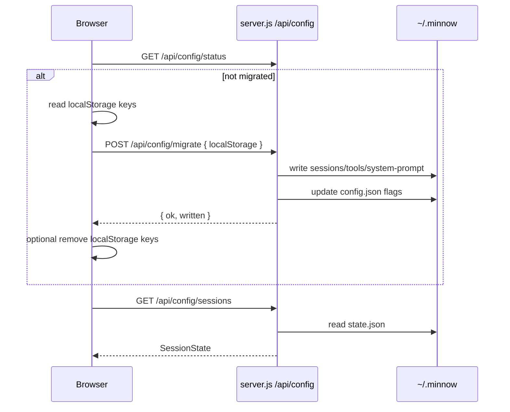

# Step 02 — `~/.minnow` data layer and migration

**Implementation build plan** for implementer and verifier sub-agents.

| Field | Value |
|-------|--------|
| **Step ID** | 02 |
| **Title** | `~/.minnow` data layer + `localStorage` migration |
| **Backlog** | [`to-fix.md`](../to-fix.md) item **2** |
| **Roadmap** | [`to-fix-step-order.md`](../to-fix-step-order.md) § Step 02; [`.cursor/plans/to-fix_step_order_a5310c61.plan.md`](../../../.cursor/plans/to-fix_step_order_a5310c61.plan.md) |
| **Depends on** | Step 01 optional (can run in parallel) |
| **Blocks** | Steps **03–20** (all durable config, providers, prompts, skills, memory, MCP/LSP, terminal logs, etc.) |
| **Out of scope** | Provider registry (Step 03), prompt composer (Step 04), per-chat files split, encryption at rest, cloud sync, full settings page (Step 20) |

**Read first:** [`documentation/context.md`](../../context.md), [`server.js`](../../../server.js) (`resolveSafePath`), [`src/state/sessions.ts`](../../../src/state/sessions.ts), [`src/tools/config.ts`](../../../src/tools/config.ts), [`src/ui/settings.ts`](../../../src/ui/settings.ts), [`src/constants.ts`](../../../src/constants.ts), [`src/main.ts`](../../../src/main.ts).

---

## 1. Goals

1. **Canonical user data directory** — all Minnow config and user data live under **`~/.minnow`** (Windows: `%USERPROFILE%\.minnow`), not browser `localStorage`.
2. **Server is source of truth** when `npm start` is running — new **`GET/PUT /api/config/*`** routes read/write files under the home dir with **path traversal guards** (same spirit as [`resolveSafePath`](../../../server.js) for tool paths).
3. **One-time migration** from existing `localStorage` keys on first launch with server available.
4. **Replace direct `localStorage`** in [`src/state/sessions.ts`](../../../src/state/sessions.ts), [`src/tools/config.ts`](../../../src/tools/config.ts), [`src/ui/settings.ts`](../../../src/ui/settings.ts) with a thin **config client** that proxies to the API.
5. **Graceful degrade** on **`npm run dev`** (Vite-only): keep reading/writing `localStorage` with a clear status hint; no silent data loss.
6. **Scaffold empty dirs** for later steps (`memory/`, `providers/`, `mcp/`, `lsp/`, `prompt-configs/`, `prompts/`, `skills/`) without implementing their features yet.

---

## 2. Acceptance criteria (verifier)

- [ ] With `npm start` and empty home dir, first load creates `~/.minnow` layout + default `sessions/state.json`, `tools.json`, `system-prompt.json`, `config.json`.
- [ ] **Migration:** Given fixture `localStorage` payloads (see §9), `POST /api/config/migrate` writes equivalent files; `config.json` records `migratedFromLocalStorage: true`; re-run is **idempotent** (no duplicate corruption).
- [ ] **Sessions:** Create/rename/delete chat, refresh browser — state persists from disk (not `localStorage`) when server was up during edits.
- [ ] **Tools:** Toggle tools + Brave key in Settings → survives restart; stored under home dir only.
- [ ] **System prompt:** Preset + custom text persists via API.
- [ ] **Safe paths:** `GET /api/config/../../../etc/passwd` (or encoded traversal) returns **400**; writes outside home rejected.
- [ ] **`npm run dev`:** App boots; sessions/tools/prompt still work via `localStorage`; status or banner indicates file-backed config unavailable.
- [ ] `npm run build` passes; **`npm test`** (new) passes API + migration tests with `MINNOW_HOME` pointing at a temp directory.
- [ ] [`documentation/context.md`](../../context.md) updated (home dir layout, API routes, persistence model, dev vs start).
- [ ] [`documentation/plans/verification/step-02.md`](../verification/step-02.md) exists with exact commands (implementer creates).

---

## 3. Home directory resolution (Windows vs Unix)

### 3.1 Path helper (server + shared contract)

Implement **`getMinnowHome()`** in `server/config/home.js` (and export types/constants for client docs):

| Platform | Resolved path | Node API |
|----------|---------------|----------|
| Linux / macOS | `$HOME/.minnow` | `path.join(os.homedir(), '.minnow')` |
| Windows | `C:\Users\<user>\.minnow` | Same — `os.homedir()` returns profile dir; **do not** use `USERPROFILE` manually unless homedir is missing |

**Test override (required):** If `process.env.MINNOW_HOME` is set, use it **instead of** `os.homedir() + '/.minnow'`. Verifier and CI **must** set this to a temp folder; never run destructive tests against the real user profile.

### 3.2 Normalization rules

- Use `path.resolve()` on the home root once at startup.
- Store **relative keys** in API (e.g. `sessions/state.json`), never absolute paths in JSON responses to the browser.
- Log the resolved home path once on `npm start` (info): `Minnow data: <path>`.

### 3.3 Directory creation

On first access, **`ensureMinnowLayout()`**:

- `fs.mkdir(home, { recursive: true })`
- Create subdirs: `sessions`, `memory`, `providers`, `mcp`, `lsp`, `prompt-configs`, `prompts`, `skills`
- Add **`.gitkeep`** or `README.md` stubs in empty scaffold dirs (optional; at least create dirs)
- Write default files only if missing (see §4)

**Permissions (Unix):** `0o700` on home root best-effort; `0o600` on files containing secrets (`tools.json` with API keys). Windows: rely on ACLs; document that home dir is user-private.

---

## 4. On-disk layout and schemas

```text
~/.minnow/
  config.json              # global meta + migration flags + optional UI prefs later
  sessions/
    state.json             # full SessionState blob (v1 — same shape as localStorage today)
  tools.json               # ToolConfig (enabled map + keys.braveApiKey)
  system-prompt.json       # SystemPromptSettings { presetId, text }
  memory/                  # (empty scaffold — Step 16)
  providers/               # (empty scaffold — Step 03)
  mcp/                     # (empty scaffold — Step 18)
  lsp/                     # (empty scaffold — Step 17)
  prompt-configs/          # (empty scaffold — Step 04)
  prompts/                 # user prompt overrides (empty — Step 04)
  skills/                  # user skills (empty — Step 13)
```

### 4.1 `config.json`

```json
{
  "schemaVersion": 1,
  "createdAt": "2026-05-19T12:00:00.000Z",
  "migratedFromLocalStorage": false,
  "migratedAt": null,
  "localStorageKeysMigrated": [],
  "layoutVersion": 1
}
```

| Field | Purpose |
|-------|---------|
| `schemaVersion` | Top-level config file version for future breaking changes |
| `migratedFromLocalStorage` | `true` after successful browser→disk migration |
| `migratedAt` | ISO timestamp when migration completed |
| `localStorageKeysMigrated` | e.g. `["minnow-sessions-v1","minnow.tools","minnow.systemPrompt"]` |

**Step 02 may also store** non-secret UI prefs later (e.g. last drawer tab). **Do not** store LM Studio URL here yet — Step 03 owns `providers/`; optional interim field `legacyServerUrl` allowed **only** for Step 03 migration seed.

### 4.2 `sessions/state.json`

Same JSON shape as today’s [`SessionState`](../../../src/types.ts):

```json
{
  "version": 1,
  "activeId": "<uuid>",
  "sidebarCollapsed": false,
  "chats": [ { "id", "name", "modelId", "history", "lastStats", "modelInfo", "updatedAt" } ]
}
```

- Keep **`SESSION_STATE_VERSION = 1`** in [`src/constants.ts`](../../../src/constants.ts).
- Keep **MAX_CHATS = 50** pruning in [`saveSessionsNow`](../../../src/state/sessions.ts) before PUT.
- **Canonical (do not split):** All chats live in **`sessions/state.json`** via `GET/PUT /api/config/sessions`. Per-chat `sessions/<id>.json` is **out of scope** for Steps 02–20; later steps add fields (e.g. `modeId`) on each `Chat` inside this blob only.

### 4.3 `tools.json`

Same as [`ToolConfig`](../../../src/tools/config.ts) today:

```json
{
  "enabled": { "get_datetime": true, "calculate": true, "...": false },
  "keys": { "braveApiKey": "" }
}
```

### 4.4 `system-prompt.json`

Same as [`SystemPromptSettings`](../../../src/types.ts):

```json
{
  "presetId": "general-assistant",
  "text": "You are a helpful..."
}
```

---

## 5. Safe path guard (`resolveConfigPath`)

**Separate from tool `resolveSafePath`** (which scopes to `process.cwd()` / project root). Config paths scope to **`MINNOW_HOME`**.

### 5.1 Algorithm

```text
resolveConfigPath(relativeKey):
  1. Reject if relativeKey is absolute, empty, or contains null bytes
  2. Normalize: replace backslashes with forward slashes; reject ".." segments
  3. Whitelist: relativeKey must match ALLOWED_CONFIG_FILES or ALLOWED_PREFIXES
  4. full = path.resolve(home, relativeKey)
  5. If normalize(full) does not start with normalize(home) + separator → throw
  6. Return full
```

### 5.2 Whitelist (Step 02)

| Relative key | Methods |
|--------------|---------|
| `config.json` | GET, PUT |
| `sessions/state.json` | GET, PUT |
| `tools.json` | GET, PUT |
| `system-prompt.json` | GET, PUT |

**Not exposed via generic path API in Step 02:** arbitrary files under `prompts/`, `skills/`, etc. (Steps 04+ add dedicated routes).

### 5.3 Error responses

- Traversal / unknown key → **400** `{ "error": "Invalid config path" }`
- Missing file on GET → **404** or default empty document per resource (prefer **defaults** for first-run GET on `sessions/state.json` — implementer choice; document in verification file)

---

## 6. Server API routes

Extend [`server.js`](../../../server.js): new middleware **`createConfigMiddleware()`** registered **before** Vite SPA (alongside `/api/tools`). Same CORS pattern as tools API.

### 6.1 Discovery and health

| Method | Path | Response |
|--------|------|----------|
| `GET` | `/api/config/ping` | `{ "ok": true, "home": ".minnow", "homeResolved": false }` — **never** expose full filesystem path to browser in production builds; `homeResolved: true` is enough. Optional debug: full path only when `MINNOW_DEBUG=1`. |
| `GET` | `/api/config/status` | `{ "ok": true, "storage": "home", "migrated": boolean, "schemaVersion": 1 }` |

### 6.2 Resource CRUD (canonical)

| Method | Path | Body | Response |
|--------|------|------|----------|
| `GET` | `/api/config/sessions` | — | `SessionState` JSON |
| `PUT` | `/api/config/sessions` | `SessionState` | `{ "ok": true }` — validate `version === 1`, non-empty `chats` after normalize |
| `GET` | `/api/config/tools` | — | `ToolConfig` |
| `PUT` | `/api/config/tools` | `ToolConfig` | `{ "ok": true }` — run `normalizeToolConfig` logic server-side (port minimal validator to `server/config/validators.js`) |
| `GET` | `/api/config/system-prompt` | — | `SystemPromptSettings` |
| `PUT` | `/api/config/system-prompt` | `SystemPromptSettings` | `{ "ok": true }` |
| `GET` | `/api/config/meta` | — | `config.json` contents (non-secret) |
| `PUT` | `/api/config/meta` | partial meta update | merge allowed fields only |

**Alternative (optional):** `GET/PUT /api/config/file?key=sessions/state.json` — only if implementer prefers one handler; **must** use whitelist from §5.2.

### 6.3 Migration

| Method | Path | Body | Response |
|--------|------|------|----------|
| `POST` | `/api/config/migrate` | `MigrateBody` (below) | `{ "ok": true, "migrated": true, "written": string[] }` |

```ts
interface MigrateBody {
  localStorage?: {
    sessions?: string;      // raw JSON string from minnow-sessions-v1
    tools?: string;         // raw from minnow.tools
    systemPrompt?: string;  // raw from minnow.systemPrompt
  };
  clearLocalStorage?: boolean; // client hint only — server does not clear browser
}
```

**Server behavior:**

1. If `config.json` already has `migratedFromLocalStorage: true` → return **200** `{ ok: true, skipped: true }` (idempotent).
2. Parse each provided string; on parse error, skip that key and log warning (include in response `warnings: string[]`).
3. Write files **only if** target file does not exist **OR** body includes `force: true` (optional, dev-only guard with `MINNOW_DEBUG=1`).
4. Set `migratedFromLocalStorage`, `migratedAt`, `localStorageKeysMigrated`.
5. Never accept migration payloads > **10 MB** total (align attachment limit).

### 6.4 Vite-only / missing middleware

When only `vite` runs, routes are absent → client `fetch('/api/config/ping')` fails → **`storageMode: 'localStorage'`**. No 503 required on client; failed ping is enough.

When `npm start` but disk error (permissions): return **500** `{ "error": "..." }`; client falls back to `localStorage` + `setStatus('err', ...)`.

---

## 7. Client architecture

### 7.1 New module: `src/config/`

| File | Role |
|------|------|
| `storage-mode.ts` | `detectConfigServer()`, `getStorageMode(): 'server' \| 'localStorage'` |
| `api-client.ts` | `getSessions`, `putSessions`, `getTools`, `putTools`, `getSystemPrompt`, `putSystemPrompt`, `postMigrate` |
| `migrate.ts` | `runMigrationIfNeeded()` — read legacy keys, POST migrate, optional clear |
| `defaults.ts` | Default empty session/tools/prompt (mirror server defaults) |

**Detection:** Extend or parallel [`detectLocalServer`](../../../src/tools/client.ts):

- `GET /api/config/ping` with **800 ms** timeout (same as tools ping).
- If ok → `storageMode = 'server'`; else `'localStorage'`.
- Tools ping can remain separate; **config ping is required** for persistence mode (tools may be up without config in broken partial deploys — treat config ping as authoritative for Step 02).

### 7.2 Bootstrap order ([`initApp`](../../../src/main.ts))

```text
1. detectConfigServer()  → storage mode
2. if server: runMigrationIfNeeded()
3. loadSessionsFromStorage()   // renamed internally: loadSessions — uses API or localStorage
4. fillSystemPromptPresetSelect()
5. loadSystemPromptSettings()
6. fillToolsSection(); registerToolHandlers()
7. initAttachments()
8. detectLocalServer()  // tools (unchanged)
9. loadToolConfigIntoDrawer()
10. … rest unchanged
```

### 7.3 Replace `localStorage` call sites

| Module | Today | After |
|--------|-------|-------|
| [`sessions.ts`](../../../src/state/sessions.ts) | `localStorage.getItem/setItem(STORAGE_KEY)` | `loadSessions()` async or sync-from-cache; `saveSessionsNow()` → `putSessions` when server mode |
| [`config.ts`](../../../src/tools/config.ts) | `TOOL_CONFIG_STORAGE_KEY` | `loadToolConfig` / `saveToolConfig` → API or localStorage |
| [`settings.ts`](../../../src/ui/settings.ts) | `PRESET_STORAGE_KEY` | `saveSystemPromptSettings` / `loadSystemPromptSettings` → API or localStorage |

**Keep constants** `STORAGE_KEY`, `TOOL_CONFIG_STORAGE_KEY`, `PRESET_STORAGE_KEY` for **migration read** and localStorage fallback only. Add comment: `@deprecated direct use — use config api`.

**Debounce:** Keep [`SAVE_DEBOUNCE_MS`](../../../src/constants.ts) — debounced save calls `putSessions` instead of `localStorage.setItem`.

**Quota errors:** Server PUT failure → surface `setStatus('err', 'Could not save sessions to ~/.minnow')`; remove `QuotaExceededError` branch when in server mode (or map disk full to similar UX).

### 7.4 Graceful Vite-only degrade

| Concern | Behavior |
|---------|----------|
| Detection | No `/api/config/ping` → `localStorage` mode |
| UX | Show subtle banner in settings or status pill: **“File-backed config requires npm start”** (mirror tools banner pattern in [`index.html`](../../../index.html)) |
| Data safety | Do **not** auto-migrate to server on first `npm start` without reading browser keys — migration runs once via `runMigrationIfNeeded` |
| SW / offline | Service worker must **not** cache `/api/config/*` (network-only; same as tools API) |
| Dual-write | **Forbidden** — single mode per session; avoid writing both disk and localStorage except during migration window |

### 7.5 Optional localStorage cleanup after migration

If `migrate` succeeds and `clearLocalStorage: true` in client:

- `localStorage.removeItem(STORAGE_KEY)` etc.
- Keep backup keys `minnow-sessions-v1.backup` only if implementer wants rollback (optional; default **remove** to prevent stale re-migration confusion).

---

## 8. Migration algorithm (detailed)



### 8.1 Per-key mapping

| localStorage key | File | Transform |
|------------------|------|-----------|
| `minnow-sessions-v1` | `sessions/state.json` | Parse JSON; validate `version === 1`; run existing `ensureChatShape` logic server-side or trust client parse + server validate |
| `minnow.tools` | `tools.json` | `normalizeToolConfig` |
| `minnow.systemPrompt` | `system-prompt.json` | `{ presetId, text }` strings only |

### 8.2 Edge cases

| Case | Action |
|------|--------|
| Empty localStorage, fresh install | Skip migrate; write defaults |
| Partial keys only | Migrate present keys; defaults for missing |
| Corrupt JSON in one key | Skip that key; add warning; continue |
| Disk already has sessions, migrate POST | **Skip overwrite** unless `force` (debug) |
| User on two browsers | Last writer wins on PUT (document; CRDT out of scope) |
| `npm run dev` forever | Stays on localStorage until user uses `npm start` |

---

## 9. Tests

Add **`npm test`** script (project-wide standard from Step 02 onward):

```json
"test": "node --test test/**/*.test.mjs test/**/*.test.js"
```

**Test runner policy:** Use Node’s built-in **`node --test`** for all new tests unless a later step explicitly adds Vitest project-wide. Steps 04+ must not introduce Vitest-only scripts without updating this policy in `package.json` and `context.md`.

### 9.1 Test environment

- Every test file sets `process.env.MINNOW_HOME` to `path.join(os.tmpdir(), 'minnow-test-' + fixedSuffix)` in `before` hook.
- Use **fixed** chat id `11111111-1111-1111-1111-111111111111` in fixtures.
- Clean up temp home in `after`.

### 9.2 `test/config/resolve-config-path.test.js`

- Allows `sessions/state.json`
- Rejects `../outside.json`, `..\\windows\\escape`, absolute paths
- Rejects unknown keys `providers/foo.json` via generic file API (if implemented)

### 9.3 `test/config/api-crud.test.js`

Spin minimal HTTP server (extract middleware from `server.js` or import `createConfigApp()` test helper):

| Test | Expected |
|------|----------|
| GET sessions empty home | Default one chat or empty per implementer default |
| PUT sessions round-trip | Static `expected_json` string match |
| PUT tools with brave key | Read back exact key |
| GET system-prompt | Round-trip |

### 9.4 `test/config/migration.test.js`

**Fixtures** in `test/fixtures/migration/`:

| File | Purpose |
|------|---------|
| `localStorage-sessions.json` | Valid `SessionState` |
| `localStorage-tools.json` | Sample `ToolConfig` |
| `localStorage-system-prompt.json` | Sample settings |
| `expected-sessions-state.json` | Static expected disk output |
| `expected-tools.json` | Static expected |
| `expected-system-prompt.json` | Static expected |

Tests:

1. POST migrate with all three → files match **static expected** files (byte-stable JSON).
2. POST migrate again → `{ skipped: true }`, files unchanged.
3. POST migrate with corrupt tools string → sessions still written; `warnings` contains tools error.

### 9.5 `scripts/config-smoke.mjs` (optional manual)

```bash
npx tsx scripts/config-smoke.mjs http://localhost:5173
```

- Ping config API
- PUT/read tools
- Document in `verification/step-02.md`

---

## 10. File manifest (implementer)

| Action | Path |
|--------|------|
| Create | `server/config/home.js` — `getMinnowHome`, `ensureMinnowLayout` |
| Create | `server/config/paths.js` — `resolveConfigPath`, whitelist |
| Create | `server/config/validators.js` — session/tools/prompt validation |
| Create | `server/config/store.js` — read/write JSON files |
| Create | `server/config/middleware.js` — route handlers |
| Modify | [`server.js`](../../../server.js) — register config middleware |
| Create | `src/config/storage-mode.ts` |
| Create | `src/config/api-client.ts` |
| Create | `src/config/migrate.ts` |
| Create | `src/config/defaults.ts` |
| Modify | [`src/state/sessions.ts`](../../../src/state/sessions.ts) |
| Modify | [`src/tools/config.ts`](../../../src/tools/config.ts) |
| Modify | [`src/ui/settings.ts`](../../../src/ui/settings.ts) |
| Modify | [`src/main.ts`](../../../src/main.ts) — bootstrap order |
| Modify | [`index.html`](../../../index.html) — optional config storage banner |
| Modify | [`package.json`](../../../package.json) — `"test"` script |
| Create | `test/config/*.test.js`, `test/fixtures/migration/*` |
| Create | `documentation/plans/verification/step-02.md` |
| Update | [`documentation/context.md`](../../context.md) |

---

## 11. `documentation/context.md` updates (required)

Replace **localStorage keys** section with:

- **Primary persistence:** `~/.minnow` when `npm start`
- **Fallback:** browser `localStorage` when Vite-only
- Table of files + API routes
- Migration one-liner + `MINNOW_HOME` for tests
- Note scaffold dirs for future steps

---

## 12. Risks and decisions

| Topic | Decision |
|-------|----------|
| Monolithic `sessions/state.json` | Keeps Step 02 small; matches current blob |
| Server cannot read localStorage | Migration **must** be browser-initiated POST |
| Secrets in `tools.json` | Accept for Step 02; Step 03 may split `providers/` secrets |
| Path exposure | Hide full home path in API unless debug env |
| Async load | `loadSessionsFromStorage` may become async — update `initApp` to `await loadSessions()` |
| PWA cache | Document `/api/config/*` network-only in SW notes |

---

## 13. Verifier handoff

1. Set `MINNOW_HOME` to a fresh temp dir (commands in `verification/step-02.md`).
2. Run `npm test` and `npm run build`.
3. `npm start` → open app → verify banner absent; create chat; restart server; chat persists.
4. Seed localStorage via devtools (fixture strings) → reload → confirm migration + files on disk.
5. `npm run dev` → confirm localStorage mode + banner.
6. Attempt path traversal request → **400**.
7. Confirm `context.md` updated.
8. Report **PASS/FAIL**; do not patch feature code on FAIL.

---

## 14. Todos (implementation)

### 14.1 Server foundation

- [ ] **S02-T01** Add `getMinnowHome()` with `MINNOW_HOME` override and platform tests in comments.
- [ ] **S02-T02** Implement `ensureMinnowLayout()` + default file writers.
- [ ] **S02-T03** Implement `resolveConfigPath()` + whitelist unit tests.
- [ ] **S02-T04** Implement `server/config/store.js` (atomic write: write temp + rename).

### 14.2 Server API

- [ ] **S02-T05** Add `createConfigMiddleware()` with CORS/OPTIONS parity to tools API.
- [ ] **S02-T06** Implement `GET/PUT` for sessions, tools, system-prompt, meta.
- [ ] **S02-T07** Implement `GET /api/config/ping` and `GET /api/config/status`.
- [ ] **S02-T08** Implement `POST /api/config/migrate` (idempotent).
- [ ] **S02-T09** Wire middleware in [`server.js`](../../../server.js); log home path on start.

### 14.3 Client

- [ ] **S02-T10** Add `src/config/*` modules (storage mode, api client, migrate).
- [ ] **S02-T11** Refactor [`sessions.ts`](../../../src/state/sessions.ts) to use config API + debounced PUT.
- [ ] **S02-T12** Refactor [`config.ts`](../../../src/tools/config.ts) for tools persistence.
- [ ] **S02-T13** Refactor [`settings.ts`](../../../src/ui/settings.ts) for system prompt persistence.
- [ ] **S02-T14** Update [`main.ts`](../../../src/main.ts) bootstrap + migration call.
- [ ] **S02-T15** Add Vite-only banner / status messaging.

### 14.4 Tests and docs

- [ ] **S02-T16** Add `test/fixtures/migration/*` static fixtures.
- [ ] **S02-T17** Add `test/config/resolve-config-path.test.js`.
- [ ] **S02-T18** Add `test/config/api-crud.test.js`.
- [ ] **S02-T19** Add `test/config/migration.test.js`.
- [ ] **S02-T20** Add `npm test` to [`package.json`](../../../package.json).
- [ ] **S02-T21** Create `documentation/plans/verification/step-02.md`.
- [ ] **S02-T22** Update [`documentation/context.md`](../../context.md).
- [ ] **S02-T23** Verifier runs checklist; fix cycle if FAIL.

---

## 15. Reference — current `localStorage` coupling

Sessions load/save:

```138:201:src/state/sessions.ts
export function loadSessionsFromStorage(): void {
  try {
    const raw = localStorage.getItem(STORAGE_KEY);
    // ...
export function saveSessionsNow(): SaveSessionsResult {
  // ...
    localStorage.setItem(STORAGE_KEY, JSON.stringify(sessionState));
```

Tool config:

```71:96:src/tools/config.ts
export function loadToolConfig(): ToolConfig {
  // ...
    const raw = localStorage.getItem(TOOL_CONFIG_STORAGE_KEY);
// ...
    localStorage.setItem(TOOL_CONFIG_STORAGE_KEY, JSON.stringify(config));
```

System prompt:

```65:76:src/ui/settings.ts
export function saveSystemPromptSettings(): void {
  try {
    localStorage.setItem(
      PRESET_STORAGE_KEY,
      JSON.stringify({
        presetId: activeSystemPromptPresetId,
        text: (document.getElementById('systemPrompt') as HTMLTextAreaElement).value,
      })
    );
```

Tool path guard (pattern to mirror for home dir):

```32:55:server.js
function resolveSafePath(userPath) {
  // ... PROJECT_ROOT scope
}
```

---

## 16. Sub-agent prompt snippet

**Implementer:** Implement Step 02 per this file. Server owns `~/.minnow`; migrate three `localStorage` keys; graceful Vite-only fallback. Tests required before handoff. Update `context.md`.

**Verifier:** Acceptance criteria §2 + §13 only; use temp `MINNOW_HOME`; re-run `npm test` and `npm run build`; no feature commits on FAIL.
