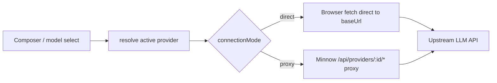

# Step 03 — Multiple providers + API authentication

**Implementation build plan** for implementer and verifier sub-agents.

| Field | Value |
|-------|--------|
| **Step ID** | 03 |
| **Title** | Multiple providers + API authentication |
| **Backlog** | [`to-fix.md`](../to-fix.md) items **3** (multiple providers), **4** (API keys / auth) |
| **Roadmap** | [`to-fix-step-order.md`](../to-fix-step-order.md) § Step 03 |
| **Depends on** | **Step 02** — `~/.minnow` home dir, `server.js` config I/O, migration off `localStorage` ([roadmap § Step 02](../to-fix-step-order.md#step-02--minnow-data-layer-and-migration); [`step-02-minnow-home-dir.md`](step-02-minnow-home-dir.md)) |
| **Blocks** | Steps 07, 08, 18, 20 (provider/model binding) |
| **Out of scope** | Full settings page (Step 20), Work Agents UI (Step 08), MCP transport (Step 18), prompt composer (Step 04) |

**Read first:** [`documentation/context.md`](../../context.md), [`documentation/plans/to-fix-step-order.md`](../to-fix-step-order.md) (Wave 2 — Step 03), current [`src/api/models.ts`](../../../src/api/models.ts), [`src/api/chat.ts`](../../../src/api/chat.ts), [`src/tools/loop.ts`](../../../src/tools/loop.ts), [`src/ui/status.ts`](../../../src/ui/status.ts), [`server.js`](../../../server.js).

---

## 1. Goals

1. **Multiple OpenAI-compatible providers** — LM Studio is the default entry; users can add remote/local endpoints (OpenRouter, Ollama gateway, custom v1 servers, etc.).
2. **Per-provider auth** — API key, Bearer token, and optional custom headers; **secrets never in the repo or browser storage**.
3. **Single resolution path** for models + chat — replace hard-coded `#serverUrl` + direct `fetch(`${base}/api/v0/...`)` with a **provider-aware client** used by `fetchModels`, `sendMessagePlain`, and `sendMessageWithTools`.
4. **CRUD over HTTP** when `npm start` is running — list/create/update/delete providers under `~/.minnow/providers/`.
5. **Minimal UI hooks** — enough to pick active provider and refresh models; polish deferred to Step 20.

---

## 2. Acceptance criteria (verifier)

- [ ] At least **two** providers can coexist on disk; switching active provider changes model list and chat target without editing raw URL in devtools.
- [ ] **Secrets** exist only under `~/.minnow` (profile JSON never contains raw keys; API list responses redact secrets).
- [ ] **Auth headers** are sent on proxied requests when `apiKey` / `bearerToken` / `customHeaders` are configured (verified by mock HTTP tests).
- [ ] **Migration**: existing `#serverUrl` (`http://localhost:1234`) becomes default provider `lm-studio-local` (or similar id) on first run after Step 02 migration.
- [ ] `npm run build` passes; new **`npm test`** (or documented `npx tsx test/...`) passes mock provider + auth tests.
- [ ] [`documentation/context.md`](../../context.md) updated (providers layout, API routes, send path).
- [ ] Optional: [`documentation/plans/verification/step-03.md`](../verification/step-03.md) with exact commands (implementer creates, verifier runs).

---

## 3. Prerequisites from Step 02 (contract)

Step 03 **must not** re-implement the home-dir layer. Assume Step 02 delivers:

| Capability | Expected API / module |
|------------|------------------------|
| Home directory | `getMinnowHome()` → `~/.minnow` (Windows: `%USERPROFILE%\.minnow`) |
| Safe path guard | Reuse `resolveSafePath` pattern scoped to home dir for provider files |
| Global config | `~/.minnow/config.json` with at least `activeProviderId`, schema version |
| Config HTTP | `GET/PUT /api/config` or granular routes under `/api/config/*` |
| Dev vs Vite-only | CRUD returns **503** or clear JSON error when routes unavailable (`npm run dev`) |

If Step 02 is incomplete, implementer **stops** and finishes Step 02 first.

---

## 4. On-disk layout (`~/.minnow/providers/`)

One **directory per provider** (stable `id` = folder name):

```text
~/.minnow/
  config.json                 # activeProviderId, optional defaultProviderId
  providers/
    lm-studio-local/
      profile.json            # non-secret metadata (safe to log in debug)
      secrets.json            # apiKey, bearerToken — never returned verbatim to client
```

### 4.1 `profile.json` (non-secret)

```json
{
  "id": "lm-studio-local",
  "label": "LM Studio (local)",
  "baseUrl": "http://localhost:1234",
  "apiKind": "lm-studio-v0",
  "enabled": true,
  "connectionMode": "direct",
  "modelsPath": "/api/v0/models",
  "chatCompletionsPath": "/api/v0/chat/completions",
  "customHeaders": {
    "X-Custom-Example": "optional-non-auth-header"
  },
  "createdAt": "2026-05-19T00:00:00.000Z",
  "updatedAt": "2026-05-19T00:00:00.000Z"
}
```

| Field | Purpose |
|-------|---------|
| `apiKind` | `lm-studio-v0` \| `openai-v1` — selects default paths and response normalization |
| `connectionMode` | `direct` — browser calls `baseUrl` (localhost / CORS-allowed). `proxy` — browser calls Minnow server; server attaches secrets and forwards |
| `modelsPath` / `chatCompletionsPath` | Override defaults per `apiKind` when vendor uses non-standard paths |

**Default path matrix (implement in `src/providers/paths.ts`):**

| `apiKind` | models | chat completions |
|-----------|--------|------------------|
| `lm-studio-v0` | `/api/v0/models` | `/api/v0/chat/completions` |
| `openai-v1` | `/v1/models` | `/v1/chat/completions` |

### 4.2 `secrets.json` (secret only on disk)

```json
{
  "apiKey": "",
  "bearerToken": "",
  "headerOverrides": {}
}
```

- Empty strings = omit that auth mechanism.
- **Precedence** when building outbound headers (server proxy and tests):
  1. If `bearerToken` non-empty → `Authorization: Bearer <token>`
  2. Else if `apiKey` non-empty → `Authorization: Bearer <apiKey>` **or** `api-key: <key>` per provider `authStyle` (add optional `authStyle: "bearer" | "api-key" | "x-api-key"` on profile; default `bearer`)
  3. Merge `profile.customHeaders` then `secrets.headerOverrides` (secrets win on key collision)
- File mode: `0o600` on Unix when writing secrets (best effort on Windows).

### 4.3 Seed + migration

| Event | Action |
|-------|--------|
| First boot, no providers | Create `lm-studio-local` from `config.json` legacy `serverUrl` or default `http://localhost:1234` |
| Step 02 migrated `serverUrl` in config | Map into `lm-studio-local.profile.json` |
| User deletes last provider | Reject DELETE; keep at least one enabled provider |

---

## 5. Server API — provider CRUD + proxy

Extend [`server.js`](../../../server.js) middleware (same stack as `/api/tools`, **before** Vite SPA).

### 5.1 CRUD routes

| Method | Path | Body | Response |
|--------|------|------|----------|
| `GET` | `/api/providers` | — | `{ providers: ProviderPublic[] }` — no secrets |
| `GET` | `/api/providers/:id` | — | `ProviderPublic` or 404 |
| `POST` | `/api/providers` | `CreateProviderBody` | `ProviderPublic` 201 |
| `PUT` | `/api/providers/:id` | `UpdateProviderBody` | `ProviderPublic` |
| `DELETE` | `/api/providers/:id` | — | 204 or 409 if last provider |
| `PUT` | `/api/providers/:id/secrets` | `{ apiKey?, bearerToken?, headerOverrides? }` | `{ ok: true, hasApiKey: boolean, hasBearer: boolean }` — never echo values |
| `POST` | `/api/providers/:id/set-active` | — | updates `config.json` `activeProviderId` |

**Validation:**

- `id`: `^[a-z0-9][a-z0-9_-]{0,63}$`
- `baseUrl`: valid `http:` / `https:` origin (strip trailing slash)
- Reject path traversal in `:id` (only alphanumerics + `_-`)

**Suggested server modules:**

```text
server/
  providers/
    store.js          # read/write profile + secrets under home dir
    validate.js       # id, url, apiKind enums
    auth-headers.js   # buildHeaders(profile, secrets) — unit-tested
    routes.js         # CRUD handlers
    proxy.js          # forward models + chat with auth
```

(Implementer may colocate in `server.js` initially if small; extract before merge if > ~200 lines.)

### 5.2 Proxy routes (for `connectionMode: "proxy"`)

| Method | Path | Purpose |
|--------|------|---------|
| `GET` | `/api/providers/:id/models` | Server fetches upstream models with auth; returns normalized `{ data: LmModelRecord[] }` |
| `POST` | `/api/providers/:id/chat/completions` | Stream or JSON body passthrough; inject auth headers server-side |

- Forward `AbortSignal` / cancel on client disconnect where feasible.
- Stream: pipe upstream SSE to client unchanged (preserve LM Studio extensions).
- Timeouts: 120s chat, 15s models (configurable constants).

### 5.3 Security rules

- Never include `secrets.json` fields in `GET` responses.
- Do not log request headers containing `Authorization` or API keys.
- `.gitignore` / docs: `**/*.secrets.json` under home dir is user-local only.
- Brave key in `minnow.tools` remains until Step 20 consolidates keys; **new** LLM provider keys **only** in `providers/*/secrets.json`.

---

## 6. Client architecture

### 6.1 New modules

| File | Responsibility |
|------|----------------|
| `src/providers/types.ts` | `ProviderPublic`, `ProviderId`, `ApiKind`, `ConnectionMode`, `ProviderEndpoints` |
| `src/providers/store.ts` | `listProviders()`, `getActiveProvider()`, `setActiveProvider(id)` via fetch to `/api/providers` |
| `src/providers/resolve.ts` | `resolveProviderEndpoints(provider)` → `{ modelsUrl, chatUrl, mode, fetchFn }` |
| `src/providers/headers.ts` | Client-side: **only** non-secret headers for `direct` mode; for `proxy`, no auth in browser |
| `src/providers/fetch-models.ts` | `fetchModelsForProvider(providerId, signal)` |
| `src/providers/fetch-chat.ts` | `providerFetch(url, init, provider)` — central `fetch` wrapper |

### 6.2 Refactor map

| Current | Change |
|---------|--------|
| [`src/api/models.ts`](../../../src/api/models.ts) | `fetchModels()` → load active provider → `fetchModelsForProvider()`; keep `modelCache`, `resolveModelInfo`, `showCachedModelInfo` |
| [`src/api/chat.ts`](../../../src/api/chat.ts) | `tryNonStreamingFallback`, `sendMessage` use `resolveProviderEndpoints` + shared `postChatCompletions()` |
| [`src/tools/loop.ts`](../../../src/tools/loop.ts) | `streamCompletionTurn` + `sendMessageWithTools` use same `postChatCompletions()` / stream helper |
| [`src/ui/status.ts`](../../../src/ui/status.ts) | Deprecate `serverUrl()` as source of truth; keep `parseServerBaseUrl` for validation; add `getActiveProviderBaseUrl()` shim during transition |
| [`index.html`](../../../index.html) | Replace single URL field with **minimal** provider select + “Manage…” placeholder (Step 20) |
| [`src/types.ts`](../../../src/types.ts) | Optional: `Chat.providerId` + `Chat.modelId` (session schema v2 — coordinate with Step 02 sessions on disk) |

### 6.3 Request flow (target)



### 6.4 OpenAI-v1 normalization

`GET /v1/models` returns `{ data: [{ id }] }` without LM Studio `type` / `state`. Normalizer in `fetch-models.ts`:

- Map each id to `{ id, type: 'llm', state: 'loaded' }` unless upstream provides richer fields.
- Filter: include all for v1 unless profile adds `modelFilter` later (out of scope).

### 6.5 Session binding

- **Global active provider** in `config.json` drives settings + default for new chats.
- Per-chat override (optional this step): `chat.providerId` if set, else active global.
- Persist `providerId` when saving sessions (Step 02 file format); bump `SESSION_SCHEMA_VERSION` only with Step 02 agreement.

---

## 7. UI hooks (minimal — Step 20 defers polish)

Implement in [`src/ui/settings.ts`](../../../src/ui/settings.ts) + [`index.html`](../../../index.html):

| UI | Behavior |
|----|----------|
| `#providerSelect` | `<select>` populated from `GET /api/providers` (enabled only) |
| Change handler | `POST /api/providers/:id/set-active` → `fetchModels()` |
| `#serverUrl` | **Hidden or read-only** showing active provider base URL (backward compat); remove `onchange="fetchModels()"` from raw URL editing as primary path |
| “Add provider” | Stub button disabled or links to “Full settings in a future update” — **no** full CRUD form required |
| Status pill | On provider error: `Cannot reach provider «label»` |
| `npm run dev` | Show hint: “Provider management requires npm start” |

**Developer-only CRUD** acceptable via curl/`scripts/provider-crud-smoke.mjs` until Step 20.

---

## 8. Implementation phases (ordered)

### Phase A — Server store + auth header builder

1. `auth-headers.js` + unit tests (no HTTP).
2. `store.js` — create/read/update/delete provider dirs.
3. Seed `lm-studio-local` on empty registry.

### Phase B — CRUD HTTP routes

4. Wire routes in `server.js`.
5. Manual curl checklist (document in verification file).

### Phase C — Proxy fetch

6. `GET .../models` and `POST .../chat/completions` with header injection.
7. Mock upstream integration tests.

### Phase D — Client provider module

8. `src/providers/*` + `store.ts` API client.
9. Refactor `models.ts`, `chat.ts`, `loop.ts` to use resolver.
10. Wire `#providerSelect` + active provider on `initApp()` after Step 02 config load.

### Phase E — Migration + docs

11. Migration from legacy `serverUrl` / config field.
12. Update `context.md`, README snippet (providers + secrets location).

---

## 9. Tests

Add **`npm test`** in `package.json` if Step 02 did not (use `node --test` built-in).

### 9.1 Unit — auth header injection (`test/providers/auth-headers.test.js`)

Use **fixed** provider fixtures (no random ids).

| Case | `secrets` | Expected headers |
|------|-----------|------------------|
| No auth | empty | `{}` or only `customHeaders` |
| Bearer token | `bearerToken: "test-bearer-fixed"` | `Authorization: Bearer test-bearer-fixed` |
| API key bearer style | `apiKey: "sk-fixed-key"` | `Authorization: Bearer sk-fixed-key` |
| API key header style | profile `authStyle: "api-key"` | `api-key: sk-fixed-key` |
| Custom merge | profile + secrets overrides | later keys win |

Assert with **static expected objects** (no dynamic string building in assertions).

### 9.2 Integration — mock HTTP upstream

Pattern: spin up **`node:http`** local server in test that records `req.headers` and returns static JSON for `/api/v0/models` and a one-chunk SSE for chat.

| Test | Assert |
|------|--------|
| Proxy models with API key | Mock receives `Authorization` |
| Proxy chat stream | Mock receives POST + auth |
| CRUD roundtrip | POST create → GET list contains id → PUT label → DELETE |
| Secrets redaction | `GET /api/providers/:id` JSON string does not contain `sk-fixed-key` |

Run from repo root:

```bash
npm test
# or
node --test test/providers/*.test.js
```

### 9.3 Smoke (optional, with `npm start`)

`scripts/provider-smoke.mjs`:

1. `GET /api/providers` — includes `lm-studio-local`
2. `PUT .../secrets` with dummy key
3. `GET /api/providers/:id/models` — against mock or real LM Studio if present (skip if connection refused)

Document port in [`documentation/plans/verification/step-03.md`](../verification/step-03.md).

---

## 10. Files to create / modify (checklist)

| Action | Path |
|--------|------|
| Create | `server/providers/store.js` |
| Create | `server/providers/auth-headers.js` |
| Create | `server/providers/routes.js` |
| Create | `server/providers/proxy.js` |
| Modify | `server.js` — register provider middleware |
| Create | `src/providers/types.ts` |
| Create | `src/providers/store.ts` |
| Create | `src/providers/resolve.ts` |
| Create | `src/providers/fetch-models.ts` |
| Create | `src/providers/fetch-chat.ts` |
| Modify | `src/api/models.ts` |
| Modify | `src/api/chat.ts` |
| Modify | `src/tools/loop.ts` |
| Modify | `src/ui/settings.ts`, `index.html` |
| Modify | `src/main.ts` — init provider select before `fetchModels()` |
| Modify | `package.json` — `"test": "node --test test/**/*.test.js"` |
| Create | `test/providers/auth-headers.test.js` |
| Create | `test/providers/proxy-mock.test.js` |
| Create | `scripts/provider-smoke.mjs` (optional) |
| Update | `documentation/context.md` |
| Create | `documentation/plans/verification/step-03.md` |

---

## 11. Risks and decisions

| Topic | Decision |
|-------|----------|
| CORS on remote providers | Default new non-localhost providers to `connectionMode: "proxy"` |
| LM Studio localhost | Keep `direct` for zero-latency local dev |
| Secret exposure | Proxy mode keeps keys on server; direct mode only for trusted localhost |
| API surface drift | `apiKind` enum + path overrides; avoid hard-coding only v0 in client |
| Service worker | Existing SW already bypasses localhost LM Studio; document that proxied routes are same-origin `/api/*` (cached appropriately — network-only for API) |

---

## 12. Verifier handoff

1. Run `npm run build` and `npm test`.
2. With temp `MINNOW_HOME` (env var implementer must add): create two providers, set active, confirm mock tests record auth headers.
3. Manual: `npm start` → switch provider in drawer → model dropdown updates.
4. Confirm `context.md` documents provider paths and routes.
5. Report **PASS/FAIL**; do not patch feature code on FAIL.

---

## 13. Todos (implementation)

### 13.1 Planning and setup

- [ ] **S03-T01** Confirm Step 02 complete (`~/.minnow`, `/api/config`, home path helper, migration).
- [ ] **S03-T02** Add `MINNOW_HOME` env override for tests (document in verification file).
- [ ] **S03-T03** Create `documentation/plans/verification/step-03.md` stub with commands.

### 13.2 Server — storage and auth

- [ ] **S03-T04** Implement `server/providers/store.js` (read/write profile + secrets, chmod secrets).
- [ ] **S03-T05** Implement `server/providers/auth-headers.js` with `authStyle` support.
- [ ] **S03-T06** Write `test/providers/auth-headers.test.js` (all cases static fixtures).
- [ ] **S03-T07** Seed `lm-studio-local` provider + migration from legacy `serverUrl`.

### 13.3 Server — CRUD API

- [ ] **S03-T08** Implement `GET/POST /api/providers` and `GET/PUT/DELETE /api/providers/:id`.
- [ ] **S03-T09** Implement `PUT /api/providers/:id/secrets` (redacted response).
- [ ] **S03-T10** Implement `POST /api/providers/:id/set-active` → `config.json`.
- [ ] **S03-T11** Validate ids and URLs; reject deleting last provider.

### 13.4 Server — proxy

- [ ] **S03-T12** Implement `GET /api/providers/:id/models` with upstream fetch + v0/v1 normalize.
- [ ] **S03-T13** Implement `POST /api/providers/:id/chat/completions` (stream + non-stream).
- [ ] **S03-T14** Write `test/providers/proxy-mock.test.js` (mock upstream records headers).

### 13.5 Client — provider module

- [ ] **S03-T15** Add `src/providers/types.ts` and `store.ts` (list, active, setActive).
- [ ] **S03-T16** Add `resolve.ts` + `paths.ts` (`apiKind` → default paths).
- [ ] **S03-T17** Add `fetch-models.ts` and `fetch-chat.ts` (direct vs proxy).
- [ ] **S03-T18** Refactor `src/api/models.ts` to use provider fetch.
- [ ] **S03-T19** Refactor `src/api/chat.ts` (`tryNonStreamingFallback`, `sendMessage`).
- [ ] **S03-T20** Refactor `src/tools/loop.ts` (`streamCompletionTurn`, tool loop).

### 13.6 Client — UI and session

- [ ] **S03-T21** Add `#providerSelect` to settings; load/switch active provider.
- [ ] **S03-T22** Demote `#serverUrl` to read-only or hidden; update empty-state copy.
- [ ] **S03-T23** Persist optional `chat.providerId` if session schema bumped with Step 02.
- [ ] **S03-T24** Update `initApp()` order: load providers → sync select → `fetchModels()`.

### 13.7 Quality and docs

- [ ] **S03-T25** Add `npm test` script; ensure CI-local run passes.
- [ ] **S03-T26** Add `scripts/provider-smoke.mjs` (optional manual).
- [ ] **S03-T27** Update `documentation/context.md` (providers, auth, routes, send path).
- [ ] **S03-T28** Update README — where secrets live, proxy vs direct, example curl CRUD.
- [ ] **S03-T29** Verifier runs full checklist; fix cycle if FAIL.

---

## 14. Reference — current coupling (pre-refactor)

Today all LM Studio calls read DOM `#serverUrl` via [`serverUrl()`](../../../src/ui/status.ts):

```38:55:src/api/models.ts
export async function fetchModels(): Promise<void> {
  const sel = document.getElementById('modelSelect') as HTMLSelectElement;
  const base = parseServerBaseUrl(serverUrl());
  // ...
    const res = await fetch(`${base}/api/v0/models`, { signal });
```

```276:289:src/tools/loop.ts
async function streamCompletionTurn(
  base: string,
  body: ChatCompletionBody,
  // ...
): Promise<StreamTurnResult> {
  const res = await fetch(`${base}/api/v0/chat/completions`, {
```

Step 03 replaces `base` resolution with **provider id → endpoints + connection mode**, and centralizes header injection on the server for proxy mode.

---

## 15. Sub-agent prompt snippet

**Implementer:** Implement Step 03 per this file; depend on Step 02; do not build Step 20 settings page. Tests required before handoff.

**Verifier:** Acceptance criteria §2 + §12 only; re-run `npm test` and build; no feature commits on FAIL.
