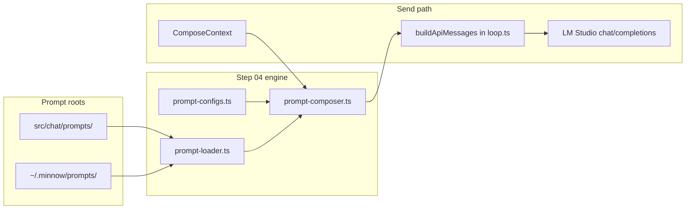

# Step 04 — Programmatic prompts (implementation build plan)

**Source roadmap:** [`documentation/plans/to-fix-step-order.md`](../to-fix-step-order.md) (Step 04)  
**Backlog:** [`documentation/plans/to-fix.md`](../to-fix.md) item 6  
**Architecture:** [`documentation/context.md`](../../context.md)  
**Depends on:** Step 02 (`~/.minnow` data layer + config API)  
**Blocks:** Steps 05 (modes), 06 (experts), 07 (titles), 08 (work agents)  
**Settings UI:** deferred to Step 20 (engine + schema + tests ship here)

---

## Goal

Replace the single settings textarea + hardcoded [`SYSTEM_PROMPT_PRESETS`](../../../src/constants.ts) with a **composable, profile-aware system prompt** assembled at send time. Shipped defaults live in **`src/chat/prompts/`**; user overrides in **`~/.minnow/prompts/`**; named **Custom** profiles in **`~/.minnow/prompt-configs/`**.

Success: `composeSystemPrompt()` returns one `system` string; [`buildApiMessages`](../../../src/tools/loop.ts) uses it instead of reading `#systemPrompt` DOM; Full/Lite/Custom behavior is testable without the settings UI.

---

## Non-goals (this step)

| Deferred | Step |
|----------|------|
| Mode selector UI, mode tool policies | 05 |
| Expert auto-router + dropdown | 06 |
| Async title generation job | 07 |
| Work Agent registry + per-agent model | 08 |
| `/skill` slash command + skill loader | 13 |
| Memory retrieval + embeddings | 16 |
| Settings drawer: profile tabs, per-part editors | 20 |

Stubs: mode/expert/work-agent/skill/memory **part slots** exist in the composer with **no-op or empty** resolution when the upstream feature is off — so wiring in later steps is additive.

---

## References

Read for design parity; **do not copy verbatim** without license review. Implementer writes adoption notes in [`documentation/plans/references/prompt-sources.md`](../references/prompt-sources.md).

| Source | URL | Use for | Local mirror (if present) |
|--------|-----|---------|---------------------------|
| system-prompts-and-models-of-ai-tools | https://github.com/x1xhlol/system-prompts-and-models-of-ai-tools | Product prompt structure, tool rules, personas | `uploads/system-prompts-and-models-of-ai-tools-0.md` |
| OpenCode | https://github.com/anomalyco/opencode | Layered prompts, agents, config shape | `uploads/opencode-1.md` |
| oh-my-opencode-slim | https://github.com/alvinunreal/oh-my-opencode-slim | Token-efficient / lite trimming patterns | `uploads/oh-my-opencode-slim-2.md` |
| OpenCode docs | https://opencode.ai/docs/ | Agents, rules, official layering | — |
| Cursor (conceptual) | — | Part toggles, separate Full/Lite/Custom bodies | — |
| Current Minnow | [`src/constants.ts`](../../../src/constants.ts), [`src/ui/settings.ts`](../../../src/ui/settings.ts) | Migration source for `info/` seeds | — |

**`prompt-sources.md` deliverable (verifier checks file exists):** For each reference above, 1–2 sentences on what Minnow **adopted** vs **diverged** (composition order, dual-root, profile engine, no verbatim vendor copy).

---

## Architecture overview



**Dual-root merge (same pattern as future skills):**

1. Glob-scan built-in tree under `src/chat/prompts/**` (exclude `_example/` from routing).
2. Glob-scan `~/.minnow/prompts/**` with identical relative paths.
3. On **`id` conflict**, user file wins.
4. Profile body selection: `full` → `fullBody` or `*.full.md` or default body; `lite` → `liteBody` or `lite/` sibling or truncated rules; `custom` → config overrides.

---

## Directory layout (ship in Step 04)

```
src/chat/prompts/
  _example/                    # Reference only — never routed in production
    PROMPT_TEMPLATE.md
    README.md
  lite/                        # Optional global lite fragments (part-specific)
  base/
    default.full.md
    default.lite.md
  modes/                       # Stubs until Step 05 fills templates
  experts/
  tool-usage/
    default.full.md
    default.lite.md
  info/                        # Migrated SYSTEM_PROMPT_PRESETS as separate files
  work-agents/
  titles/                      # Stub for Step 07

~/.minnow/
  config.json                  # activePromptProfile, activePromptConfigId, …
  prompt-configs/
    <id>.json                  # Custom named profiles
  prompts/                     # User overrides (mirror src tree)
    overrides/
      full/
      lite/
      custom/
    experts/
    modes/
    …
```

---

## Prompt part model

Each **part** is independently enableable (Custom + per-profile overrides in Step 20). The composer owns the canonical part list.

| Part `id` | Typical source path | Included when | Lite behavior (summary) |
|-----------|---------------------|---------------|-------------------------|
| `base` | `base/default.*.md` | Always in **Full**; shortened in **Lite** | Use `default.lite.md` or `liteBody`; drop examples |
| `mode` | `modes/<modeId>.*` | Active mode ≠ `none` and part enabled | Lite mode file from Step 05; until then omit if no file |
| `expert` | `experts/<expertId>.*` | Manual expert or auto match (Step 06) | Omit if auto/no match; lite expert body when present |
| `work-agent` | `work-agents/<id>/*` | Work agent active (Step 08) | Lite variant when present |
| `tool-usage` | `tool-usage/default.*` | Tools enabled for session | Minimal rules; short `{{enabled_tools}}` list |
| `info` | `info/<presetId>.*` or user override | Part enabled; maps old “system prompt preset” | Often **off** in Lite |
| `skill` | Injected body from skill loader (Step 13) | User invoked `/skill` this turn | Pass through; no expansion in Lite |
| `memory` | Retrieved block (Step 16) | Memory enabled globally | Cap chars (e.g. 2–4 KB); **off** in Lite by default |

### Composition order (mandatory)

Concatenate enabled parts with `\n\n---\n\n` separators (single system message):

```
base → mode → expert → work-agent → tool-usage → info → skill → memory
```

**Rationale:** Identity and task framing first; tool rules after role/mode/expert so policies reference the active persona; optional info/skill/memory last as injectable context (matches OpenCode-style layering; see `prompt-sources.md`).

**Do not duplicate** across parts: e.g. tool names only expanded in `tool-usage`; cwd only in `base` or `info`, not both.

---

## Profile engine (`prompt-composer.ts`)

### Profiles

| Profile | `config.json` key | Behavior |
|---------|-------------------|----------|
| **full** | `activePromptProfile: "full"` | All parts required by session features; full templates; full interpolations |
| **lite** | `activePromptProfile: "lite"` | Apply [Lite rules](#lite-rules) per part |
| **custom** | `activePromptProfile: "custom"` + `activePromptConfigId` | Merge `~/.minnow/prompt-configs/<id>.json` per-part `enabled` + `contentOverride` |

Default on first install: **`full`**.

### Public API (TypeScript)

```ts
// src/chat/prompts/types.ts — shared types + JSON schema exports

export type PromptProfile = 'full' | 'lite' | 'custom';
export type PromptPartId =
  | 'base'
  | 'mode'
  | 'expert'
  | 'tool-usage'
  | 'info'
  | 'memory'
  | 'work-agent'
  | 'skill';

export interface ComposeContext {
  profile: PromptProfile;
  customConfigId?: string;
  cwd: string;
  modeId: string | null;           // null | 'build' | 'plan' | …
  expertId: string | null;        // null = auto (Step 06) or none
  workAgentId: string | null;
  skillBody: string | null;
  memoryBlock: string | null;
  enabledToolIds: string[];
  enabledToolSummaries?: string;   // pre-rendered short list for Lite
  infoPresetId: string | null;     // migrates old preset select
  userMessagePreview?: string;     // first line for expert auto (Step 06)
}

export function composeSystemPrompt(ctx: ComposeContext): string;
```

### Lite rules

Apply in order when `profile === 'lite'`:

1. **Part gating (defaults):** `info` → disabled unless custom config forces on; `memory` → off; `skill` → on only if non-empty injection.
2. **Body selection:** For each part, resolve in order: (a) `liteBody` in front matter, (b) file under `lite/<part>/`, (c) sibling `*.lite.md`, (d) **truncate** full body to max lines/chars per part (see caps below).
3. **Truncation caps (if no lite file):**

   | Part | Max chars (fallback truncate) |
   |------|-------------------------------|
   | `base` | 800 |
   | `mode` | 600 |
   | `expert` | 500 |
   | `work-agent` | 600 |
   | `tool-usage` | 400 |
   | `info` | 0 (skip) |
   | `skill` | 2000 (no truncate) |
   | `memory` | 0 (skip) |

4. **`{{enabled_tools}}`:** Lite renders compact list — tool `id` only, comma-separated, max 12 tools; if more, append `…(+N)`.
5. **Interpolation payload:** Omit `{{chat_history_summary}}` in Lite unless explicitly enabled in custom config.
6. **Target:** Composed Lite prompt should be **≤ 40%** token count of Full for the same fixture context (see unit tests).

Custom profile: start from saved `parts` map; still respect `contentOverride`; profile flag in JSON is always `"custom"`.

---

## Prompt file format

Markdown with YAML front matter. Loader: `prompt-loader.ts` (parse once, cache by mtime).

### Front matter schema (prompt template file)

```yaml
# Required
id: string                    # unique slug, e.g. "default", "code-assistant"
kind: enum                    # expert | mode | tool-usage | info | work-agent | title | base
label: string                 # human label for settings (Step 20)
version: integer              # bump on breaking edits

# Optional
description: string
part: string                  # maps to composer part id (default: infer from kind)
modeBindings: string[]        # e.g. [build, plan] — for kind: mode
expertTriggers: string[]      # keywords for auto (Step 06)
toolPolicy: string            # free-text hint for Step 05

# Bodies (at least one required)
body: string                  # default / full body (markdown below front matter)
fullBody: string              # optional explicit full (overrides body)
liteBody: string              # optional inline lite

# Profile hints
defaultProfile: full | lite   # which body to prefer when profile matches
```

**Validation:** Reject files missing `id` or `kind`; skip `_example/` and any path containing `/__tests__/fixtures/`.

### Interpolation tokens

Runtime replaces `{{token}}` after composition. Document all in `_example/PROMPT_TEMPLATE.md`.

| Token | Provided by | Notes |
|-------|-------------|-------|
| `{{mode}}` | `ComposeContext.modeId` | Empty string if null |
| `{{expert}}` | expert label or id | |
| `{{enabled_tools}}` | tool catalog + config | Full: name + one-line desc; Lite: ids only |
| `{{cwd}}` | `process.cwd()` or browser project root | |
| `{{memory}}` | memory subsystem | Empty if disabled |
| `{{user_message}}` | current turn preview | Optional; avoid full history in system |
| `{{chat_history_summary}}` | optional summarizer | **Full only** by default |
| `{{work_agent}}` | work agent id/label | |
| `{{skill}}` | skill body | |
| `{{date}}` | ISO date | |
| `{{os}}` | platform string | |

Unknown tokens: leave literal `{{token}}` in output and log once (dev console).

---

## Custom configuration JSON schema

**Path:** `~/.minnow/prompt-configs/<id>.json`  
**API module:** `src/chat/prompts/prompt-configs.ts` (server-backed when `npm start`; in-memory fallback for Vite-only dev if Step 02 provides graceful degrade).

### Schema (JSON Schema draft 2020-12)

```json
{
  "$schema": "https://json-schema.org/draft/2020-12/schema",
  "$id": "https://minnow.local/schemas/prompt-config.json",
  "type": "object",
  "required": ["id", "label", "profile", "parts"],
  "additionalProperties": false,
  "properties": {
    "id": {
      "type": "string",
      "pattern": "^[a-z0-9][a-z0-9-_]{0,63}$",
      "description": "Filename stem; stable identifier"
    },
    "label": {
      "type": "string",
      "minLength": 1,
      "maxLength": 120
    },
    "profile": {
      "const": "custom",
      "description": "Named configs are always custom profile"
    },
    "parts": {
      "type": "object",
      "propertyNames": {
        "enum": [
          "base",
          "mode",
          "expert",
          "tool-usage",
          "info",
          "memory",
          "work-agent",
          "skill"
        ]
      },
      "additionalProperties": {
        "type": "object",
        "required": ["enabled"],
        "additionalProperties": false,
        "properties": {
          "enabled": { "type": "boolean" },
          "contentOverride": {
            "type": ["string", "null"],
            "description": "null = use shipped/user file; non-null = inline text"
          }
        }
      }
    },
    "meta": {
      "type": "object",
      "properties": {
        "createdAt": { "type": "string", "format": "date-time" },
        "updatedAt": { "type": "string", "format": "date-time" }
      }
    }
  }
}
```

### Example file

```json
{
  "id": "my-debug-setup",
  "label": "Debug minimal",
  "profile": "custom",
  "parts": {
    "base": { "enabled": true, "contentOverride": null },
    "mode": { "enabled": true, "contentOverride": null },
    "expert": { "enabled": false, "contentOverride": null },
    "tool-usage": {
      "enabled": true,
      "contentOverride": "Use tools sparingly. Prefer read_file over execute_command."
    },
    "info": { "enabled": false, "contentOverride": null },
    "memory": { "enabled": false, "contentOverride": null },
    "work-agent": { "enabled": false, "contentOverride": null },
    "skill": { "enabled": true, "contentOverride": null }
  },
  "meta": {
    "createdAt": "2026-05-19T00:00:00.000Z",
    "updatedAt": "2026-05-19T00:00:00.000Z"
  }
}
```

### `~/.minnow/config.json` keys (Step 04)

```json
{
  "activePromptProfile": "full",
  "activePromptConfigId": null,
  "activeInfoPresetId": "general-assistant"
}
```

When `activePromptProfile` is `custom`, `activePromptConfigId` must reference an existing config file.

---

## prompt-configs API

Implement in **`src/chat/prompts/prompt-configs.ts`** with HTTP routes on **`server.js`** (Step 02 path guards):

| Function | HTTP (when server up) | Behavior |
|----------|----------------------|----------|
| `listPromptConfigs()` | `GET /api/prompt-configs` | Returns `{ configs: [{ id, label }] }` |
| `loadPromptConfig(id)` | `GET /api/prompt-configs/:id` | Full JSON; 404 if missing |
| `savePromptConfig(config)` | `PUT /api/prompt-configs/:id` | Validate schema; write atomically |
| `deletePromptConfig(id)` | `DELETE /api/prompt-configs/:id` | Refuse delete if active in `config.json` |
| `duplicatePromptConfig(id, newId)` | `POST /api/prompt-configs/:id/duplicate` | Copy with new id/label |

Client wrappers return typed results; errors as `Error: …` strings consistent with tool API.

---

## Wire `buildApiMessages` ([`src/tools/loop.ts`](../../../src/tools/loop.ts))

### Current behavior

```ts
// sendMessageWithTools reads DOM:
const sysPrompt = (document.getElementById('systemPrompt') as HTMLTextAreaElement).value.trim();
const messages = buildApiMessages(chat, sysPrompt, { modelId, pendingUserText: text });
```

`buildApiMessages` pushes `{ role: 'system', content: sysPrompt.trim() }` when non-empty.

### Target behavior

1. Add **`buildComposeContext(chat, overrides?)`** in `src/chat/prompts/compose-context.ts`:
   - Read `activePromptProfile` / `activePromptConfigId` from config module (Step 02).
   - Read enabled tools via existing [`getEnabledToolDefinitions`](../../../src/tools/client.ts) / config.
   - Placeholders: `modeId`, `expertId`, `workAgentId`, `skillBody`, `memoryBlock` → `null` until Steps 05–08, 13, 16.
   - `infoPresetId` from config or migrated preset id.

2. Change signature:

```ts
export function buildApiMessages(
  chat: Chat,
  systemPrompt: string,  // keep for backward compat during migration
  options?: BuildApiMessagesOptions & { composedSystemPrompt?: string },
): ApiMessage[];
```

3. Resolution order for system content:
   - If `options.composedSystemPrompt` provided → use it.
   - Else if `systemPrompt.trim()` → use DOM/legacy (migration period).
   - Else → `composeSystemPrompt(buildComposeContext(chat))`.

4. **`sendMessageWithTools`:** build context once per send; pass `composedSystemPrompt` into `buildApiMessages`; **sync** composed text back to `#systemPrompt` only when settings drawer is open (optional) — default: do not overwrite user textarea until Step 20.

5. **`sendMessagePlain`** ([`src/api/chat.ts`](../../../src/api/chat.ts)): same composed system prompt for parity.

### Migration: `SYSTEM_PROMPT_PRESETS`

- Export each preset to `src/chat/prompts/info/<id>.full.md` with front matter `kind: info`, `part: info`.
- On first launch after Step 04, if `minnow.systemPrompt` exists in localStorage (pre-migration), copy `text` to `~/.minnow/prompts/overrides/custom/info-override.md` or `config.json` — document in Step 02 migration script.
- Keep [`SYSTEM_PROMPT_PRESETS`](../../../src/constants.ts) re-exporting labels/ids for settings select until Step 20 removes duplicate UI.

---

## `_example` template pack (required)

**Path:** `src/chat/prompts/_example/`  
**Must not** be loaded by production glob (`!_example/**`).

### `PROMPT_TEMPLATE.md`

Commented reference file covering:

- Front matter fields (`id`, `label`, `kind`, `version`, `description`, `part`, `liteBody`, …)
- When the prompt applies (mode bindings, expert triggers)
- Body sections: role, constraints, output format, tool-use rules, safety, examples
- Every interpolation token (table from above)
- Composition hints: which part id; what not to duplicate
- Full vs Lite behavior (`liteBody` vs `lite/` sibling)
- Per-part toggle mapping to settings (Step 20)

### `README.md`

Human + sub-agent guide:

1. Where loaders scan (`src/chat/prompts/**`, `~/.minnow/prompts/**`)
2. Adding a prompt (drop file in subfolder; glob registry — no central manifest)
3. Modules: `prompt-loader.ts`, `prompt-composer.ts`, `compose-context.ts`, hooks from [`src/chat/messaging.ts`](../../../src/chat/messaging.ts) / `loop.ts`
4. How modes/experts/work-agents/skills reference prompt `id`s (forward refs to Steps 05–08, 13)
5. Override merge rules (user wins on `id`)
6. Full / Lite / Custom profiles and `prompt-configs/*.json`

---

## Module breakdown

| File | Responsibility |
|------|----------------|
| `src/chat/prompts/types.ts` | `PromptPartId`, `ComposeContext`, parsed template types |
| `src/chat/prompts/prompt-loader.ts` | Dual-root glob, parse front matter, cache, `loadPromptById(kind, id, profile)` |
| `src/chat/prompts/interpolate.ts` | `{{token}}` replacement |
| `src/chat/prompts/prompt-composer.ts` | `composeSystemPrompt`, profile + lite rules, composition order |
| `src/chat/prompts/compose-context.ts` | Build `ComposeContext` from app/config/session |
| `src/chat/prompts/prompt-configs.ts` | CRUD + validation |
| `src/chat/prompts/schema/prompt-config.schema.json` | Committed JSON Schema |
| `server.js` | Routes under `/api/prompt-configs` |
| `documentation/plans/references/prompt-sources.md` | Adoption notes |

---

## Unit tests

Use **`node --test`** (Step 02 project standard). Do **not** add Vitest unless `package.json` and `context.md` are updated project-wide.

**Location:** `src/chat/prompts/__tests__/`

| Test file | Cases |
|-----------|--------|
| `prompt-composer.test.ts` | Composition order; separators; disabled parts emit nothing |
| `prompt-composer.profiles.test.ts` | **Full vs Lite token length** — fixture context with all parts stubbed; assert `liteChars <= 0.4 * fullChars` |
| `prompt-composer.lite.test.ts` | Lite rules: `info`/`memory` off; `enabled_tools` short form; truncation caps |
| `prompt-composer.custom.test.ts` | **Custom merge:** `contentOverride` wins; `enabled: false` drops part; missing config falls back |
| `prompt-loader.test.ts` | Built-in load; user override wins on same `id`; `_example` excluded |
| `prompt-configs.test.ts` | Schema validation; save/load round-trip (temp dir fixture) |

**Token length helper:** use character count as proxy (`length`) unless `gpt-tokenizer` added later; document in test comments.

**Fixtures:** `src/chat/prompts/__tests__/fixtures/` — minimal `.md` files with known bodies; do not use `_example/` in tests.

**CI / verifier:** `npm test` (runs `node --test` per Step 02); verifier spot-checks composed output for a golden `ComposeContext` JSON fixture.

---

## Implementation todos

### Phase A — Scaffolding

- [ ] **A1** Create `src/chat/prompts/` tree: `base/`, `tool-usage/`, `info/`, empty `modes/`, `experts/`, `work-agents/`, `titles/`, `lite/`
- [ ] **A2** Add `types.ts`, `schema/prompt-config.schema.json`
- [ ] **A3** Add `_example/PROMPT_TEMPLATE.md` + `_example/README.md`
- [ ] **A4** Ship `base/default.full.md`, `base/default.lite.md`, `tool-usage/default.full.md`, `tool-usage/default.lite.md`
- [ ] **A5** Migrate [`SYSTEM_PROMPT_PRESETS`](../../../src/constants.ts) → `info/*.full.md` (+ optional `.lite.md` stubs)

### Phase B — Loader

- [ ] **B1** Implement `prompt-loader.ts`: parse YAML front matter + body
- [ ] **B2** Dual-root scan: `src/chat/prompts` + `~/.minnow/prompts` (via Step 02 path API or direct read on server)
- [ ] **B3** Exclude `_example/**` from routing
- [ ] **B4** Profile body resolution (`full` / `lite` / `contentOverride` path)
- [ ] **B5** Unit tests: loader merge + exclusion

### Phase C — Composer

- [ ] **C1** Implement `interpolate.ts`
- [ ] **C2** Implement `prompt-composer.ts` with composition order
- [ ] **C3** Implement Lite rules table (part gating, caps, short `enabled_tools`)
- [ ] **C4** Implement `compose-context.ts` (read config; wire tools; null stubs for mode/expert/memory/skill/work-agent)
- [ ] **C5** Unit tests: order, Full vs Lite length, part toggles, custom merge

### Phase D — Custom configs API

- [ ] **D1** `prompt-configs.ts` validate against JSON Schema
- [ ] **D2** `server.js`: `GET/PUT/DELETE /api/prompt-configs`, duplicate route
- [ ] **D3** Ensure `~/.minnow/prompt-configs/` created on first save (Step 02)
- [ ] **D4** Wire `activePromptProfile` + `activePromptConfigId` in `config.json`
- [ ] **D5** Unit tests: CRUD + validation errors

### Phase E — Send path integration

- [ ] **E1** Update `buildApiMessages` to accept composed system prompt
- [ ] **E2** Update `sendMessageWithTools` to call `composeSystemPrompt` (stop reading DOM as primary)
- [ ] **E3** Update `sendMessagePlain` for same system prompt
- [ ] **E4** Temporary bridge: if composed empty, fall back to `#systemPrompt` textarea
- [ ] **E5** Export `composeSystemPrompt`, `buildComposeContext` from `src/chat/messaging.ts` if needed by tests

### Phase F — Documentation & verification

- [ ] **F1** Write `documentation/plans/references/prompt-sources.md`
- [ ] **F2** Update [`documentation/context.md`](../../context.md): prompt system, paths, APIs, composition order
- [ ] **F3** Ensure `npm test` → `node --test` exists (Step 02); add prompt tests under `test/prompts/`
- [ ] **F4** Verifier checklist: run unit tests; manual `npm start` → send message → confirm network payload `messages[0].role === 'system'` reflects composed prompt
- [ ] **F5** Golden fixture: commit `__tests__/fixtures/compose-context.golden.json` + expected system string snapshot

---

## Verification checklist (verifier agent)

1. [ ] All Phase A–F todos complete or explicitly deferred with issue link
2. [ ] `npm test` passes (prompt composer tests under `test/prompts/`)
3. [ ] Lite composed length ≤ 40% of Full for golden fixture
4. [ ] Custom config with `expert.enabled: false` omits expert block in output
5. [ ] `contentOverride` on `tool-usage` appears verbatim in composed prompt
6. [ ] `_example/` not referenced in production loader
7. [ ] `documentation/plans/references/prompt-sources.md` exists and mentions all four external references
8. [ ] `documentation/context.md` updated
9. [ ] `buildApiMessages` uses composed prompt on tool send path (inspect via devtools network or unit test with mocked chat)

---

## Risk & decisions

| Topic | Decision |
|-------|----------|
| Browser vs server for loader | **Prefer server** read of `~/.minnow` when `npm start`; ship **bundled** built-ins via Vite `import.meta.glob` for `src/chat/prompts/**` so Vite-only dev still composes defaults |
| Single vs multiple system messages | **One** `system` message (concatenated parts) for LM Studio compatibility |
| DOM textarea | Keep until Step 20; composed prompt is source of truth on send |
| Token counting | Char-length ratio in tests; revisit with tokenizer if models saturate context |

---

## Handoff to later steps

| Step | Integration point |
|------|-------------------|
| 05 | Drop `modes/*.full.md` / `*.lite.md`; set `modeId` in `ComposeContext` |
| 06 | Set `expertId`; optional auto classifier before compose |
| 07 | `titles/` prompt; separate API — not part of main compose |
| 08 | `work-agent` part + `workAgentId` |
| 13 | `skill` part + `skillBody` on `/command` |
| 16 | `memory` part + `memoryBlock` |
| 20 | Settings UI for profile tabs, per-part editors, config CRUD UX |

---

## Related files (today)

| File | Role after Step 04 |
|------|-------------------|
| [`src/tools/loop.ts`](../../../src/tools/loop.ts) | `buildApiMessages` + `sendMessageWithTools` use composer |
| [`src/constants.ts`](../../../src/constants.ts) | Preset ids → `info/` files |
| [`src/ui/settings.ts`](../../../src/ui/settings.ts) | Unchanged UI; optional display of composed preview later |
| [`server.js`](../../../server.js) | `/api/prompt-configs/*` |

---

*Plan version: 1.0 — 2026-05-19*
