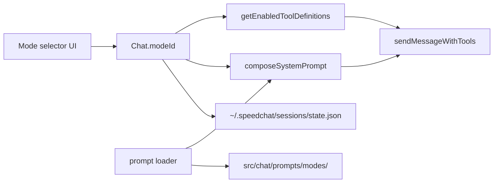

# Step 05 — Operating modes (Build / Plan / Orchestrate / Research)

**Step ID:** `05`  
**Title:** Operating modes + MODE_TEMPLATE pack  
**Backlog:** [`documentation/plans/to-fix.md`](../to-fix.md) item 7  
**Roadmap:** [`documentation/plans/to-fix-step-order.md`](../to-fix-step-order.md) — Wave 3, Step 05  
**Depends on:** **Step 04** (prompt loader + `composeSystemPrompt` + Full/Lite profile resolution). **Step 02** required for disk-backed sessions (`sessions/state.json`). Step 05 must not re-implement Step 04’s composer — only consume it.

**Out of scope (later steps):** Expert dropdown (Step 06), Work Agents (Step 08), full settings page mode editor (Step 20), sub-agent orchestration (Step 09).

---

## Goal

Ship four **primary operating modes** that change how the assistant behaves on each send:

| Mode id | User-facing label | Intent (OpenCode-aligned) |
|---------|-------------------|---------------------------|
| `build` | Build | Default dev mode — implement, edit, run tools freely |
| `plan` | Plan | Analyze and plan **without** destructive edits (restricted tools) |
| `orchestrate` | Orchestrate | Coordinate multi-step work; delegate; prefer structure over raw coding |
| `research` | Research | Read/search/gather; minimal writes; web + read tools emphasized |

Each mode is backed by shipped prompt files (`full` + `lite` bodies), optional **tool policy** metadata, UI selection **near the composer** (not top bar), and **`modeId` persistence** on each chat in `~/.speedchat/sessions/state.json` (Step 02).

User may replace stub copy later; **template pack + working stubs ship in-repo** so the step is never blocked on copy.

---

## OpenCode references (read before implementing)

| Source | Use for |
|--------|---------|
| [OpenCode — Agents](https://opencode.ai/docs/agents/) | Primary vs subagent; **Build** (full tools) vs **Plan** (`edit`/`bash` deny or ask); Tab/cycle UX |
| [OpenCode — Permissions](https://opencode.ai/docs/permissions/) | Mapping `permission.edit` / `permission.bash` → SpeedChat tool allow/deny/ask |
| [oh-my-opencode-slim](https://github.com/alvinunreal/oh-my-opencode-slim) | Lite prompt trimming patterns (short rules, drop examples) |
| Workspace uploads (when present) | `uploads/opencode-1.md` — local notes from prior research |
| Step 04 `_example` pack | Front matter schema, `fullBody` / `liteBody`, interpolation tokens |

### What SpeedChat adopts vs diverges

| OpenCode | SpeedChat (this step) |
|----------|------------------------|
| Primary agents **Build** / **Plan** with permission JSON | Four modes: Build, Plan, **Orchestrate**, **Research** (product-specific) |
| `permission.edit` / `permission.bash` | `ModeToolPolicy` on each mode file → filter `getEnabledToolDefinitions()` |
| Tab to cycle primary agents | **Segmented control** above composer (mouse + keyboard); no Tab hijack |
| Agent prompt `{file:./prompts/...}` | `src/chat/prompts/modes/<id>.{full,lite}.md` + user overrides in `~/.speedchat/prompts/modes/` |
| Session stores active agent | `Chat.modeId` persisted in session JSON under `~/.speedchat/sessions/` |

**Orchestrate** and **Research** are SpeedChat extensions (not OpenCode built-in primaries). Model their prompts after OpenCode’s **General** (broad tools) and **Explore/Scout** (read-heavy) subagent descriptions respectively.

---

## Prerequisites checklist (blockers)

Before starting Step 05 implementation, confirm Step 04 delivers:

- [ ] `src/chat/prompts/prompt-loader.ts` — glob load built-in + `~/.speedchat/prompts/` overrides
- [ ] `src/chat/prompts/prompt-composer.ts` — `composeSystemPrompt(ctx)` with part `mode`
- [ ] Profile resolution: `full` \| `lite` \| `custom` picks correct body per prompt file
- [ ] `BuildPromptContext` includes at least: `modeId`, `profile`, `cwd`, `enabledToolsSummary`
- [ ] Send path in [`src/tools/loop.ts`](../../../src/tools/loop.ts) calls composer instead of raw `#systemPrompt` textarea only (textarea may remain as `info` part override until Step 20)

If Step 02 is incomplete, persist `modeId` on each `Chat` in **`localStorage`** (`speedchat-sessions-v1`) until `GET/PUT /api/config/sessions` exists. **Do not** introduce per-chat files under `~/.speedchat/sessions/` — canonical storage is Step 02’s **`sessions/state.json`** blob only.

---

## Architecture



### Mode registry

**New module:** `src/chat/modes/registry.ts`

```ts
/** Stable ids — do not rename without migration. */
export type ModeId = 'build' | 'plan' | 'orchestrate' | 'research';

export const DEFAULT_MODE_ID: ModeId = 'build';

export interface ModeDefinition {
  id: ModeId;
  label: string;
  description: string;
  /** Prompt file id (usually same as ModeId). */
  promptId: ModeId;
  toolPolicy: ModeToolPolicy;
}

export type ToolPolicyAction = 'allow' | 'deny' | 'ask';

/** Wildcard keys match tool function names from definitions.ts */
export interface ModeToolPolicy {
  /** Default for tools not listed. */
  default: ToolPolicyAction;
  /** Per-tool overrides, e.g. execute_command: deny */
  tools?: Record<string, ToolPolicyAction>;
}
```

- `listModes(): ModeDefinition[]` — fixed four entries; order: Build, Plan, Orchestrate, Research.
- `getMode(id: ModeId): ModeDefinition`
- `resolveModePromptPath(id: ModeId, profile: 'full' | 'lite'): string` — logical path for tests (see [Prompt file resolution](#prompt-file-resolution)).

### Session / chat schema

Extend [`Chat`](../../../src/types.ts):

```ts
export interface Chat {
  // ...existing fields
  /** Operating mode for prompt + tool policy; default build. */
  modeId?: ModeId;
}
```

**Persistence (canonical — matches Step 02):**

All chats (including `modeId`) live inside **`~/.speedchat/sessions/state.json`** — the same `SessionState` blob migrated from `speedchat-sessions-v1`. There are **no** per-chat JSON files and **no** `GET/PUT /api/sessions/:id` routes in Steps 02 or 05.

Add to each chat object in the existing `chats[]` array:

```json
{
  "id": "11111111-1111-1111-1111-111111111111",
  "name": "New chat",
  "modelId": "model-id",
  "modeId": "build",
  "history": [],
  "updatedAt": 1710000000000
}
```

- **Default:** missing `modeId` → `build` in `ensureChatShape`.
- **Migration:** when importing `speedchat-sessions-v1` from localStorage, set `modeId: 'build'` on every chat.
- **Save:** any mode change calls `scheduleSaveSessions()` → `PUT /api/config/sessions` (Step 02) immediately.

### Prompt file resolution

**Built-in layout:**

```
src/chat/prompts/modes/
  _template/
    MODE_TEMPLATE.md
    README.md
    build.full.md
    build.lite.md
    plan.full.md
    plan.lite.md
    orchestrate.full.md
    orchestrate.lite.md
    research.full.md
    research.lite.md
  build.full.md          # symlinks or duplicate stubs — prefer real files at modes/ root for glob simplicity
  build.lite.md
  ...
```

**Recommended loader rule (implement with Step 04 loader):**

1. Resolve `modes/{id}.{profile}.md` where `profile` is `full` or `lite`.
2. Else resolve `modes/{id}.md` and use front-matter `fullBody` / `liteBody`.
3. User override: `~/.speedchat/prompts/modes/{id}.{profile}.md` wins over built-in.

**Front matter (required on each stub):**

```yaml
---
id: build
kind: mode
label: Build
version: 1
description: Full development mode with broad tool access.
profileBodies: split   # split | single  (split = separate .full/.lite files)
toolPolicy:
  default: allow
  tools:
    execute_command: allow
---
```

Body markdown follows the front matter (or lives only in split files).

### Composer integration

In `composeSystemPrompt`:

1. If `parts.mode.enabled === false` (Custom config), skip mode fragment.
2. Else `loadPrompt('mode', ctx.modeId, ctx.profile)` → inject as **`mode`** part after `base`, before `expert` (per Step 04 order).
3. Pass `{{mode}}`, `{{mode_label}}`, `{{cwd}}`, `{{enabled_tools}}` interpolations documented in `MODE_TEMPLATE.md`.

**Send path** ([`src/tools/loop.ts`](../../../src/tools/loop.ts)):

```ts
const modeId = getActiveChat().modeId ?? DEFAULT_MODE_ID;
const sysPrompt = composeSystemPrompt({ modeId, profile: getActivePromptProfile(), ... });
const tools = getEnabledToolDefinitionsForMode(modeId);
```

Do **not** read mode from DOM at send time except as a cache of `Chat.modeId` (DOM should reflect chat state).

### Tool policy enforcement

**New:** `src/chat/modes/tool-policy.ts`

- `filterToolsByMode(defs: ToolDefinition[], modeId: ModeId): ToolDefinition[]`
- Map OpenCode-style restrictions to SpeedChat tool ids:

| Mode | Suggested policy (v1) |
|------|------------------------|
| **build** | `default: allow` (subject to user Settings toggles) |
| **plan** | `deny`: `execute_command`, `run_javascript`, `run_python`, `save_file`, `append_file`, `insert_at_line`, `replace_text_in_file`, `delete_path`, `move_file`, `git_commit`, `git_add`, `git_checkout`; `allow`: read/search/git_status/git_diff/git_log/list_directory/read_file/… |
| **orchestrate** | `allow` all; prompt stresses delegation, task breakdown, sub-agent hooks (Step 09 will extend) |
| **research** | `deny` mutating file/git/shell tools; `allow` web + read + search tools |

**`ask` action:** v1 may treat `ask` as `deny` for API (model cannot call tool) **or** leave enabled but document “approval UI” as Step 20. Prefer **deny at API** for Plan/Research in v1 to match OpenCode Plan safety.

Apply filter **after** user tool toggles in [`src/tools/config.ts`](../../../src/tools/config.ts) and server ping gating.

---

## UI — mode selector near chat

**Placement:** Inside [`.input-bar-composer`](../../../index.html), **above** `#attachPreview` / `.input-row` — a horizontal strip “chat controls”, not in [`topbar`](../../../index.html).

**Markup sketch** (add to `index.html`):

```html
<div class="composer-controls" role="toolbar" aria-label="Chat mode">
  <div id="modeSelector" class="mode-segmented" role="radiogroup" aria-label="Operating mode">
    <!-- buttons injected by initModeSelector() or static four buttons -->
  </div>
</div>
```

**Behavior:**

- Four segments: Build | Plan | Orchestrate | Research.
- `aria-pressed` / `role="radio"` on active segment.
- Click → set `getActiveChat().modeId`, `scheduleSaveSessions()`, optional status pill “Mode: Plan”.
- Switching mode does **not** clear history.
- Disabled while `streaming` (reuse [`app-state.ts`](../../../src/app-state.ts)).
- Keyboard: ArrowLeft/ArrowRight move selection when focus in group.

**Styles:** `src/styles/mode-selector.css` imported from [`src/main.ts`](../../../src/main.ts) — match segmented control tokens from [`tokens.css`](../../../src/styles/tokens.css); compact height (~28–32px) so composer growth is minimal.

**Out of scope:** Top-bar mode toggle (Step 20), per-mode model override (Step 08).

---

## Deliverable — MODE_TEMPLATE pack

**Directory:** [`src/chat/prompts/modes/_template/`](../../../src/chat/prompts/modes/_template/)

| File | Purpose |
|------|---------|
| `MODE_TEMPLATE.md` | Commented reference: metadata, goals, tool policy, output format, anti-patterns, interpolation table, Full vs Lite guidance |
| `README.md` | How to add a mode, wire registry, run tests |
| `build.full.md` / `build.lite.md` | Working Build stubs |
| `plan.full.md` / `plan.lite.md` | Working Plan stubs |
| `orchestrate.full.md` / `orchestrate.lite.md` | Working Orchestrate stubs |
| `research.full.md` / `research.lite.md` | Working Research stubs |

Also copy (or re-export) the four mode pairs to `src/chat/prompts/modes/*.md` at the parent level so the loader glob finds them without special-casing `_template/`.

### `MODE_TEMPLATE.md` required sections

1. **Front matter reference** — all keys with examples.
2. **Role** — one paragraph persona.
3. **Goals** — bullet list for the mode.
4. **Tool policy** — mirror YAML `toolPolicy`; explain how it connects to `filterToolsByMode`.
5. **Output format** — markdown/code/plan structure expectations.
6. **Anti-patterns** — what this mode must not do.
7. **Interpolation tokens** — table: `{{mode}}`, `{{mode_label}}`, `{{cwd}}`, `{{enabled_tools}}`, `{{profile}}`.
8. **Lite trimming rules** — max ~40% of full length; no examples in lite; imperative bullets only.

### Lite stub content guidelines

- **build.lite:** “Implement changes; use tools; run tests when relevant.”
- **plan.lite:** “Do not edit files or run shell; output plans and file paths only.”
- **orchestrate.lite:** “Break work into steps; specify owners/tools per step; no drive-by refactors.”
- **research.lite:** “Read-only; cite sources; use web/search tools; no writes.”

Each lite file **must be &lt; 600 characters** body (excluding front matter) for CI assertion.

---

## Implementation todos

### Phase A — Types and registry

- [ ] **A1** Add `ModeId`, `ModeDefinition`, `ModeToolPolicy` in `src/chat/modes/types.ts` (or `registry.ts`).
- [ ] **A2** Implement `src/chat/modes/registry.ts` with four modes and default policies.
- [ ] **A3** Extend `Chat` in `src/types.ts` with optional `modeId`; update `ensureChatShape` / `createEmptyChatObject` default `build`.
- [ ] **A4** Session persistence: ensure `modeId` saved/loaded from `~/.speedchat/sessions/` (or localStorage bridge until Step 02).

### Phase B — Prompt pack

- [ ] **B1** Create `src/chat/prompts/modes/_template/MODE_TEMPLATE.md` (full commented template).
- [ ] **B2** Create `src/chat/prompts/modes/_template/README.md`.
- [ ] **B3** Add eight stub files under `_template/` (four modes × full/lite).
- [ ] **B4** Add production copies at `src/chat/prompts/modes/{id}.full.md` and `.lite.md` (or equivalent per Step 04 loader).
- [ ] **B5** Register prompts with `kind: mode` front matter; verify loader returns correct body for `full` and `lite`.

### Phase C — Tool policy

- [ ] **C1** Implement `src/chat/modes/tool-policy.ts` + unit tests.
- [ ] **C2** Add `getEnabledToolDefinitionsForMode(modeId)` in `src/tools/client.ts` (or wrap existing getter).
- [ ] **C3** Wire filtered tools into `sendMessageWithTools` request payload.

### Phase D — Composer and send path

- [ ] **D1** Pass `modeId` from `getActiveChat()` into `composeSystemPrompt`.
- [ ] **D2** Ensure `mode` part disabled in Custom config skips fragment (integration test with Step 04).
- [ ] **D3** Remove assumption that `#systemPrompt` textarea is the only system text (keep as `info`/`base` override per Step 04).

### Phase E — UI

- [ ] **E1** Add composer mode selector markup to `index.html`.
- [ ] **E2** Implement `src/ui/mode-selector.ts`: render, sync from active chat, handle change.
- [ ] **E3** Add `src/styles/mode-selector.css`; import in `main.ts`.
- [ ] **E4** Call `initModeSelector()` from `initApp()` after `loadSessionsFromStorage` + `renderChatFromHistory`.
- [ ] **E5** On `switchChat`, update selector to new chat’s `modeId`.
- [ ] **E6** Accessibility: radiogroup labels, disabled state while streaming.

### Phase F — Docs and verification artifact

- [ ] **F1** Update [`documentation/context.md`](../../context.md) — modes, paths, persistence, tool policy summary.
- [ ] **F2** Create `documentation/plans/verification/step-05.md` with commands and expected output.
- [ ] **F3** Add `documentation/plans/references/mode-sources.md` — OpenCode mapping table (short).

---

## Tests

**Test runner:** Add `npm test` in Step 02+ or use `npx tsx` scripts. Until then, place tests under `test/modes/` and run via `npx tsx test/modes/run-all.mts`.

### Unit — prompt resolution (`test/modes/resolve-mode-prompt.test.mts`)

Use **fixed** mode ids and **static** expected path suffixes (no dynamic path building in assertions).

| Test case | Input | Expected |
|-----------|--------|----------|
| build full | `resolveModePromptPath('build', 'full')` | ends with `modes/build.full.md` |
| build lite | `resolveModePromptPath('build', 'lite')` | ends with `modes/build.lite.md` |
| plan full | `resolveModePromptPath('plan', 'full')` | ends with `modes/plan.full.md` |
| plan lite | `resolveModePromptPath('plan', 'lite')` | ends with `modes/plan.lite.md` |
| orchestrate full | `resolveModePromptPath('orchestrate', 'full')` | ends with `modes/orchestrate.full.md` |
| orchestrate lite | `resolveModePromptPath('orchestrate', 'lite')` | ends with `modes/orchestrate.lite.md` |
| research full | `resolveModePromptPath('research', 'full')` | ends with `modes/research.full.md` |
| research lite | `resolveModePromptPath('research', 'lite')` | ends with `modes/research.lite.md` |

**Loader integration** (`loadModePromptBody(id, profile)`):

- [ ] For each `ModeId`, loaded body is **non-empty** string.
- [ ] `build` full body **contains** a stable marker string e.g. `MODE: build` (embed in stubs).
- [ ] `plan` full body **contains** `do not modify` or equivalent plan-only phrase.
- [ ] `build` lite length **&lt;** `build` full length (character count).
- [ ] Override fixture: place temp file in `~/.speedchat/prompts/modes/build.full.md` with `OVERRIDE_MARKER` → loader prefers override.

### Unit — tool policy (`test/modes/tool-policy.test.mts`)

- [ ] `plan` + `execute_command` → excluded from filtered list.
- [ ] `build` + `execute_command` → included (when user-enabled).
- [ ] `research` + `save_file` → excluded.
- [ ] `research` + `web_search` → included (when user-enabled).

### Unit — composer (`test/modes/compose-mode.test.mts`)

Fixture context with fixed UUID chat id `11111111-1111-1111-1111-111111111111`:

- [ ] `composeSystemPrompt({ modeId: 'plan', profile: 'full', ... })` contains `MODE: plan` marker.
- [ ] Switching `modeId` from `build` to `research` changes composed string (static snapshot optional; prefer substring markers).
- [ ] `profile: 'lite'` uses lite file (shorter; contains `LITE` marker in stubs).

### Unit — chat shape (`test/modes/chat-mode-persist.test.mts`)

- [ ] `ensureChatShape({})` → `modeId === 'build'`.
- [ ] Round-trip JSON `{ modeId: 'orchestrate', ... }` preserves `orchestrate`.

### Integration (optional, `npm start` required)

- [ ] `scripts/step-05-smoke.mjs` — `GET` session API, `PUT` modeId `plan`, reload, assert `plan`.
- [ ] Manual: selector visible above composer; switch chat restores mode; Plan send omits `execute_command` from tools in network tab.

### Stub markers for deterministic tests

Embed in every shipped stub (full):

```markdown
<!-- SPEEDCHAT_MODE_MARKER: build full -->
```

Lite:

```markdown
<!-- SPEEDCHAT_MODE_MARKER: build lite -->
```

Tests grep for `SPEEDCHAT_MODE_MARKER: {id} {profile}`.

---

## Verification workflow (implementer → verifier)

| Role | Actions |
|------|---------|
| **Implementer** | Complete all Phase A–F todos; run `npx tsx test/modes/run-all.mts`; update context.md; write `documentation/plans/verification/step-05.md` |
| **Verifier** | Clean tree; re-run tests; manual checklist: selector placement, persistence across reload, Plan restricts tools; PASS/FAIL report |

**Acceptance criteria (verifier):**

1. All eight `resolveModePromptPath` cases pass.
2. Each mode id loads distinct full/lite bodies with markers.
3. Mode selector is in composer area, not top bar.
4. `modeId` persists per chat under `~/.speedchat/sessions/` (or documented fallback).
5. `composeSystemPrompt` includes mode fragment when part enabled.
6. Plan mode filters destructive tools from API request.

---

## Files to create or touch (summary)

| Action | Path |
|--------|------|
| Create | `src/chat/modes/registry.ts`, `tool-policy.ts`, `types.ts` |
| Create | `src/chat/prompts/modes/_template/*` (11 files) |
| Create | `src/chat/prompts/modes/*.{full,lite}.md` (8 files at parent) |
| Create | `src/ui/mode-selector.ts`, `src/styles/mode-selector.css` |
| Create | `test/modes/*.mts`, `test/modes/run-all.mts` |
| Create | `documentation/plans/verification/step-05.md` |
| Create | `documentation/plans/references/mode-sources.md` |
| Edit | `src/types.ts`, `src/state/sessions.ts`, `index.html`, `src/main.ts`, `src/tools/loop.ts`, `src/tools/client.ts` |
| Edit | `documentation/context.md` |

---

## Manual QA checklist

1. New chat defaults to **Build**; selector shows Build active.
2. Switch to **Plan** → send message → network request tool list excludes `execute_command` (and other denied ids).
3. Switch to **Research** → web/read tools still available if enabled in Settings.
4. Create second chat, set **Orchestrate**, switch back to first chat → mode restores **Build** (or previous).
5. Reload app (`npm start`) → modes persist per chat.
6. **Lite** profile (when Step 04 profile toggle available): composed prompt noticeably shorter; mode marker still present.
7. Streaming: mode selector disabled during generation.
8. Screen reader: mode group announces “Operating mode, Build, selected, 1 of 4”.

---

## Risk notes

| Risk | Mitigation |
|------|------------|
| Step 04 loader API unstable | Define narrow `loadModePromptBody(id, profile)` adapter; mock in tests |
| Step 02 sessions not ready | Bridge `modeId` in localStorage `Chat` + document debt |
| Plan mode too strict/loose | Policy table in `registry.ts` single source; tune without prompt edits |
| Composer + textarea duplication | Step 04 owns merge order; mode replaces hardcoded preset text for `mode` part only |

---

## Sub-agent handoff (copy-paste)

**Implementer:** Implement Step 05 per this plan. Read [`documentation/context.md`](../../context.md), Step 04 composer/loader, OpenCode Agents doc. Ship MODE_TEMPLATE pack + four modes. Tests must cover **each mode id → correct full/lite file**. Do not implement experts or settings page.

**Verifier:** Run `npx tsx test/modes/run-all.mts`, follow `documentation/plans/verification/step-05.md`, execute manual QA § above. Report PASS/FAIL only.

---

## Plan todos (meta)

- [x] Author Step 05 implementation build plan
- [ ] Implementer: execute Phase A–F
- [ ] Verifier: sign off Step 05
