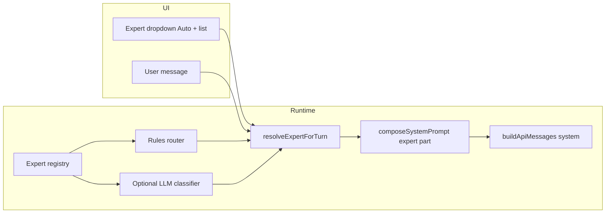

# Step 06 — Expert system (auto + manual)

| Field | Value |
|-------|--------|
| **Step ID** | `06` |
| **Title** | Expert auto-assign + manual dropdown |
| **Backlog** | [`to-fix.md`](../to-fix.md) item **8** (programmatic expert prompts from user input) |
| **Depends on** | **Step 04** (prompt loader + `prompt-composer.ts` + `expert` part) — **required** |
| **Recommended** | **Step 05** (operating modes) — expert layer composes **after** `mode` |
| **Blocks** | Step 08 (Work Agents, optional expert routing), Step 20 (settings + topbar duplicate) |
| **Out of scope (this step)** | Full settings page expert editor (Step 20), topbar expert pill (Step 20), LLM classifier **required** on day one (ship rules-first; LLM is opt-in via config) |

---

## 1. Goal

Ship a **domain expert** layer: named persona prompts under `src/chat/prompts/experts/` that the runtime can attach to the system prompt via Step 04’s composer (`part: expert`).

Users choose behavior in the **composer strip** (near chat, not top bar):

- **Auto** — router picks an expert from the latest user message (rules by default; optional small-model classifier).
- **Manual** — user picks a specific expert from a dropdown; that choice **wins over Auto** until they switch back to Auto.

The send path must call `resolveExpertForTurn(...)` before `composeSystemPrompt(...)` so `buildApiMessages` receives the composed system string (Step 04 wiring), not only the legacy `#systemPrompt` textarea.

---

## 2. Read first (implementer)

| Resource | Why |
|----------|-----|
| [`documentation/context.md`](../../context.md) | Send path, sessions, tool loop |
| [`documentation/plans/to-fix-step-order.md`](../to-fix-step-order.md) | Wave 3 composition order, Step 04/05/06 notes |
| [`documentation/plans/Build out/step-04-programmatic-prompts.md`](step-04-programmatic-prompts.md) | `composeSystemPrompt`, part ids, dual-root prompts |
| [`documentation/plans/Build out/step-05-operating-modes.md`](step-05-operating-modes.md) | `chat.modeId`, composer strip patterns |
| [`src/tools/loop.ts`](../../../src/tools/loop.ts) | `sendMessageWithTools`, `buildApiMessages` |
| [`src/chat/messaging.ts`](../../../src/chat/messaging.ts) | Send entry |
| [`src/ui/settings.ts`](../../../src/ui/settings.ts) | Legacy system prompt presets (do not break) |
| [`index.html`](../../../index.html) | Composer markup |
| [`src/styles/input.css`](../../../src/styles/input.css) | Composer layout |

---

## 3. Architecture overview



**Composition position (Step 04):**  
`base` → `mode` → **`expert`** → `work-agent` → `tool-usage` → `info` → `skill` → `memory`

**When `expert` part is omitted:**

- Global feature flag `experts.enabled === false`
- Custom profile has `parts.expert.enabled === false`
- Selection is **Auto** and router returns **no match** (confidence below threshold, no keyword hits)
- Resolved expert file missing or failed validation

---

## 4. Expert prompt files

### 4.1 Dual-root (same as Step 04)

| Root | Path |
|------|------|
| Built-in | `src/chat/prompts/experts/<id>/` |
| User override | `~/.speedchat/prompts/experts/<id>/` (wins on same `id`) |

Each expert is a **folder** with at least:

| File | Purpose |
|------|---------|
| `expert.full.md` | Full profile body |
| `expert.lite.md` | Lite profile body (shorter; required for Lite profile) |
| `meta.json` | Machine-readable routing + labels (optional if front matter only; pick **one** convention and document in `_template`) |

**Recommended:** YAML front matter on `expert.full.md` (Step 04 loader already parses front matter).

### 4.2 Expert metadata schema (`ExpertMeta`)

```json
{
  "$schema": "https://speedchat.local/schemas/expert-meta.json",
  "type": "object",
  "required": ["id", "label", "kind", "version"],
  "properties": {
    "id": { "type": "string", "pattern": "^[a-z0-9][a-z0-9-]*$" },
    "label": { "type": "string" },
    "kind": { "const": "expert" },
    "version": { "type": "string" },
    "description": { "type": "string" },
    "priority": { "type": "integer", "default": 0 },
    "triggers": {
      "type": "object",
      "properties": {
        "keywords": { "type": "array", "items": { "type": "string" } },
        "regex": { "type": "array", "items": { "type": "string" } },
        "negativeKeywords": { "type": "array", "items": { "type": "string" } }
      }
    },
    "classifierHint": {
      "type": "string",
      "description": "One-line description for optional LLM classifier prompt"
    },
    "default": { "type": "boolean", "description": "Fallback when Auto has no strong match" }
  }
}
```

**Example front matter** (`src/chat/prompts/experts/software-engineer/expert.full.md`):

```yaml
---
id: software-engineer
label: Software engineer
kind: expert
version: "1"
description: Implementation, debugging, refactors, APIs
priority: 10
triggers:
  keywords: [code, bug, refactor, typescript, python, api, compile, test, git]
  negativeKeywords: [recipe, poem, marketing]
classifierHint: User needs help writing or fixing software.
---
You are a senior software engineer. Prefer minimal, working code...
```

### 4.3 Template pack (required deliverable)

Add `src/chat/prompts/experts/_template/`:

| File | Purpose |
|------|---------|
| `EXPERT_TEMPLATE.md` | Commented reference: metadata, triggers, full/lite bodies, anti-patterns |
| `README.md` | How to add an expert; how Auto vs manual works; override path |
| `example.full.md` / `example.lite.md` | Copy-paste starter (not registered in production registry — prefix `_` or `kind: template`) |

### 4.4 Shipped default experts (minimum set)

Implementer ships **at least** these built-in ids (full + lite bodies):

| `id` | Label | Routing focus |
|------|-------|----------------|
| `general` | General | `default: true`, weak keyword set |
| `software-engineer` | Software engineer | Code, debug, stack traces |
| `technical-writer` | Technical writer | Docs, README, explain clearly |
| `data-analyst` | Data analyst | SQL, CSV, charts, metrics |
| `creative-writer` | Creative writer | Prose, story, tone (non-code) |
| `security-reviewer` | Security reviewer | vuln, OWASP, threat, auth |

User can add more under `~/.speedchat/prompts/experts/` without code changes.

---

## 5. Modules to add

| Module | Responsibility |
|--------|----------------|
| [`src/chat/experts/types.ts`](../../../src/chat/experts/types.ts) | `ExpertMeta`, `ExpertRecord`, `ExpertSelection`, `ExpertRouteResult` |
| [`src/chat/experts/registry.ts`](../../../src/chat/experts/registry.ts) | Scan built-in + user dirs; merge; cache; `listExperts()`, `getExpert(id)` |
| [`src/chat/experts/rules-router.ts`](../../../src/chat/experts/rules-router.ts) | Keyword/regex scoring; negative keywords; priority tie-break |
| [`src/chat/experts/llm-classifier.ts`](../../../src/chat/experts/llm-classifier.ts) | Optional non-streaming classify; strict JSON `{"expertId":"..."}` |
| [`src/chat/experts/resolve.ts`](../../../src/chat/experts/resolve.ts) | `resolveExpertForTurn(ctx)` — manual vs auto orchestration |
| [`src/ui/expert-select.ts`](../../../src/ui/expert-select.ts) | Dropdown UI, persistence hooks, `onExpertSelectChange` |
| [`src/styles/composer-controls.css`](../../../src/styles/composer-controls.css) | Strip above input: mode + expert selects (shared with Step 05) |

**Public API (for tests and loop):**

```ts
export type ExpertSelectionMode = 'auto' | 'manual';

export interface ExpertSelection {
  mode: ExpertSelectionMode;
  /** Set when mode === 'manual'; ignored for routing when mode === 'auto' */
  expertId: string | null;
}

export interface ExpertRouteResult {
  expertId: string | null;
  source: 'manual' | 'rules' | 'llm' | 'default' | 'none';
  confidence: number; // 0..1 for rules/llm; 1 for manual
  label?: string;
}

export function resolveExpertForTurn(input: {
  selection: ExpertSelection;
  userText: string;
  registry: ExpertRecord[];
  config: ExpertsConfig;
}): ExpertRouteResult;
```

---

## 6. Routing behavior

### 6.1 Manual selection

- Dropdown value `auto` → `selection.mode = 'auto'`.
- Any other option → `mode = 'manual'`, `expertId = <id>`.
- Manual **always** returns that id if it exists in registry; if id deleted, fall back to `general` or `none` + status toast.

### 6.2 Auto — rules router (default, no extra model call)

1. Normalize user text (lowercase, collapse whitespace).
2. For each expert, score:
   - `+2` per keyword substring match (whole-word optional config flag)
   - `+5` per regex match (cap 3 regexes per expert for perf)
   - `-10` if any `negativeKeywords` match
3. Add `priority` to score.
4. Pick highest score; require `score >= minScore` (default **3**).
5. If tie, higher `priority`, then stable sort by `id`.
6. If no winner: use expert with `default: true` (`general`) at `confidence: 0.5`, `source: 'default'`.
7. If `experts.autoOmitWhenNoMatch` is true and no winner and no default → `expertId: null`, `source: 'none'`.

Expose `minScore` and `preferDefaultOverOmit` in `~/.speedchat/config.json` (see §8).

### 6.3 Auto — optional LLM classifier

**Gate:** `experts.classifier === 'llm'` and rules confidence `< experts.llmFallbackBelow`.

- Single non-streaming completion to configured **classifier model** (see §8).
- System: list `id` + `classifierHint` only; user: truncated user message (max 2k chars).
- Response must parse as JSON `{ "expertId": "software-engineer" }`; invalid → fall back to rules result.
- **Never block send** on classifier failure; log and use rules/default.
- Classifier runs **in parallel** with user-visible send only if implementer can meet &lt;150ms budget; otherwise run rules synchronously and skip LLM for that turn (document choice in `context.md`).

### 6.4 Per-turn vs per-session

| State | Storage |
|-------|---------|
| `expertSelection` | Per **chat** in session blob (`Chat.expertSelection`) |
| Last auto-resolved id (debug) | Optional `Chat.lastResolvedExpertId` for UI subtitle |

**Re-resolve on every send** when mode is `auto` (user message may change domain). Manual stays fixed until user changes dropdown.

---

## 7. UI — composer dropdown

### 7.1 Placement

Add a **composer control strip** directly above `.input-bar-composer` (inside `.input-bar` column or immediately above `.input-bar`):

```html
<div class="composer-controls" id="composerControls">
  <!-- Step 05: #modeSelect -->
  <div class="composer-control">
    <label class="visually-hidden" for="expertSelect">Expert</label>
    <select id="expertSelect" aria-label="Expert"></select>
  </div>
</div>
```

Options:

1. `Auto` (value `auto`)
2. Separator (disabled option) optional
3. One `<option>` per registered expert (`value="{id}"`)

Show compact label in closed select: `Expert: Auto` or `Expert: Software engineer`.

When Auto resolves on send, optional subtle hint next to select: `→ Software engineer` (`#expertAutoHint`, `aria-live="polite"`, clears on next manual change).

### 7.2 Styles

- [`src/styles/composer-controls.css`](../../../src/styles/composer-controls.css) — flex row, wrap on narrow screens, match `--border` / `--radius-md`.
- Import from [`src/main.ts`](../../../src/main.ts).
- Mobile: full-width selects stacked (reuse Step 05 responsive rules).

### 7.3 Bootstrap

In `initApp()` after sessions + prompt composer init:

1. `await loadExpertRegistry()` (or sync scan)
2. `fillExpertSelect()`
3. `syncExpertSelectForActiveChat()`
4. `registerExpertHandlers()`

On `switchChat` / `renderSidebar` active change: `syncExpertSelectForActiveChat()`.

### 7.4 Legacy system prompt textarea

- **Do not remove** `#systemPrompt` in settings drawer in this step.
- Composed prompt = Step 04 layers; drawer textarea maps to `info` part or legacy override per Step 04 spec.
- Document: expert layer is **additive**; users disabling experts globally still get base/mode/tools.

---

## 8. Configuration (`~/.speedchat/config.json`)

Extend config schema (Step 02):

```json
{
  "experts": {
    "enabled": true,
    "classifier": "rules",
    "llmFallbackBelow": 0.55,
    "rulesMinScore": 3,
    "autoOmitWhenNoMatch": false,
    "classifierModel": {
      "providerId": "lm-studio",
      "modelId": ""
    }
  }
}
```

| Key | Default | Meaning |
|-----|---------|---------|
| `enabled` | `true` | Master switch; when false, hide dropdown and skip expert part |
| `classifier` | `"rules"` | `"rules"` \| `"llm"` \| `"rules+llm"` |
| `llmFallbackBelow` | `0.55` | Run LLM when rules confidence below this |
| `rulesMinScore` | `3` | Minimum rules score to win |
| `autoOmitWhenNoMatch` | `false` | If true, omit expert part instead of `general` default |
| `classifierModel` | active chat model | Dedicated small model for classification |

**Session field** (add to `Chat` in [`src/types.ts`](../../../src/types.ts)):

```ts
export interface ExpertSelection {
  mode: 'auto' | 'manual';
  expertId: string | null;
}

export interface Chat {
  // ...existing fields
  expertSelection?: ExpertSelection;
  lastResolvedExpertId?: string | null;
}
```

Migration: missing `expertSelection` → `{ mode: 'auto', expertId: null }`.

---

## 9. Integration with prompt composer (Step 04)

In [`src/tools/loop.ts`](../../../src/tools/loop.ts) `sendMessageWithTools`:

**Before:**

```ts
const sysPrompt = (document.getElementById('systemPrompt') as HTMLTextAreaElement).value.trim();
const messages = buildApiMessages(chat, sysPrompt, { ... });
```

**After:**

```ts
const route = resolveExpertForTurn({ selection: getExpertSelection(chat), userText: text, ... });
if (selection.mode === 'auto') {
  chat.lastResolvedExpertId = route.expertId;
  updateExpertAutoHint(route);
}
const sysPrompt = await composeSystemPrompt({
  chat,
  expertId: route.expertId,
  userText: text,
  // modeId from Step 05, profile from config, etc.
});
const messages = buildApiMessages(chat, sysPrompt, { ... });
```

`composeSystemPrompt` loads expert body via `loadPromptPart('expert', expertId, profile)` — implement in Step 04; Step 06 only supplies `expertId`.

**Interpolation:** set `{{expert}}` to expert `label` in composer context object.

---

## 10. Settings (minimal this step)

Full expert editor deferred to **Step 20**. This step only needs:

- Optional drawer subsection **Experts** with:
  - Master enable checkbox (binds `experts.enabled`)
  - Link text: “Choose expert in the chat bar”
  - List read-only built-in ids (no inline edit yet)

Do **not** duplicate dropdown in drawer and composer long-term; drawer is config-only.

---

## 11. Tests

Add [`test/experts/`](../../../test/experts/) (or `test/experts.test.ts`) runnable with:

```bash
npx tsx --test test/experts/**/*.test.ts
```

Use **fixed strings** and **fixed expert fixtures** under `test/fixtures/experts/`.

### 11.1 Registry tests

| Test | Expected |
|------|----------|
| `listExperts merges builtin and user override` | User `software-engineer` overrides built-in label |
| `invalid meta skipped` | Expert without `kind: expert` not listed |
| `stable sort` | Sorted by `label` for dropdown |

### 11.2 Rules router tests (deterministic)

| Input | Selection | Expected `expertId` | `source` |
|-------|-----------|---------------------|----------|
| `"fix this TypeScript bug"` | auto | `software-engineer` | `rules` |
| `"write a poem about rain"` | auto | `creative-writer` | `rules` |
| `"hello"` | auto | `general` | `default` |
| `"SELECT * FROM users"` | auto | `data-analyst` | `rules` |
| any | manual `security-reviewer` | `security-reviewer` | `manual` |
| `"typescript"` + negative keyword fixture | auto | not `creative-writer` | `rules` |

### 11.3 Composer integration tests

| Test | Expected |
|------|----------|
| `expert part included when manual id set` | Composed system string contains fixture marker `[[EXPERT:software-engineer]]` |
| `expert part omitted when auto no match + autoOmitWhenNoMatch` | No expert marker |
| `experts.enabled false` | No expert marker regardless of selection |
| `lite profile uses expert.lite.md` | Shorter body than full |

### 11.4 LLM classifier tests (mocked)

- Mock `fetch` / chat API to return `{"expertId":"data-analyst"}`.
- Assert fallback to rules when JSON invalid or timeout.
- Assert classifier **not** called when rules confidence ≥ threshold.

### 11.5 UI smoke (optional script)

Extend or add `scripts/step06-expert-smoke.mjs`:

- DOM: `#expertSelect` exists, options length ≥ 7 (auto + 6 builtins).
- Change manual expert → next `composeSystemPrompt` call receives id (hook via `window.__speedchatDebug` in dev only).

---

## 12. Acceptance criteria

- [ ] Built-in experts live under `src/chat/prompts/experts/` with full + lite bodies and `_template` pack.
- [ ] Registry lists built-ins and merges `~/.speedchat/prompts/experts/`.
- [ ] Composer `#expertSelect` offers **Auto** + all experts; persists per chat.
- [ ] **Manual** selection forces that expert on every send until user selects Auto.
- [ ] **Auto** uses rules router; optional LLM behind config flag.
- [ ] `resolveExpertForTurn` wired into send path; `expert` part appears in composed system prompt (Step 04).
- [ ] `experts.enabled` master switch disables layer and hides control.
- [ ] Unit tests for registry, rules routing, composer inclusion pass via `npx tsx --test`.
- [ ] [`documentation/context.md`](../../context.md) updated (experts paths, config keys, UI).
- [ ] [`documentation/plans/verification/step-06.md`](../verification/step-06.md) with commands for verifier.

---

## 13. Verification workflow

| Role | Action |
|------|--------|
| **Implementer** | Complete todos below; run tests; write `verification/step-06.md`; update `context.md` |
| **Verifier** | Re-run test command; manual: Auto on code question → hint shows engineer; manual Security → security persona in system (debug log); toggle `experts.enabled` off → no expert strip |

---

## 14. Implementation todos

### Phase A — Types and registry

- [ ] **A1** Create `src/chat/experts/types.ts` with `ExpertMeta`, `ExpertRecord`, `ExpertSelection`, `ExpertRouteResult`, `ExpertsConfig`.
- [ ] **A2** Implement `registry.ts`: glob/scan `src/chat/prompts/experts/*/`, load `meta.json` or front matter, load full/lite bodies.
- [ ] **A3** Merge user overrides from `~/.speedchat/prompts/experts/` (Step 02 file API or fetch `/api/config/prompts/...`).
- [ ] **A4** Export `listExperts()`, `getExpert(id)`, `refreshExpertRegistry()` with in-memory cache + mtime invalidation.
- [ ] **A5** Add JSON schema file `documentation/schemas/expert-meta.json` (optional but recommended).

### Phase B — Routers

- [ ] **B1** Implement `rules-router.ts` with scoring, negatives, priority, `minScore`, default expert.
- [ ] **B2** Implement `resolve.ts` orchestrating manual vs auto vs config flags.
- [ ] **B3** Implement `llm-classifier.ts` (optional path) with strict JSON parse and timeout (2s).
- [ ] **B4** Wire `ExpertsConfig` from `~/.speedchat/config.json` with defaults when missing.

### Phase C — Default content

- [ ] **C1** Add `src/chat/prompts/experts/_template/` (`EXPERT_TEMPLATE.md`, `README.md`).
- [ ] **C2** Ship six built-in experts (§4.4) with `expert.full.md` + `expert.lite.md` each.
- [ ] **C3** Mark `general` as `default: true`; validate all ids unique.

### Phase D — Session and persistence

- [ ] **D1** Extend `Chat` in `src/types.ts` with `expertSelection`, `lastResolvedExpertId`.
- [ ] **D2** Migration in session load: default `expertSelection` for old chats.
- [ ] **D3** Persist on dropdown change + debounced session save (Step 02 path).

### Phase E — UI

- [ ] **E1** Add `#composerControls` + `#expertSelect` to `index.html` (coordinate strip with Step 05 `#modeSelect`).
- [ ] **E2** Create `src/ui/expert-select.ts`: fill options, sync active chat, change handler.
- [ ] **E3** Add `src/styles/composer-controls.css`; import in `main.ts`.
- [ ] **E4** Add `#expertAutoHint` element; update after send when Auto.
- [ ] **E5** Hide strip when `experts.enabled === false`.

### Phase F — Send path integration

- [ ] **F1** Replace raw `#systemPrompt` read in `loop.ts` with `composeSystemPrompt` + `resolveExpertForTurn`.
- [ ] **F2** Pass `expertId` into composer; ensure `parts.expert.enabled` respected.
- [ ] **F3** Set `{{expert}}` interpolation label in composer context.
- [ ] **F4** On missing expert file, `setStatus('err', ...)` and omit expert part (do not crash send).

### Phase G — Settings hook (minimal)

- [ ] **G1** Drawer checkbox: Experts enabled → updates config + UI visibility.
- [ ] **G2** Read-only list of expert ids in drawer (no editor).

### Phase H — Tests and docs

- [ ] **H1** Fixture experts under `test/fixtures/experts/` for edge cases.
- [ ] **H2** Registry unit tests.
- [ ] **H3** Rules router table tests (§11.2).
- [ ] **H4** Composer integration tests with mock `loadPromptPart`.
- [ ] **H5** LLM classifier tests with mocked fetch.
- [ ] **H6** Update `documentation/context.md` (experts section, config keys, composer UI).
- [ ] **H7** Create `documentation/plans/verification/step-06.md` with exact commands and expected output.

---

## 15. References

| Source | Use for |
|--------|---------|
| [to-fix.md](../to-fix.md) #8 | Product requirement |
| [to-fix-step-order.md](../to-fix-step-order.md) Step 06 | Dependencies and deliverables |
| [step-04-programmatic-prompts.md](step-04-programmatic-prompts.md) | `expert` part, composer, dual-root |
| [step-05-operating-modes.md](step-05-operating-modes.md) | Composer strip, `chat.modeId` |
| [system-prompts-and-models-of-ai-tools](https://github.com/x1xhlol/system-prompts-and-models-of-ai-tools) | Persona / role prompt patterns |
| [oh-my-opencode-slim](https://github.com/alvinunreal/oh-my-opencode-slim) | Lite expert bodies |
| [`src/constants.ts`](../../../src/constants.ts) `SYSTEM_PROMPT_PRESETS` | Inspiration only — experts are separate from drawer presets |

---

## 16. Sub-agent handoff (copy-paste)

**Implementer:** Step **06** — Experts. Backlog **#8**. Depends **04** (required), **05** (recommended). Build registry, rules router, optional LLM classifier, composer `#expertSelect`, wire `resolveExpertForTurn` → `composeSystemPrompt` in `loop.ts`. Ship `_template` + 6 built-in experts. Tests in `test/experts/`. Update `context.md`.

**Verifier:** Acceptance §12 + `documentation/plans/verification/step-06.md`. Re-run `npx tsx --test test/experts/**/*.test.ts`. FAIL → back to implementer; do not patch feature code.

---

*Plan version: 1.0 — aligns with [`to-fix-step-order.md`](../to-fix-step-order.md) Wave 3.*
