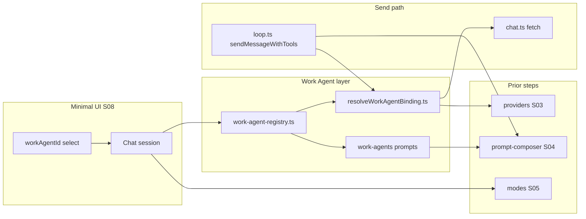

# Step 08 — Work Agents — Implementation Build Plan

| Field | Value |
|-------|--------|
| **Step ID** | `S08` |
| **Title** | Work Agents (OpenCode “lite” agents) |
| **Backlog** | [`to-fix.md`](../to-fix.md) items **10–12** |
| **Depends on** | **S03** (providers + auth), **S04** (prompt composer + `work-agent` part), **S05** (modes — routing hooks) |
| **Blocks** | **S09** (sub-agents), **S15** (UI Designer Work Agent profile) |
| **Optional** | **S06** (experts) — Work Agents compose alongside expert layer when present |
| **User input** | Final Work Agent prompt copy (stubs ship in-repo so step is not blocked) |
| **Settings UI** | **Minimal until S20** — data model + dev-only selector; full editor in S20 |

**Read first:** [`documentation/context.md`](../../context.md), [`to-fix-step-order.md`](../to-fix-step-order.md) (Step 08 section), OpenCode agent patterns ([anomalyco/opencode](https://github.com/anomalyco/opencode)), [oh-my-opencode-slim](https://github.com/alvinunreal/oh-my-opencode-slim) for token-efficient agent stubs.

---

## 1. Problem statement

Minnow today uses a single **global** system prompt (`#systemPrompt` textarea + `SYSTEM_PROMPT_PRESETS` in [`src/constants.ts`](../../../src/constants.ts)) and one **model** per chat (`chat.modelId` + `#modelSelect`). Backlog items 10–12 require **task-specific agents** (“Work Agents”) that each have:

1. Their own **system prompt** (shipped under `src/chat/prompts/work-agents/`, overridable in `~/.minnow/prompts/work-agents/`).
2. A default **provider + model** binding (from S03), used when that agent is active for a turn.
3. A way to **view and set** the prompt per agent (API + persistence now; rich UI in S20).

Work Agents are the foundation for **S09 sub-agents** (parent spawns children with isolated context) and specialized profiles like **UI Designer (S15)**.

---

## 2. Goals and non-goals

### In scope (S08)

- **Registry** of built-in Work Agents (discovered from disk + optional `registry.json` index).
- **Per-agent config:** `id`, `label`, `description`, `providerId`, `modelId`, `promptPath`, optional `toolPolicy`, optional `defaultForModes[]`.
- **Prompt loader** integration with S04 `composeSystemPrompt` → `work-agent` part.
- **Model binding resolver:** given active Work Agent + chat fallback → `{ providerId, modelId, baseUrl, authHeaders }` for chat/model fetch (S03).
- **Persistence:** defaults in repo; user overrides in `~/.minnow/work-agents.json` (or per-agent files under `~/.minnow/prompts/work-agents/`).
- **Minimal UI:** session-level `workAgentId` (`null` = inherit chat default / “Default assistant”); hidden or dev-only `<select>` near composer until S20.
- **Prompt editor API** (no full settings page): `GET/PUT` routes to read/write prompt body for an agent id (user override path).
- **Stub agent pack** (3–5 agents) with `full` + `lite` bodies per S04/S05 profile rules.
- **Unit tests:** registry discovery, merge with user overrides, model binding resolution (including fallback).

### Out of scope (later steps)

| Item | Step |
|------|------|
| Sub-agent spawn / concurrency / tool subset | S09 |
| Full settings page, per-profile prompt editors, top-bar agent picker | S20 |
| Slash command `/agent` picker (optional thin hook OK if trivial) | S13 skills or S20 |
| Orchestrator auto-routing by task classification | S09 / future |
| Expert auto-assignment replacing Work Agent | S06 |

---

## 3. Prerequisites (contract from S03, S04, S05)

Implementer must verify these exist before wiring S08; if missing, implement minimal stubs as part of S08 only where explicitly noted.

### From S03 — Providers

- Provider registry: `~/.minnow/providers/*.json` (or single `providers.json`).
- API: `listProviders()`, `getProvider(id)`, `resolveProviderRequest(providerId)` → `{ baseUrl, headers, modelsPath, chatPath }`.
- Chat send path uses **resolved provider** instead of only `#serverUrl` when a Work Agent specifies `providerId`.

### From S04 — Prompt composer

- `composeSystemPrompt(ctx)` returns one system string.
- Prompt part id **`work-agent`** in composition order: `base` → `mode` → `expert` → **`work-agent`** → `tool-usage` → …
- Loader: `loadPromptByKind('work-agent', agentId, profile)` reads `src/chat/prompts/work-agents/<id>/` with `full` / `lite` resolution.
- Interpolation context includes: `{{work_agent_id}}`, `{{work_agent_label}}`, `{{mode}}`, `{{enabled_tools}}`, `{{cwd}}`, etc.

### From S05 — Modes

- Session field `modeId` (`build` | `plan` | `orchestrate` | `research`).
- Optional mapping: mode → **default Work Agent** (e.g. `plan` → `planner`, `build` → `builder`) when `workAgentId` is `auto` or unset.

---

## 4. Architecture



**Turn resolution (single user send):**

1. Read `chat.workAgentId` (or `"default"`).
2. `resolveWorkAgent(agentId)` → registry entry + merged user overrides.
3. `resolveWorkAgentBinding(entry, chat)` → `providerId`, `modelId` (fallback: chat.modelId + global default provider).
4. `composeSystemPrompt({ ..., workAgentId })` injects `work-agent` part from prompt files.
5. `POST` chat completions to resolved provider with resolved `model`.

---

## 5. Data model

### 5.1 TypeScript types — `src/agents/work-agent-types.ts`

```ts
/** Shipped or user-defined Work Agent definition. */
export interface WorkAgentDefinition {
  id: string;
  label: string;
  description: string;
  /** Prompt kind for S04 loader; files under work-agents/<id>/ */
  kind: 'work-agent';
  version: string;
  /** S03 provider id; null = session/global default provider */
  providerId: string | null;
  /** Model id on that provider; null = chat.modelId */
  modelId: string | null;
  /** Optional tool allowlist; null = use global enabled tools */
  allowedTools: string[] | null;
  /** Mode ids that default-select this agent when workAgentId is auto */
  defaultForModes?: string[];
  /** If true, listed in UI but not auto-selected */
  disabled?: boolean;
}

/** User overrides stored under ~/.minnow */
export interface WorkAgentUserOverride {
  providerId?: string | null;
  modelId?: string | null;
  /** Full prompt body override (replaces file content for active profile) */
  promptOverride?: string | null;
  disabled?: boolean;
}

export interface WorkAgentRegistrySnapshot {
  agents: WorkAgentDefinition[];
  /** Merged at load time */
  overrides: Record<string, WorkAgentUserOverride>;
}
```

### 5.2 Session extension — `Chat` in `src/types.ts`

```ts
export interface Chat {
  // ...existing fields
  /** Active Work Agent for this chat; null = default / auto from mode */
  workAgentId?: string | null;
  /** When true, S05 mode picks defaultForModes agent */
  workAgentAuto?: boolean;
}
```

Migration: default `workAgentId: null`, `workAgentAuto: true` for existing sessions (S02 migration or in-memory default).

### 5.3 Persistence files

| Path | Purpose |
|------|---------|
| `src/chat/prompts/work-agents/<id>/agent.full.md` | Full profile system body |
| `src/chat/prompts/work-agents/<id>/agent.lite.md` | Lite profile body |
| `src/chat/prompts/work-agents/<id>/meta.json` | Optional metadata mirror (or YAML front matter only in `.md`) |
| `src/chat/prompts/work-agents/registry.json` | Ordered list of built-in ids + defaults |
| `~/.minnow/work-agents.json` | User overrides map `{ [id]: WorkAgentUserOverride }` |
| `~/.minnow/prompts/work-agents/<id>/` | User prompt file overrides (same layout as built-in) |

**Front matter** (in each `agent.*.md`), aligned with S04 `_example`:

```yaml
---
id: builder
label: Builder
kind: work-agent
version: "1"
description: Implements code changes with minimal scope.
providerId: null
modelId: null
defaultForModes: [build]
---
```

---

## 6. Module layout (new / touched files)

| File | Responsibility |
|------|----------------|
| `src/agents/work-agent-types.ts` | Types exported for registry and tests |
| `src/agents/work-agent-registry.ts` | Load built-ins + user overrides; `listWorkAgents()`, `getWorkAgent(id)` |
| `src/agents/resolve-work-agent-binding.ts` | `resolveWorkAgentBinding(agent, chat, globalDefaults)` → provider + model |
| `src/agents/work-agent-prompt-api.ts` | Client helpers: `fetchWorkAgentPrompt(id)`, `saveWorkAgentPromptOverride(id, body)` |
| `src/chat/prompts/work-agents/` | Shipped prompts + `registry.json` + `WORK_AGENT_TEMPLATE.md` |
| `server.js` | Routes: `GET/PUT /api/work-agents`, `GET/PUT /api/work-agents/:id/prompt` |
| `src/tools/loop.ts` | Use `composeSystemPrompt` + binding resolver instead of raw `#systemPrompt` only |
| `src/api/chat.ts` / `src/api/models.ts` | Accept optional `providerContext` for URL + headers |
| `src/state/sessions.ts` | Persist `workAgentId`, `workAgentAuto` |
| `src/ui/work-agent-dev.ts` | Minimal `<select id="workAgentSelect">` (optional `?dev=1` or settings drawer subsection) |
| `test/work-agents/registry.test.ts` | Registry + override merge tests |
| `test/work-agents/binding.test.ts` | Model/provider binding tests |
| `documentation/plans/verification/step-08.md` | Verifier commands (implementer creates) |

**Step 15 (UI Designer):** Register agent id **`ui-designer`** here (prompt under `src/chat/prompts/work-agents/ui-designer/`, entry in `registry.json`). Step 15 must use **`work-agent-registry.ts`** — not a separate `registry.ts`.

---

## 7. Built-in Work Agent stubs (ship in S08)

Provide **at least four** agents; user may replace copy later.

| id | label | defaultForModes | Suggested role |
|----|-------|-----------------|----------------|
| `default` | Default assistant | — | No extra `work-agent` part (or passthrough base only) |
| `builder` | Builder | `build` | Implement features, edit files, run tools |
| `planner` | Planner | `plan` | Plans only; discourage destructive tools |
| `reviewer` | Reviewer | — | Code review, no writes unless asked |
| `researcher` | Researcher | `research` | Read/search tools; minimal file writes |

Each folder:

```
src/chat/prompts/work-agents/builder/
  agent.full.md
  agent.lite.md
  README.md          # 3–5 lines: when to use, tool policy
```

Add **`WORK_AGENT_TEMPLATE.md`** at `src/chat/prompts/work-agents/` (commented reference for new agents).

**Lite bodies** must be substantially shorter (target &lt; 40% tokens of full); study oh-my-opencode-slim trimming patterns.

---

## 8. Registry implementation

### 8.1 Discovery algorithm — `loadWorkAgentRegistry()`

1. Read `src/chat/prompts/work-agents/registry.json` for ordered `ids[]` and global defaults.
2. For each id, load `meta.json` if present; else parse front matter from `agent.full.md`.
3. Merge `~/.minnow/work-agents.json` overrides (user wins on scalar fields).
4. Filter `disabled: true` unless `includeDisabled` (settings API).
5. Validate: unique ids, known `providerId` references (warn, don’t crash if missing).

### 8.2 Server API (`npm start`)

| Method | Path | Body / response |
|--------|------|-----------------|
| `GET` | `/api/work-agents` | `{ agents: WorkAgentDefinition[] }` |
| `GET` | `/api/work-agents/:id` | Single agent + effective `providerId` / `modelId` |
| `PUT` | `/api/work-agents/:id` | Partial `WorkAgentUserOverride` → writes `~/.minnow/work-agents.json` |
| `GET` | `/api/work-agents/:id/prompt?profile=full\|lite` | `{ content: string, source: 'builtin' \| 'override' }` |
| `PUT` | `/api/work-agents/:id/prompt` | `{ profile, content }` → `~/.minnow/prompts/work-agents/:id/agent.{profile}.md` |

Path guard: same `resolveSafePath` pattern as other `~/.minnow` writes (S02).

### 8.3 Client registry cache

- In-memory cache invalidated on `PUT` success or app init after `detectLocalServer()`.
- When server offline (`npm run dev`): built-ins only from bundled JSON manifest (Vite `import.meta.glob` or prebuilt `registry.bundle.json` generated at build — pick one approach and document).

---

## 9. Model and provider binding

### `resolveWorkAgentBinding(agent, chat, defaults)`

**Priority (highest first):**

1. User override `work-agents.json` → `providerId` / `modelId` for this agent id.
2. Agent definition `providerId` / `modelId` from front matter (non-null).
3. `chat.modelId` + default provider from global config.
4. DOM fallback: `#modelSelect` + `#serverUrl` (legacy) when S03 not fully wired.

**Return type:**

```ts
export interface WorkAgentBinding {
  agentId: string;
  providerId: string;
  modelId: string;
  baseUrl: string;
  headers: Record<string, string>;
}
```

**Tests must cover:**

- Agent with explicit `providerId` + `modelId`.
- Agent with `null` fields → chat model.
- Unknown `providerId` → clear error string / thrown `WorkAgentConfigError`.
- Override file replaces definition values.
- `default` agent → binding matches chat-only (no extra provider).

Wire into `sendMessageWithTools`:

```ts
const binding = resolveWorkAgentBinding(activeAgent, chat, getGlobalDefaults());
const sysPrompt = await composeSystemPrompt({ workAgentId: activeAgent.id, profile, ... });
const base = binding.baseUrl;
const body = { model: binding.modelId, messages: buildApiMessages(chat, sysPrompt, { modelId: binding.modelId }), ... };
```

Update `chat.modelId` on send only if product decision says so (recommend: **do not** overwrite chat model when agent uses a different binding — keep agent binding per-turn only unless user pins agent model in S20).

---

## 10. Prompt composition integration

When `workAgentId` is `default` or null:

- Omit `work-agent` part **or** load empty fragment (composer skips empty parts).

When active agent is non-default:

- `loadPromptByKind('work-agent', id, profile)` → markdown body.
- Interpolate tokens documented in S04 `_example`.
- **Tool policy** (optional v1): if `allowedTools` set, filter `getEnabledToolDefinitions()` before attaching to request body.

**Compatibility with legacy UI:** Until S20, if user edits `#systemPrompt` manually, treat as `info` part override or disable `work-agent` part when “custom system prompt lock” flag is set (document behavior in context.md).

---

## 11. Routing and entry points (minimal)

| Entry | S08 behavior |
|-------|----------------|
| **Mode switch (S05)** | If `workAgentAuto`, set `workAgentId` from first `defaultForModes` match |
| **Manual select** | Dev `<select>` sets `chat.workAgentId`, saves session |
| **Slash / orchestrator** | Stub only: export `setWorkAgentForChat(chatId, agentId)` for S09 |

Do **not** build top-bar agent picker (S20).

---

## 12. Minimal UI (until S20)

1. Add hidden-by-default block in settings drawer or composer footer:
   - Label: “Work agent (dev)”
   - `<select id="workAgentSelect">`: options from `listWorkAgents()`
   - Checkbox: “Auto from mode” → `workAgentAuto`
2. On change: update active chat, `scheduleSaveSessions()`, `renderSidebar()` optional badge on chat row (agent label abbreviation).
3. Status pill on send: `Generating (Builder)…` using `agent.label`.

No Monaco editor, no per-profile tabs (S20).

---

## 13. Testing strategy

Add `npm test` → `node --test` in S02 if missing; S08 adds tests under `test/work-agents/` using the Step 02 runner (no Vitest unless project-wide policy changes).

### 13.1 `test/work-agents/registry.test.ts`

| Case | Expected |
|------|----------|
| Load registry from fixture dir | 4+ agents, stable order from `registry.json` |
| Duplicate id in fixtures | loader throws or skips with error |
| User override disables agent | `getWorkAgent` returns `disabled` |
| User `promptOverride` | effective prompt from override, `source: 'override'` |
| Missing agent id | `getWorkAgent` returns `null` |

Use **fixed fixture tree** under `test/fixtures/work-agents/` — no random ids.

### 13.2 `test/work-agents/binding.test.ts`

| Case | Expected |
|------|----------|
| `builder` with `providerId: "openai"`, `modelId: "gpt-4o"` | binding uses both |
| `builder` with nulls, chat `modelId: "local-model"` | binding.modelId === `local-model` |
| Override sets model only | provider from definition, model from override |
| Invalid provider id | `WorkAgentConfigError` with message containing id |

Static expected objects — do not build expected JSON via string concat.

### 13.3 Smoke (manual / script)

- `documentation/plans/verification/step-08.md`:
  - `npm start` → `GET /api/work-agents` returns stubs
  - Select `builder` in dev UI → send message → network tab shows correct model header URL from provider
  - Composed system prompt includes builder constraints (grep log or debug endpoint `GET /api/debug/composed-prompt` if implementer adds temporary debug route — remove before merge or guard with env)

---

## 14. Documentation updates

- [ ] [`documentation/context.md`](../../context.md): Work Agents section (paths, APIs, session fields, composition).
- [ ] [`src/chat/prompts/work-agents/README.md`](../../../src/chat/prompts/work-agents/README.md): how to add an agent.
- [ ] Link this plan from [`to-fix-step-order.md`](../to-fix-step-order.md) Step 08 (optional one-line).

---

## 15. Acceptance criteria (verifier)

| # | Criterion |
|---|-----------|
| 1 | `GET /api/work-agents` lists ≥4 built-in agents with stable ids |
| 2 | Each agent has `agent.full.md` and `agent.lite.md` under `src/chat/prompts/work-agents/<id>/` |
| 3 | `resolveWorkAgentBinding` unit tests pass (static fixtures) |
| 4 | Registry unit tests pass (merge overrides) |
| 5 | Active Work Agent injects `work-agent` part via S04 composer on send |
| 6 | Per-agent `providerId`/`modelId` used on chat request when set |
| 7 | `PUT /api/work-agents/:id/prompt` persists to `~/.minnow` and subsequent GET returns override |
| 8 | Session persists `workAgentId` across reload (via S02 storage) |
| 9 | No full settings page required; dev/minimal selector only |
| 10 | `npm run build` succeeds; `documentation/context.md` updated |

---

## 16. Risks and mitigations

| Risk | Mitigation |
|------|------------|
| S03/S04 not merged yet | Implement against interfaces + local mocks; feature-flag `WORK_AGENTS_ENABLED` |
| Model list out of sync with binding | On bind resolve, validate model exists in provider cache; fallback + user-visible warning |
| Token bloat from agent + mode + expert | Lite files + composer skips empty parts |
| Double system prompts (legacy textarea + composer) | Single send path: composer only when `workAgentId` set or “programmatic prompts” flag on |

---

## 17. Implementation todos

### Phase A — Scaffolding

- [ ] **A1** Create `src/agents/work-agent-types.ts` with interfaces above.
- [ ] **A2** Create `src/chat/prompts/work-agents/` tree + `WORK_AGENT_TEMPLATE.md`.
- [ ] **A3** Add `registry.json` with ordered ids: `default`, `builder`, `planner`, `reviewer`, `researcher`.
- [ ] **A4** Author stub `agent.full.md` / `agent.lite.md` for each non-default agent.
- [ ] **A5** Add `src/chat/prompts/work-agents/README.md` (add agent, front matter, override paths).

### Phase B — Registry loader

- [ ] **B1** Implement `parseWorkAgentMeta` (front matter + meta.json).
- [ ] **B2** Implement `loadBuiltInWorkAgents()` (glob or registry-driven read).
- [ ] **B3** Implement `loadUserWorkAgentOverrides()` from `~/.minnow/work-agents.json`.
- [ ] **B4** Implement `mergeWorkAgentDefinition(builtin, override)`.
- [ ] **B5** Export `listWorkAgents()`, `getWorkAgent(id)`, `getDefaultWorkAgentForMode(modeId)`.
- [ ] **B6** Add server routes `GET /api/work-agents`, `GET /api/work-agents/:id`.
- [ ] **B7** Add server route `PUT /api/work-agents/:id` with safe path writes.

### Phase C — Prompt API

- [ ] **C1** Implement server `GET/PUT /api/work-agents/:id/prompt` (profile query param).
- [ ] **C2** Implement client `work-agent-prompt-api.ts` wrappers.
- [ ] **C3** Wire S04 `loadPromptByKind('work-agent', id, profile)` to read from built-in + user override paths.
- [ ] **C4** Ensure composer includes `work-agent` part when `workAgentId` is non-default.

### Phase D — Model binding

- [ ] **D1** Implement `resolveWorkAgentBinding()` with priority rules in §9.
- [ ] **D2** Integrate S03 `getProvider` / header injection into chat fetch helpers.
- [ ] **D3** Update `sendMessageWithTools` to use binding + composed system prompt.
- [ ] **D4** Add optional `allowedTools` filter before `body.tools` assignment.
- [ ] **D5** Surface binding errors in `setStatus('err', …)` without silent fallback to wrong provider.

### Phase E — Session and mode routing

- [ ] **E1** Extend `Chat` type with `workAgentId`, `workAgentAuto`.
- [ ] **E2** Persist fields in session save/load (S02 API or localStorage bridge).
- [ ] **E3** On mode change (S05 hook), apply `getDefaultWorkAgentForMode` when auto.
- [ ] **E4** Export `setWorkAgentForChat(chat, agentId)` for future S09.

### Phase F — Minimal UI

- [ ] **F1** Add `work-agent-dev.ts` — populate `#workAgentSelect` from registry.
- [ ] **F2** Wire change handler → active chat + save.
- [ ] **F3** Add “Auto from mode” checkbox tied to `workAgentAuto`.
- [ ] **F4** Optional: sidebar chat row shows agent abbreviation.
- [ ] **F5** Status pill includes active agent label during streaming.

### Phase G — Tests and verification

- [ ] **G1** Add `test/fixtures/work-agents/` with minimal registry + 2 agents.
- [ ] **G2** Implement `registry.test.ts` (all cases §13.1).
- [ ] **G3** Implement `binding.test.ts` (all cases §13.2).
- [ ] **G4** Add `documentation/plans/verification/step-08.md` with commands.
- [ ] **G5** Run tests locally; fix failures.
- [ ] **G6** Run `npm run build` — zero TS errors.

### Phase H — Docs and handoff

- [ ] **H1** Update `documentation/context.md` (Work Agents, APIs, session fields).
- [ ] **H2** Note deferred UI in context.md → Step 20.
- [ ] **H3** Verifier agent runs §15 checklist; PASS/FAIL report.

---

## 18. Sub-agent handoff (implementer)

1. **Step:** S08 — Work Agents  
2. **Backlog:** 10, 11, 12 in `to-fix.md`  
3. **Depends:** S03, S04, S05 (verify contracts in §3)  
4. **Deliverables:** Registry, binding, prompts dir, server prompt API, minimal UI, tests, context.md  
5. **Out of scope:** S09 sub-agents, S20 settings UI, orchestrator routing  
6. **User prompts:** Replace stub markdown when provided; do not block on copy  
7. **Tests:** §13 — implementer runs before handoff to verifier  

---

## 19. Sub-agent handoff (verifier)

1. Run tests listed in `documentation/plans/verification/step-08.md`.  
2. Confirm §15 acceptance criteria.  
3. Do not implement fixes; return FAIL with logs to implementer.  

---

## 20. Open questions (resolve before or during implementation)

1. Should selecting a Work Agent **persist** as `chat.modelId` in the sidebar, or only apply per-send? (**Recommend:** per-send only until S20 pin UI.)  
2. Should `default` agent appear in the dropdown or be represented by empty selection? (**Recommend:** empty = default.)  
3. Bundle registry for `npm run dev` — `import.meta.glob` vs committed `registry.bundle.json`?  
4. Temporary debug endpoint for composed prompt — yes/no for verifier only?  

---

*Plan version: 1.0 — 2026-05-19*
