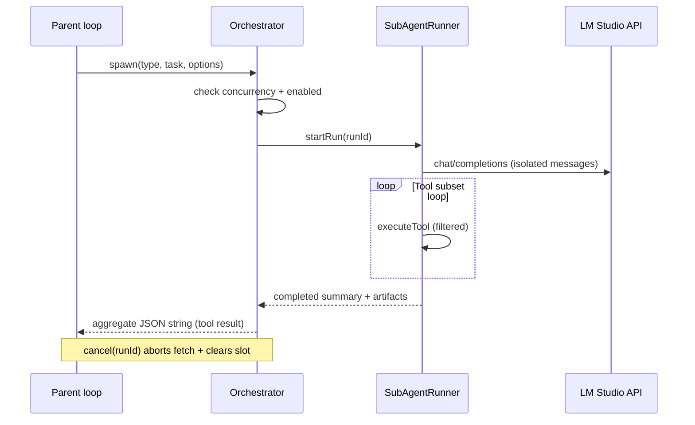

# Step 09 — Sub-agent orchestration (implementation build plan)

| Field | Value |
|-------|--------|
| **Step ID** | 09 |
| **Title** | Sub-agent calls + settings |
| **Backlog** | [`to-fix.md`](../to-fix.md) items **13**, **14** |
| **Depends on** | **Step 08** (Work Agents: registry, provider/model binding, prompt resolution) |
| **Blocks** | **Step 19** (self-healing: cancel + restart + explorer spawn) |
| **Roadmap** | [`to-fix-step-order.md`](../to-fix-step-order.md) § Step 09 |
| **Architecture context** | [`documentation/context.md`](../../context.md) |

---

## 1. Goal

Enable the **parent** chat agent (main tool loop) to **spawn isolated sub-agents** that run in parallel (within concurrency limits), each with its own **model/provider**, **prompt**, **tool subset**, and **message context**. Results are **aggregated** back to the parent as structured tool results. The **orchestrator** exposes **cancel** and **restart-with-fresh-context** so Step 19 self-healing can recover from repetition without hacking the parent loop.

**In scope for Step 09**

- Sub-agent **type registry** (built-in defaults + user overrides in `~/.minnow`)
- **Orchestrator** module with spawn / cancel / status / aggregate
- **Parent-facing tools** (`spawn_sub_agent`, `cancel_sub_agent`, optional `list_sub_agents`)
- **Concurrency** and **timeouts** enforced centrally
- **Config persistence** under `~/.minnow` (via Step 02 config API)
- **Deterministic tests** for spawn, cancel, aggregate
- **Hooks** documented for Step 19 (no repetition detector in this step)

**Out of scope (later steps)**

- Full settings UI for sub-agents → **Step 20**
- Self-healing repetition heuristics → **Step 19**
- Sub-agent UI bubbles in chat (optional thin status; full UX deferred)
- MCP/LSP tools in sub-agent subset → **Steps 17–18** (orchestrator should allow ids once those exist)

---

## 2. Prerequisites (Step 08 contract)

Do **not** start Step 09 until Step 08 delivers and verifies:

| Deliverable | Used by Step 09 |
|-------------|-----------------|
| `src/agents/work-agent-registry.ts` (or equivalent) | Pattern for agent id → prompt + provider + model |
| `resolveWorkAgent(id)` | Optional: sub-agent type may **reference** a Work Agent id for prompt/model |
| Provider resolution from Step 03 | Per-type `providerId` + `modelId` on sub-agent config |
| Prompt composer from Step 04 | Sub-agent system prompt = composed prompt for type (lite/full from active profile) |
| `~/.minnow` config API from Step 02 | Read/write `sub-agents.json` |

If Step 08 is incomplete, stub **only** `generalPurpose` with parent’s model and a minimal system prompt — document the stub in `context.md` and replace when 08 lands.

---

## 3. Architecture decision

### 3.1 Split: `orchestrator.ts` + thin `loop.ts` hook

| Layer | Location | Responsibility |
|-------|----------|----------------|
| **Orchestrator** | `src/agents/orchestrator.ts` | Run registry, concurrency pool, isolated runs, cancel/abort, aggregate results |
| **Sub-agent runner** | `src/agents/sub-agent-runner.ts` | One child run: build messages, stream completion, nested tool loop (subset), return summary |
| **Config** | `src/agents/sub-agent-config.ts` | Load/merge defaults + `~/.minnow/sub-agents.json` |
| **Types** | `src/agents/types.ts` | `SubAgentType`, `SubAgentRun`, `SubAgentStatus`, spawn/cancel args |
| **Parent tools** | `src/tools/definitions.ts` + `src/tools/sub-agent-executor.ts` | OpenAI function schemas + `executeTool` routing |
| **Integration** | `src/tools/loop.ts` | When parent `executeTool` hits spawn/cancel, delegate to orchestrator; do **not** duplicate orchestration logic in loop |

**Rationale:** `loop.ts` is already large (~625 lines). Orchestration state (active runs, semaphores, abort controllers) belongs in a testable module. Step 19 will import `orchestrator.cancelRun` / `orchestrator.restartRun` without touching SSE UI code.

### 3.2 Execution model



- **Isolated context:** Sub-agent messages are **not** appended to parent `chat.history`. Store ephemeral transcript under `orchestrator` run state (and optionally `~/.minnow/logs/sub-agents/<runId>.json` for debug).
- **Parent visibility:** Tool result is a **JSON string** (static shape in tests) with `runId`, `status`, `summary`, `error?`, `toolCallCount`.
- **Parallel spawns:** Multiple `spawn_sub_agent` in one parent tool round may run concurrently up to `maxConcurrent` per type (and global cap).

### 3.3 Built-in sub-agent types (v1)

Ship defaults in `src/agents/defaults/sub-agents.json` (merged with user file):

| `id` | Purpose | Default tool policy |
|------|---------|---------------------|
| `generalPurpose` | General research / multi-step work | All **enabled** parent tools except meta spawn tools |
| `explore` | Read-only codebase exploration | `list_directory`, `read_file`, `read_file_range`, `find_files`, `search_in_file`, `get_file_metadata`, `git_status`, `git_log`, `web_search`, `wikipedia_search`, `fetch_web_content` |
| `shell` | Command execution focus | `execute_command`, `get_datetime`, `read_file`, `list_directory` (+ server tools per config) |

User may add types in `~/.minnow/sub-agents.json` (same schema).

**Step 19:** `explorer` type can alias `explore` with broader tools — define `explorer` stub in defaults with `maxConcurrent: 1` and document extension in Step 19 plan.

---

## 4. Configuration (`~/.minnow`)

### 4.1 File layout

```
~/.minnow/
  sub-agents.json          # User overrides + enable flags
  logs/
    sub-agents/            # Optional per-run debug transcripts
```

### 4.2 Schema (`sub-agents.json`)

```json
{
  "version": 1,
  "enabled": true,
  "globalMaxConcurrent": 3,
  "defaultTimeoutMs": 300000,
  "types": {
    "generalPurpose": {
      "label": "General purpose",
      "enabled": true,
      "providerId": "lm-studio",
      "modelId": "",
      "maxConcurrent": 2,
      "timeoutMs": 300000,
      "workAgentId": null,
      "allowedTools": null,
      "deniedTools": ["spawn_sub_agent", "cancel_sub_agent"],
      "systemPromptPath": null
    },
    "explore": {
      "enabled": true,
      "providerId": "lm-studio",
      "modelId": "",
      "maxConcurrent": 2,
      "allowedTools": ["list_directory", "read_file"],
      "deniedTools": ["spawn_sub_agent", "execute_command", "git_commit"]
    }
  }
}
```

| Field | Meaning |
|-------|---------|
| `enabled` (root) | Master switch; when false, spawn tools return `Error: sub-agents disabled` |
| `globalMaxConcurrent` | Cap across **all** types |
| `types[id].maxConcurrent` | Per-type cap |
| `allowedTools` | If non-null, **whitelist** tool function names (intersect with parent enabled tools) |
| `deniedTools` | Blacklist applied after whitelist |
| `workAgentId` | If set, prompt + model come from Work Agent registry (Step 08) |
| `systemPromptPath` | Optional override relative to `~/.minnow/prompts/sub-agents/<id>.md` |
| `timeoutMs` | Hard cancel run after elapsed time |

**API (Step 02):** `GET/PUT /api/config/sub-agents` reading/writing `sub-agents.json` with path guard under home dir.

**Browser cache:** Mirror to `minnow.subAgents` in memory when server unavailable; sync on `detectLocalServer()` success (same pattern as planned migration off `localStorage` for tools).

---

## 5. Orchestrator API (`src/agents/orchestrator.ts`)

### 5.1 Public functions

```ts
// Spawn: returns runId immediately; run continues async until awaitSpawnResult or tool waits inline
export function spawnSubAgent(input: SpawnSubAgentInput): Promise<SpawnSubAgentResult>;

export function cancelSubAgent(runId: string, reason?: string): CancelSubAgentResult;

/** Step 19: cancel + spawn replacement with same task + optional note */
export function restartSubAgent(
  runId: string,
  options?: { note?: string; preserveType?: boolean },
): Promise<SpawnSubAgentResult>;

export function getSubAgentRun(runId: string): SubAgentRun | undefined;

export function listActiveSubAgentRuns(): SubAgentRun[];

/** Block until run settles (for tool executor) or timeout */
export function waitForSubAgent(runId: string, signal?: AbortSignal): Promise<AggregateResult>;
```

### 5.2 Run lifecycle

| Status | Meaning |
|--------|---------|
| `queued` | Waiting for concurrency slot |
| `running` | LM Studio stream or tool execution active |
| `completed` | Success; summary available |
| `failed` | Error string set |
| `cancelled` | User/parent/orchestrator/timeout abort |

**Cancel behavior**

- Abort in-flight `fetch` via `AbortController` per run (mirror `chatFetchAbort` pattern in [`src/app-state.ts`](../../../src/app-state.ts)).
- Reject pending tool promises; do not write partial sub-agent transcript to parent history.
- Free concurrency slot immediately when status → `cancelled` | `failed` | `completed`.

**Restart behavior (Step 19-ready)**

1. `cancelSubAgent(oldRunId, 'restart')`
2. Copy `type`, `task` from old run; append `options.note` to task preamble
3. `spawnSubAgent` with **new** `runId` and **empty** message array (fresh context)
4. Return new `runId` to caller (self-healing tier 1)

### 5.3 Aggregation

`AggregateResult` (serialized to parent tool result):

```json
{
  "runId": "11111111-1111-1111-1111-111111111111",
  "type": "explore",
  "status": "completed",
  "summary": "Found 3 files matching ...",
  "startedAt": "2026-05-19T12:00:00.000Z",
  "endedAt": "2026-05-19T12:01:05.000Z",
  "toolTurns": 4,
  "cancelled": false
}
```

Parent model sees this as the `tool` message `content` string (pretty-printed JSON, capped at **32 KB** with truncation suffix).

### 5.4 Concurrency implementation

- Maintain `activeCount` global and `activeCountByType: Map<string, number>`.
- On spawn: if at cap, push to FIFO `queue` per type (or global queue — **pick one**, document: recommend **global queue** with fair dequeue).
- `defaultTimeoutMs` / per-type `timeoutMs`: `setTimeout` → `cancelSubAgent(runId, 'timeout')`.

### 5.5 Tool subset resolution

```ts
function resolveSubAgentTools(
  typeConfig: SubAgentTypeConfig,
  parentEnabled: OpenAIFunctionDefinition[],
): OpenAIFunctionDefinition[];
```

1. Start from `parentEnabled` (respects Settings toggles + server availability).
2. Apply `allowedTools` whitelist if present.
3. Remove `deniedTools`.
4. Always remove recursive spawn unless type is `orchestrator` (reserved; not enabled in v1).

Sub-agent **nested** tool loop: reuse `streamCompletionTurn` logic extracted to shared `src/api/completion-turn.ts` (small refactor from [`loop.ts`](../../../src/tools/loop.ts)) **or** duplicate minimal loop inside `sub-agent-runner.ts` with `MAX_SUB_AGENT_TOOL_TURNS = 6` (separate constant).

---

## 6. Parent-facing tools

Add to [`src/tools/definitions.ts`](../../../src/tools/definitions.ts):

| Function name | Args | Returns |
|---------------|------|---------|
| `spawn_sub_agent` | `type` (string), `task` (string), `wait` (boolean, default true) | Aggregate JSON |
| `cancel_sub_agent` | `run_id` (string), `reason` (optional) | `{ ok, runId, status }` |

- Category: **utility** or new **agents** category; `serverRequired: false` (orchestrator runs in browser; LM calls from browser).
- Register executor in [`src/tools/sub-agent-executor.ts`](../../../src/tools/sub-agent-executor.ts); wire from [`client.ts`](../../../src/tools/client.ts) `executeTool`.

**`wait: false`:** Return immediately with `{ runId, status: "queued"|"running" }`; parent must poll or use a second tool later (optional `get_sub_agent_status` — only if needed for UX; otherwise keep v1 sync-only with `wait: true` default).

---

## 7. Integration with main loop

In [`src/tools/loop.ts`](../../../src/tools/loop.ts) tool execution block (~line 487):

```ts
const result = await executeTool(tc.function.name, args);
```

No change required if `executeTool` routes spawn/cancel internally. **Important:** Sub-agent runs must **not** set parent `streaming` false mid-parent-turn; only the spawn tool await blocks that tool slot.

**Abort parent send:** If user aborts parent chat (`chatFetchAbort`), orchestrator must `cancelAllForParentTurn(turnToken)` — pass a `parentTurnId` generated at start of `sendMessageWithTools` so all child runs cancel together.

---

## 8. Prompt composition for sub-agents

1. Resolve type config from `loadSubAgentConfig()`.
2. If `workAgentId` → use Step 08 `resolveWorkAgentPrompt(workAgentId)`.
3. Else if `systemPromptPath` → load from `~/.minnow/prompts/sub-agents/`.
4. Else load shipped `src/agents/prompts/sub-agents/<id>.md` (lite/full via active profile from Step 04).
5. Append **task envelope**:

```text
You are a sub-agent (type: explore). Complete the following task. You cannot spawn other sub-agents.
Return a concise summary for the parent when done.

Task:
{task}
```

---

## 9. Step 19 hooks (interfaces only)

Implement but **do not wire** repetition detection in Step 09:

| Export | Purpose |
|--------|---------|
| `restartSubAgent(runId, { note })` | Tier-1 fresh context |
| `spawnSubAgent({ type: 'explorer', task })` | Tier-2 broader investigation |
| `recordToolCallForRun(runId, name, args)` | Append-only log for future heuristics |
| `getRunToolCallFingerprint(runId)` | Stable hash for “same repetition” matching |

Document expected Step 19 usage in `documentation/plans/Build out/step-19-self-healing.md` (future) — link from this file.

---

## 10. Server endpoints (Step 02 dependency)

| Method | Path | Body / response |
|--------|------|-----------------|
| `GET` | `/api/config/sub-agents` | Full merged config |
| `PUT` | `/api/config/sub-agents` | Replace user overrides (validate schema) |

Implement validation in `server.js` (reject unknown tool ids with warning, not hard fail).

---

## 11. Tests

**Location:** `test/sub-agents/` (Node `node:test` or `tsx` — align with Step 02 test runner choice).

### 11.1 Unit tests (orchestrator, no LM Studio)

| Test file | Cases |
|-----------|--------|
| `orchestrator-spawn.test.ts` | Spawn returns runId; respects `globalMaxConcurrent`; queues excess |
| `orchestrator-cancel.test.ts` | Cancel running run → `cancelled`; slot freed; queued run starts |
| `orchestrator-aggregate.test.ts` | Mock runner returns fixed summary → aggregate JSON **static string** match |
| `sub-agent-tools.test.ts` | `resolveSubAgentTools` whitelist/deny; spawn tools excluded |
| `sub-agent-config.test.ts` | Merge defaults + user JSON; disabled master → spawn error |

Use **fixed UUID**: `11111111-1111-1111-1111-111111111111` for run ids in fixtures.

**Mock runner:** Inject `setSubAgentRunnerFactory(mock => ({ run: async () => ({ summary: 'FIXED_SUMMARY' }) }))` for determinism.

### 11.2 Integration smoke (optional script)

`scripts/sa09-sub-agent-smoke.mjs`:

- Requires `npm start` + LM Studio **or** mock fetch injection flag `MINNOW_MOCK_COMPLETIONS=1`
- Parent tool call `spawn_sub_agent` with `type: explore`, short task
- Assert tool result contains `"status":"completed"`

### 11.3 Verification doc

Create `documentation/plans/verification/step-09.md` with commands:

```bash
npm run build
node --test test/sub-agents/*.test.ts
# optional:
node scripts/sa09-sub-agent-smoke.mjs http://localhost:5173
```

---

## 12. Documentation updates

| File | Updates |
|------|---------|
| [`documentation/context.md`](../../context.md) | Sub-agent orchestration, config paths, parent tools, concurrency limits |
| [`documentation/plans/to-fix-step-order.md`](../to-fix-step-order.md) | Link to this build plan (optional footnote) |
| `documentation/plans/verification/step-09.md` | Verifier checklist |

---

## 13. File checklist (implementer)

| Action | Path |
|--------|------|
| Create | `src/agents/types.ts` |
| Create | `src/agents/sub-agent-config.ts` |
| Create | `src/agents/defaults/sub-agents.json` |
| Create | `src/agents/orchestrator.ts` |
| Create | `src/agents/sub-agent-runner.ts` |
| Create | `src/agents/prompts/sub-agents/generalPurpose.full.md` (+ lite) |
| Create | `src/agents/prompts/sub-agents/explore.full.md` (+ lite) |
| Create | `src/tools/sub-agent-executor.ts` |
| Modify | `src/tools/definitions.ts` — spawn/cancel tools |
| Modify | `src/tools/client.ts` — route executor |
| Modify | `src/tools/loop.ts` — parentTurnId + cancelAll on abort |
| Modify | `server.js` — `/api/config/sub-agents` |
| Create | `test/sub-agents/*.test.ts` |
| Create | `scripts/sa09-sub-agent-smoke.mjs` |
| Create | `documentation/plans/verification/step-09.md` |

---

## 14. Acceptance criteria (verifier)

- [ ] With sub-agents **enabled**, parent can call `spawn_sub_agent` and receive static-shape aggregate JSON on completion.
- [ ] **Concurrency:** Starting N+1 runs when `globalMaxConcurrent = N` queues or errors predictably (document which).
- [ ] **Tool subset:** `explore` type cannot invoke `execute_command` (returns tool error or omitted from schema).
- [ ] **Cancel:** `cancel_sub_agent` aborts a long-running mock run; status `cancelled`.
- [ ] **Restart:** `restartSubAgent` produces new `runId` and empty child history (unit test with mock).
- [ ] Config persists under `~/.minnow/sub-agents.json` via PUT/GET API when `npm start`.
- [ ] Parent chat abort cancels active child runs for that turn.
- [ ] `npm run build` passes; all `test/sub-agents/*` pass.
- [ ] `documentation/context.md` updated.

---

## 15. Implementation todos

### Phase A — Types and config

- [ ] **A1** Define `SubAgentTypeConfig`, `SubAgentsFile`, `SubAgentRun`, `SpawnSubAgentInput`, `AggregateResult` in `src/agents/types.ts`
- [ ] **A2** Add `src/agents/defaults/sub-agents.json` with `generalPurpose`, `explore`, `shell` defaults
- [ ] **A3** Implement `loadSubAgentConfig()` / `mergeSubAgentConfig()` in `sub-agent-config.ts` (defaults ← file ← runtime cache)
- [ ] **A4** Add `GET/PUT /api/config/sub-agents` in `server.js` with home-dir path guard
- [ ] **A5** Client: `fetchSubAgentConfig()` / `saveSubAgentConfig()` when server up; degrade when Vite-only

### Phase B — Tool subset and prompts

- [ ] **B1** Implement `resolveSubAgentTools(typeId, parentEnabled)` with allow/deny lists
- [ ] **B2** Implement `buildSubAgentSystemPrompt(typeId, task, profile)` using Step 08 Work Agent hook when `workAgentId` set
- [ ] **B3** Ship prompt stubs under `src/agents/prompts/sub-agents/` (full + lite per type)
- [ ] **B4** Add `spawn_sub_agent` and `cancel_sub_agent` to `BUILT_IN_TOOLS` in `definitions.ts`
- [ ] **B5** Implement `sub-agent-executor.ts` and wire in `client.ts` `executeTool`

### Phase C — Runner

- [ ] **C1** Extract or duplicate minimal `streamCompletionTurn` for sub-agent (shared module or internal copy)
- [ ] **C2** Implement `sub-agent-runner.ts`: isolated `messages[]`, tool loop with `MAX_SUB_AGENT_TOOL_TURNS`
- [ ] **C3** Runner calls `executeTool` through a **filtered** wrapper that enforces subset
- [ ] **C4** Runner produces `summary` string (final assistant message or explicit “no output” message)
- [ ] **C5** Optional debug log write to `~/.minnow/logs/sub-agents/<runId>.json` behind flag

### Phase D — Orchestrator

- [ ] **D1** Implement concurrency counters + global queue in `orchestrator.ts`
- [ ] **D2** Implement `spawnSubAgent` → queue or start runner → return runId / await result
- [ ] **D3** Implement per-run `AbortController` and `cancelSubAgent`
- [ ] **D4** Implement `waitForSubAgent` with parent `AbortSignal` linkage
- [ ] **D5** Implement `restartSubAgent` (cancel + spawn, fresh messages, optional note)
- [ ] **D6** Implement `cancelAllForParentTurn(turnId)` registry
- [ ] **D7** Implement timeout timers per config
- [ ] **D8** Export `recordToolCallForRun` / `getRunToolCallFingerprint` stubs for Step 19

### Phase E — Parent loop integration

- [ ] **E1** Generate `parentTurnId` at start of `sendMessageWithTools`
- [ ] **E2** On parent `AbortError`, call `cancelAllForParentTurn(parentTurnId)`
- [ ] **E3** Pass `parentTurnId` into spawn executor for run association
- [ ] **E4** Ensure sub-agent tools respect master `enabled: false` in config

### Phase F — Tests and docs

- [ ] **F1** `orchestrator-spawn.test.ts` — concurrency + queue (mock runner)
- [ ] **F2** `orchestrator-cancel.test.ts` — abort + slot free
- [ ] **F3** `orchestrator-aggregate.test.ts` — static JSON expected string
- [ ] **F4** `sub-agent-tools.test.ts` — allow/deny resolution
- [ ] **F5** `sub-agent-config.test.ts` — merge + disabled gate
- [ ] **F6** Add `scripts/sa09-sub-agent-smoke.mjs` (optional LM Studio)
- [ ] **F7** Create `documentation/plans/verification/step-09.md`
- [ ] **F8** Update `documentation/context.md` (sub-agents section + config table)

### Phase G — Verifier handoff

- [ ] **G1** Implementer runs full test command and attaches output to verification doc
- [ ] **G2** Verifier re-runs tests independently → PASS/FAIL report

---

## 16. Risks and mitigations

| Risk | Mitigation |
|------|------------|
| Nested spawn recursion | Deny `spawn_sub_agent` on all default types |
| Parent abort leaves zombie fetches | `parentTurnId` + `cancelAllForParentTurn` |
| Token cost explosion | Separate `MAX_SUB_AGENT_TOOL_TURNS`; lower default max_tokens for sub-agents in config |
| Step 08 not done | Single `generalPurpose` stub type; document debt |
| Browser-only LM calls + CORS | Same as today — sub-agents use parent’s LM Studio URL from settings |
| Parallel tool UI noise | Sub-agent tools do not render in parent chat area (results only via aggregate) |

---

## 17. Open questions (resolve before implement)

1. **Queue vs error** when over `maxConcurrent` — recommend **queue** with visible `queued` status in aggregate for `wait: true`.
2. **Sync-only v1** — Is `wait: false` required for backlog 13, or can Step 20 add async polling UI?
3. **Work Agent binding** — Should every sub-agent type default to a Work Agent id once Step 08 ships presets?
4. **Transcript retention** — Default off vs debug flag for `~/.minnow/logs/sub-agents/`?

Implementer: record decisions at top of PR / verification doc when resolved.

---

## 18. Sub-agent implementer prompt (copy-paste)

```
You are implementing Minnow Step 09 — Sub-agent orchestration.

Read:
- documentation/plans/Build out/step-09-sub-agent-orchestration.md (this plan)
- documentation/context.md
- documentation/plans/to-fix-step-order.md § Step 09
- src/tools/loop.ts, src/tools/client.ts, src/tools/definitions.ts

Depends on Step 08 (Work Agents). Do not duplicate Work Agent registry — integrate resolveWorkAgent*.

Deliver:
- src/agents/orchestrator.ts + sub-agent-runner.ts + config
- Parent tools spawn_sub_agent, cancel_sub_agent
- ~/.minnow/sub-agents.json via /api/config/sub-agents
- cancel + restartSubAgent for Step 19
- test/sub-agents/* deterministic tests
- Update documentation/context.md

Out of scope: settings UI (Step 20), repetition detection (Step 19).

Run: npm run build && node --test test/sub-agents/*.test.ts
Document commands in documentation/plans/verification/step-09.md
```

---

## 19. Related steps

| Step | Relationship |
|------|----------------|
| **08** | Work Agent prompts/models — upstream |
| **19** | Uses `cancelSubAgent`, `restartSubAgent`, `explorer` type |
| **20** | Full sub-agent settings UI, master toggles |

---

*Plan version: 1.0 — 2026-05-19*
