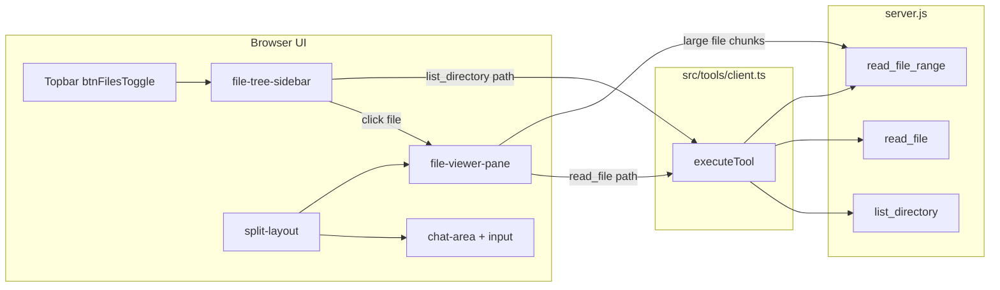

# Step 11 — File tree sidebar + split file viewer

**Implementation build plan** for implementer and verifier sub-agents.

| Field | Value |
|-------|--------|
| **Backlog** | [`documentation/plans/to-fix.md`](../to-fix.md) item 5 — file viewer / browser |
| **Roadmap** | [`documentation/plans/to-fix-step-order.md`](../to-fix-step-order.md) Step 11 |
| **Depends on** | **Step 02** (`~/.minnow` data layer) — UI prefs and workspace root should persist via server config, not ad-hoc `localStorage` keys |
| **Parallel** | Step 10 (terminal panel) after S02 |
| **Blocks** | None directly; Step 15 (UI Designer) benefits from readable file UI |

## Goal

Ship a **project file explorer** and **read-only code viewer** inside the Minnow SPA:

1. **Right pop-out file tree** — mirrors the left chat sidebar pattern (`chat-sidebar` / `sidebar.css`): collapse rail, mobile overlay, backdrop, top-bar toggle.
2. **Split main column** — chat + composer on the left; file viewer pane on the right when a file is open (resizable split).
3. **Data via existing server tools** — `list_directory`, `read_file`, `read_file_range` through [`src/tools/client.ts`](../../../src/tools/client.ts) (`executeTool` → `POST /api/tools`). Requires `npm start` (same as agent file tools).
4. **Read-only editor** — Monaco *or* CodeMirror 6 with syntax highlighting; **no save/edit in v1** (agent still uses `save_file` tools).

## Out of scope (this step)

- File editing in the viewer (defer to a later step).
- Opening files outside `resolveSafePath` / project cwd ([`server.js`](../../../server.js)).
- Replacing agent tool definitions or server handlers.
- Git diff UI, search-in-repo, LSP integration (Steps 17+).
- Wiring viewer to tool-call bubbles (nice-to-have hook only; not required for PASS).

## Prerequisites (read before coding)

| Resource | Why |
|----------|-----|
| [`documentation/context.md`](../../context.md) | Layout, tools API, session model |
| [`src/ui/layout.ts`](../../../src/ui/layout.ts) | Chat sidebar open/close/collapse |
| [`src/ui/sidebar.ts`](../../../src/ui/sidebar.ts) | List rendering, keyboard, nested buttons pattern |
| [`src/styles/sidebar.css`](../../../src/styles/sidebar.css) | Collapsed rail, mobile overlay |
| [`index.html`](../../../index.html) | `app-body`, `main-column`, `chat-area` |
| [`src/tools/client.ts`](../../../src/tools/client.ts) | `detectLocalServer`, `executeTool` |
| [`server.js`](../../../server.js) | `toolListDirectory`, `toolReadFile`, `toolReadFileRange`, `resolveSafePath` |
| Step 02 deliverable | `~/.minnow/config.json` (or `ui.json`) for `filePanel` prefs |

**Server tool response shapes (do not change without updating parser tests):**

```text
# list_directory result (one entry per line)
[dir] src
[file] package.json

# read_file → raw UTF-8 file body, or "Error: …"
# read_file_range → "N: line text" per line
```

## Architecture



### Module layout (new)

| File | Responsibility |
|------|----------------|
| [`src/ui/file-tree.ts`](../../../src/ui/file-tree.ts) | Tree model, lazy `list_directory`, expand/collapse, render, selection |
| [`src/ui/file-viewer.ts`](../../../src/ui/file-viewer.ts) | Load file, editor mount, tab header (path, close), error/loading states |
| [`src/ui/file-layout.ts`](../../../src/ui/file-layout.ts) | Right sidebar + split pane toggles; mirrors `layout.ts` APIs |
| [`src/state/file-panel.ts`](../../../src/state/file-panel.ts) | In-memory state + load/save prefs (Step 02 config API) |
| [`src/lib/list-directory-parse.ts`](../../../src/lib/list-directory-parse.ts) | Pure parser: tool string → `{ dirs, files }` |
| [`src/styles/file-panel.css`](../../../src/styles/file-panel.css) | File sidebar, split resizer, viewer chrome |

### Editor choice (implementer decision — document in PR)

| Option | Pros | Cons | Recommendation |
|--------|------|------|----------------|
| **CodeMirror 6** | Smaller bundle, modular langs, `readOnly` built-in, good TS | New deps (`@codemirror/*`) | **Default for v1** |
| **Monaco** | VS Code parity | Heavy; often needs worker config in Vite | Only if bundle size waived |

**v1 requirement:** read-only, line numbers, wrap toggle, language mode from extension map (reuse/extension of highlight.js mapping where possible).

**Fallback (if deps blocked):** styled `<pre>` + highlight.js for v1 smoke only — must still pass “open file shows content” tests; upgrade to CodeMirror in same step if time allows.

### Layout DOM sketch (implementer implements in `index.html`)

```html
<div class="app-body" id="appBody">
  <aside class="chat-sidebar" id="chatSidebar">…</aside>

  <div class="workspace-split" id="workspaceSplit">
    <div class="main-column" id="mainColumn">
      <main class="chat-area" id="chatArea">…</main>
      <div class="input-bar">…</div>
      <!-- stats-strip stays in main-column footer -->
    </div>

    <div class="split-resizer hidden" id="splitResizer" role="separator" aria-orientation="vertical"></div>

    <section class="file-viewer-pane hidden" id="fileViewerPane" aria-label="File viewer">
      <header class="file-viewer-header">…</header>
      <div class="file-viewer-body" id="fileViewerHost"></div>
    </section>
  </div>

  <aside class="file-sidebar" id="fileSidebar" aria-label="Project files">…</aside>
</div>

<button type="button" class="file-sidebar-backdrop" id="fileSidebarBackdrop"></button>
```

- **Order:** chat sidebar (left) → workspace split (center) → file sidebar (right).
- **CSS variables** (add to [`src/styles/tokens.css`](../../../src/styles/tokens.css)): `--file-sidebar-w`, `--file-sidebar-rail`, `--viewer-min-w`, `--split-ratio` (default `0.55` chat / `0.45` viewer).

### State model (`file-panel.ts`)

```ts
export interface FilePanelState {
  fileSidebarCollapsed: boolean;
  viewerOpen: boolean;           // split visible
  splitRatio: number;            // 0.35–0.75, chat share
  expandedDirs: string[];        // relative paths, e.g. "src/ui"
  selectedPath: string | null;   // last opened file
  treeRoot: string;              // default "."
}
```

**Persistence (after Step 02):** `GET/PUT /api/config/ui` → `~/.minnow/config.json` field `filePanel`. **Degrade:** if server offline, keep in-memory only for session (no new `localStorage` key).

### Tree behavior

1. **Root:** `list_directory({ path: "." })` on first open when server available.
2. **Lazy children:** on folder expand, `list_directory({ path: joinedRelative })`; cache results in a `Map<string, ParsedListing>`.
3. **Sort:** directories first, then files, `localeCompare` (match server sort).
4. **Icons:** folder chevron (CSS rotate when open); file icon by extension (optional, CSS-only).
5. **Click file:** `openFileInViewer(relativePath)` — do not toggle tree row expand.
6. **Click folder:** expand/collapse only.
7. **Refresh:** header button re-fetches root (invalidate cache).
8. **Keyboard:** tree `role="tree"` / `treeitem`; Enter opens file or toggles folder; mirror [`sidebar.ts`](../../../src/ui/sidebar.ts) patterns (no nested `<button>` inside clickable row — use `div` + `tabIndex` or separate expand hit target).

### Viewer behavior

1. **Open:** show split, set `viewerOpen`, fetch `read_file`.
2. **Size guard:** if `content.length > 512_000` (512 KB), show banner + load first chunk via `read_file_range` (e.g. lines 1–2000) with “Load more” or warn (do not freeze UI).
3. **Binary / non-UTF-8:** if result starts with `Error:` or read fails, show error panel with message from tool.
4. **Close:** hide viewer pane, clear selection optional; chat expands to full width.
5. **Server offline:** tree shows empty state: “Start with `npm start` to browse project files.” Disable expand; top-bar toggle still opens sidebar with message.

### Integration points

| Hook | Action |
|------|--------|
| [`src/main.ts`](../../../src/main.ts) | Import `file-panel.css`; `initFilePanel()` after `detectLocalServer()`; register `window` handlers |
| [`src/ui/status.ts`](../../../src/ui/status.ts) `dismissOpenLayers` | Close mobile file sidebar + file backdrop (after drawer, before/after chat sidebar — document order: drawer → file sidebar → chat sidebar) |
| Top bar | `#btnFileTreeToggle` — `toggleFileSidebarLayout()` |
| `resize` / `matchMedia` | Re-apply file sidebar mobile/desktop like `applySidebarVisuals` |
| [`documentation/context.md`](../../context.md) | New “File panel” section |

**Tool enablement:** UI calls `executeTool` directly; **does not** require user to enable `read_file` / `list_directory` in Settings (same as attachments using server without catalog toggle).

---

## Implementation todos

### Phase A — Foundation

- [ ] **A1** Add `src/lib/list-directory-parse.ts` with `parseListDirectoryResult(raw: string): ParsedListing | { error: string }`.
- [ ] **A2** Add `src/state/file-panel.ts` — state object, getters, `loadFilePanelPrefs()` / `saveFilePanelPrefs()` (Step 02 config API; stub with in-memory if S02 not merged yet).
- [ ] **A3** Add CSS tokens `--file-sidebar-w`, `--file-sidebar-rail`, `--viewer-min-w` in `tokens.css`.
- [ ] **A4** Create `src/styles/file-panel.css` — file sidebar (mirror `.chat-sidebar`), backdrop, workspace split, resizer, viewer header/body.
- [ ] **A5** Extend `index.html` — file sidebar markup, viewer pane, backdrop, top-bar `#btnFileTreeToggle`, workspace split wrapper (minimal churn to existing `main-column`).

### Phase B — File tree sidebar

- [ ] **B1** Create `src/ui/file-layout.ts` — `applyFileSidebarVisuals`, `toggleFileSidebarLayout`, `toggleFileSidebarCollapsed`, `openMobileFileSidebar`, `closeMobileFileSidebar` (mirror `layout.ts`).
- [ ] **B2** Create `src/ui/file-tree.ts` — `renderFileTree()`, `expandDir(path)`, `collapseDir(path)`, cache, loading spinner per folder.
- [ ] **B3** Wire server gate: if `!getLocalServerAvailable()`, render offline empty state (link to `npm start`).
- [ ] **B4** Persist `fileSidebarCollapsed` + `expandedDirs` on change (debounced save).
- [ ] **B5** Register `window.toggleFileSidebarLayout`, `toggleFileSidebarCollapsed`, `closeMobileFileSidebar` in `main.ts`.

### Phase C — Split viewer

- [ ] **C1** Add CodeMirror 6 deps **or** document Monaco choice in commit message (`@codemirror/view`, `@codemirror/state`, `@codemirror/language`, lang packs as needed).
- [ ] **C2** Create `src/ui/file-viewer.ts` — `openFileInViewer(path)`, `closeFileViewer()`, `setViewerLoading`, `setViewerError`.
- [ ] **C3** Implement horizontal split + drag resizer (`pointerdown` / `pointermove`); clamp ratio; persist `splitRatio`.
- [ ] **C4** Map extensions → language support (at minimum: `ts`, `tsx`, `js`, `json`, `md`, `css`, `html`, `py`, `sh`).
- [ ] **C5** Large-file path: threshold check + `read_file_range` pagination helper.

### Phase D — Polish and integration

- [ ] **D1** Update `dismissOpenLayers()` for file sidebar/backdrop.
- [ ] **D2** Responsive rules in `file-panel.css` + touch targets ≥ `--touch-min` on mobile.
- [ ] **D3** `aria-*` on tree and viewer; resizer `aria-valuenow` when dragging.
- [ ] **D4** Double-click folder: expand only (no open).
- [ ] **D5** Optional: clicking a path in a tool-result bubble does **not** need to work in v1 (out of scope unless trivial).

### Phase E — Docs and verification artifacts

- [ ] **E1** Update [`documentation/context.md`](../../context.md) — File panel section (layout, persistence, server requirement, key files).
- [ ] **E2** Create [`documentation/plans/verification/step-11.md`](../verification/step-11.md) with exact commands (implementer).
- [ ] **E3** Extend or add `scripts/step-11-smoke.mjs` (see Tests below).

---

## Tests

### Automated

**1. Unit — list directory parser** (`test/file/list-directory-parse.test.ts` or `test/list-directory-parse.test.mjs`)

Use Node built-in test runner or minimal assert (match repo convention after S02). **Fixed fixtures only:**

| Case | Input | Expected |
|------|--------|----------|
| Mixed entries | `"[dir] src\n[file] package.json"` | `dirs: ['src']`, `files: ['package.json']` |
| Empty dir | `"(empty directory)"` | both arrays empty |
| Error passthrough | `"Error: access denied"` | `{ error: 'access denied' }` |
| Stable sort | unsorted input lines | dirs/files sorted `localeCompare` |

**2. Smoke — server tools + UI helpers** (`scripts/step-11-smoke.mjs`)

Run with `npm start` (pass base URL as argv). Static expected strings:

```js
// list_directory root contains package.json
const list = await postTool('list_directory', { path: '.' });
assert(list.body.result.includes('[file] package.json'));

// read_file package.json
const read = await postTool('read_file', { path: 'package.json' });
assert(read.body.result.includes('"name": "minnow"'));

// read_file_range lines 1-3
const range = await postTool('read_file_range', {
  path: 'package.json',
  start_line: 1,
  end_line: 3,
});
assert(/^1: /.test(range.body.result));
```

**3. Optional — parser + openFile integration test** (no browser):

- Import `parseListDirectoryResult` and a thin `loadFileContent(path)` wrapper that calls `executeTool('read_file', { path })` with mocked `fetch` — static `package.json` body.

**4. Build gate**

```bash
npm run build
```

Must pass with zero TS errors after adding editor deps.

### Manual QA checklist (verifier)

Run **`npm start`**, open app, LM Studio optional (not required for file UI).

| ID | Steps | Expected |
|----|--------|----------|
| M1 | Click top-bar **Files** toggle | Right file sidebar opens; shows project tree root |
| M2 | Expand `src` folder | Children load; chevron rotates; no full-page reload |
| M3 | Click `package.json` | Split opens; viewer shows JSON with syntax colors / monospace |
| M4 | Drag split resizer | Chat and viewer widths change; ratio restored on reload (if S02 prefs up) |
| M5 | Collapse file sidebar (rail) | Narrow rail; viewer remains if file was open |
| M6 | Close viewer tab/button | Viewer hides; chat uses full workspace width |
| M7 | `npm run dev` only (no tools server) | File sidebar opens; message to use `npm start`; no crash |
| M8 | Mobile width ≤640px | File sidebar overlays with backdrop; Escape closes |
| M9 | Open file >512 KB (use `package-lock.json` if present) | Warning or range load; UI stays responsive |
| M10 | Attempt path `../../../etc/passwd` via UI | Error from server guard; friendly error in viewer |

### Verifier commands (copy to `documentation/plans/verification/step-11.md`)

```bash
npm run build
npm start
# separate terminal:
node scripts/step-11-smoke.mjs http://localhost:5173
# optional unit tests when added:
node --test test/file/list-directory-parse.test.mjs
```

**PASS criteria:** build OK, smoke script all `true`, manual M1–M8 checked, M9–M10 best-effort if fixture exists.

---

## Acceptance criteria (verifier)

1. Right **file tree sidebar** matches chat sidebar interaction model (collapse, mobile overlay, top-bar toggle).
2. **Split layout** shows chat + read-only viewer; resizer works on desktop.
3. Tree populated via **`list_directory`**; files open via **`read_file`** / **`read_file_range`** through **`src/tools/client.ts`** (not duplicate fetch URLs in UI).
4. New stylesheet **`src/styles/file-panel.css`** imported from `main.ts`.
5. **`documentation/context.md`** updated.
6. Automated tests/smoke documented and **re-run PASS** by verifier (separate agent session).
7. No new `localStorage` keys for file panel when Step 02 config API exists.

---

## Risk register

| Risk | Mitigation |
|------|------------|
| Editor bundle bloat | Prefer CodeMirror; lazy-import lang modules per extension |
| Huge repo tree | Lazy load only; don’t recursive preload |
| `list_directory` format change | Central parser + unit tests |
| Step 02 not landed | In-memory prefs + TODO comment; verifier can waive persistence checks with note |
| Binary files | Detect `Error:` / invalid UTF-8; show “Binary or unreadable file” |
| CORS / `npm run dev` | Clear empty state; no silent failure |

---

## Implementer handoff checklist

1. Confirm **Step 02** config shape for `filePanel` — or ship in-memory-only with follow-up PR.
2. Read [`sidebar.css`](../../../src/styles/sidebar.css) + [`layout.ts`](../../../src/ui/layout.ts) before writing `file-layout.ts`.
3. Keep **English** identifiers/comments; match existing TS style (return early, no nested buttons in list rows).
4. Run `npm run build` + smoke + manual M1–M8.
5. Update **context.md** and create **verification/step-11.md**.

## Verifier handoff

1. Do **not** implement features.
2. Re-run commands from `documentation/plans/verification/step-11.md`.
3. Report PASS/FAIL table per test ID (T-parser, T-smoke, M1–M10, build).
4. Fail → return to implementer with logs only.

---

## Summary

| Deliverable | Path |
|-------------|------|
| File tree UI | `src/ui/file-tree.ts` |
| File viewer UI | `src/ui/file-viewer.ts` |
| Layout controls | `src/ui/file-layout.ts` |
| State / prefs | `src/state/file-panel.ts` |
| Directory parser | `src/lib/list-directory-parse.ts` |
| Styles | `src/styles/file-panel.css` |
| Markup | `index.html` (file sidebar + split) |
| Tests | `test/.../list-directory-parse.*`, `scripts/step-11-smoke.mjs` |
| Docs | `documentation/context.md`, `documentation/plans/verification/step-11.md` |
