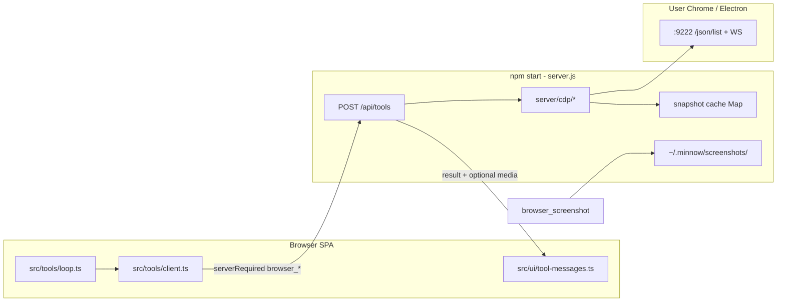

# Step 12 — CDP browser automation (implementation build plan)

| Field | Value |
|-------|--------|
| **Step ID** | 12 |
| **Title** | Screenshots and full browser control (CDP) |
| **Backlog** | [`to-fix.md`](../to-fix.md) items **17** (screenshot tools), **18** (full browser control / CDP) |
| **Roadmap** | [`to-fix-step-order.md`](../to-fix-step-order.md) — Wave 5 |
| **Depends on** | **Step 02** (`~/.minnow` config — browser defaults, allowlist, tool toggles); **Step 10** optional (terminal helps debug Chrome/CDP) |
| **Blocks** | **Step 15** (UI Designer — needs `browser_screenshot` + inline chat images) |
| **Primary reference** | [different-ai/opencode-browser](https://github.com/different-ai/opencode-browser) — direct CDP, explicit `browser_url`, snapshot UIDs, no hidden singleton browser |
| **Workspace** | `c:\Users\dukky\Documents\Development\Minnow` |

---

## 1. Goals

1. Add **seven server-side CDP tools** aligned with opencode-browser: `browser_list`, `browser_navigate`, `browser_snapshot`, `browser_click`, `browser_fill`, `browser_eval`, `browser_screenshot`.
2. Every CDP tool accepts **`browser_url`** (optional when env default is set) and optional **`target_id`** for multi-tab workflows.
3. Implement CDP in **Node** (`server.js` + extracted modules), not in the browser tab — the SPA cannot speak CDP to arbitrary Chrome instances.
4. **Keep** existing lightweight browser tools in [`src/tools/browser-executor.ts`](../../../src/tools/browser-executor.ts) (`fetch_web_content`, `web_search`, clipboard, etc.) until explicitly migrated; do **not** duplicate fetch logic in CDP.
5. **Render screenshots inline** in the chat transcript when `browser_screenshot` runs (backlog 18).
6. **Security:** URL allowlist for navigation + user toggle persisted under `~/.minnow` (full settings UI in Step 20; schema + enforcement in this step).
7. **Tests:** integration tests against a **mock CDP HTTP/WebSocket** server with **recorded fixtures** (no flaky dependency on real Chrome in CI).

## 2. Non-goals (this step)

- Playwright/Puppeteer as the primary automation layer (CDP-first; thin WebSocket client only).
- Chrome extension, native messaging host, or MCP browser server.
- VLM “parse screenshot” pipeline (model sees image if user enables VLM + we attach image parts — wiring only, no new vision model).
- Step 20 settings page polish (expose minimal drawer fields if needed; defer full browser section).
- Migrating `fetch_web_content` / `rag_web_content` to CDP (CORS-free fetch via `browser_eval` is a follow-up, not required for Step 12 done).

---

## 3. Current state

| Area | Today |
|------|--------|
| Tool catalog | **32** tools in [`src/tools/definitions.ts`](../../../src/tools/definitions.ts) — **9** `serverRequired: false`, **23** server |
| Browser executor | [`executeBrowserTool`](../../../src/tools/browser-executor.ts) — datetime, calc, web, clipboard, system info only |
| Server | [`server.js`](../../../server.js) — `SERVER_TOOL_HANDLERS` map, `POST /api/tools`, no CDP |
| Tool routing | [`src/tools/client.ts`](../../../src/tools/client.ts) — `serverRequired` → POST; else browser executor |
| Tool UI | [`src/ui/tool-messages.ts`](../../../src/ui/tool-messages.ts) — text `<pre>` results only; **no** inline images for tool output |
| Tests | `scripts/sa16-smoke.mjs`; no `test/` CDP suite yet |
| Env | No `MINNOW_BROWSER_URL` |

---

## 4. Target architecture



**Design principles (from opencode-browser):**

- **Explicit `browser_url`** on every tool call — no process-global hidden browser.
- **Stateless connections:** open WebSocket per invocation, `client.close()` in `finally` (match reference plugin).
- **Snapshot cache** in the **Node process** keyed by `browser_url::target_id` (same as opencode-browser `cacheKey()`).
- **Proxy rewrite:** if CDP returns `webSocketDebuggerUrl` with `localhost` but `browser_url` host is remote, rewrite WS host to match proxy (port opencode-browser `cdp` helper).

---

## 5. Environment and configuration

### 5.1 `MINNOW_BROWSER_URL`

| Priority | Source |
|----------|--------|
| 1 | Tool arg `browser_url` (if provided and non-empty) |
| 2 | `process.env.MINNOW_BROWSER_URL` |
| 3 | `~/.minnow/config.json` → `browser.defaultUrl` (after Step 02) |
| 4 | `http://127.0.0.1:9222` |

Document in [`README.md`](../../../README.md):

```bash
# macOS / Linux
google-chrome --remote-debugging-port=9222

# Windows (typical)
"C:\Program Files\Google\Chrome\Application\chrome.exe" --remote-debugging-port=9222
```

Optional: `MINNOW_BROWSER_URL=http://127.0.0.1:9222` in shell profile.

### 5.2 `~/.minnow` keys (Step 02 schema extension)

Add to `config.json` (implementer extends Step 02 types if not already present):

```json
{
  "browser": {
    "enabled": true,
    "defaultUrl": "http://127.0.0.1:9222",
    "allowNavigate": true,
    "allowedOriginPatterns": [
      "http://localhost:*",
      "http://127.0.0.1:*",
      "https://localhost:*"
    ],
    "screenshotDir": "screenshots"
  }
}
```

- **`allowedOriginPatterns`:** glob-like patterns checked in `browser_navigate` before `Page.navigate` (reject with `Error: navigation blocked by allowlist: …`).
- **`browser.enabled`:** when false, all `browser_*` handlers return `Error: browser automation is disabled in settings`.
- Screenshots saved under `~/.minnow/screenshots/` (not system temp) so the SPA can `GET` them via a new safe route.

### 5.3 New server route for screenshot serving

| Route | Purpose |
|-------|---------|
| `GET /api/browser/screenshot/:id` | Serve PNG from `~/.minnow/screenshots/` with `resolveSafePath` under home dir only |

Return `404` for unknown ids; no directory listing.

---

## 6. Server module layout

Extract CDP from monolithic [`server.js`](../../../server.js) (keep `SERVER_TOOL_HANDLERS` registration in `server.js` or re-export from index).

```
server/
  cdp/
    client.js          # WebSocket CDP send/on/close; connectTarget, connectFirstPage
    targets.js         # listTargets(browserUrl) -> GET {browser_url}/json/list
    snapshot.js        # takeSnapshot, resolveUid (port from opencode-browser src/lib)
    snapshot-cache.js  # Map cacheKey -> Snapshot; get/set/clear
    browser-tools.js   # toolBrowserList, toolBrowserNavigate, ...
    allowlist.js       # assertNavigationAllowed(url, patterns)
  paths.js             # resolveSpeedchatHome(), screenshot path helpers (or reuse Step 02 module)
```

**Dependency choice:** use Node **native WebSocket** (`import WebSocket from 'ws'`) **or** Node 22+ global `WebSocket` — pick one, add to `package.json` only if needed (`ws` is fine for LTS).

**Do not** copy the entire opencode-browser package; **port** `cdp.js` + `snapshot.js` logic (MIT) with attribution comment in file headers.

---

## 7. Tool catalog changes

Add category **`browser`** to `ToolCategory` in [`definitions.ts`](../../../src/tools/definitions.ts).

| Tool | serverRequired | Notes |
|------|----------------|-------|
| `browser_list` | `true` | Lists page targets |
| `browser_navigate` | `true` | Allowlist check |
| `browser_snapshot` | `true` | Updates server snapshot cache |
| `browser_click` | `true` | Requires prior snapshot |
| `browser_fill` | `true` | Requires prior snapshot |
| `browser_eval` | `true` | JS in page context |
| `browser_screenshot` | `true` | Returns path + **media descriptor** for UI |

**Catalog size:** 32 → **39** tools (update [`documentation/context.md`](../../context.md) counts).

### 7.1 OpenAI function parameters (all browser tools)

Shared properties (inject into each schema):

| Property | Type | Required | Description |
|----------|------|----------|-------------|
| `browser_url` | string | no* | CDP HTTP endpoint; default from env/config |
| `target_id` | string | no | Tab/target id from `browser_list`; omit = first page target |

\*Implementer: document in `description` that omission uses `MINNOW_BROWSER_URL`.

Per-tool required fields:

| Tool | Additional required |
|------|---------------------|
| `browser_navigate` | `url` |
| `browser_click` | `uid` (number) |
| `browser_fill` | `uid`, `value` |
| `browser_eval` | `expression` |
| `browser_screenshot` | — |

### 7.2 Default enablement

- All seven tools **`enabled: false`** in `defaultToolConfig()` ([`src/tools/config.ts`](../../../src/tools/config.ts)) — opt-in like `read_file`.
- Category label in settings: **Browser (CDP)** with `data-server-required` + hint: “Requires Chrome with `--remote-debugging-port` and `npm start`.”

### 7.3 Tool result contract for screenshots

**String result** (for model + history text):

```
Screenshot saved: screenshot-20260519143022-a1b2.png
URL: /api/browser/screenshot/a1b2c3d4
(42 KB)
```

**Structured side channel** (choose one approach; implementer must pick and document):

- **Option A (recommended):** Extend `POST /api/tools` response when name is `browser_screenshot`:

  ```json
  { "result": "Screenshot saved: …", "attachments": [{ "type": "image", "url": "/api/browser/screenshot/…", "mime": "image/png" }] }
  ```

  Update [`executeServerTool` in `client.ts`](../../../src/tools/client.ts) to pass attachments to UI layer.

- **Option B:** Embed markdown image in result string `` and teach UI to detect — **avoid** (fragile, leaks host).

**Implementer:** use Option A.

---

## 8. Per-tool behavior (implementation spec)

Mirror [opencode-browser `src/plugin.ts`](https://github.com/different-ai/opencode-browser/blob/main/src/plugin.ts) unless noted.

### 8.1 `browser_list`

1. Resolve `browser_url`.
2. `GET {browser_url}/json/list` → filter `type === 'page'`.
3. Return formatted lines: `[{id}] {title}\n  {url}` or `No page targets found.`

### 8.2 `browser_navigate`

1. Allowlist check on `url`.
2. Connect target (by `target_id` or first page).
3. `Page.enable` → `Page.navigate` → wait `Page.loadEventFired` (10s timeout).
4. `Runtime.evaluate` `document.title`.
5. Return `Navigated to: …\nTitle: …`

### 8.3 `browser_snapshot`

1. Connect → `Accessibility.enable` → `takeSnapshot(client)`.
2. `snapshotCache.set(cacheKey(browser_url, target_id), snap)`.
3. If empty tree, fallback `document.body.innerText` substring 3000 chars.
4. Return text with `[uid]` markers (opencode-browser snapshot format).

### 8.4 `browser_click` / `browser_fill`

1. Load snapshot from cache; if missing → `No snapshot cached. Call browser_snapshot first.`
2. `resolveUid(snap, uid)` → backendNodeId.
3. Click: prefer `DOM.getBoxModel` + `Input.dispatchMouseEvent`; fallback `element.click()` via `Runtime.callFunctionOn`.
4. Fill: focus, clear, dispatch `input`, then per-char `Input.dispatchKeyEvent`.

### 8.5 `browser_eval`

1. `Runtime.evaluate` with `returnByValue: true`, `awaitPromise: true`.
2. Format exceptions as `Error: …` prefix (consistent with other tools).

### 8.6 `browser_screenshot`

1. `Page.captureScreenshot` `{ format: 'png' }`.
2. Write file to `~/.minnow/screenshots/{id}.png` (id = fixed-length hex from timestamp + random **or** deterministic test id in tests only).
3. Return string + `attachments` array (§7.3).

---

## 9. Client and UI changes

### 9.1 [`src/tools/client.ts`](../../../src/tools/client.ts)

- [ ] Parse optional `attachments` from tool POST response.
- [ ] Change `executeTool` return type to `ToolExecutionResult { content: string; attachments?: ToolAttachment[] }` **or** keep string for loop and add parallel `lastToolAttachments` — **prefer** structured return end-to-end.
- [ ] Update [`src/tools/loop.ts`](../../../src/tools/loop.ts) to persist attachment metadata on `ToolResultMessage` when present.

### 9.2 [`src/types.ts`](../../../src/types.ts)

```ts
export interface ToolImageAttachment {
  type: 'image';
  url: string;       // same-origin path /api/browser/screenshot/…
  mime: 'image/png';
  alt?: string;
}

export interface ToolResultMessage {
  role: 'tool';
  tool_call_id: string;
  content: string;
  attachments?: ToolImageAttachment[];
}
```

### 9.3 [`src/ui/tool-messages.ts`](../../../src/ui/tool-messages.ts)

- [ ] `renderToolResult(wrap, result, attachments?)` — if image attachment, append `` below result `<pre>` (or replace pre for screenshot-only results).
- [ ] Cap **text** at `RESULT_DISPLAY_CAP`; do not cap image display (use `max-width: 100%` in new CSS).
- [ ] `renderChatFromHistory` in [`messages.ts`](../../../src/ui/messages.ts) — pass stored attachments when re-rendering tool results.

### 9.4 [`src/styles/messages.css`](../../../src/styles/messages.css)

- [ ] `.tool-call-screenshot` — rounded border, max-height, object-fit contain.

---

## 10. `browser-executor.ts` migration strategy

| Tool / concern | Where it lives after Step 12 |
|----------------|----------------------------|
| `get_datetime`, `calculate`, clipboard, `get_system_info` | **Stay** in browser-executor |
| `web_search`, `wikipedia_search` | **Stay** (Brave / public APIs) |
| `fetch_web_content`, `rag_web_content` | **Stay** for now (document: use CDP `browser_navigate` + `browser_snapshot` for authenticated/CORS pages) |
| All `browser_*` | **Server only** — `executeBrowserTool` must **not** register them; unknown name error if misrouted |

Optional cleanup (low priority todo): add comment block at top of `browser-executor.ts` listing “browser automation = server CDP tools”.

---

## 11. Security

| Threat | Mitigation |
|--------|------------|
| Navigate to `file://`, internal IPs, arbitrary domains | `allowedOriginPatterns` + default deny except localhost dev patterns |
| SSRF via `browser_url` pointing at internal metadata | Optional: restrict `browser_url` host to loopback + allowlist hosts in config (`browser.allowedCdpHosts`) |
| Screenshot path traversal | Screenshots only under `~/.minnow/screenshots/`; API route validates basename |
| Drive-by tool use | Tools default **off**; `browser.enabled` master switch |

**Eval guardrail (v1):** no extra sandbox beyond CDP’s page context; document that `browser_eval` is full page JS. Optional later: block `fetch(` to non-allowlisted origins inside eval — **out of scope**.

---

## 12. Optional skill stub

Create [`src/skills/browser-automation/SKILL.md`](../../../src/skills/browser-automation/SKILL.md) (minimal, Step 13 will flesh discovery):

- When to use CDP vs `fetch_web_content`.
- Workflow: `browser_list` → `browser_navigate` → `browser_snapshot` → click/fill → `browser_screenshot`.
- Link to opencode-browser README troubleshooting.

---

## 13. Testing plan

### 13.1 Mock CDP server

Location: `test/fixtures/cdp/` + `test/helpers/mock-cdp-server.mjs`

| Fixture | Simulates |
|---------|-----------|
| `json-list-pages.json` | Two page targets |
| `snapshot-tree.json` | Accessibility nodes with backend ids |
| `screenshot-base64.txt` | Small 1×1 PNG base64 |

Mock server:

- HTTP `GET /json/list` → fixture
- WebSocket accepts CDP commands, returns canned responses keyed by `id` + `method`
- Record **method sequence** expectations in tests (navigate → loadEvent → evaluate)

### 13.2 Integration tests

Location: `test/browser-cdp.test.mjs` (or `.ts` if Step 02 added `npm test`)

Run with: `node --test test/browser-cdp.test.mjs` (document in `documentation/plans/verification/step-12.md`)

| Test case | Assertion |
|-----------|-----------|
| `browser_list` happy path | Static string match target ids/titles |
| `browser_navigate` blocked URL | Result starts with `Error: navigation blocked` |
| `browser_snapshot` + `browser_click` without snapshot | Second call returns cache miss message |
| `browser_screenshot` | File created under temp home; POST response includes `attachments[0].url` |
| Default `browser_url` | Omit arg; set `MINNOW_BROWSER_URL` to mock port |

Use **fixed** target id `TEST-TARGET-11111111` in fixtures.

### 13.3 Smoke script extension

Extend `scripts/sa16-smoke.mjs` or add `scripts/step12-browser-smoke.mjs`:

- Skip if `RUN_BROWSER_SMOKE` unset.
- If real Chrome on 9222: `browser_list` only (non-fatal).

---

## 14. Documentation updates

| File | Updates |
|------|---------|
| [`documentation/context.md`](../../context.md) | Tool count 39; browser category; CDP env; screenshot route; `ToolResultMessage.attachments` |
| [`README.md`](../../../README.md) | Chrome debug port, `MINNOW_BROWSER_URL`, security note |
| [`documentation/plans/verification/step-12.md`](../verification/step-12.md) | Commands for implementer + verifier |
| This plan | Mark todos complete as work lands |

---

## 15. Verification (verifier agent)

**PASS criteria:**

1. `npm run build` succeeds.
2. `node --test test/browser-cdp.test.mjs` — all pass without real Chrome.
3. With `npm start`, enabling a browser tool in Settings and calling `browser_list` against mock or real 9222 returns expected text in tool bubble.
4. `browser_screenshot` shows **inline image** in chat (manual once).
5. `documentation/context.md` reflects new tools and routes.
6. Navigating to `https://evil.example` with default allowlist returns **Error** string (not thrown HTTP 500).

---

## 16. Implementation phases and todos

### Phase 0 — Prep

- [ ] **S12-0.1** Read opencode-browser `src/plugin.ts`, `src/lib/cdp.ts`, `src/lib/snapshot.ts` (or `.ts` sources).
- [ ] **S12-0.2** Confirm Step 02 `~/.minnow` home resolver exists; if not, implement minimal `resolveSpeedchatHome()` in this step.
- [ ] **S12-0.3** Create `documentation/plans/verification/step-12.md` stub.

### Phase 1 — Server CDP core

- [ ] **S12-1.1** Add `server/cdp/targets.js` — `listTargets(browserUrl)`.
- [ ] **S12-1.2** Add `server/cdp/client.js` — WebSocket CDP client, `connectTarget`, `connectFirstPage`, proxy URL rewrite.
- [ ] **S12-1.3** Port `server/cdp/snapshot.js` + `snapshot-cache.js`.
- [ ] **S12-1.4** Add `server/cdp/allowlist.js` — pattern match helper + unit tests for patterns.
- [ ] **S12-1.5** Add `server/cdp/browser-tools.js` — all seven handlers.
- [ ] **S12-1.6** Wire handlers into `SERVER_TOOL_HANDLERS` in [`server.js`](../../../server.js).
- [ ] **S12-1.7** Implement `resolveBrowserUrl(args)` — arg → env → config → default.
- [ ] **S12-1.8** Load `browser.enabled` + allowlist from `~/.minnow/config.json` on each call (or cached with mtime).

### Phase 2 — Screenshots API

- [ ] **S12-2.1** Ensure `~/.minnow/screenshots/` exists on write.
- [ ] **S12-2.2** `GET /api/browser/screenshot/:id` middleware (safe path).
- [ ] **S12-2.3** `browser_screenshot` writes PNG + returns `attachments` in POST body.
- [ ] **S12-2.4** CORS headers on screenshot route (same as tools API).

### Phase 3 — Client catalog and routing

- [ ] **S12-3.1** Add `browser` to `ToolCategory` + seven entries in [`definitions.ts`](../../../src/tools/definitions.ts).
- [ ] **S12-3.2** Extend `defaultToolConfig()` ids (all off by default).
- [ ] **S12-3.3** Update settings tools list grouping (browser section).
- [ ] **S12-3.4** Extend `executeServerTool` / `executeTool` for `attachments` payload.
- [ ] **S12-3.5** Extend [`loop.ts`](../../../src/tools/loop.ts) to store attachments on tool history rows.

### Phase 4 — Chat UI

- [ ] **S12-4.1** Extend [`types.ts`](../../../src/types.ts) `ToolResultMessage`.
- [ ] **S12-4.2** Update [`tool-messages.ts`](../../../src/ui/tool-messages.ts) + [`messages.ts`](../../../src/ui/messages.ts).
- [ ] **S12-4.3** Add `.tool-call-screenshot` styles.

### Phase 5 — Tests and docs

- [ ] **S12-5.1** Mock CDP server + fixtures under `test/fixtures/cdp/`.
- [ ] **S12-5.2** `test/browser-cdp.test.mjs` — all cases in §13.2.
- [ ] **S12-5.3** Add `npm run test:browser` script in `package.json` (optional alias to `node --test …`).
- [ ] **S12-5.4** Update [`documentation/context.md`](../../context.md).
- [ ] **S12-5.5** Update [`README.md`](../../../README.md) — Chrome launch + env.
- [ ] **S12-5.6** Add [`src/skills/browser-automation/SKILL.md`](../../../src/skills/browser-automation/SKILL.md) stub.
- [ ] **S12-5.7** Fill `documentation/plans/verification/step-12.md` with exact commands.

### Phase 6 — Manual QA (verifier)

- [ ] **S12-6.1** Real Chrome on 9222: list → navigate localhost test page → snapshot → screenshot → image visible in chat.
- [ ] **S12-6.2** Confirm `fetch_web_content` still works unchanged in browser executor.
- [ ] **S12-6.3** Confirm tools stay disabled until user opts in.

---

## 17. Sub-agent handoff (copy-paste)

**Implementer prompt:**

```
Step 12 — CDP browser tools (Minnow).

Read:
- documentation/plans/Build out/step-12-browser-cdp-automation.md (this plan)
- documentation/context.md
- documentation/plans/to-fix.md items 18–19
- https://github.com/different-ai/opencode-browser (plugin.ts + lib/cdp + lib/snapshot)

Depends on Step 02 (~/.minnow). Implement server-side CDP tools, screenshot inline chat display, MINNOW_BROWSER_URL, security allowlist, mock CDP tests.

Out of scope: Playwright-first stack, Step 20 full settings, migrating fetch_web_content to CDP.

Update documentation/context.md and README. Write tests first where practical. Run: node --test test/browser-cdp.test.mjs
```

**Verifier prompt:**

```
Verify Step 12 only. Follow documentation/plans/verification/step-12.md.
Re-run node --test test/browser-cdp.test.mjs and npm run build.
Confirm PASS criteria in step-12-browser-cdp-automation.md §15.
Do not implement fixes; report FAIL with logs.
```

---

## 18. Risks and mitigations

| Risk | Mitigation |
|------|------------|
| Snapshot cache stale after navigation | Document workflow: re-snapshot after navigate; optional cache clear on `browser_navigate` |
| Concurrent tool calls share cache key | Document serial tool usage; later: session-scoped cache key |
| WebSocket flakiness | Timeouts; single retry on connect |
| Large screenshots in DOM | Lazy-load img; optional thumbnail gen later |
| Step 02 not merged | Ship `resolveSpeedchatHome` fallback to `%USERPROFILE%\.minnow` in Step 12 |

---

## 19. Summary

Step 12 brings **opencode-browser-style CDP tools** into Minnow’s existing **`npm start` tool server**, adds **inline screenshot rendering** in chat, centralizes **`MINNOW_BROWSER_URL`**, and enforces a **navigation allowlist** — while leaving lightweight **browser-executor** fetch/search tools untouched. Delivery is complete when **mock CDP tests pass**, **build is green**, and the verifier confirms **manual screenshot visibility** with debug Chrome.
