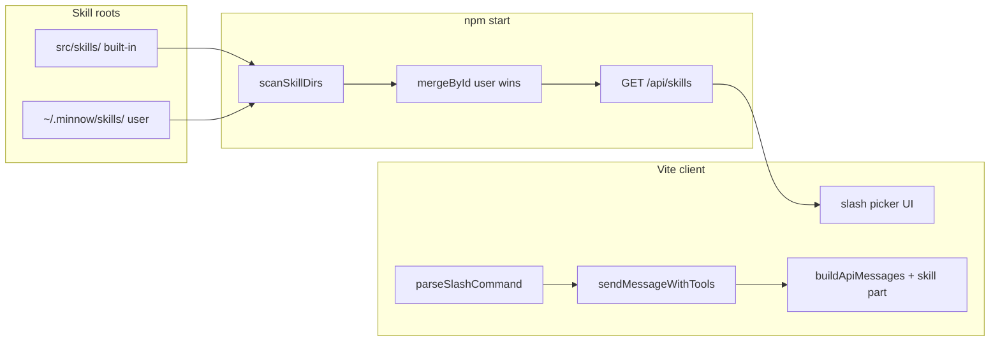

# Step 13 — Skills framework (implementation build plan)

| Field | Value |
|-------|--------|
| **Backlog** | [`documentation/plans/to-fix.md`](../to-fix.md) item **19** (skills + `/` slash usage) |
| **Roadmap** | [`documentation/plans/to-fix-step-order.md`](../to-fix-step-order.md) Step 13 |
| **Depends on** | **Step 02** (`~/.minnow` data layer + server config APIs). **Step 04** (prompt composer with a `skill` part) — minimal hook acceptable if Step 04 is not merged yet (see [Send-path injection](#send-path-injection)). |
| **Blocks** | Step 14 (Impeccable `/impeccable`), Step 15 (UI Designer), Step 19 (self-healing skill authoring) |
| **Out of scope** | Full settings page for skills (Step 20); Impeccable install (Step 14); agent auto-invocation of skills without `/` |

---

## Goal

Users invoke **skills** from the composer with **`/`** (slash commands), similar to Cursor Agent Skills:

1. Type **`/`** → see all available skills (built-in + user).
2. Pick or type **`/<skill-id>`** → that skill’s `SKILL.md` body is injected into the model context for **this send only**.
3. **Built-in** skills ship in-repo under [`src/skills/`](../../../src/skills/).
4. **User / agent** skills live under `~/.minnow/skills/` (Windows: `%USERPROFILE%\.minnow\skills\`).
5. Runtime **merges** both trees; user skill **wins** on duplicate `id`.

No separate “skill pack installer” — adding a folder with `SKILL.md` is enough when discovery is glob-based.

---

## Current codebase (baseline)

| Area | Today | Step 13 change |
|------|--------|----------------|
| System prompt | `#systemPrompt` textarea + [`SYSTEM_PROMPT_PRESETS`](../../../src/constants.ts) | Add **skill layer** after base prompt (Step 04) or append to `sysPrompt` in [`buildApiMessages`](../../../src/tools/loop.ts) |
| Send path | [`sendMessageWithTools`](../../../src/tools/loop.ts) reads `sysPrompt` once per send | Resolve active skill from composer → inject before `buildApiMessages` |
| Composer | [`#msgInput`](../../../index.html), [`src/ui/input.ts`](../../../src/ui/input.ts) | Add slash picker overlay |
| `src/skills/` | **Does not exist yet** | Create tree + default pack |
| Server API | `/api/tools` only | Add `/api/skills` |
| Tests | [`test/demo.py`](../../../test/demo.py) only | Add Node/tsx tests for loader merge |

---

## Architecture



### Merge rules (canonical)

| Rule | Behavior |
|------|----------|
| **Skill id (slash + merge key)** | Front matter **`name`** (required). Directory name must match `name`. Slash command is `/<name>` (e.g. `/impeccable`). Step 14 uses `name: impeccable` — not a separate `id` field. |
| **Built-in root** | `path.join(PROJECT_ROOT, 'src', 'skills')` |
| **User root** | `path.join(resolveSpeedchatHome(), 'skills')` — create directory on first write if missing |
| **Override** | Same `name` in both roots → **user** entry replaces built-in (`source: 'user'`). Applies to `/impeccable` (Step 14). |
| **Invalid entries** | Missing `SKILL.md`, unreadable file, or missing required front matter → **skip** + log warning (do not crash list) |
| **Hidden dirs** | Skip folders starting with `_` **except** `_example` (shipped as documentation template) |
| **Ordering in picker** | Sort by `label` or `name` ascending; group built-in then user optional (or single sorted list) |

---

## SKILL.md contract

Follow [Cursor Agent Skills](https://cursor.com/docs/agent/skills) shape: YAML front matter + markdown body.

### Required front matter

```yaml
---
name: git-commit
description: >-
  Write conventional commit messages from staged diff context. Use when the user
  asks to commit or mentions git commit message.
---
```

| Field | Required | Notes |
|-------|----------|--------|
| `name` | Yes | Stable id; should match folder name; used for `/name` |
| `description` | Yes | One line for picker subtitle + model routing hint (Step 19 may reuse) |

### Optional front matter

| Field | Purpose |
|-------|---------|
| `label` | Display name in picker (default: title-case `name`) |
| `version` | Semver string for UI badge |
| `disable-model-invocation` | If `true`, skill is **only** applied via explicit `/` (default `true` for Minnow v1) |
| `allowed-tools` | Future: restrict tool loop (out of scope v1; document in `_example`) |

### Body

Markdown instructions injected as the **`skill` prompt part** (Step 04) or as an appended system section:

```markdown
# Git commit helper

## When to use
- User asks for a commit message or `/git-commit`

## Steps
1. Run `git_status` and `git_diff` …
```

### Reference template (deliverable)

Ship [`src/skills/_example/SKILL.md`](../../../src/skills/_example/SKILL.md) and [`src/skills/_example/README.md`](../../../src/skills/_example/README.md) documenting:

- Folder layout
- Front matter fields
- How merge/override works
- How to add a user skill under `~/.minnow/skills/<id>/SKILL.md`
- Link to Step 14 `/impeccable` placeholder (folder stub only in Step 13)

---

## Server implementation (`server.js`)

Extend middleware **before** Vite SPA handler (same pattern as `/api/tools`).

### `resolveSpeedchatHome()`

- Shared helper (extract to `server/minnow-home.js` or top of `server.js` if Step 02 not split yet):
  - Unix: `path.join(os.homedir(), '.minnow')`
  - Windows: `%USERPROFILE%\.minnow`
- Ensure `skills/` subdir exists when listing (mkdir with `recursive: true` only for user root, not for missing built-in).

### `scanSkillDir(rootDir, source: 'builtin' | 'user')`

For each **immediate child directory** `entry`:

1. Skip if not a directory.
2. Skip if `entry.name.startsWith('_') && entry.name !== '_example'` → actually **skip `_example` from API list** (template only; not invokable) — document: `_example` is for authors, not shown in `/` picker.
3. Read `path.join(entry, 'SKILL.md')` as UTF-8.
4. Parse front matter (use `gray-matter` **or** minimal regex parser to avoid new dep — prefer **no new dependency**: split on `---` lines).
5. Push `SkillListItem`: `{ id, label, description, source, path }` (do **not** send full body in list).

### Routes

| Route | Method | Response |
|-------|--------|----------|
| `/api/skills/ping` | GET | `{ ok: true }` (optional; mirror tools ping for symmetry) |
| `/api/skills` | GET | `{ skills: SkillListItem[] }` merged |
| `/api/skills/:id` | GET | `{ skill: SkillDetail }` or `404` — includes `body` (markdown after front matter) |

**CORS / OPTIONS:** Same as `/api/tools` (`*`, OPTIONS 204).

**Security:** User root is outside project — only read `SKILL.md` under `~/.minnow/skills/*/`; reject `..` in `:id` param (`^[a-z0-9][a-z0-9-]*$`).

**Vite-only (`npm run dev`):** Client falls back to **bundled manifest** (see below) so slash UI still works for built-ins only.

---

## Client modules (new)

```
src/skills/
  types.ts           # SkillListItem, SkillDetail, ActiveSkill
  parse-frontmatter.ts
  loader.ts          # mergeSkillLists(builtin, user) — pure, unit-tested
  client.ts          # fetchSkills(), fetchSkillById(), cache
  parse-slash.ts     # extractSlashSkillId(text) → { skillId, userText }
  index.ts           # re-exports
src/ui/
  skill-picker.ts    # mountSlashPicker(msgInput), open/close/filter
src/styles/
  skill-picker.css
```

### `loader.ts` (test focus)

Pure functions — **no DOM, no fs**:

- `mergeSkillLists(builtin: SkillListItem[], user: SkillListItem[]): SkillListItem[]`
- `resolveSkillDetail(id, builtinDetails, userDetails): SkillDetail | null`
- `parseSkillFrontmatter(raw: string): { meta, body }` — shared with server or duplicated minimally

### `client.ts`

- On app init (after `detectLocalServer()` in [`initApp`](../../../src/main.ts)): `refreshSkillCatalog()`.
- `GET /api/skills` when server up; cache in module-level `skillCatalog`.
- **Offline / dev:** import static `builtin-skills-manifest.json` generated at build time **or** embed list from a generated `src/skills/manifest.ts` (implementer choice; document in context.md).

### Built-in manifest (recommended)

At `npm run build`, script `scripts/generate-skills-manifest.mjs`:

- Scans `src/skills/**/SKILL.md`
- Writes `src/skills/builtin-manifest.json` (ids + meta only)
- Vite can import JSON for dev-without-server

Keeps picker populated under `npm run dev`.

---

## Slash picker UX

### Triggers

| User action | Behavior |
|-------------|----------|
| Types `/` at start of line or after whitespace | Open picker anchored above `#msgInput` |
| Continues typing `/git` | Filter skills by `id` and `label` prefix (case-insensitive) |
| `ArrowUp` / `ArrowDown` | Move selection |
| `Enter` or `Tab` | Insert `/skill-id ` (trailing space) and close picker |
| `Escape` | Close without change |
| Click item | Same as Enter |

### Visual

- Popover: `.skill-picker` in [`src/styles/skill-picker.css`](../../../src/styles/skill-picker.css)
- Each row: **label** (bold), **id** mono (`/git-commit`), **description** truncated 1 line
- Badge: `Built-in` vs `Custom` from `source`
- `aria-activedescendant`, `role="listbox"`, composer `aria-expanded` when open

### Wiring

- Register in `initApp()` after `initAttachments()`.
- Listen `input` + `keydown` on `#msgInput` (do not break existing `handleKey` Enter-to-send).
- When picker open, Enter selects skill instead of sending (only while open).

---

## Send-path injection

### Parse before send

In [`sendMessageWithTools`](../../../src/tools/loop.ts) (or thin wrapper in `src/chat/messaging.ts`):

```ts
const { skillId, userText } = parseSlashCommand(text);
// history uses userText (or full text if no skill — product choice below)
```

**Recommended history behavior:**

| Field | Value |
|-------|--------|
| Stored user message | `userText` only, or `userText` + footer `[skill: git-commit]` for audit |
| Visible bubble | Same as stored (no raw `/git-commit` line unless user typed extra prose after skill line) |

### Inject into API messages

**Preferred (Step 04 merged):** prompt composer adds part `skill`:

```ts
composeSystemPrompt({
  base: sysPrompt,
  parts: { skill: skillBody }, // enabled when skillId set
});
```

**Interim (Step 04 not merged):** append to system string in `buildApiMessages`:

```ts
const skillBlock = skillBody
  ? `\n\n## Active skill: ${skillId}\n\n${skillBody}`
  : '';
const effectiveSys = (sysPrompt + skillBlock).trim();
```

Only apply on the **turn being sent** (do not persist skill body into `minnow.systemPrompt` preset).

### `buildApiMessages` signature (optional)

```ts
export interface BuildApiMessagesOptions {
  modelId?: string;
  pendingUserText?: string;
  skillInjection?: string; // preformatted block or body only
}
```

Pass `skillInjection` from send path; prepend/append inside single `system` message (one system message is enough for LM Studio).

### Edge cases

| Case | Behavior |
|------|----------|
| Unknown `/foo` | `setStatus('err', 'Unknown skill: foo')`; do not send |
| Server down, skill only in user home | If user skill unavailable, err; built-ins still work via manifest |
| Skill + empty user text | Allow send (skill-only turn) if attachments present OR skill body non-empty |
| Multiple `/skill` tokens | Use **first** match only; rest stay in user text |
| Streaming in progress | Picker disabled (same as composer `disabled`) |

---

## Default skill pack (ship in Step 13)

Expand beyond `_example`. Each folder: `SKILL.md` + optional `README.md`.

| Id | Purpose | Notes |
|----|---------|--------|
| `_example` | Author template | **Excluded** from picker |
| `git-commit` | Conventional commits via git tools | Reference `git_status`, `git_diff` |
| `code-review` | Review diff / file with checklist | Security + style sections |
| `write-tests` | Generate tests for selection | Match project test style (static fixtures) |
| `explain-code` | Teach / walkthrough | Read-only tools bias |
| `debug-error` | Trace `Error:` tool failures | Tie to tool loop patterns |
| `docs-update` | Update README / context.md | Point at `documentation/` |
| `refactor-safe` | Small, tested refactors | Emphasize minimal diff |
| `security-review` | OWASP-style pass | No secret exfiltration |
| `browser-automation` | CDP workflow stub | **Stub** for Step 12; link opencode-browser |
| `impeccable` | UI polish stub | **Stub** body; Step 14 fills + install |

**Quality bar:** Each skill 40–120 lines, actionable steps, references Minnow tools by **id** from [`definitions.ts`](../../../src/tools/definitions.ts).

---

## Integration with other steps

| Step | Integration |
|------|-------------|
| **02** | `~/.minnow/skills/` path, server read/write guard, optional `GET /api/config/paths` |
| **04** | `skill` prompt part in composer order: `… → skill → memory → user` |
| **14** | Replace `src/skills/impeccable/SKILL.md` + postinstall; keep same `id` |
| **15** | `/ui-designer` skill or Work Agent — may share `impeccable` body |
| **19** | Explorer writes new folders under `~/.minnow/skills/`; refresh catalog API |
| **20** | Settings UI: list skills, open folder, disable built-in (future flag in `config.json`) |

---

## Implementation phases (ordered)

### Phase A — Types and parser (no UI)

- [ ] **s13-01** Add `src/skills/types.ts` (`SkillListItem`, `SkillDetail`, `ActiveSkill`, `SkillSource`).
- [ ] **s13-01** Implement `parse-frontmatter.ts` (strict validation; clear errors).
- [ ] **s13-06** Implement `loader.ts` merge + override logic.
- [ ] **s13-13** Unit tests for parser + merge (invalid YAML, duplicate id, empty dirs).

### Phase B — Server discovery

- [ ] **s13-02** `resolveSpeedchatHome()` (align with Step 02 if present).
- [ ] **s13-03** `scanSkillDir` + `GET /api/skills`.
- [ ] **s13-04** `GET /api/skills/:id` with safe id validation.
- [ ] **s13-14** Smoke script against temp `MINNOW_HOME` env override for tests.

### Phase C — Client catalog

- [ ] **s13-05** `client.ts` fetch + in-memory cache + `refreshSkillCatalog()`.
- [ ] Generate **builtin manifest** for `npm run dev` fallback.
- [ ] Call `refreshSkillCatalog()` from `initApp()` after server detect.

### Phase D — Slash picker

- [ ] **s13-08** `skill-picker.ts` + CSS; filter + keyboard nav.
- [ ] **s13-07** `parse-slash.ts` unit tests.
- [ ] Hook `input` / `keydown` on `#msgInput`; integrate with `handleKey`.

### Phase E — Send injection

- [ ] **s13-09** Resolve skill body in `sendMessageWithTools`; inject in `buildApiMessages`.
- [ ] **s13-10** History: strip slash line; optional `[skill: id]` tag.
- [ ] Manual QA: `/git-commit` + message → system contains skill body; user bubble clean.

### Phase F — Default pack + docs

- [ ] **s13-11** `_example` template skill + README.
- [ ] **s13-12** Nine invokable default skills + two stubs (`browser-automation`, `impeccable`).
- [ ] **s13-15** Update [`documentation/context.md`](../../context.md) (skills section, API routes, composer UX).
- [ ] Create [`documentation/plans/verification/step-13.md`](../verification/step-13.md) with commands.

---

## Tests (required)

### Unit — `test/skills-loader.test.ts` (tsx or node:test)

Run: `npx tsx test/skills-loader.test.ts` (add npm script `test:skills` optional).

| Test case | Expected |
|-----------|----------|
| `mergeSkillLists` empty + empty | `[]` |
| built-in only | all `source: 'builtin'` |
| user overrides same id | single entry, `source: 'user'` |
| different ids | union, sorted |
| `parseSkillFrontmatter` valid | meta + body split |
| missing `description` | throw or skip with reason (match server) |
| `parseSlashCommand('/git-commit fix bug')` | `{ skillId: 'git-commit', userText: 'fix bug' }` |
| `parseSlashCommand('hello')` | `{ skillId: null, userText: 'hello' }` |

Use **fixed** fixture strings (no random ids).

### Integration — `scripts/s13-skills-smoke.mjs`

1. Set `MINNOW_HOME` to temp dir with one user skill overriding built-in id.
2. Start server (or call scan helpers if exported).
3. `GET /api/skills` → count ≥ built-in count.
4. `GET /api/skills/git-commit` → body contains fixture string from user override.

### Manual QA checklist

- [ ] `npm start` → type `/` → picker shows built-ins.
- [ ] Select skill → composer shows `/skill-id `.
- [ ] Send → LM Studio request includes skill instructions in system message (inspect network or log debug once).
- [ ] Add `~/.minnow/skills/git-commit/SKILL.md` override → picker shows Custom; send uses override body.
- [ ] `npm run dev` → built-ins still listed (manifest); user skills unavailable with clear status if attempted.

---

## Files to create or modify

| File | Action |
|------|--------|
| `src/skills/**` | **Create** tree |
| `src/ui/skill-picker.ts` | **Create** |
| `src/styles/skill-picker.css` | **Create**; import in `main.ts` |
| `src/tools/loop.ts` | **Modify** send + `buildApiMessages` options |
| `src/main.ts` | **Modify** `initApp` |
| `server.js` | **Modify** `/api/skills` routes |
| `index.html` | **Modify** optional `aria-*` on composer wrapper |
| `package.json` | Optional `test:skills`, `prebuild` manifest script |
| `documentation/context.md` | **Update** |
| `documentation/plans/verification/step-13.md` | **Create** |

---

## Sub-agent handoff (implementer)

1. Read [`documentation/context.md`](../../context.md) and this plan.
2. Confirm Step 02 home-dir helper exists; if not, implement minimal `resolveSpeedchatHome()` here and note duplication for Step 02 merge.
3. Implement **Phase A → F** in order; do not start Step 14 Impeccable install.
4. **Tests:** implement + run; paste command output in verification file.
5. Update **context.md** (skills roots, API, slash UX, send injection).

### Verifier acceptance

- [ ] All unit tests pass.
- [ ] `s13-skills-smoke.mjs` passes against `npm start`.
- [ ] Picker accessible (keyboard + aria).
- [ ] Unknown skill blocks send with error status.
- [ ] User override merge verified by test fixture.
- [ ] `documentation/context.md` updated.
- [ ] No secrets in skill files; user skills path documented.

---

## Open questions (defaults chosen — change only with user input)

| Question | Default for v1 |
|----------|----------------|
| Show `_example` in picker? | **No** (docs only) |
| Persist `[skill: id]` in history? | **Yes** (footer line) |
| Allow multiple skills per message? | **No** (first slash only) |
| Auto-invoke skills without `/`? | **No** (`disable-model-invocation: true`) |
| Skill-specific model? | **No** (Step 20 / Work Agents) |

---

## Summary

Step 13 delivers a **Cursor-compatible SKILL.md** pipeline with **dual roots**, a **server-backed catalog** (plus built-in manifest for Vite-only dev), a **composer slash picker**, and **one-shot skill injection** on the send path, plus an **expanded default pack** and **deterministic loader-merge tests**. Impeccable and UI Designer deepen skills in Steps 14–15 without changing the framework contract.
