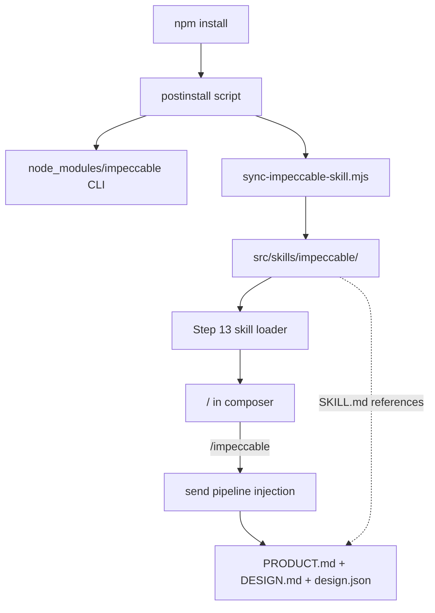

# Step 14 — Impeccable built-in (implementation build plan)

**Backlog:** item **20** in [`documentation/plans/to-fix.md`](../to-fix.md) (Impeccable built-in)  
**Roadmap:** Wave 6 in [`documentation/plans/to-fix-step-order.md`](../to-fix-step-order.md)  
**Depends on:** **Step 13** — Skills framework and default pack ([`to-fix-step-order.md` § Step 13](../to-fix-step-order.md#step-13--skills-framework-and-default-pack))  
**Blocks:** **Step 15** — UI Designer skill/agent ([`to-fix-step-order.md` § Step 15](../to-fix-step-order.md#step-15--ui-designer-skill--work-agent))

---

## Goal

Make [Impeccable](https://impeccable.style) a **first-class, repo-shipped** design skill for Minnow:

1. **Setup** — `npm install` (via `postinstall`) ensures the Impeccable CLI and skill assets are present; contributors do not run a separate manual `npx skills add`.
2. **Built-in skill** — `/impeccable` resolves to `src/skills/impeccable/SKILL.md` (skill id: `impeccable`).
3. **Project context** — The skill and agent instructions **read** existing [`PRODUCT.md`](../../../PRODUCT.md), [`DESIGN.md`](../../../DESIGN.md), and [`.impeccable/design.json`](../../../.impeccable/design.json). **Do not** duplicate tokens, colors, or component specs inside the skill body.
4. **Tests** — Deterministic checks that the skill loads, appears in the skill list, and required context files exist.

**Out of scope for Step 14:**

- UI Designer Work Agent / dedicated model binding → **Step 15**
- Chrome extension install → optional user doc link only
- `/impeccable live` browser variant loop → optional note; full Live Mode needs dev server + HMR (document limitation)
- Rewriting `PRODUCT.md` / `DESIGN.md` content (already populated for Minnow)
- Self-healing skill authoring → **Step 19**

---

## Current repo state (baseline)

| Asset | Status | Notes |
|-------|--------|--------|
| [`PRODUCT.md`](../../../PRODUCT.md) | Present | Register: **product**; meets Impeccable “non-placeholder” bar |
| [`DESIGN.md`](../../../DESIGN.md) | Present | Stitch-style front matter + “Bench Instrument” north star |
| [`.impeccable/design.json`](../../../.impeccable/design.json) | Present | `schemaVersion: 2`, OKLCH tokens, component bindings |
| [`src/skills/`](../../../src/skills/) | **Not yet** | Created in Step 13 |
| `impeccable` npm package | **Not installed** | Add in this step |
| Skills API / slash UI | **Step 13** | This step only registers + tests `impeccable` |

---

## Architecture



### Design principle: single source of truth

| Concern | Source of truth | Skill behavior |
|---------|-----------------|----------------|
| Brand / users / tone | `PRODUCT.md` | Instruct agent to run `load-context.mjs` or read files directly; never invent product facts |
| Visual tokens / typography | `DESIGN.md` + CSS variables in `src/styles/tokens.css` | Point edits at tokens, not hardcoded hex in skill text |
| Machine-readable tokens | `.impeccable/design.json` | Reference for extract/document/critique commands |
| Command reference + anti-patterns | Upstream Impeccable skill (synced) | Vendored under `src/skills/impeccable/`; updated via `npm run impeccable:update` |

---

## Prerequisites from Step 13 (contract)

Implementer **must not** start Step 14 until Step 13 delivers:

| Contract | Requirement |
|----------|-------------|
| Built-in root | `src/skills/<skill-id>/SKILL.md` discovery (glob) |
| User root | `~/.minnow/skills/` merge; **user wins on duplicate `name`** (same as Step 13) |
| Skill id | Front matter **`name`** = slash id (`impeccable` → `/impeccable`); directory name must match |
| API | `GET /api/skills` (or equivalent) returns merged list with `id`, `name`, `description`, `source: 'builtin' \| 'user'` |
| Injection | Selecting `/impeccable` prepends skill body (or `skill` prompt part) before user message |
| Caching | Skill file mtime/hash invalidates loader cache on change |

If Step 13 uses a different API shape, adapt § [Integration hooks](#integration-hooks) but keep acceptance criteria below.

---

## Implementation tasks (full todos)

### Phase A — Package and install hook

#### TODO `s14-01` — Add `impeccable` devDependency

**File:** [`package.json`](../../../package.json)

```json
"devDependencies": {
  "impeccable": "^2.1.9"
}
```

- Pin to current npm major (`2.x`); document upgrade path in README.
- **Do not** add `impeccable` to `dependencies` unless Step 15+ needs it at runtime in production static build (unlikely — CLI is dev/setup only).

**Acceptance:** `npm install` resolves `impeccable` without optional Puppeteer unless URL detect is used.

---

#### TODO `s14-02` — Postinstall sync script

**New file:** [`scripts/sync-impeccable-skill.mjs`](../../../scripts/sync-impeccable-skill.mjs)

Responsibilities:

1. **Idempotent** — safe to run on every `npm install`.
2. **Install skill into repo** — target directory: `src/skills/impeccable/`.
3. **Invoke upstream installer** — first implementation choice:

   ```bash
   npx impeccable skills install --help
   ```

   Implementer must read CLI help and choose the flag that writes into a **project-controlled path** (e.g. `--dir`, `--output`, `--target`). If the CLI only supports harness dirs (`.cursor/skills`), fallback:

   - Run `npx skills add pbakaus/impeccable` with env/dir override **or**
   - Copy from `node_modules` / release artifact into `src/skills/impeccable/` per [impeccable GitHub](https://github.com/pbakaus/impeccable).

4. **Preserve Minnow wrapper** — if sync overwrites `SKILL.md`, merge strategy:
   - `SKILL.md` — Minnow front matter + `{{include}}` or short wrapper (see Phase B)
   - `SKILL.upstream.md` — raw synced content (git-tracked or gitignored — **prefer tracked** with comment header `AUTO-SYNCED — do not edit`)
   - Or: sync only `reference/`, `scripts/` subdirs; keep hand-authored `SKILL.md`

5. **Exit codes** — log warning on network failure; do **not** fail entire `npm install` on optional offline install (configurable `IMPECCABLE_SYNC_STRICT=1` for CI).

**Wire in package.json:**

```json
"scripts": {
  "postinstall": "node scripts/sync-impeccable-skill.mjs",
  "impeccable:sync": "node scripts/sync-impeccable-skill.mjs",
  "impeccable:update": "npx impeccable skills update && node scripts/sync-impeccable-skill.mjs",
  "impeccable:detect": "npx impeccable detect src/ index.html"
}
```

**Acceptance:** Fresh clone + `npm install` populates `src/skills/impeccable/` with skill content; second run is no-op (or updates only when version changes).

---

### Phase B — Minnow skill wrapper

#### TODO `s14-03` — Author `src/skills/impeccable/SKILL.md`

**Path:** [`src/skills/impeccable/SKILL.md`](../../../src/skills/impeccable/SKILL.md)

**Front matter (Cursor Agent Skills format):**

```yaml
---
name: impeccable
description: >-
  Design, critique, audit, and refine Minnow UI using PRODUCT.md, DESIGN.md,
  and .impeccable/design.json. Not for backend-only tasks.
disable-model-invocation: true
---
```

**Front matter (Step 13 contract):** `name` is the slash id and merge key. Do **not** use a separate `id:` field. Optional Cursor-only fields (`user-invocable`, `allowed-tools`) may appear in synced upstream content under `SKILL.upstream.md` only — Minnow loader reads **`name`** + **`description`**.

**Body requirements (Minnow-specific, no duplicate design logic):**

1. **Context gate** — Before UI edits, load context:

   ```bash
   node src/skills/impeccable/scripts/load-context.mjs
   ```

   Or, if synced from upstream, set `scripts_path` to the synced `scripts/` folder under the same directory. **Never** paraphrase colors/type from memory when `DESIGN.md` exists.

2. **File map (read-only pointers):**

   | File | Role |
   |------|------|
   | `PRODUCT.md` | Users, register, anti-references |
   | `DESIGN.md` | Human design spec (Stitch format) |
   | `.impeccable/design.json` | Token JSON for agents/tools |
   | `src/styles/tokens.css` | Runtime CSS variables |
   | `index.html` + `src/styles/*.css` | Implementation targets |

3. **Command routing** — Delegate sub-commands (`polish`, `audit`, `critique`, `craft`, `shape`, `teach`, `document`, …) to synced upstream reference files under `src/skills/impeccable/reference/` (do **not** copy 23 command bodies into Minnow repo prose).

4. **Minnow constraints** — Short bullet list referencing `DESIGN.md` anti-patterns (no gradient text, no hero-metric cards, bench instrument aesthetic). **Link** to `DESIGN.md`; do not restate full token tables.

5. **`IMPECCABLE_CONTEXT_DIR`** — Default: project root. Document override for monorepo forks.

**Acceptance:** Skill body < ~200 lines; token values appear only by reference to `DESIGN.md` / `design.json`, not duplicated literals.

---

#### TODO `s14-04` — Context paths and loader alignment

Ensure Impeccable’s `load-context.mjs` resolves Minnow files:

| Check | Action |
|-------|--------|
| `PRODUCT.md` at repo root | Already present — verify loader finds it |
| `DESIGN.md` at repo root | Already present |
| `.impeccable/design.json` | Add one line in skill: “for structured tokens, read `.impeccable/design.json` when implementing or critiquing components” |
| `register: product` in PRODUCT.md | Matches app UI (not marketing site) |

Optional **thin** script [`src/skills/impeccable/scripts/minnow-context.mjs`](../../../src/skills/impeccable/scripts/minnow-context.mjs):

- Runs upstream `load-context.mjs`
- Appends `designJson` field: parsed `.impeccable/design.json` (validate JSON, fail with clear error)
- Output consumed by agent in one JSON blob (no `head`/`grep`/`jq` truncation per upstream skill rules)

**Acceptance:** `node src/skills/impeccable/scripts/minnow-context.mjs` exits 0 and JSON includes `contextDir`, `product`, `design`, `designJson`.

---

### Phase C — Step 13 integration

#### TODO `s14-05` — Register with skill loader

| Integration point | Expected behavior |
|-------------------|-------------------|
| Discovery | `impeccable` appears in built-in scan of `src/skills/` |
| `/` picker | Typing `/` lists **Impeccable** with description from front matter |
| `/impeccable` | Selects skill; composer shows chip or prefix indicator |
| `/impeccable polish sidebar` | Passes tail as user message augmentation per Step 13 rules |
| Override | User skill `~/.minnow/skills/impeccable/SKILL.md` **replaces** built-in when `name: impeccable` matches (Step 13: user wins on duplicate `name`) |

**Acceptance:** Manual — `npm start` → composer `/` → `impeccable` visible → send smoke message injects skill header in API payload (log or debug flag).

---

#### TODO `s14-06` — Server API (conditional)

If Step 13 implements `GET /api/skills`:

- Built-in entry includes `"id": "impeccable"`, `"builtin": true`, `"path": "src/skills/impeccable/SKILL.md"`.
- Optional `GET /api/skills/impeccable` returns parsed front matter + body length (not necessarily full body on every request).

**Acceptance:** `curl http://localhost:5173/api/skills` includes `impeccable` when server up.

---

### Phase D — Developer ergonomics

#### TODO `s14-07` — npm scripts

Already specified in Phase A; additionally:

| Script | Purpose |
|--------|---------|
| `impeccable:sync` | Re-run vendoring without full install |
| `impeccable:update` | Pull latest upstream skill + sync |
| `impeccable:detect` | CI-friendly anti-pattern scan on `src/`, `index.html` |

Document exit code `2` = issues found (for future CI gate).

---

#### TODO `s14-08` — Documentation

**Update [`README.md`](../../../README.md):**

- After `npm install`, Impeccable skill is available via `/impeccable` when using `npm start`.
- Link: https://impeccable.style/docs
- Optional: `npm run impeccable:detect` before PRs touching UI.
- Note: Chrome extension is optional (Web Store link).

**Update [`documentation/context.md`](../../context.md):**

- New subsection **Skills → Impeccable built-in**
- Paths: `src/skills/impeccable/`, scripts, postinstall behavior
- Relationship to Step 15 UI Designer

**Do not** create duplicate design docs; point to existing `DESIGN.md` / `.impeccable/design.json`.

---

### Phase E — Tests

#### TODO `s14-09` — Automated tests

**Preferred location:** [`test/skills-impeccable.test.mjs`](../../../test/skills-impeccable.test.mjs)  
**Or extend:** [`scripts/sa16-smoke.mjs`](../../../scripts/sa16-smoke.mjs) with `--skills` flag.

Use **fixed** paths and **static** expected strings (project test guidelines).

| Test case | Setup | Assert (static) |
|-----------|--------|-----------------|
| `skill directory exists` | After `npm install` (or mock fixture dir) | `src/skills/impeccable/SKILL.md` is a file |
| `front matter name` | Read file | Contains `name: impeccable` (canonical slash id) |
| `context files present` | Repo root | `PRODUCT.md`, `DESIGN.md`, `.impeccable/design.json` exist |
| `design.json valid` | `JSON.parse` | `schemaVersion === 2` |
| `loader lists skill` | `GET /api/skills` with `npm start` **or** import Step 13 loader module | Response/array includes object with `id: "impeccable"` |
| `load skill body` | Loader API `loadSkill('impeccable')` | `body.length > 500` and includes substring `PRODUCT.md` (or `load-context`) |
| `sync script idempotent` | Run `node scripts/sync-impeccable-skill.mjs` twice | Exit 0 both times |
| `no duplicate accent token in skill` | Read SKILL.md | Must **not** contain full OKLCH string from design.json (e.g. `oklch(88.769% 0.2563 138.508`) — proves no copy-paste of tokens |

**Test command (document in verification file):**

```bash
node --test test/skills-impeccable.test.mjs
```

If Step 13 adds `npm test`, wire this file into the root test runner.

**Acceptance:** All tests pass on clean tree after `npm install`.

---

#### TODO `s14-10` — Verification artifact

**Create:** [`documentation/plans/verification/step-14.md`](../verification/step-14.md)

```markdown
## Commands
1. npm install
2. node --test test/skills-impeccable.test.mjs
3. npm start (background)
4. curl -s http://localhost:5173/api/skills | findstr impeccable   # Windows
   # curl -s http://localhost:5173/api/skills | grep impeccable     # Unix

## Manual
1. Open app → composer → type `/` → Impeccable listed
2. Select `/impeccable` → send "list commands" → model acknowledges design commands
3. Confirm PRODUCT.md / DESIGN.md not modified by install
```

---

## Integration hooks

### Send pipeline (Step 13)

When user selects `/impeccable` (optional args in same message):

```text
[System or skill part]
<contents of SKILL.md>

[User]
{composer text without leading /impeccable if stripped}
```

- Strip leading `/impeccable` from displayed user bubble if Step 13 shows skill chip separately.
- Include `skill: impeccable` in prompt config debug metadata (Step 04) if prompt parts exist.

### Prompt part `skill` (Step 04, if landed)

If programmatic prompts define a `skill` part, `/impeccable` should set `skill` part enabled with this skill’s body — do not duplicate into `base`.

### Tools allowlist

Skill front matter `allowed-tools: Bash(npx impeccable *)` — ensure tool loop does **not** block `npx impeccable detect` when server tools run (browser-only is fine).

---

## File checklist (deliverables)

| Path | Action |
|------|--------|
| `package.json` | `devDependencies.impeccable`, `postinstall`, scripts |
| `scripts/sync-impeccable-skill.mjs` | **New** — vendoring |
| `src/skills/impeccable/SKILL.md` | **New** — wrapper |
| `src/skills/impeccable/scripts/` | **New/synced** — load-context, pin, etc. |
| `src/skills/impeccable/reference/` | **Synced** — command references |
| `test/skills-impeccable.test.mjs` | **New** — deterministic tests |
| `documentation/plans/verification/step-14.md` | **New** |
| `README.md` | Setup + `/impeccable` |
| `documentation/context.md` | Impeccable subsection |

**Do not modify** (unless teach/document explicitly requested by user):

- `PRODUCT.md`, `DESIGN.md`, `.impeccable/design.json` content
- `src/styles/*` (except bugfixes found by `impeccable detect` — separate commit)

---

## Sub-agent prompts

### Implementer

```
You are implementing Step 14 — Impeccable built-in for Minnow.

Read:
- documentation/plans/Build out/step-14-impeccable-builtin.md (this file)
- documentation/plans/to-fix-step-order.md (Step 14 summary)
- documentation/context.md
- Step 13 deliverables (src/skills loader, /api/skills, slash UI) — must exist first

Tasks:
1. Add impeccable@^2.1.9 devDependency + postinstall sync script → src/skills/impeccable/
2. Create Minnow SKILL.md wrapper (`name: impeccable`) — reference PRODUCT.md, DESIGN.md, .impeccable/design.json; NO duplicate token tables
3. Wire skill into Step 13 discovery and /impeccable injection
4. Add npm scripts: impeccable:sync, impeccable:update, impeccable:detect
5. Write test/skills-impeccable.test.mjs (static assertions)
6. Update README.md + documentation/context.md
7. Create documentation/plans/verification/step-14.md
8. Run tests; fix until green

Out of scope: UI Designer (Step 15), Chrome extension bundling, rewriting design docs.

Update documentation/context.md for any new paths or APIs.
```

### Verifier

```
Verify Step 14 only. Read documentation/plans/verification/step-14.md and acceptance criteria in step-14-impeccable-builtin.md.

1. npm install
2. node --test test/skills-impeccable.test.mjs
3. Confirm src/skills/impeccable/SKILL.md exists with id impeccable
4. With npm start: GET /api/skills includes impeccable (if API exists)
5. Manual or scripted: / picker lists Impeccable
6. Confirm PRODUCT.md, DESIGN.md, .impeccable/design.json unchanged by install
7. Report PASS/FAIL — do not implement fixes
```

---

## Acceptance criteria (definition of done)

- [ ] `npm install` runs postinstall without error (or documented optional network warn)
- [ ] `src/skills/impeccable/SKILL.md` exists and is listed as skill id **`impeccable`**
- [ ] `/impeccable` appears in composer `/` picker (with `npm start`)
- [ ] Skill instructions reference **`PRODUCT.md`**, **`DESIGN.md`**, **`.impeccable/design.json`** — not duplicated design token tables
- [ ] `npx impeccable detect src/` runs via `npm run impeccable:detect`
- [ ] `node --test test/skills-impeccable.test.mjs` passes
- [ ] `documentation/context.md` documents Impeccable built-in
- [ ] `README.md` documents install + `/impeccable` usage
- [ ] Verifier agent reports **PASS**

---

## Risks and mitigations

| Risk | Mitigation |
|------|------------|
| `impeccable skills install` only targets `.cursor/skills` | Fallback copy script from release zip; document `IMPECCABLE_SKILL_TARGET=src/skills/impeccable` env in sync script |
| postinstall fails offline | Non-strict default; CI sets `IMPECCABLE_SYNC_STRICT=1` |
| Sync overwrites custom wrapper | Split `SKILL.md` (hand) vs `reference/` (synced) |
| Step 13 not merged | Block Step 14; stub loader interface documented in Step 13 plan |
| Skill body too large for context | Loader sends summary + on-demand `GET /api/skills/impeccable`; full body only when selected |
| Upstream skill update breaks paths | Pin `impeccable` version; `impeccable:update` in maintainer docs |

---

## References

| Resource | URL |
|----------|-----|
| Impeccable site | https://impeccable.style |
| Getting started | https://impeccable.style/tutorials/getting-started |
| Command docs | https://impeccable.style/docs |
| npm package | https://www.npmjs.com/package/impeccable |
| GitHub | https://github.com/pbakaus/impeccable |
| Skills CLI install | `npx skills add pbakaus/impeccable` / `npx impeccable skills install` |
| Minnow design context | [`DESIGN.md`](../../../DESIGN.md), [`.impeccable/design.json`](../../../.impeccable/design.json) |
| Parent roadmap | [`documentation/plans/to-fix-step-order.md`](../to-fix-step-order.md) |

---

## Follow-on (Step 15 preview)

Step 15 **UI Designer** will:

- Call `/impeccable` workflow (critique → shape → implement)
- Use Step 12 screenshot tools for visual input
- Bind optional dedicated provider/model in settings (Step 08 / 20)

Do not implement Step 15 hooks in Step 14 beyond a one-line comment in `SKILL.md` (“UI Designer agent may invoke this skill automatically”).
