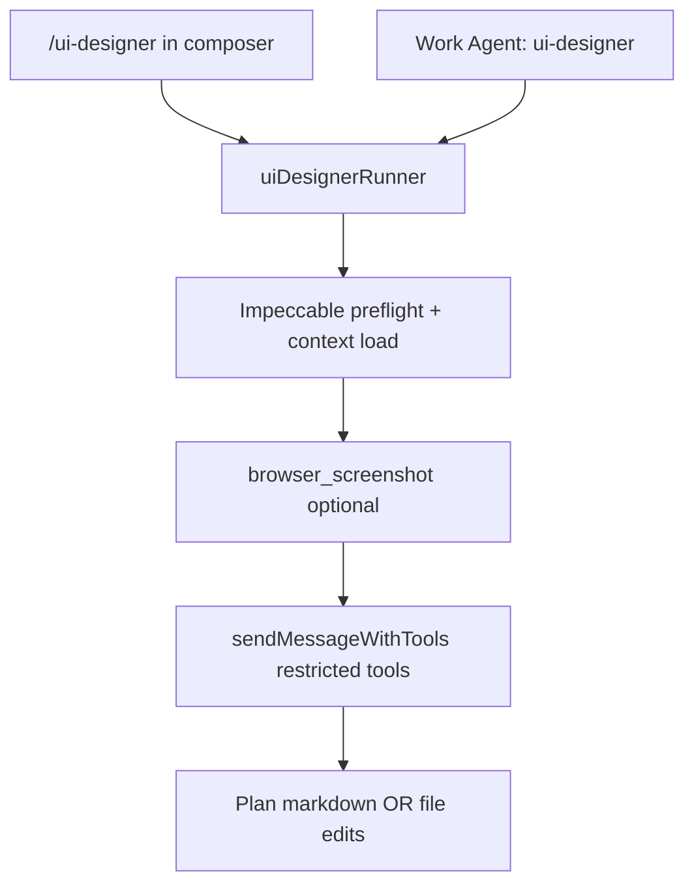

# Step 15 — UI Designer skill / Work Agent

**Step ID:** `s15-ui-designer`  
**Backlog:** [`to-fix.md`](../to-fix.md) item **21** (UI Designer tool/skill)  
**Roadmap:** [`to-fix-step-order.md`](../to-fix-step-order.md) — Wave 6, after Impeccable  
**Status:** Not started (plan only)

---

## Summary

Ship a **UI Designer** agent surface that combines:

1. **Impeccable** design workflow (preflight gates, `shape` → `craft`, PRODUCT/DESIGN context) via Step 14’s `/impeccable` skill.
2. **Visual evidence** from Step 12’s `browser_screenshot` (and related CDP tools) with inline chat display.
3. **Dedicated provider + model** binding from Step 08’s Work Agent registry, stored in `~/.speedchat` config (settings UI finalized in Step 20).

Users invoke UI design work via **`/ui-designer`** in the composer **or** by selecting the **UI Designer** Work Agent. Both paths share one runner, one tool allowlist, and one config key for model routing.

---

## Dependencies (must be complete first)

| Step | Delivers for Step 15 | If missing |
|------|------------------------|------------|
| **02** | `~/.speedchat/config.json`, config API | Cannot persist `uiDesigner` model binding |
| **03** | Provider registry, per-request provider resolution | Model binding has nowhere to resolve |
| **08** | Work Agent registry, per-agent `providerId` + `modelId`, prompt files | Work Agent entry point blocked |
| **12** | `browser_screenshot`, screenshot message type, CDP executor | No automated UI capture in loop |
| **13** | Skill loader, `/` picker, skill injection in send pipeline | No `/ui-designer` slash |
| **14** | Impeccable install hook, `src/skills/impeccable/SKILL.md`, `npx impeccable` in setup | No design workflow or `/impeccable` chain |

**Not required for v1:** Step 11 (file viewer), Step 20 (full settings page) — stub config fields and minimal drawer row are enough until Step 20.

**Parallel note:** Step 15 can start **integration design** once Step 14’s skill file exists; **E2E verification** needs Step 12 screenshots working.

---

## Product intent (from backlog)

- Runs **Impeccable** tasking and workflow (not ad-hoc “make it pretty” prompts).
- Can **screenshot** the running UI (SpeedChat or debug Chrome tab) and use images in critique/planning.
- Outputs either a **UI change plan** (markdown in chat + optional `documentation/plans/…`) or **implements** UI edits in `index.html`, `src/styles/`, `src/ui/`.
- **Provider and model** for UI Designer are **manually set** in config (defaults: same as chat until user overrides).
- Callable as **`/ui-designer`** skill **or** **Work Agent** profile.

---

## Architecture

### Dual entry, single runner



| Entry | Behavior |
|-------|----------|
| **`/ui-designer`** | Skill injection: prepend `src/skills/ui-designer/SKILL.md` body + user message; set **active Work Agent id** to `ui-designer` for one turn (or until cleared). |
| **Work Agent picker** | Sets `activeWorkAgentId: "ui-designer"`; merges `src/chat/prompts/work-agents/ui-designer/system.md` into system stack (Step 04 `work-agent` part). |

Both paths call the same module: `src/agents/ui-designer/runner.ts` (name TBD).

### Relationship to `/impeccable`

- **`/impeccable`** remains the **general** Impeccable skill (all 23 commands, user-driven sub-commands).
- **`/ui-designer`** is a **specialized orchestrator** that:
  - Embeds a **fixed workflow** (audit → screenshot → shape brief → plan or craft).
  - **Delegates** to Impeccable via documented sub-commands (`impeccable audit`, `impeccable shape`, `impeccable craft`, `impeccable polish`) rather than re-copying reference files.
  - Injects **SpeedChat-specific** targets: `index.html`, `src/styles/*`, `DESIGN.md`, `.impeccable/design.json`.

Skill front matter should list `relatedSkills: [impeccable]` and instruct the model to run `node …/load-context.mjs` before mutations.

### Dedicated model binding

Config shape (extends Step 02 `config.json`):

```json
{
  "uiDesigner": {
    "providerId": "lmstudio-local",
    "modelId": "your-vlm-or-chat-model-id",
    "fallbackToChatModel": true
  }
}
```

Resolution order in `resolveUiDesignerModel()`:

1. If `uiDesigner.providerId` + `modelId` set and provider reachable → use them.
2. Else if `fallbackToChatModel` (default `true`) → active chat’s provider/model.
3. Else → status error: “Configure UI Designer model in Settings.”

Wire in [`src/tools/loop.ts`](../../../src/tools/loop.ts) when `activeWorkAgentId === 'ui-designer'` or `skillId === 'ui-designer'`.

Step 20 adds full Settings section; Step 15 ships **API + schema + placeholder** in existing drawer (`#uiDesignerModel` row, disabled until Step 20 if needed).

---

## Impeccable workflow (normative for UI Designer)

The UI Designer agent must follow Impeccable **gates** before editing project files. Encode this in `SKILL.md` and the Work Agent system prompt.

| Phase | Impeccable action | SpeedChat-specific |
|-------|-------------------|-------------------|
| **0. Preflight** | `load-context.mjs` → PRODUCT.md + DESIGN.md | Fail fast if PRODUCT.md placeholder; suggest `npx impeccable teach` |
| **1. Observe** | — | `browser_navigate` → app URL; `browser_screenshot`; attach PNG to user turn (VLM) |
| **2. Audit** | `impeccable audit` (or `critique`) on target surface | Default target: main chat shell (`#app` or `body`) |
| **3. Shape** | `impeccable shape` | User confirms brief; store brief in assistant message or `~/.speedchat/ui-designer/last-shape.json` |
| **4a. Plan mode** | — | Output markdown plan under `documentation/plans/` only; **no** file edits until user says implement |
| **4b. Implement mode** | `impeccable craft` / `polish` | Edit allowed paths: `index.html`, `src/**/*.css`, `src/ui/**`, `DESIGN.md` (document only with user OK) |
| **5. Verify** | Optional `impeccable live` | Re-screenshot; diff description in chat |

Emit once per turn before edits:

```text
IMPECCABLE_PREFLIGHT: context=pass product=pass command_reference=pass shape=pass|not_required image_gate=pass|skipped:<reason> mutation=open|closed
```

**Plan vs implement:** Composer hint after `/ui-designer`: “Reply **plan** or **implement** (default: plan).” Store mode in session metadata `uiDesignerMode: 'plan' | 'implement'`.

---

## Tool allowlist

UI Designer turns use a **restricted** tool set (override `getEnabledToolDefinitions()` for that turn).

| Tool | Purpose |
|------|---------|
| `browser_list` | Find SpeedChat / target tab |
| `browser_navigate` | Open URL under test |
| `browser_snapshot` | a11y tree for element refs |
| `browser_screenshot` | Visual capture → chat image |
| `browser_click` / `browser_fill` | Live iteration (implement mode only) |
| `read_file` | Read CSS/HTML/TSX UI modules |
| `read_file_range` | Large files |
| `search_in_file` | Find class names, tokens |
| `replace_text_in_file` | Surgical edits |
| `save_file` | New partials (implement mode) |
| `list_directory` | Discover `src/ui`, styles |

**Excluded by default:** `git_*`, `execute_command`, `run_javascript`, `run_python`, `delete_path`, `web_search` (avoid distraction). User can widen via `~/.speedchat/ui-designer.json` `extraTools: string[]` later.

**Impeccable CLI:** Run via server wrapper tool `run_impeccable` (new) **or** document as Bash-only in skill (prefer server tool for Windows parity):

```json
{ "name": "run_impeccable", "args": { "command": "audit", "target": "src/styles/messages.css" } }
```

Implement `run_impeccable` in `server.js`: spawn `npx impeccable <command> …`, cap stdout, 60s timeout, cwd = project root.

---

## File deliverables

| Path | Purpose |
|------|---------|
| [`src/skills/ui-designer/SKILL.md`](../../../src/skills/ui-designer/SKILL.md) | Slash skill: workflow, allowlist, Impeccable delegation |
| [`src/chat/prompts/work-agents/ui-designer/system.md`](../../../src/chat/prompts/work-agents/ui-designer/system.md) | Work Agent system prompt (mirrors skill + agent role) |
| [`src/agents/ui-designer/runner.ts`](../../../src/agents/ui-designer/runner.ts) | Preflight, mode, model resolution, screenshot hook |
| [`src/agents/ui-designer/config.ts`](../../../src/agents/ui-designer/config.ts) | Read `uiDesigner` from `~/.speedchat` |
| [`src/agents/work-agent-registry.ts`](../../../src/agents/work-agent-registry.ts) | Register `ui-designer` via Step 08 `registry.json` + `getWorkAgent('ui-designer')` |
| [`server.js`](../../../server.js) | `run_impeccable` handler (if not only skill-delegated) |
| [`src/tools/definitions.ts`](../../../src/tools/definitions.ts) | Optional `run_impeccable` schema |
| [`documentation/verification/step-15.md`](../../verification/step-15.md) | Verifier commands (implementer creates) |
| [`documentation/context.md`](../../context.md) | UI Designer section (implementer updates) |

### `SKILL.md` front matter (template)

```yaml
---
id: ui-designer
name: UI Designer
description: Impeccable-guided UI audit, screenshot capture, plan or implement SpeedChat surfaces.
user-invocable: true
argument-hint: "[plan|implement] [target description]"
requires:
  skills: [impeccable]
  steps: [12, 14]
allowed-tools:
  - browser_screenshot
  - browser_navigate
  - read_file
  - replace_text_in_file
  # … full list from allowlist table
---
```

---

## Implementation todos

### Phase A — Config and registry

- [ ] **A1** Add `uiDesigner` block to `~/.speedchat/config.json` schema + defaults in server config module (Step 02).
- [ ] **A2** Implement `loadUiDesignerConfig()` / `resolveUiDesignerModel()` in `src/agents/ui-designer/config.ts`.
- [ ] **A3** Register Work Agent `ui-designer` in `src/chat/prompts/work-agents/` + [`src/agents/work-agent-registry.ts`](../../../src/agents/work-agent-registry.ts) (Step 08 API: `listWorkAgents()`, `getWorkAgent('ui-designer')`) with `promptPath`, `defaultTools`, provider/model from `uiDesigner` config.
- [ ] **A4** Extend `buildApiMessages` / tool loop to pass `workAgentId` and resolve provider/model for UI Designer turns.

### Phase B — Skill and prompts

- [ ] **B1** Create `src/skills/ui-designer/SKILL.md` with full Impeccable workflow, plan/implement modes, SpeedChat paths.
- [ ] **B2** Create `src/chat/prompts/work-agents/ui-designer/system.md` (aligned with skill; no drift).
- [ ] **B3** Wire `/ui-designer` in skill discovery (Step 13): appears in `/` picker after `impeccable`.
- [ ] **B4** On slash select: inject skill body + set `activeWorkAgentId` for session turn; clear after send completes (or sticky per product decision — **default: one turn**).

### Phase C — Screenshot and multimodal

- [ ] **C1** Helper `captureUiScreenshot(url?)` → calls `browser_screenshot`, returns base64 + attaches to pending user message as image part (Step 12 message type).
- [ ] **C2** Default URL: `http://127.0.0.1:${PORT}` from `npm start` (read from env or ping).
- [ ] **C3** Render screenshot bubbles in chat history ([`src/ui/messages.ts`](../../../src/ui/messages.ts) — Step 12 dependency).
- [ ] **C4** Require **VLM** or vision-capable model for screenshot turns; if model lacks vision, return clear error: “UI Designer screenshots need a vision model; set uiDesigner.modelId in settings.”

### Phase D — Impeccable integration

- [ ] **D1** Confirm Step 14: `npm run setup` (or `postinstall`) runs `npx impeccable` / copies skill; document in README.
- [ ] **D2** Add server tool `run_impeccable` OR document-only invocation via `execute_command` with allowlist (prefer dedicated tool).
- [ ] **D3** Implement preflight checker in `runner.ts`: run `node node_modules/impeccable/.../load-context.mjs` (path from Step 14 install).
- [ ] **D4** Block file mutations in **plan** mode at tool router (reject `save_file`, `replace_text_in_file` with user-visible message).

### Phase E — Runner and UX

- [ ] **E1** Implement `runUiDesignerTurn({ mode, userText, chat })` orchestrating preflight → optional screenshot → `sendMessageWithTools` with allowlist.
- [ ] **E2** Composer: when user types `/ui-designer`, show sub-hint “plan (default) or implement”.
- [ ] **E3** Work Agent selector (minimal): list includes “UI Designer” when Step 08 UI exists; uses same runner.
- [ ] **E4** Status pill messages: “UI Designer · auditing…”, “· capturing screenshot…”, “· plan mode (no edits)”.

### Phase F — Docs and verification

- [ ] **F1** Update [`documentation/context.md`](../../context.md): UI Designer entry points, config keys, tool allowlist, Impeccable chain.
- [ ] **F2** Add README section: Chrome `--remote-debugging-port=9222`, vision model, `/ui-designer plan`.
- [ ] **F3** Create [`documentation/verification/step-15.md`](../../verification/step-15.md) with commands below.
- [ ] **F4** Implementer runs tests; verifier re-runs (sub-agent workflow).

---

## Tests

### Unit tests (`test/ui-designer/` or `scripts/step15-*.mjs`)

| ID | Test | Expected |
|----|------|----------|
| **U1** | `resolveUiDesignerModel` with full config | Returns configured provider + model |
| **U2** | `resolveUiDesignerModel` with empty config + `fallbackToChatModel: true` | Returns chat model |
| **U3** | `resolveUiDesignerModel` with empty config + `fallbackToChatModel: false` | Throws or returns error object |
| **U4** | `filterToolsForUiDesigner(allTools)` | Only allowlist ids present |
| **U5** | Plan mode blocks `save_file` in router | `Error: UI Designer plan mode does not allow file writes` |
| **U6** | Skill loader finds `ui-designer` | `id`, `name`, `requires.skills` includes `impeccable` |

Use **fixed** config fixtures under `test/fixtures/ui-designer-config.json` (no random IDs).

### Integration tests (`scripts/step15-smoke.mjs`)

Prerequisites: `npm start`, mock CDP **or** recorded `browser_screenshot` fixture (Step 12 pattern).

| ID | Test | Expected |
|----|------|----------|
| **I1** | `GET /api/config/meta` (Step 02) includes `uiDesigner` defaults | 200 + schema keys |
| **I2** | `run_impeccable` with `{ command: "audit", target: "DESIGN.md" }` | stdout contains audit sections or exit 0 |
| **I3** | POST tool `browser_screenshot` (mock CDP) | base64 image string length > 100 |
| **I4** | Simulated slash inject builds system message containing `IMPECCABLE_PREFLIGHT` instruction | Static substring match |

### Manual QA checklist

1. **Setup:** `npm start`, Chrome debug port on, vision model selected for UI Designer.
2. **`/ui-designer plan`:** Assistant returns audit + shape questions; **no** files modified.
3. **`/ui-designer implement`** (after confirming shape): CSS/HTML edits land in repo; second screenshot in chat.
4. **Work Agent:** Select UI Designer → same behavior as slash.
5. **Model override:** Set `uiDesigner.modelId` to different model in config → network tab shows that model id on request.
6. **Missing Impeccable:** Remove skill → clear error pointing to Step 14 setup.
7. **No CDP:** Screenshot step fails gracefully; text-only audit still works if user pastes screenshot manually.

---

## Verification file template

Implementer creates `documentation/verification/step-15.md`:

```bash
# From repo root, server running on PORT (default 5173)
npm run build
npx tsx scripts/step15-smoke.mjs http://localhost:5173
# Optional: npx tsx test/ui-designer/config.test.ts
```

Expected: all **U\*** and **I\*** PASS; manual checklist signed in PR or step report.

---

## Acceptance criteria (verifier)

- [ ] `/ui-designer` appears in `/` skill list; invoking it injects UI Designer instructions.
- [ ] Work Agent **UI Designer** uses dedicated `uiDesigner` model when configured.
- [ ] Impeccable preflight gates documented and enforced in plan mode (no writes).
- [ ] `browser_screenshot` result visible inline in chat when CDP + vision model available.
- [ ] `run_impeccable` or equivalent succeeds for `audit` on project root.
- [ ] `documentation/context.md` updated.
- [ ] `npm run build` passes; `step15-smoke.mjs` passes.
- [ ] No regression to default chat send when UI Designer not active.

---

## Out of scope (Step 15)

- Full Settings page UI for UI Designer model (Step 20).
- Sub-agent spawning dedicated UI Designer children (Step 09) — optional follow-up.
- Auto-running `impeccable live` / Chrome extension Live Mode.
- Editing `PRODUCT.md` without explicit user request (Impeccable `teach` flow).
- Non-UI files (server.js tool logic, `src/tools/loop.ts` business rules) unless user asks.

---

## Open questions (align before implement)

1. **Sticky Work Agent:** Should UI Designer stay active across turns until user clears, or only one turn per `/ui-designer`?
2. **Default mode:** Plan-only first message vs always ask plan/implement?
3. **`run_impeccable`:** Dedicated server tool vs allowlisted `execute_command` — security vs simplicity?
4. **Screenshot target:** Always SpeedChat tab vs user-supplied URL?
5. **User-provided Work Agent copy:** Replace stub `system.md` when prompts arrive (Step 08 note).

---

## Sub-agent handoff (implementer)

1. Read [`documentation/context.md`](../../context.md), this plan, Steps **08, 12, 13, 14** verification files.
2. Confirm dependencies merged; if Step 12 mock CDP exists, use it for **I3**.
3. Complete todos **A → F** in order; parallelize **B** + **A** after schema known.
4. Write tests with **static** expected strings.
5. Update `context.md`; create `documentation/verification/step-15.md`.
6. Hand off to **verifier** with PASS/FAIL criteria above.

---

## Sub-agent handoff (verifier)

1. Do not implement features.
2. Run `documentation/verification/step-15.md` commands on clean tree.
3. Spot-check manual QA items **1, 2, 5** minimum.
4. Report PASS/FAIL with logs; FAIL returns to implementer.

---

## References

| Resource | URL / path |
|----------|------------|
| Backlog | [`documentation/plans/to-fix.md`](../to-fix.md) #21 |
| Step order | [`documentation/plans/to-fix-step-order.md`](../to-fix-step-order.md) |
| Impeccable | https://impeccable.style |
| Impeccable skill (reference) | User/global `impeccable/SKILL.md` |
| opencode-browser (CDP) | https://github.com/different-ai/opencode-browser |
| Design context | [`PRODUCT.md`](../../../PRODUCT.md), [`DESIGN.md`](../../../DESIGN.md), [`.impeccable/design.json`](../../../.impeccable/design.json) |
| Current UI shell | [`index.html`](../../../index.html), [`src/styles/`](../../../src/styles/) |

---

## Summary table

| Item | Value |
|------|--------|
| Backlog | 21 |
| Depends on | 02, 03, 08, 12, 13, 14 |
| Blocks | — (Step 20 consumes config UI) |
| Entry points | `/ui-designer`, Work Agent `ui-designer` |
| Key integrations | Impeccable, CDP screenshot, dedicated model |
