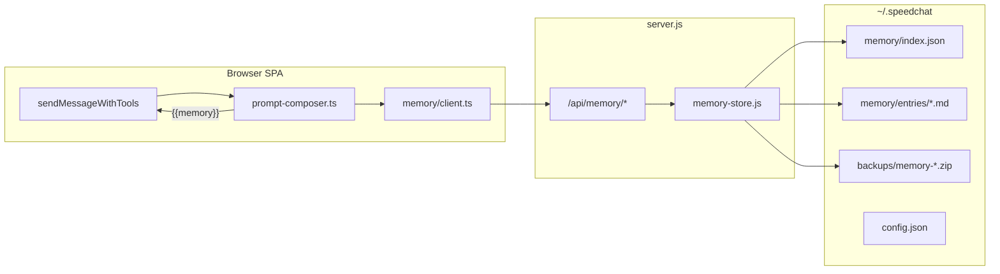

# Step 16 — Memory system — Implementation build plan

| Field | Value |
|-------|--------|
| **Step ID** | 16 |
| **Title** | Memory system |
| **Backlog** | [`documentation/plans/to-fix.md`](../to-fix.md) item **23** (memory system) |
| **Roadmap** | [`documentation/plans/to-fix-step-order.md`](../to-fix-step-order.md) — Wave 7 |
| **Depends on** | **Step 02** (`~/.speedchat` data layer, server config API) |
| **Integrates with** | **Step 04** (prompt composer `memory` part, `{{memory}}` token) |
| **Optional consumers** | Step 19 (self-healing records fixes), Step 20 (settings UI: backup, master toggle) |
| **Out of scope (this step)** | Vector embeddings / semantic search; full settings page UI (Step 20); agent-facing `add_memory` tool in the 32-tool catalog (optional stretch — see §12) |

**Read first:** [`documentation/context.md`](../../context.md), Step 02 plan (`step-02-speedchat-home-dir.md`), Step 04 plan (`step-04-programmatic-prompts.md`), [`server.js`](../../../server.js), [`src/tools/loop.ts`](../../../src/tools/loop.ts), [`src/ui/settings.ts`](../../../src/ui/settings.ts).

---

## 1. Goal

Ship a **durable, user-controlled memory store** under `~/.speedchat/memory/` with:

- **Global enable/disable** (and optional per-chat override)
- **CRUD** over HTTP when `npm start` is running
- **Clear** (all entries, with optional archive)
- **Backup / restore** (export/import the memory tree)
- **Prompt injection** via Step 04’s composer: when memory is enabled, retrieved text is interpolated into the `memory` prompt part as `{{memory}}` before each send

Embeddings and semantic retrieval are **explicitly deferred**; v1 uses structured files + simple relevance ranking.

---

## 2. Success criteria (acceptance)

The step is **done** when a verifier can confirm:

1. With `SPEEDCHAT_HOME` (or default `~/.speedchat`) and `npm start`:
   - `GET /api/memory/ping` → `{ "ok": true }`
   - CRUD lifecycle works: create → list → get → update → delete
   - `POST /api/memory/clear` removes entries (or moves them to archive per spec)
   - `POST /api/memory/backup` writes a timestamped archive under `~/.speedchat/backups/`
   - `POST /api/memory/restore` restores from a named backup id
2. With memory **enabled** in config and at least one entry, `composeSystemPrompt()` (Step 04) includes a non-empty `memory` section and `{{memory}}` is replaced in the composed system string.
3. With memory **disabled**, the `memory` part is omitted (or empty) and **no** memory HTTP fetch runs on send.
4. **Lite** profile caps injected memory size (shorter block than Full).
5. All automated tests in §11 pass; `npm run build` succeeds.
6. [`documentation/context.md`](../../context.md) documents paths, API, config flags, and send-path behavior.
7. Implementer created [`documentation/plans/verification/step-16.md`](../verification/step-16.md); verifier re-runs commands and reports PASS/FAIL.

---

## 3. Prerequisites (Step 02 contract)

Do **not** start Step 16 until Step 02 provides:

| Capability | Used by memory |
|------------|----------------|
| `getSpeedChatHome()` | Resolve `memory/`, `backups/`, `config.json` |
| `readConfig()` / `writeConfig()` | `memory.enabled`, limits, last backup id |
| `resolveSafePath()` pattern for paths **under home only** | All memory file I/O |
| `GET/PUT /api/config` (or equivalent) | Browser reads/writes `memory.enabled` |
| `npm run dev` degradation | Memory API unavailable → UI shows hint; send works without injection |

**Environment override (tests):** `SPEEDCHAT_HOME=<temp-dir>` must be honored by the server (document in verification file).

---

## 4. Architecture overview



**Source of truth:** Node server + filesystem when `npm start` is up. Browser holds a **read-through cache** only for the current session’s last fetched memory block (optional); never treat `localStorage` as the memory store.

---

## 5. On-disk layout

```
~/.speedchat/
├── config.json                 # memory.enabled, memory.maxInjectChars, ...
├── memory/
│   ├── index.json              # catalog of entries (metadata only)
│   └── entries/
│       ├── 11111111-1111-1111-1111-111111111111.md
│       └── ...
└── backups/
    └── memory-20260519T120000Z.zip   # optional: .tar.gz if no zip lib
```

### 5.1 `memory/index.json`

```json
{
  "version": 1,
  "entries": [
    {
      "id": "11111111-1111-1111-1111-111111111111",
      "title": "Preferred test command",
      "tags": ["testing", "npm"],
      "source": "user",
      "createdAt": "2026-05-19T12:00:00.000Z",
      "updatedAt": "2026-05-19T12:00:00.000Z",
      "pinned": false
    }
  ]
}
```

### 5.2 Entry file `memory/entries/<id>.md`

Markdown with optional YAML front matter (parser can be lightweight — split on first `---` block):

```markdown
---
id: "11111111-1111-1111-1111-111111111111"
title: "Preferred test command"
tags: [testing, npm]
source: agent
---

Always run `npm start` before API smoke tests, not `npm run dev`.
```

**Rules:**

- `id` must match filename stem (UUID v4, **fixed in tests**).
- Max body size: **32 KB** per entry (reject larger with `413`).
- Max entries: **500** (reject create with `507` or `400` + clear message).
- Filenames: only `[a-f0-9-]{36}.md` under `entries/`.

### 5.3 `config.json` memory section

```json
{
  "memory": {
    "enabled": true,
    "maxEntries": 500,
    "maxInjectCharsFull": 4000,
    "maxInjectCharsLite": 800,
    "retrieveLimit": 20,
    "defaultTags": []
  }
}
```

**Per-chat override** (optional v1, recommended): in session blob under `~/.speedchat/sessions/<chatId>.json`:

```json
{ "memoryEnabled": null }
```

- `null` → follow global `config.memory.enabled`
- `true` / `false` → override for that chat only

---

## 6. HTTP API (`server.js`)

Register middleware **before** Vite SPA handler (same pattern as `/api/tools`). All routes require paths under `SPEEDCHAT_HOME`; never accept arbitrary filesystem paths from the client except **restore backup id** validated against `backups/memory-*` basename allowlist.

| Method | Path | Body | Response |
|--------|------|------|----------|
| GET | `/api/memory/ping` | — | `{ "ok": true }` |
| GET | `/api/memory/entries` | — | `{ "entries": MemoryEntryMeta[] }` |
| GET | `/api/memory/entries/:id` | — | `{ "entry": MemoryEntryMeta, "body": string }` or `404` |
| POST | `/api/memory/entries` | `{ title, body, tags?, source?, pinned? }` | `{ "entry": MemoryEntryMeta }` `201` |
| PUT | `/api/memory/entries/:id` | `{ title?, body?, tags?, pinned? }` | `{ "entry": MemoryEntryMeta }` |
| DELETE | `/api/memory/entries/:id` | — | `{ "ok": true }` |
| POST | `/api/memory/retrieve` | `{ query?, limit?, tags? }` | `{ "block": string, "ids": string[] }` |
| POST | `/api/memory/clear` | `{ archive?: boolean }` | `{ "removed": number, "archivePath?": string }` |
| POST | `/api/memory/backup` | — | `{ "backupId": string, "path": string }` |
| POST | `/api/memory/restore` | `{ "backupId": string }` | `{ "ok": true, "restored": number }` |
| GET | `/api/memory/status` | — | `{ "enabled": boolean, "entryCount": number, "home": string }` |

**Errors:** JSON `{ "error": "message" }` with appropriate status (`400`, `404`, `409`, `413`, `500`).

**CORS:** Same as existing tool API (`*`, OPTIONS → 204).

### 6.1 Retrieval algorithm (v1, no embeddings)

Implement in `server/memory/retrieve.js` (or `.ts` compiled — prefer plain `.js` beside `server.js` for consistency unless Step 02 introduced a server `src/` tree):

1. Load `index.json` + bodies for candidates (cap at `retrieveLimit` from config, default 20).
2. If `query` present: tokenize lowercase words (length ≥ 3); score each entry: `+3` per tag match, `+2` title word, `+1` body word; sort desc, then `updatedAt` desc.
3. If no `query`: sort `pinned` first, then `updatedAt` desc; take top `limit` (default 8 for injection).
4. Format **injection block** (plain text for `{{memory}}`):

```text
## Retrieved memory
- [title] (tags: a, b)
  First line of body…
- …
```

5. Truncate assembled block to `maxInjectCharsFull` or `maxInjectCharsLite` (passed from client based on active prompt profile).

---

## 7. Server modules (new files)

| File | Responsibility |
|------|----------------|
| [`server/memory/paths.js`](../../../server/memory/paths.js) | Resolve `memoryDir`, `entriesDir`, `indexPath`, `backupsDir` under home |
| [`server/memory/store.js`](../../../server/memory/store.js) | CRUD, index maintenance, atomic writes (write temp + rename) |
| [`server/memory/retrieve.js`](../../../server/memory/retrieve.js) | Scoring + block formatting |
| [`server/memory/backup.js`](../../../server/memory/backup.js) | Zip `memory/` → `backups/memory-<iso>.zip`; restore replaces `memory/` after safety copy |
| [`server/memory/routes.js`](../../../server/memory/routes.js) | Express-style handlers; export `handleMemoryRequest(req, res, url)` |

Wire in [`server.js`](../../../server.js):

```javascript
// After existing /api/tools middleware registration:
import { handleMemoryRequest } from './server/memory/routes.js';

// In configureServer:
if (url.startsWith('/api/memory')) {
  return handleMemoryRequest(req, res, url);
}
```

**Backup implementation note:** Use Node 22+ `node:zlib` + manual tar, or add **`archiver`** as optional dependency. If avoiding new deps, implement **directory copy** to `backups/memory-<id>/` (folder backup) instead of zip — document choice in context.md.

---

## 8. Browser modules (new files)

| File | Responsibility |
|------|----------------|
| [`src/memory/types.ts`](../../../src/memory/types.ts) | `MemoryEntryMeta`, `MemoryConfig`, API DTOs |
| [`src/memory/client.ts`](../../../src/memory/client.ts) | `fetchMemoryApi()`, CRUD wrappers, `retrieveMemoryBlock(query, profile)` |
| [`src/memory/config.ts`](../../../src/memory/config.ts) | Read/write `memory.enabled` via `/api/config`; cache + offline fallback |
| [`src/memory/format.ts`](../../../src/memory/format.ts) | Client-side preview trim (optional); types only |

**Detection:** Reuse `detectLocalServer()` from [`src/tools/client.ts`](../../../src/tools/client.ts). If server down, `retrieveMemoryBlock` returns `''` and status UI shows “Memory requires npm start”.

---

## 9. Prompt composer integration (Step 04)

### 9.1 Shipped template

Add [`src/chat/prompts/memory/full.md`](../../../src/chat/prompts/memory/full.md):

```markdown
---
id: memory
kind: info
part: memory
---

The following notes are persisted from prior sessions. Treat them as hints, not hard rules. If they conflict with the user's current message, prefer the user.

{{memory}}
```

Add [`src/chat/prompts/memory/lite.md`](../../../src/chat/prompts/memory/lite.md) — same intro, one sentence max.

### 9.2 Composer hook

In [`src/chat/prompt-composer.ts`](../../../src/chat/prompt-composer.ts) (from Step 04):

```typescript
// Pseudocode — implementer fills in real types
async function resolveInterpolationContext(ctx: ComposeContext): Promise<Record<string, string>> {
  let memory = '';
  if (isMemoryEnabledForChat(ctx.chatId) && isPartEnabled('memory', ctx.profile)) {
    memory = await retrieveMemoryBlock({
      query: ctx.pendingUserText ?? ctx.lastUserMessage,
      profile: ctx.profile, // 'full' | 'lite' | 'custom'
    });
  }
  return { ...ctx.baseTokens, memory: memory || '' };
}
```

**Composition order** (unchanged from roadmap): `… → skill → **memory** →` (memory is last system layer before user message).

**When `memory` is disabled globally:** skip part entirely (do not send empty `## Retrieved memory` header).

**Custom profile:** respect per-part `enabled` for `memory` in active `prompt-configs/*.json`.

### 9.3 Send path

In [`src/tools/loop.ts`](../../../src/tools/loop.ts) `sendMessageWithTools`:

- Replace raw `document.getElementById('systemPrompt').value` with `await composeSystemPrompt({ chat, pendingUserText: text, … })` when Step 04 is merged.
- **Step 16-only bridge (if Step 04 not merged yet):** add minimal `injectMemoryIntoSystemPrompt(sysPrompt, chatId, userText)` that appends memory block — remove once composer owns the `memory` part.

Pass **last user message** as retrieval `query` on each send (not full history — keeps v1 fast).

---

## 10. Enable / disable / clear / backup UX (minimal until Step 20)

Step 16 ships **API + data model + hooks**; full settings UI is Step 20. Minimum for this step:

| Surface | Behavior |
|---------|----------|
| **Settings drawer** (temporary) | Checkbox “Enable memory”; buttons “Clear memory”, “Backup now”, “Restore latest” (confirm dialogs) |
| **Status** | When disabled, show muted hint in drawer |
| **Commands** | Document HTTP curls in verification file for headless QA |

Step 20 will move these controls to the **Memory** section with import/export of full `~/.speedchat`.

---

## 11. Tests (required)

Follow project test guidelines: **fixed UUIDs**, **static expected strings**, minimal logic in tests.

### 11.1 API integration tests

**File:** [`test/memory-api.test.mjs`](../../../test/memory-api.test.mjs)

**Harness:**

1. Set `SPEEDCHAT_HOME` to a temp directory (fixed path under `test/fixtures/memory-home/` or `mkdtemp` with seeded empty home).
2. Spawn `node server.js` on ephemeral port (or use `fetch` against already-running server — document in verification).
3. Run cases sequentially (shared home dir — use unique fixed ids per test case or `beforeEach` wipe).

| Test case | Steps | Expected (static) |
|-----------|--------|-------------------|
| `ping` | GET `/api/memory/ping` | Body contains `"ok":true` |
| `create_list_get` | POST entry with fixed id `11111111-1111-1111-1111-111111111111` | GET returns exact `title` + `body` |
| `update` | PUT title change | GET reflects new title |
| `delete` | DELETE | GET → 404 |
| `retrieve_query` | Create entries A/B with distinct tags; POST retrieve `query: "npm"` | `block` contains substring from entry A only |
| `clear_archive` | POST clear `archive: true` | `entryCount` 0; archive folder exists |
| `backup_restore` | Create 1 entry; backup; clear; restore | Entry count 1; body matches |
| `reject_oversize` | POST body > 32KB | Status 413 |
| `path_traversal` | GET `/api/memory/entries/../../../etc/passwd` | 400/404, no leak |

**Run command (add to `package.json` when Step 02 adds test script):**

```bash
SPEEDCHAT_HOME=test/fixtures/memory-home-empty node --test test/memory-api.test.mjs
```

### 11.2 Composer / injection unit tests

**File:** [`test/memory-injection.test.mjs`](../../../test/memory-injection.test.mjs)

- Mock `retrieveMemoryBlock` to return a **fixed string** `MEMORY_FIXTURE_BLOCK`.
- Call `formatMemoryPart({ memory: MEMORY_FIXTURE_BLOCK })` or `composeSystemPrompt` with memory part enabled.
- **Assert** composed system prompt equals a **hardcoded expected multiline string** (no dynamic concatenation in the assertion).

### 11.3 Client module tests

**File:** [`test/memory-client.test.mjs`](../../../test/memory-client.test.mjs)

- Mock `global.fetch` with static `Response` bodies.
- Verify `createMemoryEntry` sends correct JSON shape.
- Verify when `memory.enabled === false`, client does not call retrieve on send (spy on fetch).

### 11.4 Smoke script

**File:** [`scripts/step16-memory-smoke.mjs`](../../../scripts/step16-memory-smoke.mjs)

Mirror [`scripts/sa16-smoke.mjs`](../../../scripts/sa16-smoke.mjs): ping + create + retrieve + delete; print PASS/FAIL table.

```bash
npx tsx scripts/step16-memory-smoke.mjs http://localhost:5173
```

### 11.5 Build gate

```bash
npm run build
```

---

## 12. Optional stretch: agent memory tools

Not required for backlog 24. If time permits, add **server tools** (not in the 32-tool settings catalog until product decision):

| Tool name | Args | Effect |
|-----------|------|--------|
| `memory_add` | `title`, `body`, `tags?` | POST entry `source: agent` |
| `memory_search` | `query` | Returns retrieve block |

Register only in `SERVER_TOOL_HANDLERS` when `config.memory.allowAgentWrites === true` (default **false**).

---

## 13. Security and safety

- All entry paths resolved under `~/.speedchat/memory/` only.
- Backup ids: match `/^memory-\d{8}T\d{6}Z$/` or allowlist directory names under `backups/`.
- Restore: copy current `memory/` to `memory.pre-restore-<timestamp>` before overwrite.
- Do not log full memory bodies in server console (log ids only).
- Clear with `archive: false` requires `Confirm` in UI; API documented as destructive.

---

## 14. Documentation updates

Implementer **must** update [`documentation/context.md`](../../context.md):

- New section **Memory (`~/.speedchat/memory/`)** with layout, config flags, API table, retrieval limits, composer part id `memory`, Lite vs Full caps.
- Dev commands: test + smoke scripts.
- Note: memory requires `npm start`; degraded behavior on `npm run dev`.

Create [`documentation/plans/verification/step-16.md`](../verification/step-16.md) with copy-paste commands and expected output snippets.

---

## 15. Implementation todos (full checklist)

### Phase A — Server store

- [ ] **A1** Add `server/memory/paths.js` — resolve dirs from `SPEEDCHAT_HOME` / `getSpeedChatHome()`.
- [ ] **A2** Add `server/memory/store.js` — load/save `index.json`; create/read/update/delete entry files; enforce size/count limits.
- [ ] **A3** Add `server/memory/retrieve.js` — scoring + `formatMemoryBlock(entries, maxChars)`.
- [ ] **A4** Add `server/memory/backup.js` — backup + restore with pre-restore safety copy.
- [ ] **A5** Add `server/memory/routes.js` — implement all routes in §6; JSON parse errors → 400.
- [ ] **A6** Wire routes in [`server.js`](../../../server.js); log `Memory API: …/api/memory/ping` on startup.

### Phase B — Config

- [ ] **B1** Extend Step 02 `config.json` schema with `memory` section (defaults in code).
- [ ] **B2** `GET /api/memory/status` reads enabled flag + entry count.
- [ ] **B3** `PUT /api/config` accepts `memory.enabled` (and limits if exposed).

### Phase C — Browser client

- [ ] **C1** Add [`src/memory/types.ts`](../../../src/memory/types.ts).
- [ ] **C2** Add [`src/memory/client.ts`](../../../src/memory/client.ts) — CRUD + retrieve + error handling.
- [ ] **C3** Add [`src/memory/config.ts`](../../../src/memory/config.ts) — `isMemoryEnabledForChat(chatId)`.
- [ ] **C4** Export helpers for settings drawer (temporary UI).

### Phase D — Prompt injection (Step 04)

- [ ] **D1** Add `src/chat/prompts/memory/full.md` and `lite.md`.
- [ ] **D2** Register `memory` part in prompt composer part registry.
- [ ] **D3** Implement `{{memory}}` interpolation in `resolveInterpolationContext`.
- [ ] **D4** Wire [`src/tools/loop.ts`](../../../src/tools/loop.ts) to use composed system prompt (not raw textarea only).
- [ ] **D5** Lite profile passes `maxInjectCharsLite` to retrieve API.

### Phase E — UX (minimal)

- [ ] **E1** Settings drawer: enable checkbox bound to config API.
- [ ] **E2** Settings drawer: Clear / Backup / Restore buttons with confirm + status toasts (`setStatus`).
- [ ] **E3** Optional: per-chat “Memory on/off” in chat menu (if session schema supports `memoryEnabled`).

### Phase F — Tests and docs

- [ ] **F1** Add [`test/memory-api.test.mjs`](../../../test/memory-api.test.mjs) — all cases in §11.1.
- [ ] **F2** Add [`test/memory-injection.test.mjs`](../../../test/memory-injection.test.mjs).
- [ ] **F3** Add [`test/memory-client.test.mjs`](../../../test/memory-client.test.mjs).
- [ ] **F4** Add [`scripts/step16-memory-smoke.mjs`](../../../scripts/step16-memory-smoke.mjs).
- [ ] **F5** Add npm script `"test:memory": "node --test test/memory-*.test.mjs"` (or fold into `npm test`).
- [ ] **F6** Create [`documentation/plans/verification/step-16.md`](../verification/step-16.md).
- [ ] **F7** Update [`documentation/context.md`](../../context.md).
- [ ] **F8** Run `npm run build` + full test suite; fix failures.

### Phase G — Verifier handoff

- [ ] **G1** Implementer runs tests locally and pastes summary in PR / step notes.
- [ ] **G2** Verifier (separate agent) runs verification file only; reports PASS/FAIL.

---

## 16. Sub-agent handoff (implementer)

1. Confirm Step 02 APIs exist; if not, implement minimal stubs listed in §3 first.
2. Implement **Phase A → B → C → D → E → F** in order; do not skip tests.
3. Coordinate with Step 04 owner: `memory` part id and `composeSystemPrompt` signature must match.
4. **Out of scope:** embeddings, Step 20 full settings page, self-healing write path (Step 19 only needs `POST /api/memory/entries` documented).
5. **User assets:** none required for v1.

---

## 17. Verifier checklist (copy for `verification/step-16.md`)

```bash
# 1. Clean home
export SPEEDCHAT_HOME=/tmp/speedchat-step16-verify   # PowerShell: $env:SPEEDCHAT_HOME=...
rm -rf "$SPEEDCHAT_HOME" && mkdir -p "$SPEEDCHAT_HOME"

# 2. Start server
npm start
# Note port from console

# 3. Automated tests
SPEEDCHAT_HOME=/tmp/speedchat-step16-verify node --test test/memory-api.test.mjs
node --test test/memory-injection.test.mjs
node --test test/memory-client.test.mjs

# 4. Smoke
npx tsx scripts/step16-memory-smoke.mjs http://localhost:5173

# 5. Build
npm run build
```

**Manual (2 min):**

1. Enable memory in settings; create entry via API or UI.
2. Send a chat message; inspect network or debug log that system prompt includes `## Retrieved memory`.
3. Disable memory; send again — block absent.
4. Backup → clear → restore — entry reappears.

---

## 18. Risks and decisions

| Decision | Choice | Rationale |
|----------|--------|-----------|
| Storage format | Markdown files + JSON index | Human-editable; git-friendly backups |
| Retrieval v1 | Keyword scoring | No new ML deps; good enough for MVP |
| Injection placement | Composer `memory` part | Aligns with Step 04 / Step 20 settings |
| Agent writes | Off by default | Prevents runaway disk fill |
| Zip vs folder backup | Folder if no zip lib | Simpler; Step 20 can add full-home export |

---

## 19. Related steps (integration notes)

| Step | Integration |
|------|-------------|
| **04** | Owns `memory` part + `{{memory}}`; Step 16 owns store + retrieve API |
| **19** | Tier-2 self-heal may `POST /api/memory/entries` with `source: "self-heal"` |
| **20** | Memory backup UI, master toggle, per-part memory editor |

---

## 20. Summary

Step 16 adds a **filesystem-backed memory store** under `~/.speedchat/memory/`, a complete **`/api/memory/*` CRUD + retrieve + clear + backup/restore surface**, and **composer injection** of retrieved notes when enabled. Tests are API-first with fixed UUIDs and static expected strings; UI is minimal until Step 20 consolidates settings.
