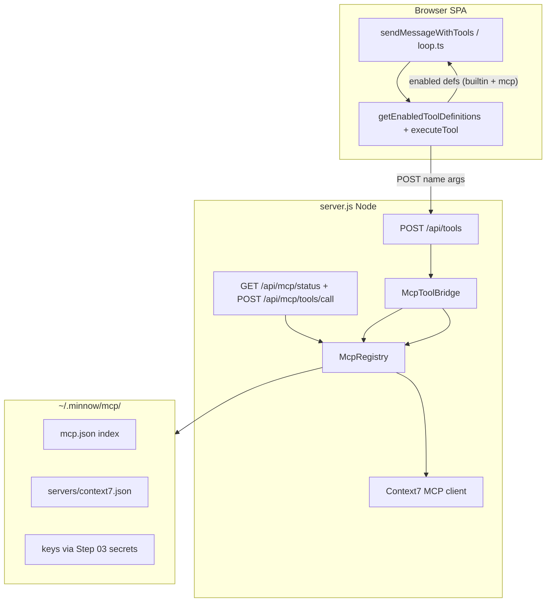

# Step 18 — MCP servers + Context7 default (implementation build plan)

**Roadmap:** [`documentation/plans/to-fix-step-order.md`](../to-fix-step-order.md) — Step 18  
**Backlog:** [`documentation/plans/to-fix.md`](../to-fix.md) items **27** (MCP servers), **28** (Context7 default) — **not** item 29 (top-bar toggles → Step 20)  
**Architecture context:** [`documentation/context.md`](../../context.md)  
**Depends on:** **Step 02** (`~/.minnow` data layer + config API); **Step 03** (provider auth — Bearer/custom headers for MCP HTTP/SSE transports)

**Out of scope for this step:** Full settings page, top-bar per-MCP toggles, prompt “MCP context blocks” (Step **20**). Minimal data model + API hooks only so Step 20 can bind UI later.

---

## Goal

When `npm start` is running, Minnow can:

1. Load MCP server definitions from **`~/.minnow/mcp/`** (seeded on first run).
2. Connect to enabled MCP servers from **Node** (not the browser — MCP SDK + subprocess/HTTP belong on the server).
3. **Merge** MCP tool schemas into the LM Studio request via [`getEnabledToolDefinitions()`](../../../src/tools/client.ts).
4. **Execute** MCP tool calls through the same path as built-in server tools (`executeTool` → `POST /api/tools` or a dedicated MCP route).
5. Ship **Context7** as a **built-in, enabled-by-default** MCP server (user supplies API key in `~/.minnow` if required).

---

## Prerequisites (must exist before implementer starts)

| Step | What Step 18 consumes |
|------|------------------------|
| **02** | `getMinnowHome()` (or equivalent), `~/.minnow/mcp/` directory creation, `GET/PUT /api/config/*` or dedicated `/api/mcp/*` with safe path guards, migration from any legacy MCP stub |
| **03** | `resolveProviderAuth(providerId)` (or shared secret store) so MCP configs can reference `authRef: "context7"` / `providerId` for `Authorization` headers on remote MCP URLs |

If Step 02/03 are not merged, implementer ships **interfaces + in-memory fixtures** behind a feature flag and documents the integration contract — but **verifier PASS** requires the real home-dir + auth wiring from those steps.

---

## References

| Source | Use for |
|--------|---------|
| [Model Context Protocol spec](https://modelcontextprotocol.io/) | Transport types, `tools/list`, `tools/call` |
| [`@modelcontextprotocol/sdk`](https://www.npmjs.com/package/@modelcontextprotocol/sdk) | Official TS client (`Client`, `StdioClientTransport`, `SSEClientTransport`) |
| [Context7](https://context7.com/) | Product docs, API key env var name |
| Cursor Context7 MCP (local reference) | Tool names: `resolve-library-id`, `query-docs` — align seed config / descriptions |
| OpenCode MCP patterns (if present in repo uploads) | Config shape parity where sensible |
| [`src/tools/client.ts`](../../../src/tools/client.ts) | `getEnabledToolDefinitions`, `executeTool`, `detectLocalServer` |
| [`src/tools/loop.ts`](../../../src/tools/loop.ts) | Tool loop calls `executeTool(tc.function.name, args)` |
| [`server.js`](../../../server.js) | Extend middleware alongside `/api/tools` |

---

## High-level architecture



**Design decisions:**

| Decision | Rationale |
|----------|-----------|
| MCP runs in **Node only** | Browser cannot spawn stdio MCP children reliably; secrets stay off the client |
| **Namespaced** MCP function names | Avoid collisions with 32 built-ins, e.g. `mcp__context7__query_docs` |
| **Lazy connect** | Connect on first tool list / first call; idle timeout disconnect (configurable) |
| **Gating** | MCP tools included in `getEnabledToolDefinitions()` only when `detectLocalServer()` is true (same as server-required built-ins) |
| **Context7 default on** | `enabled: true` in seed; user can disable via config API (UI in Step 20) |

---

## `~/.minnow/mcp/` layout

```
~/.minnow/
├── mcp.json                    # Index: server ids, enabled flags, default transport hints
├── secrets.json                # (Step 03) optional: context7ApiKey — never commit
└── mcp/
    ├── README.md               # Human: how to add servers, Context7 key
    └── servers/
        ├── context7.json       # Shipped seed (copied on first run if missing)
        └── _example.json       # Template for custom stdio/http servers
```

### `mcp.json` (index)

```json
{
  "version": 1,
  "servers": {
    "context7": {
      "enabled": true,
      "configFile": "servers/context7.json"
    }
  }
}
```

### `servers/context7.json` (seed — implementer verifies against Context7 docs)

```json
{
  "id": "context7",
  "label": "Context7",
  "description": "Up-to-date library documentation and code examples",
  "transport": {
    "type": "stdio",
    "command": "npx",
    "args": ["-y", "@upstash/context7-mcp@latest"],
    "env": {
      "CONTEXT7_API_KEY": "${secret:context7ApiKey}"
    }
  },
  "enabled": true,
  "builtin": true
}
```

**Notes for implementer:**

- Confirm exact package name / env var with Context7 docs at implementation time (`CONTEXT7_API_KEY` is common; adjust seed if docs differ).
- `${secret:context7ApiKey}` resolved via Step 03 secret store → never written into committed JSON.
- If Context7 publishes a remote **HTTP/SSE** endpoint instead of stdio, switch transport to `sse` / `http` and wire Step 03 auth headers.

### Custom server example (`servers/_example.json`)

Document **stdio** and **remote** variants:

```json
{
  "id": "my-local-mcp",
  "label": "My Local MCP",
  "transport": {
    "type": "stdio",
    "command": "node",
    "args": ["path/to/server.js"]
  },
  "enabled": false,
  "builtin": false
}
```

---

## Server modules (new files)

Suggested layout under `src/mcp/` (or `server/mcp/` if implementer prefers Node-only colocation):

| File | Responsibility |
|------|----------------|
| `src/mcp/types.ts` | `McpServerConfig`, `McpTransport`, `McpToolDescriptor`, enabled state |
| `src/mcp/paths.ts` | Resolve `~/.minnow/mcp`, validate paths under home (mirror `resolveSafePath` rules) |
| `src/mcp/registry.ts` | Load index + server files; list servers; enable/disable; seed defaults |
| `src/mcp/client-pool.ts` | Connect/disconnect; cache `tools/list` per server; handle errors as strings |
| `src/mcp/bridge.ts` | Map MCP tools → `OpenAIFunctionDefinition[]`; execute `tools/call` by namespaced name |
| `src/mcp/defaults.ts` | Built-in seed: Context7 JSON + first-run copy into home dir |

**`McpRegistry` public API (minimum):**

```ts
listServers(): McpServerSummary[]
getServer(id: string): McpServerConfig | undefined
setServerEnabled(id: string, enabled: boolean): void
refreshTools(serverId: string): Promise<McpToolDescriptor[]>
callTool(namespacedName: string, args: Record<string, unknown>): Promise<string>
```

**Namespacing:**

- Pattern: `mcp__<serverId>__<toolName>` where `<toolName>` is MCP tool name with `-` → `_` if needed for OpenAI name rules.
- Reverse map stored when tools are listed (Map namespaced → `{ serverId, originalName }`).

---

## HTTP API (server.js)

Extend [`server.js`](../../../server.js) middleware (before Vite handler):

| Route | Method | Purpose |
|-------|--------|---------|
| `/api/mcp/ping` | GET | `{ ok: true, homeDir, serverCount }` — optional; can reuse `/api/tools/ping` extension |
| `/api/mcp/servers` | GET | List servers + enabled + connection status |
| `/api/mcp/servers/:id/enabled` | PUT | `{ enabled: boolean }` — persistence to `mcp.json` |
| `/api/mcp/tools` | GET | Flattened OpenAI-style defs for **enabled** servers (server-side mirror of bridge) |
| `/api/mcp/tools/call` | POST | `{ name, args }` → `{ result: string }` — MCP execution |
| `/api/mcp/reload` | POST | Reload configs from disk; reconnect |

**Integration with existing `/api/tools`:**

- Option A (preferred): In `executeServerTool`, if `name` starts with `mcp__`, delegate to `McpRegistry.callTool`.
- Option B: Client routes MCP names only to `/api/mcp/tools/call`.

Pick **one** path; document in `context.md`. Prefer **Option A** so [`executeTool`](../../../src/tools/client.ts) stays unchanged.

---

## Client bridge

### `getEnabledToolDefinitions()` ([`src/tools/client.ts`](../../../src/tools/client.ts))

```ts
export function getEnabledToolDefinitions(): OpenAIFunctionDefinition[] {
  const builtin = /* existing BUILT_IN_TOOLS filter */;
  const mcp = getCachedMcpToolDefinitions(); // sync cache filled by detectLocalServer()
  return [...builtin, ...mcp];
}
```

**Population strategy:**

1. On successful `detectLocalServer()`, `fetch('/api/mcp/tools')` (or piggyback on ping response) and cache definitions in memory.
2. If fetch fails, MCP tools omitted (degrade gracefully).
3. Filter MCP tools by per-server `enabled` flags from registry (Context7 included when enabled).

### `executeTool(name, args)`

- If `name.startsWith('mcp__')` → require local server → `POST /api/tools` with same name (Option A) or dedicated MCP endpoint.
- Return **string** results; errors as `Error: …` prefix (consistent with built-ins).

### Config persistence (until Step 20 UI)

- Extend tool config **or** separate `minnow.mcp` key / `~/.minnow/mcp.json` only (prefer **server source of truth** from Step 02).
- Browser may cache enabled flags via `GET /api/mcp/servers` after `detectLocalServer()`.

**Do not** duplicate full MCP server definitions in `localStorage` long term.

---

## Context7 default behavior

| Requirement | Implementation |
|-------------|----------------|
| Bundled seed | `src/mcp/defaults.ts` + copy to `~/.minnow/mcp/servers/context7.json` on first run |
| Enabled by default | `mcp.json` → `"context7": { "enabled": true }` |
| API key | Document in `~/.minnow/mcp/README.md` and Step 20 placeholder; store via Step 03 secrets (`context7ApiKey`) |
| Missing key | `tools/list` may succeed; `tools/call` returns clear `Error: Context7 API key not configured. Set …` |
| Tool descriptions | Preserve Context7 guidance (resolve library id before query-docs) in function `description` fields |

---

## Prompt / UI hooks (minimal — Step 20 completes)

- Add **feature flag** in `~/.minnow/config.json`: `features.mcp: true` (default true).
- Optional: inject one line into `tool-usage` prompt part later (“MCP tools are prefixed `mcp__`”) — **only** if Step 04 composer is already merged; otherwise document for Step 20.
- **No** top-bar MCP toggles in Step 18.

---

## Dependencies on Step 03 (auth)

For MCP servers using **remote HTTP/SSE**:

```json
{
  "transport": {
    "type": "sse",
    "url": "https://example.com/mcp",
    "authRef": "my-provider-id"
  }
}
```

Registry resolves `authRef` via Step 03:

- `Authorization: Bearer <apiKey>`
- Optional custom headers map

Stdio transports inherit `env` from resolved secrets (Context7 pattern).

---

## Testing strategy

**Location:** `test/mcp/` (Node test runner) + optional `scripts/sa18-mcp-smoke.mjs`

Use **deterministic** fixtures per project test guidelines:

| Test file | Covers |
|-----------|--------|
| `test/mcp/registry.test.ts` | Load index; seed copy idempotent; enable/disable persistence; invalid path rejected |
| `test/mcp/bridge.test.ts` | Namespacing round-trip; merge order builtin + mcp; disabled server excluded |
| `test/mcp/registry-fixtures/` | Static `mcp.json` + fake server JSON (no network) |
| `test/mcp/client-pool.test.ts` | Mock MCP client implementing `tools/list` + `tools/call` (inject factory) |

**Mock MCP server (minimal):**

- Stdio echo server **or** in-process mock implementing:
  - `tools/list` → `[{ name: 'echo', description: '…', inputSchema: {…} }]`
  - `tools/call` → `{ content: [{ type: 'text', text: 'pong' }] }`

**Integration smoke (manual / CI with key):**

```bash
# With npm start running and CONTEXT7_API_KEY set in ~/.minnow secrets:
npx tsx scripts/sa18-mcp-smoke.mjs http://localhost:5173
```

Static expectations example:

```ts
const EXPECTED_NAMESPACED = 'mcp__fixture__echo';
const EXPECTED_CALL_RESULT = 'pong';
```

**Out of scope for automated CI:** Live Context7 network calls (mark `@requires-context7-key` in smoke script; skip when env unset).

---

## Verification (implementer + verifier)

| Check | Command / criterion |
|-------|---------------------|
| Unit tests pass | `npx tsx --test test/mcp/*.test.ts` (or `npm test` if added in Step 02) |
| Registry seeds Context7 | Fresh temp `MINNOW_HOME=…` → `context7.json` exists; `enabled: true` |
| Bridge merges tools | Mock server adds 1 tool → `getEnabledToolDefinitions().length === builtinEnabled + 1` |
| Execute namespaced tool | `executeTool('mcp__fixture__echo', { message: 'x' })` → `'pong'` |
| Server gating | Vite-only (`npm run dev`) → MCP defs not cached / not sent |
| `context.md` updated | MCP section: paths, namespacing, Context7 key, API routes |
| Build | `npm run build` passes |

Verifier uses a **different** agent session; re-runs tests only (no feature code).

Optional: implementer creates [`documentation/plans/verification/step-18.md`](../verification/step-18.md) with exact commands.

---

## File change checklist (implementer)

| Area | Files |
|------|--------|
| New | `src/mcp/*.ts`, `test/mcp/*`, `scripts/sa18-mcp-smoke.mjs` |
| Modify | [`server.js`](../../../server.js), [`src/tools/client.ts`](../../../src/tools/client.ts), [`package.json`](../../../package.json) (`@modelcontextprotocol/sdk`) |
| Seed | `src/mcp/defaults.ts` → copies to `~/.minnow/mcp/` |
| Docs | [`documentation/context.md`](../../context.md), `~/.minnow/mcp/README.md` (generated on seed) |
| Plan | This file — tick todos below |

---

## Sub-agent implementer prompt (copy-paste)

```
You are implementing Step 18 (MCP + Context7 default) for Minnow.

Read:
- documentation/plans/Build out/step-18-mcp-context7.md
- documentation/context.md
- documentation/plans/to-fix-step-order.md (Step 18 section)

Depends on Step 02 (~/.minnow) and Step 03 (auth/secrets). If not merged, implement interfaces + document integration points.

Deliver:
1. ~/.minnow/mcp/ layout + first-run seed (Context7 enabled by default)
2. McpRegistry + client pool in Node (src/mcp/)
3. server.js routes and /api/tools delegation for mcp__* names
4. Bridge into getEnabledToolDefinitions() and executeTool()
5. Tests: test/mcp/registry.test.ts, test/mcp/bridge.test.ts (deterministic fixtures)
6. scripts/sa18-mcp-smoke.mjs (optional live Context7 when key present)
7. Update documentation/context.md

Out of scope: Step 20 settings UI and top-bar MCP toggles.

Run tests and npm run build before handoff.
```

---

## Sub-agent verifier prompt (copy-paste)

```
Verify Step 18 only. Read documentation/plans/Build out/step-18-mcp-context7.md acceptance criteria.

Re-run unit tests with a clean MINNOW_HOME temp directory.
Confirm Context7 seed exists and enabled by default.
Confirm namespaced MCP tools appear in GET /api/mcp/tools when mock server enabled.
Do not implement fixes; report PASS/FAIL with logs.
```

---

## Implementation todos

### Phase 0 — Alignment

- [ ] **S18-0.1** Confirm Step 02 home-dir helper and config API routes exist; note exact paths in this plan’s “Prerequisites” table if names differ.
- [ ] **S18-0.2** Confirm Step 03 secret resolution API; define `context7ApiKey` secret id and env substitution rules.
- [ ] **S18-0.3** Verify Context7 MCP package name, transport (stdio vs remote), and API key env var against official docs; update seed JSON in plan if needed.

### Phase 1 — Data layer & seed

- [ ] **S18-1.1** Add `src/mcp/paths.ts` — resolve `~/.minnow/mcp`, `mcp.json`, `servers/*.json` with safe path guards.
- [ ] **S18-1.2** Add `src/mcp/types.ts` — config shapes, transport union (`stdio` | `sse` | `http`), server summary types.
- [ ] **S18-1.3** Add `src/mcp/defaults.ts` — built-in Context7 server definition + `mcp.json` index template.
- [ ] **S18-1.4** Implement `ensureMcpSeed(homeDir)` — copy seed files on first run; idempotent (never overwrite user edits except missing files).
- [ ] **S18-1.5** Write generated `~/.minnow/mcp/README.md` (Context7 key instructions, adding custom servers).

### Phase 2 — Registry

- [ ] **S18-2.1** Implement `src/mcp/registry.ts` — load index, load server configs, list/get/set enabled.
- [ ] **S18-2.2** Implement config reload (`reload()` clears caches).
- [ ] **S18-2.3** Wire secret/env substitution from Step 03 for `transport.env` and remote `authRef`.
- [ ] **S18-2.4** **Test:** `test/mcp/registry.test.ts` — seed, enable/disable, bad path, missing server id.

### Phase 3 — MCP client pool

- [ ] **S18-3.1** Add dependency `@modelcontextprotocol/sdk` to `package.json`.
- [ ] **S18-3.2** Implement `src/mcp/client-pool.ts` — connect per transport, `tools/list`, `tools/call`, disconnect/idle timeout.
- [ ] **S18-3.3** Inject mock client factory for tests (no real subprocess in unit tests).
- [ ] **S18-3.4** Normalize tool results to **string** (text content concatenation; errors as `Error: …`).
- [ ] **S18-3.5** **Test:** `test/mcp/client-pool.test.ts` with mock — list + call happy path + connection failure message.

### Phase 4 — Tool bridge

- [ ] **S18-4.1** Implement `src/mcp/bridge.ts` — `toNamespacedName`, `parseNamespacedName`, `toOpenAIDefinitions(descriptors)`.
- [ ] **S18-4.2** Implement `listEnabledMcpTools()` — enabled servers only; merge descriptors.
- [ ] **S18-4.3** Implement `executeMcpTool(namespacedName, args)` — delegate to registry/pool.
- [ ] **S18-4.4** **Test:** `test/mcp/bridge.test.ts` — namespacing, disabled server exclusion, static expected function count.

### Phase 5 — server.js HTTP

- [ ] **S18-5.1** Register `/api/mcp/servers`, `/api/mcp/tools`, `/api/mcp/tools/call`, `/api/mcp/reload` in `server.js`.
- [ ] **S18-5.2** Delegate `mcp__*` in existing `POST /api/tools` handler to MCP bridge (Option A).
- [ ] **S18-5.3** Call `ensureMcpSeed()` on server startup.
- [ ] **S18-5.4** CORS/OPTIONS consistent with `/api/tools`.

### Phase 6 — Browser client integration

- [ ] **S18-6.1** After `detectLocalServer()` success, fetch and cache MCP tool definitions (`/api/mcp/tools`).
- [ ] **S18-6.2** Extend `getEnabledToolDefinitions()` to append cached MCP defs when server available.
- [ ] **S18-6.3** Ensure `executeTool` routes namespaced MCP tools to server (no browser execution).
- [ ] **S18-6.4** Invalidate MCP cache when server ping fails or on `reload` endpoint (optional hook).

### Phase 7 — Context7 default

- [ ] **S18-7.1** Seed Context7 with `enabled: true` in default `mcp.json`.
- [ ] **S18-7.2** Document API key setup in README + `context.md`.
- [ ] **S18-7.3** Graceful error when key missing on `tools/call`.
- [ ] **S18-7.4** Add `scripts/sa18-mcp-smoke.mjs` — skip Context7 live test without key; run fixture server test always.

### Phase 8 — Documentation & verification

- [ ] **S18-8.1** Update [`documentation/context.md`](../../context.md) — MCP section (paths, API, namespacing, gating, Context7).
- [ ] **S18-8.2** Add [`documentation/plans/verification/step-18.md`](../verification/step-18.md) with commands (implementer).
- [ ] **S18-8.3** Run full test suite + `npm run build`; fix failures.
- [ ] **S18-8.4** Verifier sub-agent PASS report attached or recorded in verification doc.

---

## Acceptance criteria (summary)

1. **`~/.minnow/mcp/`** exists after first `npm start` with **Context7** seeded and **enabled by default**.
2. **Registry** loads servers, persists enable/disable, rejects unsafe paths.
3. **Tool bridge** exposes namespaced MCP tools through **`getEnabledToolDefinitions()`** when local server is up.
4. **Tool execution** for `mcp__*` names returns string results through existing tool loop.
5. **Tests** cover registry + bridge deterministically without network.
6. **`documentation/context.md`** documents MCP behavior for future Step 20 UI.

---

## Risk register

| Risk | Mitigation |
|------|------------|
| Context7 package / env changes | Pin version in seed after verification; document upgrade path |
| Tool name collisions | Strict `mcp__` prefix; reject builtin ids in bridge |
| Subprocess spawn on Windows | Use `npx` with `windowsHide`; test on Win32 CI if available |
| Stale tool cache in browser | Refresh MCP defs on each `detectLocalServer()` success |
| Token bloat from many MCP tools | Cap tools per server in config (optional `maxTools`); document in README |

---

## After Step 18

| Follow-up | Step |
|-----------|------|
| Per-MCP-server toggles in top bar | 20 |
| Full MCP settings section (add/edit servers UI) | 20 |
| Prompt “MCP context blocks” master toggle | 20 |
| Sub-agents calling MCP tools | 09 (already uses tool loop if enabled) |

---

*Plan version: 1.0 — 2026-05-19*
