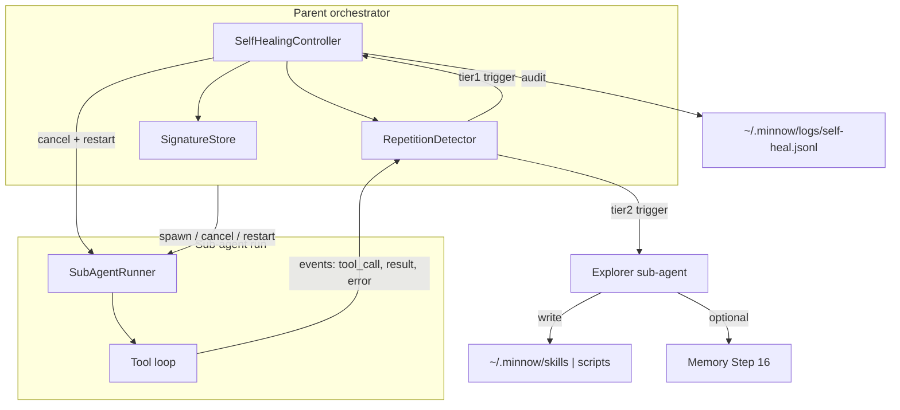

# Step 19 — Self-healing (2-tier) — Implementation build plan

| Field | Value |
|-------|--------|
| **Step ID** | 19 |
| **Title** | Self-healing (2-tier) |
| **Backlog** | [`to-fix.md`](../to-fix.md) item **30** (self-healing; repetition-focused — narrower than full backlog wording) |
| **Master roadmap** | [`to-fix-step-order.md`](../to-fix-step-order.md) — Wave 8 |
| **Depends on** | **09** (sub-agent orchestration), **13** (skills framework) — **required**; **16** (memory) — **optional** (tier-2 “remember fix” hook) |
| **Blocks** | Step **20** (settings master toggle for self-healing) |
| **Default** | **Off** — feature flag only; full toggle UI ships in Step 20 |

**Workspace:** `c:\Users\dukky\Documents\Development\Minnow`

**Read first:** [`documentation/context.md`](../../context.md), [`to-fix-step-order.md`](../to-fix-step-order.md) (Step 19 section), Step **09** / **13** / **16** deliverables (when implemented), [`src/tools/loop.ts`](../../../src/tools/loop.ts) (parent tool loop today).

**Prototype / build spec:** No `prototype/` folder in repo; behavior is defined by [`to-fix-step-order.md`](../to-fix-step-order.md) and backlog line 31 in [`to-fix.md`](../to-fix.md).

---

## Goal

When self-healing is **enabled**, the **parent orchestrator** (not the stuck sub-agent) detects **repetition** in a sub-agent run and escalates in two tiers:

1. **Tier 1 (cheap):** tell sub-agent to stop → **cancel** run → **restart** same sub-agent type with fresh context.
2. **Tier 2 (expensive):** if the **same class of repetition** recurs after tier 1, spawn an **explorer** sub-agent to investigate, author a **skill** or **script** under `~/.minnow`, optionally record in **memory** (Step 16), with **guardrails** on disk and execution.

**Out of scope for v1:** Tier 2 on generic tool failures unrelated to repetition; tier 2 only after tier 1 failed once for the same signature.

---

## Prerequisites (must exist before implementer starts)

| Prerequisite | Source step | What Step 19 needs |
|--------------|-------------|-------------------|
| Sub-agent runner | **09** | `spawnSubAgent`, `cancelSubAgent`, run handles, isolated context, tool subset, aggregated result to parent |
| Orchestrator hook | **09** | Callbacks/events during sub-agent tool loop (tool call, tool result, error, turn end) |
| `~/.minnow` I/O | **02** | `skills/`, `scripts/`, `logs/`, config read/write via server API |
| Skill loader + format | **13** | `SKILL.md` discovery, skill `id`, injection API; user skills in `~/.minnow/skills/` |
| Memory CRUD (optional) | **16** | Append/search memory chunk: “fix exists for signature X → skill/script Y” |
| Config flag (stub OK) | **19** | `selfHealing.enabled` in `~/.minnow/config.json` (default `false`); Step 20 adds UI |

If Step 09 is not merged, implement **interfaces + mocks** first; wire real orchestrator in a follow-up commit within the same step (verifier runs tests against mocks + integration flag).

---

## Architecture



### Module layout (target)

```
src/agents/
  orchestrator.ts          # Step 09 — parent; calls SelfHealingController
  sub-agent-runner.ts      # Step 09 — spawn/cancel/restart
  self-healing/
    index.ts               # Public API: createController, onSubAgentEvent
    config.ts              # Load merge selfHealing from ~/.minnow/config.json
    detector.ts            # RepetitionDetector (pure, unit-tested)
    signatures.ts            # Failure signature hash + match “same class”
    tier1.ts                 # stop message, cancel, restart with hint
    tier2.ts                 # explorer spawn, skill/script authoring flow
    explorer-prompt.ts       # System prompt for explorer sub-agent type
    guardrails.ts            # Disk caps, path allowlist, script approval gate
    types.ts                 # Events, signatures, tier outcomes
server.js                  # Optional: POST /api/self-heal/approve-script (tier 2)
test/self-healing/         # node:test + tsx
documentation/plans/verification/step-19.md   # Commands for verifier
```

Orchestrator integration point: **wrap** each sub-agent execution with `SelfHealingController.observe(runId, subAgentType, task, events)`; never let the stuck sub-agent call tier logic itself.

---

## Configuration

**Location:** `~/.minnow/config.json` (merged with defaults on read).

```json
{
  "selfHealing": {
    "enabled": false,
    "tier1": {
      "maxRestartsPerParentTurn": 2,
      "duplicateToolCallThreshold": 3,
      "sameErrorThreshold": 3,
      "noProgressTurnThreshold": 4
    },
    "tier2": {
      "enabled": true,
      "requireScriptApproval": true,
      "maxExplorerTurns": 12,
      "maxSkillBytes": 65536,
      "maxScriptsOnDisk": 50
    },
    "signatureWindow": {
      "parentTurn": true,
      "sessionMinutes": 60
    }
  }
}
```

| Flag | Default | Notes |
|------|---------|--------|
| `enabled` | `false` | Master gate; Step 20 exposes toggle |
| `tier2.enabled` | `true` | Allow disabling tier 2 while keeping tier 1 |
| `requireScriptApproval` | `true` | New scripts not auto-executed until user approves (UI minimal: server flag + pending list) |
| `maxRestartsPerParentTurn` | `2` | Cap tier-1 restarts per parent user message |

Ship **default config fragment** in `src/agents/self-healing/defaults.ts` and document in [`documentation/context.md`](../../context.md).

---

## Repetition detector (Tier 0 — detection only)

**File:** `src/agents/self-healing/detector.ts`  
**Design:** Pure functions over a sliding event log per sub-agent `runId`. No LLM calls.

### Event types (input)

```ts
type SubAgentObservation =
  | { kind: 'tool_call'; name: string; argsJson: string; turn: number }
  | { kind: 'tool_result'; name: string; result: string; turn: number }
  | { kind: 'assistant_text'; content: string; turn: number }
  | { kind: 'error'; message: string; turn: number };
```

### Heuristics (any one fires `repetition`)

| ID | Rule | Default threshold | Notes |
|----|------|-------------------|--------|
| **R1** | Duplicate tool call | 3× same `name` + **identical** `argsJson` (normalized JSON sort keys) | Strongest signal |
| **R2** | Same tool error | 3× consecutive `tool_result` where `result.startsWith('Error:')` and same normalized error prefix (first 120 chars) | |
| **R3** | No progress token | 4 turns without change to tracked `taskToken` | `taskToken` = hash of (primary file path from args **or** sub-agent task string) |
| **R4** | Loop counter | Sub-agent `tool_turn` ≥ `MAX_TOOL_TURNS` (reuse loop constant) **and** last 2 turns only repeat R1-class calls | Safety net |

**Output:** `DetectionResult { repeated: boolean; reason: RepetitionReason; signature: FailureSignature }`

**FailureSignature** (for tier-2 matching):

```ts
interface FailureSignature {
  subAgentType: string;
  reason: RepetitionReason; // enum: duplicate_tool | same_error | no_progress | loop
  fingerprint: string;      // stable hash, e.g. sha256(subAgentType + reason + key material)
}
```

`key material` examples:

- R1: `toolName + normalizedArgs`
- R2: `toolName + errorPrefix`
- R3: `taskToken`
- R4: `subAgentType + 'loop'`

### Signature store (tier-1 → tier-2 bridge)

**File:** `src/agents/self-healing/signatures.ts`

- On tier-1 completion, record `fingerprint` + `tier1RestartedAt` in memory scoped to **parent turn** (and optionally session window from config).
- On next detection for same `subAgentType`, if `fingerprint` matches a signature that already had tier-1 in this window → escalate to **tier 2**.
- If no match → tier 1 only.

---

## Tier 1 — Stop, cancel, restart

**File:** `src/agents/self-healing/tier1.ts`

### Sequence

1. Orchestrator receives `repeated: true` from detector (first time for this `fingerprint` in window).
2. Inject **stop instruction** to sub-agent (system or tool-channel message):  
   `"You are repeating yourself ({reason}). Stop immediately. Do not call more tools."`
3. **`cancelSubAgent(runId)`** (Step 09): abort in-flight `fetch` / `AbortController`, discard partial assistant/tool rows for that run only.
4. **`restartSubAgent`**: same `subAgentType`, same high-level `task` string, **empty** message history, optional one-line user note:  
   `"Avoid repeating: {human-readable reason}. Prior approach failed."`
5. Increment `tier1Count` for parent turn; if `> maxRestartsPerParentTurn`, stop tier-1 loops and surface error to parent chat (do not tier-2 unless signature rules say so).

### Parent chat UX (minimal)

- Append a **system-visible** status line (or tool-style bubble): `Self-heal: restarted sub-agent ({reason})`.
- Do not dump full sub-agent history into parent.

### Audit

Append JSON line to `~/.minnow/logs/self-heal.jsonl`:

```json
{"ts":"2026-05-19T12:00:00.000Z","tier":1,"subAgentType":"implementer","fingerprint":"…","reason":"duplicate_tool"}
```

---

## Tier 2 — Explorer, skill/script, memory, guardrails

**File:** `src/agents/self-healing/tier2.ts`, `explorer-prompt.ts`, `guardrails.ts`

### Trigger

- `selfHealing.enabled && tier2.enabled`
- Same `FailureSignature.fingerprint` as a prior tier-1 event in `signatureWindow`
- Tier-1 restart already occurred for that fingerprint in window

### Explorer sub-agent

| Property | Value |
|----------|--------|
| **Type id** | `self-heal-explorer` (register in Step 09 sub-agent config) |
| **Tools** | Superset of original sub-agent + file read/list + `save_file` under `~/.minnow` only + skill validate API |
| **Max turns** | `tier2.maxExplorerTurns` (default 12) |
| **Prompt** | `explorer-prompt.ts` — investigate root cause, prefer **skill** over ad-hoc scripts; follow Cursor `SKILL.md` front matter |

### Deliverables explorer may create

| Artifact | Path | Format |
|----------|------|--------|
| **Skill** | `~/.minnow/skills/<skill-id>/SKILL.md` | YAML front matter: `id`, `name`, `description`; body = instructions |
| **Script** | `~/.minnow/scripts/<slug>.mjs` or `.ps1` | Executable helper; **not** auto-run if `requireScriptApproval` |

**Skill id rules:** kebab-case, prefix `heal-` optional, must not collide with built-in `src/skills/` unless override policy from Step 13 allows user win.

### Guardrails (`guardrails.ts`)

| Rule | Behavior |
|------|----------|
| Path allowlist | Writes only under `~/.minnow/skills/`, `~/.minnow/scripts/`, `~/.minnow/logs/` |
| Size cap | Reject skill body > `maxSkillBytes` |
| Script count | Refuse create if `scripts/` count ≥ `maxScriptsOnDisk` |
| Script execution | If `requireScriptApproval`, register pending in `~/.minnow/pending-scripts.json`; parent must call approve API or settings (Step 20) |
| No secrets | Scanner rejects patterns like `api[_-]?key`, `Bearer ` in written files (warn + fail) |
| Audit | Every write + tier-2 completion → `self-heal.jsonl` |

### Memory hook (Step 16 — optional)

If memory enabled globally:

```markdown
## Self-heal fix
- Signature: {fingerprint}
- Sub-agent: {subAgentType}
- Fix: skill `/{skill-id}` or script `scripts/{slug}.mjs`
- Created: {iso}
```

Use memory search on future parent turns: if signature matches, inject hint into composer **before** spawning sub-agent: “Known fix: try /{skill-id}”.

If Step 16 not present, stub `recordFixInMemory()` as no-op; tests use mock.

### After tier 2

- Restart **original** sub-agent once with hint: `Known fix available: /{skill-id}. Try that before repeating failed tools.`
- If explorer fails (timeout, no file written), log and return control to parent with failure message (no infinite tier-2 loop).

---

## Orchestrator integration (Step 09)

**File:** `src/agents/orchestrator.ts` (or extend `src/tools/loop.ts` if orchestrator lives there)

```ts
// Pseudocode — implementer wires real types
const healing = createSelfHealingController(config);

async function runSubAgentWithHealing(opts) {
  let run = await spawnSubAgent(opts);
  for await (const event of run.events()) {
    const decision = healing.observe(run.id, opts.type, event);
    if (decision?.action === 'tier1_restart') {
      await cancelSubAgent(run.id);
      run = await spawnSubAgent({ ...opts, hint: decision.hint, fresh: true });
    } else if (decision?.action === 'tier2_explore') {
      await cancelSubAgent(run.id);
      await healing.runTier2(opts, decision.signature);
      run = await spawnSubAgent({ ...opts, hint: decision.postExploreHint, fresh: true });
    }
  }
  return run.result();
}
```

**Feature gate:** If `!config.selfHealing.enabled`, call plain `runSubAgent` with no observer.

---

## Server API (minimal)

| Method | Path | Purpose |
|--------|------|---------|
| `GET` | `/api/config/self-healing` | Read merged config |
| `PUT` | `/api/config/self-healing` | Update flags (for tests + Step 20) |
| `GET` | `/api/self-heal/pending-scripts` | List scripts awaiting approval |
| `POST` | `/api/self-heal/approve-script` | Body `{ id }` — mark approved |
| `POST` | `/api/skills/reload` | Optional — refresh skill list after tier-2 write (Step 13) |

Path guards: same as Step 02 `resolveSafePath` — only under home dir.

---

## Testing strategy

Use **Node built-in test** (`node:test`) + **tsx** (already used by `scripts/sa16-smoke.mjs`). Add script:

```json
"test:self-healing": "tsx --test test/self-healing/**/*.test.ts"
```

**Principles:** fixed UUIDs, static expected strings, no `Date.now()` in assertions (inject clock).

### Test files

| File | Covers |
|------|--------|
| `test/self-healing/detector.test.ts` | R1–R4 with fixture event arrays; edge cases (below threshold, different args) |
| `test/self-healing/signatures.test.ts` | Tier-1 record → tier-2 match; window expiry (mock clock) |
| `test/self-healing/tier1.test.ts` | Mock runner: cancel called, restart has empty history + hint |
| `test/self-healing/tier2.test.ts` | Mock explorer; skill written under temp `~/.minnow`; guardrails reject oversize |
| `test/self-healing/guardrails.test.ts` | Path deny outside home; secret pattern block |
| `test/self-healing/integration.test.ts` | Optional: full controller with fake sub-agent event stream |

### Fixture examples (detector)

**R1 positive (static):**

```ts
const events = [
  { kind: 'tool_call', name: 'read_file', argsJson: '{"path":"a.ts"}', turn: 1 },
  { kind: 'tool_result', name: 'read_file', result: 'ok', turn: 1 },
  { kind: 'tool_call', name: 'read_file', argsJson: '{"path":"a.ts"}', turn: 2 },
  // ... third duplicate
];
// expect repeated === true, reason === 'duplicate_tool'
```

**R1 negative:** same tool, **different** `path` in args — no fire.

### Tier flow tests

- **Tier1Flow:** feed duplicate events → assert `cancelSubAgent` once, `spawnSubAgent` twice, audit log line exists.
- **Tier2Flow:** pre-seed signature store with tier-1 fingerprint → duplicate again → assert explorer spawn + `SKILL.md` exists + memory mock called once.

### Verification doc

Implementer creates [`documentation/plans/verification/step-19.md`](../verification/step-19.md) with:

```bash
npm run build
npm run test:self-healing
# optional with server:
npm start
# manual: enable selfHealing in ~/.minnow/config.json, trigger duplicate read_file in sub-agent
```

---

## Acceptance criteria (verifier)

- [ ] `selfHealing.enabled` defaults to **false**; when false, zero healing code paths run (grep or coverage on gate).
- [ ] Detector unit tests: **all R1–R4** cases pass; deterministic fixtures.
- [ ] Tier 1: repetition → cancel + restart with hint; capped by `maxRestartsPerParentTurn`.
- [ ] Tier 2: only after tier-1 signature match; writes skill under `~/.minnow/skills/`; guardrails block bad paths/sizes.
- [ ] Audit log append-only at `~/.minnow/logs/self-heal.jsonl`.
- [ ] `documentation/context.md` updated: self-healing module, config keys, logs path.
- [ ] `documentation/plans/verification/step-19.md` exists; verifier re-runs `npm run test:self-healing` and `npm run build` → **PASS**.

---

## Implementation todos

Use this checklist in order; parallelize only where noted.

### Phase A — Foundation

- [ ] **19.0.1** Confirm Step 09 APIs exist (`spawnSubAgent`, `cancelSubAgent`, events); document gaps in verification file if stubbed.
- [ ] **19.0.2** Add `src/agents/self-healing/types.ts` — events, signatures, config types, tier outcomes.
- [ ] **19.0.3** Add `defaults.ts` + `config.ts` — load/merge `selfHealing` from `~/.minnow/config.json`.
- [ ] **19.0.4** Add `npm run test:self-healing` script to `package.json`.

### Phase B — Detector (test-first)

- [ ] **19.1.1** Write `test/self-healing/detector.test.ts` fixtures for R1–R4 (positive + negative).
- [ ] **19.1.2** Implement `detector.ts` — normalization helpers (`normalizeArgsJson`, `errorPrefix`).
- [ ] **19.1.3** Implement `signatures.ts` — store, match, window scope (parent turn + optional session).
- [ ] **19.1.4** Write `signatures.test.ts`; all green.

### Phase C — Tier 1

- [ ] **19.2.1** Write `tier1.test.ts` with mock sub-agent runner.
- [ ] **19.2.2** Implement `tier1.ts` — stop message, cancel, restart, restart cap.
- [ ] **19.2.3** Wire audit logging to `~/.minnow/logs/self-heal.jsonl`.
- [ ] **19.2.4** Parent status message hook (minimal UI string).

### Phase D — Tier 2 + guardrails

- [ ] **19.3.1** Write `guardrails.test.ts` (path, size, secret patterns).
- [ ] **19.3.2** Implement `guardrails.ts`.
- [ ] **19.3.3** Add `explorer-prompt.ts` + register `self-heal-explorer` in sub-agent config (Step 09).
- [ ] **19.3.4** Implement `tier2.ts` — explorer spawn, skill/script write, pending script registry.
- [ ] **19.3.5** Write `tier2.test.ts` with temp home dir fixture.
- [ ] **19.3.6** Stub or wire `recordFixInMemory()` for Step 16.
- [ ] **19.3.7** Server routes: config GET/PUT, pending-scripts, approve-script (if approval enabled).

### Phase E — Controller + orchestrator

- [ ] **19.4.1** Implement `index.ts` — `createSelfHealingController`, `observe()`, tier escalation state machine.
- [ ] **19.4.2** Integrate into orchestrator / sub-agent wrapper behind `enabled` flag.
- [ ] **19.4.3** Write `integration.test.ts` (controller + fake events end-to-end).
- [ ] **19.4.4** Skill reload hook after tier-2 write (call Step 13 loader).

### Phase F — Docs + verification

- [ ] **19.5.1** Create `documentation/plans/verification/step-19.md` with commands and expected output.
- [ ] **19.5.2** Update `documentation/context.md` — self-healing section, config, paths, default off.
- [ ] **19.5.3** Implementer runs full test suite + build; fix failures.
- [ ] **19.5.4** Verifier agent: independent PASS/FAIL report (no feature code).

---

## Out of scope (explicit)

- Settings UI toggle (Step **20**); only config schema + API stub here.
- Auto tier-2 on non-repetition tool failures.
- LLM-based “is this repetition?” classifier (heuristics only in v1).
- Cross-session learning beyond configured `signatureWindow` (no permanent global ban list).
- Running user-approved scripts automatically in chat (approval queue only in v1).

---

## Sub-agent handoff (implementer prompt)

Copy to implementer Task:

```
Step 19 — Self-healing (2-tier). Repo: c:\Users\dukky\Documents\Development\Minnow

Backlog: to-fix.md #30
Depends: Step 09 (sub-agents), Step 13 (skills); Step 16 optional for memory
Plan: documentation/plans/Build out/step-19-self-healing.md

Read: documentation/context.md, to-fix-step-order.md Step 19, this build plan.
Implement: detector (R1–R4), tier1 cancel/restart, tier2 explorer + ~/.minnow skills/scripts, guardrails, config default OFF.
Tests: test/self-healing/*.test.ts, npm run test:self-healing
Update: documentation/context.md, documentation/plans/verification/step-19.md
Do not build Step 20 settings UI.
```

---

## Sub-agent handoff (verifier prompt)

```
Verify Step 19 only. Plan: documentation/plans/Build out/step-19-self-healing.md
Run: documentation/plans/verification/step-19.md commands
Acceptance: checklist in build plan "Acceptance criteria"
Report PASS/FAIL with logs. Do not implement fixes.
```

---

## Summary

| Tier | Action | When |
|------|--------|------|
| **0** | Detect repetition (R1–R4) | Sub-agent running, healing enabled |
| **1** | Stop, cancel, restart | First hit per fingerprint in window |
| **2** | Explorer → skill/script → optional memory | Same fingerprint after tier 1 failed |

**Default:** off until user enables in Step 20. **Tests** focus on pure detector + tier state machine with mocks, plus guardrails on disk writes.
