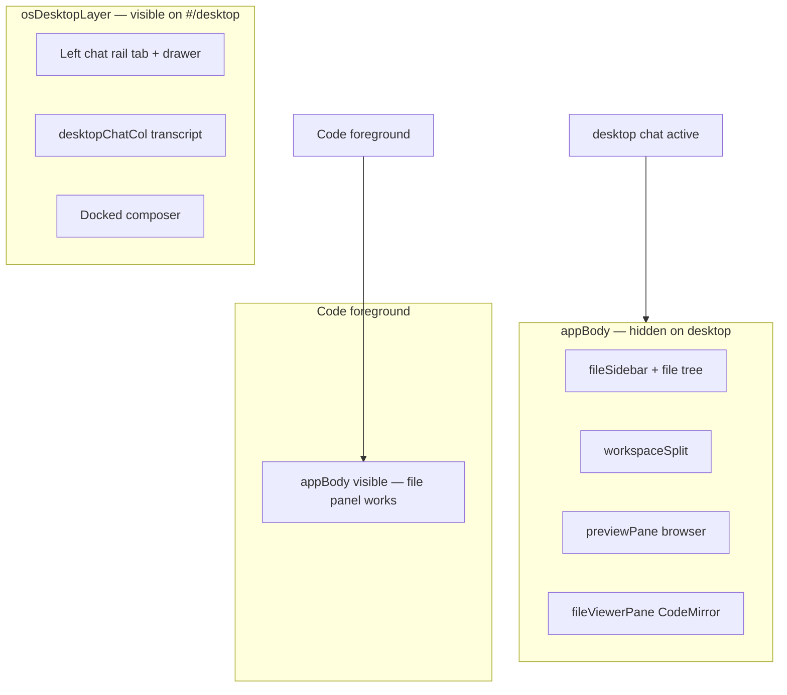
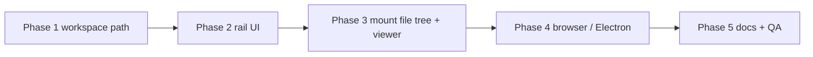

# MIN-288 — Desktop file viewer, browser, and workspace scoping

**Linear:** [MIN-288](https://linear.app/minnowai/issue/MIN-288)  
**Status:** Planning (no implementation in this issue)  
**Labels:** chat, Improvement

---

## Problem statement

Minnow desktop chat today is a capable assistant surface (transcript, composer, session rail) but it cannot browse or edit files, preview HTML, or drive the built-in Chromium browser. Those capabilities exist only inside the **Code** app (`#appBody`), which is **hidden** whenever the user is on the desktop (`shouldHideAppBody()` in [`src/os/page-bridge.ts`](../../src/os/page-bridge.ts)).

Desktop chat tools are also scoped to **`~/.minnow/chats`** (chats sandbox via [`src/lib/chats-workspace.ts`](../../src/lib/chats-workspace.ts) and `resolveToolWorkspaceRoot()` in [`src/tools/client.ts`](../../src/tools/client.ts)). The product intent for MIN-288 is a dedicated **`~/.minnow/workspace`** sandbox that desktop chat owns, with first-class UI to open the file tree, in-app browser, and file preview from the desktop canvas.

---

## Goals

| # | Goal |
|---|------|
| G1 | Add **right-edge launcher tabs** on the desktop (same visual language as the left chat-session tab) to open **Files**, **Browser**, and **File preview**. |
| G2 | Desktop chat can **use** the browser and file preview surfaces (user clicks + agent `browser_*` tools + file open from tree). |
| G3 | Desktop chat sessions and tools are scoped to **`~/.minnow/workspace`** (not `~/.minnow/chats` and not the Code project workspace). |
| G4 | Reuse existing file-tree, preview-panel, and file-viewer implementations — do not fork editor or preview logic. |

## Non-goals (v1)

- Replacing Code app file/git panels or merging desktop workspace with the user's Code project folder.
- Git panel on desktop (can follow as MIN-288b).
- Floating **window** mode for file/browser panels (side drawers first; windows optional later).
- Migrating legacy Chat app (`#/app/chat`) off `~/.minnow/chats` unless explicitly decided.

---

## Current architecture (baseline)



**Key constraints discovered in code:**

1. **File panel DOM** lives under `#appBody` / `#workspaceSplit` in [`index.html`](../../index.html); initialized by [`src/ui/init-file-panel.ts`](../../src/ui/init-file-panel.ts).
2. **Electron WebContentsView** preview host only mounts when `document.documentElement.dataset.osApp === 'code'` and `#appBody` is visible ([`src/ui/preview-electron-visibility.ts`](../../src/ui/preview-electron-visibility.ts) — `isCodeWorkspaceForeground()`).
3. **Agent browser tools** call `revealPreviewPanelForAgentNavigation()` ([`src/tools/browser-preview-tools.ts`](../../src/tools/browser-preview-tools.ts)), which toggles Code's `#previewPane` via [`src/ui/file-layout.ts`](../../src/ui/file-layout.ts).
4. **Desktop chat tool root** resolves to chats sandbox when `isChatAppForeground()` ([`src/tools/client.ts`](../../src/tools/client.ts) `resolveToolWorkspaceRoot()`).
5. **Chat rail tab** styling: `.mn-os-chat-rail-tab` in [`src/styles/minnowos-desktop.css`](../../src/styles/minnowos-desktop.css) — 56×56px, transparent, dim icon, accent on hover/focus.
6. **Scheduler side panel** ([`src/os/scheduler-side-panel.ts`](../../src/os/scheduler-side-panel.ts)) is the best existing pattern for a **fixed right rail** on `#osSidePanelsLayer`.

**Note on issue wording:** The chat session control is implemented as a **left-edge** tab (`#btnDesktopChatRailToggle`), not top-right. MIN-288 should **mirror that tab component** on the **right edge** of the desktop (stacked near the top, respecting safe-area), not relocate the chat rail.

---

## Proposed UX

### Right-edge workspace rail (new)

Three vertical tabs anchored to the **right** of `#osDesktopLayer`, visually matching `.mn-os-chat-rail-tab`:

| Tab | Icon (new `OsIconName`) | Opens | Panel |
|-----|-------------------------|-------|-------|
| **Files** | `folder` or reuse file-tree glyph | File tree drawer | Slide-in panel from the right (~320–380px), lists `~/.minnow/workspace` |
| **Browser** | `globe` | Preview / Chromium | Address bar + `#previewBody` guest (Electron) or iframe fallback |
| **Preview** | `fileText` | File viewer | CodeMirror tabs for workspace files |

**Interaction model (aligned with chat rail):**

- Collapsed: icon-only tabs visible on desktop (idle, chat, research, experts modes).
- Expanded: drawer panel + optional backdrop on narrow viewports (reuse chat rail mobile pattern).
- Only **one** right drawer expanded at a time in v1 (simpler z-index); switching tabs swaps panel content.
- Tabs hidden during **immersive** surfaces (`shouldSuppressDesktopChrome()` — same as chat rail).
- `aria-expanded`, `aria-label`, keyboard Escape to collapse — parity with [`src/ui/desktop-chat-rail.ts`](../../src/ui/desktop-chat-rail.ts).

### Layout sketch (desktop chat active)

```
┌─────────────────────────────────────────────────────────────┐
│ menubar                                                      │
├─────────────────────────────────────────────────────────────┤
│[chat]│                                          [files][web][view]│
│ tab  │     transcript (#desktopChatCol)              │ tabs │
│      │                                                 │      │
│      │                                                 │drawer│
├──────┴─────────────────────────────────────────────────┴──────┤
│ docked composer                                                │
└─────────────────────────────────────────────────────────────┘
```

When a drawer is open, transcript column narrows (CSS grid/flex on `.mn-os-desk-stage`) but remains readable; honor `prefers-reduced-motion`.

### Desktop chat ↔ panels

| User / agent action | Expected behavior |
|---------------------|-------------------|
| Click file in tree | Open in **File preview** drawer (activate Preview tab if needed); `openFileInViewer(path)`. |
| Composer attach / `@file` | Same workspace root; paths relative to `~/.minnow/workspace`. |
| `browser_navigate` tool | Auto-expand **Browser** drawer; `revealPreviewPanelForAgentNavigation(url)`. |
| `browser_snapshot` / `browser_click` | Require Browser drawer open or auto-open; reuse [`browser-preview-tools.ts`](../../src/tools/browser-preview-tools.ts). |
| Save in file viewer | `save_file` scoped to desktop workspace; tree auto-refresh ([`file-tree-auto-refresh.ts`](../../src/ui/file-tree-auto-refresh.ts)). |

---

## Workspace scoping: `~/.minnow/workspace`

### Server (new module)

Mirror [`server/chats-workspace/`](../../server/chats-workspace/):

| Piece | Purpose |
|-------|---------|
| `server/desktop-workspace/paths.js` | `getDesktopWorkspacePath()` → `path.join(getMinnowHome(), 'workspace')` |
| `ensureDesktopWorkspace()` | Create dir + README on bootstrap (like chats) |
| `resolveSafeDesktopPath(userPath)` | Traversal-safe resolution under root |
| `server/desktop-workspace/routes.js` | Optional `GET /api/desktop-workspace` health + list (or extend existing workspace APIs with a `scope=desktop` query) |

**Bootstrap:** Add `'workspace'` to `SCAFFOLD_DIRS` in [`server/config/home.js`](../../server/config/home.js); call `ensureDesktopWorkspace()` from [`server/runtime/bootstrap.js`](../../server/runtime/bootstrap.js).

**Tool allowlist:** Extend `isAllowedWorkspaceRoot()` in [`server/chats-workspace/paths.js`](../../server/chats-workspace/paths.js) (or rename to `allowed-workspace-roots.js`) to include desktop workspace key.

### Client

| Piece | Purpose |
|-------|---------|
| `src/lib/desktop-workspace.ts` | Client fetch/cache (mirror `chats-workspace.ts`) |
| `src/os/desktop-chat.ts` | Bootstrap chats with desktop workspace path instead of `getChatsWorkspacePath()` |
| `src/tools/client.ts` | `resolveToolWorkspaceRoot()` returns desktop workspace when `isDesktopChatActive()` (narrower than `isChatAppForeground()` so Code keeps project root) |
| `src/ui/chat-mount.ts` | Document/tooling: desktop chat foreground uses desktop workspace |
| Session `chat.workspacePath` | New desktop assistant chats store `~/.minnow/workspace` absolute path |

### Migration / compatibility

| Scenario | Plan |
|----------|------|
| Existing desktop chats with `~/.minnow/chats` | On load, treat as legacy; new chats use `workspace`. Optional one-time copy prompt (out of scope v1). |
| Legacy Chat app (`#/app/chat`) | Keep `~/.minnow/chats` unless product wants unification. |
| Brain / memory keys | Use `brainWorkspaceKeyFromPath(desktopWorkspacePath)` for desktop chat retrieve scope. |

---

## Technical design

### Phase 1 — Desktop workspace path (server + tool scope)

**Todos:**

- [ ] `MIN-288-1a` — Add `server/desktop-workspace/` paths + bootstrap + allowlist entry.
- [ ] `MIN-288-1b` — Add `src/lib/desktop-workspace.ts` + tests for path normalization.
- [ ] `MIN-288-1c` — Switch [`desktop-chat.ts`](../../src/os/desktop-chat.ts) + [`desktop-chat-rail.ts`](../../src/ui/desktop-chat-rail.ts) session filtering to desktop workspace path.
- [ ] `MIN-288-1d` — Update `resolveToolWorkspaceRoot()` to prefer desktop workspace when `isDesktopChatActive()`.
- [ ] `MIN-288-1e` — Update prompts/context copy that mention chats sandbox for desktop flows.
- [ ] `MIN-288-1f` — Tests: `test/os/desktop-chat-state.test.mts`, new `test/lib/desktop-workspace.test.mts`, tool client workspace resolution.

### Phase 2 — Desktop workspace rail (UI shell)

**New modules:**

| File | Responsibility |
|------|----------------|
| `src/os/desktop-workspace-rail.ts` | DOM for right tabs + drawer host on `#osDesktopLayer`; expand/collapse API |
| `src/os/desktop-workspace-state.ts` | Which tab is open: `'files' \| 'browser' \| 'viewer' \| null` + persistence (`localStorage` key `minnow.os.desktopWorkspacePanel`) |
| `src/styles/desktop-workspace-rail.css` | Tab + drawer styles (extend tokens from chat rail) |
| `src/os/icons.ts` | Add `folder`, `globe`, `fileText` SVG paths |

**Wire in:** [`src/os/desktop.ts`](../../src/os/desktop.ts) `renderDesktop()` — append rail after chat rail pattern.

**Todos:**

- [ ] `MIN-288-2a` — Implement tab strip + drawer chrome (header, close, backdrop).
- [ ] `MIN-288-2b` — Z-index table: tabs `12`, drawer `20` (match chat rail); below menubar `40`.
- [ ] `MIN-288-2c` — Hide rail when `shouldSuppressDesktopChrome()` / immersive app.
- [ ] `MIN-288-2d` — Persist last-open panel; restore on desktop return from Code.
- [ ] `MIN-288-2e` — Tests: rail visibility vs desktop state + Code foreground (`test/os/desktop-workspace-rail.test.mts`).

### Phase 3 — Mount existing file surfaces into desktop drawer

**Preferred approach: reparent shared DOM mounts** (avoid duplicating `#fileTreeHost`, `#previewPane`, `#fileViewerPane`).

1. Add **portal hosts** in the desktop drawer:
   - `#desktopFileTreeMount`
   - `#desktopPreviewMount`
   - `#desktopFileViewerMount`
2. Add `src/os/desktop-workspace-mounts.ts`:
   - `mountFileTreeToDesktop(host)` / `restoreFileTreeToCode()`
   - Same for preview + viewer subtrees (move minimal wrapper nodes, not entire `#appBody`).
3. On `syncDesktopWorkspaceMounts()` (subscribe desktop state + instances):
   - **Desktop foreground** (not Code): reparent mounts into desktop drawer; set file tree listing root to desktop workspace.
   - **Code foreground**: restore mounts to `#appBody`; listing root = Code project workspace.

**File tree listing root:**

- Extend [`src/ui/file-tree-listing-root.ts`](../../src/ui/file-tree-listing-root.ts) with `setListingWorkspaceRoot(absPath)` driven by mount context.
- `buildFileTreeToolContext()` must pass desktop workspace root when tree is hosted on desktop.

**Todos:**

- [ ] `MIN-288-3a` — Reparent strategy spike: identify smallest movable subtrees in `index.html` (likely `#fileSidebarFilesView` inner tree, `#previewPane` inner chrome, `#fileViewerPane`).
- [ ] `MIN-288-3b` — Implement mount/unmount with focus preservation and ResizeObserver rebind.
- [ ] `MIN-288-3c` — Desktop file tree uses `GET /api/workspace` with overridden root **or** dedicated list API — prefer reusing `list_directory` tool with `workspaceRoot` query param (already on `/api/tools`).
- [ ] `MIN-288-3d` — Wire tab clicks → `initFileTreeIfNeeded()`, `showPreviewSplit()` / `openFileInViewer()` equivalents for desktop hosts.
- [ ] `MIN-288-3e` — Tests: file tree renders desktop workspace paths; reparent does not break Code on return.

### Phase 4 — Browser / Electron preview on desktop

**Changes:**

| File | Change |
|------|--------|
| [`preview-electron-visibility.ts`](../../src/ui/preview-electron-visibility.ts) | Replace `isCodeWorkspaceForeground()` with `isPreviewSurfaceActive()` — true when Code **or** desktop browser drawer is open and mount visible. |
| [`preview-panel.ts`](../../src/ui/preview-panel.ts) | `getPreviewBody()` resolves `#previewBody` in active mount (desktop or Code). |
| [`browser-preview-tools.ts`](../../src/tools/browser-preview-tools.ts) | `revealPreviewPanelForAgentNavigation` opens desktop browser tab when `isDesktopChatActive()`. |
| [`electron/preview-host.ts`](../../electron/preview-host.ts) | No protocol change; bounds come from desktop `#previewBody` rect. |

**Fullscreen overlay list:** Add Minnow desktop drawers to obstruction checks if they overlap preview bounds (unlikely if only one right drawer).

**Todos:**

- [ ] `MIN-288-4a` — Generalize preview host visibility predicates.
- [ ] `MIN-288-4b` — Agent `browser_navigate` opens desktop browser drawer in desktop chat.
- [ ] `MIN-288-4c` — Manual test matrix: Electron + desktop chat + navigate + snapshot.
- [ ] `MIN-288-4d` — Tests: `preview-electron-visibility` unit cases for desktop surface.

### Phase 5 — Integration, polish, docs

**Todos:**

- [ ] `MIN-288-5a` — Update [`documentation/context.md`](../context.md) Minnow Shell section.
- [ ] `MIN-288-5b` — Add guide snippet under `documentation/guides/` for desktop workspace layout.
- [ ] `MIN-288-5c` — Composer hints: desktop empty state mentions Files/Browser tabs.
- [ ] `MIN-288-5d` — `npx tsc --noEmit` + scoped tests (`npm run test` subsets: os, ui preview, tools).
- [ ] `MIN-288-5e` — Feature flag `MINNOW_DESKTOP_WORKSPACE_PANEL=1` for gradual rollout (optional but recommended).

---

## Z-index and layering (explicit)

| Layer | z-index | Notes |
|-------|---------|-------|
| Wallpaper | 0 | |
| Transcript | 5 | |
| Chat rail tab | 12 | existing |
| Floating windows | 15 | existing |
| Chat rail expanded | 20 | existing |
| Desktop workspace tabs | 12 | same tier as chat tab |
| Desktop workspace drawer | 20 | same tier as chat drawer |
| Side panels (scheduler) | 25 | existing |
| Composer dock | 30 | existing |
| Menubar | 40 | existing |

When **both** chat rail and workspace drawer are expanded on small screens, prefer **closing chat rail** on workspace open (or vice versa) to avoid horizontal crowding.

---

## State persistence

| Key | Storage | Contents |
|-----|---------|----------|
| `minnow.os.desktopWorkspacePanel` | `localStorage` | `{ open: boolean, tab: 'files' \| 'browser' \| 'viewer' }` |
| `filePanel` in `config.json` | server meta | Reuse `rightPaneMode`, `previewSource`, `openViewerTabs` — but **namespace** viewer state per surface (`code` vs `desktop`) in v1.1 if cross-app bleed is observed |

---

## API surface (minimal new HTTP)

**Option A (recommended):** No new routes — desktop file tree uses existing tool APIs with `workspaceRoot: <desktop path>` on `/api/tools` and `GET /api/preview/file/*` with `?root=` override.

**Option B:** `GET /api/desktop-workspace` mirror of `/api/chats-workspace` for health/list/download — better ergonomics for UI that cannot invoke tools directly.

Decision gate: Phase 1 spike — if `list_directory` via tools from file-tree init is too heavy, add Option B.

---

## Testing plan

| Suite | Coverage |
|-------|----------|
| `test/os/desktop-workspace-rail.test.mts` | Tab open/close, immersive hide, persistence |
| `test/os/desktop-chat-state.test.mts` | Workspace path on new chat |
| `test/lib/desktop-workspace.test.mts` | Path helpers |
| `test/ui/preview-electron-visibility.test.mts` | Desktop surface predicate |
| `test/tools/client-workspace-root.test.mts` | `resolveToolWorkspaceRoot` desktop vs Code |
| Manual | Desktop chat → open file → edit → save → tree refresh; `browser_navigate` → snapshot; switch to Code and back — mounts restored |

---

## Risks and mitigations

| Risk | Mitigation |
|------|------------|
| Reparenting DOM breaks Code layout | Single `desktop-workspace-mounts.ts` owner; exhaustive restore on Code foreground; integration tests |
| Electron preview bounds wrong after drawer animation | Reuse `scheduleElectronPreviewHostLayoutSync()` on drawer transition end |
| Two workspaces confuse users (Code project vs desktop sandbox) | Drawer header shows `~/.minnow/workspace` label; README in folder |
| `~/.minnow/chats` orphaned | Keep for Chat app; document in context.md |
| Git panel expected on desktop | Defer; tree CRUD only in v1 |
| Mobile desktop layout crowded | Collapse drawers to full-screen sheets <640px (chat rail pattern) |

---

## Open questions (product)

1. **Single vs multiple drawers:** Can Files + Browser be open simultaneously, or one at a time? (Plan assumes **one** for v1.)
2. **Chat app unification:** Should `#/app/chat` move to `~/.minnow/workspace` too?
3. **Default file on first open:** Seed `README.md` / `notes.md` in desktop workspace?
4. **Issue "top right" vs left chat tab:** Confirm right-edge stacked tabs (recommended) vs menubar icon cluster.

---

## Implementation order (dependency graph)



**Suggested Linear sub-issues:**

- MIN-288a — Desktop workspace server + tool allowlist  
- MIN-288b — Desktop chat session scoping migration  
- MIN-288c — Right-edge workspace rail UI  
- MIN-288d — Reparent file tree + viewer mounts  
- MIN-288e — Desktop browser / preview host  
- MIN-288f — Tests + documentation  

---

## Files touched (implementation checklist)

**New:** `server/desktop-workspace/*`, `src/lib/desktop-workspace.ts`, `src/os/desktop-workspace-rail.ts`, `src/os/desktop-workspace-state.ts`, `src/os/desktop-workspace-mounts.ts`, `src/styles/desktop-workspace-rail.css`, tests listed above.

**Modified:** `src/os/desktop.ts`, `src/os/desktop-chat.ts`, `src/ui/desktop-chat-rail.ts`, `src/tools/client.ts`, `src/ui/preview-electron-visibility.ts`, `src/ui/preview-panel.ts`, `src/ui/file-layout.ts`, `src/ui/file-tree-listing-root.ts`, `src/ui/init-file-panel.ts`, `src/os/page-bridge.ts`, `src/os/icons.ts`, `server/config/home.js`, `server/runtime/bootstrap.js`, `server/chats-workspace/paths.js`, `documentation/context.md`.

---

## Acceptance criteria (for implementation PR)

- [ ] On `#/desktop`, three right-edge tabs are visible (matching chat tab visual weight) when not immersive.
- [ ] Files tab lists and edits files under **`~/.minnow/workspace`** only.
- [ ] Browser tab loads URLs and workspace HTML via existing preview stack (Electron in desktop shell).
- [ ] File preview tab opens CodeMirror viewer for workspace files with save + tab strip.
- [ ] Desktop chat `browser_navigate` opens the browser drawer and navigates.
- [ ] Switching to Code and back restores Code file panel layout without stale DOM.
- [ ] `npm test` scoped suites pass; `tsc --noEmit` clean.
