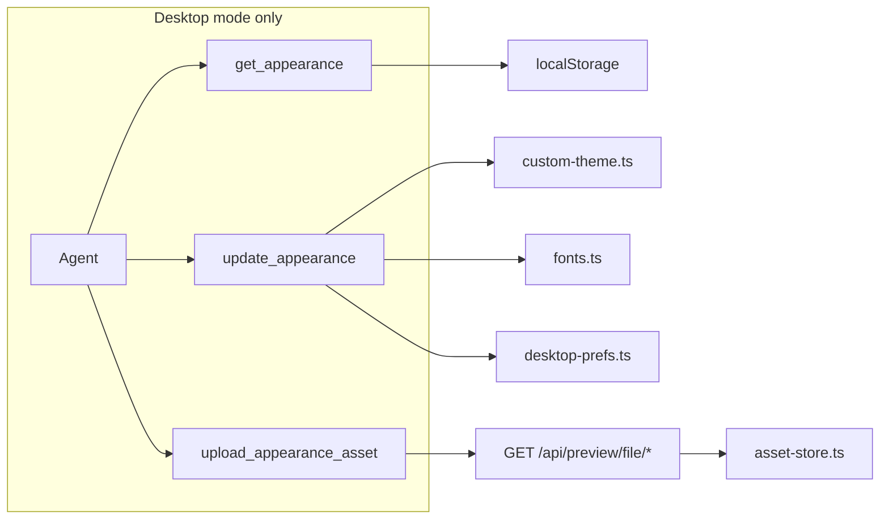

# Desktop-only appearance agent tools

**Status:** Shipped  
**Related:** [`documentation/context.md`](../context.md) (Theme system), [`documentation/plans/settings-agent-tools.md`](settings-agent-tools.md)

## Problem

Appearance is browser-local (`localStorage` + IndexedDB). Agents could only change preset family/mode via `update_settings`, and even that was available in General mode — not scoped to the desktop assistant. Custom colors, fonts, wallpaper uploads, and full token maps had no agent API.

## Solution

Three browser-native tools in the **`appearance`** tool group, available **only in Desktop mode** (`modeId: desktop`):

| Tool | Purpose |
|------|---------|
| `get_appearance` | JSON snapshot of theme, customColors, fonts, wallpaper |
| `update_appearance` | Batch patch via existing appearance modules |
| `upload_appearance_asset` | Workspace file → IndexedDB (`asset-store.ts`) |

Appearance **writes** were removed from `update_settings` (`writable: false` on `appearance.theme.*` and `appearance.wallpaper` in `storage-overlay.ts`).

## Architecture

## Mode gating

| Mode | Appearance tools | `update_settings` appearance keys |
|------|------------------|-----------------------------------|
| desktop | allow | not writable |
| general / build / plan / … | deny | not writable |

## Agent workflow

1. `get_appearance`
2. `upload_appearance_asset` (optional — workspace font/wallpaper file; requires `npm start`)
3. `update_appearance` with `{ patch: { … } }`

After patches: `applyResolvedTheme()` + `minnow:settings-changed` event keeps Settings → Appearance UI in sync.

## Custom token keys (26)

Agents may override any `CORE_THEME_TOKEN_KEYS` value: `bg`, `surface-0`, `surface-1`, `surface-2`, `border`, `border-strong`, `fg`, `fg-muted`, `fg-subtle`, `fg-on-accent`, `accent`, `accent-soft`, `accent-border`, `accent-ink`, `success`, `success-soft`, `success-border`, `success-ink`, `warning`, `danger`, `danger-soft`, `danger-border`, `danger-ink`, `focus-ring`, `shadow`, `folder`.

Simplified mode: four seeds (`bg`, `fg`, `accent`, `danger`) derive the full map via `deriveThemeTokensFromSeeds`.

## Bug fix (legacy)

`client-sync.ts` now applies `theme.wallpaper` patches from server `update_settings` responses via `saveDesktopPref('wallpaper', …)`.

## Files

| File | Role |
|------|------|
| `src/tools/appearance-tools.ts` | Handlers |
| `src/tools/definitions.ts` | Tool schemas |
| `src/tools/browser-executor.ts` | Routing |
| `src/chat/modes/tool-groups.ts` | `appearance` group (desktop via full group list) |
| `src/settings/storage-overlay.ts` | Appearance keys not writable |
| `src/settings/client-sync.ts` | Wallpaper patch + read enrichment |
| `src/chat/prompts/tool-usage/manage-appearance.md` | Agent guidance |
| `test/appearance/appearance-tools.test.mts` | Unit tests |

## Out of scope

- Server-side theme persistence to `~/.minnow`
- Headless CLI appearance control
- Sub-agent policy beyond inherited `modeId`
