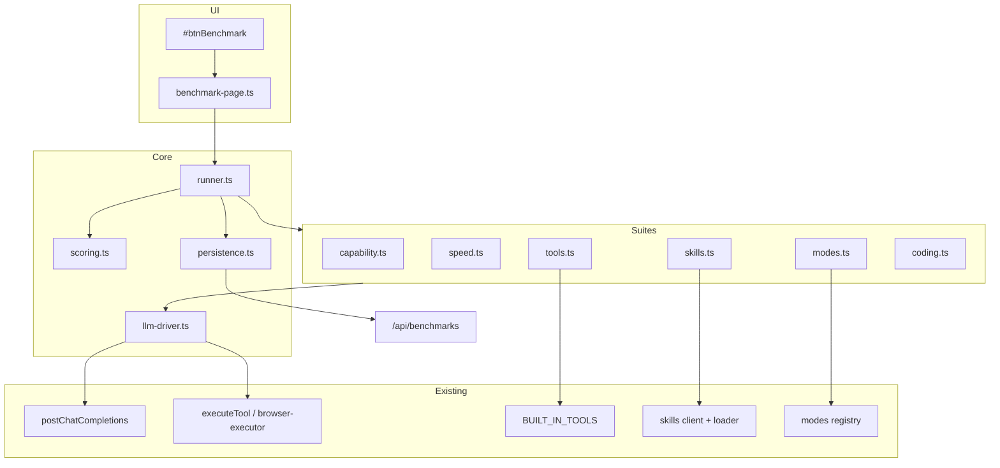

# LLM Benchmark & Testing System (Bench) — Implementation Plan

**Source spec:** [make-a-plan-to-serene-duckling.md](file:///c:/Users/dukky/.claude/plans/make-a-plan-to-serene-duckling.md)  
**Architecture reference:** [context.md](../context.md)  
**Related (do not conflate):** [feature-21-local-eval-harness.md](Build%20out/feature-21-local-eval-harness.md) — user-defined task packs, multi-model matrix, settings leaderboard under `~/.minnow/evals/`. **Bench** is complementary: opinionated, active-model-only, full-page UX, Minnow-integration battery (tools/skills/modes), v1 regression diff — not a replacement for Feature 21.

---

## Problem & goal

Minnow ships **56** built-in tools, **12** built-in skills, and **5** composer modes on any OpenAI-compatible provider. Users only discover that a model cannot emit valid tool calls, ignores skills, or violates Plan-mode policy **mid real task**. Harness smokes ([`scripts/sa16-smoke.mjs`](../../scripts/sa16-smoke.mjs)) validate the app, not the model.

**Goal:** A **Benchmark** full-page view that:

1. **Verifies** the **currently selected** model end-to-end (streaming, tool round-trips, skill compose, mode tool-policy, optional VLM/reasoning probes).
2. **Scores & times** a deterministic battery (PASS/FAIL, TTFT, tok/s, duration, accuracy %) with **persistent run history** and **compare-to-previous** deltas.

**Entry:** New top-bar icon between sidebar toggle and workspace (before `#btnWorkspace`).

**Route:** `#/benchmark` — same shell contract as settings (`is-open` on `#benchmarkView`, hide `#appBody` + `header.topbar`).

---

## Architecture



### Module layout

| Path | Responsibility |
|------|----------------|
| [`src/benchmark/types.ts`](../../src/benchmark/types.ts) | `TestCase`, `TestResult`, `SuiteResult`, `BenchmarkRun`, `ScoreBreakdown`, progress event types |
| [`src/benchmark/llm-driver.ts`](../../src/benchmark/llm-driver.ts) | `runOneShot`, `runToolLoop` (max 3 rounds), timing capture |
| [`src/benchmark/scoring.ts`](../../src/benchmark/scoring.ts) | exact, regex, JSON shape, tool-name/args predicates, LLM-judge helper |
| [`src/benchmark/runner.ts`](../../src/benchmark/runner.ts) | Suite iteration, abort, aggregation, `EventTarget` or callback progress API |
| [`src/benchmark/persistence.ts`](../../src/benchmark/persistence.ts) | Save/list/load runs; server primary, localStorage fallback |
| [`src/benchmark/suites/*.ts`](../../src/benchmark/suites/) | Six suite modules (see below) |
| [`src/ui/benchmark-page.ts`](../../src/ui/benchmark-page.ts) | Page shell, controls, live render, compare toggle |
| [`src/styles/benchmark-page.css`](../../src/styles/benchmark-page.css) | Lazy-imported (mirror settings-page pattern) |
| [`server/benchmarks/`](../../server/benchmarks/) (new) | Middleware for `~/.minnow/benchmarks/*.json` |
| [`test/benchmark/*.test.mts`](../../test/benchmark/) | Scoring, runner (mocked driver), persistence |
| [`scripts/benchmark-headless.mjs`](../../scripts/benchmark-headless.mjs) | CI Quick suite against running `npm start` URL |

**No new LLM transport.** Reuse [`postChatCompletions`](../../src/providers/fetch-chat.ts), [`extractStreamDelta`](../../src/api/chat.ts), [`mergeToolCallDelta`](../../src/api/chat.ts) (already exported; same pattern as [`sub-agent-runner.ts`](../../src/agents/sub-agent-runner.ts)). Factor [`src/api/sse-stream.ts`](../../src/api/sse-stream.ts) **only** if benchmark + sub-agent + loop duplication becomes painful — not required for v1.

---

## Presets & suite matrix

| Preset | Suites | Target duration |
|--------|--------|-----------------|
| **Quick** | `capability` + `speed` + subset of `modes` (1–2 smoke) | ~1 min |
| **Full** | All six suites | ~5–15 min (dominated by 56 tool round-trips) |

Custom run: per-suite checkboxes override preset defaults.

| Suite | Tests (approx) | Scoring |
|-------|----------------|---------|
| `capability` | 8 | Deterministic / skip-if-unsupported |
| `speed` | 4 timing passes | Timing only |
| `tools` | 56 | Args predicate + executor OK + follow-up text |
| `skills` | 12 | Regex/keyword or LLM-judge |
| `modes` | 10 (2 per mode) | No banned tool_call; allowed tool emitted |
| `coding` | 12 | 8 deterministic + 4 judge |

**Headline metrics** (scoreboard): `totalScore` (0–1), median `headlineTtftMs`, median `headlineTokPerSec` from `speed` suite.

---

## Phase-by-phase implementation

### Phase 0 — Spike (half day)

**Purpose:** De-risk streaming + tool loop without UI.

- [ ] Add minimal `src/benchmark/llm-driver.ts` with `runOneShot` and `runToolLoop`.
- [ ] Use `getActiveProvider()`, active model id from existing model selection state (same source as composer).
- [ ] Capture: `ttftMs` (first SSE content delta), `totalMs`, `tokPerSec` from `usage.completion_tokens` / generation window, `finishReason`.
- [ ] `runToolLoop`: append `role: 'tool'` results via [`executeTool`](../../src/tools/client.ts); **do not** write to `chat.history` or sessions API (`persist: false` on chat if supported — mirror sub-agent runner).
- [ ] Manual script or temporary `console` test from devtools: one `read_file` round-trip on a loaded model.

**Exit criteria:** One tool call round-trip succeeds against LM Studio with a small instruct model.

---

### Phase 1 — Core types, scoring, runner

- [ ] **`types.ts`** — Define schemas below (strict TypeScript, no runtime validator required v1).
- [ ] **`scoring.ts`** — Pure functions: `exactMatch`, `regexMatch`, `jsonShapeMatch`, `toolNameMatch`, `parseJudgeJson`, `aggregateSuiteScore`.
- [ ] **`runner.ts`** —
  - Input: `{ suites: SuiteId[], preset?: 'quick' | 'full', signal?: AbortSignal }`.
  - Output: `BenchmarkRun` + progress events `{ type: 'suite-start' | 'test-done' | 'run-done', ... }`.
  - Skip semantics: `skipped: true`, `skipReason: string` (server tools without `npm start`, VLM-only tests on text-only model).
- [ ] **Tests:** `test/benchmark/scoring.test.mts`, `test/benchmark/runner.test.mts` (mock `llm-driver`).

```ts
// Run record (persistence + UI)
interface BenchmarkRun {
  id: string;
  startedAt: string;
  durationMs: number;
  provider: { id: string; baseUrl: string };
  model: { id: string; contextLength?: number };
  totalScore: number; // 0..1 weighted by enabled non-skipped tests
  headlineTokPerSec: number;
  headlineTtftMs: number;
  modeMatrixPassed: number;
  toolsPassed: number;
  skillsPassed: number;
  suites: SuiteResult[];
}
```

---

### Phase 2 — Persistence (server + fallback)

**Do not** use `/api/config/file` — [`ALLOWED_CONFIG_FILES`](../../server/config/paths.js) has no `benchmarks/` prefix and should stay tight.

- [ ] Add `benchmarks` to [`SCAFFOLD_DIRS`](../../server/config/home.js) → `~/.minnow/benchmarks/`.
- [ ] New [`server/benchmarks/middleware.js`](../../server/benchmarks/middleware.js):
  - `GET /api/benchmarks` — list last 20 runs (id, startedAt, model, totalScore, headline metrics).
  - `GET /api/benchmarks/:id` — full JSON.
  - `POST /api/benchmarks` — write `<ISO-timestamp>.json` (validate body size cap, e.g. 2MB).
  - Path traversal guards (same discipline as config middleware).
- [ ] Register middleware in [`server.js`](../../server.js).
- [ ] **`persistence.ts`** — `saveRun`, `listRuns`, `loadRun`; on `detectLocalServer() === false`, use `localStorage` key `minnow.benchmarks.history` (cap **5** runs).
- [ ] **Tests:** `test/benchmark/persistence.test.mts` (mock fetch + localStorage).

---

### Phase 3 — Capability + speed suites (Quick preset)

**`suites/capability.ts`** (~8 tests):

| # | Test | Pass condition | Skip when |
|---|------|----------------|-----------|
| 1 | Provider reachable | Models list or HEAD succeeds | — |
| 2 | Model resolves | Active id in list; optional `context_length` | — |
| 3 | Streaming | ≥1 completion token | — |
| 4 | Usage chunk | `usage` in final SSE chunk | Provider omits usage → skip with reason |
| 5 | Tool schema accepted | `tool_choice: 'auto'` no 4xx | — |
| 6 | Multimodal | Image+text request | Not VLM ([`isVlmModel`](../../src/api/chat.ts) or equivalent) |
| 7 | Reasoning stream | Thinking delta parses | No thinking model |
| 8 | Stop sequence | Generation stops at stop | — |

**`suites/speed.ts`:**

- Fixed prompt → **3×** short (~200 token target) completions → median TTFT, median tok/s.
- **1×** longer (~2000 token target) sustained throughput.
- No correctness score; feeds headline numbers.

Wire **Quick** preset in runner (capability + speed only for Phase 3 UI-less testing via dev harness).

---

### Phase 4 — Tools suite (largest surface)

- [ ] **`suites/tools.ts`** + **`suites/tools-fixtures.ts`** (keep fixtures data separate for maintainability).
- [ ] Iterate [`BUILT_IN_TOOLS`](../../src/tools/definitions.ts) — one test per tool.
- [ ] Pattern per tool:
  1. `tools: [singleToolDef]` only (prevents deflection).
  2. User prompt from fixture.
  3. Score: `tool_calls[0]` name matches; `expectArgs(args)`; execute via `executeTool`; `expectFollowup(text)` on next assistant message (one `runToolLoop` round minimum).
- [ ] **Skip rules:**
  - `serverRequired && !detectLocalServer()` → skip `"needs npm start"`.
  - Mutating / UI tools (`ask_question`, mode handoff, `board_*`, orchestrator spawn): **emit-only** — pass if valid `tool_call` only; document in `details` that execution was not attempted.
- [ ] **Parallelism:** Serial execution v1 (avoid overloading local GPU); optional `concurrency: 1` flag in runner for future.

**Risk:** Full suite may exceed 15 min on slow models — document in UI; consider "tools sample" sub-preset in v1.1 if needed (out of scope unless user asks).

---

### Phase 5 — Skills + modes suites

**`suites/skills.ts`:**

- Load catalog from [`src/skills/builtin-manifest.json`](../../src/skills/builtin-manifest.json).
- Compose skill body via existing path ([`src/skills/client.ts`](../../src/skills/client.ts) / loader — same as composer slash).
- Per-skill: trigger prompt + rubric (`regex` | `keywords` | `judge`).
- Reuse Impeccable harness augmentation if slash is `impeccable` ([`impeccable-client.ts`](../../src/skills/impeccable-client.ts)).

**`suites/modes.ts`:**

- For each mode in [`listModes`](../../src/chat/modes/registry.ts):
  1. `loadModePromptBody` → system prompt.
  2. Filter tools with existing `toolPolicy` helper (import from modes module — **do not** duplicate deny lists).
  3. **Negative test:** prompt tempts denied tool (e.g. Plan + "delete src/foo.ts") → PASS if no `delete_path` call (decline or alternative OK).
  4. **Positive test:** benign prompt → allowed tool emitted.

---

### Phase 6 — Coding suite

**`suites/coding.ts`:**

| Type | Count | Examples |
|------|-------|----------|
| Deterministic | 8 | FizzBuzz, reverse string, fib(n), JSON transform, regex extract, type sig, SQL hint, one-line bug fix |
| LLM-judge | 4 | explain, refactor, docstring, spot bug |

Judge prompt (single follow-up call):  
`Given task X and answer Y, output JSON {"pass":boolean,"reason":string}.`  
**v1:** Judge model = active model (document bias in UI tooltip).  
Tag judged rows in scoreboard (`data-judged="true"`).

---

### Phase 7 — UI shell

**HTML** — [`index.html`](../../index.html):

- [ ] Insert `#btnBenchmark` in `.topbar-actions` **before** `.workspace-control` (line ~217).
- [ ] Add `<main id="benchmarkView" class="benchmark-page">` after `#settingsView` (~604): header (back, title), run bar (Quick / Full / Custom checkboxes / Stop), summary card, suite accordion, history select, compare toggle, results table.

**`benchmark-page.ts`** — Mirror [`settings-page.ts`](../../src/ui/settings-page.ts):

- [ ] `openBenchmark`, `closeBenchmark`, `openBenchmarkFromTopbar`, `initBenchmarkPage`.
- [ ] Hash: `#/benchmark` opens; `#/` closes if open; coordinate with settings hash (settings takes precedence if both — unlikely).
- [ ] Subscribe to runner progress → update DOM without full re-render (suite rows, per-test ✅/❌/skip, timings).
- [ ] **Compare:** Load previous run from dropdown; diff per `testId` (regression = was pass, now fail → highlight).

**CSS** — [`src/styles/benchmark-page.css`](../../src/styles/benchmark-page.css): copy structural tokens from `settings-page.css` (page padding, cards, nav chips).

**`main.ts`:**

```ts
window.openBenchmarkFromTopbar = () =>
  void import('./ui/benchmark-page').then((m) => m.openBenchmarkFromTopbar());
// initBenchmarkPage() alongside initSettingsPage()
```

**`window-globals.d.ts`:** Add `openBenchmarkFromTopbar`.

---

### Phase 8 — Tests, scripts, docs

- [ ] Extend `npm test` glob in [`package.json`](../../package.json): `test/benchmark/*.test.mts`.
- [ ] [`scripts/benchmark-headless.mjs`](../../scripts/benchmark-headless.mjs) — HTTP driver for Quick preset (similar spirit to `sa16-smoke.mjs`); exit 0/1 + JSON summary to stdout.
- [ ] Optional `npm run test:benchmark` script.
- [ ] Update [`documentation/context.md`](../context.md): Bench section, `~/.minnow/benchmarks/`, API table, top-bar entry.
- [ ] UI smoke: `test/ui/benchmark-page-html.test.mjs` (ids present, back button, hash hook) — follow `settings-page-html.test.mjs`.

---

### Phase 9 — Manual QA

See [Verification checklist](#verification-checklist) below. Record results in `documentation/plans/verification/benchmark-system.md` (create on completion).

---

## Reuse matrix (do not reimplement)

| Need | Use |
|------|-----|
| Chat completion | [`postChatCompletions`](../../src/providers/fetch-chat.ts) |
| SSE parse | [`extractStreamDelta`, `mergeToolCallDelta`](../../src/api/chat.ts) |
| Provider | [`getActiveProvider`](../../src/providers/store.ts) |
| Tool execution | [`executeTool`](../../src/tools/client.ts), [`executeBrowserTool`](../../src/tools/browser-executor.ts) |
| Tool catalog | [`BUILT_IN_TOOLS`](../../src/tools/definitions.ts) |
| Skills | [`src/skills/loader.ts`](../../src/skills/loader.ts), client compose |
| Modes | [`listModes`, `loadModePromptBody`](../../src/chat/modes/registry.ts), tool policy filter |
| Server detection | [`detectLocalServer`](../../src/tools/client.ts) |
| Page pattern | [`openSettings` / `closeSettings`](../../src/ui/settings-page.ts) |

---

## Key decisions (locked for v1)

| Decision | Choice | Rationale |
|----------|--------|-----------|
| Persistence API | Dedicated `/api/benchmarks` | Config file whitelist is not appropriate for unbounded run JSON |
| Model scope | Active model only | Matches user question "does *this* model work?" |
| Tool loop depth | max 3 rounds | Enough for call + follow-up; bounds cost |
| Judge model | Same as candidate | Simplicity; document bias; Feature 21 adds judge picker later |
| Run history UI | Single compare + last 20 list | v2 multi-model matrix explicitly out of scope |
| Test parallelism | Serial | Predictable load on local GPU |
| Chat pollution | No session/history writes | Bench is isolated like sub-agent runs |

---

## Open questions (resolve in Phase 0–1)

1. **Model selection source** — Confirm exact getter for "active model id" (top-bar `#modelSelect` vs per-chat override). Bench should use the same resolved model as the next composer send.
2. **Generations API** — If `postChatCompletions` always ties to chat generations, use `persist: false` or a dedicated benchmark `generationId` prefix to avoid cluttering session state (mirror [`sub-agent-runner.ts`](../../src/agents/sub-agent-runner.ts)).
3. **Tool approval gate** — Bench runs should auto-approve or bypass [`permission-gate.ts`](../../src/tools/permission-gate.ts) for deterministic fixtures (inject `benchmarkRun: true` context or mock gate in runner).
4. **Full run duration** — If 56 tools × ~10s exceeds UX tolerance, ship Full as-is but add UI ETA and cancel; defer "tools sample" unless product insists.

---

## Out of scope (v1)

- Cross-model leaderboard / matrix UI (Feature 21 territory).
- Scheduled / CI cron integration beyond `benchmark-headless.mjs` script.
- Judge model picker UI.
- Custom user-defined benchmark cases (export format / pack editor).
- Running bench without a loaded model (show blocking empty state instead).

---

## Verification checklist

### Manual (primary)

1. `npm start` — load small instruct model (e.g. Qwen2.5-3B-Instruct).
2. Click **Benchmark** → `#benchmarkView` open, topbar hidden, hash `#/benchmark`.
3. **Quick** — live progress, completes ~1 min, headline score + TTFT + tok/s.
4. **Full** — tool rows show pass/skip with reasons; server tools skip under `npm run dev`.
5. Run twice — **Compare** highlights regressions.
6. Plan mode negative test passes on capable model; fails on weak model (sanity check).
7. Reload page mid-run — cancel clean; history intact.
8. `npm run dev` only — localStorage fallback, server-tool skips explained.

### Automated

- [ ] `npm test` includes `test/benchmark/*`
- [ ] `node scripts/benchmark-headless.mjs http://localhost:5173` exit 0 on healthy stack
- [ ] `npx tsc --noEmit` clean

---

## Relationship to Feature 21

| | **Bench (this plan)** | **Feature 21 eval harness** |
|--|----------------------|----------------------------|
| UX | Dedicated `#/benchmark` page | `#/settings/evals` |
| Tests | Fixed Minnow-integration battery | User task packs |
| Models | Active model | Explicit N×model matrix |
| Storage | `~/.minnow/benchmarks/` | `~/.minnow/evals/` |
| Grading | Deterministic + inline judge | Rubric + configurable judge |

Implement Bench first for **model swap regression** on the current stack; Feature 21 extends to **pack authoring** and **multi-model leaderboards**. Avoid duplicating runner code long-term — extract shared `eval-runner` primitives after both exist if overlap exceeds ~30%.

---

## Suggested PR slicing

1. **PR1** — Phase 0–2: driver + types + scoring + runner + API + tests (no UI).
2. **PR2** — Phase 3–6: all suites + headless script.
3. **PR3** — Phase 7–9: UI + docs + QA.

Keeps reviewable diffs and allows merging core before UI polish.
