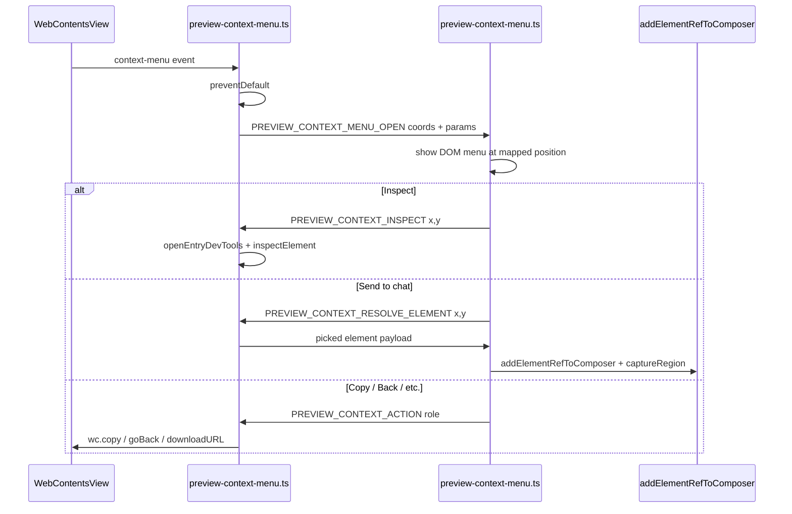

# Browser right-click context menu

## Goal

Right-clicking inside the built-in browser should show a **Minnow-styled DOM menu** with normal browser actions, **Inspect** (opens docked DevTools and selects the element), and **Send to chat** (adds the same element context as Design Mode Select — an `elementRef` attachment chip — without auto-sending).

**Scope:** Electron desktop shell only (`WebContentsView` guest). Plain `npm run dev` iframe fallback keeps the browser default menu (no change).

## Why main + renderer split

The preview guest is a native `WebContentsView` overlay ([`electron/preview-host.ts`](electron/preview-host.ts)); right-clicks never hit renderer DOM. The guest must be intercepted in main:

Menu position: map guest `(params.x, params.y)` to renderer client coords using `#previewBody.getBoundingClientRect()` (guest is sized to match `#previewBody` via [`preview-electron-visibility.ts`](src/ui/preview-electron-visibility.ts)).

## Menu items

Build items conditionally from Electron `ContextMenuParams` (forwarded from main):

| Group | Items | Handler |
|-------|-------|---------|
| Navigation | Back, Forward, Reload | `wc.canGoBack()` / `goBack()`, etc. via new IPC |
| Link (`linkURL`) | Open in new tab, Copy link address, Open in external browser | Renderer: `openPreviewTabWithCapacity({ kind:'url', url })`; clipboard; main: `shell.openExternal` |
| Image (`mediaType === 'image'`) | Copy image, Copy image address, Save image as… | main: `wc.copyImageAt(x,y)`, clipboard write `srcURL`, `wc.downloadURL(srcURL)` |
| Text / edit | Cut, Copy, Paste, Select all | main: `wc.cut()`, `wc.copy()`, `wc.paste()`, `wc.selectAll()` |
| Spellcheck (`misspelledWord`) | Suggestions + Add to dictionary | main: `wc.replaceMisspelling()` / `wc.session.addWordToSpellCheckerDictionary` |
| Minnow | **Inspect**, **Send to chat** | Inspect: main `inspectElement` + existing `openEntryDevTools`; Send: CDP resolve → composer chip |

Use the same DOM menu pattern as [`src/ui/file-tree-context-menu.ts`](src/ui/file-tree-context-menu.ts) (`role="menu"`, viewport clamping, dismiss on click/Escape/scroll). Add styles under `.preview-context-menu` in [`src/styles/file-panel.css`](src/styles/file-panel.css) or a small new CSS file imported from preview styles — mirror `.file-tree-context-menu` tokens (`--mn-*`).

## Send to chat (reuse Design Mode pipeline)

**Do not invent a new attachment type.** Reuse [`addElementRefToComposer`](src/attachments/element-ref.ts) exactly as Design Mode Select does in [`src/design/design-tool.ts`](src/design/design-tool.ts):

1. On menu click, invoke main IPC `PREVIEW_CONTEXT_RESOLVE_ELEMENT` with stored `(x, y)`.
2. Main resolves element via CDP one-shot (see below), returns `CdpPickedElement`-shaped payload + `pageUrl` (`wc.getURL()`).
3. Renderer calls `captureRegion()` from [`src/design/region-capture.ts`](src/design/region-capture.ts) for a cropped thumbnail.
4. Renderer calls `addElementRefToComposer({ selector, uid, pageUrl, … })`.
5. Focus active composer via `getActiveComposerSurface().inputEl` (also fix `focusComposerInput()` in `element-ref.ts` which currently hardcodes `#msgInput`).

**User choice:** chip only, no auto-send, no foreground chat panel switch.

Optional: `showToast('Element added to chat')` on success; error toast if CDP resolve fails (e.g. guest mid-navigation).

## CDP element resolution (new shared helper)

Extract the per-node CDP fetch logic already in [`electron/preview-cdp-pick.ts`](electron/preview-cdp-pick.ts) (`handleInspectNode` ~lines 132–190) into a new pure-ish module:

- [`electron/preview-cdp-element-at-point.ts`](electron/preview-cdp-element-at-point.ts)
  - `resolveElementAtPoint(wc, x, y): Promise<CdpPickedElement | null>`
  - Steps: attach debugger (if needed) → `DOM.getNodeForLocation({ x, y })` → `DOM.getBoxModel` / `describeNode` / `getOuterHTML` / `CSS.getComputedStyleForNode` → stamp `data-mn-uid` → [`adaptCdpRawPick`](electron/preview-cdp-adapt.ts)
  - Detach debugger after one-shot (unlike persistent pick session) to avoid conflicting with Design Mode CDP picker
  - Refactor `preview-cdp-pick.ts` to call the shared node-resolution helper internally (DRY, no behavior change to Design Mode)

## IPC / preload surface

Add to [`electron/ipc-channels.ts`](electron/ipc-channels.ts):

| Channel | Direction | Purpose |
|---------|-----------|---------|
| `PREVIEW_CONTEXT_MENU_OPEN` | main → renderer | Open menu: `{ tabId, instanceId, x, y, params }` |
| `PREVIEW_CONTEXT_INSPECT` | renderer → main (invoke) | `inspectElement` + ensure docked DevTools open |
| `PREVIEW_CONTEXT_RESOLVE_ELEMENT` | renderer → main (invoke) | Returns picked element JSON or error |
| `PREVIEW_CONTEXT_ACTION` | renderer → main (invoke) | Enum: `goBack`, `goForward`, `reload`, `copy`, `cut`, `paste`, `selectAll`, `copyLink`, `openExternal`, `copyImage`, `saveImage`, `replaceMisspelling`, `openLinkInNewTab` |

Wire in [`electron/preload.ts`](electron/preload.ts): `onContextMenuOpen(listener)`, `contextInspect(...)`, `contextResolveElement(...)`, `contextAction(...)`. Update [`src/electron.d.ts`](src/electron.d.ts).

Register `wc.on('context-menu', …)` inside `wirePreviewGuestEvents` in [`electron/preview-host.ts`](electron/preview-host.ts) — call into `preview-context-menu.ts` with `(win, tabId, instanceId, entry, params)`.

## Renderer wiring

New modules:

- [`src/ui/preview-context-menu.ts`](src/ui/preview-context-menu.ts) — menu DOM, item builder from `ContextMenuParams`, positioning
- [`src/ui/preview-context-menu-handler.ts`](src/ui/preview-context-menu-handler.ts) — subscribe via preload on init; called from [`src/ui/preview-panel.ts`](src/ui/preview-panel.ts) `initPreviewPanel` (or shell init alongside other preview listeners)

**Open link in new tab:** renderer action calls existing `openPreviewTabWithCapacity({ kind: 'url', url: linkURL })` + `window.minnow.preview.loadURL(url, newTabId)`.

**Inspect:** if DevTools already open, just `inspectElement`; else invoke inspect IPC which calls existing `openEntryDevTools` then `wc.inspectElement(x, y)` ([`preview-host.ts`](electron/preview-host.ts) ~lines 204–220).

## Edge cases

- **Design Mode active:** context menu coexists; no special guard needed (right-click is distinct from Select tool click).
- **DevTools open:** menu still works on guest; inspect highlights in docked DevTools panel.
- **Cross-origin pages:** CDP path works (same as Design Mode CDP pick); no `execJs` required.
- **Debugger contention:** one-shot resolver must detach after resolve; Design Mode CDP session takes precedence if both armed — defer resolve with a clear error if debugger already attached by pick session.
- **Hidden preview:** suppress menu if guest not visible (`entry.visible === false`).
- **Multiple instances:** pass `instanceId` through all IPC so workspace vs design preview instances stay isolated.

## Tests

| File | What |
|------|------|
| `test/electron/preview-context-menu-items.test.mjs` | Pure function: given `ContextMenuParams`, returns expected menu labels/enabled flags |
| `test/electron/preview-cdp-element-at-point.test.mjs` | Mock debugger; verify `adaptCdpRawPick` output shape |
| `test/ui/preview-send-to-chat.test.mts` | Renderer handler: mock IPC resolve + `addElementRefToComposer` called with correct fields |
| `test/attachments/element-ref-focus.test.mts` | `focusComposerInput` uses `getActiveComposerSurface` |

## Documentation

- Save this plan: [`documentation/plans/browser-context-menu.md`](documentation/plans/browser-context-menu.md)
- Update [`documentation/context.md`](documentation/context.md): browser preview section — right-click menu, Inspect, Send to chat (Electron-only)

## File touch list (estimated)

| File | Change |
|------|--------|
| `electron/preview-context-menu.ts` | **new** — intercept guest context-menu, IPC handlers |
| `electron/preview-cdp-element-at-point.ts` | **new** — one-shot CDP resolve |
| `electron/preview-cdp-pick.ts` | refactor to share node resolver |
| `electron/preview-host.ts` | wire context-menu listener |
| `electron/ipc-channels.ts` | new channels |
| `electron/preload.ts` | expose preview context APIs |
| `src/electron.d.ts` | types |
| `src/ui/preview-context-menu.ts` | **new** — DOM menu |
| `src/ui/preview-context-menu-handler.ts` | **new** — action wiring |
| `src/ui/preview-panel.ts` | init handler |
| `src/attachments/element-ref.ts` | fix composer focus |
| `src/styles/…` | menu styles |
| `documentation/context.md` | feature note |
