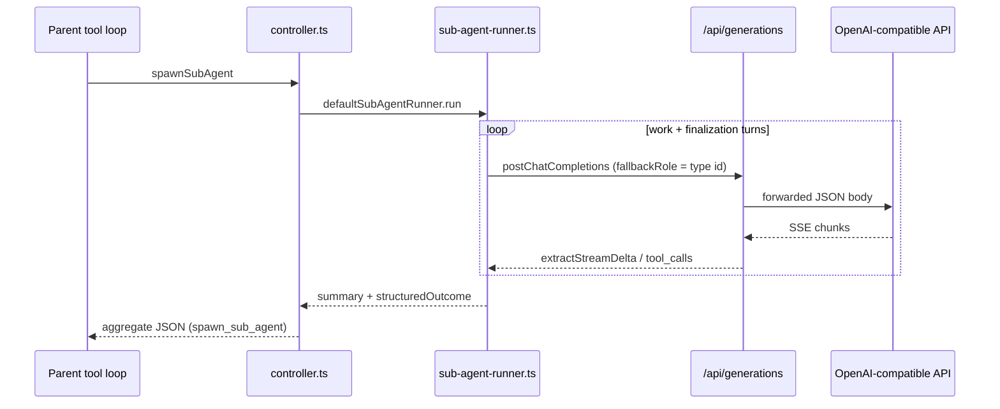

# Sub-agent empty output on OpenAI API providers

## Symptom

Sub-agents work on LM Studio (`apiKind: lm-studio-v0`) but on any **OpenAI v1** provider (`apiKind: openai-v1` — OpenAI, OpenRouter, Groq, etc.) runs **finish with no usable output**: empty transcript, empty or placeholder summary (`Sub-agent completed with no text output.`), or terminal error `Empty response from provider on final turn`.

Main chat on the same provider/model often works.

---

## Verification status

**Confirmed (code analysis).** Multiple sub-agent-specific gaps explain LM Studio vs OpenAI divergence without requiring a single bug.

---

## Architecture recap



Relevant files:

| Area | File |
|------|------|
| Runner | `src/agents/sub-agent-runner.ts` |
| Model binding | `src/agents/resolve-sub-agent-binding.ts` |
| Thinking fields | `src/agents/thinking-to-body.ts`, `merge-thinking-body.ts` |
| Sampler | `src/agents/resolve-sampler.ts`, `sampler-types.ts` |
| Structured final turn | `src/agents/sub-agent-structured-outcome.ts`, `sub-agent-outcome-response-format.ts` |
| Main chat parity | `src/tools/loop.ts` (`resolveTurnContinuation`, `EMPTY_POST_TOOL_CONTINUE_INSTRUCTION`) |
| SSE text | `src/api/chat.ts`, `src/api/message-content.ts` |

---

## Root causes (ranked)

### 1. LM Studio–specific fields sent to OpenAI v1 providers (high)

Sub-agent completions always merge sampler + thinking patches into the outbound body. Shipped sub-agent samplers include **non-OpenAI parameters**:

```json
"sampler": { "temperature": 0.7, "topP": 0.8, "topK": 20, "presencePenalty": 1.5 }
```

(`src/agents/defaults/sub-agents.json` — `explore`, others similar)

`samplerToCompletionFields` maps these to `top_k`, `min_p`, `repetition_penalty`, etc. The official OpenAI Chat Completions API does **not** support `top_k`, `min_p`, or `repetition_penalty`. LM Studio accepts them; strict OpenAI endpoints may return **400** or, on some proxies, **200 with an empty `choices` array**.

Additionally, `thinkingToCompletionBody` always sends for `openai-v1`:

- `reasoning_effort: "none"` when sub-agent thinking is off (`explore` ships `thinkingMode: "off"`)
- `reasoning: { effort: "none" }`
- `enable_thinking: false`

`enable_thinking` is an LM Studio / Qwen convention, not OpenAI. `reasoning_effort: "none"` is not a documented OpenAI value (valid values are typically `low` / `medium` / `high` on reasoning models). Main chat often runs with thinking **on** (`reasoning_effort: "medium"`), so the same provider can work in chat but fail in sub-agents.

**Why LM Studio works:** extra fields are ignored or supported.

---

### 2. Missing empty post-tool continuation (high)

Main chat (`src/tools/loop.ts`) retries when the model returns **no prose after tool results**:

```typescript
// resolveTurnContinuation → 'retryEmpty'
ephemeralPostToolInstruction = EMPTY_POST_TOOL_CONTINUE_INSTRUCTION;
```

Sub-agent runner (`sub-agent-runner.ts`) has **no equivalent**. After tool rounds, OpenAI models frequently return `content: ""` with `finish_reason: "stop"`. The runner skips tool-nudge (because `toolTurns > 0`), prose is empty, and it jumps straight to structured finalization. That can succeed, but when finalization also yields empty text (see #3), the run ends with no output.

---

### 3. Structured-outcome finalization + OpenAI `response_format` (medium–high)

After work turns, the runner calls `requestStructuredOutcome`, which may attach `response_format` when `isStructuredOutcomeResponseFormatAvailable` is true (common after probing OpenAI).

Issues:

1. **Streaming structured output:** finalization always uses `stream: true` but does **not** check `capabilities.structuredOutputStreaming`. OpenAI structured streaming often emits `delta.content: null` until the last chunk; some proxies put JSON in `delta.tool_calls[].function.arguments` instead of `content`.
2. **Non-streaming fallback reads only `message.content`:** `extractMessageText` / `completionTextForTurn` do not read `message.parsed` (SDK/object form) or `refusal`. Empty `content` + populated `parsed` → treated as empty.
3. Retry without `response_format` exists but runs **after** two empty attempts; if the body still carries bad fields from #1, the retry can also be empty.

There is already strip-and-retry for `response_format` rejection and one empty-body retry; the gap is **text extraction** and **streaming gating**.

---

### 4. Provider binding defaults to LM Studio, not parent chat (medium — configuration trap)

`resolveSubAgentModelBinding`:

```typescript
const providerId =
  typeConfig.providerId?.trim() ||
  parentChat?.providerId?.trim() ||
  typeConfig.providerId;
```

All shipped types set `providerId: "lm-studio-local"`. That value is always truthy, so **parent chat’s OpenAI provider is never inherited**. Users who only switch the main chat model but not Settings → Models → Sub-agent types may think they are testing OpenAI sub-agents while still hitting LM Studio.

When users **do** set an OpenAI provider on sub-agent rows, this trap is avoided — but it explains “works on LM Studio, broken on OpenAI” reports during casual testing.

---

### 5. Sub-agent `fallbackRole` uses type id (low–medium)

`streamSubAgentTurn` passes `fallbackRole: input.type` (e.g. `"explore"`) to `postChatCompletions`. Main chat uses `fallbackRole: 'main-chat'`. If fallback chains are enabled, misconfigured per-type chains can route sub-agent traffic to the wrong backend before any bytes arrive. Default fallback is off.

---

### 6. No `max_completion_tokens` mapping for o-series / gpt-5 (medium for reasoning models)

Sub-agents always send `max_tokens` (default **2048** via `resolveSamplerPreset`). OpenAI reasoning models expect `max_completion_tokens`. Odysseus handles this in `llm_core.py`; Minnow does not. This can yield truncated or empty visible output on `o1` / `o3` / `gpt-5` class models while chat might use a higher drawer limit.

---

## Proposed fix

**Do not implement in this document** — recommended phased approach:

### Phase A — OpenAI-safe outbound body (highest impact)

Add `src/providers/sanitize-completion-body.ts`:

- Input: `provider.apiKind`, `modelId`, completion body
- For `openai-v1`:
  - **Remove:** `top_k`, `min_p`, `repetition_penalty`, `enable_thinking`
  - **Thinking:** if `apiKind === 'openai-v1'` and mode is `off`, **omit** `reasoning_effort` / `reasoning` entirely (do not send `"none"`)
  - **Thinking on:** send `reasoning_effort` only when model catalog / known-model table indicates a reasoning model
  - **Token limit:** if model id matches o-series / gpt-5 heuristics, rename `max_tokens` → `max_completion_tokens` and drop `max_tokens`
  - **Temperature:** omit for models that reject it (o-series), matching Odysseus `_restricts_temperature`

Call from `sub-agent-runner.ts` (and optionally `loop.ts` for parity) immediately before `postChatCompletions`.

### Phase B — Completion text extraction

Extend `extractMessageText` (or a shared `extractAssistantCompletionText`) to:

1. Use existing `content` / multimodal parts
2. If empty and `message.parsed` is object → `JSON.stringify(parsed)`
3. If `message.refusal` → surface as error or prose so finalization does not look “empty”

Use `StreamingContentAccumulator` in `streamSubAgentTurn` (benchmark pattern in `src/benchmark/stream-text.ts`) instead of raw `extractStreamDelta` concatenation.

### Phase C — Sub-agent turn continuation parity

Port from `loop.ts` into `sub-agent-runner.ts`:

- `hasPostToolTail(messages)` on API message list
- `EMPTY_POST_TOOL_CONTINUE_INSTRUCTION` retry (max 1) when `toolTurns > 0` and prose empty

### Phase D — Structured finalization hardening

In `requestStructuredOutcome`:

- If `!capabilities.structuredOutputStreaming`, use `stream: false` for the finalization request (or skip `response_format` on stream path)
- After stream, prefer non-streaming with `response_format` before strip-and-retry
- Log via existing `logSubAgentDebug` when `parsed` / `refusal` present but `content` empty

### Phase E — Provider inheritance UX

- Change shipped default `providerId` from `"lm-studio-local"` to `""` (inherit parent chat)
- Update `resolveSubAgentModelBinding` to treat blank `providerId` as parent fallback, then global active provider
- Settings save: allow clearing provider select to persist `""` (today `providerId || existing.providerId` prevents clear)

### Phase F — Tests & docs

| Test | Assert |
|------|--------|
| `sanitize-completion-body.test.mts` | openai-v1 body drops `top_k`, `enable_thinking`; off-thinking omits `reasoning_effort` |
| `sub-agent-runner-openai.test.mts` | mock SSE empty + mock non-stream `parsed` → structured outcome accepted |
| `sub-agent-runner.test.mts` | empty post-tool → nudge user message appended |
| `resolve-sub-agent-binding.test.mts` | empty type provider → parent provider |

Update `documentation/context.md` § Sub-agent orchestration with OpenAI provider notes.

---

## Test plan (manual)

1. Configure OpenAI provider (`apiKind: openai-v1`), set **Explore** sub-agent type to that provider + `gpt-4o-mini` in Settings → Models.
2. Enable `localStorage.minnowDebugSubAgent = '1'`.
3. General or Build chat: `spawn_sub_agent` type `explore`, task “List files in the repo root and summarize.”
4. **Expect:** tool rounds in drawer, terminal `summary` + `outcome` JSON, non-empty aggregate from `spawn_sub_agent`.
5. Repeat with `thinkingMode: off` on explore (default) and with a reasoning model (`o4-mini`) after Phase A `max_completion_tokens` mapping.
6. Regression: LM Studio sub-agent still runs; constrained tool calls unchanged when enabled.

---

## Todos

- [ ] Add `sanitizeCompletionBodyForProvider` and wire into `sub-agent-runner.ts`
- [ ] Fix `thinkingToCompletionBody` for `openai-v1` + `off` (omit fields, do not send `none`)
- [ ] Extract `message.parsed` / `refusal` in completion text helpers
- [ ] Add empty post-tool continuation to sub-agent runner
- [ ] Gate finalization streaming on `structuredOutputStreaming` probe
- [ ] Default sub-agent `providerId` to inherit parent chat
- [ ] Unit tests + `context.md` update

---

## Estimated effort

| Phase | Effort |
|-------|--------|
| A — body sanitization | 2–3 h |
| B — text extraction | 1–2 h |
| C — post-tool retry | 1 h |
| D — finalization | 1–2 h |
| E — provider inherit | 1–2 h |
| F — tests + docs | 2 h |
| **Total** | **~1–1.5 days** |
