# MinnowOS Desktop Window Shell

**Status:** Shipped (Phases 1–6 complete, 2026-06-15)

**Overview:** Replace MinnowOS full-screen app switching with a desktop-first shell: movable windows for most apps (including a redesigned Calendar), Code always fullscreen, Scheduler as a right side panel with a floating add-task window, and Chat/Research embedded on the wallpaper with animated composer transitions and a collapsible left chat rail.

**Implementation plan source:** adapted from Cursor plan `desktop_window_shell_e67f70ab`.

---

## Completion checklist

| Phase | Scope | Status |
|-------|--------|--------|
| 1 | Window manager, frame, snap, `#osWindowsLayer` / `#osSidePanelsLayer`, `minnowos-windows.css` | ✅ Shipped |
| 2 | Desktop chat — state machine, composer FLIP, session rail, concierge routing | ✅ Shipped |
| 3 | Scheduler side panel + add-task floating window | ✅ Shipped |
| 4 | Research on desktop — floating cards overlay | ✅ Shipped |
| 5 | Windowed apps — Settings, Models, Bench, Compare, Experts | ✅ Shipped |
| 5b | Calendar window redesign — compact toolbar, rail, event editor child window | ✅ Shipped |
| 6 | Tests, docs, cleanup | ✅ Shipped |

| Todo ID | Description | Status |
|---------|-------------|--------|
| `window-manager` | Build window-manager, window-frame, snap logic, layers DOM, CSS | ✅ |
| `presentation-modes` | `presentationMode` on app registry; app-host routing | ✅ |
| `desktop-state` | desktop-state machine, composer-dock DOM, composer-motion.ts | ✅ |
| `desktop-composer` | Full composer on desktop (voice, attach, context ring) | ✅ |
| `desktop-chat-rail` | Collapsible left chat rail + floating transcript | ✅ |
| `scheduler-panel` | Right side panel + job editor window | ✅ |
| `research-desktop` | Research cards on wallpaper | ✅ |
| `windowed-apps` | Settings/Models/Bench/Compare/Experts windows; Code fullscreen-only | ✅ |
| `calendar-window-redesign` | Compact calendar window + event editor child window | ✅ |
| `routing-cleanup` | `#/app/chat` redirect, chat removed from dock, router updates | ✅ |
| `tests-docs` | OS tests + `documentation/context.md` + this plan | ✅ |

---

## Design intent

**Scene:** Developer at a desk with LM Studio running; the wallpaper stays visible as the primary canvas. Chat and research feel like overlays on that canvas, not separate full-screen apps. Windowed utilities float above the desk without hiding it.

**Register:** product — calm, task-focused, flat chrome. Floating transcript has **no panel background** (bubbles + shadow only). Avoid nested cards and glassmorphism-as-default.

**Motion:** `ease-out-quart` / `--os-ease-out`, 350–500ms for hero fade and composer reposition; context ring fades in after chat starts. Honors `prefers-reduced-motion`.

---

## Presentation modes

| App | Mode |
|-----|------|
| Code | `fullscreen` (always) |
| Chat | `desktop` (removed as dock app) |
| Research | `desktop` (cards on wallpaper) |
| Scheduler | `sidePanel` (right rail) |
| Calendar | `window` (movable, snap; compact layout) |
| Settings, Models, Bench, Compare, Experts | `window` (movable, snap, optional maximize) |

---

## Architecture

```mermaid
flowchart TB
  subgraph stage [osStage]
    DesktopLayer[osDesktopLayer]
    WindowsLayer[osWindowsLayer]
    SidePanelsLayer[osSidePanelsLayer]
    AppsLayer[osAppsLayer fullscreen only]
  end

  DesktopLayer --> Wallpaper[wallpaper]
  DesktopLayer --> Hero[greeting hero fadeable]
  DesktopLayer --> ChatRail[left chat rail tab]
  DesktopLayer --> Transcript[floating transcript column]
  DesktopLayer --> Composer[docked composer bar]
  DesktopLayer --> ResearchCards[research cards overlay]

  WindowsLayer --> WinCalendar[Calendar window]
  WindowsLayer --> WinSettings[Settings window]
  WindowsLayer --> WinModels[Models window]
  WindowsLayer --> WinAddTask[Scheduler add-task window]
  WindowsLayer --> WinEventEditor[Calendar event editor window]

  SidePanelsLayer --> SchedulerPanel[scheduler task list]

  AppsLayer --> CodeLayer[Code fullscreen only]
```

**Z-index stacking (bottom → top):** wallpaper → transcript → desktop chat + dock (`12`) → windows (`15`) → workspace drawer (`20`) → side panels (`25`) → menubar (`40`).

**Key modules**

| Area | Primary files |
|------|----------------|
| Shell / windows | `shell.ts`, `app-host.ts`, `window-manager.ts`, `window-frame.ts`, `window-snap.ts`, `window-mounted-apps.ts`, `minnowos-windows.css` |
| Desktop chat | `desktop.ts`, `desktop-state.ts`, `desktop-chat.ts`, `concierge.ts`, `desktop-chat-rail.ts`, `composer-motion.ts`, `minnowos-desktop.css` |
| Composer wiring | `composer-surface.ts`, `chat-mount.ts`, `composer-voice.ts`, `context-usage-surface.ts` |
| Scheduler | `scheduler-side-panel.ts`, `scheduler-panel.ts`, `job-editor-window.ts` |
| Research | `research-desktop.ts`, `panel.ts` (legacy non-OS) |
| Calendar | `calendar-page.ts`, `calendar-panel.ts`, `event-editor-window.ts`, `calendar-window.css` |
| Routing | `router.ts`, `instances.ts`, `app-registry.ts`, `types.ts`, `page-bridge.ts` |

**Persistence:** window bounds in `localStorage` key `minnow.os.windows`.

---

## Tests

| Suite | Path | Notes |
|-------|------|-------|
| Window manager | `test/os/window-manager.test.mts` | open/close/focus/minimize/snap/persist |
| Window apps | `test/os/window-apps.test.mts` | Settings/Models/Bench/Compare/Experts/Calendar |
| Desktop chat | `test/os/desktop-chat-state.test.mts` | idle/chatActive, legacy redirects |
| Desktop research | `test/os/desktop-research-state.test.mts` | researchIdle/researchActive |
| Scheduler | `test/os/scheduler-app.test.mts` | side panel, job editor window |
| Calendar | `test/os/calendar-app.test.mts` | window shell, event editor child |
| Router | `test/os/router.test.mts` | hash routes, chat/research redirects |

Run individually: `npx tsx --import ./test/test-loader.mjs --test test/os/<suite>.test.mts`

---

## Known remaining items

1. **`#chatView` legacy DOM** — kept hidden for non-OS mode and notification deep-links; desktop chat has parity for primary flows. Full removal deferred until legacy chat-app paths are migrated.
2. **Test runner hang** — `desktop-chat-state` and `desktop-research-state` suites pass all assertions but the Node process may not exit promptly (happy-dom teardown); run individually, not batched with router if CI hangs.
3. **Dual composer paths** — desktop uses `#desktopInput`; Code uses `#msgInput`; routing via `getActiveComposerSurface()` must stay in sync when adding features.

---

## Risk notes (from planning)

1. **Dual composer paths** — many modules hardcode `#msgInput`; desktop composer needs the same `getActiveComposerSurface()` routing.
2. **Z-index stacking** — define layer order explicitly when adding new overlays.
3. **Calendar child windows** — parent Calendar window must stay grid owner; event editor refreshes parent on close without stealing z-order permanently.
4. **Concierge blur** — docked composer uses solid `--os-surface`, hairline border (flat chrome).

---

## Related docs

- Architecture reference: [`documentation/context.md`](../context.md) — MinnowOS shell section
- Original MinnowOS redesign: [`documentation/plans/minnowos-redesign.md`](minnowos-redesign.md)
- Design prototype: [`documentation/reference/minnowos/`](../reference/minnowos/)
