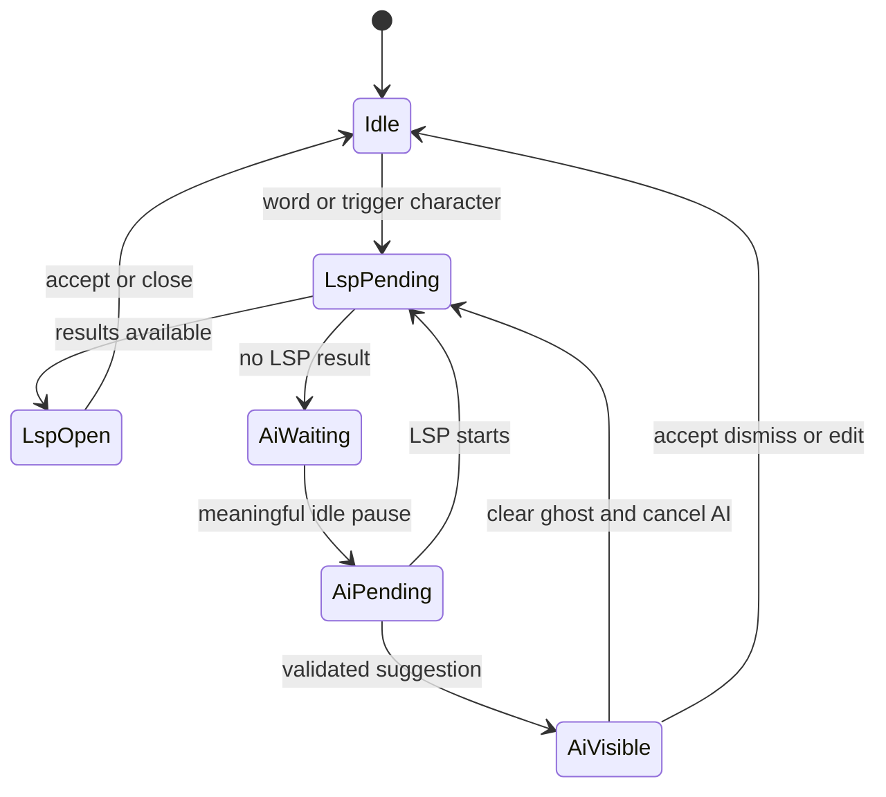

# LSP and AI Completion Quality Plan

## Goal

Make Minnow's editor completion feel IDE-grade while keeping two clear surfaces:

- LSP provides the symbol dropdown and wins whenever its request is pending or its menu is open.
- AI provides inline ghost text only after a meaningful idle pause.
- Tab accepts the active surface. Enter continues to insert a newline.
- AI is not merged into the LSP dropdown.

## Confirmed problems

### LSP dropdown

- Completion reads a buffer that can lag typing by the 400 ms document-sync debounce.
- Server-advertised trigger characters such as `.` are not used.
- LSP `CompletionContext`, `sortText`, `filterText`, `preselect`, and `isIncomplete` are discarded.
- Items are deduplicated by label only, which can remove overloads or distinct symbols.
- Requests are not aborted or locally reused through CodeMirror `validFor`.

### Agent-facing LSP diagnostics

- [`getLspDiagnostics`](../../server/lsp/manager.js) waits a fixed 200 ms for asynchronous `publishDiagnostics`, which is not enough for TypeScript project startup and semantic analysis.
- A missing publication and a confirmed empty diagnostic list both become `No LSP diagnostics`, hiding timeouts and synchronization failures.
- The first empty result can be cached by the generic tool cache for 30 seconds.
- The shared document-sync map can reuse a live editor buffer instead of the saved disk content expected by agent file tools.

### AI ghost text

- [`EditorAiCompletionPlugin.update`](../../src/ui/file-editor-ai-extensions.ts) schedules after almost every document edit and does not check CodeMirror completion state.
- AI's highest-precedence Tab binding can accept a stale ghost while the LSP menu is open.
- [`sanitizeCompletionText`](../../src/ui/editor-ai-completion-prompt.ts) removes leading whitespace, which damages indentation and leading newlines.
- Output alignment removes some prefix duplication but does not remove overlap with the suffix.
- Context is limited to local prefix/suffix, imports, and cursor hover; hover is often empty at an insertion point.
- The Qwen FIM path sends `prompt` to a chat-completions endpoint that normally requires `messages`.
- The unbounded cache omits provider, model, prompt version, configuration, and expiry.
- Client and server config handling disagree: missing `enabled` can become `false`, server fallback defaults differ, token caps differ, and several context/cache toggles are not validated during partial server merges.
- Saving AI settings remounts CodeMirror, which can disturb cursor, selection, and undo state.

## Target interaction

`completionStatus(state) === "pending" || "active"` suppresses AI, cancels any AI generation, clears ghost text, and makes the AI Tab binding return `false`.

## Implementation

### 1. Make LSP requests correct

- Extend [`fetchCompletions`](../../src/lsp/completion-client.ts), [`middleware.js`](../../server/lsp/middleware.js), and [`getLspCompletions`](../../server/lsp/manager.js) to pass the live editor text and call `ensureDocumentSynced(relativePath, { editorText })`.
- Preserve and expose server `completionProvider.triggerCharacters`.
- Detect explicit invocation, trigger characters, and normal identifier typing in [`file-editor-extensions.ts`](../../src/ui/file-editor-extensions.ts).
- Forward LSP `triggerKind` and `triggerCharacter`.
- Use a trigger input handler so member completion opens immediately after characters such as `.`.

### 2. Honor LSP ranking

- Preserve `sortText`, `filterText`, `preselect`, `commitCharacters`, and `isIncomplete`.
- Map those fields to CodeMirror `sortText`, matching label/display label, `boost`, and `commitCharacters`.
- Stable-sort by server `sortText`.
- Replace label-only deduplication with a composite identity that keeps distinct overloads and server results.

### 3. Improve LSP request lifecycle

- Abort requests when the CodeMirror completion context is invalidated.
- Use `validFor` for complete lists so CodeMirror filters locally.
- Re-query incomplete lists with `TriggerForIncompleteCompletions`.
- Add only a small request debounce; defer a completion cache unless profiling proves it useful.

### 4. Fix agent-facing diagnostics

- Define `get_lsp_diagnostics` as saved-disk analysis. Keep editor diagnostics on the existing live-buffer path.
- Add a lazily started agent LSP connection scope with its own process key, document-sync state, and diagnostic snapshots. This prevents a disk diagnostic request from overwriting an unsaved editor document in the editor LSP session.
- Replace `awaitPublishedDiagnostics()` and its fixed sleep with an event-driven waiter registered before `didOpen`/`didChange`.
- Track a per-URI publication sequence and optional LSP version. Wait for the first publication for the requested disk revision, then collect follow-up publications until a short quiet period, bounded by a total timeout.
- Do not treat the first empty publication as final when another syntactic/semantic publication may follow.
- Return distinct outcomes:
  - Confirmed diagnostics: formatted errors/warnings.
  - Confirmed clean: `No LSP diagnostics` only after an empty publication was actually received and settled.
  - Timeout/unavailable: an actionable error stating that diagnostics were not received, including server ID.
- Refresh the agent-scoped document from disk on every content change; reuse its LSP snapshot only when the disk content hash/version is unchanged.
- Make `get_lsp_diagnostics` non-cacheable in [`tool-cache-policy.ts`](../../src/tools/tool-cache-policy.ts). The LSP manager's revision-aware snapshot is the only cache.
- Ensure `shutdownAllLsp`, workspace switching, and process-error cleanup close both editor and agent scopes.

### 5. Add a shared LSP/AI policy

- Add [`src/ui/editor-completion-policy.ts`](../../src/ui/editor-completion-policy.ts) with pure helpers for LSP-busy detection, AI request eligibility, cooldowns, and key precedence.
- Update [`file-editor-ai-extensions.ts`](../../src/ui/file-editor-ai-extensions.ts) to observe pending and active LSP states.
- LSP activity cancels the AI debounce and generation and clears visible ghost text.
- The AI Tab handler returns `false` while LSP is busy, allowing [`fileEditorTabBinding`](../../src/ui/file-editor-keymap.ts) to accept the selected LSP item.
- A late AI stream callback must not restore ghost text while LSP is busy.
- After an LSP/snippet acceptance, apply a short AI cooldown to avoid an immediate competing suggestion.

### 6. Reduce intrusive AI requests

- Request only for a collapsed single cursor after a meaningful document edit.
- Suppress requests for cursor-only movement, IME composition, active/pending LSP, deletion churn, isolated whitespace, repeated punctuation, and completion-accept transactions.
- Allow useful pauses after identifier/expression edits, completed statements, and newlines.
- Keep the configurable debounce but start it only for eligible edits.

### 7. Improve AI relevance

- Structure prompts into path/language, before-cursor context, after-cursor context, recent edits, and insertion constraints.
- Track a bounded in-memory ring of recent changed lines.
- Prefer LSP symbols and nearby diagnostics over unconditional hover at an empty cursor.
- Fetch optional LSP context in parallel with strict timeouts and graceful fallback.
- Apply a deterministic context budget in this order: current line/scope, recent edits, nearby suffix, imports, diagnostics, broader local file context.
- Version the prompt so cache invalidation is explicit.

### 8. Fix AI output alignment

- Replace leading-whitespace stripping with cursor-aware indentation normalization.
- Preserve required leading newlines.
- Remove the longest overlap with both the document prefix and suffix.
- Reject prose, full-file rewrites, unchanged prefix echoes, and overlong insertions.
- Apply the same alignment to streamed partials.
- Only render monotonic, insertable partials; invalid or shorter partials cannot replace a valid ghost.

### 9. Fix transport, cache, and settings

- Use structured chat messages for all current `chatCompletionsPath` providers.
- Do not infer native FIM transport from a Qwen model-name substring. True native FIM requires a future provider capability and dedicated text-completions endpoint.
- Keep thinking disabled for inline completion.
- Replace the cache with a bounded LRU/TTL cache keyed by provider, model, prompt version, relevant settings, path, prefix, and suffix.
- Cache only final validated suggestions; never cache partial, empty, aborted, or errored results.
- Update [`editor-ai-settings.ts`](../../src/ui/editor-ai-settings.ts) to explain LSP-first behavior and recommend a pinned coder model.
- Make client parsing, server defaults, server validators, and Settings limits use one shared schema and defaults. Missing fields must fall back individually rather than disabling completion.
- Make the Settings effective-model readout use the same top-bar-first resolution as runtime binding.
- Migrate the existing native-FIM setting without breaking saved config.
- Apply saved AI settings through live configuration/compartment updates instead of remounting the editor.

## Verification

- Extend [`test/fixtures/fake-lsp.mjs`](../../test/fixtures/fake-lsp.mjs) and [`test/lsp/completion-api.test.mjs`](../../test/lsp/completion-api.test.mjs) for live text, trigger context, ranking fields, and incomplete lists.
- Add `test/lsp/completion-ranking.test.mjs` for stable sorting and composite deduplication.
- Add `test/ui/lsp-completion-source.test.mts` for trigger detection and CodeMirror mapping.
- Add a delayed fake-LSP diagnostic fixture that publishes empty then error diagnostics after more than 200 ms; assert the settled result contains the error.
- Add confirmed-clean and never-publishes fixtures so clean and timeout outcomes cannot be conflated.
- Extend the real TypeScript integration test with deterministic syntax and type errors and assert the agent-facing formatted result.
- Add disk-vs-live-buffer coverage proving agent diagnostics read saved disk without changing the editor-scoped LSP document.
- Assert `get_lsp_diagnostics` is excluded from the generic result cache and that unchanged disk revisions reuse only the manager snapshot.
- Add `test/ui/editor-completion-policy.test.mts` for eligible edits and LSP-to-AI transitions.
- Extend AI prompt/client tests for indentation, prefix/suffix overlap, invalid output, chat payload shape, aborts, and cache isolation.
- Extend keymap tests so pending/active LSP always wins Tab and suppresses ghost text.
- Add minimal dependency injection for completion fetches, LSP context fetches, generation creation/subscription, and timers so integration tests stay deterministic without spawning providers.
- Add config parity tests that assert identical client/server defaults, partial-merge behavior, token limits, and persistence of all AI completion fields.
- Verify saving AI settings preserves the current document, cursor, selection, and undo history.
- Use fixed TypeScript and Python fixtures; do not assert nondeterministic model prose.
- Run `npm run test:lsp`, relevant UI/config tests, `npx tsc --noEmit`, and `npm run build`.

## Acceptance criteria

1. Typing `console.` opens an accurately ranked LSP member list against the current unsaved buffer.
2. Ctrl+Space still opens completion; Tab accepts; Enter remains newline-only.
3. Distinct same-label items remain available.
4. `get_lsp_diagnostics` reports known saved TypeScript errors after project startup and never returns a false clean result merely because 200 ms elapsed.
5. Agent diagnostics do not overwrite or read an unsaved editor buffer, and timeout output is distinguishable from confirmed clean output.
6. While LSP is pending or open, no AI request starts, ghost text is absent, and Tab accepts LSP.
7. If LSP closes without an acceptance, a meaningful idle pause can produce AI ghost text.
8. Whitespace and punctuation churn do not repeatedly trigger AI.
9. AI insertion preserves indentation/newlines and does not duplicate surrounding code.
10. Chat providers receive `messages`, not an unsupported raw `prompt`.
11. Cached suggestions cannot cross model, provider, prompt, or settings boundaries.
12. Partial or legacy config loads preserve defaults consistently, and saving settings does not remount or reset the editor.
13. Automated checks pass and manual TypeScript/Python checks succeed with a configured coder model.

## Todos

- [x] Pass live buffer text and completion context through the LSP API.
- [x] Wire trigger characters and immediate member completion.
- [x] Preserve LSP ranking, filtering, preselection, commit characters, and incomplete-list state.
- [x] Add LSP abort, local filtering, and incomplete-list re-query behavior.
- [x] Add an agent-scoped saved-disk LSP session and event-driven diagnostic settling.
- [x] Distinguish confirmed-clean diagnostics from timeout/unavailable outcomes and remove generic tool caching.
- [x] Add delayed, clean, timeout, real-TypeScript, and disk-vs-editor diagnostic tests.
- [x] Add the shared LSP/AI arbitration policy.
- [x] Gate AI requests to meaningful idle edits.
- [x] Improve AI context with recent edits and bounded LSP signals.
- [x] Implement cursor-aware output alignment and validation.
- [x] Correct chat/FIM transport and replace the completion cache.
- [x] Unify client/server config defaults and validators, update settings guidance, and migrate config safely.
- [x] Hot-apply AI settings without remounting CodeMirror.
- [x] Add deterministic fetch, generation, and timer injection seams for integration tests.
- [x] Add deterministic LSP, AI, coordination, and regression tests.
- [x] Update [`documentation/context.md`](../context.md) after implementation.
