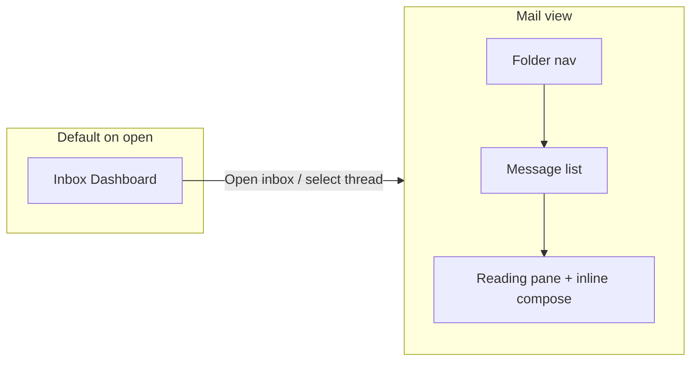
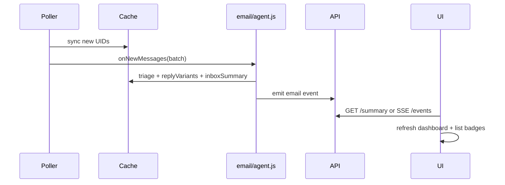

# Agent-First Email Client Redesign

## Design brief (confirmed direction)

**Scene:** Developer at a desk, glancing at Minnow between coding sessions. They want a quick inbox digest, agent-prepared reply options, and a familiar mail UI when they drill in—without modal popups or decorative glass effects.

**Register:** Product (serves task-focused local LLM workflow; uses Minnow `--mn-*` tokens).

**Layout:** Two primary surfaces inside `#emailView`:



- **Dashboard (default):** Account switcher, rolling inbox summary (high/normal/low counts, top threads), “needs attention” cards, and per-thread **reply variant chips** (2–3 drafts: send or reprompt).
- **Mail view:** Acme-style (refs 2–3): top bar (search, sync, account) + **three columns** — folder sidebar | message list with bulk toolbar | reading pane. **Compose lives in the reading pane footer** (reply / forward / new), never a modal.
- **Visual rules:** Flat Minnow chrome (borders, hover veils). No glassmorphism, gradient text, or colored side-stripe selection (use background tint + border per [DESIGN.md](DESIGN.md)).

---

## Current state vs target

| Area | Today | Target |
|------|-------|--------|
| UI | Single column, toolbar + swapped body ([`email-panel.ts`](src/ui/email/email-panel.ts)) | Dashboard + 3-pane mail |
| AI | Manual “Triage visible”; single draft via LLM stub in [`smtp.js`](server/email/smtp.js) | Auto digest, multi-variant replies, agent sorting |
| Live updates | Opt-in poller syncs only ([`poller.js`](server/email/poller.js)) | Poller → triage → variants → summary refresh → client push |
| Mail ops | Read-only IMAP + send | Read/unread, flag, archive, move, delete, bulk, attachments |
| Automations | None for email | Rules on new mail (triage, draft, notify, scheduler job) |
| Agent tools | `list_mail`, `draft_reply` | + `summarize_inbox`, `generate_reply_variants`, `email_action` |

Odysseus reference for porting patterns: [`documentation/reference/odysseus-dev/odysseus-dev/routes/email_routes.py`](documentation/reference/odysseus-dev/odysseus-dev/routes/email_routes.py) (mark-read, archive, move, ai-reply, summarize).

---

## Architecture



**New server modules**

- [`server/email/imap-actions.js`](server/email/imap-actions.js) — IMAP mutations via imapflow: `messageFlagsAdd/Remove` (\\Seen, \\Flagged), `messageMove`, delete/expunge. Update cache after each mutation.
- [`server/email/agent.js`](server/email/agent.js) — LLM pipelines (untrusted wrapping like [`triage.js`](server/email/triage.js)):
  - `buildInboxSummary(accountId)` — digest JSON: counts, top threads, action items.
  - `generateReplyVariants(accountId, threadId)` — 2–3 bodies + labels (e.g. “Brief yes”, “Ask for details”, “Decline politely”).
  - `sortInboxSuggestions(accountId)` — optional priority reorder hints for agent.
- [`server/email/automations.js`](server/email/automations.js) — persisted rules in `~/.minnow/email/automations.json`:
  - Triggers: `on_new_message`, `on_high_urgency`, `on_tag_match`.
  - Actions: `triage`, `generate_variants`, `run_scheduler_job`, `notify` (MinnowOS notification via existing scheduler delivery pattern).
- [`server/email/events.js`](server/email/events.js) — lightweight in-process event bus + optional `GET /api/email/events` (SSE) for open Email app; fallback poll `GET /api/email/summary`.

**Cache schema extensions** ([`cache.js`](server/email/cache.js)):

```ts
// per message
flags: { seen: boolean; flagged: boolean; answered?: boolean }
replyVariants?: Array<{ id: string; label: string; body: string; createdAt: string }>

// per account file
inboxSummary?: { generatedAt: string; text: string; stats: { high: number; normal: number; low: number }; highlights: Array<{ threadId; subject; urgency; summary }> }
```

---

## API additions (`middleware.js` + `client.ts`)

**Read / dashboard**

| Method | Route | Purpose |
|--------|-------|---------|
| GET | `/api/email/accounts/:id/summary` | Dashboard digest + highlights |
| GET | `/api/email/events` | SSE: `summary_updated`, `message_new`, `flags_changed` |
| GET | `/api/email/messages?query=&folder=&offset=&limit=` | Extend client to pass `query` (backend already supports) |

**Standard mail client**

| Method | Route | Purpose |
|--------|-------|---------|
| POST | `/api/email/messages/:id/flags` | `{ seen?, flagged? }` |
| POST | `/api/email/messages/bulk` | `{ ids[], action: read\|unread\|flag\|unflag\|archive\|delete\|move, destFolder? }` |
| POST | `/api/email/messages/:id/move` | Move to folder |
| POST | `/api/email/messages/:id/archive` | Provider-aware archive folder |
| DELETE | `/api/email/messages/:id` | Delete / move to Trash |
| GET | `/api/email/messages/:id/attachments/:index` | Download attachment bytes |
| POST | `/api/email/draft` | New mail draft (not thread reply) |
| POST | `/api/email/messages/:id/reply-variants` | Regenerate variants (`instructions?` for reprompt) |
| POST | `/api/email/messages/:id/reply-variants/:variantId/send` | Send chosen variant (explicit confirm) |

**Automations**

| Method | Route | Purpose |
|--------|-------|---------|
| GET/POST/PUT/DELETE | `/api/email/automations` | CRUD rules |

**Agent tools** (extend [`definitions.ts`](src/tools/definitions.ts) + [`tool-handler.js`](server/email/tool-handler.js)):

- `summarize_inbox` — returns digest for chat agent
- `generate_reply_variants` — variants for a thread
- `email_action` — archive/flag/move (agent proposes; user confirms in UI for destructive ops)

---

## UI implementation

### Shell changes ([`index.html`](index.html), [`email-page.ts`](src/ui/email-page.ts))

- Replace static subtitle header with **compact app chrome**: logo, account picker, view toggle (Dashboard | Mail), search, settings (accounts/automations).
- Mount point becomes full-height flex column; status toasts stay.

### New modules

| File | Role |
|------|------|
| [`src/ui/email/email-dashboard.ts`](src/ui/email/email-dashboard.ts) | Summary cards, urgency stats, highlight list, variant chips with Send / Reprompt |
| [`src/ui/email/email-layout.ts`](src/ui/email/email-layout.ts) | 3-pane shell: sidebar folders, list + bulk toolbar, reading pane |
| [`src/ui/email/email-compose.ts`](src/ui/email/email-compose.ts) | Inline compose block (To/Cc/Subject/body, formatting toolbar lite, attach, Send) |
| [`src/ui/email/email-automations.ts`](src/ui/email/email-automations.ts) | Automation list + rule builder |
| Refactor [`email-panel.ts`](src/ui/email/email-panel.ts) | Orchestrator: routing dashboard ↔ mail, wires SSE/poll, state |

### Mail view UX (regular client features)

**Folder sidebar:** Fetch `GET /folders`; show Inbox/Sent/Drafts/Archive/Trash with unread counts from cache flags.

**List toolbar:** Master checkbox, bulk archive/delete/mark read/flag/move, pagination (`1–50 of N`), sync, filter (All / Unread / Flagged).

**List rows:** Checkbox, sender, subject + snippet, date, unread dot, flag icon, urgency badge (AI), attachment icon.

**Reading pane:** Message header (from/to/date), HTML-safe body render, attachment previews/download, triage summary. **Footer compose:** Reply / Reply all / Forward tabs; variant picker loads pre-generated drafts; “Regenerate” opens reprompt input; Send uses existing confirm flow.

**Search:** Debounced query against cached messages; highlights match in list.

**Responsive:** ≤900px collapses to list-only with reading pane as second step (keep compose at bottom of reading pane).

### Styles ([`email.css`](src/styles/email.css))

Full rewrite using `--mn-*`, `--radius-*`, flat elevation. New BEM-ish prefixes: `.email-dash-*`, `.email-nav-*`, `.email-list-*`, `.email-reader-*`, `.email-compose-*`.

---

## Poller + automation integration

Update [`poller.js`](server/email/poller.js) after successful sync:

1. Diff new UIDs vs `folderCursors`.
2. Auto-triage new messages (respect account setting `autoTriage: true` default on).
3. Generate reply variants for high/normal urgency inbound (configurable).
4. Rebuild `inboxSummary`.
5. Evaluate [`automations.js`](server/email/automations.js) rules.
6. `events.emit('summary_updated', { accountId })`.

When Email app is open, [`email-page.ts`](src/ui/email/page.ts) subscribes to SSE; otherwise dashboard refreshes on next open.

---

## AI reply quality upgrade

Replace template-only [`draftReply`](server/email/smtp.js) body with LLM call (same synthesis config as triage):

- System prompt: untrusted thread fenced, output JSON array of variants.
- Cache variants on message/thread; reprompt appends user instructions and replaces variants.
- **Send** still requires explicit user confirmation (no auto-send tools).

---

## Phased delivery (recommended)

### Phase 1 — Backend mail operations (foundation)
- `imap-actions.js`, cache `flags`, API routes for read/flag/archive/move/delete/bulk
- Fetch/store flags on sync in [`imap.js`](server/email/imap.js)
- Tests: `test/email/imap-actions.test.mjs` with mocked imapflow

### Phase 2 — Agent layer + live summary
- `agent.js`: inbox summary, reply variants, upgrade `draftReply`
- Poller hook: auto-triage + summary rebuild + events
- `GET /summary`, SSE `/events`
- Tests: parser fixtures for variant JSON

### Phase 3 — UI shell + dashboard
- New layout CSS, dashboard view, SSE/poll wiring
- Variant chips: send + reprompt

### Phase 4 — Full 3-pane mail client
- Folder nav, list toolbar, reading pane, inline compose
- Search, pagination, bulk actions, attachments download
- Account setup moves to settings drawer (keep existing form logic)

### Phase 5 — Automations
- `automations.js` + UI builder
- Hook poller; optional integration to run existing [`server/scheduler`](server/scheduler) jobs

### Phase 6 — Agent tools + docs
- New tools in definitions + handlers
- Update [`documentation/context.md`](documentation/context.md) with architecture, limits (Outlook basic auth), automation behavior

---

## Testing plan

- Unit: triage/variant JSON parsers, automation rule matching, cache flag merge
- API: bulk action validation, send confirm gate
- UI smoke: dashboard loads summary; 3-pane selection; compose send confirm
- Manual: Gmail app-password account — sync, flag, archive, variant send

---

## Risks and constraints

- **IMAP provider variance:** Archive/Trash folder names differ (Gmail `[Gmail]/All Mail` vs generic). Port Odysseus `role_flags` heuristics from `email_routes.py`.
- **OAuth accounts:** Flag/move must route through Gmail API when `authType === 'oauth'` (extend [`gmail-api.js`](server/email/gmail-api.js) parallel to IMAP).
- **LLM cost/latency:** Variant generation on every new mail may be heavy; gate with per-account settings (`variantsOnNewMail: 'high_only' | 'all' | 'off'`).
- **No auto-send:** Agent prepares; user always confirms send (aligns with existing MIN-126 policy).

---

## Key files to touch

| Layer | Files |
|-------|-------|
| Server | `imap-actions.js`, `agent.js`, `automations.js`, `events.js`, `cache.js`, `imap.js`, `poller.js`, `middleware.js`, `smtp.js`, `tool-handler.js` |
| Client | `email-panel.ts`, `email-page.ts`, new `email-*.ts` modules, `client.ts`, `email.css`, `index.html` |
| Agent | `src/tools/definitions.ts`, `server/runtime/tools-middleware.js` |
| Docs | `documentation/context.md`, save this plan to `documentation/plans/email-agent-redesign.md` |
