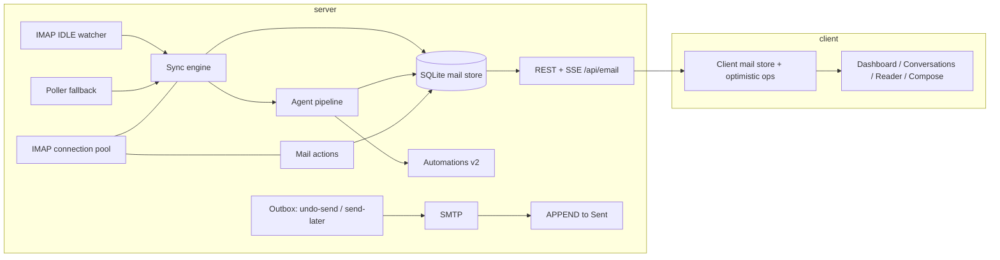

# World-Class AI Email — Review & Build Spec

Reviewed 2026-07-05 against branch `Orchestrator-Fix`. Scope: `server/email/*` (22 modules), `src/ui/email/*` (8 modules), `src/email/client*.ts`, `src/styles/email.css`, agent tools in `src/tools/definitions.ts`, tests in `test/email/`.

---

## Part 1 — Review of the current app

### What's already good

- **Clean layering.** REST middleware → action routers (`mail-actions.js`) → IMAP primitives (`imap-actions.js`) → cache. UI mirrors it (panel → dashboard/layout/compose).
- **The agent-first shape is real.** The `email-agent-redesign.md` plan is essentially shipped: triage with body-hash skip + failure cooldown, reply variants with reprompt, inbox summary, SSE events, automations, poller hooks, and five chat-agent tools.
- **Security fundamentals in the right places.** Credentials in the encrypted secret-box; untrusted email bodies fenced via `wrapUntrusted` before every LLM call; double-pass DOMPurify server-side (`sanitize-html.js`) plus client-side re-sanitize (`email-body.ts`); explicit `confirmed: true` gate on all sends; no auto-send tools.
- **Provider heuristics.** `resolveMailFolder` handles Gmail/Google Mail/generic special-use folders with specialUse flags first, name candidates second.
- **Good test seams.** Parsers (`parseTriageJson`, `parseReplyVariantsJson`, thread id), batch prioritization, and IMAP error mapping are pure functions with fixture tests.

### Verified defects (fix before anything else)

| # | Severity | Defect | Where |
|---|----------|--------|-------|
| D1 | **P0** | `recordTriageFailure` calls `updateMessageTriage` which is **never imported** → `ReferenceError` whenever a triage LLM failure is recorded. The failure-cooldown system silently never engages; the catch around it swallows the crash, so every sync re-hammers the LLM on the same broken message. | `server/email/agent.js:289` (imports at `agent.js:14-21`) |
| D2 | P1 | **Cc field is collected but never sent.** Compose renders a Cc input for replyAll/forward, but the send payload omits it, and server `sendEmail` accepts no `cc`/`bcc` at all. | `src/ui/email/email-compose.ts:467-493`, `server/email/smtp.js:116` |
| D3 | P1 | **Broken threading headers on manual reply.** `References` is set to only `latest.messageId` instead of the accumulated chain (`references + inReplyTo`), so recipients' clients fork the thread. (`draftReply` builds the chain correctly; compose ignores it.) | `src/ui/email/email-compose.ts:490-491` |
| D4 | P1 | **Message-key collisions across folders.** `getCachedMessage` (and every mutation lookup) matches `String(row.uid) === needle` as a fallback — UID 5 in INBOX and UID 5 in Sent are ambiguous; first match wins. Move also rewrites `id` = `${folder}:${uid}`, orphaning any stored `replyVariants`/dashboard references to the old id. | `server/email/cache.js:153-164` and repeated in all 5 mutation helpers |
| D5 | P1 | **Cache read-modify-write races.** Every mutation re-reads and rewrites one big JSON file. The poller, SSE-triggered agent hooks, and UI actions run concurrently → lost updates (a flag write can erase a concurrent triage write). No lock, no queue. | `server/email/cache.js` (all writers) |
| D6 | P2 | **SSE subscription leak.** Each `renderEmailPanel` call creates a fresh local `unsubscribeEvents` (always `undefined` when `?.()` runs) — old subscriptions survive re-renders and keep re-rendering detached DOM. | `src/ui/email/email-panel.ts:248,442-452` |
| D7 | P2 | **`sendReplyVariant` runs a full LLM draft call just to compute to/subject/references** — slow, costs tokens, and the send fails if the LLM is down even though the variant body already exists. | `server/email/smtp.js:166-198` |
| D8 | P2 | **Reply-target logic ignores `Reply-To`, and replies to yourself.** `draftReply` and compose both use `latest.from`; when the latest message in the thread is your own, the reply addresses you. No check against account address, no `Reply-To` support. | `server/email/smtp.js:55`, `email-compose.ts:246` |
| D9 | P2 | **Automation `notify` action is a dead end.** It emits an `automation_notify` SSE event that nothing consumes — the panel only handles `summary_updated`/`message_new`. No OS notification, no toast. | `server/email/automations.js:168-176`, `email-panel.ts:443-452` |
| D10 | P3 | Search misses `bodyText` (only subject/from/preview/to), and there is no IMAP server-side SEARCH fallback for anything not cached. | `server/email/cache.js:126-139` |

### Architecture & performance gaps

- **One TCP+TLS+login IMAP connection per operation.** A star click = full connect/login/logout. `archiveImapMessage` = *three* connections (listFolders, then move's listFolders, then move). `bulkMessageAction` with 100 ids = ~100 sequential connections. This is the single biggest latency source in the app.
- **Sync re-downloads full RFC822 source for the whole page every time.** `syncFolderMessages` fetches the newest 50 messages' complete bodies on every sync, even when nothing changed. No `UID > lastSeen` incremental fetch, no flags-only resync (so external reads/deletes drift), no CONDSTORE/QRESYNC.
- **No push.** Poller floor is 5 minutes; no IMAP IDLE. "Live" dashboard is minutes stale by design.
- **JSON-file store won't scale.** All messages with full `bodyText` + `bodyHtml` inline in one pretty-printed JSON file, fully rewritten on every flag flip. A 5k-message mailbox makes every star click rewrite tens of MB. The project already uses SQLite elsewhere (`brain/code/*.db`) — email should too.
- **O(n²) agent hook scans.** `runAgentHooksAfterFolderSync` calls `getCachedMessage` (full cache file read + parse) per incoming message.
- **UI refetch-everything model.** Every action calls `refreshAll()` → refetch messages + folders + summary, rebuild the whole list DOM. No optimistic updates; reader blocks on the mark-seen IMAP roundtrip before painting the thread.

### Missing core mail features (table stakes for "world class")

1. **Attachments** — no download route (chips are inert), no upload/attach on compose, no inline `cid:` images.
2. **Drafts** — Discard destroys work; no autosave, no IMAP Drafts folder integration.
3. **Sent copy** — SMTP-only send; no IMAP `APPEND` to Sent (Gmail self-heals, everyone else loses their sent mail).
4. **Conversation list** — list pane is per-message; threads only assemble in the reader.
5. **Cc/Bcc end to end** (D2), multiple-recipient validation, contact autocomplete from mail history.
6. **Undo send** (delayed-dispatch window), **snooze**, **send later**, **signatures**.
7. **Unified inbox** across accounts; account switching currently drops all state.
8. **OAuth** — app-password IMAP only; no Gmail/Microsoft OAuth (limits Outlook entirely — basic auth is dead there).

### Security review

- **P0: `/api/email/*` sets `Access-Control-Allow-Origin: *` with zero authentication** (`middleware.js:44-48`). Any web page open in any browser on the machine can read the full mailbox (`GET /messages`), and *send mail* (`POST /send` — `confirmed: true` is attacker-suppliable; it's a consent flag, not a capability). With the LAN-access plan (`documentation/plans/lan-network-access.md`) this becomes network-exposed. Fix: same-origin only + a per-session bearer token the UI obtains from the app shell; drop the wildcard.
- **Remote content not blocked.** DOMPurify keeps `` — every opened HTML email fires tracking pixels and leaks IP/read-time. World-class default: block remote loads, show "Load images" per sender allowlist.
- **Mail HTML shares the app DOM.** Even sanitized, email CSS classes/inline styles bleed into and inherit from app styles (and dark themes make white-background newsletters unreadable). Render bodies in a sandboxed `<iframe sandbox>` (or closed shadow root) with a mail-specific stylesheet and CSP.
- Prompt-injection posture is good (fencing + "never follow instructions" prompts) — keep it, and extend fencing to automation-triggered actions when those gain mail-op capabilities (see Phase 5 guardrails).

### Design/UX review (against DESIGN.md "calm local instrument")

- Visual vocabulary is on-system: flat chrome, `--mn-*` tokens, borders-not-cards, semantic urgency colors. Good aria labeling throughout.
- **`window.confirm` / `window.prompt` everywhere** (send, delete, quick-reply send, reprompt instructions) — native modals break the flat aesthetic, can't show the draft being sent, and `prompt()` for AI instructions is hostile. The old plan explicitly said "no modal popups."
- **No keyboard model.** No j/k navigation, e archive, r reply, / search, x select, Enter open. This is the #1 power-user differentiator (Superhuman, Gmail).
- **No list virtualization**; 200-row pages rebuild wholesale on every action.
- **Feedback gaps**: actions give a toast but the row doesn't change until a full refetch lands; sync progress is a disabled button; AI generation states are text-only.
- **Automations UI is a bare form** (name + two dropdowns) — no conditions, no config for the notify action, no run history.
- **Dashboard digest text is a template**, not AI ("N threads (M unread). X high urgency…"). Fine as fallback; a real product should lead with a genuinely useful 2-3 sentence narrative.

---

## Part 2 — Target architecture

### 2.1 Storage: SQLite mail store (replaces cache.js JSON)

`~/.minnow/email/mail-<accountId>.db` via the same better-sqlite3 setup used by the code brain.

- Tables: `messages` (stable `message_row_id` PK; `folder`, `uid`, `message_id`, `thread_id`, headers, flags, `body_preview`), `bodies` (text/html, lazy-loaded), `attachments` (metadata + fetch state), `threads` (materialized: last date, participants, unread count, snippet), `triage`, `reply_variants`, `sync_state` (per-folder uidvalidity/highest uid/modseq), `contacts` (harvested addresses + frequency), `outbox`, `automation_runs`.
- **Stable primary key** ends the `folder:uid` identity problem (D4): moves update `folder`/`uid` columns, the row id and everything hanging off it survive.
- WAL mode ends the read-modify-write races (D5). All writes go through one module; per-account write serialization.
- FTS5 index over subject/from/body for instant full-text search (fixes D10 and enables semantic reranking later).
- Migration: one-time import from existing JSON caches, then delete.

### 2.2 IMAP: connection pool + incremental sync + IDLE

New `server/email/imap-session.js`:

- **One persistent ImapFlow client per account** (lazy, auto-reconnect with backoff, idle-timeout close after ~5 min unused). All actions/sync borrow it: `withMailbox(accountId, folder, fn)`. Kills the connection-per-click tax; bulk 100 becomes one connection, per-folder `messageFlagsAdd` with a UID *set* (imapflow accepts ranges) instead of 100 calls.
- **Folder list cached** in `sync_state` (refresh on demand / daily), so archive/move stop paying two extra connections.
- **Incremental sync**: `UID lastSeen+1:*` fetch for new mail (full source), plus a cheap `FLAGS`-only fetch over the visible window to reconcile external reads/deletes/moves; honor `uidValidity` resets. Use CONDSTORE `changedSince` when the server advertises it.
- **IDLE watcher** on INBOX per polling-enabled account → triggers incremental sync within seconds. Poller (existing) stays as fallback for servers with broken IDLE; floor can stay 5 min because IDLE carries the real-time load.
- Body download becomes **lazy**: sync stores envelope + preview (BODY.PEEK header + first text part); full body/HTML fetched on first open and cached in `bodies`. Cuts sync cost ~10x and keeps unopened tracking HTML off disk.

### 2.3 API changes (`middleware.js`)

- **Auth**: ✅ shipped, but as a global `/api/*` gate rather than an email-specific
  Bearer header — see "Phase 2 — As built" below. Same-origin, no CORS headers at all,
  401 otherwise.
- New routes:

| Method | Route | Purpose |
|--------|-------|---------|
| GET | `/accounts/:id/threads?folder&offset&limit&filter&query` | Conversation list (thread rollups) |
| GET | `/messages/:id/body` | Lazy body fetch (triggers IMAP fetch if not cached) |
| GET | `/messages/:id/attachments/:index` | Stream attachment bytes (Content-Disposition) |
| POST | `/send` (extended) | `cc`, `bcc`, `attachments[] (multipart)`, `sendAt`, `undoWindowSec` |
| POST | `/outbox/:id/cancel` | Undo send within window |
| GET/POST | `/drafts`, `/drafts/:id` | Draft autosave CRUD (+ optional IMAP Drafts APPEND) |
| POST | `/messages/:id/snooze` | `{ until }` — hide + resurface event |
| GET | `/accounts/:id/contacts?q=` | Autocomplete from harvested contacts |
| GET | `/search?q=&accountId=` | FTS across folders (all accounts when omitted) |
| GET | `/automations/:id/runs` | Automation audit log |

### 2.4 Send pipeline

- `sendEmail` gains `cc`/`bcc`/`attachments`; validates every address; resolves reply target via `Reply-To` → `From`, skipping self (fixes D2, D8).
- **Outbox with undo**: send enqueues to `outbox` with `dispatchAt = now + undoWindowSec` (default 10s, 0 = instant). SSE `outbox_pending` drives an "Undo" toast. Same table powers **send later**.
- After SMTP accept: **IMAP APPEND to Sent** (via `resolveMailFolder(…, 'sent')` — add `\Sent` role) unless provider is Gmail-like (detect via folder specialUse `\All`).
- `sendReplyVariant` computes headers from the cached thread directly — no LLM call (fixes D7).

---

## Part 3 — AI layer v2

Everything below keeps the existing invariants: untrusted fencing on all mail-derived text, no auto-send ever, destructive agent actions require explicit user confirmation in UI.

### 3.1 Narrative digest (upgrade `buildInboxSummary`)

Keep the instant heuristic stats (they're the fallback and the skeleton), add an LLM pass:

- Input: top ~15 triaged inbox threads (summaries + urgency + sender + age), yesterday-vs-today counts, pending follow-ups (3.4).
- Output JSON: `{ narrative: string (2-3 sentences, concrete: "Femi needs the contract signed today; two CI alerts can be archived"), actionGroups: [{ label, threadIds, suggestedAction }] }`.
- Cache 15 min or until `message_new`; regenerate in the background, never block the dashboard (render heuristic immediately, swap in narrative via SSE).
- Action groups render as one-click batch chips on the dashboard: "Archive 6 newsletters", "3 need replies" — the first *agentic* surface (each chip shows the affected threads before applying; apply uses the existing bulk API).

### 3.2 Priority model with user feedback

- Triage v2 output adds `category` (`needs_reply | fyi | newsletter | notification | receipt | calendar | security`), `deadline` (ISO date if detected), `people: []`.
- New `priority` score combines urgency + category + sender affinity (frequency you reply to them, from `contacts`) — computed heuristically, not by the LLM, so it's instant and explainable.
- **Feedback loop**: "wrong priority?" affordance on rows writes `sender_overrides` (always-high / always-low per sender or domain), applied before LLM output. This is the cheapest way to feel "smart" locally without training anything.

### 3.3 Thread & long-mail summarization

- `summarize_thread(threadId)` — rolling summary stored on `threads`, shown as a collapsible "Catch up" block atop long threads (>3 messages or >1500 words), regenerated only when new messages arrive (thread body-hash).
- Reader shows triage one-liner for single mails (already does) and "Catch up" for threads.

### 3.4 Follow-up & commitment tracking

- On send: cheap LLM classification "does this expect a reply?" → `followups` row with `expectedBy` (default +3 days).
- On inbound in the same thread: mark satisfied.
- Dashboard section "Waiting on" with nudge chips ("Draft a follow-up") wired to the existing draft pipeline. Poller sweeps overdue follow-ups → OS notification (reuse scheduler delivery pattern, same as automations notify in Phase 5).

### 3.5 Semantic search & chat-agent RAG

- Stage 1: FTS5 (Phase 1) behind `/search`, replacing the substring scan.
- Stage 2: embed subject+summary per thread into the existing brain vector store (reuse `server/brain` infra); `/search` reranks FTS candidates by cosine. Agent tool `search_mail(query)` replaces the `list_mail` query param path and cites `thread=` ids the chat agent can act on.
- Chat agent gains `get_thread(threadId)` (full fenced thread) so "what did Sam say about the invoice?" works end to end.

### 3.6 Compose intelligence

- Keep draft/redraft/variants/improve (all good). Add:
  - **Tone presets** on the improve menu (already has modes; expose in editor UI as chips: shorter / friendlier / firmer / fix grammar).
  - **Context recall**: draft prompt includes sender-history snippets (last 2 threads with this sender, fenced) for continuity.
  - **Subject suggestion** for new mail once body > 20 words.
  - **Attachment nudge**: local regex ("attached", "see attachment") + empty attachments → inline warning before send.
- **Writing-style profile**: an opt-in, locally-generated style card (greeting/sign-off/formality) distilled from the user's Sent folder, injected into draft prompts. Regenerate monthly.

### 3.7 Agent action review queue

For any AI-suggested mutation (digest action groups, automation mail-ops, chat-agent `email_action` on >1 message): write a `pending_actions` row instead of executing; dashboard shows a review strip (Apply / Dismiss / Always allow for this rule). Single-message explicit user clicks keep executing immediately. This is the trust backbone that lets automations get real teeth safely.

---

## Part 4 — Automations v2

- **Conditions**: sender / domain / subject-contains / has-attachment / category / urgency, AND-combined. Schema: `{ conditions: [{ field, op, value }], trigger, actions: [...] }` (multiple actions per rule).
- **Actions**: existing (triage, variants) + `move_to_folder`, `archive`, `mark_read`, `flag`, `forward_to` (through the review queue, 3.7), `os_notify` (real MinnowOS notification via scheduler delivery — fixes D9), `run_scheduler_job`.
- **Dry-run preview** in the builder: "would have matched 14 messages this week" (query the store).
- **Audit log**: every run recorded in `automation_runs` (rule, message, action, outcome) with a Runs tab in the UI.
- Guardrail: automations never send mail; `forward_to` is confirm-queued unless the user marks the rule trusted.

---

## Part 5 — Design & UX spec

All per DESIGN.md: `--mn-*` tokens, flat chrome, borders not cards, no glassmorphism/gradient text, semantic colors for urgency only, JetBrains Mono for counts.

### 5.1 Structure

- Keep the three surfaces (Dashboard / Mail / Automations) and chrome header. Add a **unified "All inboxes"** option to the account select (per-account color dot, 8px, uses family accent tints — not new hues).
- **Conversation rows** replace message rows: sender(s), count chip (`×3` mono), subject, snippet, date, unread dot, flag, category chip (9px uppercase per DESIGN chips), attachment icon. Data from `/threads`.
- Reader: keep thread stack; add "Catch up" summary block (border, `--mn-surface`, collapsible) and per-message collapse (collapsed = one meta line, quoted-text trimming with "•••" expander).

### 5.2 Interaction model

- **Optimistic mutations**: client store applies flag/archive/move/delete locally, fires the API call, reconciles or rolls back on error (toast). No more `refreshAll()` after every click; SSE `flags_changed`/`message_moved` events (add them server-side) keep other views in sync.
- **Keyboard shortcuts** (single-key, Gmail-compatible; disabled while typing): `j/k` next/prev, `Enter/o` open, `u` back, `e` archive, `#` delete, `s` star, `x` select, `r/a/f` reply/reply-all/forward, `c` compose, `/` search, `g i` inbox, `⌘/Ctrl+Enter` send, `z` undo. Shortcut cheat-sheet on `?`. Roving tabindex + `aria-selected` on the list.
- **Replace every `window.confirm`/`prompt`**:
  - Send → inline confirm bar inside compose (recipient summary + Send now / with 10s undo default, actually just send via outbox and show Undo toast — the undo window *is* the confirmation).
  - Delete → no confirm (it's trash + undoable via SSE-driven toast); permanent delete keeps an in-app danger dialog.
  - Quick-reply chips on dashboard → expand the chip into an inline preview card (full body, Edit → opens thread compose, Send) instead of `confirm()`.
  - Reprompt → inline input row (compose already has this pattern; port it to the dashboard).
- **List virtualization** (windowed rendering ~overscan 10) once conversations land; target 60fps on 10k threads.
- Reader open paints thread immediately; mark-seen fires optimistically in the background (fixes the blocking roundtrip).

### 5.3 Mail body rendering

- Sandboxed `<iframe sandbox="allow-same-origin-less">` (no scripts, no forms, no top navigation) with `srcdoc`, mail-reset stylesheet, and auto height. App CSS can no longer bleed in; newsletter CSS can't bleed out.
- **Remote images blocked by default**: server rewrites `src`/`srcset`/`background` URLs to a placeholder at sanitize time and stores the original; "Load images" (per message) and "Always load from this sender" (allowlist in settings) restore them through a local proxy route to strip referrer.
- Dark mode: iframe gets `color-scheme: light` white canvas by default (readable newsletters) with a per-message "Match theme" toggle that applies a safe dark filter to text-only mails.
- Attachment chips become buttons: download (new route), inline preview for images/PDF (existing file-viewer patterns), paperclip count on rows.

### 5.4 States & feedback

- Sync: thin 2px progress bar under the chrome (accent color) + relative "Updated 2m ago" in the list toolbar; never a disabled-button-as-status.
- AI busy states: skeleton chip shimmer-free (opacity pulse only, respects `prefers-reduced-motion`), with cancel.
- Empty states per folder with one primary action (already decent — keep copy tone).
- Error taxonomy surfaced from `imap-errors.js`: auth errors deep-link to the account form with the failing field highlighted.

---

## Part 6 — Phased delivery

### Phase 0 — Correctness (small, ship immediately)
Fix D1 (import), D2 (cc end-to-end minimal: compose → send → nodemailer), D3 (References chain), D6 (SSE unsubscribe on re-render/unmount), D7 (variant send without LLM), D8 (Reply-To + self-skip).
**Tests**: unit for reply-target resolution and references chain; regression test that `recordTriageFailure` writes `failedAt` (would have caught D1 — the existing agent tests mock too high).

### Phase 1 — Storage + sync engine
SQLite store + migration; connection pool; incremental sync + flags reconcile; lazy bodies; IDLE; `/threads` route; FTS search route. Cache module keeps its exported API surface where possible so UI changes stay small.
**Exit criteria**: star click round-trip < 300ms warm; full resync of 5k-message mailbox < 60s; two concurrent writers lose zero updates (stress test); external read/delete reflected within one IDLE cycle.

### Phase 2 — Security hardening ✅ shipped (MIN-352)
Token auth + same-origin (blocks LAN plan until done); remote-image blocking + proxy; iframe body isolation; outbox-based send (undo window doubles as send confirmation); rate-limit `/send` (N/min per account).
**Exit criteria**: cross-origin fetch from a test page gets 401; opening a tracking-pixel fixture makes zero external requests; CSS bleed fixture renders identically in both themes.

As built:

- **Auth** landed earlier with MIN-381 as a global `/api/*` gate
  (`server/runtime/auth-middleware.js`): per-boot token in `~/.minnow/session-token`,
  sent as `X-Minnow-Token`, plus Host validation. No CORS header is emitted anywhere.
  The Bearer scheme in §2.3 was not used — the same guarantee, one gate for every API.
- **Remote content** is parked at sanitize time, before storage
  (`server/email/remote-content.js`), covering `src`/`srcset`/`background`/`poster`
  and `url()` in style attributes. Originals move to `data-minnow-remote-*` so
  "Load images" can restore them. `cid:`/`data:` sources are left alone.
  Outbound mail is unaffected — only `sanitizeInboundEmailHtml` blocks.
- **Bodies** render in a sandboxed `<iframe srcdoc>` (`src/ui/email/email-body.ts`)
  with a mail-specific reset and `img-src 'self' data: cid:`, so the frame cannot
  reach the sender's host even if the parking above ever misses an attribute.
  Never `allow-scripts`.
- **Images**, once allowed, are fetched by `server/email/image-proxy.js` with no
  referrer or cookies and an SSRF guard that re-validates every redirect hop.
  Per-sender allowlist in `~/.minnow/email/image-allowlist.json`.
- **Send** goes through an in-memory outbox with an 8s undo window
  (`server/email/outbox.js`); `/send` returns `202` with the queued entry.
  The `confirmed: true` body field is gone — it was never a capability check.
  A send still in its window when the app quits is dropped, not delivered.
- **Rate limit**: 20 sends/min per account, charged at queue time, `429` + `Retry-After`.

### Phase 3 — Core mail completeness
Attachments down/up (+ compose attach UI), drafts autosave (+ IMAP Drafts APPEND), Sent APPEND, conversation list UI + virtualization + optimistic store, keyboard model, bcc, contact autocomplete, snooze, send later, signatures, unified inbox.

### Phase 4 — AI v2
Narrative digest + action groups (+ review queue 3.7), triage v2 categories + priority + sender feedback, thread summaries, follow-up tracking, semantic search + `search_mail`/`get_thread` tools, compose intelligence (tone chips, subject suggestion, attachment nudge, style profile).

### Phase 5 — Automations v2
Condition builder, mail-op actions through review queue, real OS notifications, dry-run, audit log + Runs UI.

### Phase 6 — Design polish pass
Everything remaining from Part 5: quick-reply preview cards, dashboard visual refresh, states/feedback, a11y audit (axe pass, full keyboard traversal, focus management on pane switches), responsive ≤900px two-step flow re-check.

Each phase lands behind its own PR chain with the existing test layout (`test/email/*.test.mjs`, mocked imapflow; remember `--test-force-exit` for UI-adjacent runs).

---

## Part 7 — Risks & constraints

- **imapflow pooling**: long-lived connections need careful NOOP/IDLE keepalive and reconnect-on-`close`; some providers cap concurrent connections (Gmail: 15) — one per account is safe.
- **SQLite migration**: keep JSON import idempotent; hold JSON files until first successful DB integrity check.
- **LLM budget**: v2 adds calls (digest narrative, follow-up classify, thread summaries). All go through the synthesis model with the existing 250ms gap + per-sync cap; every new pipeline needs an off switch in account settings (pattern already exists: `variantsOnNewMail`).
- **Outlook**: without OAuth, Outlook.com/M365 personal is effectively unsupported (basic auth retired). OAuth (Gmail + Microsoft) is deliberately **out of scope** here — it's an account-provider workstream of its own; the account form should say so honestly today.
- **No auto-send stays absolute** — including automations and digest action groups. The review queue (3.7) is the only path for AI-batch mutations; sends always trace to an explicit user click.
