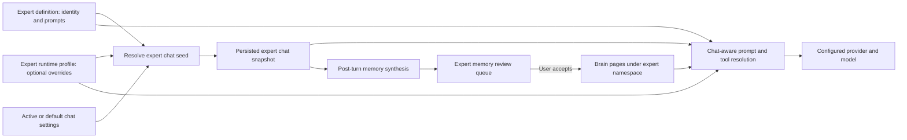

# Experts Mode Overhaul

Status: Proposed  
Scope: One complete overhaul of Experts mode  
Surfaces: MinnowOS desktop Experts picker, Experts' Lab, expert chat, prompt composition, tool policy, and Brain memory

## Agreed product decisions

- Ship the greeting, runtime, memory, and UI improvements as one complete feature.
- New expert chats inherit the active/default chat configuration, with optional per-expert model, mode, and tool overrides.
- Remove the vestigial Auto expert state. Users choose an expert explicitly.
- Open new chats with the expert's authored greeting immediately. Do not spend a model call on a greeting.
- Give each expert an isolated long-term memory namespace in addition to ordinary per-chat history.
- Generate expert memory suggestions after conversations, but require user review before saving.
- Show pending and saved expert memories in Experts' Lab, with accept, edit, reject, delete, and clear controls.

## Current-state findings

1. `startExpertChat()` creates a chat with an empty model id and then calls `generateExpertGreeting()`. The greeting generator exits to its generic fallback when the model id is empty, so the LLM path does not run.
2. Expert frontmatter already parses and persists `greeting`, but the new-chat path never reads it.
3. The detail pane labels `tagline` as `MODEL`, so the visible runtime information is false.
4. Expert chats hardcode `modeId = 'general'`; model, mode, and tools cannot be configured per expert.
5. Expert tool exposure is derived from mode only. No expert policy participates in the send path or token estimate.
6. The prompt stack places the expert after the mode, making the specialist identity subordinate to generic operating instructions.
7. `ExpertSelection.mode = 'auto'` is persisted and used as a default even though send resolution performs no automatic routing.
8. Existing Brain retrieval is workspace-scoped, not expert-scoped. The synthesis proposal queue can be extended instead of creating a second review system.
9. The current summon overlay displays a spinner while waiting for work that normally completes immediately, producing a flash rather than meaningful feedback.
10. No dedicated Experts build specification or Experts prototype currently exists. The previous desktop shell plan only covers mounting and navigation.

## Goals

- Make each expert behave like a durable, configurable specialist rather than a cosmetic prompt fragment.
- Make the first interaction immediate and distinct.
- Keep model, mode, tool, prompt, and memory behavior internally consistent across sending, replay, and token estimates.
- Prevent automatic memory leakage between experts.
- Make effective runtime capabilities visible and understandable before a chat starts.
- Preserve existing expert chats and custom expert files through migration.

## Non-goals

- Do not add automatic expert routing or request classification.
- Do not let expert tool overrides bypass global tool permissions or mode safety rules.
- Do not generate greetings with a sidecar model.
- Do not silently rewrite existing chat history or replace previously stored greetings.
- Do not automatically accept expert memory suggestions.
- Do not delete chats or memory when a custom expert definition is deleted without a separate, explicit confirmation.

## Proposed architecture

### Source-of-truth split

- Expert markdown remains the source of persona identity: label, description, icon, accent, tagline, authored greeting, and full/lite prompts.
- `config.json -> experts.profiles[expertId]` stores user-controlled runtime defaults. This allows built-in experts to be configured without creating prompt overrides.
- An expert chat stores the effective runtime snapshot used when that chat was created. Later profile edits affect new chats, not existing threads.
- Turn snapshots continue to freeze the composed prompt and enabled tool names for replay.
- Brain pages under `pages/experts/<expertId>/facts/` store accepted long-term memories.

### Runtime precedence

For a new expert chat:

1. Read the currently active chat's effective provider/model, mode, and workspace before changing the active session.
2. Fall back to the persisted default model when the source chat has no explicit binding.
3. Apply valid per-expert provider/model and mode overrides.
4. Resolve tools as:

   `globally enabled tools ∩ mode policy ∩ expert allowlist, then subtract expert denylist`

5. Persist the resulting provider, model, mode, and expert tool policy on the new chat.
6. If an override references a missing provider, model, mode, or tool, fall back safely, display a warning in the Lab, and do not create an unusable chat.

## Implementation todos

### Phase 0: Validate the Experts' Lab information architecture

- [ ] Build a development-only, throwaway UI prototype inside the existing Experts route, selected with `?variant=`.
- [ ] Create three structurally different variants:
  - compact roster plus tabbed detail for Overview, Runtime, Memory, and Chats;
  - roster plus one scrollable inspector with progressive sections;
  - chat-first workspace with a collapsible expert inspector.
- [ ] Use realistic experts, runtime bindings, unavailable-model warnings, pending proposals, saved memories, empty states, and offline states.
- [ ] Keep the prototype read-only and hide its switcher in production builds.
- [ ] Review desktop, narrow-window, keyboard, and reduced-motion behavior.
- [ ] Record the chosen structure and why, delete the losing variants, and rewrite the winner as production code.

Recommended default: compact roster plus tabbed detail. It keeps configuration discoverable without turning the Lab into a long settings form.

### Phase 1: Add the runtime profile and session schema

- [ ] Extend `src/chat/experts/types.ts` with a normalized `ExpertRuntimeProfile`:
  - optional `providerId` and `modelId`;
  - optional `modeId`;
  - optional tool allowlist and denylist;
  - expert memory enabled state.
- [ ] Extend `ExpertsConfig` with `profiles: Record<string, ExpertRuntimeProfile>`.
- [ ] Normalize all persisted fields in `src/config/experts-config.ts`; reject invalid mode ids, malformed arrays, empty ids, and oversized values.
- [ ] Add server-side config normalization so browser and server persistence enforce the same shape.
- [ ] Add `ExpertRuntimeSnapshot` to `Chat` with the applied tool policy and profile revision/source metadata needed for display and diagnostics.
- [ ] Bump the session schema and migrate legacy data:
  - use `chat.expertId` as the sole runtime expert identity;
  - copy valid legacy manual selections into `chat.expertId` when needed;
  - discard legacy Auto state without assigning an expert;
  - preserve chat history, workspace, provider/model, and mode;
  - accept old turn snapshots during hydration.
- [ ] Remove `defaultExpertSelection()`, Auto-specific branches, and redundant expert selection persistence after migration coverage exists.
- [ ] Keep unknown expert ids on old chats as recoverable orphaned references instead of deleting those chats.

Primary files:

- `src/chat/experts/types.ts`
- `src/config/experts-config.ts`
- `src/types.ts`
- `src/state/sessions.ts`
- `src/chat/turn-snapshot.ts`
- `src/state/session-workspace-scope.ts`
- `server/config/validators.js`

### Phase 2: Make chat creation deterministic and immediate

- [ ] Add a pure `resolveExpertChatSeed()` helper that merges source-chat settings with the selected expert profile.
- [ ] Capture the source chat before `activateChatById()` changes session state.
- [ ] Change `createExpertChat()` to require a resolved seed instead of accepting only a model string.
- [ ] Seed `providerId`, `modelId`, `modeId`, workspace, `expertId`, and the runtime snapshot in one operation.
- [ ] Replace `generateExpertGreeting()` with a synchronous authored-greeting resolver:
  - use `meta.greeting` first;
  - fall back to a deterministic label/description template;
  - never invoke a model.
- [ ] Append the greeting exactly once before opening the transcript.
- [ ] Replace the fake loading spinner with a 150–250 ms state transition that communicates selection, not background work.
- [ ] Open immediately when reduced motion is enabled.
- [ ] Surface creation errors inline and leave the previous chat active if seeding fails.
- [ ] Correct the detail pane so `MODEL` shows the actual inherited or overridden binding; show tagline as copy, not runtime data.

Primary files:

- `src/chat/experts/greet.ts`
- `src/state/sessions.ts`
- `src/ui/experts/experts-hub.ts`
- `src/ui/experts/experts-scope.ts`
- `src/os/experts-desktop.ts`
- `src/ui/default-model.ts`
- `index.html`
- `src/styles/experts-summon.css`

### Phase 3: Apply real expert capabilities

- [ ] Add a shared chat-aware tool resolver and use it everywhere tools are calculated.
- [ ] Apply expert policy after global enablement and mode filtering so an expert can narrow access but cannot bypass an `off` permission or a mode guard.
- [ ] Keep MCP and plugin tool ids compatible with optional expert allow/deny entries.
- [ ] Update the send path, composed prompt context, token estimate, and replay diagnostics to use the same resolved tool list.
- [ ] Move the expert prompt part directly after the base prompt and before the mode prompt:
  - base safety and global invariants remain authoritative;
  - specialist identity frames the task;
  - mode and tool instructions describe how that specialist may act.
- [ ] Preserve full/lite/custom prompt profile behavior and custom part disabling.
- [ ] Resolve missing or deleted experts explicitly: show an orphaned-expert warning and omit the persona prompt rather than silently substituting another expert.
- [ ] Update custom expert creation so the LLM creates identity and prompt content only. Runtime permissions remain deterministic user settings.

Primary files:

- `src/tools/client.ts`
- `src/tools/loop.ts`
- `src/chat/prompts/compose-context.ts`
- `src/chat/prompts/prompt-composer.ts`
- `src/chat/prompts/token-estimate.ts`
- `src/chat/prompts/prompt-baseline.ts`
- `src/chat/experts/create-expert.ts`

### Phase 4: Add expert-scoped memory with review

- [ ] Extend synthesis run input and `MemoryProposal` with an optional validated `expertId`.
- [ ] Pass `chat.expertId` into post-turn synthesis for expert chats.
- [ ] Force expert-derived memories into pending review even if global synthesis allows direct saves.
- [ ] Add proposal filtering by expert id without hiding non-expert proposals from the Brain app.
- [ ] On acceptance, write to `pages/experts/<expertId>/facts/<slug>.md` with safe path validation and collision handling.
- [ ] Add `scope.expertId` to Brain retrieval and filter pages before keyword/vector ranking.
- [ ] For expert chats, automatically inject only that expert's accepted memory pages. Do not inject another expert's namespace or global memory.
- [ ] Keep explicit Brain tools subject to their existing permissions; label their broader scope clearly in prompt guidance.
- [ ] Add client helpers to list accepted memories, list pending proposals, accept edited proposals, reject proposals, delete one memory, and clear one expert namespace.
- [ ] Add an Experts' Lab Memory view with:
  - pending proposal count;
  - editable title/body before acceptance;
  - rationale and source-chat context;
  - accepted memory list with body preview and update time;
  - delete-one and clear-all confirmations;
  - offline, disabled, loading, empty, and error states.
- [ ] Keep expert deletion non-destructive by default. Offer separate explicit actions to remove its chats or memory.
- [ ] Fence retrieved expert memory as untrusted data through the existing Brain retrieval path.

Primary files:

- `src/synthesis/client.ts`
- `src/memory/client.ts`
- `src/memory/types.ts`
- `src/ui/memory-proposals-panel.ts`
- `src/ui/experts/experts-hub.ts`
- `server/engine/proposals.js`
- `server/brain/proposals.js`
- `server/brain/synthesis.js`
- `server/brain/synthesis-routes.js`
- `server/brain/retrieve.js`
- `server/brain/routes.js`
- `server/brain/store.js`

### Phase 5: Rebuild Experts' Lab around identity, runtime, and continuity

- [ ] Replace the current card-heavy detail pane with the selected prototype structure and flat, divided sections.
- [ ] Keep the roster compact and scannable: identity, role, chat count, pending-memory count, and a concise runtime state.
- [ ] Provide Overview, Runtime, Memory, and Chats areas without nested cards.
- [ ] Allow runtime configuration for built-in and custom experts.
- [ ] Keep persona editing and deletion limited to user-owned experts.
- [ ] Runtime editor controls:
  - inherit or override provider/model;
  - inherit or override mode;
  - inherit tools or select an allowlist/denylist;
  - enable/disable expert memory;
  - show a live effective-runtime summary.
- [ ] Show unavailable overrides and policy conflicts inline before save.
- [ ] Rename `Test in sandbox` to `Start chat`; this is a durable expert thread, not a disposable sandbox.
- [ ] Use authored greeting and description in the overview so users can judge personality before starting.
- [ ] Preserve familiar Minnow controls, `--mn-*` tokens, flat chrome, 44 px touch targets, visible focus, and 65–75 character prose widths.
- [ ] Collapse the roster into a back-navigable list on narrow windows instead of shrinking both panes.
- [ ] Support keyboard roster navigation, semantic tabs, ARIA labels/status, and reduced motion.
- [ ] Keep status changes within 150–250 ms and avoid spinners for synchronous work.

Primary files:

- `index.html`
- `src/ui/experts/experts-hub.ts`
- `src/ui/experts/experts-scope.ts`
- `src/os/experts-desktop.ts`
- `src/styles/experts-hub.css`
- `src/styles/experts-summon.css`
- `src/styles/minnowos-shell.css`

### Phase 6: Verification and migration coverage

- [ ] Add unit tests for authored greeting precedence and deterministic fallback.
- [ ] Add runtime resolution tests for inheritance, overrides, invalid bindings, and source-chat capture.
- [ ] Add tool-policy tests for global permission, mode policy, allowlist, denylist, MCP ids, and token-estimate parity.
- [ ] Add prompt composition tests proving `base -> expert -> mode` order and unchanged non-expert output.
- [ ] Add session migration tests for legacy Auto, legacy manual selection, orphaned experts, existing expert histories, and old turn snapshots.
- [ ] Add Brain scope tests proving no cross-expert automatic retrieval.
- [ ] Add proposal tests proving expert proposals always require review and acceptance writes into the correct namespace.
- [ ] Add UI tests for real model labels, runtime save validation, memory review, delete/clear confirmation, and offline states.
- [ ] Extend MinnowOS tests for hero selection, immediate chat open, deterministic transition, and return navigation.
- [ ] Run `npm run test:check-coverage`.
- [ ] Run `npx tsc --noEmit`.
- [ ] Run focused Experts, prompt, session, tools, Brain, and OS suites.
- [ ] Run the full `npm test` suite.
- [ ] Run `npm run build`.
- [ ] Verify manually in Electron with:
  - a model inherited from the active chat;
  - a valid and invalid expert model override;
  - a mode/tool override;
  - two experts with conflicting memories;
  - pending memory acceptance and rejection;
  - light/dark themes;
  - narrow and ultrawide windows;
  - keyboard-only and reduced-motion operation.

Likely test files:

- `test/chat/experts/greet.test.mts`
- `test/chat/experts/runtime-profile.test.mts`
- `test/chat/experts/session-migration.test.mts`
- `test/experts/composer.test.mjs`
- `test/tools/expert-tool-policy.test.mts`
- `test/brain/expert-memory-scope.test.mjs`
- `test/brain/expert-memory-proposals.test.mjs`
- `test/ui/expert-lab-custom-expert.test.mjs`
- `test/ui/experts-scope-os.test.mjs`
- `test/os/desktop-experts-state.test.mts`

### Phase 7: Documentation and cleanup

- [ ] Update `documentation/context.md` with the final runtime precedence, session schema, memory namespace, UI behavior, and test coverage.
- [ ] Document the persisted `experts.profiles` shape and migration behavior.
- [ ] Record the winning prototype decision.
- [ ] Remove prototype variants, the variant switcher, obsolete Auto code, dead greeting generation code, and stale comments.
- [ ] Search for outdated `sandbox`, Auto-routing, generic greeting, and tagline-as-model references.

## Acceptance criteria

- Starting any expert chat displays that expert's authored greeting without a model call or visible fake loading state.
- The Lab displays the effective provider/model, mode, tool policy, and memory state accurately.
- A new expert chat inherits the active/default binding unless a valid expert override exists.
- Existing expert chats retain their snapshotted runtime after profile changes.
- No Auto expert option or no-op Auto state remains in UI or newly persisted sessions.
- Expert tool overrides are applied consistently to the send payload, composed prompt metadata, token estimate, and replay snapshot.
- The expert prompt is composed after base invariants and before mode instructions.
- Expert memory suggestions never save without user acceptance.
- Accepted memories are stored and retrieved only for the matching expert during automatic injection.
- Users can review, edit, reject, delete, and clear expert memory from the Lab.
- Existing chats and custom expert definitions survive migration.
- The feature works in MinnowOS and legacy non-OS routing, with responsive, keyboard, and reduced-motion behavior.
- Type checking, coverage checks, the full test suite, and production build pass.

## Risks and safeguards

- **Model override becomes unavailable:** validate at creation, fall back to inherited binding, and show the stale override in the Lab.
- **Tool-policy divergence:** centralize resolution and consume one helper from send, prompt, estimate, and tests.
- **Memory leakage:** namespace accepted pages and filter before ranking; test two experts with identical queries and conflicting facts.
- **Proposal queue compatibility:** make `expertId` optional so existing proposal JSON and Brain review UI remain valid.
- **Session migration loss:** bump the schema, keep old readers tolerant, and never mutate history content.
- **Built-in expert customization:** store runtime profiles in config rather than prompt overrides so ownership and delete rules remain intact.
- **UI density:** prototype the information hierarchy first; use progressive sections and flat dividers rather than nested cards.
- **Unexpected destructive cleanup:** preserve chats and memory by default when deleting a persona, with separate confirmations for each data class.
