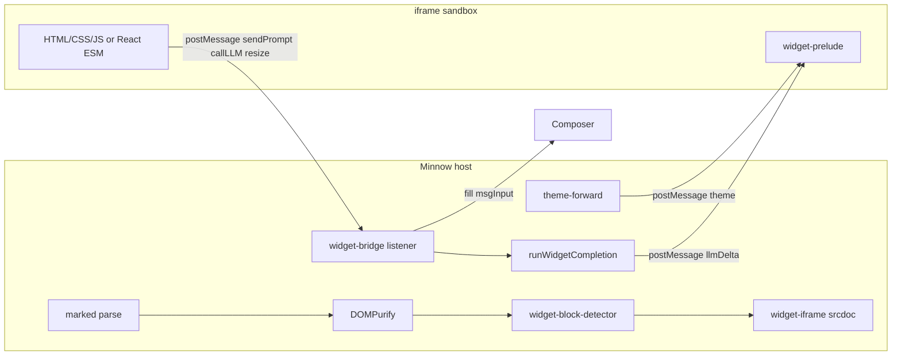
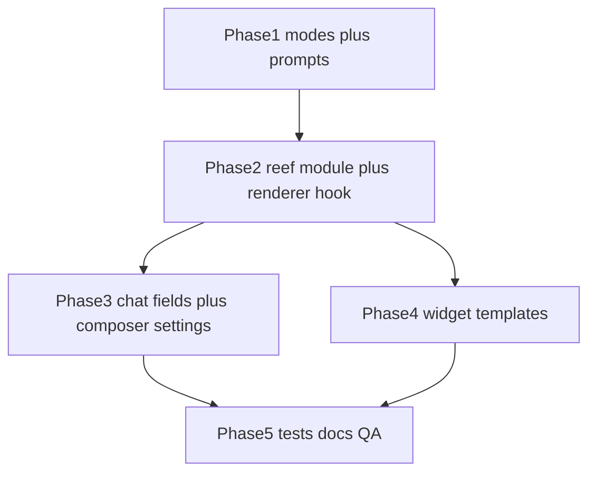

# Reef mode — interactive inline widgets

**Source spec:** [lets-plan-out-a-hashed-eagle.md](file:///c:/Users/dukky/.claude/plans/lets-plan-out-a-hashed-eagle.md)  
**Deliverable doc (after approval):** [`documentation/plans/feature-reef-mode-widgets.md`](documentation/plans/feature-reef-mode-widgets.md)  
**Post-ship:** update [`documentation/context.md`](documentation/context.md) and add [`documentation/plans/verification/feature-reef.md`](documentation/plans/verification/feature-reef.md).

---

## Problem and outcome

Today assistant markdown is sanitized with DOMPurify; `<script>` is stripped, so interactive UI from the model cannot run. Reef mode scopes a dedicated system prompt, a single fence language (`reef-widget`), and a host-side iframe pipeline with theme sync and a small bridge — without changing Build/Plan/Orchestrate/Research rendering behavior when those modes are active.



---

## Locked decisions (from spec)

| Topic | Choice |
|-------|--------|
| Fence tag | `reef-widget` only (forbid `widget`, `artifact`, raw HTML fences for live UI) |
| React | importmap on esm.sh: `react`, `react-dom/client`, `recharts`, `lodash`, `mathjs` (pin majors in prompt + srcdoc) |
| `sendPrompt` | Populate `#msgInput` + focus; user presses send |
| `callLLM` | Always available in sandbox; provider/model from per-chat Reef overrides, else chat defaults |
| Templates | `src/chat/reef/widgets/*.md`; model uses `read_file` (same as impeccable references) |
| Mount gate | Only when **active chat** `modeId === 'reef'` (other modes leave fences as highlighted code) |

---

## Phase 1 — Mode registration and prompts

### 1.1 Extend mode types and registry

- [`src/chat/modes/types.ts`](src/chat/modes/types.ts): add `'reef'` to `ModeId` and `MODE_IDS`.
- [`src/chat/modes/registry.ts`](src/chat/modes/registry.ts): new entry:
  - `id: 'reef'`, `label: 'Reef'`, `description: 'Build interactive widgets inline in chat.'`
  - `promptId: 'reef'`, `toolPolicy: { default: 'allow' }` (no deny list at v1).
- [`src/ui/mode-selector.ts`](src/ui/mode-selector.ts): no code change required — `initModeSelector()` iterates `listModes()`; fifth segment appears automatically.
- [`src/styles/mode-selector.css`](src/styles/mode-selector.css): smoke-test narrow viewports (already `flex-wrap`); tweak padding only if five labels overflow.

### 1.2 Author Reef prompts

Create [`src/chat/prompts/modes/reef.full.md`](src/chat/prompts/modes/reef.full.md) and [`reef.lite.md`](src/chat/prompts/modes/reef.lite.md) mirroring [`research.full.md`](src/chat/prompts/modes/research.full.md):

- YAML front matter: `id: reef`, `kind: mode`, `toolPolicy.default: allow`.
- `<!-- MINNOW_MODE_MARKER: reef full|lite -->`.
- Sections to include:
  - **Output contract:** prose + one or more ` ```reef-widget ` fences; fragment only (no `<!DOCTYPE>`, `<html>`, `<head>`, `<body>`).
  - **Two body styles:** vanilla HTML+`<script>` vs `<div id="root">` + `<script type="module">` with React imports.
  - **Streaming order:** `<style>` → markup → `<script>` last.
  - **Constraints:** no `localStorage`; no `position: fixed`; no gradients/shadows/blur; CDNs limited to cdnjs, esm.sh, cdn.jsdelivr.net, unpkg; use CSS variables from [`src/styles/tokens.css`](src/styles/tokens.css) (`--bg`, `--surface`, `--surface-elevated`, `--text`, `--text-muted`, `--border`, `--border-strong`, `--accent`, `--accent-dim`, `--radius-sm/md/lg`, `--font-ui`, `--font-mono`) — no hardcoded hex.
  - **Typography/layout rules:** sentence case, font weights 400/500 only, 0.5px borders, max-width 680px container.
  - **Bridge API** with examples: `sendPrompt(text)`, `callLLM({ messages, model? })`, `openLink(url)` via `window.minnow`.
  - **impeccable:** self-critique before emit; user polish → follow [`src/skills/impeccable/SKILL.md`](src/skills/impeccable/SKILL.md).
  - **Templates:** point at `src/chat/reef/widgets/*.md`.
  - **Pinned esm.sh URLs** for importmap entries (document exact URLs in prompt; duplicate in `widget-iframe.ts`).

Built-in prompts auto-register via [`src/chat/prompts/builtin-globs.ts`](src/chat/prompts/builtin-globs.ts) glob — no loader change.

### 1.3 Tests (Phase 1)

- Extend [`test/modes/test-helpers.mts`](test/modes/test-helpers.mts) mode list with `reef`.
- [`test/modes/load-mode-prompt.test.mts`](test/modes/load-mode-prompt.test.mts): `reef` full/lite non-empty + marker.
- [`test/modes/compose-mode.test.mts`](test/modes/compose-mode.test.mts): composed system prompt includes reef marker when `modeId: 'reef'`.

---

## Phase 2 — Reef host module (`src/chat/reef/`)

New package with a single public entry [`src/chat/reef/index.ts`](src/chat/reef/index.ts):

```ts
export function mountReefWidgets(bubble: HTMLElement): void
export function unmountReefWidgetsInChat(): void  // for mode switch
export function initReefBridge(): void            // once at app startup
```

### 2.1 `widget-block-detector.ts`

- Query `bubble.querySelectorAll('pre[data-lang="reef-widget"] code')`.
- Skip if `pre.dataset.reefMounted === 'true'`.
- **Gate:** if `getActiveChat().modeId !== 'reef'`, return early (no DOM mutation).
- Require **closed fence:** parent `<pre>` must represent a complete block (during stream, partial fences stay as code until closing fence re-render).
- Extract raw text from `<code>` (decode HTML entities if needed).
- Replace `<pre>` with a host wrapper `div.reef-widget-host` and delegate to `widget-iframe.ts`.

### 2.2 `widget-iframe.ts`

- Build `srcdoc` document:
  - CSP `<meta http-equiv="Content-Security-Policy">` allowing scripts/styles from the four CDNs + `'unsafe-inline'` for inline widget code.
  - Inline `<script type="importmap">` with pinned esm.sh specifiers.
  - Inject [`widget-prelude.ts`](src/chat/reef/widget-prelude.ts) as inline script string (or separate bundled string constant).
  - Inject theme `:root { … }` from [`theme-forward.ts`](src/chat/reef/theme-forward.ts).
  - Append widget body HTML from fence.
- Create `<iframe sandbox="allow-scripts" referrerpolicy="no-referrer" title="Reef widget">` — **no** `allow-same-origin`, `allow-popups`, `allow-top-navigation`, `allow-forms`.
- Set height from bridge `resize` messages; default min-height until first resize.
- Store `iframe.contentWindow` reference for targeted `postMessage` (use a per-mount `widgetId`).

### 2.3 `theme-forward.ts`

- `readThemeVarsFromHost(): Record<string, string>` — read computed styles from `document.documentElement` for the token list above.
- `buildThemeCssBlock(vars): string` — emit `:root { --bg: …; }`.
- `subscribeThemeChanges(callback)` — `MutationObserver` on `html[data-theme]` ([`src/ui/theme.ts`](src/ui/theme.ts)); on change, post `{ type: 'reef', action: 'theme', vars }` to all live iframe windows.

### 2.4 `widget-prelude.ts` (injected into iframe)

- Define `window.minnow.sendPrompt`, `callLLM`, `openLink`.
- `callLLM`: generate `requestId`, `postMessage` to parent, return a Promise that resolves when parent sends `llmDone` / rejects on error.
- `ResizeObserver` on `document.body` → post `resize` with `contentRect` height (+ padding fudge).
- Listen for parent `theme` messages and apply CSS variables on `:root`.

### 2.5 `widget-bridge.ts` (host singleton)

Initialize once from [`src/main.ts`](src/main.ts) via `initReefBridge()`.

| Message | Host behavior |
|---------|----------------|
| `sendPrompt` | Set `#msgInput` value (pattern from [`message-actions.ts`](src/ui/message-actions.ts) edit flow), `dispatchEvent('input')`, `focus()` — **do not** call `sendMessage()` |
| `callLLM` | `runWidgetCompletion({ messages, requestId, widgetId })` |
| `resize` | Set host wrapper / iframe height |
| `openLink` | `window.confirm` then `window.open(url, '_blank', 'noopener,noreferrer')` (no dedicated link handler exists today) |

Validate `event.origin` is `'null'` (sandboxed srcdoc) or same-origin if ever changed; validate `event.data?.type === 'reef'`.

### 2.6 `runWidgetCompletion` (in `widget-bridge.ts` or `run-widget-completion.ts`)

Reuse streaming pattern from [`sub-agent-runner.ts`](src/agents/sub-agent-runner.ts):

```ts
const chat = getActiveChat();
const providerId = chat.reefWidgetProviderId ?? chat.providerId ?? activeProvider;
const modelId = chat.reefWidgetModelId ?? chat.modelId;
```

- `postChatCompletions` from [`src/providers/fetch-chat.ts`](src/providers/fetch-chat.ts).
- Stream deltas → `postMessage` `{ action: 'llmDelta', requestId, delta }`; finish with `llmDone`.
- Abort in-flight widget requests on chat switch / new user message (track `AbortController` per `requestId`).
- No tools in widget completions at v1 (`tools` omitted).

### 2.7 Renderer integration

At end of [`setAssistantBubbleContent`](src/markdown/renderer.ts) (after hljs):

```ts
import { mountReefWidgets } from '../chat/reef';
// ...
mountReefWidgets(bubble);
```

Also call `unmountReefWidgetsInChat()` from [`selectMode`](src/ui/mode-selector.ts) when leaving Reef (remove `.reef-widget-host`, restore is unnecessary if `renderChatFromHistory` rebuilds bubbles — prefer full re-render on mode change: `renderChatFromHistory(getActiveChat())` after mode switch).

### 2.8 Styles

New [`src/styles/reef-widgets.css`](src/styles/reef-widgets.css):

- `.reef-widget-host` width 100%, no nested scroll, border using `--border`, radius `--radius-md`.
- Import in [`src/main.ts`](src/main.ts).

### 2.9 Tests (Phase 2)

| File | Focus |
|------|--------|
| `test/chat/reef/widget-block-detector.test.mts` | detects `data-lang`, respects mode gate, idempotent `data-reef-mounted` |
| `test/chat/reef/theme-forward.test.mts` | maps known tokens from fixture element |
| `test/chat/reef/widget-iframe.test.mts` | srcdoc contains CSP, importmap, no `allow-same-origin` |
| `test/chat/reef/widget-bridge.test.mts` | mock postMessage → composer text; `callLLM` resolves provider/model from chat shape |

Use jsdom or minimal DOM fixtures consistent with [`test/ui/question-cards-state.test.mts`](test/ui/question-cards-state.test.mts).

---

## Phase 3 — Per-chat Reef LLM settings

### 3.1 Persistence

- [`src/types.ts`](src/types.ts): add optional `reefWidgetProviderId?: string`, `reefWidgetModelId?: string` on `Chat`.
- [`src/state/sessions.ts`](src/state/sessions.ts) `ensureChatShape`: pass through both fields (also consider passing through existing `providerId` if missing — pre-existing gap).

### 3.2 UI (per active chat)

**Recommended:** composer-adjacent block (not global Settings drawer) — mirrors dev work-agent pattern.

- [`index.html`](index.html): inside `#composerControls`, add `#reefWidgetSettings` (hidden by default).
- New [`src/ui/reef-widget-settings.ts`](src/ui/reef-widget-settings.ts):
  - Show when `getActiveChat().modeId === 'reef'`.
  - Reuse `fillModelSelect` / provider list pattern from [`src/ui/settings-entity-editor.ts`](src/ui/settings-entity-editor.ts) (`fillModelSelect`, `listProviders`).
  - Empty model = “(use chat default)” — matches spec fallback to `chat.modelId` / `chat.providerId`.
  - On change: `touchChat`, `scheduleSaveSessions`.
- Wire `syncReefWidgetSettingsFromActiveChat()` from mode selector + sidebar chat switch + `main.ts` init.

Original spec cited [`src/ui/settings.ts`](src/ui/settings.ts); the codebase’s per-chat controls live near the composer — avoid stuffing this into the global settings drawer unless product prefers it.

### 3.3 Tests

- [`test/modes/chat-mode-persist.test.mts`](test/modes/chat-mode-persist.test.mts): round-trip `reefWidgetModelId` / `reefWidgetProviderId` through `ensureChatShape`.

---

## Phase 4 — Pre-built widget library

Directory: [`src/chat/reef/widgets/`](src/chat/reef/widgets/)

| File | Purpose |
|------|---------|
| `calculator.md` | Basic + multi-field calculator |
| `slider-graph.md` | Range input + chart (**use `recharts` in React variant or vanilla canvas** — importmap does not include chart.js) |
| `tabs.md` | Tabbed UI, demonstrates streaming order |
| `form.md` | Validated inputs |
| `data-table.md` | Sort/filter table |
| `comparison.md` | Two-column metrics |

Each file: short description + one ready-to-copy ` ```reef-widget ` fence. No runtime loader — prompt + `read_file` only.

---

## Phase 5 — Documentation and verification

### 5.1 Docs

- Copy this plan to [`documentation/plans/feature-reef-mode-widgets.md`](documentation/plans/feature-reef-mode-widgets.md) when implementation starts.
- After ship: [`documentation/context.md`](documentation/context.md) — add Reef to modes table, `src/chat/reef/` layout, bridge API summary.
- [`documentation/plans/verification/feature-reef.md`](documentation/plans/verification/feature-reef.md) — checklist from spec § Verification (items 1–12 + 10a).

### 5.2 Manual QA checklist (from spec)

1. Fifth mode segment; status “Mode: Reef”.
2. `what mode are you in?` → Reef/widget guidance.
3. Tip calculator iframe: interactive, theme tracks light/dark.
4. `sendPrompt` fills composer, does not auto-send.
5. `callLLM` streams into widget.
6. Override model in Reef settings → widget uses override (network tab / logs).
7. Clear override → falls back to chat model.
8. DevTools in iframe: `localStorage` throws; disallowed fetch blocked by CSP.
9. Streaming: open fence = code; closed = iframe; no duplicate mounts on debounce.
10. Model reads `slider-graph.md` template.
10a. Recharts + React importmap renders.
11. Polish request references impeccable workflow.
12. Other modes: `reef-widget` fences stay code blocks only.

### 5.3 Automated gate

`npm run build` && `npm test` — extend mode tests; zero regressions on existing 443-test baseline.

---

## Out of scope (v1)

- `preview_widget(html)` tool (v1.1).
- Persisting widget state across reload.
- Server-side widget sandbox.
- Embedding widgets outside assistant bubbles.
- New work-agent `defaultForModes: [reef]` (optional later; v1 uses main chat work agent).

---

## Implementation order (recommended)



Ship Phase 1+2 as a vertical slice (mode + one calculator widget) before all six templates and settings polish.

---

## Risk notes

- **Sandbox `postMessage` origin:** srcdoc iframes use opaque origin; validate message shape strictly to avoid confused-deputy issues.
- **Multiple widgets per message:** one bridge listener, route by `widgetId`; cap concurrent `callLLM` (e.g. 2) to avoid provider stampede.
- **History vs mode:** widgets only mount in Reef mode; switching mode re-renders chat — document that old Reef messages show code blocks in Build mode until user switches back to Reef.
- **ensureChatShape `providerId`:** not currently copied on normalize; fixing while touching chat shape reduces surprise for `callLLM` fallback.
