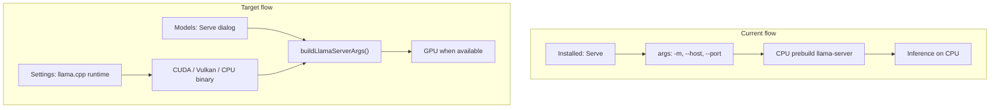

# llama.cpp runtime control and Settings visibility

## Problem

Today llama.cpp models run on CPU for two independent reasons:

1. **CPU-only auto-install** — [`server/models/llama-runtime.js`](server/models/llama-runtime.js) always downloads `*-bin-win-cpu-x64.zip` (and similar CPU assets on other platforms). Even with `-ngl 999`, a CPU binary cannot use the GPU.

2. **Missing launch args from Installed** — [`src/ui/models/installed-panel.ts`](src/ui/models/installed-panel.ts) calls `startModelServe()` without `hardware`, so [`server/models/serve.js`](server/models/serve.js) spawns with only `-m`, `--host`, `--port` (no `-c`, `-ngl`, KV cache). What fits **does** pass hardware ([`recommend-panel.ts`](src/ui/models/recommend-panel.ts) line 373).

3. **Duplicate providers per serve** — each llama.cpp serve generates a new provider id `models-<uuid-prefix>` with label `Models · <filename>`. Serving multiple models (or re-serving after stop) accumulates provider rows in Settings → Providers even though only one `llama-server` instance runs at a time and model selection already comes from `/v1/models`.



## Scope (per your choices)

- **Settings → Servers:** runtime install (variant, version, reinstall) + list **active model serves** (stop, logs, port) — not full model picking.
- **Models app:** full launch control via a **Serve dialog** before spawn.
- **GPU default:** auto-detect — CUDA if `nvidia-smi` works, else Vulkan if a Vulkan build is installable/detected, else CPU.

Reference UI/logic to port (subset): Odysseus [`documentation/reference/odysseus-dev/.../static/js/cookbookServe.js`](documentation/reference/odysseus-dev/odysseus-dev/static/js/cookbookServe.js) llama.cpp rows (ctx, ngl, KV cache, batch/ubatch, split mode, tensor split, parallel, env flags).

---

## Phase 0 — Single stable llama.cpp provider (fix duplicate providers)

**Observed behavior (user report):** Serving the same GGUF twice produced two disabled rows in Settings → Providers:

- `Models · Qwen3.6-27B-Q4_K_M.gguf` — `models-36de1722`
- `Models · Qwen3.6-27B-Q4_K_M.gguf` — `models-753582d3`

Both point at `http://127.0.0.1:8085` with `openai-v1` paths. The user must click **Remove** on each orphan manually today.

**After fix (Providers UI):**

- **One row:** `llama.cpp (local)` — id `llama-cpp-local`
- **Enabled** while a serve is running; **Disabled** when stopped
- **No** `models-xxxxxxxx` rows after migration on next `npm start`
- Model name appears only in the top-bar model picker (from `/v1/models`), not in the provider label

**Root cause:** [`server/models/serve.js`](server/models/serve.js) assigns a unique provider per serve:

```210:210:server/models/serve.js
  const providerId = `models-${serveId.slice(0, 8)}`;
```

`registerServeProvider()` only skips creation when that exact id exists; every new serve gets a new id and label `Models · ${modelLabel}`. `stopServe()` sets `enabled: false` but **never deletes** the row, so disabled duplicates pile up in the Providers list.

**Fix — one provider for all llama.cpp serves:**

| Change | Detail |
|--------|--------|
| Stable id | `llama-cpp-local` (constant, like `lm-studio-local`) |
| Stable label | `llama.cpp (local)` — not the model filename |
| Upsert on serve | If provider exists → `updateProvider(id, { baseUrl, enabled: true })`; else `createProvider(...)` |
| Stop behavior | When last active llama-cpp serve stops → `updateProvider('llama-cpp-local', { enabled: false })` (do not create a new row on next serve) |
| Re-serve same/different model | Stop prior llama-cpp serve process if running, update same provider's `baseUrl` to new port |
| One active serve | Enforce at most one running `runtime === 'llama-cpp'` serve at a time (stop existing before starting new) |

**Migration / cleanup** (run once on `npm start` or first llama serve after upgrade):

- Find providers where `id` matches `^models-[a-f0-9]{8}$` **or** `label` matches `^Models · ` with `apiKind: openai-v1` and loopback baseUrl.
- `deleteProvider()` orphans (or disable if user edited them).
- Seed `llama-cpp-local` if missing (disabled, placeholder baseUrl `http://127.0.0.1:8085`).

**Files:** [`server/models/serve.js`](server/models/serve.js), [`server/providers/store.js`](server/providers/store.js) (optional `seedLlamaCppLocal()` mirroring `seedLmStudioLocal()`), [`server/models/routes.js`](server/models/routes.js) if migration hook needed.

**Tests:** new cases in [`test/models/models-api.test.mjs`](test/models/models-api.test.mjs):

1. Serve model A → exactly one `llama-cpp-local` provider, enabled.
2. Serve model B → still one provider, `baseUrl` updated, no `models-*` rows.
3. Stop serve → provider disabled, not duplicated.
4. Migration removes legacy `models-xxxxxxxx` providers.

**Client:** no change required — [`selectProviderModel()`](src/api/models.ts) already picks the model from `/v1/models` using `providerId` + `modelLabel` hint.

---

## Phase 1 — GPU-aware runtime installer

**Files:** [`server/models/llama-runtime.js`](server/models/llama-runtime.js), new [`server/models/llama-variant.js`](server/models/llama-variant.js)

- Introduce `LlamaVariant` enum: `cpu`, `cuda-12.4`, `cuda-13.x` (pick latest 13.x asset from release manifest), `vulkan`, `metal` (macOS arm64 default over cpu), `rocm` (linux only, optional v2).
- Replace `pickLlamaReleaseAssetName()` with `resolveLlamaAssets({ variant, tag })` returning `{ mainZip, companionZip? }` — Windows CUDA needs **two** zips (`llama-b*-bin-win-cuda-12.4-x64.zip` + `cudart-llama-bin-win-cuda-12.4-x64.zip`).
- Add `detectPreferredLlamaVariant()` using existing [`server/system/hardware.js`](server/system/hardware.js) (`gpu_backend: 'cuda'` from nvidia-smi) + fallback probes.
- Persist in `~/.minnow/models-runtime/llama-cpp/meta.json`: `{ version, variant, assetNames, path, installedAt }`.
- `ensureLlamaServer({ variant? })` — honor user override from config; on first install use `detectPreferredLlamaVariant()`.
- Expose new API on models routes:
  - `GET /api/models/llama-runtime` — path, variant, version, installable variants for this host
  - `POST /api/models/llama-runtime/install` — `{ variant?, tag? }` reinstall
- Update [`server/models/runtime-detect.js`](server/models/runtime-detect.js) to return `variant`, `gpuCapable` (variant !== cpu).

**Tests:** extend [`test/models/llama-runtime.test.mjs`](test/models/llama-runtime.test.mjs) for asset name resolution per variant + auto-detect logic (mock hardware).

---

## Phase 2 — Centralized llama-server arg builder

**Files:** new [`server/models/llama-args.js`](server/models/llama-args.js), update [`server/models/profiles.js`](server/models/profiles.js), [`server/models/serve.js`](server/models/serve.js)

Define `LlamaServeSettings` (server + shared TS type in [`src/models/api-client.ts`](src/models/api-client.ts)):

| Field | CLI mapping |
|-------|-------------|
| `ctx` | `-c` |
| `n_gpu_layers` | `-ngl` (0 = CPU-only, 999 = all layers) |
| `cache_type` | `--cache-type-k/v` |
| `n_cpu_moe` | `--n-cpu-moe` |
| `batch_size` | `-b` |
| `ubatch_size` | `-ub` |
| `parallel` | `--parallel` |
| `split_mode` | `--split-mode` |
| `tensor_split` | `--tensor-split` |
| `main_gpu` | `--main-gpu` |
| `fit` | `--fit` |
| `no_warmup` | `--no-warmup` |
| `extra_args` | passthrough string array (power users) |
| `env` | merged into spawn env (e.g. `GGML_CUDA_ENABLE_UNIFIED_MEMORY`) |

`buildLlamaServerArgs({ modelPath, port, profile?, hardware?, settings?, defaults? })`:

1. Start from hardware profile when `hardware` present (`computeServeProfiles` + `profileToLlamaArgs`).
2. Merge explicit `settings` overrides (dialog values win).
3. Merge saved defaults from `~/.minnow/llama-cpp.json` (new small config file).
4. Smart `n_gpu_layers`: if variant is `cpu`, force `0`; if GPU variant and unset, default `999`.

Update `startServe()` in [`serve.js`](server/models/serve.js):

- Accept `body.llama` settings object.
- **Always** fetch hardware (server-side `probeHardware()` if client omits it) so Installed serves get sane defaults even without the dialog.
- Store resolved settings on `ServeRecord` in [`serves.json`](server/models/paths.js) for display in Settings.
- Apply `buildLlamaServerEnv()` + any `settings.env`.

Extend `GET /api/models/profiles` response to include full `llama_args` preview per preset (helps dialog).

---

## Phase 3 — Serve dialog (Models app)

**Files:** new [`src/ui/models/serve-dialog.ts`](src/ui/models/serve-dialog.ts), update [`installed-panel.ts`](src/ui/models/installed-panel.ts), [`recommend-panel.ts`](src/ui/models/recommend-panel.ts), [`src/styles/models-page.css`](src/styles/models-page.css)

Modal/drawer opened by **Serve (llama.cpp)** / **Serve** buttons:

- **Preset row:** Quality / Balanced / Speed (loads from `/api/models/profiles`).
- **Core:** context, GPU layers (with “Auto / All / CPU only” helper), KV cache type.
- **Advanced** `<details>`: batch, ubatch, parallel, split mode, tensor split, main GPU, unified memory checkbox, skip warmup, extra args.
- **Runtime badge:** shows installed variant (e.g. “CUDA 12.4”) with link to Settings → Servers.
- **Serve** posts full payload; **Cancel** closes without spawn.

Installed panel: replace direct `startModelServe({ profile: 'balanced' })` with `openServeDialog({ modelPath, modelLabel, hardware? })`.

Recommend panel: same dialog (pre-fill hardware from panel state).

Persist last-used settings per model filename in `sessionStorage` for convenience.

---

## Phase 4 — Settings → Servers: llama.cpp entry

**Files:** [`server/servers/catalog.js`](server/servers/catalog.js), new [`server/servers/llama-cpp.js`](server/servers/llama-cpp.js), [`server/servers/manager.js`](server/servers/manager.js) (light hooks), [`src/config/servers-config.ts`](src/config/servers-config.ts), [`src/ui/settings-servers-section.ts`](src/ui/settings-servers-section.ts), [`src/servers/client.ts`](src/servers/client.ts)

Add `llama-cpp` to `BUILTIN_SERVERS`:

- **Label:** llama.cpp
- **Description:** Local GGUF inference runtime (`llama-server`).
- **Kind:** `native-binary` (new kind — no Python venv).
- **No autoStart** — process only exists when a model is served.
- **Provisioner** delegates to `llama-runtime.js` for install/status.

Extend managed-server summary for `llama-cpp`:

| UI section | Content |
|------------|---------|
| Runtime | variant, binary path, release tag, Install / Reinstall, variant dropdown |
| Active serves | poll `GET /api/models/serve` — model name, port, pid, Stop, View logs (`~/.minnow/logs/models/<runId>.log`) |
| Defaults | optional “default launch settings” editor (writes `llama-cpp.json`) |

Reuse existing row layout from [`settings-servers-section.ts`](src/ui/settings-servers-section.ts) (`settings-mcp-row`); add `createLlamaCppServerRow()` for variant + serves sub-panel. Hide port/autoStart toggles that do not apply.

`servers.json` entry for `llama-cpp`: `{ enabled: true }` only (port is per-serve). Update [`server/config/validators.js`](server/config/validators.js) defaults.

**Tests:** [`test/ui/settings-servers-section.test.mts`](test/ui/settings-servers-section.test.mts), server catalog tests.

---

## Phase 5 — Docs and validation

- Update [`documentation/context.md`](documentation/context.md) Models app + Managed servers sections.
- Save plan copy: [`documentation/plans/llama-cpp-runtime-control.md`](documentation/plans/llama-cpp-runtime-control.md).
- Manual test matrix (your Windows + NVIDIA setup):
  1. Settings → Servers → Install llama.cpp → confirm CUDA variant detected.
  2. Models → Installed → Serve dialog → `-ngl` > 0 → task manager shows GPU use.
  3. Active serve visible in Settings with working Stop + logs.
  4. Reinstall as Vulkan fallback if CUDA driver mismatch.

---

## Key code touchpoints

Current minimal spawn (Installed path today):

```228:230:server/models/serve.js
  let args = ['-m', modelPath, '--host', '127.0.0.1', '--port', String(port)];
```

CPU-only asset picker to replace:

```122:127:server/models/llama-runtime.js
export function pickLlamaReleaseAssetName(tag = LLAMA_CPP_RELEASE_TAG) {
  // ...
  : `llama-${tag}-bin-win-cpu-x64.zip`;
```

---

## Out of scope (follow-ups)

- Source build / “Rebuild llama.cpp” from git (Odysseus feature).
- Model hot-swap without restart (`supportsModelLoadUnload`).
- Linux ROCm / SYCL auto-install (manual PATH binary still works).
- Ollama / LM Studio duplicate-provider cleanup (same `models-*` pattern exists for those runtimes; out of scope unless requested).
