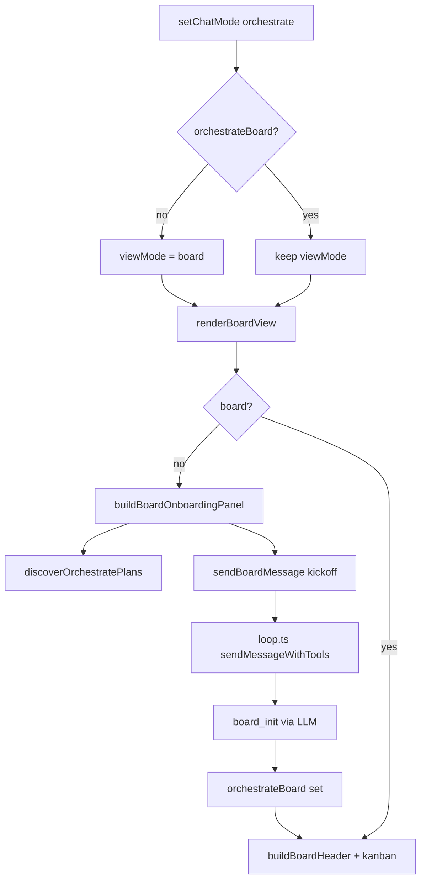

# MIN-5 — Orchestrate board onboarding (Impeccable plan)

**Linear:** [MIN-5 — Update board view when board is not initialized](https://linear.app/minnowai/issue/MIN-5/update-board-view-when-board-is-not-initialized)  
**Related:** MIN-6 (board header controls once board exists)  
**Branch:** `henri/min-5-update-board-view-when-board-is-not-initialized`

```text
IMPECCABLE_PREFLIGHT: context=pass product=pass command_reference=pass(onboard) shape=pending_user_confirm image_gate=skipped:no_new_visual_brand_surface mutation=closed(plan_only)
```

This plan applies **Impeccable `onboard`** to MIN-5: first-run activation for Orchestrate **Board view**, not a global product tour. General chat empty state (`EMPTY_STATE_HTML` in `src/constants.ts`) stays unchanged.

---

## 1. Onboarding assessment (Impeccable)

### Users and context

| Dimension | Answer |
|-----------|--------|
| Who | Developers running LM Studio locally; already comfortable with mode segments and plans |
| Experience | Mixed: some know `board_init`; most expect a visible “Start” affordance |
| Motivation | Switch to Orchestrate to run a plan on a Kanban board, not read tool names in chat |
| Alternatives | Composer plan strip + chat bubbles; today that hides the board workflow |

### Problem (current)

When `chat.orchestrateBoard` is missing, `renderBoardView()` shows only:

```720:728:src/ui/orchestrate-board.ts
  if (!board) {
    const empty = document.createElement('div');
    empty.className = 'board-empty';
    empty.innerHTML =
      '<p>Run the orchestrator to initialize the board (<code>board_init</code>).</p>' +
      '<button type="button" class="board-empty__chat">Switch to Chat</button>';
```

Plan selection lives only in `#orchestratePlanStrip` / `#orchestratePlanSelect` in the composer. Entering Orchestrate does not set `viewMode` to `board`, so users land in chat bubbles.

### Aha moment (success)

User selects **Orchestrate** → sees **Board** with a clear panel → picks a plan → taps **Start** → orchestrator runs → Kanban appears with tasks from `board_init`.

**Not** the goal: teach every `board_*` field name or force a multi-step modal tour.

### Success metrics

| Metric | Target |
|--------|--------|
| Time to first board render | One plan selection + one Start click (no manual `board_init` copy-paste) |
| Mode entry | Orchestrate + no board → Board view by default |
| Skip path | “Chat view” / composer still available; no blocking modal |
| Repeat visit | Panel only while `!orchestrateBoard`; never re-show after init |

### Principles applied (product register, restrained)

- **Show, don’t tell:** Real plan `<select>` and Start wired to `sendMessage()`, same path as header Resume.
- **Optional:** Secondary “Open plan in editor” and “Chat view”; no full-screen blocker.
- **Context over ceremony:** Onboarding lives in `#chatArea` board shell, not a separate tutorial route.
- **Respect intelligence:** Short copy; no `board_init` jargon in primary CTA.
- **Bench instrument:** Flat bordered panel, ink primary button, mono hints only for errors — no cards grid, stripes, or hero metrics ([DESIGN.md](../DESIGN.md)).

---

## 2. UX shape brief (confirm before implementation)

> **Gate:** Treat this section as the Impeccable **shape** brief. Confirm or edit copy/layout before coding.

### Scene sentence

Developer at a desk, LM Studio running, switches to Orchestrate to **see task lanes immediately** in normal room lighting; they should not hunt the composer for “what do I do first?”

### Theme and color

- **Light** sheet (default product scene); dark mode inherits same structure via tokens.
- **Restrained** accent: black Start button; semantic colors only for plan-list errors (reuse `PLAN_LIST_HINTS` tone, not metric green/amber on chrome).

### Uninitialized board panel (replaces `.board-empty` inner markup)

**Layout (single column, max ~42ch copy, centered in board area):**

1. **Title** (15px semibold): `Run a plan on the board`
2. **Body** (14px muted, ≤2 lines): Explain that Orchestrate tracks waves and tasks on the Kanban; the orchestrator initializes the board from the selected plan file.
3. **Plan row:** Label `Plan` + `<select>` (same options logic as composer) + optional refresh icon button
4. **Hint line** (11px, hidden when idle): server off / no plans / no selection
5. **Actions row:**
   - Primary: **Start** (disabled until executable plan selected; `aria-disabled` + hint “Select a plan first”)
   - Secondary ghost: **Open plan in editor** (disabled when no selection)
   - Tertiary text button: **Chat view** (replaces current “Switch to Chat”)

**Do not include:** `board_init` in user-visible primary copy; side-stripe borders; gradient text; glass panel.

### Kickoff message (Start)

Use a dedicated constant (e.g. in `orchestrate-board.ts` or `send-gate.ts`):

```text
Initialize the board for the selected plan and begin execution.
```

Flow (same as Resume):

1. Persist `chat.orchestratePlanPath` from panel select
2. `sendBoardMessage(KICKOFF_MESSAGE)` → `#msgInput` + `sendMessage()`
3. `refreshActiveBoardIfMounted()` after send

Align with `ORCHESTRATE_DEFAULT_USER_MESSAGE` only if product prefers one string; MIN-5 explicitly requests the initialize line above.

### Mode switch behavior

When user sets mode to **orchestrate** and `!chat.orchestrateBoard`:

- `chat.viewMode = 'board'`
- `renderChatFromHistory` → board empty panel

When board already exists: **do not** override persisted `viewMode` (user may prefer chat).

When user switches away from orchestrate: existing `setChatMode` + render path unchanged.

### Composer plan strip

Keep `#orchestratePlanStrip` in sync: panel select changes `orchestratePlanPath` and updates composer `<select>` on next `syncOrchestratePlanStripFromActiveChat()`. Single source of truth: **chat.orchestratePlanPath**.

---

## 3. Architecture



### Shared plan picker module (new)

Extract from `src/ui/orchestrate-plan-selector.ts`:

| Export | Responsibility |
|--------|----------------|
| `shortPlanLabel(path)` | Already duplicated in board — consolidate |
| `populatePlanSelect(select, plans, savedPath, hints)` | DOM options + hint element |
| `bindPlanSelectChange(select, onPathChange)` | Normalize path, touch chat, save |

Composer strip and board panel both call `discoverOrchestratePlans()` via shared helper `loadPlansIntoSelect(container)`.

**Files to touch:**

| Area | Path |
|------|------|
| Board render | `src/ui/orchestrate-board.ts` |
| Plan UI shared | `src/ui/orchestrate-plan-picker.ts` (new) ← refactor from `orchestrate-plan-selector.ts` |
| Plan list API | `src/chat/orchestrate/list-plans.ts` |
| View mode | `src/ui/view-mode-toggle.ts` |
| Mode switch | `src/ui/mode-selector.ts` (`setChatMode`) |
| Styles | `src/styles/orchestrate-board.css` |
| Tests | `test/ui/orchestrate-board-onboarding.test.mjs` (new) |

---

## 4. Implementation todos

### Phase A — Shared plan picker

- [ ] **A1** Create `src/ui/orchestrate-plan-picker.ts` with plan load/populate/bind helpers and exported `PLAN_LIST_HINTS` map (move from plan-selector).
- [ ] **A2** Refactor `orchestrate-plan-selector.ts` to use helpers; behavior parity for composer strip.
- [ ] **A3** Unit test: `populatePlanSelect` with mocked plans, saved path not in list, empty list hint.

### Phase B — Board onboarding panel

- [ ] **B1** Add `buildBoardOnboardingPanel(chat): HTMLElement` in `orchestrate-board.ts` (async plan load).
- [ ] **B2** Replace `.board-empty` innerHTML block with structured panel; wire Chat view, Open plan, Start.
- [ ] **B3** Start: require `isExecutableOrchestratePlan`; disable button + visible hint when empty.
- [ ] **B4** On plan change in panel: update `chat.orchestratePlanPath`, `touchChat`, `scheduleSaveSessions`, `syncOrchestratePlanStripFromActiveChat`, `syncViewModeToggleFromActiveChat`.
- [ ] **B5** CSS: `.board-onboarding`, `.board-onboarding__title`, `__select`, `__actions`, `__hint`; match bench borders; 44px touch targets; no nested cards.

### Phase C — Orchestrate mode defaults to Board

- [ ] **C1** In `setChatMode('orchestrate')`: if `!chat.orchestrateBoard`, set `viewMode = 'board'` before `renderChatFromHistory`.
- [ ] **C2** Verify switching orchestrate → orchestrate (no-op) does not reset viewMode.
- [ ] **C3** Sidebar chat switch: if active chat is orchestrate without board, render board panel (existing `renderChatFromHistory` branch).

### Phase D — Tests and docs

- [ ] **D1** `test/ui/orchestrate-board-onboarding.test.mjs`: happy-dom render without board includes `#boardOnboardingPlanSelect` (or data-testid) when plans mocked.
- [ ] **D2** Manual QA checklist (below).
- [ ] **D3** Update `documentation/context.md` Board View row: uninitialized onboarding panel + default board view on mode entry.
- [ ] **D4** Close MIN-5 in Linear when acceptance criteria pass; link PR.

### Phase E — Out of scope (MIN-6)

- [ ] **E1** Do not redesign board header Resume/Stop/Open plan (MIN-6).
- [ ] **E2** Optional follow-up: hide composer plan strip when board onboarding visible (product call; not required by MIN-5).

---

## 5. Acceptance criteria (from Linear)

- [ ] Board view with no `orchestrateBoard` shows plan dropdown + **Start** (not raw `board_init` instruction only).
- [ ] Selecting **Orchestrate** mode opens board empty onboarding when board uninitialized.
- [ ] **Start** requires a selected plan; disabled + hint when none.
- [ ] After `board_init`, normal kanban header renders (existing path).
- [ ] Kickoff uses initialize message; plan path persisted on chat before send.

---

## 6. Test plan

### Automated

```bash
npm test -- test/ui/orchestrate-board-onboarding.test.mjs
```

Cases:

1. `renderBoardView` with `modeId: orchestrate`, no `orchestrateBoard` → panel contains plan `<select>` and Start button.
2. Start disabled when `orchestratePlanPath` unset.
3. `setChatMode('orchestrate')` with no board sets `viewMode === 'board'` (mock `renderChatFromHistory`).

### Manual

1. Fresh chat → Orchestrate → Board panel visible (not chat empty state).
2. Server on, `documentation/plans/*.md` present → plans in dropdown; select → Start enabled.
3. Start → streaming in board view → Kanban after `board_init`.
4. Skip: Chat view → composer plan strip still works; Board toggle returns to panel until init.
5. Server off → hint “Start npm start to list plans”; Start stays disabled without saved path.
6. Dark theme: panel readable, primary button uses inverted accent tokens.
7. Returning user with existing `orchestrateBoard` → Kanban only, no onboarding panel.

---

## 7. Copy deck (draft — confirm in shape gate)

| Element | Copy |
|---------|------|
| Title | Run a plan on the board |
| Description | Pick a plan file. Minnow initializes the Kanban from its waves and tasks, then runs the orchestrator. |
| Plan label | Plan |
| Start (enabled) | Start |
| Start (disabled hint) | Select a plan first |
| Open plan | Open plan in editor |
| Chat link | Chat view |
| server_off | Start npm start to list plans. |
| no_plans | No plans in this workspace. Add one under documentation/plans/ or switch to Plan mode. |

No em dashes in final strings (product copy rule).

---

## 8. Risks and decisions

| Risk | Mitigation |
|------|------------|
| Duplicate plan lists (composer + panel) drift | Single `orchestrate-plan-picker` module |
| Start without server | `discoverOrchestratePlans` error hints; allow saved path not in list (existing composer behavior) |
| User mid-stream switches mode | `setChatMode` already blocks while streaming |
| Board refresh wipes panel mid-load | Panel build awaits plans once; `refreshActiveBoardIfMounted` already no-ops empty root |

**Open product questions (answer before Phase B):**

1. Confirm kickoff string vs `ORCHESTRATE_DEFAULT_USER_MESSAGE` only?
2. Hide composer `#orchestratePlanStrip` while board onboarding is showing?
3. Auto-select first plan when exactly one plan exists?

---

## 9. Implementation order (recommended)

1. Phase A (shared picker + refactor)
2. Phase C (mode → board default) — small, validates entry path early
3. Phase B (panel UI + styles)
4. Phase D (tests + context.md)
5. Linear close + MIN-6 separately

---

## 10. Post-ship Impeccable follow-ups

After merge:

- `impeccable polish` on board onboarding panel (focus order, reduced-motion, fine-pointer hover)
- `impeccable harden` if edge cases appear (workspace switch with panel open, plan deleted on disk)
- `impeccable critique` board header when doing MIN-6
