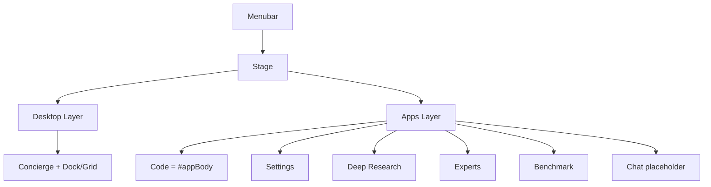

# MinnowOS Redesign — Implementation Plan

Design source: [`documentation/reference/minnowos/project/MinnowOS.html`](../reference/minnowos/project/MinnowOS.html) (Claude Design handoff).

## Goal

Wrap the existing Minnow SPA in an OS-style shell: desktop launcher, menubar, app instances, concierge routing, and mini-previews for background apps — without rewriting chat/workspace internals.

## Architecture

## Shipped modules (`src/os/`)

| Module | Purpose |
|--------|---------|
| `types.ts` | `AppId`, `AppInstance`, `OsView`, `DesktopPrefs` |
| `app-registry.ts` | App metadata (name, icon, tag) |
| `intent-routing.ts` | Concierge keyword → app id |
| `instances.ts` | Launch/restore/close instances, unread |
| `router.ts` | Central `#/desktop`, `#/app/*` hash routing |
| `page-bridge.ts` | Legacy chrome visibility, `isOsAppHash()` |
| `shell.ts` | Boot splash, DOM scaffold, init |
| `menubar.ts` | Model chip, bell, settings, clock |
| `desktop.ts` | Greeting, concierge, dock/grid, mini-previews |
| `concierge.ts` | NL launcher with animated status |
| `wallpaper.ts` | flat / gradient / underwater |
| `app-host.ts` | Reparent `#appBody`, full-page apps into `#osAppsLayer` |
| `desktop-prefs.ts` | `minnow.os.*` localStorage prefs |

## CSS

- `src/styles/minnowos-tokens.css` — `--os-*` aliases to `--mn-*`
- `src/styles/minnowos-shell.css` — menubar, stage, transitions
- `src/styles/minnowos-desktop.css` — desktop, concierge, dock
- `src/styles/minnowos-wallpaper.css` — wallpaper modes
- `src/styles/minnowos-apps.css` — generic app chrome

## Hash routes

| Hash | View |
|------|------|
| `#/desktop` | Desktop home |
| `#/app/code` | Code workspace |
| `#/app/chat` | Pure chat (placeholder) |
| `#/app/research` | Deep Research |
| `#/app/experts` | Experts' Lab |
| `#/app/bench` | Benchmarking |
| `#/app/settings` | Settings |

Legacy hashes (`#/settings/*`, `#/benchmark`, `#/research`, `#/experts`) redirect to OS routes.

## Integration notes

- **Code app** = existing `#appBody` + topbar, reparented into `#osAppLayer-code`.
- **Welcome page** overlays Code app in OS mode (`skipHash`, no hash hijack).
- **Page modules** use `skipNavigate: true` when closing peer overlays during app switches.
- **Boot order:** `initOsPageBridge()` → `initOsShell()` → `initOsRouter()` → `initApp()`.

## Tests

- `test/os/intent-routing.test.mts`
- `test/os/router.test.mts`

## Todos (follow-ups)

- [ ] Desktop prefs UI in Settings → General (wallpaper, dock/grid, preview style)
- [ ] Pure Chat app (dedicated session scope)
- [ ] Notification bridge (research/bench completion → unread badges)
- [ ] Global bugs as Code sub-route or separate app tile
- [ ] Feature flag `config.features.minnowOsShell` for gradual rollout
