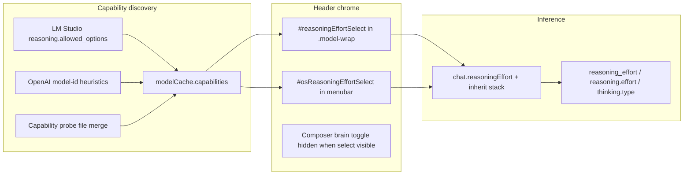

# Reasoning Effort Dropdown in Header

## Overview

Add a **reasoning effort dropdown** in the **header**, immediately **next to the model select** — not in the chat composer. The control appears only when the active model exposes **2+ reasoning options** (e.g. `off` / `on`, or `low` / `medium` / `high`). Selection is **persisted per chat** and merged into completion request bodies for both **LM Studio** and **OpenAI-compatible (`openai-v1`)** providers.

**Placement (user confirmed):**
- **Top bar visible** (Code app, etc.): inside `.model-wrap` in [`index.html`](../../index.html), after `#modelSelectRoot`, before Load/Unload
- **Top bar hidden** (Chat app, desktop, most MinnowOS apps): compact mirror in the **OS menubar** (`.mn-os-mb-right`), adjacent to the model chip — same pattern as model picker visibility handoff in [`page-bridge.ts`](../../src/os/page-bridge.ts)

**Pivot from prior plan:** LM Studio **quantization variants** (`model@q4_k_m`) are **out of scope** — this plan covers **reasoning effort / thinking level** only.

---

## Why the old quant-variant plan does not cover this

| Concept | Source | Send-time effect | Covered? |
|---------|--------|------------------|----------|
| **Quant variants** | LM Studio `/api/v1/models` → `variants[]` | Changes `body.model` to variant key | No (removed from scope) |
| **Reasoning effort** | Catalog `reasoning.allowed_options` or model-id heuristics | Changes `reasoning_effort`, `reasoning.effort`, or `thinking.type` | **Yes — this plan** |

Minnow already has a **brain toggle** ([`composer-thinking.ts`](../../src/ui/composer-thinking.ts)) for tri-state inherit/on/off, but:

- [`reasoningCatalogFromRow`](../../src/providers/model-capabilities.ts) **drops** `low` / `medium` / `high` — only keeps `off` / `on`
- [`thinkingToCompletionBody`](../../src/agents/thinking-to-body.ts) hardcodes **`medium`** when thinking is on (LM Studio) or **`thinking.type: enabled`** (OpenAI)
- OpenAI reasoning models (`o*`, `gpt-5*`) often expect **`reasoning_effort: low|medium|high`** — no user-selectable level today

---

## Confirmed behavior

- Show dropdown when **`reasoningAllowedOptions.length >= 2`**
- **Persist per chat** (`chat.reasoningEffort`); no explicit load call
- When dropdown is visible, **hide the composer brain toggle** (avoid duplicate reasoning controls in two places)
- When dropdown is hidden (< 2 options), **keep existing brain toggle** behavior
- **Single source of truth:** both top-bar and menubar selects read/write the same `chat.reasoningEffort`; only one is visible at a time



---

## 1. Types and reasoning helpers

**[`src/types.ts`](../../src/types.ts)**

- Add `ReasoningEffortOption = 'off' | 'on' | 'low' | 'medium' | 'high'`
- Extend `ModelCapabilities.reasoningAllowedOptions` to `ReasoningEffortOption[]` (was `'off' | 'on'` only)
- Extend `Chat`:
  - `reasoningEffort?: ReasoningEffortOption` — per-chat override; unset = resolve from inherit stack + catalog default

**New [`src/lib/reasoning-effort.ts`](../../src/lib/reasoning-effort.ts)**

- `REASONING_EFFORT_OPTIONS` — canonical ordered list for UI
- `normalizeReasoningAllowedOptions(raw[])` — filter/validate upstream values
- `modelHasSelectableReasoningEffort(caps)` → `allowedOptions.length >= 2`
- `formatReasoningEffortLabel(option)` — display strings (`Low`, `Medium`, `High`, `Off`, `On`)
- `resolveEffectiveReasoningEffort(chat, caps, inheritedResolved)` — merge chat override, catalog default, work-agent thinking resolution
- `inferReasoningOptionsFromModelId(modelId, apiKind)` — fallback for OpenAI cloud models without catalog metadata

**OpenAI heuristic (when catalog lacks `allowed_options`):**

- Match model id patterns: `^o\d`, `gpt-5`, `gpt-oss`, etc.
- Default options: `['low', 'medium', 'high']` (OpenAI reasoning_effort API)
- Do **not** infer for local LM Studio rows that already have catalog data

---

## 2. Preserve full reasoning catalog from providers

**[`src/providers/model-capabilities.ts`](../../src/providers/model-capabilities.ts)**

- Update `reasoningCatalogFromRow()` to keep **`off`, `on`, `low`, `medium`, `high`** (not just off/on)
- Map `reasoning.default` to full `ReasoningEffortOption` set

**[`server/providers/paths.js`](../../server/providers/paths.js)** (optional enrichment)

- For `lm-studio-v0`, best-effort secondary fetch of **`GET /api/v1/models`** to merge richer `capabilities.reasoning.allowed_options` when v0 row lacks them (non-fatal on failure)
- No quantization `variants` merge — reasoning block only

**[`src/providers/fetch-models.ts`](../../src/providers/fetch-models.ts)**

- Ensure `reasoning` block passes through on normalized rows

---

## 3. Send path: map effort to completion body

**Refactor [`src/agents/thinking-to-body.ts`](../../src/agents/thinking-to-body.ts)**

- Add `reasoningEffortToCompletionBody(effort: ReasoningEffortOption, apiKind, caps)` (or extend existing function)
- Mapping rules:

| Effort | `lm-studio-v0` | `openai-v1` |
|--------|----------------|-------------|
| `off` | `enable_thinking: false`, `reasoning_effort: none` | `thinking: { type: 'disabled' }` |
| `on` | `enable_thinking: true`, `reasoning_effort: medium` | `thinking: { type: enabled/adaptive }` |
| `low` / `medium` / `high` | `reasoning_effort` + `reasoning: { effort }` + `enable_thinking: true` | `reasoning: { effort }` when supported; else `reasoning_effort` top-level |
| MiniMax | — | keep `thinking.type: adaptive` for non-off |

- [`src/tools/loop.ts`](../../src/tools/loop.ts): resolve effective effort before merge; pass to body builder instead of binary `resolveThinkingMode` only when effort dropdown applies
- When dropdown hidden, **keep current** inherit/on/off brain toggle → resolved on/off → existing mapping

**[`src/providers/sanitize-completion-body.ts`](../../src/providers/sanitize-completion-body.ts)**

- Do not strip `reasoning` / `reasoning_effort` when model supports reasoning options
- Keep Kimi temperature pin and max_completion_tokens mapping

**Turn snapshots:** extend [`TurnSnapshot`](../../src/types.ts) with `reasoningEffort?: ReasoningEffortOption` for replay fidelity

---

## 4. Header reasoning effort dropdown UI

**New [`src/ui/header-reasoning-effort.ts`](../../src/ui/header-reasoning-effort.ts)**

| Export | Role |
|--------|------|
| `initHeaderReasoningEffort()` | Wire top-bar + menubar `<select>` elements |
| `syncHeaderReasoningEffortFromActiveChat()` | Populate options, show/hide wrappers, disable while streaming, keep both selects in sync |

### Top bar (when `header.topbar` visible)

**HTML ([`index.html`](../../index.html))** — inside `.model-wrap`, after `#modelSelectRoot`:

```html
<div id="reasoningEffortWrap" class="reasoning-effort-wrap hidden">
  <label class="visually-hidden" for="reasoningEffortSelect">Reasoning effort</label>
  <select id="reasoningEffortSelect" class="reasoning-effort-select" aria-label="Reasoning effort" disabled></select>
</div>
```

**Styles:** [`topbar.css`](../../src/styles/topbar.css) — compact select aligned with `.model-select-trigger` height; flex-shrink 0; hide on narrow breakpoints per [`responsive.css`](../../src/styles/responsive.css) if needed (label stays visually hidden)

### OS menubar (when top bar hidden)

**[`src/os/menubar.ts`](../../src/os/menubar.ts)** — insert `#osReasoningEffortWrap` + `#osReasoningEffortSelect` in `.mn-os-mb-right` immediately before the model chip (or between chip and scheduler icon)

**Styles:** [`minnowos-shell.css`](../../src/styles/minnowos-shell.css) — compact menubar select matching chip height

### Visibility / interaction

- Both wrappers hidden when `!modelHasSelectableReasoningEffort(caps)` for the active model
- When visible: hide `#composerThinkingWrap` via sync helper
- When hidden: restore brain toggle sync
- Disabled during active chat streaming (same gate as model select / thinking toggle)
- On `#modelSelect` change or chat switch: rebuild options; validate `chat.reasoningEffort` against allowed list
- `change` on either select updates `chat.reasoningEffort` + saves sessions; syncs the other select

**Sync wiring:** [`sidebar.ts`](../../src/ui/sidebar.ts) (`onModelSelectChange`, chat switch), [`api/models.ts`](../../src/api/models.ts) (`fetchModels`), [`main.ts`](../../src/main.ts) (boot init), [`os/menubar.ts`](../../src/os/menubar.ts) (menubar mount)

---

## 5. Persistence and resolution stack

Resolution order for effective effort sent on each turn:

1. `chat.reasoningEffort` if set and allowed for model
2. Else catalog `reasoningDefault`
3. Else map resolved brain-toggle `on` → `medium`, `off` → `off` (backward compatible)
4. Else first allowed option

- Save via existing [`scheduleSaveSessions()`](../../src/state/sessions.ts)
- Clear invalid `chat.reasoningEffort` when switching to a model that doesn't support the saved value

---

## 6. Tests and docs

**Unit tests [`test/lib/reasoning-effort.test.mjs`](../../test/lib/reasoning-effort.test.mjs)**

- `normalizeReasoningAllowedOptions` preserves low/medium/high
- `modelHasSelectableReasoningEffort` threshold (1 vs 2 options)
- OpenAI model-id inference for `o3-mini`, `gpt-5`
- `reasoningEffortToCompletionBody` mappings per apiKind

**UI test (optional):** [`test/ui/header-reasoning-effort.test.mts`](../../test/ui/header-reasoning-effort.test.mts) — hidden with 0–1 options, visible in `.model-wrap` with 2+, syncs chat state on change

**Update [`documentation/context.md`](../../documentation/context.md)** — header reasoning effort select next to model picker, menubar mirror, capability widening, send-path fields

---

## Out of scope

- LM Studio quantization variant picker (`model@q4_k_m`)
- Reasoning effort inside chat composer / `#chatAppInput` row
- Reasoning effort inside model picker popover (separate control beside picker, not inside menu)
- Desktop launcher composer (`#desktopInput`)
- Settings → Models hub per-role effort (header + per-chat only for v1)
- Explicit `POST /api/v1/models/load` on effort change

---

## Implementation todos

- [ ] **types-helpers** — `ReasoningEffortOption`, `Chat.reasoningEffort`, `src/lib/reasoning-effort.ts`
- [ ] **catalog-widen** — Preserve full `allowed_options` in model-capabilities; optional v1 reasoning merge
- [ ] **send-path** — `reasoningEffortToCompletionBody`, loop.ts + TurnSnapshot + sanitize
- [ ] **header-ui** — `header-reasoning-effort.ts`, topbar + menubar HTML/CSS, brain-toggle hide/show, sync wiring
- [ ] **tests-docs** — unit tests, context.md update
