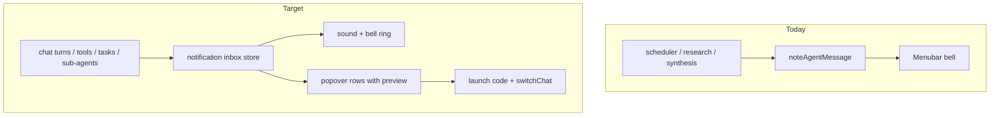

# Complete In-App Notifications

## Current state

Minnow already has a **partial** notification layer:

- [`src/os/instances.ts`](src/os/instances.ts) — `noteAgentMessage(appId, msg)` increments per-app `unread` + stores a single `msg` snippet
- [`src/os/notifications-menu.ts`](src/os/notifications-menu.ts) — bell popover lists **apps** (not individual events); click calls `launchApp(appId)` with no chat deep-link
- Producers today: scheduler poll ([`src/scheduler/notifications-poll.ts`](src/scheduler/notifications-poll.ts)), research completion, synthesis proposals
- **Missing:** chat turn completion, errors, tool failures, task/sub-agent events, sounds, bell animation, settings, chat navigation



## Architecture

### 1. Notification inbox module (new)

Create [`src/notifications/`](src/notifications/) with:

| File | Responsibility |
|------|----------------|
| `types.ts` | `NotificationKind`, `NotificationRecord`, prefs types |
| `store.ts` | In-memory inbox + pub/sub; cap ~100 items; mark read / clear all |
| `prefs.ts` | Persist to `localStorage` (`minnow.notifications.*`) — mirrors [`src/os/desktop-prefs.ts`](src/os/desktop-prefs.ts) pattern |
| `push.ts` | `pushNotification(input)` — dedupe, respect prefs, trigger sound + bell ring |
| `navigate.ts` | `openNotificationTarget(record)` — foreground Code app + `switchChat(chatId)` |
| `preview.ts` | Helpers to truncate assistant text, format error/tool summaries |
| `producers.ts` | Wire all event sources (initialized from [`src/main.ts`](src/main.ts)) |
| `sound.ts` | Play selected sound via `HTMLAudioElement`; preview from settings |

**`NotificationRecord` shape:**

```ts
type NotificationKind =
  | 'chat_turn_complete'
  | 'chat_turn_error'
  | 'chat_tool_failure'
  | 'task_started'
  | 'task_complete'
  | 'task_failed'
  | 'sub_agent_complete'
  | 'sub_agent_failed'
  | 'scheduler'
  | 'research'
  | 'synthesis';

interface NotificationRecord {
  id: string;
  kind: NotificationKind;
  title: string;        // e.g. chat.name or board task title
  preview: string;      // message snippet shown in popover
  chatId?: string;      // deep-link target when applicable
  appId: AppId;         // fallback launch target (code, research, scheduler, settings)
  createdAt: number;
  read: boolean;
}
```

**Dedupe:** key on `(kind, chatId, turnRunId)` or `(kind, chatId, createdAt bucket)` to avoid double-firing from multiple subscribers.

**Backward compat:** refactor `noteAgentMessage` to call `pushNotification` internally so scheduler/research/synthesis keep working while the popover migrates to per-row records.

### 2. Event producers (hook points)

| Event | Source | When to push | Preview |
|-------|--------|--------------|---------|
| Turn complete | [`subscribeChatStreamEnd`](src/chat/streaming-state.ts) + latest run from [`finalizeRun`](src/state/runs-store.ts) | `status === 'completed'` and **not** [`isStreamDomVisible(chatId)`](src/chat/streaming-state.ts) | Last assistant prose (strip markdown, 120 chars) |
| Turn error | same hook | `status === 'failed'` (suppress only if same chat is foreground **and** error bubble is visible — still notify if another app is open) | Error message from run or assistant bubble |
| Tool failure | same hook, end-of-turn scan | Any tool message in turn range with `content.startsWith('Error:')` | `"2 tools failed"` or first error line |
| Task started | [`subscribeBoardChanges`](src/state/orchestrate-board-events.ts) | Task transitions to `in_progress` | Task title + wave name |
| Task complete/failed | board changes | `complete` / `failed` / `blocked` | Task title + status |
| Sub-agent terminal | [`subscribeSubAgentRuns`](src/agents/sub-agent-events.ts) + `isSubAgentRunTerminal` | `completed` / `failed` / `cancelled` | `run.summary` or `run.error` |
| Scheduler | migrate [`notifications-poll.ts`](src/scheduler/notifications-poll.ts) | existing poll | `label: message` |

**Stopped turns** (`status === 'stopped'`): no completion notification (user-initiated).

**Task chat correlation:** resolve `chat.boardTaskId` / `BoardTask.chatId` from [`src/types.ts`](src/types.ts) orchestrate board types when building title + `chatId`.

### 3. Chat deep-link navigation

Extend [`LaunchOptions`](src/os/types.ts):

```ts
chatId?: string;
```

Add [`src/os/chat-launch.ts`](src/os/chat-launch.ts) (or extend [`code-launch.ts`](src/os/code-launch.ts)):

1. `launchApp('code', { chatId })`
2. In app-host after Code shell mounts: `switchChat(chatId)` from [`src/ui/sidebar.ts`](src/ui/sidebar.ts)
3. Mark notification `read` on navigate

Update [`src/os/notifications-menu.ts`](src/os/notifications-menu.ts): each row is a `NotificationRecord` — title, kind label, preview, relative time; click calls `openNotificationTarget(record)`.

### 4. Bell animation + badge

In [`src/os/menubar.ts`](src/os/menubar.ts) and [`src/styles/minnowos-shell.css`](src/styles/minnowos-shell.css):

- Subscribe to notification store (not just `getTotalUnread()` from instances)
- On new unread item: add `.is-ringing` to `.mn-os-mb-bell` for ~1.2s (`@keyframes bell-ring` — rotate ±12deg, ease-out)
- Badge count = unread notification records (not per-app aggregate)
- Keep `.is-on` when unread > 0

Expose `onNewNotification` callback from `push.ts` so menubar does not poll.

### 5. Sounds + settings

**Assets:** add 4–6 short royalty-free clips under [`public/sounds/notifications/`](public/sounds/notifications/) (e.g. `chime.mp3`, `ping.mp3`, `soft.mp3`, `none`).

**Prefs** (`minnow.notifications.*`):

- `enabled: boolean` (master)
- `soundEnabled: boolean`
- `soundId: string` (dropdown value)
- Per-kind toggles (optional v1: group into "Chat", "Tasks", "Background jobs")

**Settings UI:** new [`src/ui/settings-notifications.ts`](src/ui/settings-notifications.ts) rendered from General section in [`src/ui/settings-sections.ts`](src/ui/settings-sections.ts) — "Notifications" group with:

- Master enable switch
- Sound enable switch
- Sound picker (`<select>`) + **Preview** button
- Short copy explaining background-only completion alerts

Register section in [`src/ui/settings-search-index.ts`](src/ui/settings-search-index.ts) for discoverability.

**Sound playback rules:**

- Play only when `document.visibilityState === 'visible'` (avoid background-tab surprise) OR when window not focused — use `document.hasFocus()` check
- Respect `soundEnabled` and `soundId === 'none'`
- First user gesture: browsers may block autoplay — preview button satisfies unlock; document a one-time silent unlock on first menubar interaction if needed

### 6. Migrate existing producers

| Producer | Change |
|----------|--------|
| [`notifications-poll.ts`](src/scheduler/notifications-poll.ts) | `pushNotification({ kind: 'scheduler', ... })` instead of `noteAgentMessage` |
| [`src/research/panel.ts`](src/research/panel.ts) | push with `appId: 'research'` |
| [`src/synthesis/client.ts`](src/synthesis/client.ts) | push with `appId: 'settings'`, link to memory section if no chat |

Deprecate per-app `unread`/`msg` on `AppInstance` for notification purposes; keep fields temporarily for dock mini-preview until migrated, or derive dock badge from notification count filtered by `appId`.

### 7. Tests

Add [`test/notifications/`](test/notifications/):

- `store.test.mjs` — push, read, cap, subscribe
- `producers-chat-turn.test.mjs` — mock chat + run; verify suppress when `isStreamDomVisible` true; verify tool failure summary at end-of-turn
- `prefs.test.mjs` — load/save defaults

### 8. Documentation

- Save this plan as [`documentation/plans/notifications-complete.md`](documentation/plans/notifications-complete.md)
- Update [`documentation/context.md`](documentation/context.md) MinnowOS section: notification inbox, kinds, prefs keys, deep-link behavior

## Implementation order

1. **Foundation** — types, store, prefs, push, sound module
2. **UI** — refactor notifications-menu + menubar ring animation + CSS
3. **Navigation** — `LaunchOptions.chatId`, chat-launch helper
4. **Producers** — chat turn (complete/error/tool-failure), sub-agent, board tasks
5. **Migration** — scheduler/research/synthesis producers
6. **Settings** — notifications section + sound picker
7. **Tests + context.md**

## Out of scope (v1)

- Browser `Notification` API / OS-native toasts (existing `send_notification` server tool stays separate)
- Email/webhook scheduler channels
- Per-notification dismiss (keep "Mark all read" only for v1)
- Persisting notification inbox across sessions (session-only inbox is acceptable v1; prefs persist)

## Key files to touch

- New: `src/notifications/*`, `src/os/chat-launch.ts`, `public/sounds/notifications/*`, `test/notifications/*`, `documentation/plans/notifications-complete.md`
- Modify: [`src/os/notifications-menu.ts`](src/os/notifications-menu.ts), [`src/os/menubar.ts`](src/os/menubar.ts), [`src/os/types.ts`](src/os/types.ts), [`src/os/app-host.ts`](src/os/app-host.ts), [`src/main.ts`](src/main.ts), [`src/tools/loop.ts`](src/tools/loop.ts) (optional thin export for turn tool-failure scan), [`src/ui/settings-sections.ts`](src/ui/settings-sections.ts), [`src/styles/minnowos-shell.css`](src/styles/minnowos-shell.css), [`documentation/context.md`](documentation/context.md)
