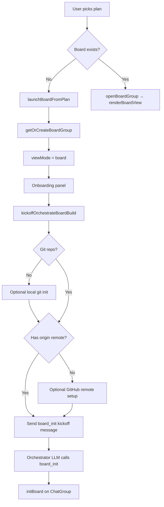
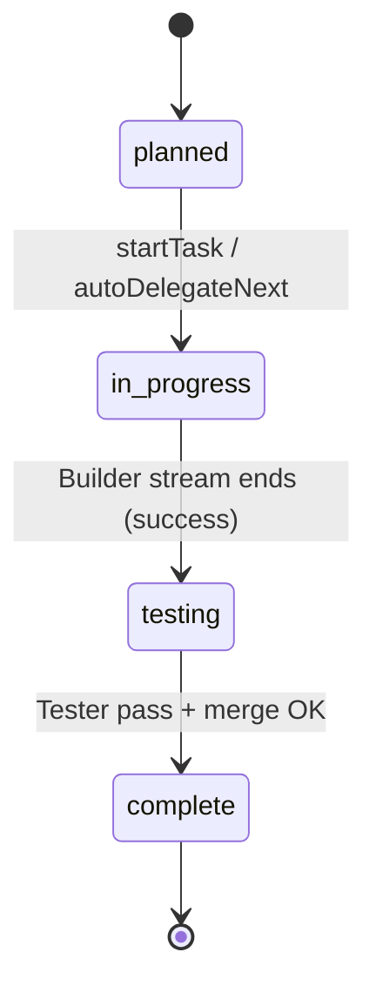
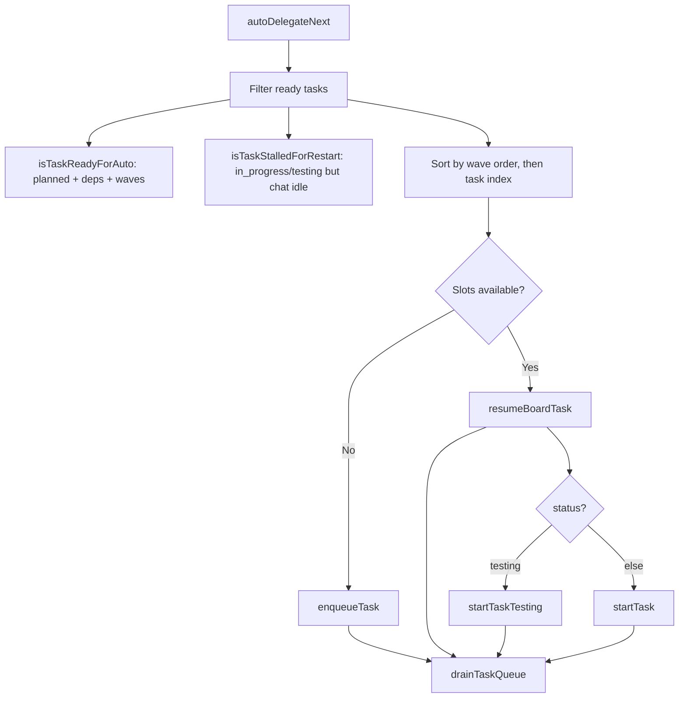
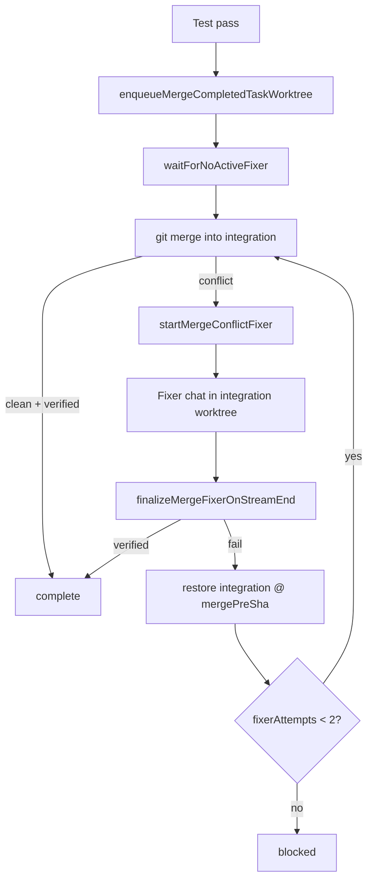
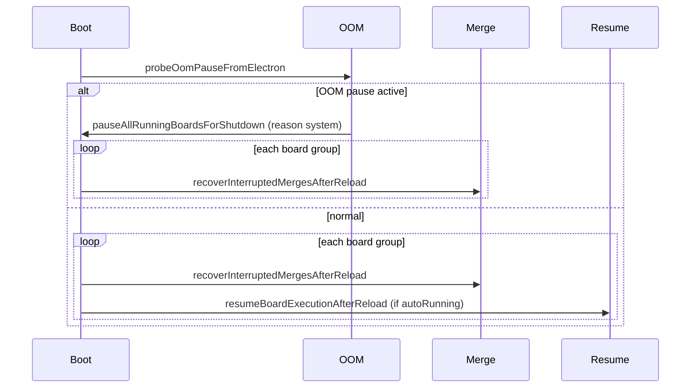

# Orchestrate Board — Architecture & Flow Reference

This document describes how the **Orchestrate board** works end-to-end: entry points, state model, task lifecycle, auto-pilot loops, concurrency, isolation, recovery, and UI behavior. It is derived from the current implementation in `src/state/`, `src/ui/`, `src/tools/`, and `src/chat/orchestrate/`.

---

## Table of contents

1. [Purpose](#purpose)
2. [Module map](#module-map)
3. [Persistence & ownership](#persistence--ownership)
4. [Data model](#data-model)
5. [Entry points & board creation](#entry-points--board-creation)
6. [Kanban structure](#kanban-structure)
7. [Execution modes](#execution-modes)
8. [Task lifecycle (happy path)](#task-lifecycle-happy-path)
9. [Central stream-end router](#central-stream-end-router)
10. [Auto-delegation loop](#auto-delegation-loop)
11. [Concurrency, slots & queue](#concurrency-slots--queue)
12. [Build phase outcomes](#build-phase-outcomes)
13. [Testing phase outcomes](#testing-phase-outcomes)
14. [Merge & fixer loops](#merge--fixer-loops)
15. [Self-heal escalation (AFK)](#self-heal-escalation-afk)
16. [Worktree isolation (MIN-275)](#worktree-isolation-min-275)
17. [Final integration test](#final-integration-test)
18. [Plan completion & finish dashboard](#plan-completion--finish-dashboard)
19. [Manual recovery actions (MIN-222)](#manual-recovery-actions-min-222)
20. [Planner reports (auto-pilot)](#planner-reports-auto-pilot)
21. [Boot, reload & shutdown](#boot-reload--shutdown)
22. [Board tools API](#board-tools-api)
23. [UI live refresh](#ui-live-refresh)
24. [Case matrix (quick reference)](#case-matrix-quick-reference)

---

## Purpose

Orchestrate mode turns an execution plan (`documentation/plans/*.md`) into a **Kanban board** of tasks grouped by **waves**. The **Orchestrator** planner chat parses the plan once via `board_init`, then either:

- **Manual:** the user starts/stops tasks from the board, or
- **Auto-pilot:** the board drives Builder → Tester → merge → next task automatically when **Start** is pressed (`autoRunning === true`).

The LLM does **not** move cards to `complete` in normal flow — builders report `READY FOR VERIFICATION`, testers call `board_report_test_result`, and the board advances status programmatically.

---

## Module map

| Layer | File | Responsibility |
|-------|------|----------------|
| **State (pure)** | `src/state/orchestrate-board-store.ts` | `initBoard`, `updateTask`, wave rollup, `isTaskReadyForAuto`, cycle detection, quarantine cascade, timer, diagnostic log |
| **State (actions)** | `src/state/orchestrate-board-actions.ts` | `startTask`, `startTaskTesting`, merge queue, `autoDelegateNext`, stream-end finalizers, self-heal deps, Start/Stop |
| **Tools** | `src/tools/board-tools.ts` | `board_init`, `board_update_task`, `board_get_state`, `board_report_test_result`, `delegate_tasks`, `board_set_autonomy` |
| **UI** | `src/ui/orchestrate-board.ts` | Kanban render, header controls, running-task strip, onboarding, live refresh |
| **Kickoff** | `src/ui/orchestrate-board-kickoff.ts` | Git preflight → optional `/git-setup` → `board_init` user message |
| **Launch** | `src/ui/orchestrate-launch.ts` | `launchBoardFromPlan` — hub/plan screen entry |
| **Groups** | `src/state/chat-groups.ts` | `ChatGroup.orchestrateBoard`, planner link, sidebar wave subgroups |
| **Boot** | `src/chat/orchestrate/board-boot-resume.ts` | Post-reload merge recovery + auto resume |
| **Shutdown** | `src/chat/orchestrate/board-shutdown.ts` | `pagehide` → pause all running boards |
| **Reports** | `src/agents/controller/report.ts` | Lifecycle messages to planner in auto mode |
| **Self-heal** | `src/state/orchestrate-self-heal.ts` | AFK failure escalation table |
| **Isolation** | `src/state/worktree-isolation.ts` | Per-task worktrees, ports, integration branch |
| **Config** | `src/config/autopilot-meta.ts` | Global defaults: concurrency, retries, isolation, heartbeat |
| **Prompts** | `src/chat/prompts/modes/orchestrate.*.md` | Parse-only orchestrator instructions |

---

## Persistence & ownership

```
SessionState
└── groups[]: ChatGroup
    ├── id, name, workspacePath
    ├── orchestrateBoard?: OrchestrateBoardState   ← board JSON lives here
    ├── orchestratePlanPath?: string
    ├── viewMode?: 'chat' | 'board'
    └── plannerChatId?: string

Chat (planner)
├── modeId: 'orchestrate'
├── orchestratePlanPath?: string
├── boardGroupId?: string          ← links to folder
└── groupId?: string              ← sits in board folder in sidebar

Chat (task)
├── boardGroupId, boardTaskId
├── worktreeRoot?                  ← isolated cwd when MIN-275 active
├── workAgentId?: 'tester' | null
└── modeId: 'build'
```

- **Authoritative board state** is on `ChatGroup.orchestrateBoard`, persisted in `~/.minnow/sessions/state.json`.
- **Planner chat** is always first in the board folder; title pattern: `Orchestrator - {plan-basename}`.
- **Legacy** `Chat.orchestrateBoard` migrates to group-owned state on session load (v5).

---

## Data model

### Task statuses (`BoardTaskStatus`)

| Status | Kanban lane | Meaning |
|--------|-------------|---------|
| `planned` | Plan | Ready to start when deps + wave barrier satisfied |
| `in_progress` | Run | Builder chat streaming or env-fixer running |
| `testing` | Test | Build succeeded; Tester chat pending or running |
| `merging` | Run (transient) | Merge-conflict fixer resolving integration |
| `complete` | Done | Tester passed + branch merged into integration |
| `failed` | Run (terminal, manual) | Build retries exhausted (manual mode) |
| `blocked` | Plan | Test retries exhausted or merge fixer exhausted |
| `quarantined` | Plan | User stop, stall cap, or self-heal exhausted |

### Wave rollup

`rollupWaveStatus` derives each wave's status from its tasks. **Prior-wave gating** (`isPriorWavesComplete`) requires every task in earlier waves to be `complete` **or** `quarantined` before later waves auto-start.

### Dependency graph (`dependsOn`)

- **DAG-first scheduling:** `isTaskReadyForAuto` checks explicit `dependsOn` edges before wave barriers.
- Tasks with **no** `dependsOn` fall back to wave ordering only.
- **Cycles** at `board_init` mark involved tasks `blocked` with an explicit cycle error; they never auto-ready.

### Board-level fields (selected)

| Field | Role |
|-------|------|
| `executionMode` | `manual` \| `sequential` \| `auto` \| `afk` |
| `autoRunning` | User pressed **Start** (auto/sequential/afk) |
| `userStopped` | User pressed **Stop** — freezes timer, shows Stopped badge |
| `systemPaused` | Shutdown/OOM pause (`stopBoardAutoRun` reason `system`) — stream-end parks as `planned` + `stopRetries`, not quarantine |
| `maxConcurrentTasks` | Parallel slot cap (sequential forces 1) |
| `isolationMode` | `off` \| `per-task` \| `per-wave` |
| `integrationBranch` | `minnow/board/<groupId>/integration` |
| `finalTest` | Full-board Tester pass after all tasks terminal |
| `log` | Ring buffer of `BoardLogEvent` (max 500) |
| `unresolvedIssues` | Quarantine summary for finish dashboard |

---

## Entry points & board creation



### Onboarding (`mountBoardOnboardingPanel`)

Shown when `viewMode === 'board'` but `orchestrateBoard` is unset:

1. Plan `<select>` (+ Refresh, Make a plan, Open plan).
2. **Build board** → `kickoffOrchestrateBoardBuild()`.
3. Centered loader while planner streams `board_init` in the background (chat DOM stubbed in board view).
4. Git preflight inline prompt (not `ask_question`).
5. **Jump to chat** / **Cancel setup**.

### `board_init` (tool)

Orchestrator reads `## Wave Breakdown` from the plan and calls `board_init` with:

- `plan_path`, `waves[]`, `tasks[]` (id, title, wave, category, optional build/test, optional `dependsOn`).
- Seeds `executionMode` and `maxConcurrentTasks` from global autopilot config.
- Detects dependency cycles → marks cyclic tasks `blocked`.

After init, **manual mode stops** — the planner does not call `delegate_tasks` unless auto mode is on.

---

## Kanban structure

Each **wave** is a collapsible section with four lanes:

| Lane | Statuses shown |
|------|------------------|
| **Plan** | `planned`, `blocked`, `quarantined` |
| **Run** | `in_progress`, `merging`, `failed` |
| **Test** | `testing` |
| **Done** | `complete` |

**Collapsed waves** show compact chips (id, title, status dot) + lane counts. On board open, `applyOpenBoardWaveCollapse` collapses all waves except those with `in_progress` tasks.

**Task card interactions:**

- `planned` / `blocked` / `quarantined` → inline **task plan panel** (build/test specs).
- `in_progress` / `testing` / `complete` / `failed` → open linked task chat.
- Footer: Start/Stop, Run tests (manual), advance buttons, recovery row (Restart / Continue / Move to new chat).

---

## Execution modes

| Mode | `maxConcurrent` | Isolation default | Behavior |
|------|-----------------|-------------------|----------|
| **Manual** | User stepper (default 3) | Off | User starts tasks; no `autoDelegateNext` unless user starts wave |
| **Sequential** | 1 | Off | Auto-pilot one task at a time |
| **Auto** | User stepper (default 3) | Per-task | Parallel ready tasks up to cap |
| **AFK** | Same as Auto | Per-task | Self-heal on failures; planner reports without asking user |

**Start / Stop** (play/pause in header):

- **Start** → `startBoardAutoRun`: `autoRunning = true`, clears `userStopped`, calls `autoDelegateNext`.
- **Stop** → `stopBoardAutoRun`: stops all task/planner/final chats, clears queue, sets `userStopped`, flushes sessions.

**AFK activation:**

- Orchestrator may call `board_set_autonomy({ level: 'afk' })` → sets `pendingAfk` until user confirms on board banner.
- User can also select AFK on the autonomy slider → `window.confirm` → `activateAfk`.

---

## Task lifecycle (happy path)



### 1. Build (`startTask`)

1. Check concurrency → enqueue if at cap.
2. `reserveLaunchSlot(chatId)` before first `await` (prevents over-subscription during handoff).
3. `ensureTaskWorktree` when isolation on → set `Chat.worktreeRoot`.
4. Create/reuse **Build-mode** chat (`workAgentId` null = Builder).
5. Seed user message: plan path, task id, build/test specs.
6. `runChatTurn` in background (`ownsGlobalStreaming: true`).
7. On first stream chunk → `markBoardTaskInProgressFromChat` sets card to `in_progress`.

Builder reports completion via prose **`READY FOR VERIFICATION`** (not `board_update_task`).

### 2. Testing (`startTaskTesting`)

Triggered automatically when build succeeds in auto mode, or manually via **Run tests** on card.

1. Create/reuse **Tester** chat (`workAgentId: 'tester'`).
2. `ensureBoardInfraProvisioned` (docker compose, deps) before Tester runs.
3. Tester calls **`board_report_test_result`** → sets `testVerdict` / `testSummary` on task.

### 3. Merge (on test pass)

`finalizeTaskTestingOnStreamEnd` → `enqueueMergeCompletedTaskWorktree`:

1. Auto-commit task worktree (per-task isolation).
2. Merge branch into `integration` worktree (serialized per board).
3. `verifyIntegrationMerge` (ancestry, no conflict markers, clean tree).
4. `refresh_integration_deps` when lockfiles changed.
5. `moveTaskStatus(..., 'complete')` → triggers `tryTriggerFinalIntegrationTest`.

### 4. Downstream unlock

`autoDelegateNext` picks next `planned` tasks where `isTaskReadyForAuto` is true (deps complete + prior waves settled).

---

## Central stream-end router

One global subscription in `ensureStreamEndSubscription` routes **every** board-linked chat end:

```
subscribeChatStreamEnd(endedChatId)
├── finalTest.chatId     → finalizeFinalTestOnStreamEnd → drain
├── task.chatId (build)  → finalizeBoardTaskOnStreamEnd → drain
├── task.testChatId      → finalizeTaskTestingOnStreamEnd → drain
├── task.fixerChatId     → finalizeMergeFixerOnStreamEnd OR finalizeEnvFixerOnStreamEnd → drain
└── unmatched + running  → drain only (fixer id may have been cleared)
```

**Drain timing:** `safeDrain` runs immediately **and** on `queueMicrotask` because `notifyChatStreamEnded` fires before `setStreaming(false)` clears the ended chat from the active count.

---

## Auto-delegation loop



**`resumeBoardTask`:** if `testing` → `startTaskTesting`; else → `startTask`.

**Triggers for `autoDelegateNext`:**

- `startBoardAutoRun`
- `resumeBoardExecutionAfterReload`
- After build stop/retry paths
- After `requeueBoardTask`
- After planner task reports complete (`report.ts` → `initOrchestratorAutoReports`)
- `drainTaskQueue` when slots free

---

## Concurrency, slots & queue

A **slot** is held from build start through test pass + merge for one task.

**`countRunningTaskChats`** counts:

- Streaming or setup-pending chats (build / test / fixer / final).
- `reservedLaunchChatIds` — set in `reserveLaunchSlot` **before** `await` in starters, released in `runChatTurn` `.finally()` via `releaseLaunchSlotAndDrive`.

**Task queue** (`taskQueueByGroupId`):

- FIFO per group, but **testing tasks sort ahead of builds** when draining (build→test handoff gap).
- `drainInFlightByGroupId` prevents overlapping drains.

**OOM recovery:** after render-process OOM, boot sets `OOM_SAFE_MAX_CONCURRENT = 2` until user explicitly starts again.

---

## Build phase outcomes

`finalizeBoardTaskOnStreamEnd` (only when `status === 'in_progress'`):

| Outcome | Detection | Auto-running behavior | Manual behavior |
|---------|-----------|----------------------|-----------------|
| **Success** | `resolveTaskChatStreamOutcome === 'completed'` | → `testing`, `startTaskTesting` | → `testing` (user runs tests) |
| **Stopped (user)** | stop reason `user` or `board.userStopped` | Quarantine task + dependents | Same |
| **Stopped (system/timeout)** | stop reason not user | Increment `stopRetries`; if ≤2 → back to `planned` + delegate; else quarantine | Stays `in_progress` / quarantine per path |
| **Failed** | failed turn / no success | `runSelfHeal` (build phase) | `moveTaskStatus('failed')` + preserve dirty worktree commit |

**Build failure retry (auto/afk):** `applyTaskBuildFailureState` — same chat nudge via `runTaskChatNudge` until `maxBuildAttempts` (default 2), then `failed` or quarantine via self-heal.

**Success clears:** `error`, `testVerdict`, `stopRetries`; tears down dev servers via `teardownBoardTaskChatResources`.

---

## Testing phase outcomes

`finalizeTaskTestingOnStreamEnd`:

| Verdict | Action |
|---------|--------|
| **pass** | Merge → `complete` or spawn merge fixer on conflict |
| **fail / missing** | `runSelfHeal` (test phase) or `applyTaskTestFailureState` |

**`applyTaskTestFailureState`:**

- Increment `testAttempts`.
- If ≥ `maxTaskTestAttempts` (default 3) → `blocked`.
- Else → `in_progress` + fresh Builder retry (`pendingBuildSeed` with failure summary).

**Verdict sources (priority):**

1. `board_report_test_result` → `task.testVerdict`
2. Fallback: backward scan for `VERDICT: pass|fail` in Tester transcript

---

## Merge & fixer loops



**Merge fixer rules:**

- Runs in **integration worktree** with merge already in progress (`MERGE_HEAD` set).
- Must **not** run `git merge` / `git merge --abort` — only resolve markers + `git commit --no-edit`.
- Heartbeat may **early-finalize** via `reconcileMergeFixerChat` when `checkMerged` + `verifyIntegrationMerge` succeed (git poll each tick).
- Merge-fixer **stall** watchdog uses `FIXER_STALL_MULTIPLIER` (1.5× `progressStallMs`) before calling `reconcileMergeFixerChat`; env-fixer stalls remain stop-only (1×).
- **`reconcileMergingTasks`** — live safety net: supervise active fixer (`isTaskChatActive`) or `finalizeMergeFixerOnStreamEnd` + `drainTaskQueue` when board is running. Called from `autoDelegateNext` (before `isBoardRunning` gate), `waitForNoActiveFixer` timeout (60s cap), boot `recoverInterruptedMergesAfterReload`, and manual **`recoverMergingBoardTask`**.
- Serialized via `mergeQueueByGroupId` + `enqueueBoardMerge`.

**Env fixer** (`startEnvFixer`, `fixerKind: 'env'`):

- Spawned by self-heal for **infra** failures on the **task worktree**.
- Re-runs build or test phase after fixer completes.

---

## Self-heal escalation (AFK)

Decision table in `orchestrate-self-heal.ts` (checked in order):

| Step | Condition | Action |
|------|-----------|--------|
| 1 | `selfHealRound >= max` | Quarantine + cascade dependents |
| 2 | `infra` && env fix attempts remain | `startEnvFixer` → re-run phase |
| 3 | `infra` && env attempts exhausted | Quarantine |
| 4 | `stall` && first stall | `runTaskChatNudge` + `autoDelegateNext` |
| 5 | `stall` recurrence | Treat as `code` |
| 6 | `code` | Reseed retry (`pendingBuildSeed` / test retry); exhausted → quarantine |
| 7 | `merge` | `startMergeConflictFixer`; exhausted → quarantine |

Every non-terminal path ends with **`autoDelegateNext`** so independent sibling tasks keep running.

**Manual mode** does not run self-heal — failures go to `failed` / `blocked` directly.

---

## Worktree isolation (MIN-275)

When `resolveIsolationMode(board) !== 'off'`:

```
Main workspace (untouched)
└── ~/.minnow/worktrees/<repoKey>/<boardId>/
    ├── integration/          ← minnow/board/<id>/integration
    └── task/<taskId>/        ← minnow/board/<id>/task/<taskId>
```

- **`startTask`** creates task worktree branched from integration.
- **`finalizeTaskTestingOnStreamEnd`** commits + merges task branch into integration.
- **Per-task ports:** `devPort` + `apiPort` injected into `execute_command` env when cwd matches worktree.
- **Reload:** `rehydrateBoardWorktreeRoots` re-attaches server worktrees and re-binds `Chat.worktreeRoot`.
- **Sequential/manual** default isolation **off** unless user overrides via header `<select>`.

---

## Final integration test

Gated by `isBoardReadyForFinalTest`:

- Every task is terminal (`complete` or `quarantined`).
- At least one task is `complete`.

| Mode | Behavior |
|------|----------|
| **Auto / AFK / Sequential** | `startFinalIntegrationTest` automatically |
| **Manual** | Banner **Run final integration test**; `finalTest.status = 'pending'` |

Tester runs in **integration worktree** with browser smoke tools. Verdict via `board_report_test_result` on final chat.

**On pass:** `maybeEmitOrchestratePlanComplete` → finish dashboard.

**On fail:** Reopen named `failingTaskIds` → `in_progress` with retry seeds → `startTask`; retries capped by `maxFinalTestAttempts`.

**Board finished** (`isOrchestrateBoardFinished`): all tasks terminal **and** `finalTest.status === 'passed'`.

---

## Plan completion & finish dashboard

Two levels of "done":

| Check | Meaning |
|-------|---------|
| `isOrchestratePlanComplete` | All tasks `complete` or `quarantined` |
| `isOrchestrateBoardFinished` | Above + final test passed |

When finished and not dismissed:

- `completionShownAt` set (dedupe).
- `finishReport` cached from `finish-stats.ts`.
- UI swaps kanban for **`renderFinishDashboard`** (stats, issues, commit/push/PR actions).

User can toggle **Dashboard** ↔ **Board** via `dashboardDismissed`.

---

## Manual recovery actions (MIN-222)

| Action | Behavior |
|--------|----------|
| **Reconcile merge** | `merging` only → `recoverMergingBoardTask` (stop fixer supervision + `reconcileMergingTasks`). **Restart / Continue / Move** do not apply to `merging`. |
| **Restart** | Stop active chats, `clearTaskFailureState(resetAttempts)`, fresh seed → `startTask` (new chat if `pendingBuildSeed`) |
| **Continue** | Nudge existing chat; or **smart-route** to new chat when transcript oversized (`continueSmartRoute` setting) |
| **Move to new chat** | Progress summary seed → fresh Builder chat |
| **Requeue** | `quarantined` → `planned`, clears dependents blocked only as `blocked by quarantined <root>` |
| **Stop** (card or running strip) | `stopGeneration` on linked chats, `drainTaskQueue` |

---

## Planner reports (auto-pilot)

`deliverOrchestratorTaskReport` posts to planner when `isBoardRunning` and task reaches:

- `complete` → `completed`
- `failed` → `failed`
- `blocked` → `stalled`
- `quarantined` → `quarantined`

Reports queue while planner is streaming; drain on stream end. After delivery, **`autoDelegateNext`** runs for completions.

---

## Boot, reload & shutdown



**`bootOrchestrateBoardResume` order:**

1. OOM probe → optional global pause (`systemPaused`, `autoRunning` cleared).
2. **OOM branch:** after pause, **`recoverInterruptedMergesAfterReload`** for every board (reconcile dead fixers without resuming auto-run).
3. **Normal branch:** **`recoverInterruptedMergesAfterReload`** for every board, then for boards with `autoRunning`: rehydrate worktrees, re-attach heartbeat supervision, `autoDelegateNext`.

**`pagehide`:** `pauseAllRunningBoardsForShutdown` → `stopBoardAutoRun` with `{ reason: 'system' }` (sets `systemPaused`, not `userStopped`).

**Generation resume** (`generation-resume.ts`) re-subscribes in-flight **chat** streams separately; board resume handles **delegation** logic.

---

## Board tools API

| Tool | Who can call | Effect |
|------|--------------|--------|
| `board_init` | Orchestrate planner | Create/replace board on folder |
| `board_get_state` | Any board-linked chat | Read JSON state |
| `board_update_task` | Planner only | Metadata, notes; **not** for builders marking `complete` |
| `board_report_test_result` | Tester chats | Sets verdict fields (routing on stream end) |
| `board_report_build_result` | Builder (optional) | Structured blockers for self-heal |
| `board_set_autonomy` | Planner | Set mode; `afk` → `pendingAfk` |
| `delegate_tasks` | Headless/programmatic | Hidden from planner tool list; starts specific task ids |

**Board member chats** (Builder/Tester) are denied `board_init`, `board_update_task`, `delegate_tasks`.

---

## UI live refresh

- **`emitBoardChange(groupId)`** → subscribers repaint.
- **`refreshBoardDom`**: header metrics every tick; kanban rebuild only when `buildKanbanRefreshKey` changes.
- Defers kanban rebuild while `select`/`input`/`textarea` focused (not buttons).
- **Heartbeat badges** patched in place (`syncKanbanHeartbeatBadges`) without full rebuild.
- **Running tasks strip:** `listRunningBoardTaskSlots` — per-slot elapsed, tokens, stop/restart/continue/move.
- **Timer:** `syncOrchestrateBoardTimer` — runs while streaming/tasks active; pauses on Stop/idle.

---

## Case matrix (quick reference)

### When does a task become ready?

```
planned
AND NOT in dependency cycle
AND all dependsOn tasks are complete
AND all prior waves settled (complete or quarantined)
```

### Stream-end → next action (auto-running)

| Chat type | End outcome | Next |
|-----------|-------------|------|
| Builder | success | `testing` + start Tester |
| Builder | user stop | quarantine (+ dependents) |
| Builder | system stop (`systemPaused`) | `planned` + `stopRetries` (not quarantine) |
| Builder | fail | self-heal (auto) / `failed` (manual) |
| Tester | pass | merge → `complete` or merge fixer |
| Tester | fail | self-heal / test retry / `blocked` |
| Merge fixer | merged (stream-end or heartbeat reconcile) | `complete` |
| Merge fixer | stall (≥ 1.5× `progressStallMs`) | `reconcileMergeFixerChat` → finalize |
| Merge fixer | not merged | retry merge ≤2 → `blocked` |
| Final Tester | pass | finish dashboard |
| Final Tester | fail | reopen tasks + rebuild |

### Execution mode × user action

| User action | Manual | Auto / Sequential / AFK |
|-------------|--------|-------------------------|
| Start task on card | `startTask` | same (no auto until Start pressed) |
| Press Start (header) | N/A | `autoDelegateNext` loop |
| Press Stop | stop chats | stop all + clear queue + `userStopped` |
| Run tests on card | `startTaskTesting` | same in manual; auto chains after build |
| Complete wave | `startWave` (queues overflow) | auto picks ready tasks globally |

### Quarantine cascade

`quarantineTaskAndDependents` BFS on reverse `dependsOn` edges:

- Root gets the issue payload.
- Dependents get `blocked by quarantined <rootId>`.
- **Requeue** root clears only dependents with that exact summary.

---

## Related tests

- `test/orchestrate/board-flow-e2e.test.mts` — full lifecycle harness (`driveBoardToConvergence`)
- `test/orchestrate/board-store.test.mts` — pure store logic
- `test/orchestrate/fixer-recovery.test.mts` — merge-fixer reconcile, `systemPaused`, manual merge recovery, fixer wait timeout
- `test/chat/orchestrate/board-boot-resume.test.mts` — reload resume + OOM merge reconcile
- `test/ui/orchestrate-board-*.test.mjs` — UI header, streaming, live update

---

## Related docs

- [`documentation/context.md`](../context.md) — Orchestrate board section (module table)
- [`documentation/plans/Orchestrator Plan.md`](Orchestrator%20Plan.md) — product plan (MIN-140+)
- [`documentation/specs/MIN-275-worktree-isolation.md`](../specs/MIN-275-worktree-isolation.md) — isolation spec
- [`documentation/guides/MIN-275-worktree-isolation-testing.md`](../guides/MIN-275-worktree-isolation-testing.md) — manual QA guide
