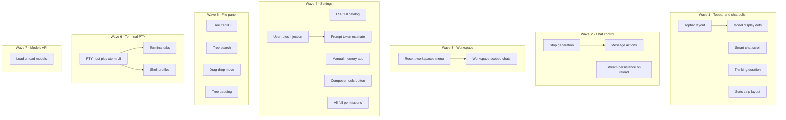

# Minnow product backlog — agent assignment pack

Save the per-item build plans under `[documentation/plans/Build out/](documentation/plans/Build%20out/)` as `feature-XX-<slug>.md` (mirror existing `step-01` … `step-20` format). Update `[documentation/context.md](documentation/context.md)` when a feature ships.

**Your scope choices (locked in):**

- **Terminal:** full interactive **PTY** in the browser (tabs, shell profiles, ↑/↓ history, tab completion).
- **Chat actions:** **Cursor-like** per-message menu + **Stop** during stream (not minimal regenerate-only).

**Reference architecture:** `[documentation/context.md](documentation/context.md)` — sessions in `~/.minnow/sessions/state.json`, workspace in `config.json`, prompts via `composeSystemPrompt()` in `[src/chat/prompts/prompt-composer.ts](src/chat/prompts/prompt-composer.ts)`.

---

## Dependency overview

---

## Epic A — Top bar and model picker

### A1 — `feature-01-topbar-grouped-actions`

**Title:** Clean up top bar — group all action buttons together

| Field          | Detail                                                                                                                                                                                                                                                            |
| -------------- | ----------------------------------------------------------------------------------------------------------------------------------------------------------------------------------------------------------------------------------------------------------------- |
| **Current**    | `[index.html](index.html)` `header.topbar`: logo/title left, then scattered controls (sidebar, workspace, model, files, refresh, terminal, settings), status pill at end. Model `flex: 1` pushes groups apart (`[src/styles/topbar.css](src/styles/topbar.css)`). |
| **Goal**       | Single **actions cluster** (icon buttons) with consistent gap; brand block left; model + status on **right** (see A4/A5).                                                                                                                                         |
| **Key files**  | `index.html`, `topbar.css`, `responsive.css`                                                                                                                                                                                                                      |
| **Acceptance** | All icon buttons visually contiguous; no orphan separator between workspace and model; mobile breakpoints keep cluster usable (≤380px hides refresh per existing rule).                                                                                           |
| **Size**       | S                                                                                                                                                                                                                                                                 |
| **Depends on** | None (coordinate with A4 layout)                                                                                                                                                                                                                                  |

### A2 — `feature-10-model-display-names`

**Title:** Clean model list labels (display name, not raw path)

| Field          | Detail                                                                                                                                        |
| -------------- | --------------------------------------------------------------------------------------------------------------------------------------------- |
| **Current**    | `[src/api/models.ts](src/api/models.ts)` renders options as ``${m.id}${tag} (${stateLabel})`` — e.g. `qwen/qwen3.6-27b · Q4_K_M (loaded)`.    |
| **Goal**       | Show **friendly name** primary (derive from `id`: strip vendor prefix, humanize); full id in `title` tooltip; optional quant as muted suffix. |
| **Key files**  | `src/api/models.ts`, new `src/lib/format-model-label.ts`, `topbar.css` (custom dropdown if native `<select>` too cramped)                     |
| **Acceptance** | Dropdown shows `Qwen3.6 27B` (example), not `qwen/qwen3.6-27b`; selection still uses canonical `modelId`.                                     |
| **Size**       | S                                                                                                                                             |

### A3 — `feature-11-12-load-unload-model`

**Title:** Load / unload model controls + provider proxy

| Field          | Detail                                                                                                                                                                            |
| -------------- | --------------------------------------------------------------------------------------------------------------------------------------------------------------------------------- |
| **Current**    | Read-only `state` from models list; no load/unload API in client or `[server/providers](server/providers)`.                                                                       |
| **Goal**       | Button(s) beside model picker: **Load** / **Unload** active model; disable when provider lacks API; refresh list after action.                                                    |
| **Key files**  | `server/providers/` (LM Studio `POST /api/v0/models/load` & unload — verify against LM Studio REST docs), `src/api/models.ts`, `index.html`, provider `paths.ts` capability flags |
| **Acceptance** | LM Studio local provider: load/unload works and updates `(loaded)` state; non-supporting providers hide controls with explanation.                                                |
| **Size**       | M                                                                                                                                                                                 |
| **Depends on** | A2 (labels), active provider resolution                                                                                                                                           |

### A4 — `feature-12-13-model-picker-right-dots`

**Title:** Model select far right; remove “N models, M loaded”; restore status dots

| Field          | Detail                                                                                                                                                                       |
| -------------- | ---------------------------------------------------------------------------------------------------------------------------------------------------------------------------- |
| **Current**    | Status text `[setStatus('ok',` ${models.length} models, ${nLoaded} loaded`)](src/api/models.ts)`; no per-model dots (legacy prototype had `model-wrap::after` chevron only). |
| **Goal**       | Topbar order: `brand                                                                                                                                                         |
| **UI**         | Per-option or selected-row **green/grey circle** for loaded/unloaded (CSS or custom listbox).                                                                                |
| **Key files**  | `index.html`, `topbar.css`, `models.ts`, `status.ts`                                                                                                                         |
| **Acceptance** | Model control is rightmost before compact status; dots match `state`; status pill shows connection/workspace messages only.                                                  |
| **Size**       | M                                                                                                                                                                            |
| **Depends on** | A1, A2, A3                                                                                                                                                                   |

---

## Epic B — Workspace and chat scope

### B1 — `feature-04-recent-workspaces-menu`

**Title:** Workspace button → recent list + “Open new workspace…”

| Field           | Detail                                                                                                                      |
| --------------- | --------------------------------------------------------------------------------------------------------------------------- |
| **Current**     | `[src/ui/workspace-button.ts](src/ui/workspace-button.ts)` opens native picker immediately via `POST /api/workspace/pick`.  |
| **Goal**        | Popover/menu: **recent paths** (from `config.json`, max ~10), current checkmark, divider, **Open new workspace…** → picker. |
| **Persistence** | Extend `[server/workspace/root.js](server/workspace/root.js)`: `workspace.recentPaths: string[]`, dedupe on pick.           |
| **Acceptance**  | Selecting recent switches workspace without dialog; new path appended; invalid/missing paths grayed with remove.            |
| **Size**        | M                                                                                                                           |

### B2 — `feature-03-workspace-scoped-chats`

**Title:** Link chats to workspace folder; filter sidebar by active workspace

| Field          | Detail                                                                                                                                                                     |
| -------------- | -------------------------------------------------------------------------------------------------------------------------------------------------------------------------- |
| **Current**    | `[Chat](src/types.ts)` has no `workspacePath`; all chats in one `[SessionState](src/state/sessions.ts)` blob.                                                              |
| **Goal**       | `chat.workspacePath` (normalized absolute); sidebar lists only chats matching `getWorkspacePath()`; new chat binds current workspace.                                      |
| **Migration**  | `SESSION_SCHEMA_VERSION` → `2`: orphan chats get `workspacePath: ''` (show in “Unassigned” group or attach to current workspace once — **document choice in build plan**). |
| **Key files**  | `types.ts`, `sessions.ts`, `sidebar.ts`, `server/config/store.js`, migration in middleware                                                                                 |
| **Acceptance** | Switch workspace → chat list changes; creating chat on workspace A never appears on B; active chat preserved when still valid.                                             |
| **Size**       | L                                                                                                                                                                          |
| **Depends on** | B1 (optional but recommended first)                                                                                                                                        |

---

## Epic C — Chat UX and control

### C1 — `feature-14-stop-generation`

**Title:** Stop chat while streaming

| Field          | Detail                                                                                                                                                                                            |
| -------------- | ------------------------------------------------------------------------------------------------------------------------------------------------------------------------------------------------- |
| **Current**    | `[chatFetchAbort](src/app-state.ts)` exists; `[loop.ts](src/tools/loop.ts)` handles `AbortError`; send button only disables (`[src/ui/input.ts](src/ui/input.ts)`); `streaming` blocks new sends. |
| **Goal**       | Send becomes **Stop** while `streaming`; calls `chatFetchAbort.abort()`; sub-agent cancel; finalize UI (dispose stream status, partial bubble marked “stopped”).                                  |
| **Acceptance** | Stop ends fetch within ~1s; composer re-enabled; partial assistant text retained with visual “stopped” state.                                                                                     |
| **Size**       | S                                                                                                                                                                                                 |

### C2 — `feature-15-16-17-message-actions`

**Title:** Cursor-like message actions (edit, regenerate from here, delete after, copy, remake)

| Field          | Detail                                                                                                                                                                                                           |
| -------------- | ---------------------------------------------------------------------------------------------------------------------------------------------------------------------------------------------------------------- |
| **Current**    | No truncate/regenerate; `[renderChatFromHistory](src/ui/messages.ts)` only full rebuild.                                                                                                                         |
| **Goal**       | Per-message ⋮ menu: **Edit** (user msg → textarea), **Regenerate from here** (truncate `history` after index, resend), **Delete message**, **Copy**, **Remake** (re-run assistant turn from preceding user msg). |
| **API**        | `truncateChatHistory(chatId, index)`, `resendFromIndex()` in `sessions.ts` + `loop.ts`; tool rows must truncate atomically (assistant + tool_results).                                                           |
| **Acceptance** | Regenerate removes subsequent messages from UI + persistence; tool-call chains stay consistent; undo not required v1.                                                                                            |
| **Size**       | L                                                                                                                                                                                                                |
| **Depends on** | C1                                                                                                                                                                                                               |

### C3 — `feature-17-chat-scroll-during-stream`

**Title:** Fix scroll — allow reading history while model thinks/writes

| Field          | Detail                                                                                                                                                     |
| -------------- | ---------------------------------------------------------------------------------------------------------------------------------------------------------- |
| **Current**    | `[scrollBottom()](src/ui/input.ts)` forced on every delta; terminal already has `stickToBottom` pattern (`[terminal-panel.ts](src/ui/terminal-panel.ts)`). |
| **Goal**       | Chat `stickToBottom`: only auto-scroll if user within ~80px of bottom; scroll listener toggles flag; “Jump to latest” chip when detached.                  |
| **Acceptance** | Scroll up during stream → content does not yank down; button returns to live tail.                                                                         |
| **Size**       | S                                                                                                                                                          |

### C4 — `feature-05-thinking-duration`

**Title:** Display how long the agent spent thinking

| Field          | Detail                                                                                                                                                            |
| -------------- | ----------------------------------------------------------------------------------------------------------------------------------------------------------------- |
| **Current**    | `[ThoughtBubbleController](src/ui/thought-bubbles.ts)` + `[stream-status.ts](src/ui/stream-status.ts)`; TTFT in stats after complete, not thinking-only duration. |
| **Goal**       | Timer from first reasoning delta until first prose token (or stream end); show on Thoughts header / bubble footer: e.g. `Thought for 12.4s`.                      |
| **Persist**    | Optional `AssistantMessage.thinkingDurationMs` in history.                                                                                                        |
| **Acceptance** | Visible on live stream and restored chats with `thinking[]`.                                                                                                      |
| **Size**       | S                                                                                                                                                                 |

### C5 — `feature-22-stream-persistence-reload`

**Title:** Survive page reload mid-stream — resume or recover partial turn

| Field          | Detail                                                                                                                                                                                                                                               |
| -------------- | ---------------------------------------------------------------------------------------------------------------------------------------------------------------------------------------------------------------------------------------------------- |
| **Current**    | In-flight stream is memory-only; reload loses unsaved tail; `[scheduleSaveSessions](src/state/sessions.ts)` may not flush mid-turn.                                                                                                                  |
| **Goal**       | **Checkpoint** streaming state: `chat.pendingTurn?: { role, content, thinking[], toolCalls?, startedAt }` saved debounced; on boot detect pending → offer **Continue** or **Discard**; if provider cannot resume, show partial as assistant message. |
| **Key files**  | `loop.ts`, `sessions.ts`, `messages.ts`, schema version bump                                                                                                                                                                                         |
| **Acceptance** | Reload during generation → user sees partial text + continue/discards; no silent empty loss.                                                                                                                                                         |
| **Size**       | L                                                                                                                                                                                                                                                    |
| **Depends on** | C1 (abort semantics), session schema                                                                                                                                                                                                                 |

---

## Epic D — Terminal (full PTY)

### D1 — `feature-06-07-08-09-terminal-pty`

**Title:** Interactive PTY terminal — tabs, shells, history, tab completion

| Field          | Detail                                                                                                                                                                                                                                                                                    |
| -------------- | ----------------------------------------------------------------------------------------------------------------------------------------------------------------------------------------------------------------------------------------------------------------------------------------- |
| **Current**    | `[terminal-panel.ts](src/ui/terminal-panel.ts)` + `[server/terminal-runner.js](server/terminal-runner.js)`: one-shot `spawn` + SSE, no PTY.                                                                                                                                               |
| **Goal**       | **node-pty** (or equivalent) on server; WebSocket or SSE binary stream; **xterm.js** (or similar) in panel; **tabs** each with session id; **shell profile** dropdown: PowerShell, cmd, bash, zsh (OS-gated); **↑/↓** local command history per tab; **Tab** completion via PTY readline. |
| **API**        | New routes e.g. `POST /api/terminal/session`, `WS /api/terminal/ws/:id`, `DELETE` close tab; persist tab metadata in `config.json` or per-chat.                                                                                                                                           |
| **Keep**       | Agent `execute_command` can still use existing runner OR attach to active PTY — decide in build plan (recommend keep runner for agents, PTY for user).                                                                                                                                    |
| **Acceptance** | User opens terminal, picks PowerShell, runs interactive `npm test`, Tab completes paths, ↑ recalls commands, second tab runs parallel session, resize works.                                                                                                                              |
| **Size**       | XL                                                                                                                                                                                                                                                                                        |
| **Notes**      | Security: PTY only when `npm start`; sanitize cwd to workspace root; Windows code page / ConPTY testing required.                                                                                                                                                                         |

---

## Epic E — File panel

### E1 — `feature-18-file-tree-crud`

**Title:** Delete, move, rename, copy, paste in files section

| Field          | Detail                                                                                                                                                                                                                 |
| -------------- | ---------------------------------------------------------------------------------------------------------------------------------------------------------------------------------------------------------------------- |
| **Current**    | Read-only tree + viewer save; agents use tools only.                                                                                                                                                                   |
| **Goal**       | Context menu + keyboard shortcuts on `[file-tree.ts](src/ui/file-tree.ts)`; server endpoints or reuse tools: `delete_file`, `move_file`, `copy_file` (add if missing in `[definitions.ts](src/tools/definitions.ts)`). |
| **Acceptance** | Operations respect workspace guard; errors surfaced in toast; tree refreshes; viewer closes if deleted file open.                                                                                                      |
| **Size**       | L                                                                                                                                                                                                                      |

### E2 — `feature-19-file-search`

**Title:** Search / filter in file tree

| Field    | Detail                                                                                                                             |
| -------- | ---------------------------------------------------------------------------------------------------------------------------------- |
| **Goal** | Filter input above tree; fuzzy match on file names; optional “search in files” phase 2 (ripgrep tool) — v1 = **name filter only**. |
| **Size** | M                                                                                                                                  |

### E3 — `feature-20-drag-drop-move-confirm`

**Title:** Drag-and-drop move with confirmation

| Field          | Detail                                                                             |
| -------------- | ---------------------------------------------------------------------------------- |
| **Current**    | Drag from tree → **composer** only.                                                |
| **Goal**       | Internal tree DnD: drop on folder → modal “Move `a.ts` → `src/`?” → call move API. |
| **Size**       | M                                                                                  |
| **Depends on** | E1                                                                                 |

### E4 — `feature-21-file-tree-padding`

**Title:** Tighten file tree row padding

| Field          | Detail                                                                                       |
| -------------- | -------------------------------------------------------------------------------------------- |
| **Key files**  | `[src/styles/file-panel.css](src/styles/file-panel.css)`, tree row classes in `file-tree.ts` |
| **Acceptance** | Denser rows; still meets 40px touch target on mobile if required by DESIGN.md.               |
| **Size**       | S                                                                                            |

### E5 — `feature-27-editor-tab-key`

**Title:** Tab inserts indent in file editor (not browser focus trap)

| Field       | Detail                                                                                                                                                   |
| ----------- | -------------------------------------------------------------------------------------------------------------------------------------------------------- |
| **Current** | CodeMirror 6 in `[file-viewer.ts](src/ui/file-viewer.ts)` / `[file-editor-extensions.ts](src/ui/file-editor-extensions.ts)` — Tab may bubble to browser. |
| **Goal**    | `indentWithTab: true`, `defaultTabBehavior: 'indent'`; Esc still blurs.                                                                                  |
| **Size**    | S                                                                                                                                                        |

### E6 — `feature-26-stats-strip-with-editor`

**Title:** Stats section adapts when file editor is open

| Field         | Detail                                                                                                                            |
| ------------- | --------------------------------------------------------------------------------------------------------------------------------- |
| **Current**   | `[statsStrip](index.html)` fixed bottom; split layout in `[file-layout.ts](src/ui/file-layout.ts)` may overlap or clip.           |
| **Goal**      | When `#workspaceSplit` active, stats strip spans chat column only OR collapses to icon row; no overlap with CodeMirror scrollbar. |
| **Key files** | `stats.css`, `file-panel.css`, `file-layout.ts`                                                                                   |
| **Size**      | S                                                                                                                                 |

---

## Epic F — Settings, prompts, tools

### F1 — `feature-02-lsp-full-catalog`

**Title:** List all LSPs in LSP settings

| Field          | Detail                                                                                                                                                                                                                              |
| -------------- | ----------------------------------------------------------------------------------------------------------------------------------------------------------------------------------------------------------------------------------- |
| **Current**    | `[lsp-settings.ts](src/ui/lsp-settings.ts)` lists `GET /api/lsp/status` servers; catalog from merged `[defaults.json](src/lsp/defaults.json)` (~30+ servers). Gap: stale `lsp.json` missing new builtins, or UI hides requirements. |
| **Goal**       | Always show **full merged catalog**; seed missing ids from defaults on load; show extensions, requirements (`package` / `binary`), disabled reason; expand/collapse groups optional.                                                |
| **Server**     | `[seedLspJson](server/lsp/config-loader.js)` + migration: merge missing keys into user `lsp.json`.                                                                                                                                  |
| **Acceptance** | Fresh install and upgraded profile both show identical server count as `defaults.json`.                                                                                                                                             |
| **Size**       | M                                                                                                                                                                                                                                   |

### F2 — `feature-23-manual-memory-add`

**Title:** Manually add memories in settings

| Field       | Detail                                                                                                                          |
| ----------- | ------------------------------------------------------------------------------------------------------------------------------- |
| **Current** | List/delete in `[settings-sections.ts](src/ui/settings-sections.ts)`; `[createMemoryEntry](src/memory/client.ts)` unused in UI. |
| **Goal**    | “Add memory” form: title, body, tags → `POST /api/memory/entries`.                                                              |
| **Size**    | S                                                                                                                               |

### F3 — `feature-24-user-rules-settings`

**Title:** Rules section — user rules injected after system prompt

| Field       | Detail                                                                                                                                                                                                        |
| ----------- | ------------------------------------------------------------------------------------------------------------------------------------------------------------------------------------------------------------- |
| **Current** | **Not implemented** — no `user_rules` part in `[prompt-composer.ts](src/chat/prompts/prompt-composer.ts)` `PART_ORDER`.                                                                                       |
| **Goal**    | Settings → **Rules** textarea (or multi-rule list); persist `~/.minnow/rules.json` or `config.json`; composer part `user-rules` appended **after** composed system prompt (before first user message in API). |
| **Order**   | `base → … → memory` then **separate** `role: system` message for user rules OR single concatenation — pick one in build plan (recommend second system message for clarity).                                   |
| **Size**    | M                                                                                                                                                                                                             |

### F4 — `feature-25-prompt-token-estimate`

**Title:** Estimated prompt size in settings header

| Field              | Detail                                                                                                                                                                                            |
| ------------------ | ------------------------------------------------------------------------------------------------------------------------------------------------------------------------------------------------- |
| **Current**        | `[loop.ts](src/tools/loop.ts)` logs `tokensEstimate: length/4` to console only.                                                                                                                   |
| **Goal**           | Settings page top bar (or Prompting section header): **~tokens** for full outbound prompt given current toggles (profile full/lite, enabled parts, memory injection, rules, tools list metadata). |
| **Implementation** | Reuse `resolveComposedSystemPrompt()` + estimate history template (last user msg or average) + tool schema char count; label as estimate.                                                         |
| **Size**           | M                                                                                                                                                                                                 |
| **Depends on**     | F3 for accuracy when rules enabled                                                                                                                                                                |

### F5 — `feature-28-composer-tools-button`

**Title:** Tools button near chat input — toggle list

| Field       | Detail                                                                                                                                       |
| ----------- | -------------------------------------------------------------------------------------------------------------------------------------------- |
| **Current** | Tools only in drawer + settings page (`[settings-sections.ts](src/ui/settings-sections.ts)`).                                                |
| **Goal**    | Icon button in composer toolbar opens popover: all tools with **off/ask/full** toggles (reuse `fillToolsSection` logic); syncs `tools.json`. |
| **Size**    | M                                                                                                                                            |

### F6 — `feature-29-all-full-permissions`

**Title:** “All full permissions” on tools settings page

| Field         | Detail                                                                                               |
| ------------- | ---------------------------------------------------------------------------------------------------- |
| **Goal**      | One button sets every tool permission to `full` (with confirm dialog); optional “Reset to defaults”. |
| **Key files** | `settings-sections.ts`, `src/tools/config.ts`                                                        |
| **Size**      | S                                                                                                    |

---

## Recommended agent assignment waves

| Wave  | Feature IDs                    | Rationale                                       |
| ----- | ------------------------------ | ----------------------------------------------- |
| **1** | A1, A2, A4, C3, C4, E4, E5, E6 | Visible polish; low risk                        |
| **2** | C1, C2, C5                     | Chat control + data model                       |
| **3** | B1, B2                         | Workspace product shape                         |
| **4** | F1–F6, E2                      | Settings completeness                           |
| **5** | E1, E3                         | File ops                                        |
| **6** | D1                             | PTY mega-feature (dedicated agent)              |
| **7** | A3                             | Provider load/unload after LM Studio API wiring |

**Parallel-safe pairs:** F2 + F6; E4 + E5; A1 + C3 (touch different CSS files).

**Serial conflicts:** B2 before relying on workspace-filtered chats; C2 after C1; E3 after E1; F4 after F3 for token estimate including rules.

---

## Per-agent deliverable template

Each agent assigned one `feature-XX` should produce `documentation/plans/Build out/feature-XX-<slug>.md` containing:

1. Problem + screenshots/mock (optional)
2. **Exact** file change list
3. Schema/API changes + migration
4. Acceptance criteria (copy from above, add edge cases)
5. Test plan (`npm test` cases, manual QA steps)
6. **Todos** checklist (implementation order)

---

## Open questions (non-blocking; resolve in individual build plans)

1. **Load/unload:** Confirm target providers (LM Studio only vs proxy all OpenAI-compatible hosts).
2. **Unassigned chats** after B2 migration: hide, global bucket, or auto-bind to current workspace?
3. **PTY vs agent terminal:** Keep dual backends or migrate agents to PTY sessions?
4. **Tokenizer:** Stay with `chars/4` estimate or add `gpt-tokenizer` / provider tokenizer later?

---

## Summary table (assign by ID)

| ID               | Slug                      | Size |
| ---------------- | ------------------------- | ---- |
| feature-01       | topbar-grouped-actions    | S    |
| feature-02       | lsp-full-catalog          | M    |
| feature-03       | workspace-scoped-chats    | L    |
| feature-04       | recent-workspaces-menu    | M    |
| feature-05       | thinking-duration         | S    |
| feature-06-09    | terminal-pty              | XL   |
| feature-10       | model-display-names       | S    |
| feature-11-12    | load-unload-model         | M    |
| feature-12-13    | model-picker-right-dots   | M    |
| feature-14       | stop-generation           | S    |
| feature-15-16-17 | message-actions           | L    |
| feature-17       | chat-scroll-during-stream | S    |
| feature-18       | file-tree-crud            | L    |
| feature-19       | file-search               | M    |
| feature-20       | drag-drop-move-confirm    | M    |
| feature-21       | file-tree-padding         | S    |
| feature-22       | stream-persistence-reload | L    |
| feature-23       | manual-memory-add         | S    |
| feature-24       | user-rules-settings       | M    |
| feature-25       | prompt-token-estimate     | M    |
| feature-26       | stats-strip-with-editor   | S    |
| feature-27       | editor-tab-key            | S    |
| feature-28       | composer-tools-button     | M    |
| feature-29       | all-full-permissions      | S    |

**Total: 22 assignable work packages** (terminal and model items are grouped).