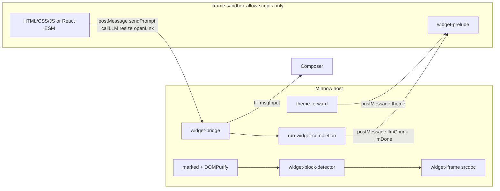

# Reef mode — agent handoff / context breakdown

Use this when continuing Reef work in a new session. Full spec: [`feature-reef-mode-widgets.md`](feature-reef-mode-widgets.md). Live index: [`../context.md`](../context.md) (Operating modes + Reef sections).

---

## What Reef is

**Reef** is Minnow’s fifth operating mode (`ModeId: 'reef'`). The assistant emits interactive UI as markdown fences tagged `reef-widget`. The host mounts them as **sandboxed iframes** inside assistant bubbles (not in user workspace files).

**Problem solved:** Normal markdown goes through DOMPurify, which strips `<script>`, so inline interactive UI cannot run. Reef scopes a dedicated prompt + iframe pipeline + `window.minnow` bridge without changing Build/Plan/Orchestrate/Research rendering.

**Mount gate:** Only when **active chat** `modeId === 'reef'`. In other modes, `reef-widget` fences stay syntax-highlighted `<pre><code>` blocks.

---

## Architecture (data flow)

1. `setAssistantBubbleContent` (renderer) parses markdown, sanitizes, highlights code.
2. `mountReefWidgets(bubble, { bubbleStreaming })` scans `pre[data-lang="reef-widget"]`.
3. If reef mode and `bubbleStreaming`: apply pending row (Building widget… / Styling… / Finishing up…) and return; if not streaming and fence is complete, replace `<pre>` with `.reef-widget-host` + iframe.
4. Iframe `srcdoc`: CSP, esm.sh importmap, theme CSS, widget HTML, injected prelude script.
5. Prelude defines `window.minnow.*`; posts to parent; host bridge handles actions.

---

## Locked product decisions

| Topic | Choice |
|-------|--------|
| Fence tag | `reef-widget` only (not `widget`, `artifact`, raw HTML) |
| React | importmap on esm.sh: react@19, react-dom/client, recharts@2, lodash-es@4, mathjs@14 |
| `sendPrompt` | Fills `#msgInput` + focus; **does not** auto-send |
| `callLLM` | Always in sandbox; provider/model from per-chat Reef overrides or chat defaults |
| Templates | Markdown in install dir; tools use `@minnow/reef/widgets/<name>.md` |
| Sandbox | `sandbox="allow-scripts"` only — no same-origin, popups, top nav, forms |
| Concurrent LLM | Max 2 widget `callLLM` requests (enforced synchronously in bridge) |

---

## File map

### Mode + prompts

| Path | Role |
|------|------|
| `src/chat/modes/types.ts` | `ModeId` includes `'reef'` |
| `src/chat/modes/registry.ts` | Reef entry, `toolPolicy: { default: 'allow' }` |
| `src/chat/prompts/modes/reef.full.md` | Full mode prompt (output contract, tokens, bridge, `@minnow` template paths) |
| `src/chat/prompts/modes/reef.lite.md` | Lite variant |
| `src/ui/mode-selector.ts` | Fifth segment via `listModes()`; on mode change: `unmountReefWidgetsInChat()` + `renderChatFromHistory()` |

### Host runtime (`src/chat/reef/`)

| Path | Role |
|------|------|
| `index.ts` | `mountReefWidgets`, `unmountReefWidgetsInChat`, re-exports `initReefBridge` |
| `widget-block-detector.ts` | Finds fences; gates reef mode + per-bubble `bubbleStreaming`; pending UI while stream; `data-reef-mounted` idempotency |
| `widget-pending-ui.ts` | Phase labels + dot row for streaming `reef-widget` fences |
| `widget-iframe.ts` | `buildReefWidgetSrcdoc`, `createReefWidgetIframe`; CSP + importmap |
| `theme-forward.ts` | Read host CSS vars; `subscribeThemeChanges` on `html[data-theme]` |
| `widget-prelude.ts` | `PRELUDE_SCRIPT` → `window.minnow` + auto-resize (`ResizeObserver`, `requestResize`) |
| `widget-bridge.ts` | Host `message` listener; sendPrompt / callLLM / resize / openLink |
| `run-widget-completion.ts` | SSE via `postChatCompletions`; `resolveWidgetLlmBinding()` |

### Templates (built-in)

`src/chat/reef/widgets/`: 15 built-ins (7 originals + 8 Phase 1: checklist, stats-dashboard, pie-chart, heatmap, quiz, qa-callllm, timeline, unit-converter) — each has description + one `reef-widget` fence.

**Tool path (not workspace):** `@minnow/reef/widgets/<name>.md`  
**Also synced to:** `~/.minnow/reef/widgets/` on `npm start`  
**Server:** `server/reef/widget-paths.js`, `server/reef/sync-widgets.js` — `resolveSafePath` and `find_files` redirect reef template lookups off workspace.

### Integration

| Path | Role |
|------|------|
| `src/markdown/renderer.ts` | Calls `mountReefWidgets(bubble, { bubbleStreaming })` after render |
| `src/main.ts` | Imports `reef-widgets.css`, `initReefBridge()` |
| `src/styles/reef-widgets.css` | `.reef-widget-host` styling |
| `src/types.ts` | `Chat.reefWidgetProviderId?`, `reefWidgetModelId?` |
| `src/state/sessions.ts` | `ensureChatShape` passes reef fields + `providerId` |
| `src/ui/reef-widget-settings.ts` | Settings → Modes → Reef LLM picker; `mountReefWidgetLlmSettings` |

### Tests

| Path | Count |
|------|-------|
| `test/chat/reef/*.test.mts` | 21 (happy-dom: detector, pending-ui, bridge, iframe, theme) |
| `test/server/reef-widget-paths.test.mjs` | 4 (install path resolution) |
| `test/modes/*` | reef in `MODE_IDS`, compose/load tests |

**Gate:** `npm run build` && `npm test` (~510 tests, 0 fail as of ship).

---

## Bridge API (iframe → host)

All messages: `{ type: 'reef', action, widgetId, ... }`. Origin: `'null'` (srcdoc) or same-origin.

| Action | Host behavior |
|--------|----------------|
| `sendPrompt` | Set `#msgInput`, dispatch `input`, focus — no `sendMessage()` |
| `callLLM` | `runWidgetCompletion` → stream `llmChunk` → `llmDone` (or `llmError`) |
| `resize` | Set host + iframe height (px) |
| `openLink` | `confirm()` then `window.open(..., 'noopener,noreferrer')` |

**LLM binding:** `reefWidgetProviderId ?? providerId ?? activeProvider`; `reefWidgetModelId ?? modelId`.

---

## Streaming behavior

- While the **bubble** render is streaming (`bubbleStreaming: true` from `setAssistantBubbleContent`), each `reef-widget` `<pre>` shows a pending row (Building widget… → Styling… → Finishing up… by tag order) with a dot pulse; raw fence code is hidden.
- On the **final** non-streaming render for that bubble, closed fences swap to iframe once. Global `app-state.streaming` may still be true on that final render; the mount gate uses only the per-bubble flag.
- `data-reef-mounted` on `<pre>` prevents duplicate mounts.

---

## Known gotcha (fixed)

**Templates are not in the user workspace.** Searching `src/chat/reef/widgets/*.md` under `.` fails. Prompts and server now use `@minnow/reef/widgets/`. `find_files` with pattern containing `reef/widgets` redirects search root to install dir.

---

## Out of scope (v1)

- `preview_widget(html)` tool
- Persist widget state across reload
- Server-side widget sandbox
- Widgets outside assistant bubbles
- Work-agent `defaultForModes: [reef]`

---

## Manual QA checklist

[`documentation/plans/verification/feature-reef.md`](verification/feature-reef.md) — items 1–12 + 10a (mode segment, calculator iframe, theme sync, bridge, overrides, sandbox, streaming, templates, impeccable, other modes unchanged).

---

## Related docs

- Plan: `documentation/plans/feature-reef-mode-widgets.md`
- Original spec: `c:\Users\dukky\.claude\plans\lets-plan-out-a-hashed-eagle.md`
- Cursor plan: `c:\Users\dukky\.cursor\plans\reef_mode_widgets_230c82de.plan.md`
