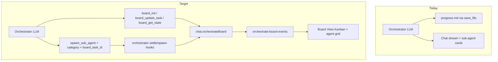
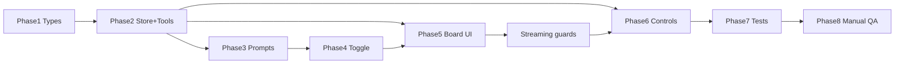

# Shiny Minsky — Board View implementation plan

Source spec: [we-want-to-create-shiny-minsky.md](file:///c:/Users/dukky/.claude/plans/we-want-to-create-shiny-minsky.md)

**Confirmed scope:** built-in board store (not markdown parsing); v1 stop + message + resume; explicit `category` on spawn; Orchestrate-only; **board-only streaming** (no chat bubbles in `#chatArea` while `viewMode === 'board'`).

**Product outcome:** One screen that shows plan shape (waves/tasks), live sub-agent work, progress, and controls—without losing the existing chat transcript when the user toggles back.

---

## Current baseline (what exists today)

| Area | Today | Gap |
|------|--------|-----|
| Orchestrate UI | Plan strip in [`index.html`](index.html) + [`src/ui/orchestrate-plan-selector.ts`](src/ui/orchestrate-plan-selector.ts) | No board / no view toggle |
| Progress | Prompt writes `documentation/progress/<plan>-progress.md` ([`orchestrate.full.md`](src/chat/prompts/modes/orchestrate.full.md) L31–71) | No structured task store |
| Sub-agents | [`src/agents/orchestrator.ts`](src/agents/orchestrator.ts), cards via [`src/ui/sub-agent-cards.ts`](src/ui/sub-agent-cards.ts) | No `category`, no `boardTaskId`, cards only in chat DOM |
| Parent turn | `parentTurnId` minted in [`src/tools/loop.ts`](src/tools/loop.ts) L569; `cancelAllForParentTurn` in orchestrator | Not persisted on chat for board “Stop orchestrator” |
| Chat render | [`renderChatFromHistory`](src/ui/messages.ts) L121 rebuilds `#chatArea` | No board branch |
| Tests | `test/orchestrate/*.test.mts` exist but **are not in** [`package.json`](package.json) `npm test` glob | New suites + wire orchestrate glob |



---

## Architecture

### Data ownership

- **Canonical state:** `Chat.orchestrateBoard?: OrchestrateBoardState` (persisted in `~/.minnow/sessions/state.json` via existing `touchChat` / `scheduleSaveSessions`).
- **Per-chat UI preference:** `Chat.viewMode?: 'chat' | 'board'` (default implicit `'chat'`).
- **Live sub-agents:** Still in orchestrator memory map; board **agent grid** reads `listActiveSubAgentRuns()` filtered by `parentChatId === chat.id`, enriched with `category` from run record.
- **Events:** New [`src/state/orchestrate-board-events.ts`](src/state/orchestrate-board-events.ts) — copy the small pattern from [`src/agents/sub-agent-events.ts`](src/agents/sub-agent-events.ts) (`subscribeBoardChanges(chatId, cb)`, `emitBoardChange(chatId)`).

### Tool execution context

Mirror sub-agent tools:

- Add `setBoardExecutorContext({ chatId })` (new module or alongside board-tools), set in `runChatTurn` next to `setSubAgentExecutorContext` ([`loop.ts`](src/tools/loop.ts) L570–574), cleared in `finally` L1097.
- `board_*` executors resolve chat via `findChatById(chatId)`; **reject** if `normalizeModeId(chat.modeId) !== 'orchestrate'`.

### Rendering dispatch (single choke point)

At top of [`renderChatFromHistory`](src/ui/messages.ts) (before L122 `clearSubAgentCardDomRegistry`):

```ts
if (chat.modeId === 'orchestrate' && chat.viewMode === 'board') {
  return renderBoardView(chat);
}
```

All other modes and `viewMode !== 'board'` keep **byte-identical** chat rendering.

### Board-only streaming (user choice)

While `viewMode === 'board'` and a turn is active:

1. **Do not append** to `#chatArea`: guard [`appendBubble`](src/ui/messages.ts) L318 and [`appendStreamingAssistantRow`](src/ui/messages.ts) L387 — if active chat is orchestrate + board, return minimal stubs / skip DOM (history + `pendingTurn` still updated in `loop.ts` as today).
2. **Board header** shows stream phase via existing `streaming` / `setSidebarStreamPhase` / `streamStatus` hooks (import from `app-state` or pass callback from `renderBoardView`).
3. On turn end (`finally` in `runChatTurn`), call `renderBoardView(chat)` (or `renderChatFromHistory`) so kanban reflects final tool updates.
4. **Sub-agent live cards:** Guard [`upsertSubAgentCardForRun`](src/ui/sub-agent-cards.ts) L93 — skip chat DOM when board view; board’s `subscribeSubAgentRuns` rebuilds agent grid instead.

---

## Phase 1 — Types and persistence

### 1.1 Add board types — [`src/types.ts`](src/types.ts)

Insert after `subAgentRuns` block (~L273):

- `BoardTaskStatus`: `'planned' | 'in_progress' | 'testing' | 'complete' | 'failed' | 'blocked'`
- `BoardCategory`: `'build' | 'fix' | 'test' | 'research'`
- `BoardTask`, `BoardWave`, `OrchestrateBoardState` (fields per spec: `planPath`, `tasks`, `waves`, timestamps, `activeParentTurnId`)

Extend `Chat`:

- `orchestrateBoard?: OrchestrateBoardState`
- `viewMode?: 'chat' | 'board'`

### 1.2 Sub-agent linkage types — [`src/agents/types.ts`](src/agents/types.ts)

- `SubAgentRun`: add `category?: BoardCategory`, `boardTaskId?: string | null`
- `SpawnSubAgentInput`: add `category?`, `boardTaskId?`
- `PersistedSubAgentRun` in [`src/types.ts`](src/types.ts) L206: add optional `category`, `boardTaskId` for drawer/cards after reload

### 1.3 Session + server shape

- [`ensureChatShape`](src/state/sessions.ts) L249: pass through `orchestrateBoard` (validate minimal shape: `tasks` array, numeric `waves`) and `viewMode` (`'chat' | 'board'` only).
- [`server/config/validators.js`](server/config/validators.js): same optional fields on chat rows (strip unknown keys, don’t break older blobs).
- **No schema version bump** — optional fields only.

---

## Phase 2 — Board store, events, and tools

### 2.1 Store — new [`src/state/orchestrate-board-store.ts`](src/state/orchestrate-board-store.ts)

Pure mutators (no DOM):

| Function | Behavior |
|----------|----------|
| `initBoard(chat, { planPath, tasks, waves })` | Create/replace board; set `startedAt` / `lastUpdatedAt`; `emitBoardChange` |
| `updateTask(chat, taskId, patch)` | Merge patch; recompute **wave rollup**; touch + save + emit |
| `getBoardState(chat)` | Return board or `null` |
| `findTaskByRunId(chat, runId)` | For orchestrator settle hook |

**Wave rollup algorithm** (document in file comment + unit tests):

For each `wave.id`, consider tasks where `task.wave === wave.id`:

- `complete` if every task is `complete`
- `in_progress` if any task is `in_progress`, `testing`, `failed`, or `blocked` (failed/blocked still “active wave”)
- else `planned`

**Progress %:** `completeCount / tasks.length` (failed/blocked do not count as complete).

### 2.2 Events — new [`src/state/orchestrate-board-events.ts`](src/state/orchestrate-board-events.ts)

- `subscribeBoardChanges(chatId, listener)` → unsubscribe fn
- `emitBoardChange(chatId)`
- `clearBoardListenersForTests()` for teardown

### 2.3 Tools — new [`src/tools/board-tools.ts`](src/tools/board-tools.ts)

Executors (use board executor context `chatId`):

| Tool | Args | Result |
|------|------|--------|
| `board_init` | `plan_path`, `tasks[{id,title,wave,category}]`, `waves[{id}]` | JSON snapshot; validates ids unique, waves referenced |
| `board_update_task` | `task_id`, `status`, optional `run_id`, `files_changed`, `notes`, `error` | Updated task JSON |
| `board_get_state` | none | Full `OrchestrateBoardState` JSON |

Validation highlights:

- `plan_path` should match `chat.orchestratePlanPath` when set (warn or hard-error — prefer **hard error** to prevent cross-plan corruption).
- `status` enum enforced.
- `board_init` allowed once per “run” unless explicit `reinit` not in v1 — **overwrite** board on second `board_init` is OK for resume re-parse (document in prompt).

### 2.4 Wire tools

- [`src/tools/definitions.ts`](src/tools/definitions.ts): register 3 tools (`category: 'agents'`, `serverRequired: false`).
- Extend `spawn_sub_agent` schema: `category` (enum), `board_task_id` (string).
- [`src/tools/client.ts`](src/tools/client.ts): route `board_*` like sub-agent block (~L145).
- [`src/chat/modes/registry.ts`](src/chat/modes/registry.ts) optional: add explicit `allow` entries for `board_*` under orchestrate (default allow already works).

### 2.5 Orchestrator hooks — [`src/agents/orchestrator.ts`](src/agents/orchestrator.ts)

**`spawnSubAgentInternal` (~L273):**

- Copy `category`, `boardTaskId` from input onto `SubAgentRun`.
- If `boardTaskId` + `parentChatId`: load parent chat, `updateTask(..., { assignedRunId: runId, status: 'in_progress', startedAt: Date.now() })`.

**`settleRun` (~L122):**

- After terminal status, if `run.boardTaskId` + parent chat has board:
  - `completed` → task `complete`, `endedAt`
  - `failed` / `cancelled` → task `failed` (or `blocked` if cancel reason is user-pause — v1 map `cancelled` → `failed` with error text)
  - Clear `assignedRunId` on terminal settle

**`sub-agent-executor.ts`:** pass `category`, `board_task_id` from args into `spawnSubAgent`.

**`sub-agent-session-sync.ts`:** persist `category`, `boardTaskId` on `PersistedSubAgentRun`.

---

## Phase 3 — Prompt revision (orchestrator contract)

Edit both:

- [`src/chat/prompts/modes/orchestrate.full.md`](src/chat/prompts/modes/orchestrate.full.md)
- [`src/chat/prompts/modes/orchestrate.lite.md`](src/chat/prompts/modes/orchestrate.lite.md)

Replace **Progress file format** (full L39–71) with **Board state**:

1. After parsing plan body (Wave Breakdown — no reliance on `todos:` front-matter; spec note is accurate), call **`board_init`** once with stable ids (`W1-A`, …), categories per task, and wave list.
2. Per-task loop: `board_update_task` for transitions:
   - Before builder spawn: optional `planned` → `in_progress` (or rely on spawn hook)
   - Before verifier: set `testing`
   - PASS → `complete` + `files_changed` / `notes`
   - FAIL → `failed` or `blocked` + user decision
3. Every `spawn_sub_agent`: **require** `category` + `board_task_id`; use `wait: false` + polling pattern unchanged.
4. **Remove** `documentation/progress/*.md` workflow and “most state in progress file” copy; chat replies stay short but board is source of truth.
5. Resume: call `board_get_state` first (also used by UI Resume button).

Add **status ↔ sub-agent type** guidance (conceptual, not enforced in code):

| Phase | Suggested `category` | Typical sub-agent |
|-------|---------------------|-------------------|
| Build | `build` | generalPurpose / builder task text |
| Verify | `test` | generalPurpose + test spec |
| Research | `research` | explore |
| Fix loop | `fix` | generalPurpose after FAIL |

---

## Phase 4 — View toggle UI

### 4.1 Markup — [`index.html`](index.html)

After `#orchestratePlanStrip` (~L572), add:

```html
<div id="viewModeToggle" class="view-mode-toggle hidden" role="radiogroup" aria-label="View">
  <button type="button" data-view="chat" aria-pressed="true">Chat</button>
  <button type="button" data-view="board" aria-pressed="false">Board</button>
</div>
```

Use class `view-mode-toggle` (no existing `seg-toggle` in repo — style new component in CSS).

### 4.2 Controller — new [`src/ui/view-mode-toggle.ts`](src/ui/view-mode-toggle.ts)

Mirror plan-selector patterns from [`orchestrate-plan-selector.ts`](src/ui/orchestrate-plan-selector.ts) L73–137:

- `syncViewModeToggleFromActiveChat()` — visible iff `mode === 'orchestrate'` **and** `chat.orchestratePlanPath` set
- `initViewModeToggle()` — click sets `chat.viewMode`, `touchChat`, `scheduleSaveSessions`, `renderChatFromHistory(chat)`
- `refreshViewModeToggleDisabled()` — disabled while `streaming` / recovery (same as plan select)

**Call sites** (grep `syncOrchestratePlanStripFromActiveChat` and add parallel call):

- [`src/ui/sidebar.ts`](src/ui/sidebar.ts)
- [`src/ui/mode-selector.ts`](src/ui/mode-selector.ts)
- [`src/main.ts`](src/main.ts)
- [`src/ui/init-file-panel.ts`](src/ui/init-file-panel.ts)
- [`src/tools/loop.ts`](src/tools/loop.ts) finally block (with plan selector refresh)

### 4.3 Boot — [`src/main.ts`](src/main.ts)

- `import './styles/orchestrate-board.css'`
- `initViewModeToggle()` next to `initOrchestratePlanSelector()`

### 4.4 Mode switch behavior

When leaving orchestrate mode: hide toggle; **do not** force `viewMode` change (stale `'board'` is harmless). When re-entering orchestrate with board preference, board renders if `orchestrateBoard` exists.

---

## Phase 5 — Board rendering and styling

### 5.1 Module — new [`src/ui/orchestrate-board.ts`](src/ui/orchestrate-board.ts)

`export function renderBoardView(chat: Chat): void`

**Lifecycle:**

- Dispose prior `currentBoardSession` unsubscribes (board events + sub-agent events).
- Clear `#chatArea`, mount `<section class="board-root">`.

**Layout sections:**

1. **Header** — plan short name from `orchestrateBoard.planPath`, stats strip (`done/total`, waves complete, active agent count, elapsed from `startedAt`), progress bar, controls.
2. **Main** — CSS grid: Kanban (4 columns) + collapsible **plan panel** (`read_file` via [`executeTool`](src/tools/client.ts) like file-viewer; fallback message if server off).
3. **Agent grid** — cards for `listActiveSubAgentRuns().filter(r => r.parentChatId === chat.id)` with category class (`.bt--build`, `.bt--fix`, `.bt--test`, `.bt--research`), stop `×` → `cancelSubAgent(runId)`.

**Kanban columns:**

| Column | Task statuses |
|--------|----------------|
| Planned | `planned`, `blocked` (blocked = red badge) |
| In Progress | `in_progress` |
| Testing | `testing` |
| Complete | `complete`, `failed` (failed = red badge in Complete column per spec) |

Task card content: `id`, `title`, category chip, optional `assignedRunId` link, `filesChanged` count, error snippet.

**Empty state** (plan selected, no `orchestrateBoard` yet): CTA “Run the orchestrator to initialize the board” + optional “Switch to Chat”.

**Subscriptions:**

```ts
subscribeBoardChanges(chat.id, rerender)
subscribeSubAgentRuns(rerender) // filter parentChatId
```

### 5.2 Styles — new [`src/styles/orchestrate-board.css`](src/styles/orchestrate-board.css)

- Token-only colors (`--bg`, `--surface`, `--border`, `--text`, `--accent`, radii, `--ease-out`)
- Grid: `.board-root`, `.kanban-grid` (4 equal columns), `.board-agent-grid`
- Category tints: `.bt--build`, `.bt--fix`, `.bt--test`, `.bt--research`
- Import in [`src/main.ts`](src/main.ts) (same pattern as `orchestrate-plan-selector.css`)

### 5.3 Impeccable polish pass

After functional markup: run **Impeccable** skill ([`src/skills/impeccable/SKILL.md`](src/skills/impeccable/SKILL.md)) for hierarchy, spacing, typography, status transitions—**no new color literals**.

---

## Phase 6 — Controls (stop / message / resume)

Implement in [`orchestrate-board.ts`](src/ui/orchestrate-board.ts):

| Control | Implementation |
|---------|----------------|
| **Stop sub-agent** | Card `×` → `cancelSubAgent(runId)` ([`orchestrator.ts`](src/agents/orchestrator.ts) L337) |
| **Stop orchestrator** | `stopGeneration()` (aborts SSE) + `cancelAllForParentTurn(chat.orchestrateBoard.activeParentTurnId)` when id present |
| **Send message** | Board textarea + Send → set `#msgInput` value OR new exported `sendUserMessage(text)` wrapping [`sendMessage`](src/chat/messaging.ts); respect orchestrate send gate |
| **Resume** | Inject fixed user text: `Resume the plan. Call board_get_state and continue from the first task whose status is not 'complete'.` via same send path |

### `activeParentTurnId` lifecycle — [`src/tools/loop.ts`](src/tools/loop.ts)

At L569 after minting `parentTurnId`:

```ts
if (normalizeModeId(chat.modeId) === 'orchestrate' && chat.orchestrateBoard) {
  chat.orchestrateBoard.activeParentTurnId = parentTurnId;
  touchChat(chat);
  scheduleSaveSessions();
}
```

Clear in `finally` when `completedNormally` or abort path (both branches), only for orchestrate board chats.

Disable **Stop orchestrator** when `!streaming` or missing `activeParentTurnId`.

---

## Phase 7 — Tests and CI wiring

### 7.1 Fix test runner gap

Add to [`package.json`](package.json) `npm test` script:

`test/orchestrate/**/*.test.mts`

(existing [`orchestrate-send-gate.test.mts`](test/orchestrate/orchestrate-send-gate.test.mts) currently never runs in CI).

### 7.2 New test files

| File | Focus |
|------|--------|
| [`test/tools/board-tools.test.mts`](test/tools/board-tools.test.mts) | `board_init` / `board_update_task` / `board_get_state` validation + happy path |
| [`test/orchestrate/board-store.test.mts`](test/orchestrate/board-store.test.mts) | Wave rollup, progress %, event emission |
| [`test/orchestrate/orchestrator-board-link.test.mts`](test/orchestrate/orchestrator-board-link.test.mts) | Spawn with `board_task_id` → `in_progress`; settle → `complete`/`failed` |
| [`test/ui/view-mode-toggle.test.mjs`](test/ui/view-mode-toggle.test.mjs) | Toggle visibility; dispatch guard (happy-dom, mirror [`sub-agent-cards.test.mts`](test/ui/sub-agent-cards.test.mts)) |
| [`test/ui/orchestrate-board-streaming.test.mjs`](test/ui/orchestrate-board-streaming.test.mjs) | **Board-only streaming:** `appendBubble` does not mutate `#chatArea` when board mode |

Use fixed ids / static JSON expected strings per test guidelines.

### 7.3 Verification doc

Add [`documentation/plans/verification/feature-orchestrate-board.md`](documentation/plans/verification/feature-orchestrate-board.md) checklist mirroring spec verification section.

### 7.4 Update [`documentation/context.md`](documentation/context.md)

New subsection under Operating modes: Board View files, tools (+3 → **45** tools in catalog), `viewMode`, persistence fields, test paths.

Copy finalized plan to [`documentation/plans/shiny-minsky-board-view.md`](documentation/plans/shiny-minsky-board-view.md) when implementation starts (per project plan storage rule).

---

## Phase 8 — Manual E2E checklist

Prerequisites: `npm start`, Orchestrate mode, plan under `documentation/plans/`.

1. Toggle appears when plan selected; Board replaces `#chatArea`.
2. Orchestrator calls `board_init` → tasks/waves appear; columns update on `board_update_task`.
3. Sub-agent grid shows category styling; per-card stop works.
4. Stop orchestrator aborts turn + child runs.
5. Board send + Resume enqueue turns; model continues from `board_get_state`.
6. Toggle Chat → full history unchanged; toggle Board → board restored from session.
7. Switch sidebar chat → correct board per chat.
8. Reload mid-run → board state persists; live agents may be empty until new spawns (expected).

---

## Risk register and mitigations

| Risk | Mitigation |
|------|------------|
| Streaming corrupts board DOM | Board-only guards on `appendBubble` / `appendStreamingAssistantRow`; rerender board on turn end |
| `board_init` out of sync with selected plan | Validate `plan_path` against `chat.orchestratePlanPath` |
| Old progress.md sessions | Prompt no longer writes them; no auto-migration (acceptable per spec) |
| `assignedRunId` overwritten builder→verifier | Agent grid still lists all active runs; card shows latest run id on task |
| Orchestrate tests not in CI | Wire `test/orchestrate/**` in `package.json` |
| Tool count / docs drift | Update `context.md` tool count and Orchestrate section |

---

## Implementation order (recommended)



Phases 4–6 can overlap after Phase 2 lands; prompts (Phase 3) should ship before dogfooding E2E.

---

## Files summary

**Create:** `orchestrate-board-store.ts`, `orchestrate-board-events.ts`, `board-tools.ts`, `view-mode-toggle.ts`, `orchestrate-board.ts`, `orchestrate-board.css`, 5 test files, verification md.

**Edit:** `types.ts`, `agents/types.ts`, `orchestrator.ts`, `sub-agent-executor.ts`, `sub-agent-session-sync.ts`, `definitions.ts`, `client.ts`, `loop.ts`, `orchestrate.full.md`, `orchestrate.lite.md`, `messages.ts`, `sub-agent-cards.ts`, `index.html`, `main.ts`, `sessions.ts`, `validators.js`, `package.json`, `context.md`.

**Reuse:** `sub-agent-events` pattern, `cancelSubAgent` / `cancelAllForParentTurn`, `renderMarkdown`, `discoverOrchestratePlans` / `read_file`, `touchChat` / `scheduleSaveSessions`.
