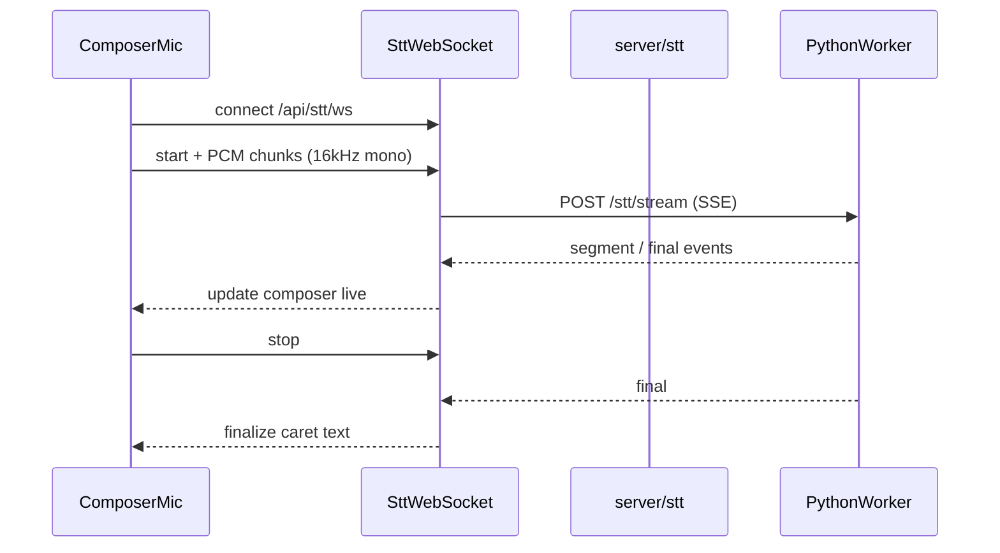

# Streaming STT for Local Whisper

## Goal

Show transcription **live in the composer textarea** while the mic is recording, instead of waiting until recording stops. Scope: **`stt.backend === 'local'` only**; provider STT keeps the batch `POST /api/stt/transcribe` flow.

## Architecture

## Key files

| Layer | File | Role |
|-------|------|------|
| Client | `src/voice/stt-stream-client.ts` | PCM capture + WebSocket |
| Client | `src/voice/dictation-range.ts` | Anchor caret, committed + interim text |
| Client | `src/ui/composer-voice.ts` | Branch streaming vs batch |
| Node | `server/stt/stt-ws.js` | `/api/stt/ws` upgrade |
| Node | `server/stt/stream-session.js` | Per-connection bridge |
| Node | `server/stt/stt-protocol.js` | JSON message helpers |
| Node | `server/voice/local-stt.js` | `createLocalSttStream()` → worker SSE |
| Worker | `server/voice/python/worker.py` | faster-whisper + `/stt/stream` |

## Config

- `voice.stt.local.streamingEnabled` (default `true`) — toggle live dictation for local backend.
- `GET /api/stt/status` adds `streaming` and `streamingSupported` (local + worker reachable + streaming enabled).

## UX

| Event | Composer behavior |
|-------|-------------------|
| Mic start | Anchor caret; clear dictation range |
| `segment` | Append to committed, clear interim |
| `partial` | Set interim after committed |
| Silence / mic stop | WS `stop` → `final` reconciles text |
| Error | Restore pre-dictation value |

Provider STT and disabled streaming fall back to batch MediaRecorder → `POST /api/stt/transcribe`.

## Provisioner

`faster-whisper` is installed via **Repair** in Models → Voice (`server/voice/provision.js`). Batch local transcribe uses the same faster-whisper model as streaming.

## Tests

- `test/stt/stt-protocol.test.mjs`
- `test/voice/dictation-range.test.mts`
- `test/stt/stream-session.test.mjs`
- `test/stt/transcribe.test.mjs` (status fields)
