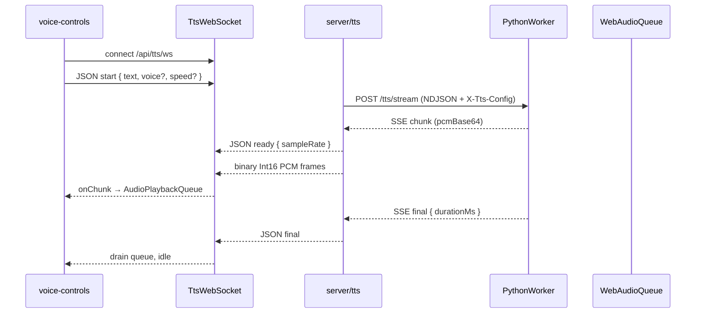
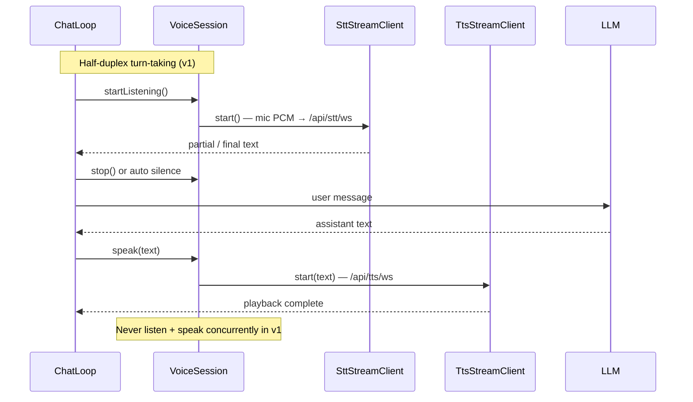

# Streaming TTS for Local Qwen3-TTS

## Goal

Stream synthesized speech to the browser **as PCM chunks arrive** from the local Qwen3-TTS worker, instead of waiting for a full WAV from `POST /api/tts/synthesize`. Scope: **`tts.backend === 'local'` only**; provider TTS keeps batch `/v1/audio/speech`; browser TTS uses `speechSynthesis`.

## Implementation status

| Phase | Scope | Status |
|-------|--------|--------|
| 1 | Dual residency (STT + TTS loaded independently) | ✅ Shipped |
| 2 | Worker `/tts/stream` NDJSON + SSE PCM | ✅ Shipped |
| 3 | Node bridge `createLocalTtsStream` + `/api/tts/ws` | ✅ Shipped |
| 4 | Browser `TtsStreamClient` + `AudioPlaybackQueue` + read-aloud | ✅ Shipped |
| 5 | Voice chat foundation hooks (`VoiceSession`, `speakStreamingText`) | ✅ Shipped |
| 6 | Tests + this document | ✅ Shipped |

## Architecture

### Read-aloud (shipped)

### Future voice chat (deferred)

## Protocol spec

### Browser ↔ Node (`/api/tts/ws`)

Loopback-only WebSocket upgrade ([`server/tts/tts-ws.js`](../../server/tts/tts-ws.js)).

**Client → server (JSON text frames)**

| `type` | Fields | Notes |
|--------|--------|-------|
| `start` | `text` (required), `voice?`, `speed?` | Begins one synthesis session |
| `cancel` | — | Aborts in-flight worker stream |
| `ping` | — | Health probe; server replies with `ready` |

**Server → client**

| Frame | Payload | Notes |
|-------|---------|-------|
| JSON | `{ type: "ready", sampleRate: number }` | Sent once before first PCM chunk |
| Binary | Little-endian Int16 mono PCM | One or more chunks |
| JSON | `{ type: "final", durationMs?: number }` | Stream complete |
| JSON | `{ type: "error", message: string }` | Fatal error |

Helpers: [`server/tts/tts-protocol.js`](../../server/tts/tts-protocol.js), [`src/voice/tts-stream-client.ts`](../../src/voice/tts-stream-client.ts).

### Node ↔ Worker (`POST /tts/stream`)

**Request**

- Header: `X-Tts-Config: <JSON>` — local TTS model config (mode, speaker, streaming tuning).
- Body: NDJSON lines, one op per line:
  - `{ "op": "start", "text": "..." }` — required first line
  - `{ "op": "append", "text": "..." }` — optional mid-stream text (future chat streaming)
  - `{ "op": "finish" }` — required last line

**Response** (`text/event-stream`)

| Event | Data | Notes |
|-------|------|-------|
| `chunk` | `{ pcmBase64, sampleRate, frameIndex }` | Raw PCM bytes (worker native width) |
| `final` | `{ durationMs? }` | Synthesis complete |
| `error` | `{ message }` | Worker failure |

Bridge: [`server/voice/local-tts.js`](../../server/voice/local-tts.js) (`createLocalTtsStream`, `parseTtsSseBlock`). Session relay: [`server/tts/stream-session.js`](../../server/tts/stream-session.js).

### Worker internals

[`server/voice/python/worker.py`](../../server/voice/python/worker.py) — `TtsStreamSession` calls qwen-tts `stream_generate_*` APIs. `enable_streaming_optimizations()` when the streaming fork is installed. Tuning: `voice.tts.local.streaming` (emit/decode windows, overlap, repetition penalty).

## Key files

| Layer | File | Role |
|-------|------|------|
| Client | `src/voice/tts-stream-client.ts` | WebSocket + PCM callbacks |
| Client | `src/voice/audio-playback-queue.ts` | Hann crossfade gapless Web Audio |
| Client | `src/ui/voice-controls.ts` | Read-aloud, `speakStreamingText` hook |
| Client | `src/voice/voice-session.ts` | `VoiceSession` interface + stub |
| Node | `server/tts/tts-ws.js` | `/api/tts/ws` upgrade |
| Node | `server/tts/stream-session.js` | Per-connection bridge |
| Node | `server/tts/tts-protocol.js` | JSON message helpers |
| Node | `server/voice/local-tts.js` | `createLocalTtsStream()` → worker SSE |
| Worker | `server/voice/python/worker.py` | Qwen3-TTS + `/tts/stream` |

## Config

- `voice.tts.streaming` (default `true`) — enable WebSocket streaming for local backend.
- `GET /api/tts/status` adds `streaming` and `streamingSupported` (local + worker reachable + streaming enabled).
- Dual residency: STT and TTS models can stay loaded together; `/models/load` evicts only the same kind.

## Voice chat roadmap (not shipped)

| Milestone | Description |
|-----------|-------------|
| Turn-taking | `VoiceSession` alternates `listening` ↔ `speaking`; no full duplex |
| Chat wiring | Call `speakStreamingText` on completed assistant bubbles during live generation |
| Sentence chunking | Feed partial LLM text via NDJSON `append` ops (Odysseus-style streaming TTS) |
| Echo cancellation | Keep `echoCancellation: true` on STT mic; pause STT while TTS plays |
| Half-duplex UX | Push-to-talk or VAD gate — avoid mic pickup of speaker output |
| Full duplex | Requires AEC hardware or server-side ducking; out of scope for v1 |

**Deferred:** push-to-talk UI, duplex voice chat, automatic chat-loop integration. Use [`VoiceSessionStub`](../../src/voice/voice-session.ts) and [`speakStreamingText`](../../src/ui/voice-controls.ts) as integration points.

## Tests

- `test/voice/dual-residency.test.mjs` — independent STT/TTS `modelLoaded`
- `test/tts/tts-protocol.test.mjs` — WS JSON parse/format
- `test/tts/stream-session.test.mjs` — eligibility + PCM relay
- `test/voice/local-tts-stream.test.mjs` — SSE parser + `createLocalTtsStream`
- `test/voice/tts-stream-worker.test.mjs` — NDJSON/SSE worker contract
- `test/voice/tts-stream-client.test.mts` — browser client parser
- `test/voice/audio-playback-queue.test.mts` — crossfade scheduler
- `test/tts/synthesize.test.mjs` — cache, speed validation, streaming status
- `test/voice/voice-session.test.mts` — stub state machine
- `test/ui/voice-controls.test.mts` — speech text extraction + streaming hook guards

## Related

- Built-in voice system: [`built-in-voice-system.md`](built-in-voice-system.md)
- Streaming STT (composer dictation): [`streaming-stt.md`](streaming-stt.md)
- Runtime architecture: [`documentation/context.md`](../context.md) — Built-in Voice section
