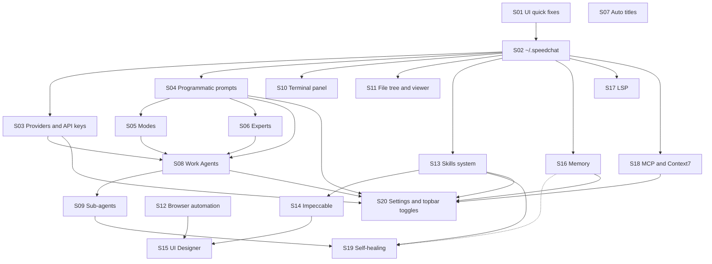
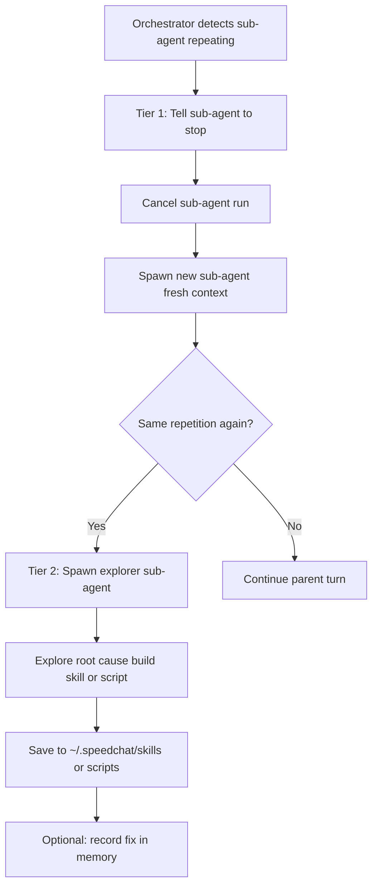

# SpeedChat to-fix — ordered steps for sub-agents

Source backlog: [`documentation/plans/to-fix.md`](documentation/plans/to-fix.md)  
Current architecture: [`documentation/context.md`](documentation/context.md) (Vite SPA + `server.js` tool API; persistence today is **browser `localStorage`** only).

## Why this order



**Principles:**
- Fix visible UX bugs and streaming affordances first (low risk, no schema work).
- Move persistence to **`~/.speedchat`** before anything that needs durable config (providers, prompts, skills, memory, MCP/LSP).
- Build the **prompt / agent intelligence layer** before sub-agents, browser automation, and skills that depend on routing.
- **Terminal** and **file UI** reuse existing server file/git/command tools ([`server.js`](server.js), [`src/tools/definitions.ts`](src/tools/definitions.ts)).
- **Skills → Impeccable → UI Designer** is a deliberate chain.
- **Full settings + top-bar toggles** come last (per your preference: single consolidation step).

**Parallelism:** After S02 completes, S03 and S04 can run in parallel. After S08, S10 and S11 can run in parallel. After S13, S17 and S18 can run in parallel with S16.

**Sub-agent workflow (every step):** Each step is built by one **implementer** sub-agent, then checked by a separate **verifier** sub-agent. See [Verification workflow (all steps)](#verification-workflow-all-steps).

---

## Wave 0 — Immediate UX (no new persistence)

### Step 01 — Chat UX polish and streaming affordances

**Backlog items:** 15, 16, 24, 25 (chat bar spacing, top bar cleanup, streaming animation, “Generating response…” label — **not** LSP/MCP items 26–28)  
**Done (out of scope):** Backlog item 2 — empty chat bubble on new chats (already fixed).

**Depends on:** nothing

**High-level concept for sub-agent:**
- **Composer / chat bar spacing:** Tune [`src/styles/input.css`](src/styles/input.css) and composer markup in [`index.html`](index.html) (attach row, tools area if present).
- **Top bar cleanup:** Remove redundant **New chat** / **Open chat panel** controls — sidebar already has `createChat()` ([`index.html`](index.html) `btnNewChatTop` vs sidebar `chat-new-wide`; mobile rules in [`src/styles/responsive.css`](src/styles/responsive.css)).
- **Streaming animation:** Replace the lone blinking square (`.cursor` in [`src/styles/messages.css`](src/styles/messages.css)) with a clearer “thinking” vs “generating response” state; after reasoning ends and prose streams, show an explicit **Generating response…** label (not a blank/hidden bubble).

**Deliverable:** Polished chat surface; update [`documentation/context.md`](documentation/context.md) message-rendering section.

**Verification:** UI smoke or DOM tests for empty state vs streaming states; verifier re-runs `npm run build` + manual checklist from [`documentation/plans/tool-usage-verification.md`](documentation/plans/tool-usage-verification.md) where applicable.

---

## Wave 1 — Foundation

### Step 02 — `~/.speedchat` data layer and migration

**Backlog items:** 2

**Depends on:** Step 01 (optional; can start in parallel)

**High-level concept:**
- Define a canonical home dir: `~/.speedchat/` (Windows: `%USERPROFILE%\.speedchat`).
- Layout sketch: `config.json`, **`sessions/state.json`** (single session blob — not per-chat files), `memory/`, `providers/`, `mcp/`, `lsp/`, `prompt-configs/` (saved Full/Lite/**Custom** profiles), backups. **Built-in prompts** in [`src/chat/prompts/`](src/chat/prompts/); **user prompt overrides** in `~/.speedchat/prompts/`. **Built-in skills** in [`src/skills/`](src/skills/); **user skills** in `~/.speedchat/skills/`.
- **Server is source of truth** when `npm start` is running: new API routes (e.g. `GET/PUT /api/config/*`) read/write under home dir with safe path guards (extend [`server.js`](server.js) `resolveSafePath` pattern).
- **One-time migration** from `localStorage` keys (`speedchat-sessions-v1`, `speedchat.tools`, `speedchat.systemPrompt`) on first launch.
- Browser keeps a thin cache or always proxies to server; degrade gracefully when Vite-only (`npm run dev`).

**Deliverable:** Config module + migration; replace direct `localStorage` usage in [`src/state/sessions.ts`](src/state/sessions.ts), [`src/tools/config.ts`](src/tools/config.ts), [`src/ui/settings.ts`](src/ui/settings.ts).

**Verification:** API tests for config read/write + migration fixture; verifier re-runs on clean `~/.speedchat` temp dir.

**Blocks:** Steps 03–20.

---

## Wave 2 — Connectivity

### Step 03 — Multiple providers and API authentication

**Backlog items:** 3, 4

**Depends on:** Step 02

**High-level concept:**
- Provider registry in `~/.speedchat/providers/` (LM Studio today is one entry; add OpenAI-compatible endpoints).
- Per-provider: base URL, default models list refresh, optional **API key** / Bearer / custom headers.
- Refactor [`src/api/models.ts`](src/api/models.ts) and chat URLs in [`src/api/chat.ts`](src/api/chat.ts) / [`src/tools/loop.ts`](src/tools/loop.ts) to resolve provider per request (not only `#serverUrl` in settings drawer).
- Secrets never in git; stored only under `~/.speedchat`.

**Deliverable:** Provider CRUD + wired chat/model fetch.

**Verification:** Mock provider HTTP tests; verifier confirms multi-provider model list + auth header injection.

---

## Wave 3 — Prompt and agent intelligence

**Prompt home:** All shipped programmatic prompts live under [`src/chat/prompts/`](src/chat/prompts/) (alongside [`src/chat/messaging.ts`](src/chat/messaging.ts)). Optional user overrides merge from `~/.speedchat/prompts/` (same subfolder layout, user wins on `id` conflict).

**Wave 3 must ship an example template** (Step 04) that documents the full prompt system for humans and sub-agents — not just code.

**Prompt profiles (Full / Lite / Custom):** The composer supports three global profiles, switchable in settings (UI fully built in Step 20; **engine + schema in Step 04**):

| Profile | Behavior |
|---------|----------|
| **Full** | All enabled prompt parts use full shipped templates — maximum guidance, higher token use. |
| **Lite** | Minimize input tokens: short/lite template variants, omit optional layers, cap memory/history injection; prefer `src/chat/prompts/lite/` or front-matter `liteBody` where defined. |
| **Custom** | User-defined per-part enable/disable and editable text; **named configurations** saved under `~/.speedchat/prompt-configs/` with **load / save / duplicate / delete** in settings. |

**Per-profile prompt text in settings (Step 20):** Users can edit **different prompt content for Full, Lite, and Custom** — not a single shared body. Storage pattern:
- Shipped defaults: `src/chat/prompts/{full|lite}/<part>/` or front-matter `fullBody` / `liteBody` on each file.
- User edits: `~/.speedchat/prompts/overrides/full/`, `.../lite/`, `.../custom/` (or embedded in `prompt-configs/*.json` for Custom).
- Settings UI switches profile tab → loads the matching override set for each prompt part.

Each **prompt part** is independently **enabled or disabled** (in Custom, and as overrides when not locked by Full/Lite presets).

Suggested tree (sub-agent may refine):

```
src/chat/prompts/
  _example/              # Reference template + README (do not use in production routing)
  lite/                  # Optional shortened variants for Lite profile
  experts/
  modes/
  tool-usage/
  info/
  work-agents/
  titles/
```

---

### Step 04 — Programmatic prompts (Cursor / OpenCode style)

**Backlog items:** 6

**Depends on:** Step 02

**Reference material (read before designing — do not copy verbatim without license review):**

| Source | Use for |
|--------|---------|
| [system-prompts-and-models-of-ai-tools](https://github.com/x1xhlol/system-prompts-and-models-of-ai-tools) | How other products structure system prompts, tool rules, and personas |
| [anomalyco/opencode](https://github.com/anomalyco/opencode) | Layered prompts, agents, tools, config shape |
| [oh-my-opencode-slim](https://github.com/alvinunreal/oh-my-opencode-slim) | Token-efficient / “lite” prompt patterns |
| Local uploads (workspace) | `uploads/system-prompts-and-models-of-ai-tools-0.md`, `uploads/opencode-1.md`, `uploads/oh-my-opencode-slim-2.md` |
| [OpenCode docs — Agents / Rules](https://opencode.ai/docs/) | Official config and prompt layering |

Add `documentation/plans/references/prompt-sources.md` summarizing what SpeedChat adopted vs diverged (implementer writes; verifier checks it exists).

**High-level concept:**

**Dual-root prompts (mirror skills pattern):**

| Location | Role |
|----------|------|
| [`src/chat/prompts/`](src/chat/prompts/) | **Built-in defaults** — versioned with the app. Add files here to ship new experts, modes, tool-usage fragments, etc. |
| `~/.speedchat/prompts/` | **User overrides** — custom experts, edited mode packs; same directory layout. |

**Composable prompt parts** (each is a settings-editable unit with `enabled: boolean` + content source):

| Part id | Typical content | Notes |
|---------|-----------------|-------|
| `base` | Core assistant identity | Always on in Full; shortened in Lite |
| `mode` | Build / Plan / Orchestrate / Research | Off if mode layer disabled |
| `expert` | Expert persona fragment | Off if expert disabled or Auto with no match |
| `tool-usage` | How to call tools | Lite uses minimal tool rules |
| `info` | Extra instructions / presets | Often trimmed or off in Lite |
| `memory` | Retrieved memory block | Off if memory feature disabled globally |
| `work-agent` | Work Agent system prompt | When a Work Agent is active |
| `skill` | Injected `/skill` body | When user invokes a skill |

**Profile engine** (`prompt-composer.ts`):
- **`full`:** enable all parts that the active session features need; load full templates from `src/chat/prompts/`.
- **`lite`:** apply Lite rules per part (skip optional sections, use `lite/` files or truncated bodies, reduce interpolation payload e.g. shorter `{{enabled_tools}}` summary).
- **`custom`:** merge the active **saved configuration** from `~/.speedchat/prompt-configs/<name>.json` (per-part `enabled` + optional `contentOverride` text).

**Composition order:**  
`base` → `mode` → `expert` → `work-agent` → `tool-usage` → `info` → `skill` → `memory` → user message.  
Research OpenCode/Cursor layered prompts; wire into `buildApiMessages` in [`src/tools/loop.ts`](src/tools/loop.ts).

Replace or augment hardcoded [`SYSTEM_PROMPT_PRESETS`](src/constants.ts) with loadable templates from `src/chat/prompts/`; keep presets as seed content or migrate into `info/` on first load.

**Custom configuration schema** (persisted in `~/.speedchat/prompt-configs/`):

```json
{
  "id": "my-debug-setup",
  "label": "Debug minimal",
  "profile": "custom",
  "parts": {
    "base": { "enabled": true, "contentOverride": null },
    "mode": { "enabled": true },
    "expert": { "enabled": false },
    "tool-usage": { "enabled": true, "contentOverride": "Use tools sparingly." }
  }
}
```

- `contentOverride: null` → use shipped file; non-null → use edited text from settings.
- API: `listPromptConfigs`, `loadPromptConfig`, `savePromptConfig`, `deletePromptConfig`.
- Active config id stored in `~/.speedchat/config.json` (or session-level override later).

**Example template (required deliverable):**  
Add `src/chat/prompts/_example/` containing:

1. **`PROMPT_TEMPLATE.md`** (or `SKILL.md`-style) — a fully commented **reference prompt** showing everything a prompt file *can* include, for example:
   - **Front matter / metadata:** `id`, `label`, `kind` (`expert` | `mode` | `tool-usage` | `info` | `work-agent` | `title`), `version`, `description`
   - **When it applies:** mode bindings, expert triggers, tool policies
   - **Body sections:** role, constraints, output format, tool-use rules, safety, examples
   - **Interpolation tokens** the runtime provides (document each): e.g. `{{mode}}`, `{{expert}}`, `{{enabled_tools}}`, `{{cwd}}`, `{{memory}}`, `{{user_message}}`, `{{chat_history_summary}}`
   - **Composition hints:** which layer this file belongs in and what it must not duplicate
   - **Profile behavior:** how this file is used in **Full** vs **Lite** (e.g. `liteBody` in front matter or sibling file in `lite/`)
   - **Per-part toggles:** which `part id` controls inclusion in settings
2. **`README.md`** — how to **programmatically** work with SpeedChat’s prompt system:
   - Where the loader scans (`src/chat/prompts/**` + user dir)
   - How to add a new prompt (drop file in the right subfolder; no registry file if glob-based)
   - Which modules to call from the send path (`loadPrompt`, `composeSystemPrompt`, hooks in [`src/chat/messaging.ts`](src/chat/messaging.ts) / loop)
   - How modes, experts, Work Agents, and `/` skills reference prompt `id`s
   - How overrides in `~/.speedchat/prompts/` merge with built-ins
   - **Full / Lite / Custom** profiles and how to add a new **saved custom configuration**

**Deliverable:** Prompt loader + composer with **part-level enable/disable** and **Full / Lite / Custom** profiles (separate content resolution per profile); custom config save/load API; **`_example` template pack**; `documentation/plans/references/prompt-sources.md`; wire-up in send path (settings UI deferred to Step 20). Document schema in [`documentation/context.md`](documentation/context.md).

**Verification:** Unit tests for composer (Full vs Lite token length, part enable/disable, custom config merge); verifier agent re-runs tests + spot-checks composed system prompt output for a fixture session.

**Blocks:** Steps 05, 06, 07 (title prompt), 08.

---

### Step 05 — Operating modes (Build, Plan, Orchestrate, Research)

**Backlog items:** 7

**Depends on:** Step 04

**References:** [OpenCode](https://github.com/anomalyco/opencode) agent/mode patterns; `uploads/opencode-1.md`; user-supplied mode prompts when ready.

**User input required:** You may replace template stubs with final copy; templates ship in-repo so the step is not blocked.

**High-level concept:**
- Four modes, each backed by a prompt file in [`src/chat/prompts/modes/`](src/chat/prompts/) + optional tool policy (e.g. Plan may discourage `execute_command`).
- **Mode selector UI near the chat window** (composer area or strip above messages — not top bar).
- Research OpenCode’s mode switching for parity; persist last mode per chat in `~/.speedchat/sessions/`.

**Mode template pack (required deliverable):**  
Add `src/chat/prompts/modes/_template/` (and working stubs for each mode):

| File | Purpose |
|------|---------|
| `MODE_TEMPLATE.md` | Commented template: metadata, goals, tool policy, output format, anti-patterns |
| `build.full.md` / `build.lite.md` | Build mode — full vs lite bodies |
| `plan.full.md` / `plan.lite.md` | Plan mode |
| `orchestrate.full.md` / `orchestrate.lite.md` | Orchestrate mode |
| `research.full.md` / `research.lite.md` | Research mode |

Lite variants must be substantially shorter (study [oh-my-opencode-slim](https://github.com/alvinunreal/oh-my-opencode-slim) for trimming patterns). Wire `kind: mode` + `id` front matter so Step 04 composer picks `full` vs `lite` body by active profile.

**Deliverable:** Mode enum, UI control, prompt routing, **mode template pack** + four mode stubs.

**Verification:** Tests that each mode id resolves correct full/lite file; verifier confirms mode switch changes composed system prompt.

---

### Step 06 — Expert system (auto + manual)

**Backlog items:** 8

**Depends on:** Step 04 (Step 05 recommended first)

**High-level concept:**
- **Experts** = named prompt profiles in [`src/chat/prompts/experts/`](src/chat/prompts/) (user overrides in `~/.speedchat/prompts/experts/`).
- **Auto:** lightweight classifier (small model call or rules) picks expert from user input.
- **Manual:** dropdown near chat (Auto + expert list); overrides auto for the session/turn.
- Wire into prompt composer from Step 04.

**Deliverable:** Expert registry, router, UI dropdown.

---

### Step 07 — Programmatic chat titles

**Backlog items:** 9

**Depends on:** Step 03 (needs a model); Step 02 for persistence

**High-level concept:**
- On first user message, fire a **short, non-streaming** title job (replace [`maybeAutoTitleChat`](src/state/sessions.ts) heuristic).
- Use a dedicated title prompt in [`src/chat/prompts/titles/`](src/chat/prompts/); store generated title in session blob under `~/.speedchat`.
- Keep sidebar fast: don’t block send on title (async update + sidebar refresh).

**Deliverable:** Title agent hook + updated sidebar naming.

---

### Step 08 — Work Agents (OpenCode “lite” agents)

**Backlog items:** 10, 11, 12

**Depends on:** Steps 03, 04, 05 (06 optional)

**User input required:** Work Agent prompt definitions.

**High-level concept:**
- **Work Agents** = task-specific agents (build, review, test, etc.) with own system prompt file.
- Per agent: default **provider + model** (from Step 03).
- Prompt files in [`src/chat/prompts/work-agents/<id>/`](src/chat/prompts/) (user overrides in `~/.speedchat/prompts/work-agents/`); full settings editor UI in Step 20.
- Entry point: mode or slash/command or orchestrator picks a Work Agent for a turn.

**Deliverable:** Agent registry, model binding, prompt editor API (UI minimal until Step 20).

---

### Step 09 — Sub-agent orchestration

**Backlog items:** 13, 14

**Depends on:** Step 08

**High-level concept:**
- Parent agent can spawn **sub-agents** (isolated context + tool subset) for parallel work.
- Settings schema (stored in `~/.speedchat`): per sub-agent type — model/provider, **max concurrent**, allowed tools.
- Implement orchestration in [`src/tools/loop.ts`](src/tools/loop.ts) or new `src/agents/orchestrator.ts` with clear turn boundaries and aggregated results back to parent chat.
- Design for **orchestrator control**: cancel a running sub-agent, spawn a replacement with fresh context (required by Step 19 self-healing).

**Deliverable:** Sub-agent runner + config; document limits (concurrency, timeouts).

---

## Wave 4 — Workspace UI

### Step 10 — Terminal panel

**Backlog items:** 1

**Depends on:** Step 02 (log paths); existing `execute_command` server tool

**High-level concept:**
- **Bottom docked panel** below chat (collapsible, resizable).
- Stream stdout/stderr from server tool runs and optionally from explicit “run in terminal” actions.
- WebSocket or SSE from `server.js` for live output; show command history per chat session.

**Deliverable:** Terminal UI + server streaming endpoint.

---

### Step 11 — File tree sidebar and split file viewer

**Backlog items:** 5 (file viewer / browser — line 5 in backlog)

**Depends on:** Step 02; server file tools already exist

**High-level concept:**
- **Right pop-out file tree** (mirror chat sidebar pattern in [`src/ui/sidebar.ts`](src/ui/sidebar.ts) / [`src/styles/sidebar.css`](src/styles/sidebar.css)): cwd root, expand/collapse, click to open.
- **Split main area:** chat left, file viewer right (Monaco or CodeMirror-style read-only first; edit optional later).
- Use existing `list_directory`, `read_file`, `read_file_range` via [`src/tools/client.ts`](src/tools/client.ts).

**Deliverable:** File explorer + viewer components; layout CSS in new `src/styles/file-panel.css`.

---

## Wave 5 — Browser automation

### Step 12 — Screenshots and full browser control

**Backlog items:** 17, 18

**Depends on:** Step 02; Step 10 helpful for debugging

**Primary reference:** [different-ai/opencode-browser](https://github.com/different-ai/opencode-browser) — Chrome DevTools Protocol (CDP), explicit `browser_url`, snapshot UIDs, no hidden singleton browser.

**High-level concept:**
- Prefer **CDP** over heavy Playwright-only wrapper when possible (align with opencode-browser):
  - `browser_list`, `browser_navigate`, `browser_snapshot` (a11y tree + `[uid]` markers), `browser_click`, `browser_fill`, `browser_eval`, `browser_screenshot`
  - Each tool call takes `browser_url` (default `http://127.0.0.1:9222` or `OPENCODE_BROWSER_URL`-style env `SPEEDCHAT_BROWSER_URL`)
  - Optional `target_id` for multi-tab
- Implement in `server.js` (Node CDP client) or thin adapter; keep [`src/tools/browser-executor.ts`](src/tools/browser-executor.ts) for simple fetch tools until migrated.
- **Chat display:** render screenshot attachments inline in message history (extend [`src/types.ts`](src/types.ts) / message renderer).
- Document Chrome launch: `--remote-debugging-port=9222` in README.
- Security: allowlist origins, user toggle in config (wired in Step 20).

**Deliverable:** CDP tool definitions + executor + chat image bubbles; optional skill stub under `src/skills/browser-automation/` pointing at workflow from opencode-browser README.

**Verification:** Integration tests against a mock CDP endpoint or recorded fixtures; verifier runs tests + manual smoke with debug Chrome if available.

**Blocks:** Step 15 (UI Designer screenshots).

---

## Wave 6 — Skills

### Step 13 — Skills framework and default pack

**Backlog items:** 19

**Depends on:** Step 02

**High-level concept:**

**Two skill roots (merged at runtime):**

| Location | Role |
|----------|------|
| [`src/skills/`](src/skills/) | **Built-in defaults** — versioned with the app. User has already started adding skills here; **adding a new folder under `src/skills/` is how we ship more default skills** (e.g. `src/skills/<skill-id>/SKILL.md`). |
| `~/.speedchat/skills/` | **User-created / agent-authored** skills (self-healing tier 2, manual imports). Overrides built-in on same `id` if configured that way. |

**Discovery:** On `npm start`, server (or client via API) scans both trees — convention: one skill per subdirectory with a `SKILL.md` (Cursor Agent Skills format: front matter + body). List merges built-ins + user skills for the `/` picker.

**Slash UX:**
- **`/`** in composer lists all available skills (built-in + user).
- **`/<skill-id>`** injects that skill’s instructions into the prompt or runs a skill runner hook.

**Extending defaults:** No separate “skill pack” install step — contributors drop a new directory under `src/skills/` and register nothing else if discovery is glob-based. Existing starter skills in `src/skills/` should be wired first, then expand the default set (git, docs, testing, etc.).

**Deliverable:** Skill loader (dual-root), slash UI, send-pipeline injection; document `src/skills/` layout in [`documentation/context.md`](documentation/context.md).

---

### Step 14 — Impeccable built-in

**Backlog items:** 20

**Depends on:** Step 13

**High-level concept:**
- Install [impeccable.style](https://impeccable.style) as part of project setup (`npm` script or postinstall).
- `/impeccable` skill file lives under [`src/skills/impeccable/`](src/skills/) (or equivalent id), reading project [`.impeccable/design.json`](.impeccable/design.json) and [`DESIGN.md`](DESIGN.md).
- Document in README setup path.

**Deliverable:** Setup hook + default skill; no duplicate design logic.

---

### Step 15 — UI Designer (skill / Work Agent)

**Backlog items:** 21

**Depends on:** Steps 12, 14; Step 08 for dedicated model binding

**High-level concept:**
- **UI Designer** = skill or Work Agent that runs Impeccable workflow: screenshot UI → critique → plan or implement UI changes.
- Uses Step 12 screenshots + Step 14 Impeccable task flow.
- **Dedicated provider/model** in config (consumed in Step 20 settings UI).

**Deliverable:** `/ui-designer` or Work Agent profile + tool allowlist.

---

## Wave 7 — External servers

### Step 16 — Memory system

**Backlog items:** 23

**Depends on:** Step 02

**High-level concept:**
- Persistent memory store under `~/.speedchat/memory/` (markdown or JSON chunks with embeddings optional later).
- Enable/disable per chat or globally; **clear** and **backup/restore** commands.
- Inject retrieved memory into prompt composer (Step 04) when enabled.

**Deliverable:** Memory CRUD API + prompt injection hook.

---

### Step 17 — LSP server integration

**Backlog items:** 26

**Depends on:** Step 02; Step 11 helpful

**References:**
- [OpenCode LSP docs — built-ins and custom servers](https://opencode.ai/docs/lsp/#custom-lsp-servers) — **default server list and config shape**
- [OpenCode `packages/opencode/src/lsp`](https://github.com/anomalyco/opencode/tree/dev/packages/opencode/src/lsp) — `client.ts`, `launch.ts`, `server.ts`, `diagnostic.ts`, `language.ts` for implementation patterns

**High-level concept:**

**Defaults enabled out of the box** (user can turn off per server in Step 20 settings). Seed `~/.speedchat/lsp.json` from OpenCode’s built-in table — prioritize SpeedChat’s stack:

| Server id | Extensions (summary) | Notes |
|-----------|----------------------|--------|
| `typescript` | .ts, .tsx, .js, .jsx, … | When `typescript` dep in project |
| `eslint` | .ts, .js, .vue, … | When eslint in project |
| `pyright` | .py, .pyi | Python |
| `rust` | .rs | rust-analyzer on PATH |
| `gopls` | .go | |
| `lua-ls` | .lua | |
| `yaml-ls` | .yaml, .yml | |
| `bash` | .sh, .bash, … | |
| `vue` / `svelte` / `astro` | per framework | When project detected |

Sub-agent should import the **full** OpenCode built-in table from [LSP Servers docs](https://opencode.ai/docs/lsp/#custom-lsp-servers) into `src/lsp/defaults.json` (or equivalent) and enable sensible subset by default; document “add more” in context.md.

**Config shape** (OpenCode-compatible):

```json
{
  "lsp": {
    "typescript": { "disabled": false },
    "custom-lsp": {
      "command": ["custom-lsp-server", "--stdio"],
      "extensions": [".custom"],
      "env": {},
      "initialization": {}
    }
  }
}
```

- **On file open / agent tool:** match extension → start server if not running (see OpenCode `launch.ts` flow).
- **Settings (Step 20):** master LSP on/off; **per-server enable/disable**; **add custom server** UI (command, extensions, env, initialization).
- **Agent tools:** diagnostics first (`textDocument/publishDiagnostics` → formatted string for LLM); later definitions/references.
- Persist config in `~/.speedchat/lsp.json`; merge with repo defaults on upgrade.

**Deliverable:** LSP process manager in `server.js`, default catalog, settings hooks (data model; full UI in Step 20), diagnostic tool(s).

**Verification:** Tests with a minimal fake LSP stdio server or fixture diagnostics; verifier confirms typescript server starts when `.ts` file touched (or mocked).

---

### Step 18 — MCP servers + Context7 default

**Backlog items:** 27, 28 (MCP servers + Context7 default — **not** top-bar item 29; that is Step 20)

**Depends on:** Step 02; Step 03 for auth headers on MCP transports

**High-level concept:**
- MCP client in Node (`server.js` or sidecar): list tools/resources per configured server in `~/.speedchat/mcp/`.
- **Context7** bundled and **enabled by default** (document API key in `~/.speedchat` if required).
- Bridge MCP tools into OpenAI-style function list for [`getEnabledToolDefinitions`](src/tools/client.ts).

**Deliverable:** MCP registry, Context7 seed config, tool bridge.

---

## Wave 8 — Self-improvement

### Step 19 — Self-healing (optional, two-tier)

**Backlog items:** 30

**Depends on:** Steps 09, 13 (Step 16 optional for remembering tier-2 fixes)

**High-level concept:**

Self-healing is **off by default** (toggle in Step 20 settings). When enabled, the **orchestrator** (not the stuck sub-agent) handles repetition using a **two-tier** escalation — try the cheap fix first, only build tooling on recurrence.



**Tier 1 — Stop and restart (first occurrence)**
- Orchestrator detects **repetition** (heuristics: duplicate tool calls + identical args, same error N times, no progress on file/task token, or loop counter per sub-agent run).
- Orchestrator sends an explicit instruction to the sub-agent: **you are repeating yourself; stop**.
- **Cancel** the sub-agent (abort in-flight request / clear partial tool state).
- **Start a new sub-agent** with a clean context and the same high-level task (optionally inject a short “avoid repeating X” note from what was detected).

**Tier 2 — Explore and build a fix (second occurrence)**
- If the **same class of repetition** happens again after a tier-1 restart (same sub-agent type + same failure signature within the parent turn or session window — sub-agent defines exact matching rules).
- Orchestrator spawns a dedicated **explorer sub-agent** (may use a broader tool set than the original) to investigate the root cause.
- Explorer may author a **skill** (`~/.speedchat/skills/`) or **script** (`~/.speedchat/scripts/` or repo `scripts/`) to address the issue.
- Optionally record in **memory** (Step 16) that this fix exists so future runs can reuse it.
- Guardrails: user approval before running new executable scripts; cap disk usage; audit log in `~/.speedchat/logs/`.

**Out of scope for v1:** Auto-running tier 2 on generic tool failures unrelated to repetition; tier 2 is specifically **after tier 1 failed once**.

**Deliverable:** Repetition detector in orchestrator, tier-1 stop/restart flow, tier-2 explorer + skill/script authoring path, config flag.

---

## Wave 9 — Consolidation

### Step 20 — Full settings page and top-bar controls

**Backlog items:** 22 (full settings page), 29 (top-bar expert / tool / MCP toggles)

**Depends on:** All prior feature steps (data models must exist)

**High-level concept:**
- Replace narrow settings **drawer** with a full **settings page** (route or full-screen panel).

**Prompting section (required):**
- **Profile toggle:** **Full** | **Lite** | **Custom** (radio or segmented control) — drives composer from Step 04.
- **Per-profile editing:** Selecting Full, Lite, or Custom switches which **saved prompt overrides** are shown — users edit **different text per profile**, not one shared textarea:
  - **Full tab:** edit overrides under `~/.speedchat/prompts/overrides/full/` (fallback to `src/chat/prompts/` / `fullBody`)
  - **Lite tab:** edit overrides under `.../lite/` (fallback to `lite/` shipped variants)
  - **Custom tab:** per-part overrides + named config load/save (`~/.speedchat/prompt-configs/*.json`)
- **When Custom is selected:**
  - Dropdown to **load** a saved configuration
  - **Save** / **Save as…** / **Delete** / **New configuration**
- **Separate editable parts** — one block per prompt part (`base`, `mode`, `expert`, `tool-usage`, `info`, `memory`, `work-agent`, `skill`):
  - **Enable / disable** toggle per part (respects active profile)
  - **Textarea** (or Monaco) bound to the **active profile’s** override path
  - **Reset to shipped default** per part per profile
  - Link to open underlying file in `src/chat/prompts/` for advanced users (optional)
- **Feature master toggles** — enable/disable prompt-related features globally (each maps to parts or separate flags): memory injection, expert layer, mode layer, tool-usage block, programmatic titles, Work Agent prompts, skill injection, self-healing, sub-agents, MCP/LSP context blocks, etc.

**Other settings sections:** providers, keys, modes, experts, Work Agents, sub-agents, tools, MCP, LSP, memory backup, UI Designer model, terminal, browser automation, skills paths.

**Top bar quick controls:** expert selector (or link to chat-area control), **per-tool toggles**, **per-MCP-server toggles** (mirror [`src/tools/config.ts`](src/tools/config.ts) patterns).

**Import/export:** full `~/.speedchat` backup including `prompt-configs/` and prompt overrides.

**Deliverable:** Unified settings UX with **Full / Lite / Custom** prompting UI and per-part editors; retire scattered drawer-only fields where duplicated.

---

## Verification workflow (all steps)

Every step uses **two sub-agents**:

| Role | Responsibility |
|------|----------------|
| **Implementer** | Detailed plan → code → **write tests** → **run tests locally** → update `documentation/context.md` |
| **Verifier** | Read step acceptance criteria only → **re-run full test command** → smoke/manual checklist → pass/fail report (no feature code) |

**Rules:**
- Verifier must be a **different** agent session than implementer.
- No step is complete until verifier reports **PASS** (or user waives with written reason).
- Prefer deterministic tests (fixed UUIDs, static expected strings) per project test guidelines.
- Test location: extend `test/`, `scripts/*-smoke.mjs`, or `npm test` if added in Step 02+.
- Optional: `documentation/plans/verification/step-NN.md` per step with commands and expected output (implementer creates, verifier executes).

---

## Sub-agent handoff template

For each step, give the **implementer** agent:

1. **Step ID + title** from this plan  
2. **Backlog line numbers** from [`to-fix.md`](documentation/plans/to-fix.md)  
3. **Depends on** (prior step IDs)  
4. **Read first:** [`documentation/context.md`](documentation/context.md) + linked source files + step **References** tables  
5. **Out of scope:** Other steps unless a minimal integration hook is required  
6. **Must update:** [`documentation/context.md`](documentation/context.md) when behavior or paths change  
7. **Tests:** implement + run; document command in step verification file  
8. **User-provided assets:** Steps 05 and 08 — template stubs ship in-repo; user copy can replace later  

Then give the **verifier** agent:

1. Same step ID + acceptance criteria from this plan  
2. Commands from implementer’s verification file  
3. Re-run tests; report PASS/FAIL with logs  
4. Do not merge or implement fixes (send FAIL back to implementer)

---

## Summary table

| Step | Title | Backlog #s (`to-fix.md` line = item) | Can parallel after |
|------|--------|--------------------------------------|-------------------|
| 01 | Chat UX polish | 15, 16, 24, 25 | — |
| 02 | ~/.speedchat | 2 | 01 |
| 03 | Providers + API keys | 3, 4 | 02 |
| 04 | Prompts + Full/Lite/Custom + `_example` | 6 | 02 |
| 05 | Modes | 7 | 04 |
| 06 | Experts | 8 | 04 |
| 07 | Auto titles | 9 | 02, 03 |
| 08 | Work Agents | 10–12 | 03, 04, 05 |
| 09 | Sub-agents | 13, 14 | 08 |
| 10 | Terminal panel | 1 | 02 |
| 11 | File tree + viewer | 5 | 02 |
| 12 | Browser automation | 17, 18 | 02 |
| 13 | Skills | 19 | 02 |
| 14 | Impeccable | 20 | 13 |
| 15 | UI Designer | 21 | 12, 13, 14, 08 |
| 16 | Memory | 23 | 02 |
| 17 | LSP | 26 | 02 |
| 18 | MCP + Context7 | 27, 28 | 02, 03 |
| 19 | Self-healing (2-tier) | 30 | 09, 13 |
| 20 | Settings, Full/Lite/Custom UI, topbar | 22, 29 | all |

**Suggested first three agents:** Step 01 → Step 02 → (Step 03 ∥ Step 04).
