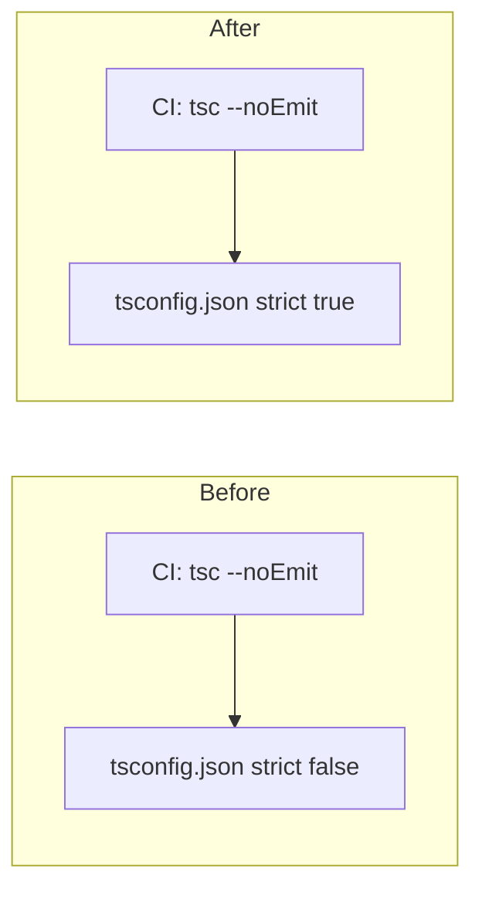

# Enable TypeScript `strict` for `src/`

## Baseline (Aug 2026)

Before flipping `strict: true` in [`tsconfig.json`](../../tsconfig.json), `npx tsc --noEmit --strict` reported **~132 errors** on `src/`. Work was grouped into three themes:

| Theme | Scope |
|-------|--------|
| **`.mjs` shims** | Co-located `.d.mts` companions + [`src/types/mjs-shims.d.ts`](../../src/types/mjs-shims.d.ts) index for shared JS modules (`untrusted`, `session-schema`, `document-extensions`, `registry`, `resolve-model-api`, `derive-messages-path`, `anthropic-thinking-style`, `harness-registry`, server board-testing constants) |
| **DOM guards** | TS18047 / canvas `getContext` nullability (wallpaper, models API, preview/terminal UI) |
| **Null / undefined policy** | Align wire-format `null` with TS optional fields or normalize at boundaries (agents/controller, board-tools, onboarding, synthesis, sub-agent-runner) |

Deferred (not in this effort): `exactOptionalPropertyTypes`, `noUncheckedIndexedAccess`; `test/**/*.mts` remains outside root `tsconfig.json`.

## Current state

| Project | Config | Strict |
|---------|--------|--------|
| SPA / shared client [`tsconfig.json`](../../tsconfig.json) | `include: ["src"]`, `noEmit: true` | **`strict: true`** |
| Electron shell [`electron/tsconfig.json`](../../electron/tsconfig.json) | separate compile step | **`strict: true`** (already) |

CI and local dev gate: `npx tsc --noEmit` ([`.github/workflows/ci.yml`](../../.github/workflows/ci.yml)). `npm run build` runs `tsc && vite build` using the same root config (emit disabled via `noEmit`, but the typecheck still runs).

Tests (`test/**/*.mts`) are **not** in `tsconfig.json`; they run via `tsx` + [`test/test-loader.mjs`](../../test/test-loader.mjs) without this gate. Scope: **strict on `src/` only**, standard `strict` bundle only.

## What `strict: true` turns on

TypeScript’s `strict` enables, among others:

- `strictNullChecks` — `null` and `undefined` are distinct; nullable values must be narrowed
- `noImplicitAny` — implicit `any` is an error (including untyped JS module imports)
- `strictFunctionTypes`, `strictBindCallApply`, `strictPropertyInitialization`, `noImplicitThis`, `alwaysStrict`, `useUnknownInCatchVariables`

Measured before enablement (`npx tsc --noEmit --strict`):

- **~132 errors** total
- **109** with `--strictNullChecks` alone (nullability dominates)
- **85** with `--noImplicitAny` alone (overlap with strict)

### Error codes (strict on `src/`, pre-fix baseline)

| Code | Count | Meaning |
|------|-------|---------|
| TS2345 | 32 | Argument not assignable (often `null` vs `undefined`, union narrowing) |
| TS18047 | 27 | Value is possibly `null` |
| TS18048 | 22 | Value is possibly `undefined` |
| TS7016 | 21 | No declaration file for `.mjs` import (`noImplicitAny`) |
| TS2322 | 20 | Assignment to incompatible type |
| TS7006 | 3 | Explicit implicit `any` parameters |
| Others | 9 | TS2783 duplicate props, TS2531 null, TS7017 global index, etc. |

### Hotspot files (error count, baseline)

Concentrated in UI and orchestration: [`src/brain/client.ts`](../../src/brain/client.ts) (11), [`src/os/wallpaper/minnow-fish.ts`](../../src/os/wallpaper/minnow-fish.ts) (10), [`src/ui/tool-messages.ts`](../../src/ui/tool-messages.ts) (8), [`src/ui/skill-picker.ts`](../../src/ui/skill-picker.ts) (5), [`src/agents/controller/controller.ts`](../../src/agents/controller/controller.ts) (5), plus scattered onboarding, preview, file-viewer, and tools modules.

**Do not enable now** (for future reference only): `exactOptionalPropertyTypes` (~911 errors with strict), `noUncheckedIndexedAccess` (~660 with strict).

---

## Issue themes and how to fix them

### 1. `null` vs `undefined` in domain types (~50+ errors)

Strict null checks surface a long-standing pattern: persisted JSON and API payloads use **`null`**, while many TypeScript optional fields use **`undefined`** only.

Examples from `tsc --strict`:

- `BoardTask.assignedRunId`: updates pass `string | null` into `Partial<Pick<BoardTask, …>>` expecting `string | undefined` ([`src/agents/controller/controller.ts`](../../src/agents/controller/controller.ts))
- Onboarding steps pass `null` into helpers typed `string | undefined` ([`src/onboarding/steps/*.ts`](../../src/onboarding/steps/))
- Message unions: `AssistantToolCallMessage.content` is `string | null` vs helpers expecting `string` ([`src/synthesis/post-turn.ts`](../../src/synthesis/post-turn.ts))
- `undefined` vs `number | null` mismatches ([`src/agents/sub-agent-runner.ts`](../../src/agents/sub-agent-runner.ts), [`src/chat/prompts/token-estimate.ts`](../../src/chat/prompts/token-estimate.ts))

**Remediation choices** (pick per boundary, stay consistent):

- **Normalize at boundaries**: keep wire/storage as `null`, map to `undefined` when entering TS-only APIs (`value ?? undefined` or small normalizers).
- **Align types with wire format**: add `| null` to fields that are actually nullable in JSON (e.g. board task IDs, optional API fields). Prefer this when `null` is intentional in [`src/state/session-schema.mjs`](../../src/state/session-schema.mjs) / server validators.
- **Narrow before use**: local `if (x == null) return` for DOM and canvas code.

**Risk if fixed only with assertions**: hiding real bugs (e.g. calling functions with `null` when runtime expects a string). Prefer narrowing or type alignment over `as` casts.

### 2. Untyped `.mjs` imports (21× TS7016, plus TS7006)

Shared logic lives in plain JS with JSDoc ([`src/lib/untrusted.mjs`](../../src/lib/untrusted.mjs), [`src/state/session-schema.mjs`](../../src/state/session-schema.mjs), [`src/attachments/document-extensions.mjs`](../../src/attachments/document-extensions.mjs), [`src/skills/library/registry.mjs`](../../src/skills/library/registry.mjs), [`src/lib/resolve-model-api.mjs`](../../src/lib/resolve-model-api.mjs), etc.). TypeScript importers get **implicit `any`** under `noImplicitAny`.

**Remediation options** (minimal-diff order):

1. **Ambient module shims** — add [`src/types/mjs-shims.d.ts`](../../src/types/mjs-shims.d.ts) (or per-module `.d.mts`) declaring exports for import paths used from `.ts`. With `moduleResolution: "bundler"`, co-located `.d.mts` beside each `.mjs` is required for resolution.
2. **`allowJs` + `checkJs`** on a narrow include for those `.mjs` files — leverages existing JSDoc; higher effort, better long-term accuracy for [`session-schema.mjs`](../../src/state/session-schema.mjs).
3. **Migrate hot modules to `.ts`** — best for small libs (`untrusted`, `document-extensions`); avoid big-bang migration of `session-schema.mjs` in the same PR unless time allows.

Also: [`src/dev/test-board-seed.ts`](../../src/dev/test-board-seed.ts) imports [`server/orchestrate/board-testing/constants.js`](../../server/orchestrate/board-testing/constants.js) without types — add a shim or move shared constants to a typed shared module.

### 3. DOM and canvas nullability (~40 errors)

- `document.querySelector` → `Element | null` passed to `HTMLElement` helpers ([`src/api/models.ts`](../../src/api/models.ts)) — use `HTMLElement` query, or narrow/cast after `instanceof HTMLElement`.
- `canvas.getContext('2d')` → `CanvasRenderingContext2D | null` ([`src/os/wallpaper/minnow-fish.ts`](../../src/os/wallpaper/minnow-fish.ts)) — early return if `!ctx` after context creation.

**Risk**: low for behavior; mostly guard clauses.

### 4. Optional chaining on partial state (~6 errors)

[`src/chat/stop-all-agent-activity.ts`](../../src/chat/stop-all-agent-activity.ts): `sessionState.groups` possibly `undefined` — align with `SessionState` type (required vs optional) or default `groups ?? []` at read sites.

### 5. `unknown` and structural types (~few errors)

- [`src/chat/context/llm-summarize.ts`](../../src/chat/context/llm-summarize.ts): `unknown` from parsed JSON needs type guards before passing to helpers.
- [`src/research/client.ts`](../../src/research/client.ts): `ResearchLibraryItem` vs `Record<string, unknown>` — use a type guard or overload instead of blind index access.

### 6. Minor / one-off

- [`src/chat/undo-turn.ts`](../../src/chat/undo-turn.ts): TS7017 `globalThis` index — extend [`src/window-globals.d.ts`](../../src/window-globals.d.ts) or use a typed global flag (test loader already uses `globalThis.__MINNOW_TEST_LOADER_REGISTERED`).
- [`src/companion/bootstrap.ts`](../../src/companion/bootstrap.ts): `string | undefined` → `string` — validate or default before assignment.

---

## Recommended execution order

Work in branches or sequential commits inside one PR to keep review manageable:

1. **Add `.mjs` declaration shims** (clears ~24 errors, unblocks implicit-any fallout in [`src/skills/library-api.ts`](../../src/skills/library-api.ts)).
2. **DOM / canvas guards** (wallpaper, models API, preview/terminal UI) — mechanical, low product risk.
3. **Null vs undefined policy** — orchestrate/board + agents first (controller, sub-agent-runner, board-tools), then onboarding, then synthesis/chat.
4. **Flip** `"strict": true` in [`tsconfig.json`](../../tsconfig.json) (or flip first and fix until green — either works; flipping last avoids partial strict IDE noise).
5. **Verify**: `npx tsc --noEmit`, `npm test`, `npm run build` on Windows + Linux (matches CI matrix).

No change to Electron config (already strict). No new CI step unless you later add `test/` typecheck.

---

## What this might cause (product / process)

| Area | Effect |
|------|--------|
| **CI** | `typecheck + tests` job fails until all strict errors fixed; no other workflow change. |
| **IDE / LSP** | After flip, tsserver uses strict diagnostics for all of `src/` — developers see errors in real time (intended). |
| **Runtime** | Most fixes are type-level; boundary fixes (null checks) can change behavior only where code previously threw on null (e.g. missing canvas context). |
| **Refactors** | Aligning `null` on types may encourage using `null` in more places — keep server/client schema ([`session-schema.mjs`](../../src/state/session-schema.mjs), server validators) in sync. |
| **Velocity** | Short-term PR size ~132 touch points across ~60 files; batch by theme above. |
| **Tests** | Existing tests should still pass; they do not enforce strict types on test code. Regressions caught only where strict fixes change runtime guards. |
| **Future React plan** | [`documentation/plans/references/plan-out-converting-this-app-to-react-for-a-ui-framework-spec.md`](references/plan-out-converting-this-app-to-react-for-a-ui-framework-spec.md) assumed a strict `src/react/tsconfig.json` — enabling root strict first aligns the legacy tree with that direction. |

---

## Success criteria

- `npx tsc --noEmit` passes with `"strict": true` in [`tsconfig.json`](../../tsconfig.json).
- CI green on Windows and Ubuntu.
- No new `@ts-ignore` without justification; existing suppressions in `src/` ([`src/chat/prompts/prompt-loader.ts`](../../src/chat/prompts/prompt-loader.ts)) re-checked under strict.

---

## Todos

- [x] Record baseline (~132 strict errors, error-code breakdown) in this plan (Aug 2026)
- [x] Add typed declarations for `.mjs` modules imported from `src/*.ts` (untrusted, session-schema, document-extensions, registry, resolve-model-api, derive-messages-path, anthropic-thinking-style, harness-registry, server constants)
- [x] Fix TS18047 / Element nullability in wallpaper, models API, and other DOM-heavy UI files
- [x] Resolve null vs undefined mismatches in agents/controller, board-tools, onboarding, synthesis, sub-agent-runner (align types or normalize at boundaries)
- [x] Set `strict: true` in `tsconfig.json` and fix remaining errors until `npx tsc --noEmit` is clean
- [x] Run `npx tsc --noEmit`, `npm test`, and `npm run build` locally; confirm CI matrix parity
- [x] Update [`documentation/context.md`](../../context.md) to document strict TypeScript for `src/`
